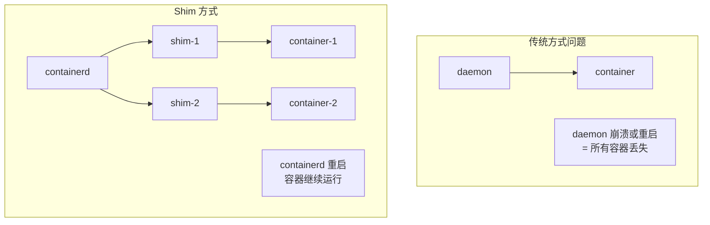
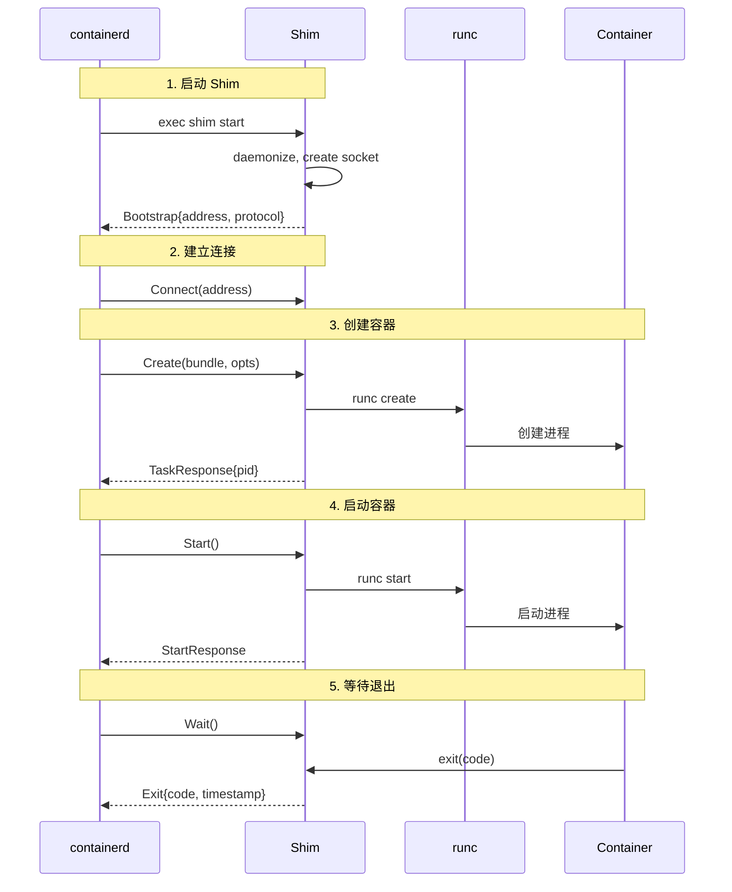
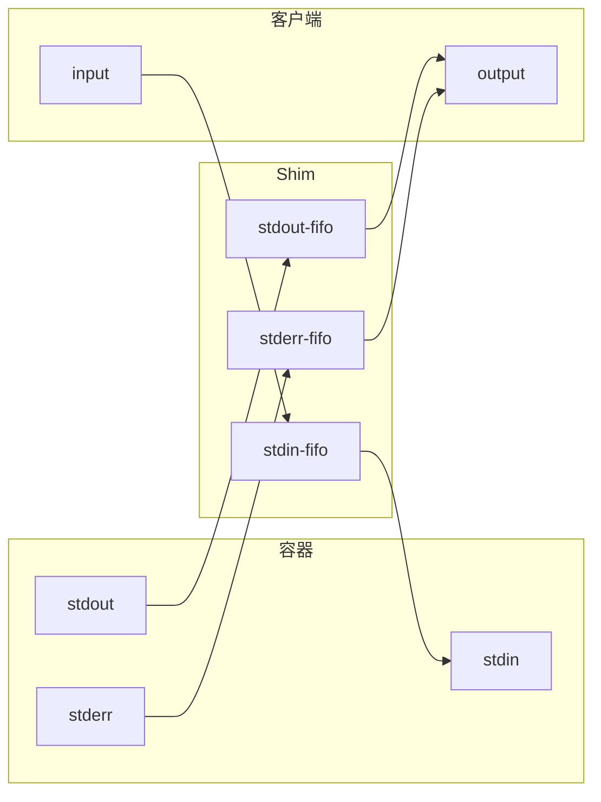
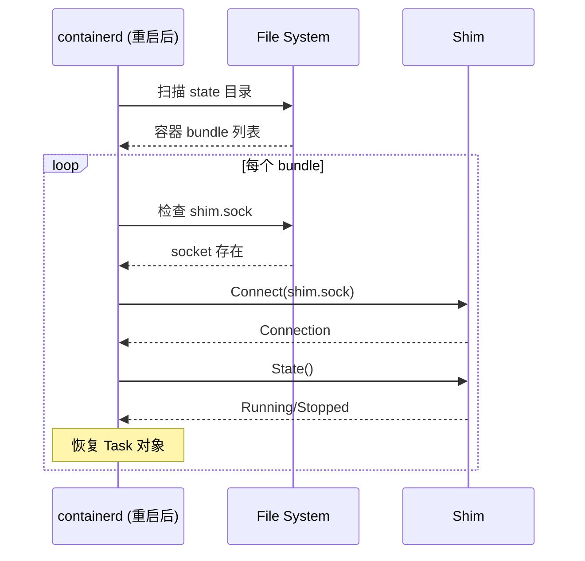

Shim（垫片）是 containerd 与容器进程之间的中间层，它是实现容器独立性的关键组件。

## Shim 设计哲学

### 为什么需要 Shim



### Shim 的职责

1. **进程监管**：作为容器进程的父进程
2. **I/O 转发**：管理 stdin/stdout/stderr
3. **信号处理**：转发和处理信号
4. **状态报告**：向 containerd 报告容器状态
5. **资源清理**：容器退出后清理资源

## Shim 协议版本

### Runtime v2

containerd 1.2+ 使用的现代 Shim 协议：

```
协议: TTRPC over Unix Socket
二进制命名: containerd-shim-<runtime>-v2
示例: containerd-shim-runc-v2
```

### 通信流程



## Shim 启动过程

### Bootstrap 协议

```go
// pkg/shim/shim.go

type BootstrapParams struct {
    // Version 协议版本
    Version int `json:"version"`

    // Address Shim 监听地址
    Address string `json:"address"`

    // Protocol 协议类型 (ttrpc, grpc)
    Protocol string `json:"protocol"`
}
```

### 启动流程

```go
// cmd/containerd-shim-runc-v2/main.go

func main() {
    // 解析命令
    if os.Args[1] == "start" {
        // 启动模式：daemonize 并返回 bootstrap 信息
        startShim()
        return
    }

    // 运行模式：作为 TTRPC 服务器运行
    runShim()
}

func startShim() {
    // 1. 创建 socket 路径
    address := filepath.Join(bundlePath, "shim.sock")

    // 2. Fork 新进程
    cmd := exec.Command(os.Args[0], "run")
    cmd.SysProcAttr = &syscall.SysProcAttr{
        Setsid: true, // 创建新会话
    }
    cmd.Start()

    // 3. 输出 bootstrap 信息
    params := BootstrapParams{
        Version:  2,
        Address:  address,
        Protocol: "ttrpc",
    }
    json.NewEncoder(os.Stdout).Encode(params)
}
```

## Shim TTRPC 服务

### 服务接口

```protobuf
// api/runtime/task/v2/shim.proto

service Task {
    rpc State(StateRequest) returns (StateResponse);
    rpc Create(CreateTaskRequest) returns (CreateTaskResponse);
    rpc Start(StartRequest) returns (StartResponse);
    rpc Delete(DeleteRequest) returns (DeleteResponse);
    rpc Pids(PidsRequest) returns (PidsResponse);
    rpc Pause(PauseRequest) returns (google.protobuf.Empty);
    rpc Resume(ResumeRequest) returns (google.protobuf.Empty);
    rpc Checkpoint(CheckpointTaskRequest) returns (google.protobuf.Empty);
    rpc Kill(KillRequest) returns (google.protobuf.Empty);
    rpc Exec(ExecProcessRequest) returns (google.protobuf.Empty);
    rpc ResizePty(ResizePtyRequest) returns (google.protobuf.Empty);
    rpc CloseIO(CloseIORequest) returns (google.protobuf.Empty);
    rpc Update(UpdateTaskRequest) returns (google.protobuf.Empty);
    rpc Wait(WaitRequest) returns (WaitResponse);
    rpc Stats(StatsRequest) returns (StatsResponse);
    rpc Connect(ConnectRequest) returns (ConnectResponse);
    rpc Shutdown(ShutdownRequest) returns (google.protobuf.Empty);
}
```

### runc Shim 实现

```go
// cmd/containerd-shim-runc-v2/service.go

type service struct {
    mu          sync.Mutex
    container   runc.Container
    context     context.Context
    processes   map[string]process.Process
    events      chan interface{}
    platform    stdio.Platform
}

func (s *service) Create(ctx context.Context, req *taskAPI.CreateTaskRequest) (*taskAPI.CreateTaskResponse, error) {
    // 1. 创建 Container 实例
    container, err := runc.NewContainer(ctx, s.platform, &runc.CreateOpts{
        Bundle:     req.Bundle,
        Rootfs:     req.Rootfs,
        IO:         req.IO,
        Terminal:   req.Terminal,
        Stdin:      req.Stdin,
        Stdout:     req.Stdout,
        Stderr:     req.Stderr,
    })
    if err != nil {
        return nil, err
    }

    s.container = container

    // 2. 返回容器 PID
    return &taskAPI.CreateTaskResponse{
        Pid: uint32(container.Pid()),
    }, nil
}

func (s *service) Start(ctx context.Context, req *taskAPI.StartRequest) (*taskAPI.StartResponse, error) {
    // 获取要启动的进程
    p := s.processes[req.ExecID]
    if p == nil {
        p = s.container.Init()
    }

    // 启动进程
    if err := p.Start(ctx); err != nil {
        return nil, err
    }

    return &taskAPI.StartResponse{
        Pid: uint32(p.Pid()),
    }, nil
}

func (s *service) Wait(ctx context.Context, req *taskAPI.WaitRequest) (*taskAPI.WaitResponse, error) {
    // 获取进程
    p := s.processes[req.ExecID]
    if p == nil {
        p = s.container.Init()
    }

    // 等待进程退出
    exitStatus, exitedAt, err := p.Wait()
    if err != nil {
        return nil, err
    }

    return &taskAPI.WaitResponse{
        ExitStatus: exitStatus,
        ExitedAt:   exitedAt,
    }, nil
}
```

## 进程 Reaping

### 僵尸进程处理

Shim 作为容器进程的父进程，负责回收子进程：

```go
// cmd/containerd-shim-runc-v2/process/init.go

func (p *Init) Wait() {
    // 使用 reaper 监听子进程退出
    ch := make(chan runc.Exit, 1)
    go func() {
        status, _ := p.runtime.Wait(p.pid)
        ch <- runc.Exit{
            Pid:    p.pid,
            Status: status,
        }
    }()

    select {
    case exit := <-ch:
        p.mu.Lock()
        p.exitStatus = exit.Status
        p.exitedAt = time.Now()
        p.mu.Unlock()

        // 通知等待者
        close(p.waitCh)

    case <-p.context.Done():
        return
    }
}
```

### Subreaper 机制

```go
// 设置为 subreaper，接收孤儿进程
func setSubreaper() error {
    return unix.Prctl(unix.PR_SET_CHILD_SUBREAPER, 1, 0, 0, 0)
}
```

## I/O 管理

### FIFO 模式



### 二进制 I/O 模式

```go
// pkg/shim/binary/binary.go

type binaryIO struct {
    cmd    *exec.Cmd
    stdin  io.WriteCloser
    stdout io.ReadCloser
    stderr io.ReadCloser
}

// 通过外部程序处理 I/O
func NewBinaryIO(ctx context.Context, id, binary string) (stdio.IO, error) {
    cmd := exec.CommandContext(ctx, binary, id)

    stdin, _ := cmd.StdinPipe()
    stdout, _ := cmd.StdoutPipe()
    stderr, _ := cmd.StderrPipe()

    cmd.Start()

    return &binaryIO{
        cmd:    cmd,
        stdin:  stdin,
        stdout: stdout,
        stderr: stderr,
    }, nil
}
```

## Shim 重连

### containerd 重启后恢复

```go
// core/runtime/v2/shim_manager.go

func (m *ShimManager) loadExistingShims(ctx context.Context) error {
    // 扫描 state 目录
    entries, _ := os.ReadDir(m.state)

    for _, entry := range entries {
        if !entry.IsDir() {
            continue
        }

        // 读取 bootstrap 信息
        bundlePath := filepath.Join(m.state, entry.Name())
        address := filepath.Join(bundlePath, "shim.sock")

        // 检查 socket 是否存在
        if _, err := os.Stat(address); err != nil {
            continue
        }

        // 重新连接
        conn, err := m.connect(ctx, address)
        if err != nil {
            continue
        }

        // 恢复 Shim 实例
        shim := newShim(conn, &BootstrapParams{Address: address})
        m.shims.Store(entry.Name(), shim)
    }

    return nil
}
```

### 连接恢复流程



## 自定义 Shim 开发

### Shim 接口

```go
// pkg/shim/interface.go

type Shim interface {
    // Cleanup 清理资源
    Cleanup(ctx context.Context) (*shimapi.DeleteResponse, error)

    // StartShim 启动 Shim
    StartShim(ctx context.Context, opts StartOpts) (string, error)
}
```

### 最小 Shim 示例

```go
package main

import (
    "github.com/containerd/containerd/v2/pkg/shim"
    shimapi "github.com/containerd/containerd/v2/api/runtime/task/v2"
)

type myShim struct {
    // 自定义字段
}

func (s *myShim) Create(ctx context.Context, req *shimapi.CreateTaskRequest) (*shimapi.CreateTaskResponse, error) {
    // 创建容器
    return &shimapi.CreateTaskResponse{
        Pid: 1234,
    }, nil
}

func (s *myShim) Start(ctx context.Context, req *shimapi.StartRequest) (*shimapi.StartResponse, error) {
    // 启动容器
    return &shimapi.StartResponse{
        Pid: 1234,
    }, nil
}

// ... 实现其他方法 ...

func main() {
    shim.Run("io.containerd.my-runtime.v2", func(ctx context.Context, id string, config shim.Config) (shim.Shim, error) {
        return &myShim{}, nil
    })
}
```

## 小结

Shim 机制的关键点：

1. **进程解耦**：Shim 作为容器的父进程
2. **TTRPC 通信**：高效的 RPC 协议
3. **进程回收**：处理僵尸进程
4. **I/O 管理**：FIFO 或 Binary 模式
5. **状态恢复**：containerd 重启后恢复

下一节我们将学习 [容器生命周期管理](./03-container-lifecycle.md)。

## 参考资料

- [containerd Shim v2](https://github.com/containerd/containerd/blob/main/runtime/v2/README.md)
- [containerd-shim-runc-v2](https://github.com/containerd/containerd/tree/main/cmd/containerd-shim-runc-v2)
