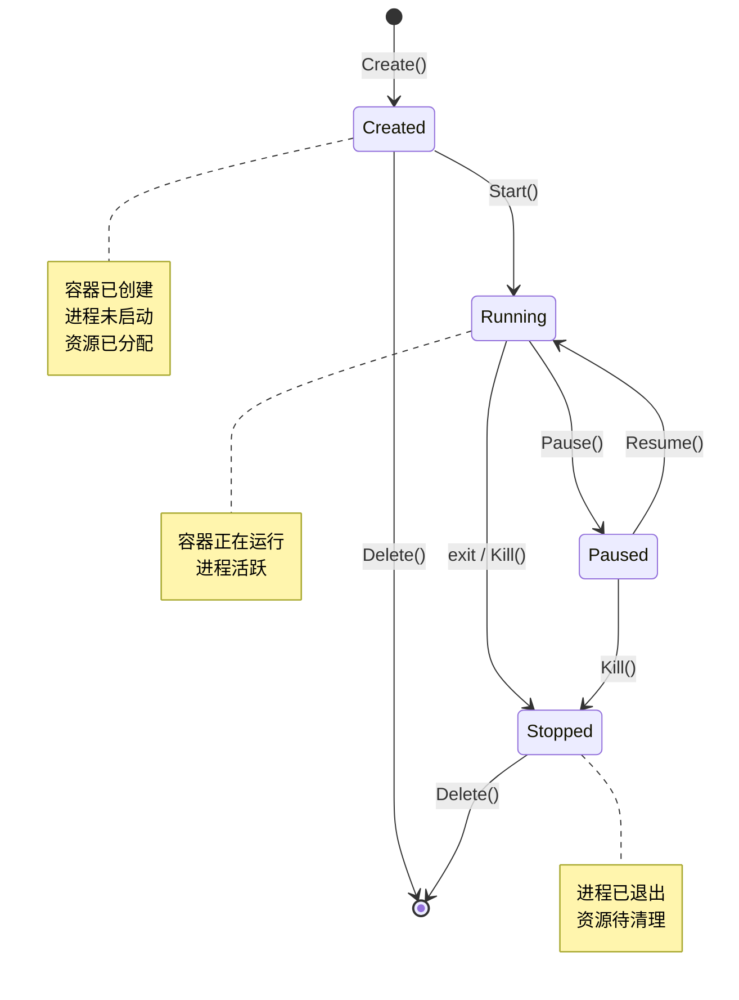
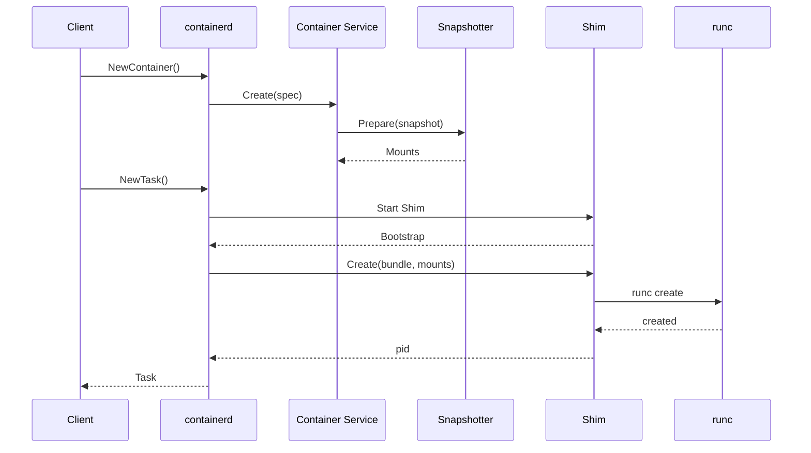
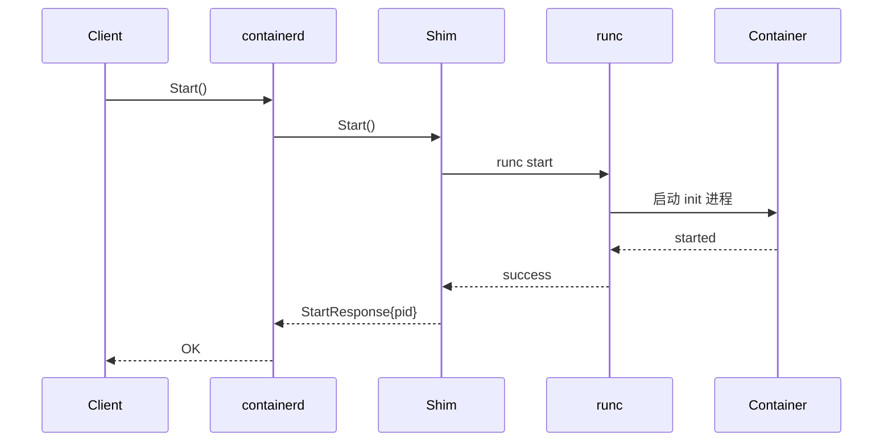
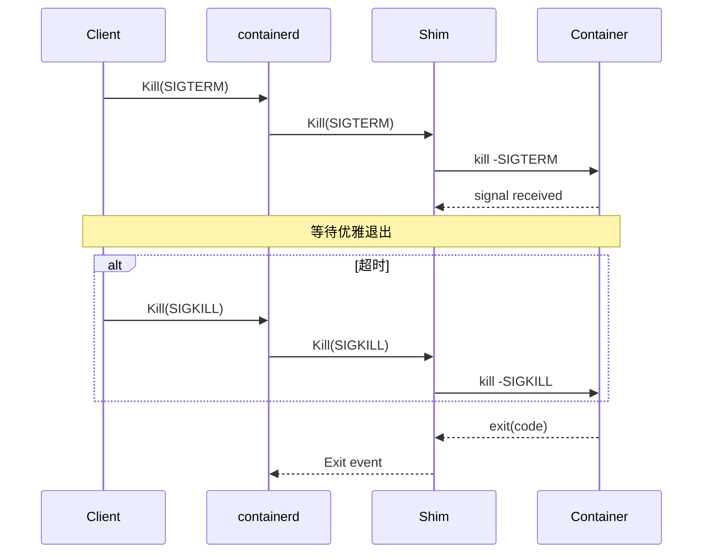
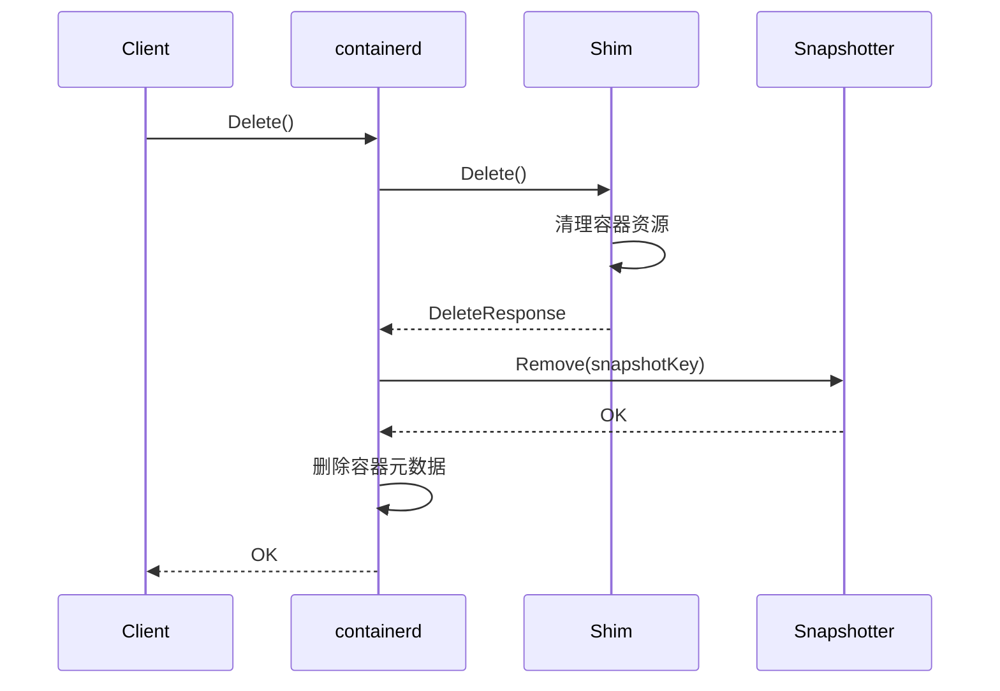

本章深入分析容器从创建到销毁的完整生命周期，以及各阶段的状态转换和事件处理。

## 生命周期概览



## 创建阶段（Create）

### 创建流程



### 关键步骤

#### 1. 创建容器元数据

```go
// client/container.go

func (c *Client) NewContainer(ctx context.Context, id string, opts ...NewContainerOpts) (Container, error) {
    // 应用选项
    container := containers.Container{
        ID: id,
    }
    for _, o := range opts {
        if err := o(ctx, c, &container); err != nil {
            return nil, err
        }
    }

    // 创建容器记录
    created, err := c.ContainerService().Create(ctx, container)
    if err != nil {
        return nil, err
    }

    return containerFromRecord(c, created), nil
}
```

#### 2. 准备快照

```go
// 准备容器的文件系统快照
func WithNewSnapshot(id string, i Image, opts ...snapshots.Opt) NewContainerOpts {
    return func(ctx context.Context, client *Client, c *containers.Container) error {
        // 获取 Snapshotter
        sn := client.SnapshotService(c.Snapshotter)

        // 获取镜像的 ChainID
        diffIDs, err := i.RootFS(ctx)
        if err != nil {
            return err
        }
        chainID := identity.ChainID(diffIDs)

        // 创建 Active 快照
        _, err = sn.Prepare(ctx, id, chainID.String(), opts...)
        if err != nil {
            return err
        }

        c.SnapshotKey = id
        c.Image = i.Name()
        return nil
    }
}
```

#### 3. 创建 Task

```go
// client/task.go

func (c *container) NewTask(ctx context.Context, ioCreate cio.Creator, opts ...NewTaskOpts) (Task, error) {
    // 获取挂载点
    mounts, err := c.client.SnapshotService(c.snapshotter).Mounts(ctx, c.snapshotKey)
    if err != nil {
        return nil, err
    }

    // 配置 I/O
    cfg := cio.Config{
        Stdin:    "",
        Stdout:   "",
        Stderr:   "",
        Terminal: false,
    }
    for _, o := range opts {
        o(ctx, c.client, &cfg)
    }

    io, err := ioCreate(cfg.ID)
    if err != nil {
        return nil, err
    }

    // 创建 Task
    request := &tasks.CreateTaskRequest{
        ContainerID: c.id,
        Rootfs:      mount.ToProto(mounts),
        Stdin:       io.Stdin,
        Stdout:      io.Stdout,
        Stderr:      io.Stderr,
        Terminal:    cfg.Terminal,
    }

    response, err := c.client.TaskService().Create(ctx, request)
    if err != nil {
        return nil, err
    }

    return &task{
        client:    c.client,
        container: c,
        io:        io,
        pid:       response.Pid,
    }, nil
}
```

## 启动阶段（Start）

### 启动流程



### 代码实现

```go
// client/task.go

func (t *task) Start(ctx context.Context) error {
    _, err := t.client.TaskService().Start(ctx, &tasks.StartRequest{
        ContainerID: t.container.ID(),
    })
    return err
}
```

### runc start 过程

```go
// cmd/containerd-shim-runc-v2/runc/container.go

func (c *Container) Start(ctx context.Context) error {
    // 获取 init 进程
    p := c.process

    // 调用 runc start
    if err := p.runtime.Start(ctx, c.id); err != nil {
        return err
    }

    return nil
}
```

## 运行阶段

### 状态监控

```go
// 监控容器状态
func (t *task) Status(ctx context.Context) (Status, error) {
    response, err := t.client.TaskService().Get(ctx, &tasks.GetRequest{
        ContainerID: t.container.ID(),
    })
    if err != nil {
        return Status{}, err
    }

    return Status{
        Status:     ProcessStatus(response.Process.Status),
        ExitStatus: response.Process.ExitStatus,
        ExitedAt:   response.Process.ExitedAt,
    }, nil
}
```

### 执行额外进程（Exec）

```go
// client/task.go

func (t *task) Exec(ctx context.Context, id string, spec *specs.Process, ioCreate cio.Creator) (Process, error) {
    // 创建 I/O
    io, err := ioCreate(id)
    if err != nil {
        return nil, err
    }

    // 发送 Exec 请求
    _, err = t.client.TaskService().Exec(ctx, &tasks.ExecProcessRequest{
        ContainerID: t.container.ID(),
        ExecID:      id,
        Terminal:    spec.Terminal,
        Stdin:       io.Stdin,
        Stdout:      io.Stdout,
        Stderr:      io.Stderr,
        Spec:        typeurl.MarshalAny(spec),
    })
    if err != nil {
        return nil, err
    }

    return &process{
        task:   t,
        id:     id,
        io:     io,
    }, nil
}
```

## 停止阶段

### 信号处理

```go
// Kill 发送信号到容器
func (t *task) Kill(ctx context.Context, signal syscall.Signal, opts ...KillOpts) error {
    var options KillInfo
    for _, o := range opts {
        o(&options)
    }

    _, err := t.client.TaskService().Kill(ctx, &tasks.KillRequest{
        ContainerID: t.container.ID(),
        Signal:      uint32(signal),
        All:         options.All,
    })
    return err
}
```

### 等待退出

```go
// Wait 等待任务退出
func (t *task) Wait(ctx context.Context) (<-chan ExitStatus, error) {
    c := make(chan ExitStatus, 1)

    go func() {
        defer close(c)

        response, err := t.client.TaskService().Wait(ctx, &tasks.WaitRequest{
            ContainerID: t.container.ID(),
        })
        if err != nil {
            c <- ExitStatus{
                code: UnknownExitStatus,
                err:  err,
            }
            return
        }

        c <- ExitStatus{
            code:     response.ExitStatus,
            exitedAt: response.ExitedAt.AsTime(),
        }
    }()

    return c, nil
}
```

### 停止流程



## 删除阶段（Delete）

### 删除流程



### 代码实现

```go
// client/task.go

func (t *task) Delete(ctx context.Context, opts ...ProcessDeleteOpts) (*ExitStatus, error) {
    // 删除 Task
    response, err := t.client.TaskService().Delete(ctx, &tasks.DeleteTaskRequest{
        ContainerID: t.container.ID(),
    })
    if err != nil {
        return nil, err
    }

    // 关闭 I/O
    if t.io != nil {
        t.io.Cancel()
        t.io.Close()
    }

    return &ExitStatus{
        code:     response.ExitStatus,
        exitedAt: response.ExitedAt.AsTime(),
    }, nil
}

// client/container.go

func (c *container) Delete(ctx context.Context, opts ...DeleteOpts) error {
    // 删除快照
    if c.snapshotKey != "" {
        sn := c.client.SnapshotService(c.snapshotter)
        if err := sn.Remove(ctx, c.snapshotKey); err != nil && !errdefs.IsNotFound(err) {
            return err
        }
    }

    // 删除容器元数据
    return c.client.ContainerService().Delete(ctx, c.id)
}
```

## 暂停与恢复

### Pause

```go
func (t *task) Pause(ctx context.Context) error {
    _, err := t.client.TaskService().Pause(ctx, &tasks.PauseTaskRequest{
        ContainerID: t.container.ID(),
    })
    return err
}
```

### Resume

```go
func (t *task) Resume(ctx context.Context) error {
    _, err := t.client.TaskService().Resume(ctx, &tasks.ResumeTaskRequest{
        ContainerID: t.container.ID(),
    })
    return err
}
```

### cgroup freezer 机制

```go
// 使用 cgroup freezer 暂停容器
func (c *Container) Pause(ctx context.Context) error {
    // 写入 freezer.state
    return os.WriteFile(
        filepath.Join(c.cgroupPath, "freezer.state"),
        []byte("FROZEN"),
        0644,
    )
}

func (c *Container) Resume(ctx context.Context) error {
    return os.WriteFile(
        filepath.Join(c.cgroupPath, "freezer.state"),
        []byte("THAWED"),
        0644,
    )
}
```

## 事件系统

### 生命周期事件

```go
// api/events/task.proto

message TaskCreate {
    string container_id = 1;
    string bundle = 2;
    repeated containerd.types.Mount rootfs = 3;
    TaskIO io = 4;
    string checkpoint = 5;
    uint32 pid = 6;
}

message TaskStart {
    string container_id = 1;
    uint32 pid = 2;
}

message TaskExit {
    string container_id = 1;
    string id = 2;
    uint32 pid = 3;
    uint32 exit_status = 4;
    google.protobuf.Timestamp exited_at = 5;
}

message TaskDelete {
    string container_id = 1;
    uint32 pid = 2;
    uint32 exit_status = 3;
    google.protobuf.Timestamp exited_at = 4;
    string id = 5;
}
```

### 事件订阅

```go
// 订阅容器事件
func watchContainerEvents(ctx context.Context, client *containerd.Client) error {
    events, errs := client.Subscribe(ctx, `topic~="/tasks/*"`)

    for {
        select {
        case event := <-events:
            switch e := event.Event.(type) {
            case *eventstypes.TaskStart:
                fmt.Printf("Container %s started (PID: %d)\n", e.ContainerID, e.Pid)
            case *eventstypes.TaskExit:
                fmt.Printf("Container %s exited (code: %d)\n", e.ContainerID, e.ExitStatus)
            }
        case err := <-errs:
            return err
        case <-ctx.Done():
            return ctx.Err()
        }
    }
}
```

## Checkpoint 与 Restore

### CRIU 集成

```go
// Checkpoint 创建容器检查点
func (t *task) Checkpoint(ctx context.Context, opts ...CheckpointTaskOpts) (Image, error) {
    request := &tasks.CheckpointTaskRequest{
        ContainerID: t.container.ID(),
    }

    // 应用选项
    var options CheckpointTaskInfo
    for _, o := range opts {
        o(&options)
    }
    request.Options = options.Options

    // 执行 checkpoint
    _, err := t.client.TaskService().Checkpoint(ctx, request)
    if err != nil {
        return nil, err
    }

    // 返回 checkpoint 镜像
    return t.client.GetImage(ctx, options.ImagePath)
}
```

### Restore 流程

```go
// 从检查点恢复
func restoreFromCheckpoint(ctx context.Context, client *containerd.Client, checkpointImage Image) (Task, error) {
    // 创建容器
    container, err := client.NewContainer(ctx, "restored-container",
        containerd.WithCheckpoint(checkpointImage, "checkpoint-name"),
    )
    if err != nil {
        return nil, err
    }

    // 创建并恢复 Task
    task, err := container.NewTask(ctx, cio.NewCreator(),
        containerd.WithTaskCheckpoint(checkpointImage, "checkpoint-name"),
    )
    if err != nil {
        return nil, err
    }

    // 启动恢复的任务
    if err := task.Start(ctx); err != nil {
        return nil, err
    }

    return task, nil
}
```

## 小结

容器生命周期的关键阶段：

1. **Create**：准备快照、启动 Shim、创建容器
2. **Start**：启动容器进程
3. **Running**：监控状态、执行 Exec
4. **Stop**：发送信号、等待退出
5. **Delete**：清理资源、删除元数据

事件系统贯穿整个生命周期，便于监控和审计。

下一节我们将学习 [Runtime 代码走读](./04-code-walkthrough.md)。

## 参考资料

- [containerd Task Service](https://pkg.go.dev/github.com/containerd/containerd/v2/api/services/tasks/v1)
- [CRIU - Checkpoint/Restore In Userspace](https://criu.org/)
