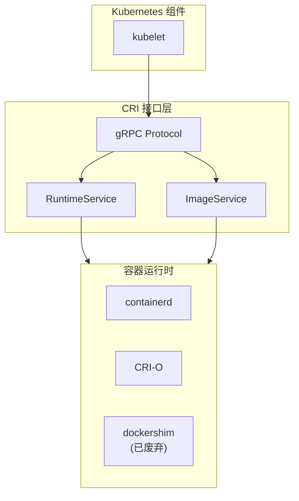
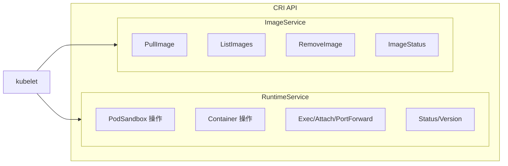
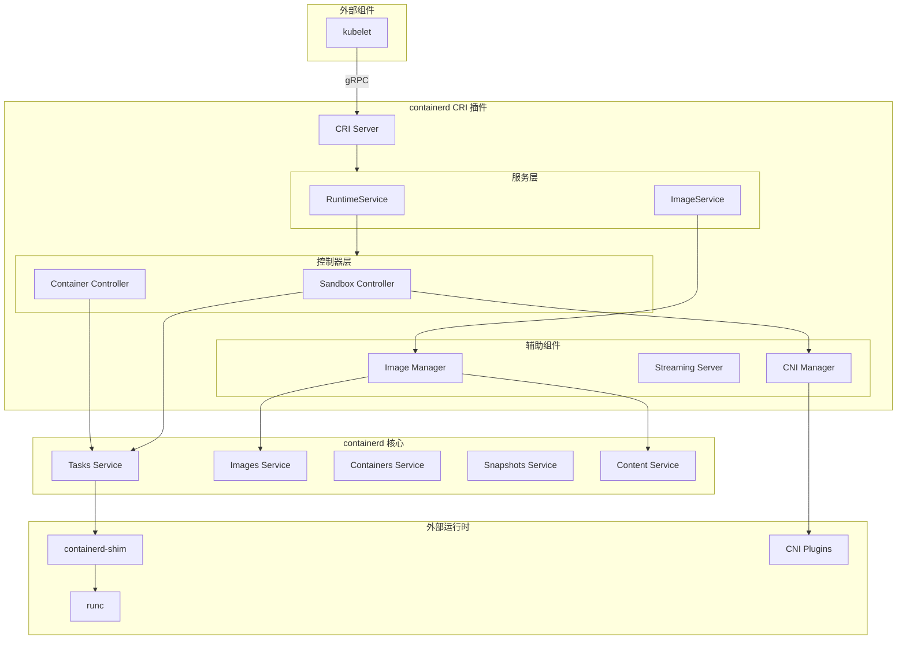
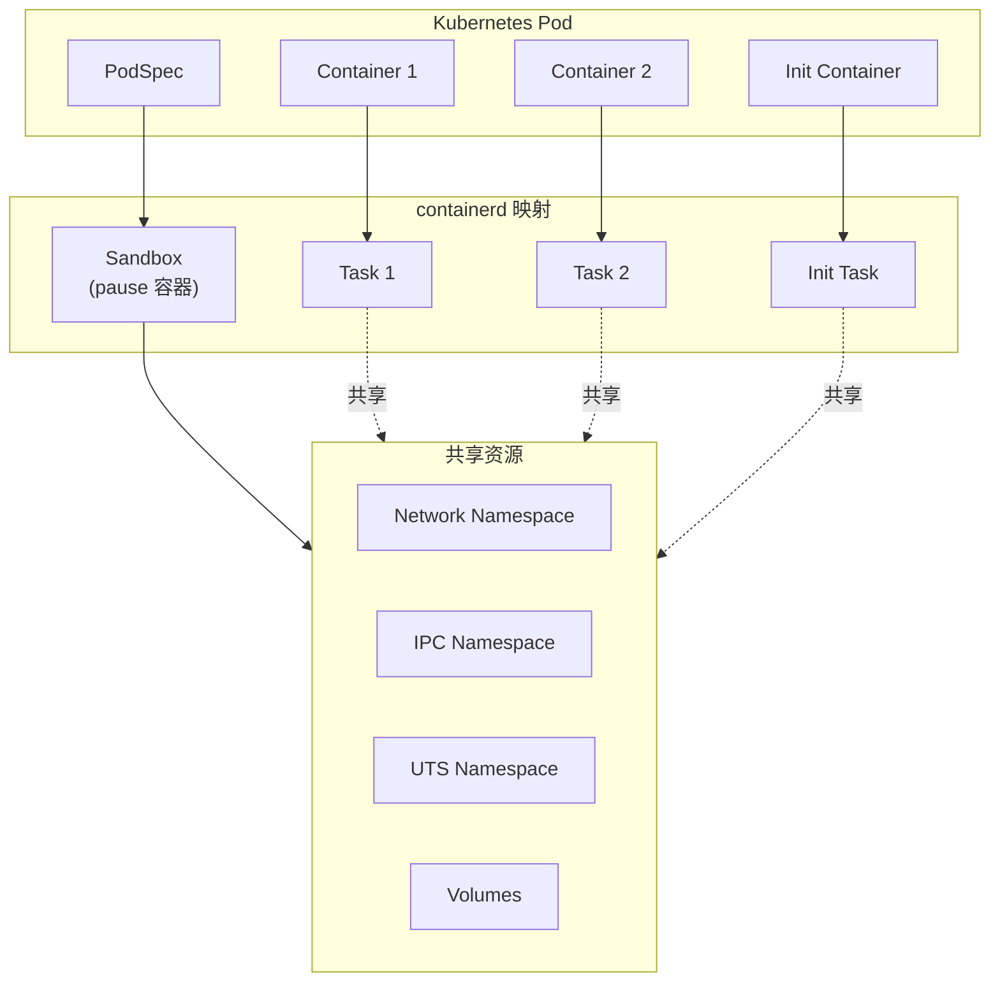
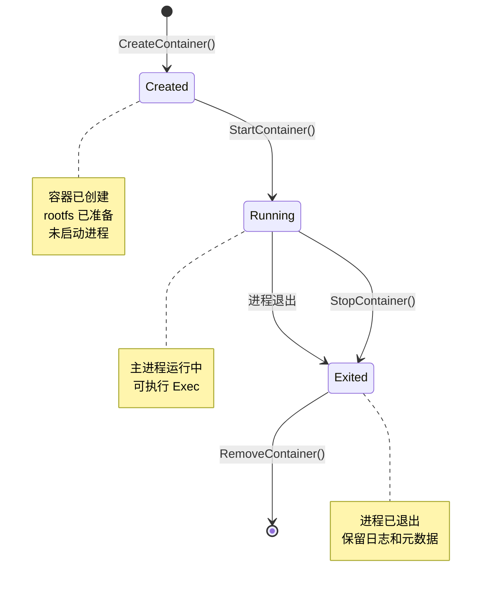
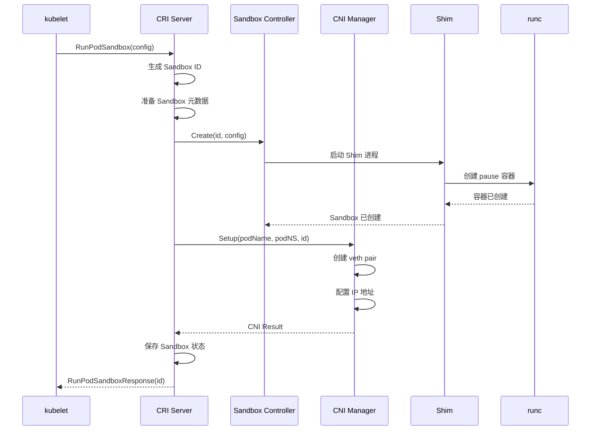
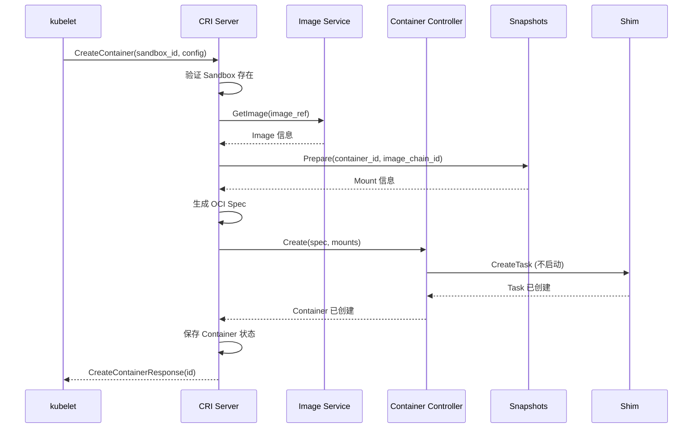
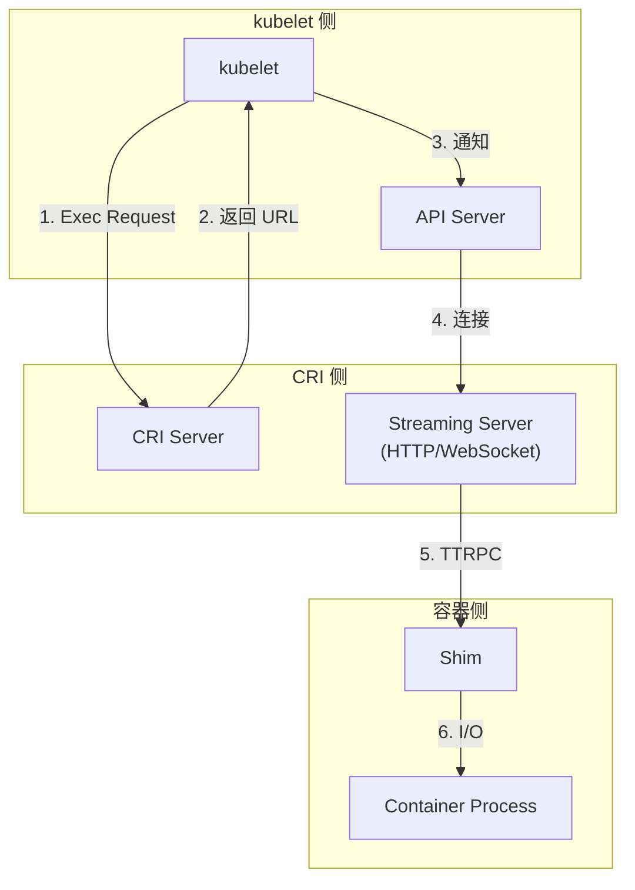
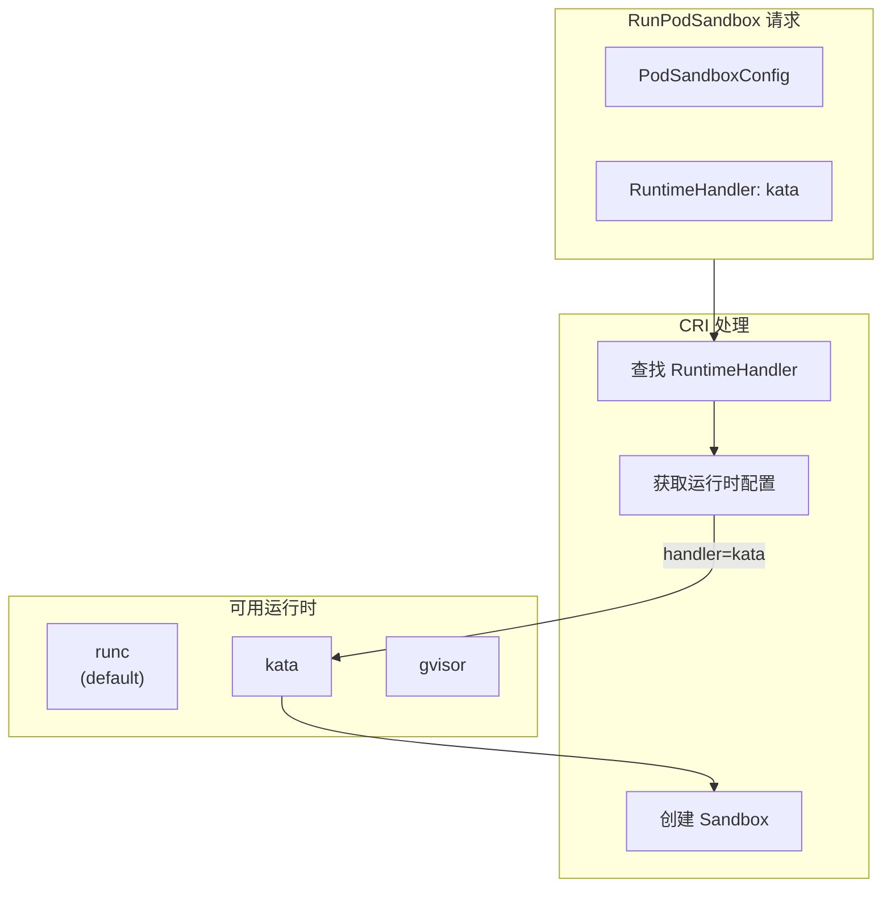

CRI (Container Runtime Interface) 是 Kubernetes 定义的容器运行时接口标准。containerd 通过内置的 CRI 插件原生支持 Kubernetes，成为 Kubernetes 集群中最常用的容器运行时。

## CRI 概述

### 什么是 CRI

CRI 是 Kubernetes 1.5 引入的接口标准，将 kubelet 与底层容器运行时解耦：



### CRI 设计目标

1. **解耦**：kubelet 不依赖特定运行时实现
2. **标准化**：统一的 gRPC 接口定义
3. **可扩展**：支持多种运行时实现
4. **Pod 优先**：以 Pod 为核心抽象

## CRI 服务接口

### 两大核心服务



### RuntimeService 接口

```protobuf
// api/services/runtime/v1/api.proto

service RuntimeService {
    // PodSandbox 操作
    rpc RunPodSandbox(RunPodSandboxRequest) returns (RunPodSandboxResponse);
    rpc StopPodSandbox(StopPodSandboxRequest) returns (StopPodSandboxResponse);
    rpc RemovePodSandbox(RemovePodSandboxRequest) returns (RemovePodSandboxResponse);
    rpc PodSandboxStatus(PodSandboxStatusRequest) returns (PodSandboxStatusResponse);
    rpc ListPodSandbox(ListPodSandboxRequest) returns (ListPodSandboxResponse);

    // Container 操作
    rpc CreateContainer(CreateContainerRequest) returns (CreateContainerResponse);
    rpc StartContainer(StartContainerRequest) returns (StartContainerResponse);
    rpc StopContainer(StopContainerRequest) returns (StopContainerResponse);
    rpc RemoveContainer(RemoveContainerRequest) returns (RemoveContainerResponse);
    rpc ListContainers(ListContainersRequest) returns (ListContainersResponse);
    rpc ContainerStatus(ContainerStatusRequest) returns (ContainerStatusResponse);

    // 交互操作
    rpc ExecSync(ExecSyncRequest) returns (ExecSyncResponse);
    rpc Exec(ExecRequest) returns (ExecResponse);
    rpc Attach(AttachRequest) returns (AttachResponse);
    rpc PortForward(PortForwardRequest) returns (PortForwardResponse);

    // 状态查询
    rpc ContainerStats(ContainerStatsRequest) returns (ContainerStatsResponse);
    rpc ListContainerStats(ListContainerStatsRequest) returns (ListContainerStatsResponse);
    rpc UpdateRuntimeConfig(UpdateRuntimeConfigRequest) returns (UpdateRuntimeConfigResponse);
    rpc Status(StatusRequest) returns (StatusResponse);
}
```

### ImageService 接口

```protobuf
service ImageService {
    // 镜像列表
    rpc ListImages(ListImagesRequest) returns (ListImagesResponse);

    // 镜像状态
    rpc ImageStatus(ImageStatusRequest) returns (ImageStatusResponse);

    // 拉取镜像
    rpc PullImage(PullImageRequest) returns (PullImageResponse);

    // 删除镜像
    rpc RemoveImage(RemoveImageRequest) returns (RemoveImageResponse);

    // 镜像文件系统信息
    rpc ImageFsInfo(ImageFsInfoRequest) returns (ImageFsInfoResponse);
}
```

## containerd CRI 架构

### 整体架构



### CRI 插件注册

```go
// plugins/cri/cri.go

func init() {
    plugin.Register(&plugin.Registration{
        Type:   plugins.GRPCPlugin,
        ID:     "cri",
        Config: &config.PluginConfig{},
        Requires: []plugin.Type{
            plugins.EventPlugin,
            plugins.ServicePlugin,
            plugins.LeasePlugin,
            plugins.SandboxControllerPlugin,
            plugins.NFDPlugin,
            plugins.WarningPlugin,
        },
        InitFn: initCRIService,
    })
}

func initCRIService(ic *plugin.InitContext) (interface{}, error) {
    // 获取依赖的插件
    // 创建 CRI 服务实例
    // 注册 gRPC 服务
}
```

### CRI Server 实现

```go
// internal/cri/server/service.go

// CRIService 实现 CRI 接口
type CRIService struct {
    // 配置
    config criconfig.Config

    // 核心服务
    client *containerd.Client

    // Sandbox 控制器
    sandboxControllers map[string]sandbox.Controller

    // 镜像服务
    imageService imageservice.Service

    // CNI 网络管理
    netPlugin cni.CNI

    // Streaming 服务器
    streamServer streaming.Server

    // 事件监控
    eventMonitor *eventMonitor

    // 运行时处理器
    runtimeHandlers map[string]RuntimeHandler
}

// RuntimeService 方法由 CRIService 实现
var _ runtime.RuntimeServiceServer = &CRIService{}

// ImageService 方法由 CRIService 实现
var _ runtime.ImageServiceServer = &CRIService{}
```

## Pod 与 Sandbox 映射

### Kubernetes Pod 到 containerd



### Sandbox 元数据结构

```go
// internal/cri/store/sandbox/metadata.go

// Metadata 是 Sandbox 的元数据
type Metadata struct {
    // ID 是 Sandbox 的唯一标识
    ID string

    // Name 是 Sandbox 名称
    Name string

    // Config 是创建时的配置
    Config *runtime.PodSandboxConfig

    // RuntimeHandler 运行时处理器名称
    RuntimeHandler string

    // CNIResult CNI 网络配置结果
    CNIResult *cni.Result

    // ProcessLabel SELinux 进程标签
    ProcessLabel string

    // NetNS 网络命名空间路径
    NetNSPath string

    // State 当前状态
    State StateType
}

// StateType Sandbox 状态
type StateType int

const (
    StateUnknown StateType = iota
    StateReady
    StateNotReady
)
```

## 容器状态管理

### 容器生命周期



### 容器元数据

```go
// internal/cri/store/container/metadata.go

// Metadata 容器元数据
type Metadata struct {
    // ID 容器唯一标识
    ID string

    // Name 容器名称
    Name string

    // SandboxID 所属 Sandbox
    SandboxID string

    // Config 容器配置
    Config *runtime.ContainerConfig

    // ImageRef 镜像引用
    ImageRef string

    // LogPath 日志路径
    LogPath string

    // StopSignal 停止信号
    StopSignal string
}

// Status 容器状态
type Status struct {
    // Pid 主进程 PID
    Pid uint32

    // CreatedAt 创建时间
    CreatedAt int64

    // StartedAt 启动时间
    StartedAt int64

    // FinishedAt 结束时间
    FinishedAt int64

    // ExitCode 退出码
    ExitCode int32

    // Reason 退出原因
    Reason string

    // Message 额外信息
    Message string
}
```

## 请求处理流程

### RunPodSandbox 流程



### CreateContainer 流程



## Streaming 服务

### Exec/Attach/PortForward

这些操作需要建立长连接，CRI 使用 Streaming Server 处理：



### Streaming Server 实现

```go
// internal/cri/server/streaming.go

// StreamServer 处理流式请求
type StreamServer interface {
    // GetExec 获取 Exec URL
    GetExec(*runtimeapi.ExecRequest) (*runtimeapi.ExecResponse, error)

    // GetAttach 获取 Attach URL
    GetAttach(*runtimeapi.AttachRequest) (*runtimeapi.AttachResponse, error)

    // GetPortForward 获取 PortForward URL
    GetPortForward(*runtimeapi.PortForwardRequest) (*runtimeapi.PortForwardResponse, error)

    // Start 启动服务器
    Start(bool) error
}

// 执行 Exec 请求
func (s *streamServer) serveExec(req *runtimeapi.ExecRequest, stream io.ReadWriteCloser) error {
    // 1. 获取容器
    // 2. 创建 exec 进程
    // 3. 连接 I/O 流
    // 4. 等待完成
}
```

## RuntimeHandler 多运行时

### 运行时配置

containerd 支持配置多个运行时处理器：

```toml
# /etc/containerd/config.toml

[plugins."io.containerd.cri.v1.runtime"]
  [plugins."io.containerd.cri.v1.runtime".containerd]
    default_runtime_name = "runc"

    [plugins."io.containerd.cri.v1.runtime".containerd.runtimes]
      [plugins."io.containerd.cri.v1.runtime".containerd.runtimes.runc]
        runtime_type = "io.containerd.runc.v2"

      [plugins."io.containerd.cri.v1.runtime".containerd.runtimes.kata]
        runtime_type = "io.containerd.kata.v2"

      [plugins."io.containerd.cri.v1.runtime".containerd.runtimes.gvisor]
        runtime_type = "io.containerd.runsc.v1"
```

### RuntimeClass 使用

```yaml
# Kubernetes RuntimeClass
apiVersion: node.k8s.io/v1
kind: RuntimeClass
metadata:
  name: kata
handler: kata

---
# Pod 使用特定运行时
apiVersion: v1
kind: Pod
metadata:
  name: secure-pod
spec:
  runtimeClassName: kata
  containers:
  - name: nginx
    image: nginx
```

### 运行时选择流程



## 小结

containerd CRI 插件是 Kubernetes 与 containerd 之间的桥梁：

1. **标准接口**：实现 CRI RuntimeService 和 ImageService
2. **Pod 映射**：将 Pod 映射为 Sandbox + Containers
3. **多运行时**：支持 runc、kata、gvisor 等
4. **流式操作**：通过 Streaming Server 支持 Exec/Attach

理解 CRI 架构对于：
- Kubernetes 容器运行时调试
- 自定义运行时开发
- 性能优化和问题排查

下一节我们将深入学习 [Pod Sandbox 实现](./02-pod-sandbox.md)。

## 参考资料

- [CRI Specification](https://github.com/kubernetes/cri-api)
- [containerd CRI Plugin](https://github.com/containerd/containerd/tree/main/internal/cri)
- [Kubernetes Runtime Class](https://kubernetes.io/docs/concepts/containers/runtime-class/)
