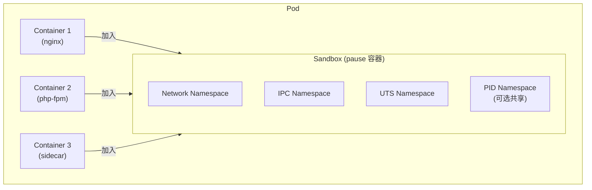
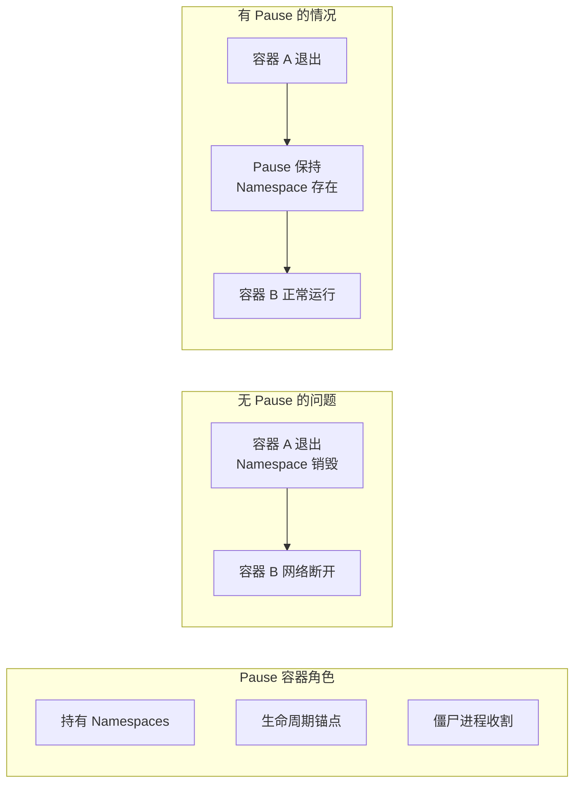
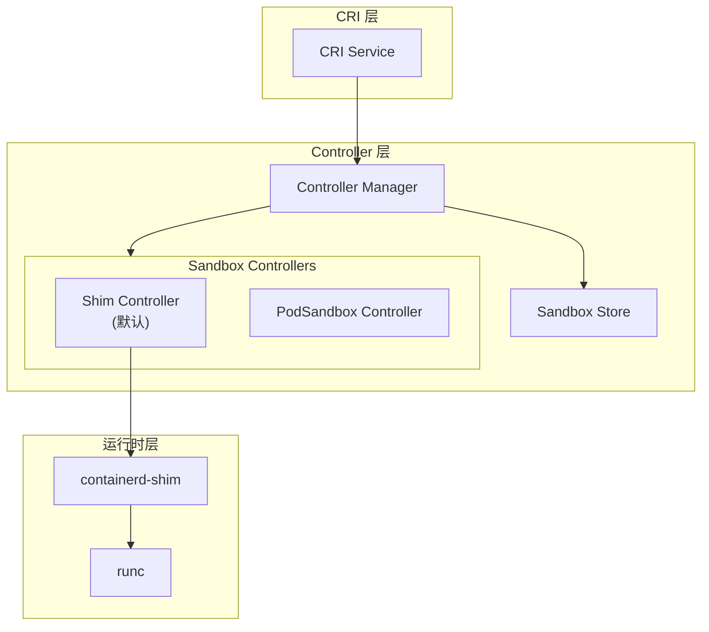
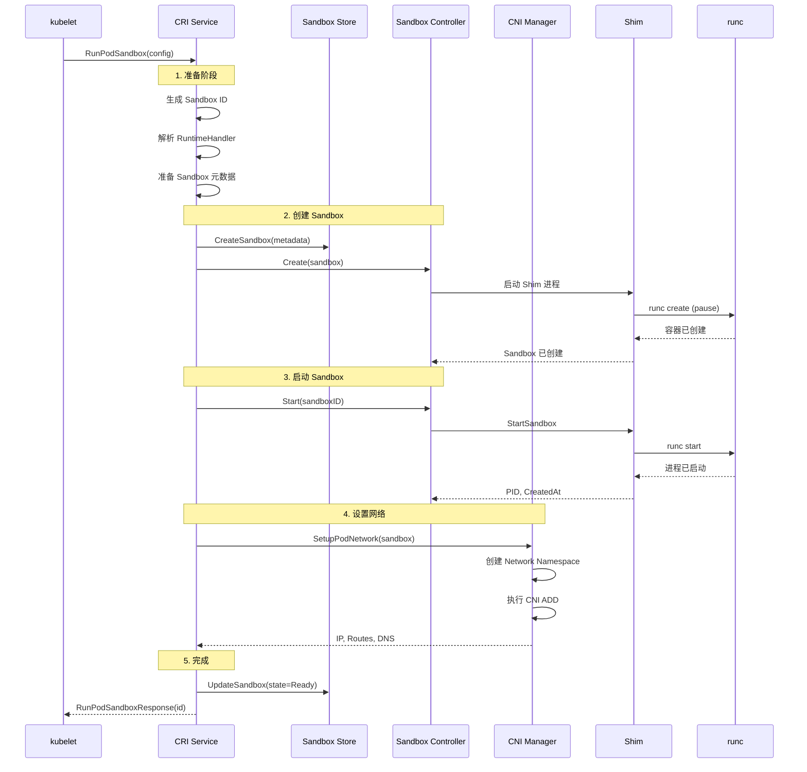
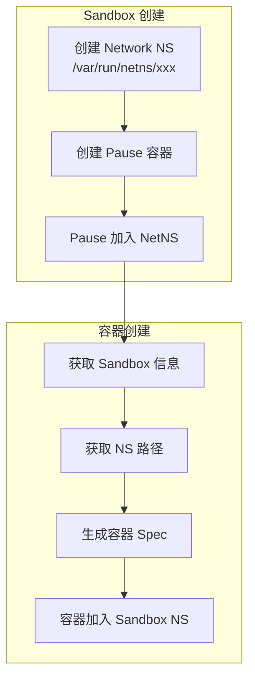
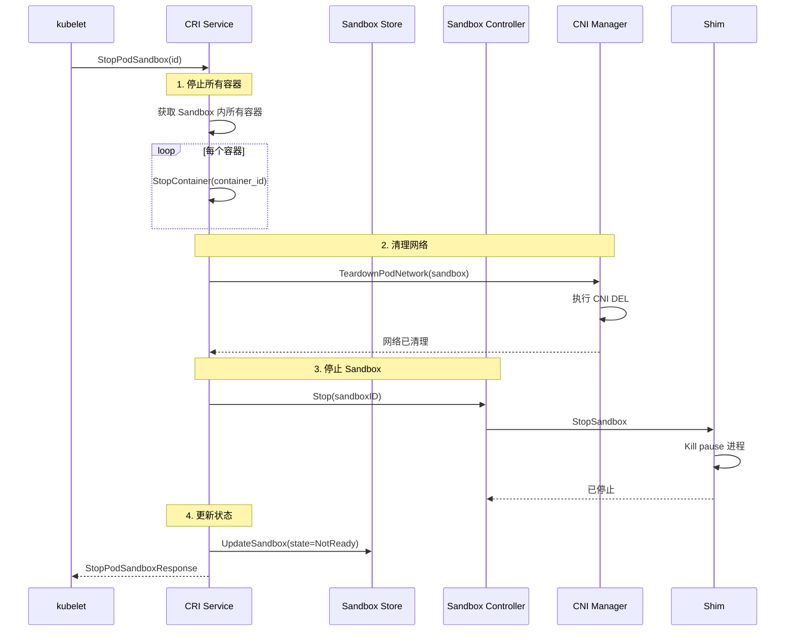

Pod Sandbox 是 CRI 中的核心概念，它为 Pod 内的容器提供共享的隔离环境。本章深入解析 containerd 中 Pod Sandbox 的实现机制。

## Sandbox 概念

### 什么是 Pod Sandbox

Pod Sandbox 是 Pod 内所有容器共享的隔离环境：



### 为什么需要 Pause 容器

Pause 容器的作用：

1. **Namespace 持有者**：持有共享的 Linux Namespaces
2. **生命周期锚点**：即使业务容器崩溃，Namespace 依然存在
3. **僵尸进程收割**：作为 PID 1 收割孤儿进程
4. **资源占用极低**：只执行 pause 系统调用



## Sandbox Controller

### Controller 架构

containerd 使用 Sandbox Controller 管理 Sandbox 生命周期：



### Sandbox Controller 接口

```go
// core/sandbox/controller.go

// Controller 定义 Sandbox 控制器接口
type Controller interface {
    // Create 创建 Sandbox
    Create(ctx context.Context, sandboxInfo Sandbox, opts ...CreateOpt) error

    // Start 启动 Sandbox
    Start(ctx context.Context, sandboxID string) (ControllerInstance, error)

    // Platform 返回支持的平台
    Platform(ctx context.Context, sandboxID string) (platforms.Platform, error)

    // Stop 停止 Sandbox
    Stop(ctx context.Context, sandboxID string, opts ...StopOpt) error

    // Wait 等待 Sandbox 退出
    Wait(ctx context.Context, sandboxID string) (ExitStatus, error)

    // Status 获取 Sandbox 状态
    Status(ctx context.Context, sandboxID string, verbose bool) (ControllerStatus, error)

    // Shutdown 关闭 Sandbox
    Shutdown(ctx context.Context, sandboxID string) error

    // Metrics 获取指标
    Metrics(ctx context.Context, sandboxID string) (*types.Metric, error)
}

// ControllerInstance 运行中的 Sandbox 实例
type ControllerInstance struct {
    SandboxID   string
    Pid         uint32
    CreatedAt   time.Time
    Labels      map[string]string
}
```

### Shim Controller 实现

```go
// core/sandbox/shim_controller.go

type shimController struct {
    root         string
    state        string
    shims        *runtime.NSMap[ShimInstance]
    events       *exchange.Exchange
    containers   containers.Store
}

// Create 创建 Sandbox (通过 Shim)
func (s *shimController) Create(ctx context.Context, sandboxInfo Sandbox, opts ...CreateOpt) error {
    // 1. 准备 Sandbox 配置
    // 2. 启动 Shim 进程
    // 3. 调用 Shim 的 CreateSandbox
    // 4. 记录 Sandbox 状态
}

// Start 启动 Sandbox
func (s *shimController) Start(ctx context.Context, sandboxID string) (ControllerInstance, error) {
    // 1. 获取 Shim 实例
    shim, err := s.shims.Get(ctx, sandboxID)

    // 2. 调用 Shim 的 StartSandbox
    resp, err := shim.StartSandbox(ctx, &api.StartSandboxRequest{
        SandboxID: sandboxID,
    })

    return ControllerInstance{
        SandboxID: sandboxID,
        Pid:       resp.Pid,
        CreatedAt: resp.CreatedAt.AsTime(),
    }, nil
}
```

## RunPodSandbox 详解

### 完整流程



### 代码实现

```go
// internal/cri/server/podsandbox/sandbox_run.go

// RunPodSandbox 创建并启动 Pod Sandbox
func (c *Controller) RunPodSandbox(ctx context.Context, r *runtime.RunPodSandboxRequest) (*runtime.RunPodSandboxResponse, error) {
    config := r.GetConfig()

    // 1. 生成 Sandbox ID
    id := util.GenerateID()

    // 2. 获取运行时处理器
    ociRuntime, err := c.getSandboxRuntime(config, r.GetRuntimeHandler())

    // 3. 创建 Sandbox 元数据
    metadata := &sandboxstore.Metadata{
        ID:             id,
        Name:           config.GetMetadata().GetName(),
        Config:         config,
        RuntimeHandler: r.GetRuntimeHandler(),
    }

    // 4. 创建网络命名空间
    if !hostNetwork(config) {
        sandbox.NetNS, err = netns.NewNetNS(netnsMountDir)
    }

    // 5. 创建 Sandbox 容器
    sandboxInfo, err := c.createSandboxContainer(ctx, id, config, ociRuntime)

    // 6. 启动 Sandbox
    ctrl, err := c.sandboxController.Start(ctx, id)

    // 7. 设置网络
    if !hostNetwork(config) {
        result, err := c.setupPodNetwork(ctx, &sandbox)
        sandbox.CNIResult = result
    }

    // 8. 保存状态
    c.sandboxStore.Add(sandbox)

    return &runtime.RunPodSandboxResponse{PodSandboxId: id}, nil
}
```

## Sandbox 容器创建

### OCI Spec 生成

```go
// internal/cri/server/podsandbox/sandbox_run.go

func (c *Controller) createSandboxContainer(ctx context.Context, id string, config *runtime.PodSandboxConfig, ociRuntime criconfig.Runtime) error {
    // 1. 获取 pause 镜像
    image, err := c.ensureImageExists(ctx, c.config.SandboxImage, config)

    // 2. 创建 Snapshotter
    snapshotterOpt := snapshots.WithLabels(map[string]string{
        "containerd.io/gc.root": time.Now().UTC().Format(time.RFC3339),
    })

    // 3. 生成 OCI Spec
    spec, err := c.sandboxContainerSpec(id, config, image.Config, nsPath, ociRuntime.PodAnnotations)

    // 4. 创建容器
    opts := []containerd.NewContainerOpts{
        containerd.WithSnapshotter(c.config.ContainerdConfig.Snapshotter),
        containerd.WithNewSnapshot(id, image.Image, snapshotterOpt),
        containerd.WithSpec(spec, specOpts...),
        containerd.WithContainerLabels(labels),
        containerd.WithContainerExtension(sandboxMetadataExtension, &metadata),
        containerd.WithRuntime(ociRuntime.Type, runtimeOpts),
    }

    container, err := c.client.NewContainer(ctx, id, opts...)
    return nil
}
```

### Sandbox OCI Spec 特点

```go
// internal/cri/server/podsandbox/sandbox_run.go

func (c *Controller) sandboxContainerSpec(id string, config *runtime.PodSandboxConfig, imageConfig *imagespec.ImageConfig, nsPath string, runtimePodAnnotations []string) (*oci.Spec, error) {
    spec := &oci.Spec{
        Version: specs.Version,
        Root: &specs.Root{
            Path: "rootfs",
            Readonly: true,  // pause 容器 rootfs 只读
        },
        Process: &specs.Process{
            Args: []string{"/pause"},  // 执行 pause
            Cwd:  "/",
        },
    }

    // Linux Namespaces 配置
    spec.Linux = &specs.Linux{
        Resources: &specs.LinuxResources{},
        Namespaces: []specs.LinuxNamespace{
            {Type: specs.NetworkNamespace, Path: nsPath},  // 使用预创建的 netns
            {Type: specs.IPCNamespace},
            {Type: specs.UTSNamespace},
            {Type: specs.PIDNamespace},
            {Type: specs.MountNamespace},
        },
    }

    // 如果是 hostNetwork，不创建新的 Network Namespace
    if hostNetwork(config) {
        removeNamespace(&spec.Linux.Namespaces, specs.NetworkNamespace)
    }

    return spec, nil
}
```

## Namespace 共享机制

### 容器如何加入 Sandbox



### 获取 Namespace 路径

```go
// internal/cri/server/container_create.go

func (c *criService) containerSpec(
    id string,
    sandboxID string,
    config *runtime.ContainerConfig,
    sandboxConfig *runtime.PodSandboxConfig,
    imageConfig *imagespec.ImageConfig,
    extraMounts []*runtime.Mount,
    ociRuntime criconfig.Runtime,
) (*oci.Spec, error) {
    // 获取 Sandbox 的 Task
    sandboxTask, err := c.getSandboxTask(ctx, sandboxID)

    // 获取 Namespace 路径 (通过 /proc/<pid>/ns/)
    sandboxPid := sandboxTask.Pid()

    // 配置 Namespace
    spec.Linux.Namespaces = []specs.LinuxNamespace{
        {
            Type: specs.NetworkNamespace,
            Path: fmt.Sprintf("/proc/%d/ns/net", sandboxPid),
        },
        {
            Type: specs.IPCNamespace,
            Path: fmt.Sprintf("/proc/%d/ns/ipc", sandboxPid),
        },
        {
            Type: specs.UTSNamespace,
            Path: fmt.Sprintf("/proc/%d/ns/uts", sandboxPid),
        },
    }

    // PID Namespace (可选共享)
    if sandboxConfig.GetLinux().GetSecurityContext().GetNamespaceOptions().GetPid() == runtime.NamespaceMode_POD {
        spec.Linux.Namespaces = append(spec.Linux.Namespaces, specs.LinuxNamespace{
            Type: specs.PIDNamespace,
            Path: fmt.Sprintf("/proc/%d/ns/pid", sandboxPid),
        })
    }

    return spec, nil
}
```

## StopPodSandbox 流程

### 停止流程



### 代码实现

```go
// internal/cri/server/podsandbox/sandbox_stop.go

// StopPodSandbox 停止 Pod Sandbox
func (c *Controller) StopPodSandbox(ctx context.Context, r *runtime.StopPodSandboxRequest) (*runtime.StopPodSandboxResponse, error) {
    sandbox, err := c.sandboxStore.Get(r.GetPodSandboxId())

    // 1. 停止所有容器
    containers := c.containerStore.List()
    for _, container := range containers {
        if container.SandboxID == sandbox.ID {
            if err := c.stopContainer(ctx, container, 0); err != nil {
                log.G(ctx).WithError(err).Warnf("Failed to stop container %s", container.ID)
            }
        }
    }

    // 2. 清理网络
    if sandbox.NetNS != nil {
        if err := c.teardownPodNetwork(ctx, sandbox); err != nil {
            log.G(ctx).WithError(err).Warnf("Failed to teardown network for sandbox %s", sandbox.ID)
        }
    }

    // 3. 停止 Sandbox
    if err := c.sandboxController.Stop(ctx, sandbox.ID); err != nil {
        return nil, fmt.Errorf("failed to stop sandbox: %w", err)
    }

    // 4. 更新状态
    sandbox.State = sandboxstore.StateNotReady
    c.sandboxStore.Update(sandbox)

    return &runtime.StopPodSandboxResponse{}, nil
}
```

## RemovePodSandbox 流程

```go
// internal/cri/server/podsandbox/sandbox_remove.go

// RemovePodSandbox 删除 Pod Sandbox
func (c *Controller) RemovePodSandbox(ctx context.Context, r *runtime.RemovePodSandboxRequest) (*runtime.RemovePodSandboxResponse, error) {
    sandbox, err := c.sandboxStore.Get(r.GetPodSandboxId())

    // 1. 确保 Sandbox 已停止
    if sandbox.State == sandboxstore.StateReady {
        return nil, fmt.Errorf("sandbox %s is still running", sandbox.ID)
    }

    // 2. 删除所有容器
    containers := c.containerStore.List()
    for _, container := range containers {
        if container.SandboxID == sandbox.ID {
            if err := c.removeContainer(ctx, container.ID); err != nil {
                return nil, err
            }
        }
    }

    // 3. 删除网络命名空间
    if sandbox.NetNS != nil {
        if err := sandbox.NetNS.Remove(); err != nil {
            log.G(ctx).WithError(err).Warn("Failed to remove network namespace")
        }
    }

    // 4. 清理 Sandbox 容器
    if err := c.sandboxController.Shutdown(ctx, sandbox.ID); err != nil {
        return nil, err
    }

    // 5. 删除 Snapshot
    if err := c.client.SnapshotService(c.config.ContainerdConfig.Snapshotter).Remove(ctx, sandbox.ID); err != nil {
        log.G(ctx).WithError(err).Warn("Failed to remove snapshot")
    }

    // 6. 从 Store 中删除
    c.sandboxStore.Delete(sandbox.ID)

    return &runtime.RemovePodSandboxResponse{}, nil
}
```

## PodSandbox 状态查询

### PodSandboxStatus

```go
// internal/cri/server/podsandbox/sandbox_status.go

func (c *Controller) PodSandboxStatus(ctx context.Context, r *runtime.PodSandboxStatusRequest) (*runtime.PodSandboxStatusResponse, error) {
    sandbox, err := c.sandboxStore.Get(r.GetPodSandboxId())

    // 构建状态响应
    status := &runtime.PodSandboxStatus{
        Id: sandbox.ID,
        Metadata: &runtime.PodSandboxMetadata{
            Name:      sandbox.Config.GetMetadata().GetName(),
            Uid:       sandbox.Config.GetMetadata().GetUid(),
            Namespace: sandbox.Config.GetMetadata().GetNamespace(),
            Attempt:   sandbox.Config.GetMetadata().GetAttempt(),
        },
        State:     toCRISandboxState(sandbox.State),
        CreatedAt: sandbox.CreatedAt.UnixNano(),
        Network: &runtime.PodSandboxNetworkStatus{
            Ip: sandbox.IP,
        },
        Linux: &runtime.LinuxPodSandboxStatus{
            Namespaces: &runtime.Namespace{
                Options: &runtime.NamespaceOption{
                    Network:  sandbox.Config.GetLinux().GetSecurityContext().GetNamespaceOptions().GetNetwork(),
                    Pid:      sandbox.Config.GetLinux().GetSecurityContext().GetNamespaceOptions().GetPid(),
                    Ipc:      sandbox.Config.GetLinux().GetSecurityContext().GetNamespaceOptions().GetIpc(),
                },
            },
        },
        Labels:      sandbox.Config.GetLabels(),
        Annotations: sandbox.Config.GetAnnotations(),
    }

    return &runtime.PodSandboxStatusResponse{Status: status}, nil
}
```

## 小结

Pod Sandbox 是 containerd CRI 实现的核心组件：

1. **Namespace 隔离**：为 Pod 内容器提供共享的隔离环境
2. **Pause 容器**：作为 Namespace 持有者和生命周期锚点
3. **Sandbox Controller**：管理 Sandbox 生命周期
4. **CNI 集成**：在 Sandbox 级别配置网络

理解 Pod Sandbox 对于：
- 调试 Pod 网络问题
- 理解容器隔离机制
- 优化 Pod 启动性能

下一节我们将学习 [CNI 网络集成](./03-cni-integration.md)。

## 参考资料

- [Pause Container](https://www.ianlewis.org/en/almighty-pause-container)
- [containerd Sandbox](https://github.com/containerd/containerd/tree/main/core/sandbox)
- [Linux Namespaces](https://man7.org/linux/man-pages/man7/namespaces.7.html)
