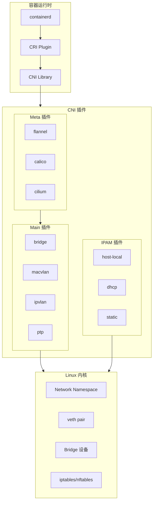
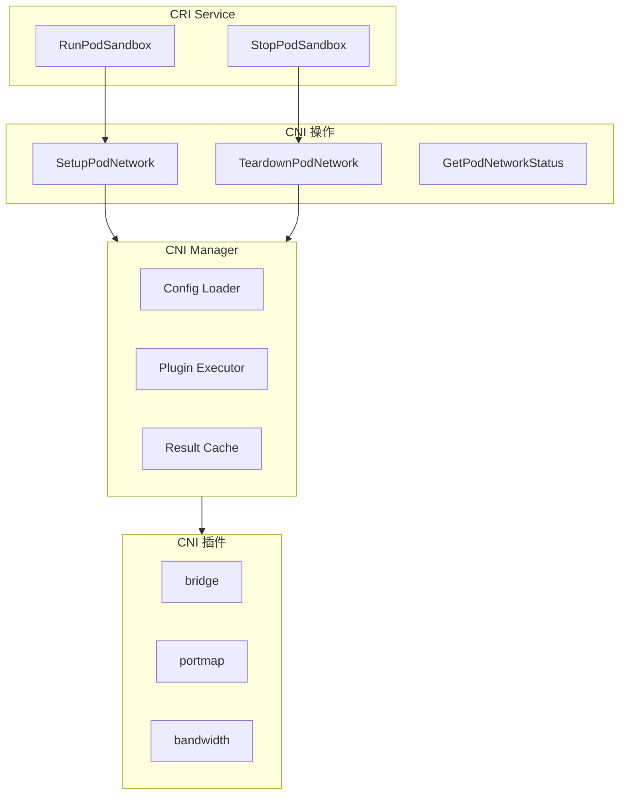
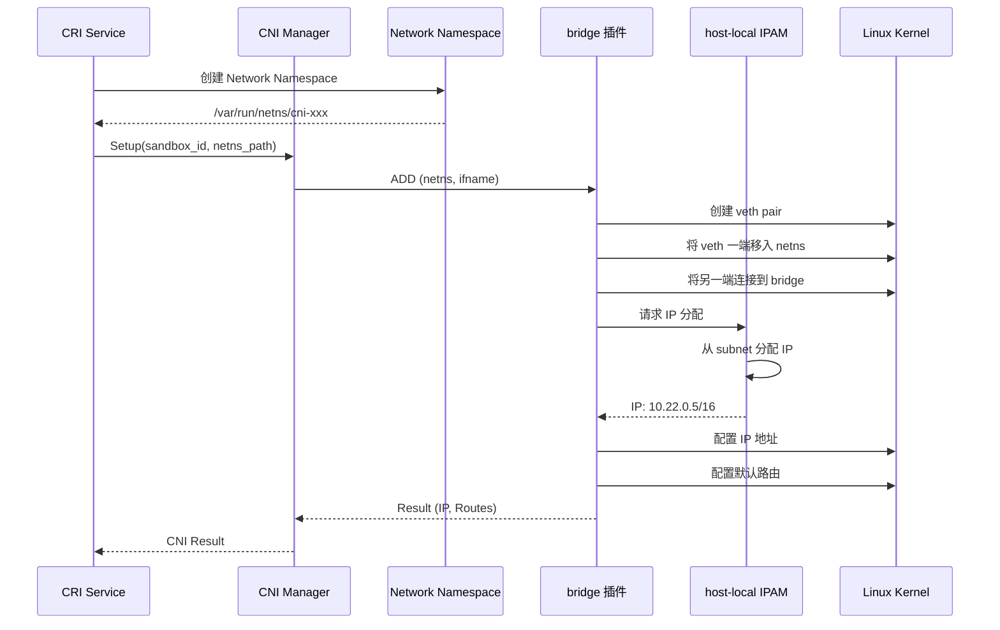
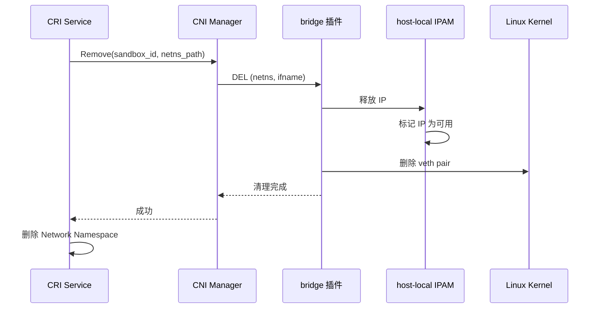
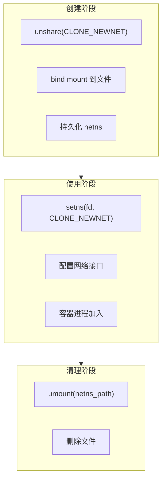
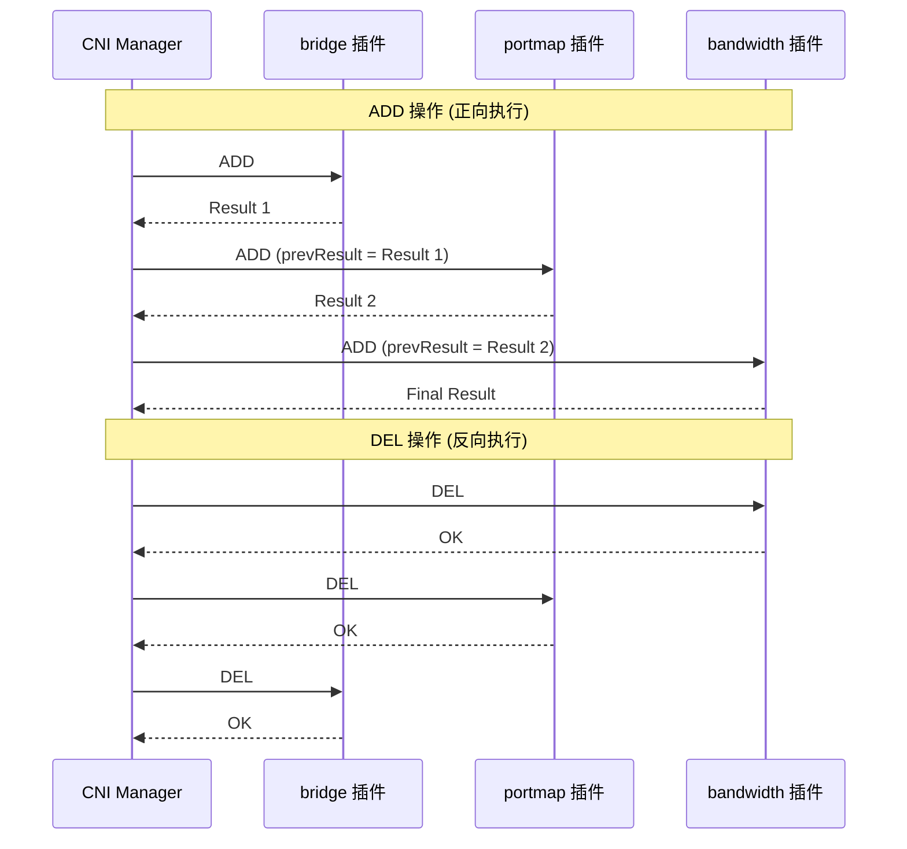
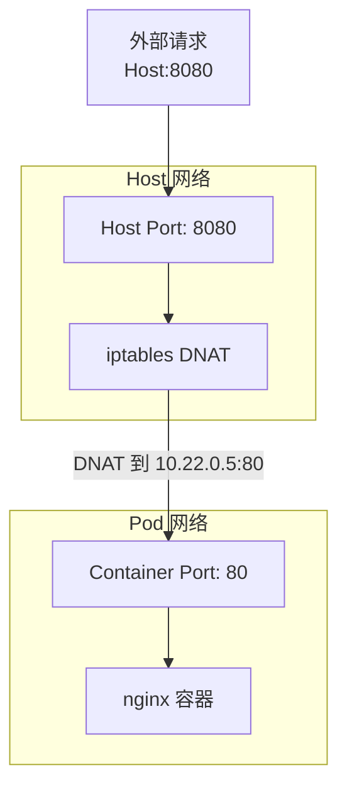
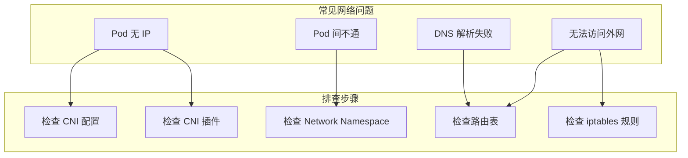

CNI (Container Network Interface) 是容器网络的标准接口。containerd 通过 CNI 插件为 Pod 配置网络，实现容器间通信和外部网络访问。

## CNI 概述

### 什么是 CNI

CNI 定义了容器运行时与网络插件之间的接口规范：



### CNI 规范

CNI 定义了两个核心操作：

| 操作 | 说明 |
|------|------|
| ADD | 将容器添加到网络，配置网络接口和 IP |
| DEL | 从网络移除容器，清理网络配置 |
| CHECK | 检查容器网络配置是否正确 |
| VERSION | 返回插件支持的 CNI 版本 |

### CNI 配置格式

```json
{
    "cniVersion": "1.0.0",
    "name": "mynet",
    "type": "bridge",
    "bridge": "cni0",
    "isGateway": true,
    "ipMasq": true,
    "ipam": {
        "type": "host-local",
        "subnet": "10.22.0.0/16",
        "routes": [
            { "dst": "0.0.0.0/0" }
        ]
    }
}
```

## containerd CNI 集成

### CNI Manager 架构



### CNI 配置加载

```go
// internal/cri/server/podsandbox/sandbox_run.go

// containerd CNI 配置
type CNIConfig struct {
    // PluginDirs CNI 插件目录
    PluginDirs []string `toml:"bin_dir" json:"binDir"`

    // PluginConfDir CNI 配置目录
    PluginConfDir string `toml:"conf_dir" json:"confDir"`

    // PluginMaxConfNum 最大配置文件数
    PluginMaxConfNum int `toml:"max_conf_num" json:"maxConfNum"`

    // Networks 网络配置
    Networks []string `toml:"conf_template" json:"confTemplate"`
}
```

containerd 配置示例：

```toml
# /etc/containerd/config.toml

[plugins."io.containerd.cri.v1.runtime".cni]
  bin_dir = "/opt/cni/bin"
  conf_dir = "/etc/cni/net.d"
  max_conf_num = 1
  conf_template = ""
```

### CNI 接口封装

```go
// internal/cri/server/cni.go

// CNI 封装接口
type CNI interface {
    // Setup 设置 Pod 网络
    Setup(ctx context.Context, id string, path string, opts ...cni.NamespaceOpts) (*cni.Result, error)

    // Remove 移除 Pod 网络
    Remove(ctx context.Context, id string, path string, opts ...cni.NamespaceOpts) error

    // GetConfig 获取网络配置
    GetConfig() *cni.ConfigResult

    // Status 检查 CNI 状态
    Status() error

    // Load 加载 CNI 配置
    Load(opts ...cni.Opt) error
}
```

## SetupPodNetwork 详解

### 网络设置流程



### 代码实现

```go
// internal/cri/server/podsandbox/sandbox_run.go

func (c *Controller) setupPodNetwork(ctx context.Context, sandbox *sandboxstore.Sandbox) (*cni.Result, error) {
    // 1. 获取网络命名空间路径
    netNSPath := sandbox.NetNS.GetPath()

    // 2. 准备 CNI 选项
    opts := []cni.NamespaceOpts{
        cni.WithLabels(map[string]string{
            "K8S_POD_NAMESPACE":          sandbox.Config.GetMetadata().GetNamespace(),
            "K8S_POD_NAME":               sandbox.Config.GetMetadata().GetName(),
            "K8S_POD_INFRA_CONTAINER_ID": sandbox.ID,
            "K8S_POD_UID":                sandbox.Config.GetMetadata().GetUid(),
            "IgnoreUnknown":              "1",
        }),
        cni.WithCapabilityPortMap(toCNIPortMappings(sandbox.Config.GetPortMappings())),
    }

    // 3. 调用 CNI Setup
    result, err := c.cni.Setup(ctx, sandbox.ID, netNSPath, opts...)
    if err != nil {
        return nil, fmt.Errorf("failed to setup network for sandbox %q: %w", sandbox.ID, err)
    }

    // 4. 解析结果
    return result, nil
}
```

### CNI Result 结构

```go
// vendor/github.com/containernetworking/cni/pkg/types/100/types.go

type Result struct {
    CNIVersion string         `json:"cniVersion,omitempty"`
    Interfaces []*Interface   `json:"interfaces,omitempty"`
    IPs        []*IPConfig    `json:"ips,omitempty"`
    Routes     []*Route       `json:"routes,omitempty"`
    DNS        DNS            `json:"dns,omitempty"`
}

type Interface struct {
    Name    string `json:"name"`
    Mac     string `json:"mac,omitempty"`
    Sandbox string `json:"sandbox,omitempty"`
}

type IPConfig struct {
    Interface *int        `json:"interface,omitempty"`
    Address   net.IPNet   `json:"address"`
    Gateway   net.IP      `json:"gateway,omitempty"`
}
```

## TeardownPodNetwork 详解

### 网络清理流程



### 代码实现

```go
// internal/cri/server/podsandbox/sandbox_stop.go

func (c *Controller) teardownPodNetwork(ctx context.Context, sandbox *sandboxstore.Sandbox) error {
    // 1. 检查网络命名空间
    if sandbox.NetNS == nil {
        return nil
    }

    netNSPath := sandbox.NetNS.GetPath()
    if netNSPath == "" {
        return nil
    }

    // 2. 准备 CNI 选项 (与 Setup 相同的标签)
    opts := []cni.NamespaceOpts{
        cni.WithLabels(map[string]string{
            "K8S_POD_NAMESPACE":          sandbox.Config.GetMetadata().GetNamespace(),
            "K8S_POD_NAME":               sandbox.Config.GetMetadata().GetName(),
            "K8S_POD_INFRA_CONTAINER_ID": sandbox.ID,
            "K8S_POD_UID":                sandbox.Config.GetMetadata().GetUid(),
            "IgnoreUnknown":              "1",
        }),
        cni.WithCapabilityPortMap(toCNIPortMappings(sandbox.Config.GetPortMappings())),
    }

    // 3. 调用 CNI Remove
    if err := c.cni.Remove(ctx, sandbox.ID, netNSPath, opts...); err != nil {
        return fmt.Errorf("failed to teardown network for sandbox %q: %w", sandbox.ID, err)
    }

    return nil
}
```

## Network Namespace 管理

### NetNS 创建

```go
// internal/cri/server/podsandbox/netns.go

// NewNetNS 创建新的网络命名空间
func NewNetNS(baseDir string) (*NetNS, error) {
    // 1. 生成唯一路径
    nsPath := filepath.Join(baseDir, fmt.Sprintf("cni-%s", uuid.New().String()))

    // 2. 创建 netns
    if err := os.MkdirAll(baseDir, 0755); err != nil {
        return nil, err
    }

    // 3. 通过 unshare 创建新的 network namespace
    // 并将其绑定挂载到文件系统
    if err := unix.Mount("", nsPath, "none", unix.MS_BIND, ""); err != nil {
        return nil, err
    }

    return &NetNS{path: nsPath}, nil
}

// NetNS 网络命名空间
type NetNS struct {
    path string
}

// GetPath 获取 netns 路径
func (n *NetNS) GetPath() string {
    return n.path
}

// Remove 删除 netns
func (n *NetNS) Remove() error {
    if n.path == "" {
        return nil
    }
    // 先卸载
    if err := unix.Unmount(n.path, unix.MNT_DETACH); err != nil {
        return err
    }
    // 再删除文件
    return os.RemoveAll(n.path)
}
```

### NetNS 使用



## CNI 插件链

### 插件链执行

containerd 支持 CNI 插件链，按顺序执行多个插件：

```json
{
    "cniVersion": "1.0.0",
    "name": "k8s-pod-network",
    "plugins": [
        {
            "type": "bridge",
            "bridge": "cni0",
            "isGateway": true,
            "ipMasq": true,
            "ipam": {
                "type": "host-local",
                "subnet": "10.22.0.0/16",
                "routes": [
                    { "dst": "0.0.0.0/0" }
                ]
            }
        },
        {
            "type": "portmap",
            "capabilities": {
                "portMappings": true
            }
        },
        {
            "type": "bandwidth",
            "capabilities": {
                "bandwidth": true
            }
        }
    ]
}
```

### 执行流程



## PortMapping 实现

### 端口映射配置

```go
// internal/cri/server/helpers.go

func toCNIPortMappings(portMappings []*runtime.PortMapping) []cni.PortMapping {
    var result []cni.PortMapping
    for _, pm := range portMappings {
        result = append(result, cni.PortMapping{
            HostPort:      pm.GetHostPort(),
            ContainerPort: pm.GetContainerPort(),
            Protocol:      strings.ToLower(pm.GetProtocol().String()),
            HostIP:        pm.GetHostIp(),
        })
    }
    return result
}
```

### portmap 插件工作原理



portmap 插件生成的 iptables 规则：

```bash
# DNAT 规则
-A CNI-DN-xxxxx -p tcp -m tcp --dport 8080 -j DNAT --to-destination 10.22.0.5:80

# MASQUERADE 规则
-A CNI-HOSTPORT-MASQ -j MASQUERADE
```

## 网络故障排查

### 常见问题



### 排查命令

```bash
# 1. 检查 CNI 插件
ls -la /opt/cni/bin/

# 2. 检查 CNI 配置
cat /etc/cni/net.d/*.conf

# 3. 检查 Pod 的 Network Namespace
crictl inspectp <pod_id> | jq '.info.runtimeSpec.linux.namespaces'

# 4. 进入 Pod 的 Network Namespace
nsenter -t <pause_pid> -n ip addr
nsenter -t <pause_pid> -n ip route

# 5. 检查 veth pair
ip link show type veth

# 6. 检查 bridge
brctl show cni0
ip addr show cni0

# 7. 检查 iptables
iptables -t nat -L CNI-HOSTPORT-DNAT -n -v
iptables -t nat -L CNI-HOSTPORT-MASQ -n -v
```

### CNI 日志

```bash
# 启用 CNI 调试日志
export CNI_LOG_LEVEL=debug
export CNI_LOG_FILE=/var/log/cni.log

# 检查 containerd 日志中的 CNI 相关信息
journalctl -u containerd | grep -i cni
```

## 自定义 CNI 配置

### 典型 CNI 配置

**Bridge 网络 (默认)**：

```json
{
    "cniVersion": "1.0.0",
    "name": "containerd-net",
    "plugins": [
        {
            "type": "bridge",
            "bridge": "cni0",
            "isGateway": true,
            "ipMasq": true,
            "promiscMode": true,
            "ipam": {
                "type": "host-local",
                "ranges": [
                    [{"subnet": "10.88.0.0/16"}]
                ],
                "routes": [
                    {"dst": "0.0.0.0/0"}
                ]
            }
        },
        {
            "type": "portmap",
            "capabilities": {"portMappings": true}
        }
    ]
}
```

**Flannel 网络**：

```json
{
    "name": "cbr0",
    "cniVersion": "1.0.0",
    "plugins": [
        {
            "type": "flannel",
            "delegate": {
                "hairpinMode": true,
                "isDefaultGateway": true
            }
        },
        {
            "type": "portmap",
            "capabilities": {
                "portMappings": true
            }
        }
    ]
}
```

## 小结

CNI 是 containerd 网络配置的核心机制：

1. **标准接口**：遵循 CNI 规范，支持多种网络插件
2. **插件链**：支持多个插件顺序执行
3. **Namespace 管理**：为每个 Pod 创建独立的网络命名空间
4. **IP 管理**：通过 IPAM 插件分配和回收 IP

理解 CNI 集成对于：
- 排查 Pod 网络问题
- 自定义网络配置
- 集成第三方网络方案

下一节我们将进行 [CRI 代码走读](./04-code-walkthrough.md)。

## 参考资料

- [CNI Specification](https://github.com/containernetworking/cni/blob/main/SPEC.md)
- [CNI Plugins](https://github.com/containernetworking/plugins)
- [containerd CNI Configuration](https://github.com/containerd/containerd/blob/main/docs/cri/config.md)
