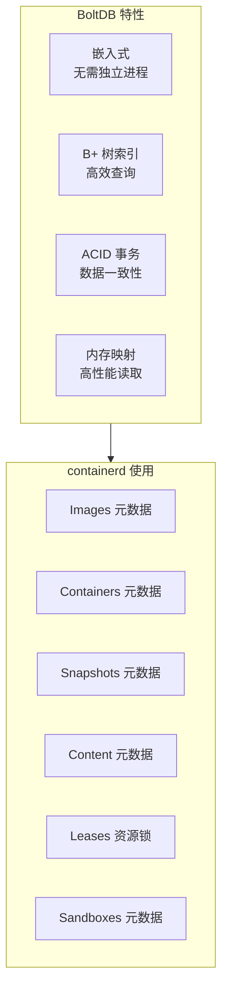
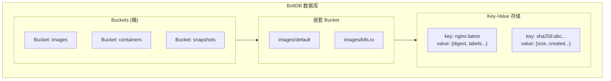
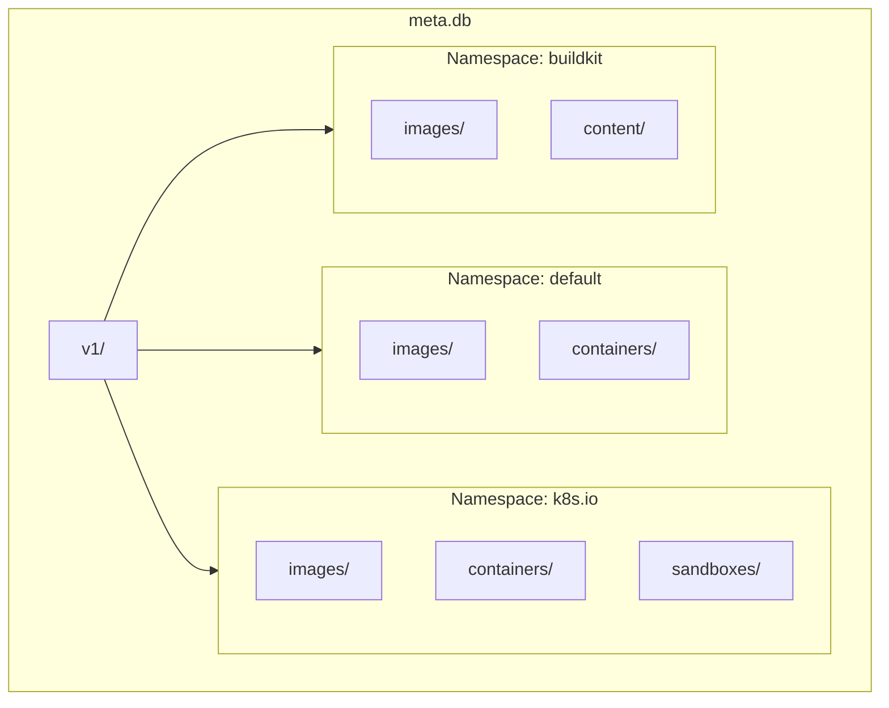

containerd 使用 BoltDB 作为元数据存储后端，管理镜像、容器、快照等资源的元数据。本章深入解析 BoltDB 的使用方式和元数据组织结构。

## BoltDB 简介

### 什么是 BoltDB

BoltDB 是一个纯 Go 实现的嵌入式 Key-Value 数据库：



### BoltDB 数据模型



## containerd 元数据结构

### 数据库位置

```bash
# 默认位置
/var/lib/containerd/io.containerd.metadata.v1.bolt/meta.db

# 查看数据库大小
ls -lh /var/lib/containerd/io.containerd.metadata.v1.bolt/meta.db
```

### Bucket 层级结构

```
meta.db
└── v1/                          # 版本 Bucket
    ├── default/                 # Namespace: default
    │   ├── images/              # 镜像元数据
    │   ├── containers/          # 容器元数据
    │   ├── snapshots/           # 快照元数据
    │   │   └── overlayfs/       # Snapshotter 名称
    │   ├── content/             # 内容元数据
    │   │   ├── blob/            # Blob 信息
    │   │   └── ingests/         # 写入中的内容
    │   └── leases/              # Lease 信息
    │
    └── k8s.io/                  # Namespace: k8s.io (Kubernetes)
        ├── images/
        ├── containers/
        ├── sandboxes/           # CRI Sandbox
        └── ...
```

### Namespace 隔离



## 元数据接口

### DB 接口

```go
// core/metadata/db.go

// DB 是元数据数据库的封装
type DB struct {
    db *bolt.DB

    // 写入时间戳 (用于 GC)
    writeTimestamp time.Time

    // 已注册的收集器 (用于 GC)
    collectors []collector

    // 脏标记 (需要 GC)
    dirty bool

    // 锁
    wlock sync.RWMutex
}

// NewDB 创建新的元数据数据库
func NewDB(db *bolt.DB, collectors ...collector) *DB {
    return &DB{
        db:         db,
        collectors: collectors,
    }
}
```

### Store 接口

```go
// core/metadata/images.go

// ImageStore 镜像元数据存储
type ImageStore struct {
    db *DB
}

func (s *ImageStore) Get(ctx context.Context, name string) (images.Image, error) {
    var image images.Image

    namespace := namespaces.Get(ctx)

    if err := view(ctx, s.db, func(tx *bolt.Tx) error {
        // 获取 Namespace Bucket
        bkt := getImagesBucket(tx, namespace)
        if bkt == nil {
            return fmt.Errorf("image %q: %w", name, errdefs.ErrNotFound)
        }

        // 获取镜像 Bucket
        ibkt := bkt.Bucket([]byte(name))
        if ibkt == nil {
            return fmt.Errorf("image %q: %w", name, errdefs.ErrNotFound)
        }

        // 读取元数据
        image.Name = name
        return readImage(&image, ibkt)
    }); err != nil {
        return images.Image{}, err
    }

    return image, nil
}
```

## 核心 Bucket 详解

### Images Bucket

```go
// core/metadata/images.go

// 镜像元数据结构
/*
v1/<namespace>/images/<name>/
    target      -> descriptor protobuf
    createdat   -> RFC3339 时间戳
    updatedat   -> RFC3339 时间戳
    labels/
        key1    -> value1
        key2    -> value2
*/

func writeImage(bkt *bolt.Bucket, image *images.Image) error {
    // 写入 target descriptor
    if err := bkt.Put(bucketKeyTarget, marshalDescriptor(image.Target)); err != nil {
        return err
    }

    // 写入创建时间
    if err := bkt.Put(bucketKeyCreatedAt, []byte(image.CreatedAt.Format(time.RFC3339Nano))); err != nil {
        return err
    }

    // 写入更新时间
    if err := bkt.Put(bucketKeyUpdatedAt, []byte(image.UpdatedAt.Format(time.RFC3339Nano))); err != nil {
        return err
    }

    // 写入标签
    return writeLabels(bkt, image.Labels)
}

func readImage(image *images.Image, bkt *bolt.Bucket) error {
    // 读取 target
    if data := bkt.Get(bucketKeyTarget); data != nil {
        var desc ocispec.Descriptor
        if err := proto.Unmarshal(data, &desc); err != nil {
            return err
        }
        image.Target = desc
    }

    // 读取时间戳
    if data := bkt.Get(bucketKeyCreatedAt); data != nil {
        image.CreatedAt, _ = time.Parse(time.RFC3339Nano, string(data))
    }

    // 读取标签
    image.Labels = readLabels(bkt)

    return nil
}
```

### Containers Bucket

```go
// core/metadata/containers.go

// 容器元数据结构
/*
v1/<namespace>/containers/<id>/
    createdat   -> RFC3339 时间戳
    updatedat   -> RFC3339 时间戳
    image       -> 镜像名称
    runtime/
        name    -> 运行时类型
        options -> 运行时选项 (protobuf)
    spec        -> OCI Spec (protobuf)
    snapshotKey -> Snapshot 键
    snapshotter -> Snapshotter 名称
    labels/
    extensions/
*/

type containerStore struct {
    db *DB
}

func (s *containerStore) Create(ctx context.Context, container containers.Container) (containers.Container, error) {
    namespace := namespaces.Get(ctx)

    if err := update(ctx, s.db, func(tx *bolt.Tx) error {
        // 获取或创建 containers bucket
        bkt, err := createContainersBucket(tx, namespace)
        if err != nil {
            return err
        }

        // 检查是否已存在
        cbkt := bkt.Bucket([]byte(container.ID))
        if cbkt != nil {
            return fmt.Errorf("container %q: %w", container.ID, errdefs.ErrAlreadyExists)
        }

        // 创建容器 bucket
        cbkt, err = bkt.CreateBucket([]byte(container.ID))
        if err != nil {
            return err
        }

        // 设置创建时间
        container.CreatedAt = time.Now().UTC()
        container.UpdatedAt = container.CreatedAt

        // 写入元数据
        return writeContainer(cbkt, &container)
    }); err != nil {
        return containers.Container{}, err
    }

    return container, nil
}
```

### Snapshots Bucket

```go
// core/metadata/snapshot.go

// 快照元数据结构
/*
v1/<namespace>/snapshots/<snapshotter>/<key>/
    createdat   -> 创建时间
    updatedat   -> 更新时间
    parent      -> 父快照键
    kind        -> Active/Committed/View
    labels/
*/

type snapshotter struct {
    db          *DB
    snapshotter string
}

func (s *snapshotter) Stat(ctx context.Context, key string) (snapshots.Info, error) {
    namespace := namespaces.Get(ctx)
    var info snapshots.Info

    if err := view(ctx, s.db, func(tx *bolt.Tx) error {
        bkt := getSnapshotsBucket(tx, namespace, s.snapshotter)
        if bkt == nil {
            return fmt.Errorf("snapshot %q: %w", key, errdefs.ErrNotFound)
        }

        sbkt := bkt.Bucket([]byte(key))
        if sbkt == nil {
            return fmt.Errorf("snapshot %q: %w", key, errdefs.ErrNotFound)
        }

        return readSnapshot(&info, key, sbkt)
    }); err != nil {
        return snapshots.Info{}, err
    }

    return info, nil
}
```

### Content Bucket

```go
// core/metadata/content.go

// 内容元数据结构
/*
v1/<namespace>/content/blob/<digest>/
    createdat   -> 创建时间
    updatedat   -> 更新时间
    size        -> 内容大小
    labels/
*/

type contentStore struct {
    db    *DB
    store content.Store  // 实际的内容存储
}

func (s *contentStore) Info(ctx context.Context, dgst digest.Digest) (content.Info, error) {
    namespace := namespaces.Get(ctx)
    var info content.Info

    if err := view(ctx, s.db, func(tx *bolt.Tx) error {
        bkt := getContentBucket(tx, namespace)
        if bkt == nil {
            return fmt.Errorf("content %s: %w", dgst, errdefs.ErrNotFound)
        }

        blob := bkt.Bucket(bucketKeyBlob)
        if blob == nil {
            return fmt.Errorf("content %s: %w", dgst, errdefs.ErrNotFound)
        }

        cbkt := blob.Bucket([]byte(dgst.String()))
        if cbkt == nil {
            return fmt.Errorf("content %s: %w", dgst, errdefs.ErrNotFound)
        }

        return readContentInfo(&info, cbkt)
    }); err != nil {
        return content.Info{}, err
    }

    return info, nil
}
```

## 事务操作

### 只读事务

```go
// core/metadata/db.go

// view 执行只读事务
func view(ctx context.Context, db *DB, fn func(*bolt.Tx) error) error {
    return db.db.View(func(tx *bolt.Tx) error {
        return fn(tx)
    })
}

// 使用示例
func (s *ImageStore) List(ctx context.Context, filters ...string) ([]images.Image, error) {
    var results []images.Image

    if err := view(ctx, s.db, func(tx *bolt.Tx) error {
        bkt := getImagesBucket(tx, namespace)
        if bkt == nil {
            return nil
        }

        return bkt.ForEach(func(k, v []byte) error {
            // k 是镜像名称
            // v 是 nil (因为是嵌套 bucket)
            ibkt := bkt.Bucket(k)
            if ibkt == nil {
                return nil
            }

            var image images.Image
            image.Name = string(k)
            if err := readImage(&image, ibkt); err != nil {
                return err
            }

            results = append(results, image)
            return nil
        })
    }); err != nil {
        return nil, err
    }

    return results, nil
}
```

### 读写事务

```go
// core/metadata/db.go

// update 执行读写事务
func update(ctx context.Context, db *DB, fn func(*bolt.Tx) error) error {
    db.wlock.Lock()
    defer db.wlock.Unlock()

    return db.db.Update(func(tx *bolt.Tx) error {
        return fn(tx)
    })
}

// 使用示例
func (s *ImageStore) Delete(ctx context.Context, name string) error {
    namespace := namespaces.Get(ctx)

    return update(ctx, s.db, func(tx *bolt.Tx) error {
        bkt := getImagesBucket(tx, namespace)
        if bkt == nil {
            return fmt.Errorf("image %q: %w", name, errdefs.ErrNotFound)
        }

        // 删除镜像 bucket
        return bkt.DeleteBucket([]byte(name))
    })
}
```

## Bucket 辅助函数

### 获取 Bucket

```go
// core/metadata/buckets.go

// 常用的 bucket key
var (
    bucketKeyVersion     = []byte("v1")
    bucketKeyImages      = []byte("images")
    bucketKeyContainers  = []byte("containers")
    bucketKeySnapshots   = []byte("snapshots")
    bucketKeyContent     = []byte("content")
    bucketKeyLeases      = []byte("leases")
    bucketKeySandboxes   = []byte("sandboxes")
)

// getImagesBucket 获取镜像 bucket
func getImagesBucket(tx *bolt.Tx, namespace string) *bolt.Bucket {
    return getBucket(tx, bucketKeyVersion, []byte(namespace), bucketKeyImages)
}

// getBucket 通用获取 bucket
func getBucket(tx *bolt.Tx, keys ...[]byte) *bolt.Bucket {
    bkt := tx.Bucket(keys[0])
    if bkt == nil {
        return nil
    }

    for _, key := range keys[1:] {
        bkt = bkt.Bucket(key)
        if bkt == nil {
            return nil
        }
    }

    return bkt
}
```

### 创建 Bucket

```go
// core/metadata/buckets.go

// createImagesBucket 创建镜像 bucket
func createImagesBucket(tx *bolt.Tx, namespace string) (*bolt.Bucket, error) {
    return createBucketIfNotExists(tx, bucketKeyVersion, []byte(namespace), bucketKeyImages)
}

// createBucketIfNotExists 通用创建 bucket
func createBucketIfNotExists(tx *bolt.Tx, keys ...[]byte) (*bolt.Bucket, error) {
    bkt, err := tx.CreateBucketIfNotExists(keys[0])
    if err != nil {
        return nil, err
    }

    for _, key := range keys[1:] {
        bkt, err = bkt.CreateBucketIfNotExists(key)
        if err != nil {
            return nil, err
        }
    }

    return bkt, nil
}
```

## 数据库维护

### 数据库压缩

BoltDB 不会自动回收删除数据的空间，需要定期压缩：

```go
// 压缩数据库
func compactDatabase(srcPath, dstPath string) error {
    src, err := bolt.Open(srcPath, 0600, nil)
    if err != nil {
        return err
    }
    defer src.Close()

    dst, err := bolt.Open(dstPath, 0600, nil)
    if err != nil {
        return err
    }
    defer dst.Close()

    return src.View(func(srcTx *bolt.Tx) error {
        return dst.Update(func(dstTx *bolt.Tx) error {
            return srcTx.ForEach(func(name []byte, srcBkt *bolt.Bucket) error {
                dstBkt, err := dstTx.CreateBucket(name)
                if err != nil {
                    return err
                }
                return copyBucket(srcBkt, dstBkt)
            })
        })
    })
}
```

### 数据库备份

```bash
# 使用 bolt 命令行工具
bolt dump /var/lib/containerd/io.containerd.metadata.v1.bolt/meta.db > backup.txt

# 或者直接复制文件 (需要停止 containerd)
cp /var/lib/containerd/io.containerd.metadata.v1.bolt/meta.db backup.db
```

## 调试与诊断

### 查看数据库内容

```go
// 遍历打印所有数据
func dumpDB(db *bolt.DB) {
    db.View(func(tx *bolt.Tx) error {
        return tx.ForEach(func(name []byte, b *bolt.Bucket) error {
            fmt.Printf("Bucket: %s\n", name)
            return dumpBucket(b, "  ")
        })
    })
}

func dumpBucket(b *bolt.Bucket, indent string) error {
    return b.ForEach(func(k, v []byte) error {
        if v == nil {
            // 嵌套 bucket
            fmt.Printf("%sBucket: %s\n", indent, k)
            return dumpBucket(b.Bucket(k), indent+"  ")
        }
        fmt.Printf("%s%s: %s\n", indent, k, v)
        return nil
    })
}
```

### 使用 boltbrowser

```bash
# 安装 boltbrowser
go install github.com/br0xen/boltbrowser@latest

# 查看数据库
boltbrowser /var/lib/containerd/io.containerd.metadata.v1.bolt/meta.db
```

## 小结

BoltDB 元数据存储是 containerd 数据持久化的核心：

1. **嵌入式存储**：无需独立数据库进程
2. **Namespace 隔离**：不同 namespace 数据隔离
3. **ACID 事务**：保证数据一致性
4. **B+ 树索引**：高效的范围查询

理解元数据存储对于：
- 排查资源丢失问题
- 数据恢复和备份
- 性能优化

下一节我们将学习 [Lease 与垃圾回收](./02-lease-gc.md)。

## 参考资料

- [BoltDB](https://github.com/etcd-io/bbolt)
- [containerd Metadata](https://github.com/containerd/containerd/tree/main/core/metadata)
