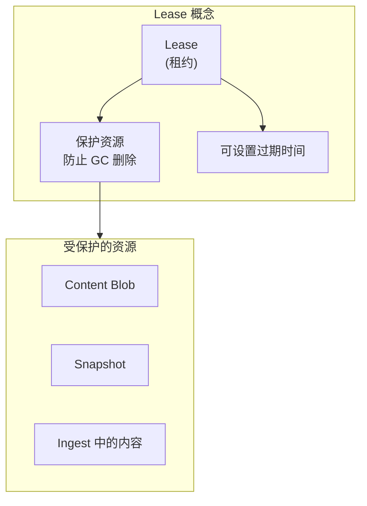
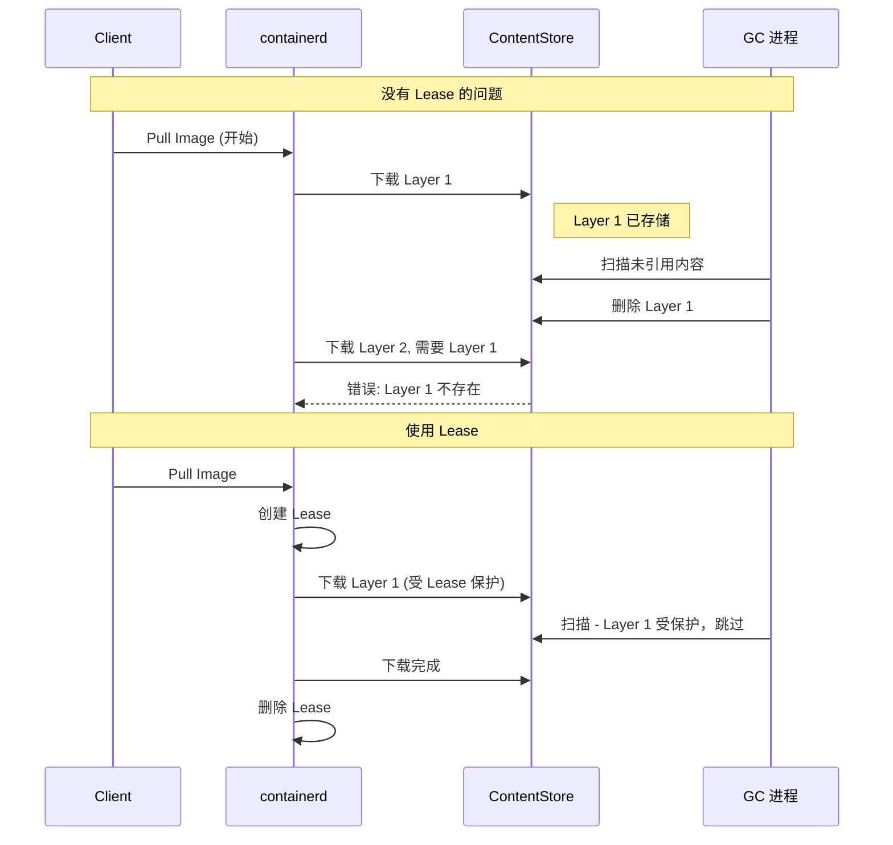
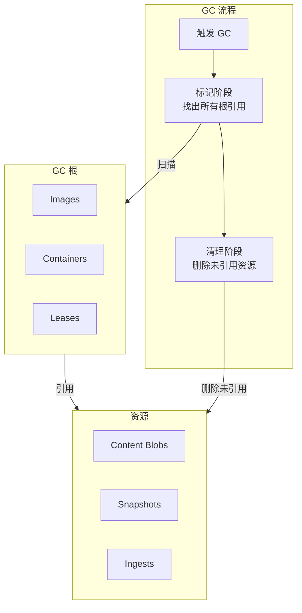
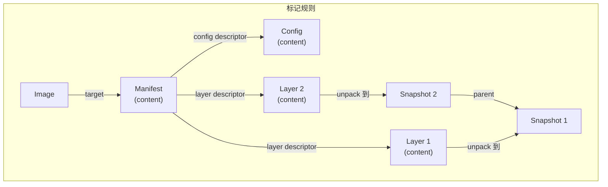

containerd 使用 Lease 机制保护正在使用的资源，并通过垃圾回收 (GC) 清理不再需要的数据。本章深入解析 Lease 和 GC 的工作原理。

## Lease 机制

### 什么是 Lease

Lease (租约) 是 containerd 中资源保护的核心机制：



### 为什么需要 Lease

在镜像拉取等长时间操作中，需要保护中间数据：



## Lease 接口

### Lease Manager

```go
// core/leases/leases.go

// Manager 管理 Lease 的生命周期
type Manager interface {
    // Create 创建新的 Lease
    Create(ctx context.Context, opts ...Opt) (Lease, error)

    // Delete 删除 Lease
    Delete(ctx context.Context, lease Lease, opts ...DeleteOpt) error

    // List 列出所有 Lease
    List(ctx context.Context, filters ...string) ([]Lease, error)

    // AddResource 向 Lease 添加资源
    AddResource(ctx context.Context, lease Lease, resource Resource) error

    // DeleteResource 从 Lease 删除资源
    DeleteResource(ctx context.Context, lease Lease, resource Resource) error

    // ListResources 列出 Lease 的所有资源
    ListResources(ctx context.Context, lease Lease) ([]Resource, error)
}
```

### Lease 结构

```go
// core/leases/leases.go

// Lease 租约
type Lease struct {
    // ID 唯一标识
    ID string

    // CreatedAt 创建时间
    CreatedAt time.Time

    // Labels 标签
    Labels map[string]string
}

// Resource 受保护的资源
type Resource struct {
    // ID 资源标识
    ID string

    // Type 资源类型
    Type string
}

// 资源类型常量
const (
    ResourceContent  = "content"
    ResourceSnapshot = "snapshots"
    ResourceIngest   = "ingests"
)
```

### Lease 创建选项

```go
// core/leases/leases.go

// Opt 创建选项
type Opt func(*Lease) error

// WithID 设置 Lease ID
func WithID(id string) Opt {
    return func(l *Lease) error {
        l.ID = id
        return nil
    }
}

// WithExpiration 设置过期时间
func WithExpiration(expiration time.Time) Opt {
    return func(l *Lease) error {
        l.Labels[labelExpiresAt] = expiration.Format(time.RFC3339)
        return nil
    }
}

// WithLabels 设置标签
func WithLabels(labels map[string]string) Opt {
    return func(l *Lease) error {
        for k, v := range labels {
            l.Labels[k] = v
        }
        return nil
    }
}
```

## Lease 使用示例

### 镜像拉取中的 Lease

```go
// client/pull.go

func (c *Client) Pull(ctx context.Context, ref string, opts ...RemoteOpt) (Image, error) {
    // 1. 创建 Lease
    ctx, done, err := c.WithLease(ctx)
    if err != nil {
        return nil, err
    }
    defer done(ctx)

    // 2. 在 Lease 保护下执行拉取
    // 所有下载的 content 和 snapshot 都会自动关联到 Lease

    // 3. 下载 Manifest
    manifest, err := c.fetch(ctx, ref)

    // 4. 下载 Layers
    for _, layer := range manifest.Layers {
        // 每个 Layer 下载时自动受 Lease 保护
        if err := c.downloadLayer(ctx, layer); err != nil {
            return nil, err
        }
    }

    // 5. 创建 Image 记录
    // Image 记录会引用这些 content

    // 6. done() 被调用时删除 Lease
    // 此时 content 已被 Image 引用，不会被 GC

    return image, nil
}
```

### WithLease 实现

```go
// client/client.go

// WithLease 创建带 Lease 的 context
func (c *Client) WithLease(ctx context.Context, opts ...leases.Opt) (context.Context, func(context.Context) error, error) {
    // 创建 Lease
    lease, err := c.LeasesService().Create(ctx, opts...)
    if err != nil {
        return nil, nil, err
    }

    // 将 Lease 放入 context
    ctx = leases.WithLease(ctx, lease.ID)

    // 返回清理函数
    return ctx, func(ctx context.Context) error {
        return c.LeasesService().Delete(ctx, lease)
    }, nil
}
```

## 垃圾回收 (GC)

### GC 工作原理



### GC 标记规则



### GC 标签

containerd 使用特殊标签标记资源引用关系：

```go
// 标签前缀
const (
    // GC 引用前缀
    labelGCRoot        = "containerd.io/gc.root"
    labelGCRef         = "containerd.io/gc.ref."
    labelGCContentRef  = "containerd.io/gc.ref.content."
    labelGCSnapshotRef = "containerd.io/gc.ref.snapshot."
)

// 示例：Manifest 引用 Layers
labels := map[string]string{
    "containerd.io/gc.ref.content.0": "sha256:layer1hash...",
    "containerd.io/gc.ref.content.1": "sha256:layer2hash...",
    "containerd.io/gc.ref.content.config": "sha256:confighash...",
}

// 示例：Image 作为 GC 根
labels := map[string]string{
    "containerd.io/gc.root": time.Now().Format(time.RFC3339),
}
```

## GC 实现

### GC 触发

```go
// core/metadata/gc.go

// GarbageCollect 执行垃圾回收
func (m *DB) GarbageCollect(ctx context.Context) (GCStats, error) {
    // 1. 标记阶段 - 找出所有可达资源
    marked, err := m.mark(ctx)
    if err != nil {
        return GCStats{}, err
    }

    // 2. 清理阶段 - 删除未标记资源
    stats, err := m.sweep(ctx, marked)
    if err != nil {
        return GCStats{}, err
    }

    return stats, nil
}
```

### 标记阶段

```go
// core/metadata/gc.go

func (m *DB) mark(ctx context.Context) (map[gc.Node]struct{}, error) {
    marked := make(map[gc.Node]struct{})

    if err := m.db.View(func(tx *bolt.Tx) error {
        // 1. 从 Images 开始标记
        if err := markImages(ctx, tx, marked); err != nil {
            return err
        }

        // 2. 从 Containers 开始标记
        if err := markContainers(ctx, tx, marked); err != nil {
            return err
        }

        // 3. 从 Leases 开始标记
        if err := markLeases(ctx, tx, marked); err != nil {
            return err
        }

        // 4. 传播标记 (跟踪引用链)
        return propagateMarks(ctx, tx, marked)
    }); err != nil {
        return nil, err
    }

    return marked, nil
}

func markImages(ctx context.Context, tx *bolt.Tx, marked map[gc.Node]struct{}) error {
    // 遍历所有 namespace
    return forEachNamespace(tx, func(ns string) error {
        bkt := getImagesBucket(tx, ns)
        if bkt == nil {
            return nil
        }

        return bkt.ForEach(func(k, v []byte) error {
            // 读取 Image 的 target descriptor
            ibkt := bkt.Bucket(k)
            if ibkt == nil {
                return nil
            }

            // 标记 target content
            targetData := ibkt.Get(bucketKeyTarget)
            if targetData != nil {
                var desc ocispec.Descriptor
                proto.Unmarshal(targetData, &desc)

                marked[gc.Node{
                    Type:      gc.ResourceContent,
                    Namespace: ns,
                    Key:       desc.Digest.String(),
                }] = struct{}{}
            }

            return nil
        })
    })
}
```

### 传播标记

```go
// core/metadata/gc.go

func propagateMarks(ctx context.Context, tx *bolt.Tx, marked map[gc.Node]struct{}) error {
    // 持续传播直到没有新增
    for {
        added := false

        for node := range marked {
            // 获取该节点引用的其他节点
            refs, err := getReferences(tx, node)
            if err != nil {
                return err
            }

            for _, ref := range refs {
                if _, ok := marked[ref]; !ok {
                    marked[ref] = struct{}{}
                    added = true
                }
            }
        }

        if !added {
            break
        }
    }

    return nil
}

func getReferences(tx *bolt.Tx, node gc.Node) ([]gc.Node, error) {
    var refs []gc.Node

    switch node.Type {
    case gc.ResourceContent:
        // Content 可能引用其他 Content (如 Manifest 引用 Layers)
        bkt := getContentBucket(tx, node.Namespace)
        if bkt == nil {
            return nil, nil
        }

        cbkt := bkt.Bucket(bucketKeyBlob).Bucket([]byte(node.Key))
        if cbkt == nil {
            return nil, nil
        }

        // 读取 gc.ref.content.* 标签
        labelsBkt := cbkt.Bucket(bucketKeyLabels)
        if labelsBkt != nil {
            labelsBkt.ForEach(func(k, v []byte) error {
                if strings.HasPrefix(string(k), labelGCContentRef) {
                    refs = append(refs, gc.Node{
                        Type:      gc.ResourceContent,
                        Namespace: node.Namespace,
                        Key:       string(v),
                    })
                }
                return nil
            })
        }

    case gc.ResourceSnapshot:
        // Snapshot 可能有 parent
        // ...
    }

    return refs, nil
}
```

### 清理阶段

```go
// core/metadata/gc.go

func (m *DB) sweep(ctx context.Context, marked map[gc.Node]struct{}) (GCStats, error) {
    var stats GCStats

    if err := m.db.Update(func(tx *bolt.Tx) error {
        // 1. 清理 Content
        if err := sweepContent(ctx, tx, marked, &stats); err != nil {
            return err
        }

        // 2. 清理 Snapshots
        if err := sweepSnapshots(ctx, tx, marked, &stats); err != nil {
            return err
        }

        // 3. 清理 Ingests
        if err := sweepIngests(ctx, tx, marked, &stats); err != nil {
            return err
        }

        return nil
    }); err != nil {
        return GCStats{}, err
    }

    return stats, nil
}

func sweepContent(ctx context.Context, tx *bolt.Tx, marked map[gc.Node]struct{}, stats *GCStats) error {
    return forEachNamespace(tx, func(ns string) error {
        bkt := getContentBucket(tx, ns)
        if bkt == nil {
            return nil
        }

        blob := bkt.Bucket(bucketKeyBlob)
        if blob == nil {
            return nil
        }

        // 收集要删除的 digest
        var toDelete [][]byte
        blob.ForEach(func(k, v []byte) error {
            node := gc.Node{
                Type:      gc.ResourceContent,
                Namespace: ns,
                Key:       string(k),
            }

            if _, ok := marked[node]; !ok {
                toDelete = append(toDelete, k)
            }
            return nil
        })

        // 删除未标记的内容
        for _, k := range toDelete {
            if err := blob.DeleteBucket(k); err != nil {
                return err
            }
            stats.ContentDeleted++
        }

        return nil
    })
}
```

## GC 配置

### 配置选项

```toml
# /etc/containerd/config.toml

[plugins."io.containerd.gc.v1.scheduler"]
  # GC 暂停时间
  pause_threshold = 0.02

  # 删除批次大小
  deletion_threshold = 0

  # 变更阈值触发 GC
  mutation_threshold = 100

  # 调度延迟
  schedule_delay = "0ms"

  # 启动延迟
  startup_delay = "100ms"
```

### 手动触发 GC

```bash
# 使用 ctr 触发 GC
ctr content gc

# 查看 GC 统计
ctr content gc --log-level debug
```

## Lease 与 GC 最佳实践

### 正确使用 Lease

```go
// 推荐：使用 WithLease
func pullImage(client *containerd.Client, ref string) error {
    ctx, done, err := client.WithLease(context.Background())
    if err != nil {
        return err
    }
    defer done(ctx)  // 确保清理

    // 执行操作
    _, err = client.Pull(ctx, ref)
    return err
}

// 避免：Lease 泄漏
func badPullImage(client *containerd.Client, ref string) error {
    lease, err := client.LeasesService().Create(ctx)
    if err != nil {
        return err
    }
    // 忘记删除 Lease！资源将永远无法 GC

    ctx = leases.WithLease(ctx, lease.ID)
    _, err = client.Pull(ctx, ref)
    return err
}
```

### 设置过期时间

```go
// 对于长时间运行的操作，设置过期时间作为保底
ctx, done, err := client.WithLease(ctx,
    leases.WithExpiration(time.Now().Add(time.Hour)),
)
if err != nil {
    return err
}
defer done(ctx)
```

## 小结

Lease 和 GC 是 containerd 资源管理的关键机制：

1. **Lease 保护**：在长时间操作中保护中间数据
2. **GC 清理**：自动清理不再使用的资源
3. **标记-清除**：基于引用关系的 GC 算法
4. **标签系统**：使用标签标记资源引用

理解这些机制对于：
- 排查资源泄漏问题
- 优化存储空间使用
- 正确实现客户端操作

下一节我们将学习 [事件发布订阅系统](./03-event-system.md)。

## 参考资料

- [containerd Garbage Collection](https://github.com/containerd/containerd/blob/main/docs/garbage-collection.md)
- [containerd Leases](https://github.com/containerd/containerd/tree/main/core/leases)
