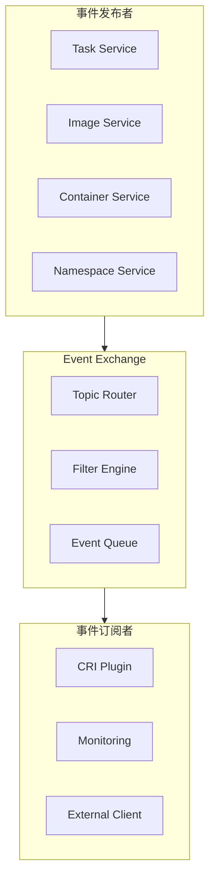
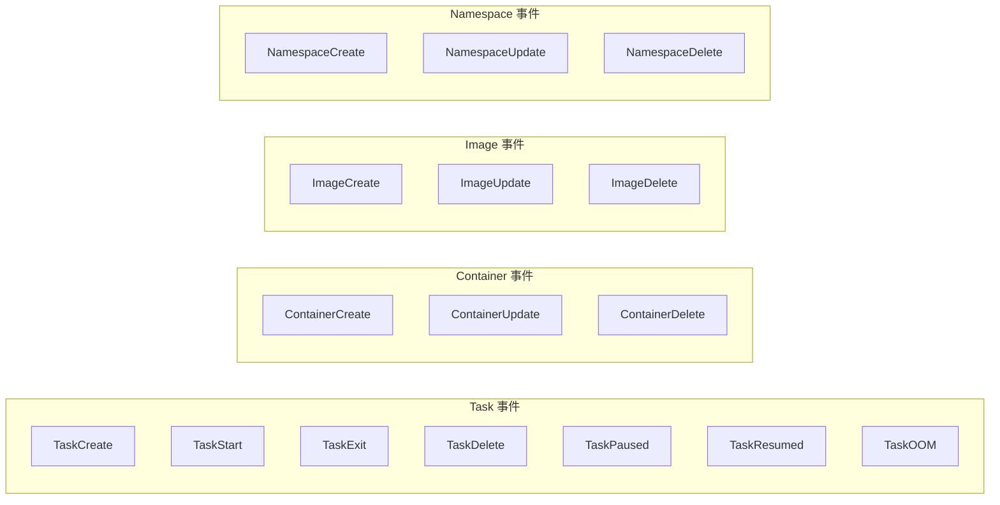

containerd 提供了完善的事件系统，用于通知组件状态变化。本章深入解析事件系统的架构和实现。

## 事件系统概述

### 事件系统架构



### 事件类型



## Event Exchange

### Exchange 接口

```go
// core/events/exchange/exchange.go

// Exchange 是事件交换中心
type Exchange struct {
    // 订阅者管理
    broadcasters map[string]*broadcaster

    // 锁
    mu sync.RWMutex
}

// Publisher 发布事件接口
type Publisher interface {
    Publish(ctx context.Context, topic string, event Event) error
}

// Subscriber 订阅事件接口
type Subscriber interface {
    Subscribe(ctx context.Context, filters ...string) (Subscription, error)
}

// Subscription 订阅句柄
type Subscription interface {
    Events() <-chan *events.Envelope
    Close() error
}
```

### 事件信封

```go
// api/events/container.pb.go

// Envelope 事件信封
type Envelope struct {
    // Timestamp 事件时间
    Timestamp time.Time

    // Namespace 命名空间
    Namespace string

    // Topic 事件主题
    Topic string

    // Event 事件数据 (protobuf Any)
    Event *anypb.Any
}

// 事件主题
const (
    // Task 相关
    TopicTaskCreate  = "/tasks/create"
    TopicTaskStart   = "/tasks/start"
    TopicTaskExit    = "/tasks/exit"
    TopicTaskDelete  = "/tasks/delete"
    TopicTaskPaused  = "/tasks/paused"
    TopicTaskResumed = "/tasks/resumed"
    TopicTaskOOM     = "/tasks/oom"

    // Container 相关
    TopicContainerCreate = "/containers/create"
    TopicContainerUpdate = "/containers/update"
    TopicContainerDelete = "/containers/delete"

    // Image 相关
    TopicImageCreate = "/images/create"
    TopicImageUpdate = "/images/update"
    TopicImageDelete = "/images/delete"
)
```

## 事件发布

### 发布实现

```go
// core/events/exchange/exchange.go

// Publish 发布事件
func (e *Exchange) Publish(ctx context.Context, topic string, event events.Event) error {
    // 1. 获取 namespace
    namespace, err := namespaces.NamespaceRequired(ctx)
    if err != nil {
        return err
    }

    // 2. 序列化事件
    any, err := typeurl.MarshalAny(event)
    if err != nil {
        return err
    }

    // 3. 构建事件信封
    envelope := &events.Envelope{
        Timestamp: time.Now().UTC(),
        Namespace: namespace,
        Topic:     topic,
        Event:     any,
    }

    // 4. 广播到所有订阅者
    e.mu.RLock()
    defer e.mu.RUnlock()

    for _, b := range e.broadcasters {
        b.broadcast(envelope)
    }

    return nil
}
```

### 在服务中发布事件

```go
// core/runtime/v2/shim.go

// 容器退出时发布事件
func (s *shim) processExits(ctx context.Context) {
    for exit := range s.exitCh {
        // 发布 TaskExit 事件
        if err := s.events.Publish(ctx, runtime.TaskExitEventTopic, &eventstypes.TaskExit{
            ContainerID: s.ID(),
            ID:          exit.ID,
            Pid:         exit.Pid,
            ExitStatus:  exit.Status,
            ExitedAt:    protobuf.ToTimestamp(exit.Timestamp),
        }); err != nil {
            log.G(ctx).WithError(err).Error("failed to publish TaskExit event")
        }
    }
}
```

```go
// core/metadata/images.go

// 创建镜像时发布事件
func (s *imageStore) Create(ctx context.Context, image images.Image) (images.Image, error) {
    // ... 创建镜像逻辑

    // 发布 ImageCreate 事件
    if s.publisher != nil {
        if err := s.publisher.Publish(ctx, "/images/create", &eventstypes.ImageCreate{
            Name:   image.Name,
            Labels: image.Labels,
        }); err != nil {
            log.G(ctx).WithError(err).Warnf("failed to publish ImageCreate event")
        }
    }

    return image, nil
}
```

## 事件订阅

### 订阅实现

```go
// core/events/exchange/exchange.go

// Subscribe 订阅事件
func (e *Exchange) Subscribe(ctx context.Context, filters ...string) (events.Subscription, error) {
    // 1. 创建订阅者
    sub := &subscription{
        ch:      make(chan *events.Envelope, 128),
        filters: filters,
    }

    // 2. 编译过滤器
    if len(filters) > 0 {
        var err error
        sub.matcher, err = compileFilters(filters)
        if err != nil {
            return nil, err
        }
    }

    // 3. 注册到广播器
    e.mu.Lock()
    id := e.nextID()
    e.broadcasters[id] = &broadcaster{
        subscription: sub,
    }
    e.mu.Unlock()

    // 4. 监听 context 取消
    go func() {
        <-ctx.Done()
        e.mu.Lock()
        delete(e.broadcasters, id)
        e.mu.Unlock()
        close(sub.ch)
    }()

    return sub, nil
}

// subscription 订阅实现
type subscription struct {
    ch      chan *events.Envelope
    filters []string
    matcher eventFilter
}

func (s *subscription) Events() <-chan *events.Envelope {
    return s.ch
}

func (s *subscription) Close() error {
    // 由 context 取消触发关闭
    return nil
}
```

### 使用订阅

```go
// client/events.go

// Subscribe 订阅事件
func (c *Client) Subscribe(ctx context.Context, filters ...string) (<-chan *events.Envelope, <-chan error) {
    evCh := make(chan *events.Envelope)
    errCh := make(chan error, 1)

    // 订阅
    sub, err := c.EventService().Subscribe(ctx, &eventsapi.SubscribeRequest{
        Filters: filters,
    })
    if err != nil {
        errCh <- err
        close(evCh)
        close(errCh)
        return evCh, errCh
    }

    // 接收事件
    go func() {
        defer close(evCh)
        defer close(errCh)

        for {
            ev, err := sub.Recv()
            if err != nil {
                errCh <- err
                return
            }

            select {
            case evCh <- ev:
            case <-ctx.Done():
                return
            }
        }
    }()

    return evCh, errCh
}
```

## 事件过滤

### 过滤器语法

```
# 基本语法
field==value       # 等于
field!=value       # 不等于
field~=regexp      # 正则匹配

# 示例
topic==/tasks/*              # 所有 Task 事件
namespace==default           # default 命名空间
topic==/containers/create    # 容器创建事件

# 组合过滤
topic==/tasks/*,namespace==k8s.io
```

### 过滤器实现

```go
// core/events/exchange/exchange.go

// eventFilter 事件过滤器
type eventFilter interface {
    Match(envelope *events.Envelope) bool
}

// compileFilters 编译过滤器
func compileFilters(filters []string) (eventFilter, error) {
    if len(filters) == 0 {
        return &matchAll{}, nil
    }

    var matchers []eventFilter
    for _, filter := range filters {
        m, err := compileFilter(filter)
        if err != nil {
            return nil, err
        }
        matchers = append(matchers, m)
    }

    return &orMatcher{matchers: matchers}, nil
}

// fieldMatcher 字段匹配器
type fieldMatcher struct {
    field    string
    op       string
    value    string
    regexp   *regexp.Regexp
}

func (m *fieldMatcher) Match(envelope *events.Envelope) bool {
    var fieldValue string
    switch m.field {
    case "topic":
        fieldValue = envelope.Topic
    case "namespace":
        fieldValue = envelope.Namespace
    default:
        return false
    }

    switch m.op {
    case "==":
        return fieldValue == m.value || matchWildcard(fieldValue, m.value)
    case "!=":
        return fieldValue != m.value
    case "~=":
        return m.regexp.MatchString(fieldValue)
    }

    return false
}
```

## CRI 事件处理

### 事件监控

```go
// internal/cri/server/events.go

// eventMonitor 事件监控
type eventMonitor struct {
    criService *CRIService
    events     <-chan *events.Envelope
    errors     <-chan error
}

// Run 启动事件监控
func (em *eventMonitor) Run(ctx context.Context) {
    for {
        select {
        case <-ctx.Done():
            return
        case err := <-em.errors:
            if err != nil {
                log.G(ctx).WithError(err).Error("event subscription error")
            }
        case e := <-em.events:
            if e != nil {
                em.handleEvent(ctx, e)
            }
        }
    }
}

// handleEvent 处理事件
func (em *eventMonitor) handleEvent(ctx context.Context, e *events.Envelope) {
    // 解析事件
    any, err := typeurl.UnmarshalAny(e.Event)
    if err != nil {
        log.G(ctx).WithError(err).Warn("failed to unmarshal event")
        return
    }

    switch e.Topic {
    case runtime.TaskExitEventTopic:
        em.handleTaskExit(ctx, any.(*eventstypes.TaskExit))
    case runtime.TaskOOMEventTopic:
        em.handleTaskOOM(ctx, any.(*eventstypes.TaskOOM))
    case runtime.TaskStartEventTopic:
        em.handleTaskStart(ctx, any.(*eventstypes.TaskStart))
    }
}
```

### 处理容器退出

```go
// internal/cri/server/events.go

func (em *eventMonitor) handleTaskExit(ctx context.Context, e *eventstypes.TaskExit) {
    // 1. 查找容器
    container, err := em.criService.containerStore.Get(e.ContainerID)
    if err != nil {
        // 可能是 sandbox 的退出
        em.handleSandboxExit(ctx, e)
        return
    }

    // 2. 更新容器状态
    container.Status.State = runtime.ContainerState_CONTAINER_EXITED
    container.Status.FinishedAt = e.ExitedAt.AsTime().UnixNano()
    container.Status.ExitCode = int32(e.ExitStatus)

    // 3. 保存状态
    em.criService.containerStore.Update(container)

    log.G(ctx).Infof("Container %s exited with code %d", e.ContainerID, e.ExitStatus)
}

func (em *eventMonitor) handleTaskOOM(ctx context.Context, e *eventstypes.TaskOOM) {
    // 记录 OOM 事件
    log.G(ctx).Warnf("Container %s OOM killed", e.ContainerID)

    // 更新容器 reason
    container, err := em.criService.containerStore.Get(e.ContainerID)
    if err != nil {
        return
    }

    container.Status.Reason = "OOMKilled"
    em.criService.containerStore.Update(container)
}
```

## gRPC 事件服务

### 服务定义

```protobuf
// api/services/events/v1/events.proto

service Events {
    // Publish 发布事件
    rpc Publish(PublishRequest) returns (google.protobuf.Empty);

    // Forward 转发事件 (从其他源)
    rpc Forward(ForwardRequest) returns (google.protobuf.Empty);

    // Subscribe 订阅事件 (流式)
    rpc Subscribe(SubscribeRequest) returns (stream Envelope);
}

message SubscribeRequest {
    repeated string filters = 1;
}

message PublishRequest {
    string topic = 1;
    google.protobuf.Any event = 2;
}
```

### 服务实现

```go
// plugins/services/events/service.go

type service struct {
    exchange *exchange.Exchange
}

func (s *service) Subscribe(req *api.SubscribeRequest, ss api.Events_SubscribeServer) error {
    ctx := ss.Context()

    // 订阅
    sub, err := s.exchange.Subscribe(ctx, req.Filters...)
    if err != nil {
        return err
    }

    // 发送事件
    for {
        select {
        case <-ctx.Done():
            return ctx.Err()
        case ev := <-sub.Events():
            if ev == nil {
                return nil
            }

            if err := ss.Send(ev); err != nil {
                return err
            }
        }
    }
}
```

## 使用 ctr 查看事件

### 命令行工具

```bash
# 订阅所有事件
ctr events

# 过滤特定主题
ctr events --filter "topic==/tasks/*"

# 过滤命名空间
ctr events --filter "namespace==k8s.io"

# 组合过滤
ctr events --filter "topic==/tasks/exit,namespace==default"
```

### 输出示例

```
2024-01-15 10:30:15.123456 /tasks/create {"container_id":"abc123","bundle":"/run/containerd/..."}
2024-01-15 10:30:15.234567 /tasks/start {"container_id":"abc123","pid":12345}
2024-01-15 10:30:45.345678 /tasks/exit {"container_id":"abc123","pid":12345,"exit_status":0}
2024-01-15 10:30:45.456789 /tasks/delete {"container_id":"abc123"}
```

## 事件持久化

### Forwarder 模式

containerd 支持将事件转发到外部系统：

```go
// core/events/events.go

// Forwarder 转发事件到其他系统
type Forwarder interface {
    Forward(ctx context.Context, envelope *events.Envelope) error
}

// 实现示例：发送到外部日志系统
type loggingForwarder struct {
    logger *log.Logger
}

func (f *loggingForwarder) Forward(ctx context.Context, envelope *events.Envelope) error {
    f.logger.Printf("[%s] %s: %s\n",
        envelope.Namespace,
        envelope.Topic,
        envelope.Event.String())
    return nil
}
```

### 外部集成

```go
// 集成示例：发送到 Kafka
type kafkaForwarder struct {
    producer kafka.Producer
    topic    string
}

func (f *kafkaForwarder) Forward(ctx context.Context, envelope *events.Envelope) error {
    data, err := proto.Marshal(envelope)
    if err != nil {
        return err
    }

    return f.producer.Produce(&kafka.Message{
        TopicPartition: kafka.TopicPartition{Topic: &f.topic},
        Value:          data,
    }, nil)
}
```

## 小结

containerd 事件系统提供了完善的状态通知机制：

1. **发布-订阅模式**：解耦事件生产者和消费者
2. **事件过滤**：支持主题和命名空间过滤
3. **gRPC 流式传输**：高效的事件推送
4. **可扩展性**：支持事件转发到外部系统

事件系统的应用场景：
- CRI 容器状态同步
- 监控和告警
- 审计日志
- 自定义工作流触发

下一章我们将学习 [性能分析](../09-performance/01-performance-model.md)。

## 参考资料

- [containerd Events](https://github.com/containerd/containerd/tree/main/core/events)
- [Events API](https://github.com/containerd/containerd/blob/main/api/services/events/v1/events.proto)
