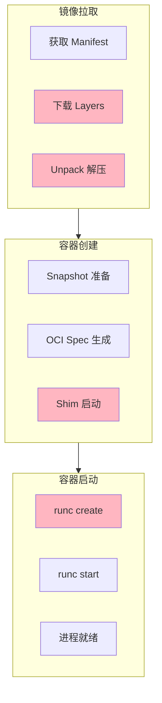
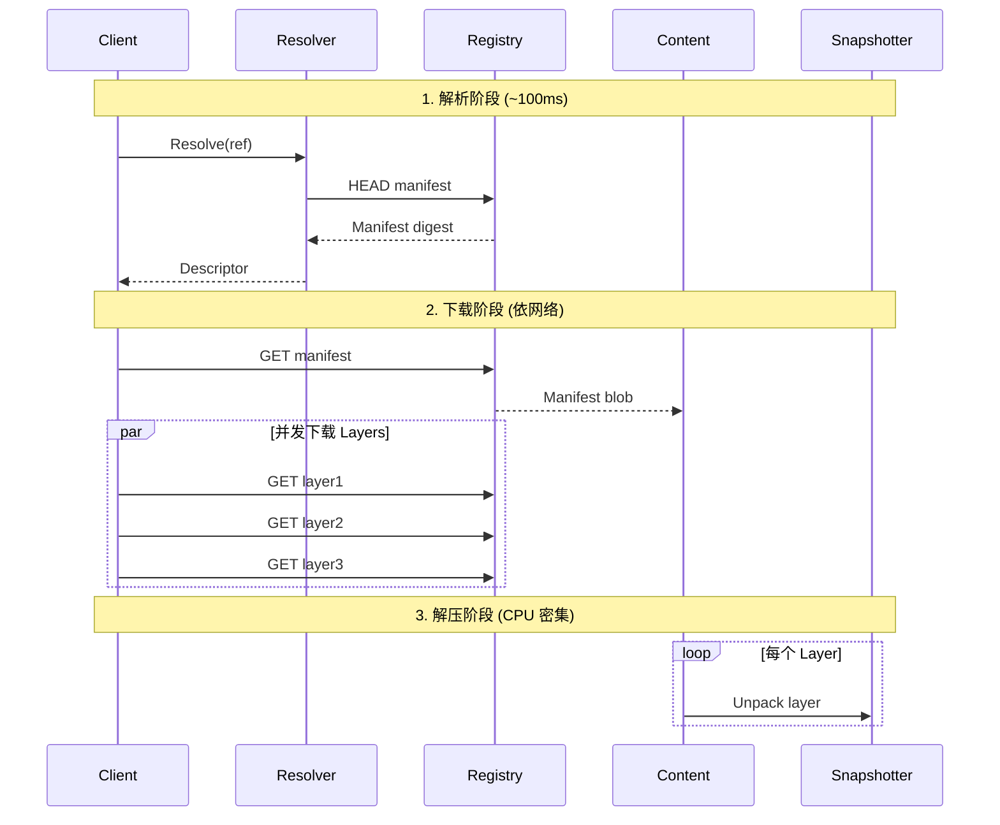
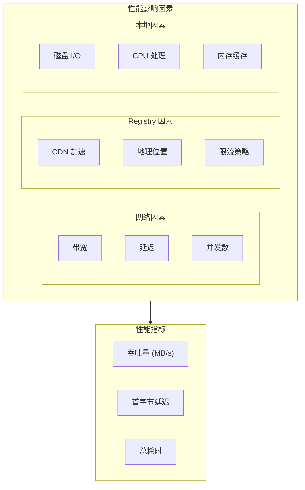
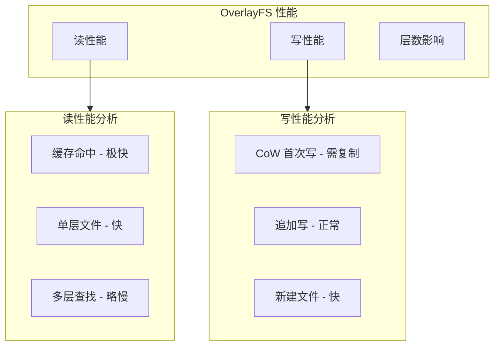
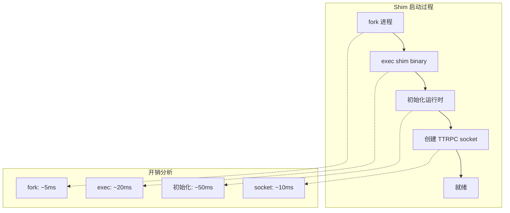
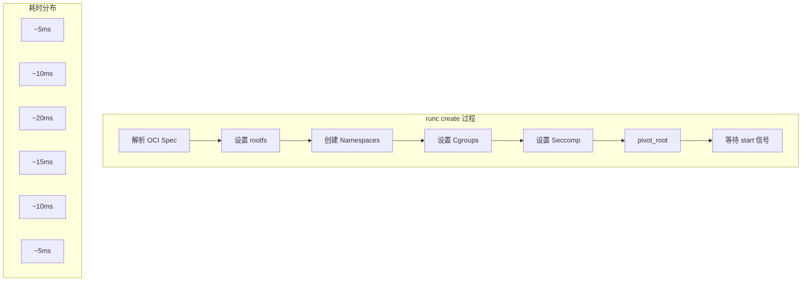
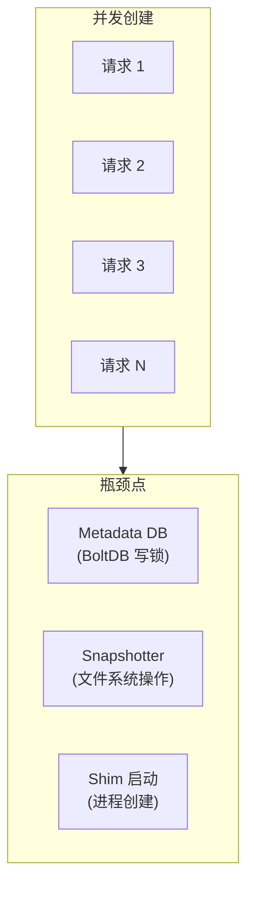
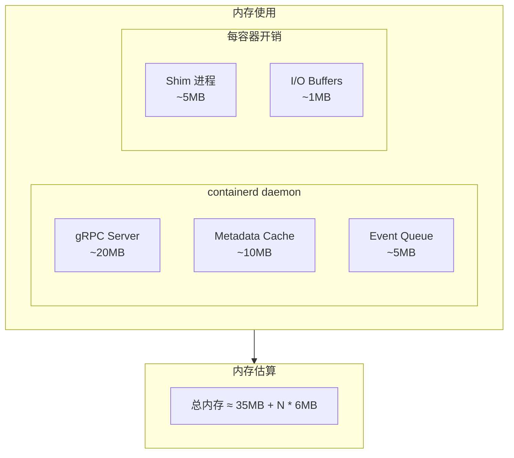
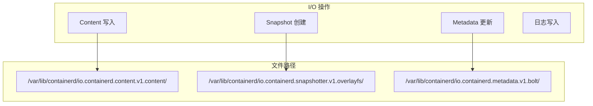

理解 containerd 的性能特性对于优化容器工作负载至关重要。本章深入分析 containerd 的性能模型和关键性能指标。

## 性能关键路径

### 容器生命周期性能



### 关键性能指标

| 阶段 | 指标 | 典型值 | 影响因素 |
|------|------|--------|----------|
| 镜像拉取 | 下载时间 | 依网络而定 | 网络带宽、镜像大小 |
| 镜像解压 | Unpack 时间 | 1-10s | Layer 大小、Snapshotter |
| 容器创建 | Create 时间 | 50-200ms | Snapshotter、Spec 复杂度 |
| 容器启动 | Start 时间 | 100-500ms | Shim 启动、进程初始化 |
| 容器停止 | Stop 时间 | 10-30s | 信号处理、清理操作 |

## 镜像拉取性能

### 拉取流程分解



### 拉取性能优化

```go
// 并发下载配置
type RemoteOpts struct {
    // 最大并发下载数
    MaxConcurrentDownloads int

    // 最大并发上传数
    MaxConcurrentUploads int

    // 平台过滤
    Platforms []string
}

// 使用示例
client.Pull(ctx, ref,
    containerd.WithMaxConcurrentDownloads(4),
    containerd.WithPlatform("linux/amd64"),
)
```

### 下载性能因素



## Snapshotter 性能

### 不同 Snapshotter 对比

| Snapshotter | Prepare | Commit | 空间效率 | 适用场景 |
|-------------|---------|--------|----------|----------|
| overlayfs | 快 (~10ms) | 快 | 高 | 通用，推荐 |
| native | 慢 (需复制) | 快 | 低 | 简单场景 |
| devmapper | 中等 | 中等 | 中等 | 需要隔离 |
| zfs | 快 | 快 | 高 | 需要 ZFS |

### Overlay 性能特点



### Unpack 性能

```go
// Unpack 性能测量
func measureUnpack(ctx context.Context, cs content.Store, ss snapshots.Snapshotter, layers []ocispec.Descriptor) {
    for i, layer := range layers {
        start := time.Now()

        // 解压单个 Layer
        if err := unpackLayer(ctx, cs, ss, layer); err != nil {
            log.Error(err)
        }

        elapsed := time.Since(start)
        log.Infof("Layer %d unpack: %v (size: %d)", i, elapsed, layer.Size)
    }
}
```

## 容器创建性能

### 创建流程分解

```mermaid
gantt
    title 容器创建时间线
    dateFormat X
    axisFormat %L ms

    section Snapshot
    Prepare Snapshot    :a1, 0, 50

    section Container
    Create Container    :a2, after a1, 20

    section Task
    Start Shim          :a3, after a2, 100
    Create Task         :a4, after a3, 80
    Start Task          :a5, after a4, 50
```



### Shim 启动开销



### 优化 Shim 启动

```toml
# /etc/containerd/config.toml

[plugins."io.containerd.runtime.v1.linux"]
  # 使用 shim 二进制缓存
  no_shim = false

  # shim 调试模式 (关闭以提升性能)
  shim_debug = false

[plugins."io.containerd.grpc.v1.cri".containerd.runtimes.runc]
  runtime_type = "io.containerd.runc.v2"

  [plugins."io.containerd.grpc.v1.cri".containerd.runtimes.runc.options]
    # 使用 systemd cgroup 驱动
    SystemdCgroup = true
```

## runc 执行性能

### runc create 分解



### Seccomp 性能影响

```go
// Seccomp 配置对性能的影响
type SeccompConfig struct {
    // 默认操作
    DefaultAction string

    // 系统调用规则数量
    // 规则越多，过滤开销越大
    Syscalls []SyscallRule
}

// 性能建议
// - 使用 SCMP_ACT_ALLOW 作为默认，只禁止危险调用
// - 减少规则数量
// - 使用 BPF 优化的 seccomp
```

## 并发性能

### 并发容器创建



### 并发性能测试

```go
// 并发创建容器测试
func BenchmarkConcurrentContainerCreate(b *testing.B) {
    client, _ := containerd.New(address)
    image, _ := client.Pull(ctx, "docker.io/library/alpine:latest")

    b.ResetTimer()
    b.RunParallel(func(pb *testing.PB) {
        for pb.Next() {
            id := uuid.New().String()
            container, _ := client.NewContainer(ctx, id,
                containerd.WithImage(image),
                containerd.WithNewSnapshot(id, image),
                containerd.WithNewSpec(oci.WithImageConfig(image)),
            )
            task, _ := container.NewTask(ctx, cio.NewCreator())
            task.Start(ctx)
            task.Kill(ctx, syscall.SIGKILL)
            task.Delete(ctx)
            container.Delete(ctx)
        }
    })
}
```

## 内存使用

### containerd 内存模型



### 内存优化配置

```toml
# /etc/containerd/config.toml

# 限制 OOM 分数
oom_score = -500

[plugins."io.containerd.grpc.v1.cri"]
  # 限制最大并发
  max_concurrent_downloads = 3

  # 镜像解密缓存大小
  image_decryption = false

[plugins."io.containerd.gc.v1.scheduler"]
  # 更激进的 GC
  pause_threshold = 0.01
  deletion_threshold = 0
```

## 磁盘 I/O 性能

### I/O 热点分析



### I/O 优化建议

```bash
# 1. 使用 SSD
# Content Store 和 Snapshotter 受益于 SSD

# 2. 分离存储
# 将不同组件放在不同磁盘
--root=/ssd/containerd
--state=/nvme/containerd-state

# 3. 使用 noatime 挂载选项
mount -o noatime /dev/sda1 /var/lib/containerd

# 4. 调整文件系统
# ext4: 启用 dir_index
tune2fs -O dir_index /dev/sda1

# xfs: 使用更大的 log
mkfs.xfs -l size=256m /dev/sda1
```

## 性能基准测试

### containerd-stress 工具

```bash
# 安装
go install github.com/containerd/containerd/cmd/containerd-stress@latest

# 运行测试
containerd-stress \
  --address /run/containerd/containerd.sock \
  --concurrent 10 \
  --duration 60s \
  --image docker.io/library/alpine:latest

# 输出示例
# Containers: 500
# Duration: 60.123s
# Rate: 8.31 containers/s
# Avg Create: 85ms
# Avg Start: 120ms
# Avg Stop: 45ms
```

### bucketbench 工具

```bash
# 安装
go install github.com/estesp/bucketbench@latest

# 运行测试
bucketbench \
  --driver containerd \
  --count 100 \
  --concurrency 10

# 对比不同运行时
bucketbench --driver docker --count 100
bucketbench --driver containerd --count 100
bucketbench --driver crio --count 100
```

## 小结

containerd 性能优化的关键点：

1. **镜像拉取**：并发下载、CDN 加速、本地缓存
2. **Snapshotter**：选择合适的后端、优化层数
3. **容器创建**：减少 Shim 开销、优化 Spec
4. **并发处理**：合理配置并发数、避免锁竞争
5. **I/O 优化**：使用 SSD、分离存储路径

理解性能模型有助于：
- 诊断性能瓶颈
- 优化容器启动时间
- 规划集群容量

下一节我们将学习 [性能剖析与分析](./02-profiling-guide.md)。

## 参考资料

- [containerd Performance](https://github.com/containerd/containerd/blob/main/docs/performance.md)
- [containerd-stress](https://github.com/containerd/containerd/tree/main/cmd/containerd-stress)
- [bucketbench](https://github.com/estesp/bucketbench)
