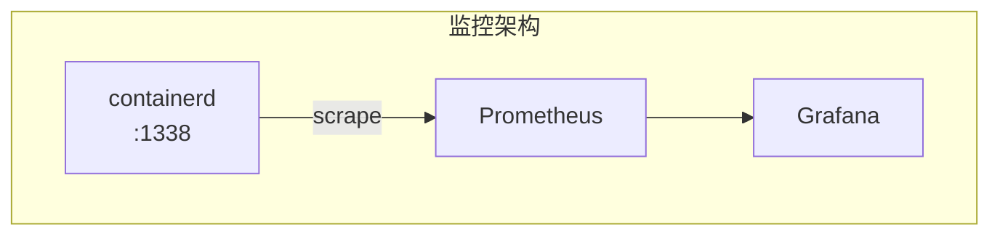
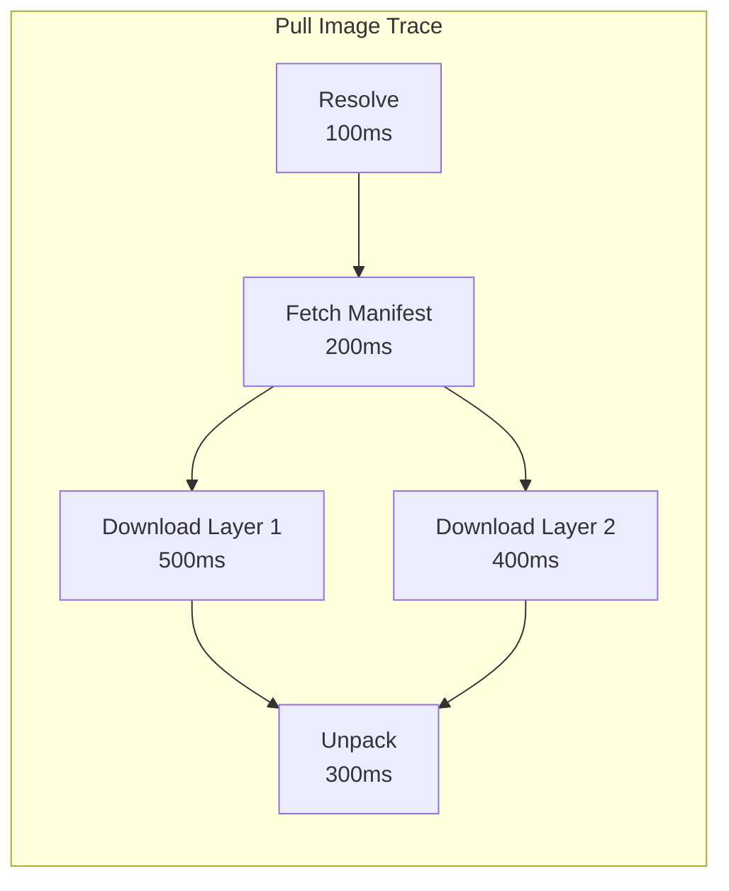
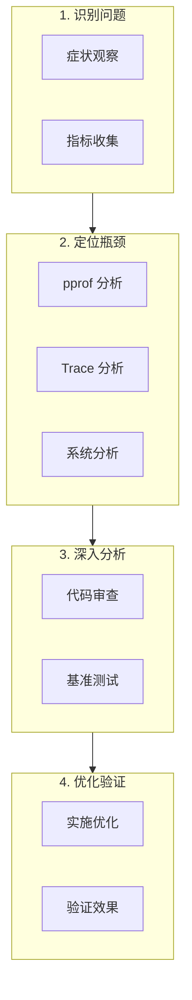

本章介绍如何使用各种工具对 containerd 进行性能剖析和分析，帮助定位性能瓶颈。

## Go pprof 集成

### 启用 pprof

containerd 内置了 pprof 支持：

```toml
# /etc/containerd/config.toml

[debug]
  # 启用 pprof
  address = "/run/containerd/debug.sock"
  uid = 0
  gid = 0
  level = "info"
```

### pprof 端点

```bash
# 通过 Unix socket 访问 pprof
# 需要使用 socat 或类似工具

# 方法 1: 使用 socat
socat TCP-LISTEN:6060,fork UNIX-CONNECT:/run/containerd/debug.sock &

# 然后访问 HTTP 端点
curl http://localhost:6060/debug/pprof/

# 方法 2: 直接使用 go tool pprof
go tool pprof http://localhost:6060/debug/pprof/profile?seconds=30
```

### CPU Profiling

```bash
# 收集 30 秒 CPU profile
curl -o cpu.prof "http://localhost:6060/debug/pprof/profile?seconds=30"

# 分析
go tool pprof cpu.prof

# 交互式命令
(pprof) top 20          # 显示前 20 个热点函数
(pprof) list funcName   # 查看函数源码
(pprof) web             # 在浏览器中查看火焰图

# 生成 SVG
go tool pprof -svg cpu.prof > cpu.svg
```

### Memory Profiling

```bash
# 获取堆内存 profile
curl -o heap.prof "http://localhost:6060/debug/pprof/heap"

# 分析
go tool pprof heap.prof

# 常用命令
(pprof) top 20 -cum     # 按累积分配排序
(pprof) list funcName   # 查看分配位置

# 查看内存分配趋势
go tool pprof -alloc_space heap.prof   # 总分配
go tool pprof -inuse_space heap.prof   # 当前使用
```

### Goroutine Profiling

```bash
# 获取 goroutine 信息
curl "http://localhost:6060/debug/pprof/goroutine?debug=1" > goroutines.txt

# 获取详细堆栈
curl "http://localhost:6060/debug/pprof/goroutine?debug=2" > goroutines_full.txt

# 分析 goroutine 泄漏
go tool pprof "http://localhost:6060/debug/pprof/goroutine"
```

### Block Profiling

```bash
# 启用 block profiling (需要在代码中设置)
# runtime.SetBlockProfileRate(1)

# 获取阻塞 profile
curl -o block.prof "http://localhost:6060/debug/pprof/block"

# 分析锁竞争
go tool pprof block.prof
(pprof) top 10
```

## Prometheus 指标

### 内置指标

containerd 暴露 Prometheus 指标：

```toml
# /etc/containerd/config.toml

[metrics]
  address = "127.0.0.1:1338"
  grpc_histogram = true
```

### 关键指标

```bash
# 获取指标
curl http://localhost:1338/v1/metrics

# 常用指标
containerd_container_count{namespace="default"}           # 容器数量
containerd_task_count{namespace="default"}                # Task 数量
containerd_image_count{namespace="default"}               # 镜像数量
containerd_snapshot_count{snapshotter="overlayfs"}        # 快照数量

# gRPC 指标
grpc_server_handled_total{method="/containerd.services.tasks.v1.Tasks/Create"}
grpc_server_handling_seconds_bucket{method="...",le="0.1"}

# 资源指标
process_resident_memory_bytes     # 内存使用
process_cpu_seconds_total         # CPU 使用
go_goroutines                     # Goroutine 数量
```

### Grafana 仪表板

```yaml
# Prometheus 抓取配置
scrape_configs:
  - job_name: 'containerd'
    static_configs:
      - targets: ['localhost:1338']
    metrics_path: /v1/metrics
```



## OpenTelemetry Tracing

### 启用 Tracing

```toml
# /etc/containerd/config.toml

[plugins."io.containerd.tracing.v1.otlp"]
  endpoint = "localhost:4317"
  protocol = "grpc"
  insecure = true
```

### Trace 示例



### Jaeger 集成

```bash
# 启动 Jaeger
docker run -d --name jaeger \
  -p 6831:6831/udp \
  -p 16686:16686 \
  -p 4317:4317 \
  jaegertracing/all-in-one:latest

# 访问 Jaeger UI
# http://localhost:16686

# 在 containerd 配置中启用
[plugins."io.containerd.tracing.v1.otlp"]
  endpoint = "localhost:4317"
```

## 系统级分析

### strace 分析

```bash
# 跟踪 containerd 系统调用
strace -f -p $(pidof containerd) -o containerd.strace 2>&1

# 统计系统调用
strace -c -f -p $(pidof containerd)

# 跟踪特定调用
strace -e trace=open,read,write -f -p $(pidof containerd)

# 跟踪 Shim 进程
strace -f -p $(pidof containerd-shim-runc-v2) -o shim.strace
```

### perf 分析

```bash
# CPU 热点分析
perf record -p $(pidof containerd) -g -- sleep 30
perf report

# 生成火焰图
perf script | stackcollapse-perf.pl | flamegraph.pl > containerd-flame.svg

# 统计缓存未命中
perf stat -e cache-misses,cache-references -p $(pidof containerd) -- sleep 10

# 跟踪上下文切换
perf stat -e context-switches -p $(pidof containerd) -- sleep 10
```

### bpftrace 分析

```bash
# 跟踪 containerd 文件操作
bpftrace -e 'tracepoint:syscalls:sys_enter_openat /comm == "containerd"/ { printf("%s %s\n", comm, str(args->filename)); }'

# 跟踪进程创建
bpftrace -e 'tracepoint:syscalls:sys_enter_clone /comm == "containerd"/ { printf("clone: %s\n", comm); }'

# 文件 I/O 延迟
bpftrace -e '
kprobe:vfs_read /comm == "containerd"/ { @start[tid] = nsecs; }
kretprobe:vfs_read /comm == "containerd" && @start[tid]/ {
    @latency = hist(nsecs - @start[tid]);
    delete(@start[tid]);
}'
```

## 容器启动分析

### 启动时间分解

```bash
# 使用 ctr 测量启动时间
time ctr run --rm docker.io/library/alpine:latest test echo hello

# 详细时间戳
ctr --debug run --rm docker.io/library/alpine:latest test echo hello 2>&1 | grep -E "time|duration"
```

### 自定义计时

```go
// 在代码中添加计时
func createContainer(ctx context.Context, client *containerd.Client) {
    // 镜像获取
    start := time.Now()
    image, _ := client.GetImage(ctx, "docker.io/library/alpine:latest")
    log.Printf("GetImage: %v", time.Since(start))

    // 容器创建
    start = time.Now()
    container, _ := client.NewContainer(ctx, "test",
        containerd.WithImage(image),
        containerd.WithNewSnapshot("test", image),
        containerd.WithNewSpec(oci.WithImageConfig(image)),
    )
    log.Printf("NewContainer: %v", time.Since(start))

    // Task 创建
    start = time.Now()
    task, _ := container.NewTask(ctx, cio.NewCreator())
    log.Printf("NewTask: %v", time.Since(start))

    // 启动
    start = time.Now()
    task.Start(ctx)
    log.Printf("Start: %v", time.Since(start))
}
```

## 日志分析

### 启用 Debug 日志

```toml
# /etc/containerd/config.toml
[debug]
  level = "debug"
```

### 日志时间戳分析

```bash
# 提取带时间戳的日志
journalctl -u containerd --since "5 minutes ago" -o short-precise

# 分析操作耗时
journalctl -u containerd | grep -E "CreateTask|StartTask" | \
  awk '{print $1, $2, $3, $NF}'

# 统计错误
journalctl -u containerd | grep -c "error"
```

## 分析工具汇总

### 工具对照表

| 工具 | 用途 | 使用场景 |
|------|------|----------|
| pprof | CPU/内存/goroutine | Go 应用内部分析 |
| Prometheus | 指标监控 | 长期趋势观察 |
| Jaeger | 分布式追踪 | 请求链路分析 |
| strace | 系统调用 | 底层行为分析 |
| perf | 性能计数器 | CPU/缓存分析 |
| bpftrace | 动态追踪 | 自定义探针 |

### 分析流程



## 常见性能问题诊断

### CPU 高占用

```bash
# 1. 获取 CPU profile
go tool pprof http://localhost:6060/debug/pprof/profile?seconds=30

# 2. 查看热点
(pprof) top 20

# 3. 常见原因
# - GC 压力大
# - 锁竞争
# - 序列化/反序列化
```

### 内存增长

```bash
# 1. 对比两个时间点的 heap
go tool pprof -base heap1.prof heap2.prof

# 2. 查看 goroutine 泄漏
curl "http://localhost:6060/debug/pprof/goroutine?debug=1" | grep -c "^goroutine"

# 3. 常见原因
# - goroutine 泄漏
# - 缓存未清理
# - 事件队列堆积
```

### 延迟增加

```bash
# 1. 查看 gRPC 延迟分布
curl http://localhost:1338/v1/metrics | grep handling_seconds

# 2. 分析 trace
# 在 Jaeger 中查看慢请求

# 3. 常见原因
# - 磁盘 I/O 慢
# - 网络延迟
# - 锁等待
```

## 小结

性能剖析的关键步骤：

1. **收集数据**：使用 pprof、metrics、tracing
2. **识别瓶颈**：分析热点函数、慢请求
3. **深入分析**：结合系统工具 (strace, perf)
4. **验证优化**：基准测试、对比指标

常用工具组合：
- 开发环境：pprof + Delve
- 生产环境：Prometheus + Jaeger
- 深度分析：perf + bpftrace

下一节我们将学习 [性能优化实践](./03-optimization-tips.md)。

## 参考资料

- [Go pprof](https://pkg.go.dev/net/http/pprof)
- [Prometheus Metrics](https://prometheus.io/docs/concepts/metric_types/)
- [OpenTelemetry](https://opentelemetry.io/)
- [perf Examples](https://www.brendangregg.com/perf.html)
