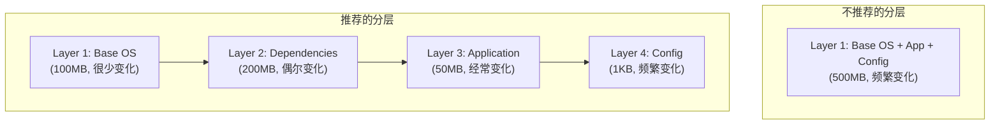
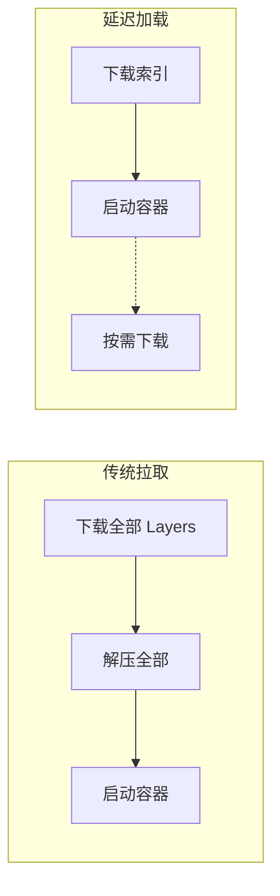

本章提供 containerd 生产环境的性能优化建议和最佳实践。

## 镜像优化

### 镜像分层策略



### 镜像大小优化

```dockerfile
# 多阶段构建
FROM golang:1.21 AS builder
WORKDIR /app
COPY . .
RUN CGO_ENABLED=0 go build -o /app/server

FROM scratch
COPY --from=builder /app/server /server
ENTRYPOINT ["/server"]
```

```bash
# 使用更小的基础镜像
# alpine (~5MB) vs ubuntu (~70MB) vs scratch (0MB)

# 清理不必要的文件
RUN apt-get update && apt-get install -y package \
    && rm -rf /var/lib/apt/lists/*
```

### 并发拉取配置

```toml
# /etc/containerd/config.toml

[plugins."io.containerd.grpc.v1.cri"]
  # 最大并发下载数 (根据带宽调整)
  max_concurrent_downloads = 3

  # 最大并发上传数
  max_concurrent_uploads = 2
```

```go
// 客户端配置
client.Pull(ctx, ref,
    containerd.WithMaxConcurrentDownloads(4),
    containerd.WithPlatformMatcher(platforms.Default()),
)
```

## Snapshotter 优化

### 选择合适的 Snapshotter

| Snapshotter | 场景 | 优化建议 |
|-------------|------|----------|
| overlayfs | 通用场景 | 使用内核 5.11+ 获得最佳性能 |
| native | 调试/简单场景 | 避免在生产使用 |
| devmapper | 需要块设备隔离 | 预分配 thin pool |
| stargz | 延迟加载 | 配合 eStargz 镜像 |

### Overlay 优化

```bash
# 使用 overlay2 (不是 overlay)
# 检查内核支持
modprobe overlay
cat /proc/filesystems | grep overlay

# 挂载选项优化
# metacopy=on: 仅复制元数据，不复制数据
# index=off: 禁用索引 (轻微提升性能)
mount -t overlay overlay -o \
  lowerdir=/lower,upperdir=/upper,workdir=/work,metacopy=on,index=off \
  /merged
```

### Lazy Pulling (Stargz)

```toml
# 启用 stargz snapshotter
[proxy_plugins]
  [proxy_plugins.stargz]
    type = "snapshot"
    address = "/run/containerd-stargz-grpc/containerd-stargz-grpc.sock"
```



## 容器启动优化

### Shim 启动优化

```toml
# /etc/containerd/config.toml

[plugins."io.containerd.grpc.v1.cri".containerd.runtimes.runc]
  runtime_type = "io.containerd.runc.v2"

  [plugins."io.containerd.grpc.v1.cri".containerd.runtimes.runc.options]
    # 使用 systemd cgroup 驱动 (Kubernetes 推荐)
    SystemdCgroup = true

    # 禁用 shim 调试
    ShimCgroup = ""
```

### 预创建 Sandbox

在 Kubernetes 环境中，可以预创建 Sandbox 以加速 Pod 启动：

```yaml
# 使用 RuntimeClass 预热
apiVersion: node.k8s.io/v1
kind: RuntimeClass
metadata:
  name: prewarmed
handler: runc
scheduling:
  nodeSelector:
    node.kubernetes.io/prewarmed: "true"
```

### OCI Spec 优化

```go
// 简化 Spec 配置
spec := &oci.Spec{
    Process: &specs.Process{
        Args: []string{"/app"},
        // 避免不必要的能力
        Capabilities: &specs.LinuxCapabilities{},
    },
    Linux: &specs.Linux{
        // 使用 cgroup v2
        CgroupsPath: "/system.slice/containerd.service",
        // 简化 seccomp
        Seccomp: nil,  // 或使用简化的 profile
    },
}
```

## 网络优化

### CNI 配置优化

```json
{
    "cniVersion": "1.0.0",
    "name": "containerd-net",
    "plugins": [
        {
            "type": "bridge",
            "bridge": "cni0",
            "isGateway": true,
            "ipMasq": true,
            "hairpinMode": true,
            "ipam": {
                "type": "host-local",
                "ranges": [[{"subnet": "10.88.0.0/16"}]],
                "routes": [{"dst": "0.0.0.0/0"}]
            }
        }
    ]
}
```

### 网络命名空间重用

```go
// 在同一 Pod 中重用网络命名空间
spec.Linux.Namespaces = []specs.LinuxNamespace{
    {
        Type: specs.NetworkNamespace,
        Path: fmt.Sprintf("/proc/%d/ns/net", sandboxPid),  // 共享
    },
    {
        Type: specs.MountNamespace,  // 独立
    },
}
```

## 存储优化

### Content Store 优化

```bash
# 定期运行 GC
ctr content gc

# 设置 GC 策略
# /etc/containerd/config.toml
[plugins."io.containerd.gc.v1.scheduler"]
  pause_threshold = 0.02
  deletion_threshold = 0
  mutation_threshold = 100
  schedule_delay = "0ms"
  startup_delay = "100ms"
```

### 磁盘布局优化

```bash
# 分离存储路径
# Content Store 放在快速存储
/ssd/containerd/content/

# Snapshots 可以放在较慢存储
/hdd/containerd/snapshots/

# 配置
[plugins."io.containerd.grpc.v1.cri"]
  [plugins."io.containerd.grpc.v1.cri".containerd]
    snapshotter = "overlayfs"
    default_runtime_name = "runc"
```

### 文件系统优化

```bash
# ext4 优化
tune2fs -O dir_index /dev/sda1
tune2fs -o journal_data_writeback /dev/sda1
mount -o noatime,nodiratime,data=writeback /dev/sda1 /var/lib/containerd

# xfs 优化
mkfs.xfs -n size=64k -l size=256m /dev/sda1
mount -o noatime,nodiratime,logbsize=256k /dev/sda1 /var/lib/containerd
```

## 内存优化

### 限制 containerd 内存

```toml
# /etc/containerd/config.toml
oom_score = 0  # 防止被 OOM killer 杀死
```

```bash
# 使用 systemd 限制
# /etc/systemd/system/containerd.service.d/memory.conf
[Service]
MemoryMax=2G
MemoryHigh=1.5G
```

### 减少缓存占用

```go
// 定期清理未使用的镜像
images, _ := client.ImageService().List(ctx)
for _, img := range images {
    // 检查是否有容器使用
    if !isImageInUse(img) {
        client.ImageService().Delete(ctx, img.Name)
    }
}
```

## Kubernetes 集群优化

### kubelet 配置

```yaml
# /var/lib/kubelet/config.yaml
containerRuntimeEndpoint: unix:///run/containerd/containerd.sock
imageServiceEndpoint: unix:///run/containerd/containerd.sock
serializeImagePulls: false  # 并行拉取
imageGCHighThresholdPercent: 85
imageGCLowThresholdPercent: 80
```

### Pod 资源配置

```yaml
apiVersion: v1
kind: Pod
spec:
  containers:
  - name: app
    resources:
      requests:
        memory: "128Mi"
        cpu: "100m"
      limits:
        memory: "256Mi"
        cpu: "500m"
    # 使用 emptyDir 而非 hostPath 可减少挂载开销
    volumeMounts:
    - name: cache
      mountPath: /cache
  volumes:
  - name: cache
    emptyDir:
      sizeLimit: 100Mi
```

### 镜像预拉取

```yaml
# DaemonSet 预拉取镜像
apiVersion: apps/v1
kind: DaemonSet
metadata:
  name: image-prepuller
spec:
  selector:
    matchLabels:
      app: prepuller
  template:
    spec:
      initContainers:
      - name: prepull
        image: myregistry/myapp:latest
        command: ["echo", "Image pulled"]
      containers:
      - name: pause
        image: k8s.gcr.io/pause:3.9
```

## 监控与告警

### 关键指标告警

```yaml
# Prometheus 告警规则
groups:
- name: containerd
  rules:
  - alert: ContainerdHighMemory
    expr: process_resident_memory_bytes{job="containerd"} > 2e9
    for: 5m
    labels:
      severity: warning
    annotations:
      summary: "containerd memory usage high"

  - alert: ContainerdHighGoroutines
    expr: go_goroutines{job="containerd"} > 1000
    for: 5m
    labels:
      severity: warning
    annotations:
      summary: "containerd goroutine count high"

  - alert: ContainerCreateSlow
    expr: histogram_quantile(0.99, rate(grpc_server_handling_seconds_bucket{method="/containerd.services.tasks.v1.Tasks/Create"}[5m])) > 1
    for: 5m
    labels:
      severity: warning
    annotations:
      summary: "Container creation is slow"
```

## 最佳实践清单

### 部署前检查

```bash
# 1. 检查内核版本
uname -r  # 推荐 5.4+

# 2. 检查 cgroup 版本
cat /proc/filesystems | grep cgroup  # 推荐 cgroup2

# 3. 检查 overlayfs 支持
modprobe overlay && lsmod | grep overlay

# 4. 检查磁盘性能
fio --randread --size=1G --numjobs=4 --name=test

# 5. 检查网络延迟
ping -c 10 registry.example.com
```

### 配置检查

```bash
# 验证 containerd 配置
containerd config dump

# 检查 CRI 配置
crictl info

# 检查运行时
ctr plugins ls | grep -E "runtime|snapshotter"
```

## 小结

性能优化的核心原则：

1. **减少层数**：合理设计镜像分层
2. **并行处理**：充分利用并发能力
3. **缓存利用**：合理配置缓存策略
4. **资源隔离**：避免资源争抢
5. **监控告警**：及时发现问题

优化优先级：
1. 镜像大小和分层
2. Snapshotter 选择
3. 网络配置
4. 存储布局
5. 资源限制

下一章我们将学习 [调试指南](../10-debugging/01-debug-environment.md)。

## 参考资料

- [containerd Production Recommendations](https://github.com/containerd/containerd/blob/main/docs/getting-started.md)
- [Kubernetes Container Runtime](https://kubernetes.io/docs/setup/production-environment/container-runtimes/)
- [Linux Performance Tuning](https://www.brendangregg.com/linuxperf.html)
