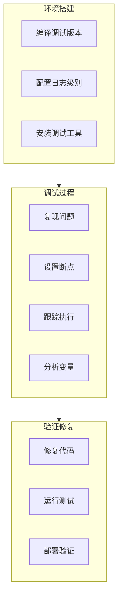

本章介绍如何搭建 containerd 的开发调试环境，为深入分析问题做好准备。

## 编译调试版本

### 获取源码

```bash
# 克隆仓库
git clone https://github.com/containerd/containerd.git
cd containerd

# 检出特定版本
git checkout v2.0.0
```

### 编译选项

```bash
# 标准编译
make

# 带调试信息编译
make GODEBUG=1

# 禁用优化 (更好的调试体验)
go build -gcflags="all=-N -l" ./cmd/containerd

# 编译所有二进制
make binaries

# 编译结果位置
ls bin/
# containerd  containerd-shim-runc-v2  ctr
```

### 编译配置

```bash
# Makefile 中的关键变量
# GOOS: 目标操作系统
# GOARCH: 目标架构
# VERSION: 版本号
# REVISION: Git 提交

# 交叉编译示例
GOOS=linux GOARCH=arm64 make binaries
```

## Delve 调试器

### 安装 Delve

```bash
# 安装最新版本
go install github.com/go-delve/delve/cmd/dlv@latest

# 验证安装
dlv version
```

### 调试 containerd

```bash
# 方法 1: 启动时调试
dlv exec ./bin/containerd -- --config /etc/containerd/config.toml

# 方法 2: 附加到运行中的进程
dlv attach $(pidof containerd)

# 方法 3: 远程调试
# 服务端
dlv exec --headless --listen=:2345 --api-version=2 ./bin/containerd -- --config /etc/containerd/config.toml

# 客户端
dlv connect localhost:2345
```

### Delve 常用命令

```bash
# 断点操作
(dlv) break main.main                        # 函数断点
(dlv) break file.go:100                      # 行断点
(dlv) break pkg.Func if x > 10               # 条件断点
(dlv) breakpoints                            # 列出断点
(dlv) clear 1                                # 删除断点

# 执行控制
(dlv) continue                               # 继续执行
(dlv) next                                   # 下一行
(dlv) step                                   # 进入函数
(dlv) stepout                                # 跳出函数
(dlv) restart                                # 重启

# 变量查看
(dlv) print varName                          # 打印变量
(dlv) locals                                 # 本地变量
(dlv) args                                   # 函数参数
(dlv) whatis varName                         # 变量类型

# 协程
(dlv) goroutines                             # 列出 goroutines
(dlv) goroutine 1                            # 切换到 goroutine
(dlv) stack                                  # 当前调用栈
```

### VSCode 集成

```json
// .vscode/launch.json
{
    "version": "0.2.0",
    "configurations": [
        {
            "name": "Debug containerd",
            "type": "go",
            "request": "launch",
            "mode": "exec",
            "program": "${workspaceFolder}/bin/containerd",
            "args": ["--config", "/etc/containerd/config.toml"],
            "env": {
                "GODEBUG": "1"
            },
            "asRoot": true
        },
        {
            "name": "Attach to containerd",
            "type": "go",
            "request": "attach",
            "mode": "remote",
            "remotePath": "${workspaceFolder}",
            "port": 2345,
            "host": "127.0.0.1"
        },
        {
            "name": "Debug Test",
            "type": "go",
            "request": "launch",
            "mode": "test",
            "program": "${fileDirname}",
            "args": ["-test.v", "-test.run", "TestName"]
        }
    ]
}
```

## 日志配置

### 日志级别

```toml
# /etc/containerd/config.toml
[debug]
  level = "debug"  # trace, debug, info, warn, error, fatal, panic
```

### 运行时日志

```bash
# 查看 containerd 日志
journalctl -u containerd -f

# 带时间戳
journalctl -u containerd -o short-precise -f

# 过滤特定关键字
journalctl -u containerd | grep -E "error|warn"

# 指定时间范围
journalctl -u containerd --since "10 minutes ago"
```

### 代码中添加日志

```go
import "github.com/containerd/log"

func myFunction(ctx context.Context) {
    // 不同级别的日志
    log.G(ctx).Trace("trace message")
    log.G(ctx).Debug("debug message")
    log.G(ctx).Info("info message")
    log.G(ctx).Warn("warning message")
    log.G(ctx).Error("error message")

    // 带字段的日志
    log.G(ctx).WithFields(log.Fields{
        "container_id": containerID,
        "action":       "create",
    }).Info("container created")

    // 带错误的日志
    if err != nil {
        log.G(ctx).WithError(err).Error("operation failed")
    }
}
```

## 调试工具

### ctr 命令行

```bash
# 基本信息
ctr version
ctr plugins ls

# 镜像操作
ctr images ls
ctr images pull docker.io/library/alpine:latest
ctr images check

# 容器操作
ctr containers ls
ctr containers info <container_id>
ctr containers rm <container_id>

# Task 操作
ctr tasks ls
ctr tasks ps <container_id>
ctr tasks exec --exec-id <id> <container_id> sh

# 快照操作
ctr snapshots ls
ctr snapshots info <key>
ctr snapshots tree

# 内容操作
ctr content ls
ctr content get <digest>

# 事件
ctr events

# 调试模式
ctr --debug <command>
```

### crictl 工具

```bash
# 配置
cat > /etc/crictl.yaml << EOF
runtime-endpoint: unix:///run/containerd/containerd.sock
image-endpoint: unix:///run/containerd/containerd.sock
timeout: 10
debug: false
EOF

# Pod 操作
crictl pods
crictl inspectp <pod_id>
crictl runp sandbox.json

# 容器操作
crictl ps -a
crictl inspect <container_id>
crictl logs <container_id>
crictl exec -it <container_id> sh

# 镜像操作
crictl images
crictl pull <image>
crictl rmi <image>

# 调试
crictl info
crictl stats
```

### nsenter 命令

```bash
# 进入容器的各种 namespace
# 获取容器 PID
PID=$(crictl inspect <container_id> | jq '.info.pid')

# 进入网络命名空间
nsenter -t $PID -n ip addr

# 进入 mount 命名空间
nsenter -t $PID -m ls /

# 进入所有命名空间
nsenter -t $PID -a sh

# 指定多个命名空间
nsenter -t $PID -n -m -p -i -u sh
```

### runc 调试

```bash
# 列出容器
runc list

# 容器状态
runc state <container_id>

# 查看 OCI spec
cat /run/containerd/io.containerd.runtime.v2.task/default/<container_id>/config.json | jq .

# 执行命令
runc exec <container_id> ls

# 事件
runc events <container_id>
```

## 测试环境

### 单元测试

```bash
# 运行所有测试
make test

# 运行特定包的测试
go test -v ./core/content/...

# 运行特定测试
go test -v -run TestContentStore ./core/content/...

# 带覆盖率
go test -coverprofile=coverage.out ./...
go tool cover -html=coverage.out
```

### 集成测试

```bash
# 需要 root 权限
sudo make integration

# 运行特定集成测试
sudo go test -v -run TestContainerCreate ./integration/...

# 使用特定运行时
RUNC_FLAVOR=runc make integration
```

### 测试配置

```go
// 在测试中创建临时 containerd
func setupTest(t *testing.T) (*containerd.Client, func()) {
    // 创建临时目录
    tmpDir := t.TempDir()

    // 配置
    config := fmt.Sprintf(`
version = 2
root = "%s/root"
state = "%s/state"

[grpc]
  address = "%s/containerd.sock"
`, tmpDir, tmpDir, tmpDir)

    // 写入配置文件
    configPath := filepath.Join(tmpDir, "config.toml")
    os.WriteFile(configPath, []byte(config), 0644)

    // 启动 containerd
    cmd := exec.Command("containerd", "--config", configPath)
    cmd.Start()

    // 等待就绪
    time.Sleep(time.Second)

    // 创建客户端
    client, _ := containerd.New(filepath.Join(tmpDir, "containerd.sock"))

    return client, func() {
        client.Close()
        cmd.Process.Kill()
    }
}
```

## 环境隔离

### 使用 Docker 运行 containerd

```dockerfile
# Dockerfile.dev
FROM golang:1.21

RUN apt-get update && apt-get install -y \
    btrfs-progs \
    libseccomp-dev \
    libbtrfs-dev

WORKDIR /go/src/github.com/containerd/containerd
COPY . .

RUN make binaries

CMD ["./bin/containerd"]
```

```bash
# 构建和运行
docker build -t containerd-dev -f Dockerfile.dev .
docker run --privileged -v /var/lib/containerd containerd-dev
```

### 使用 Vagrant

```ruby
# Vagrantfile
Vagrant.configure("2") do |config|
  config.vm.box = "ubuntu/jammy64"

  config.vm.provider "virtualbox" do |vb|
    vb.memory = "4096"
    vb.cpus = 2
  end

  config.vm.provision "shell", inline: <<-SHELL
    apt-get update
    apt-get install -y golang-go build-essential

    # 安装 containerd
    git clone https://github.com/containerd/containerd.git
    cd containerd
    make binaries
    make install
  SHELL
end
```

## 调试流程图



## 小结

调试环境搭建的关键步骤：

1. **编译调试版本**：带调试信息、禁用优化
2. **配置 Delve**：断点调试、变量查看
3. **启用详细日志**：debug 级别日志
4. **熟悉工具**：ctr、crictl、nsenter、runc

环境搭建完成后，可以开始调试具体问题了。下一节我们将介绍 [常见调试场景](./02-common-debug-scenarios.md)。

## 参考资料

- [Delve Documentation](https://github.com/go-delve/delve/tree/master/Documentation)
- [VSCode Go Debugging](https://github.com/golang/vscode-go/blob/master/docs/debugging.md)
- [containerd Development](https://github.com/containerd/containerd/blob/main/BUILDING.md)
