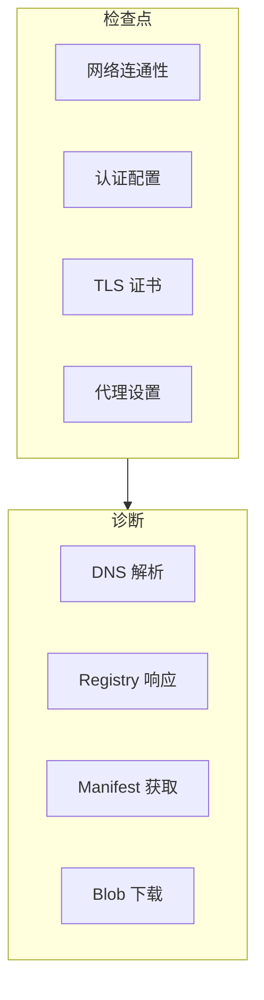
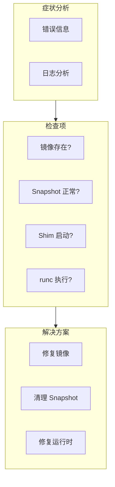

本章介绍 containerd 使用中常见问题的调试方法和技巧。

## 镜像拉取问题

### 问题现象

```bash
# 拉取失败
ctr images pull docker.io/library/nginx:latest
# Error: failed to resolve reference...
```

### 调试步骤



### 调试命令

```bash
# 1. 检查网络
ping registry-1.docker.io
curl -v https://registry-1.docker.io/v2/

# 2. 检查 DNS
nslookup registry-1.docker.io
dig registry-1.docker.io

# 3. 检查认证
cat ~/.docker/config.json

# 4. 详细日志
ctr --debug images pull docker.io/library/nginx:latest 2>&1

# 5. 手动获取 manifest
curl -H "Accept: application/vnd.docker.distribution.manifest.v2+json" \
     https://registry-1.docker.io/v2/library/nginx/manifests/latest

# 6. 检查代理
echo $HTTP_PROXY $HTTPS_PROXY $NO_PROXY
```

### 认证配置

```toml
# /etc/containerd/config.toml
[plugins."io.containerd.grpc.v1.cri".registry]
  [plugins."io.containerd.grpc.v1.cri".registry.mirrors]
    [plugins."io.containerd.grpc.v1.cri".registry.mirrors."docker.io"]
      endpoint = ["https://registry-1.docker.io"]

  [plugins."io.containerd.grpc.v1.cri".registry.configs]
    [plugins."io.containerd.grpc.v1.cri".registry.configs."registry.example.com".auth]
      username = "user"
      password = "pass"

    [plugins."io.containerd.grpc.v1.cri".registry.configs."registry.example.com".tls]
      insecure_skip_verify = true
```

## 容器创建失败

### 问题现象

```bash
# 创建失败
ctr run docker.io/library/alpine:latest test
# Error: failed to create shim task...
```

### 调试流程



### 调试命令

```bash
# 1. 检查镜像
ctr images ls | grep alpine
ctr images check docker.io/library/alpine:latest

# 2. 检查 Snapshot
ctr snapshots ls
ctr snapshots info <snapshot_key>

# 3. 检查 Shim 进程
ps aux | grep containerd-shim

# 4. 查看详细日志
journalctl -u containerd -n 100 --no-pager

# 5. 手动创建测试
ctr containers create docker.io/library/alpine:latest test
ctr tasks start --log-uri binary://... test
```

### 常见原因

```bash
# 原因 1: Snapshot 损坏
ctr snapshots rm <snapshot_key>
ctr images unpack docker.io/library/alpine:latest

# 原因 2: runc 版本不兼容
runc --version
# 检查是否需要更新

# 原因 3: cgroup 问题
cat /proc/cgroups
# 确认 cgroup 控制器可用

# 原因 4: 资源不足
df -h /var/lib/containerd
free -m
```

## Shim 启动问题

### 问题现象

```
Error: failed to start shim: ... connection refused
Error: shim exited unexpectedly
```

### 调试步骤

```bash
# 1. 检查 Shim 二进制
ls -la /usr/local/bin/containerd-shim-runc-v2
file /usr/local/bin/containerd-shim-runc-v2

# 2. 手动运行 Shim
containerd-shim-runc-v2 --help

# 3. 检查 Shim 日志
# Shim 日志通常在容器的 bundle 目录
cat /run/containerd/io.containerd.runtime.v2.task/default/<container_id>/log.json

# 4. strace 跟踪
strace -f containerd-shim-runc-v2 ... 2>&1 | head -100

# 5. 检查 TTRPC socket
ls -la /run/containerd/s/
```

### Shim 配置

```toml
# /etc/containerd/config.toml
[plugins."io.containerd.grpc.v1.cri".containerd.runtimes.runc]
  runtime_type = "io.containerd.runc.v2"

  [plugins."io.containerd.grpc.v1.cri".containerd.runtimes.runc.options]
    BinaryName = "/usr/local/bin/runc"  # 明确指定 runc 路径
    SystemdCgroup = true
```

## 网络问题

### Pod 网络不通

```bash
# 1. 检查 CNI 配置
ls /etc/cni/net.d/
cat /etc/cni/net.d/10-containerd-net.conflist

# 2. 检查 CNI 插件
ls /opt/cni/bin/
# 确保 bridge, loopback, portmap 等存在

# 3. 检查网络命名空间
ip netns list
ip netns exec <netns> ip addr
ip netns exec <netns> ip route

# 4. 检查 veth pair
ip link show type veth
brctl show cni0

# 5. 检查 iptables
iptables -t nat -L -n -v
iptables -L -n -v
```

### CNI 执行失败

```bash
# 手动执行 CNI
export CNI_PATH=/opt/cni/bin
export CNI_CONTAINERID=test123
export CNI_NETNS=/var/run/netns/test
export CNI_IFNAME=eth0
export CNI_COMMAND=ADD

cat /etc/cni/net.d/10-bridge.conf | \
  CNI_PATH=/opt/cni/bin /opt/cni/bin/bridge

# 清理
export CNI_COMMAND=DEL
# 再次执行
```

## Snapshot 问题

### Snapshot 损坏

```bash
# 检查 Snapshot 状态
ctr snapshots tree

# 查看详细信息
ctr snapshots info <key>

# 检查 Overlay 挂载
mount | grep overlay

# 检查底层目录
ls -la /var/lib/containerd/io.containerd.snapshotter.v1.overlayfs/snapshots/
```

### 修复方法

```bash
# 1. 删除问题 Snapshot
ctr snapshots rm <key>

# 2. 重新解压镜像
ctr images unpack docker.io/library/alpine:latest

# 3. 检查磁盘空间
df -h /var/lib/containerd

# 4. 检查文件系统
# 注意：需要停止 containerd
umount /var/lib/containerd/...
fsck /dev/sda1
```

## 元数据问题

### BoltDB 损坏

```bash
# 症状
# containerd 启动失败，报告 "database is not valid"

# 备份数据库
cp /var/lib/containerd/io.containerd.metadata.v1.bolt/meta.db meta.db.bak

# 尝试修复
# 使用 bbolt 工具
go install go.etcd.io/bbolt/cmd/bbolt@latest

bbolt check /var/lib/containerd/io.containerd.metadata.v1.bolt/meta.db

# 如果无法修复，可能需要删除并重新拉取镜像
mv /var/lib/containerd/io.containerd.metadata.v1.bolt /tmp/
systemctl restart containerd
# 重新拉取镜像
```

### Lease 泄漏

```bash
# 检查 Lease
ctr leases ls

# 删除过期 Lease
ctr leases rm <lease_id>

# 触发 GC
ctr content gc
ctr snapshots gc
```

## CRI 问题

### crictl 连接失败

```bash
# 检查 socket
ls -la /run/containerd/containerd.sock

# 检查 containerd 状态
systemctl status containerd

# 测试连接
crictl info

# 检查配置
cat /etc/crictl.yaml
```

### Pod 状态异常

```bash
# 查看 Pod 状态
crictl pods

# 检查 Pod 详情
crictl inspectp <pod_id>

# 查看容器日志
crictl logs <container_id>

# 检查事件
crictl events
```

## 资源问题

### 内存不足

```bash
# 检查内存使用
free -m
cat /proc/meminfo

# 检查 containerd 内存
ps aux | grep containerd
cat /proc/$(pidof containerd)/status | grep -E "VmRSS|VmSize"

# 检查容器内存
for c in $(ctr containers ls -q); do
    echo "$c: $(ctr containers info $c | jq '.Spec.Linux.Resources.Memory.Limit')"
done
```

### 磁盘空间不足

```bash
# 检查磁盘
df -h /var/lib/containerd

# 清理未使用的镜像
ctr images ls -q | while read img; do
    # 检查是否被使用
done

# 清理悬空 Snapshot
ctr snapshots ls | grep -v "Active\|Committed" | awk '{print $1}' | xargs -I {} ctr snapshots rm {}

# 运行 GC
ctr content gc
```

## 调试断点示例

### 容器创建断点

```go
// 断点位置
// internal/cri/server/container/create.go

func (c *criService) CreateContainer(ctx context.Context, r *runtime.CreateContainerRequest) {
    // 断点 1: 入口
    config := r.GetConfig()

    // 断点 2: 获取镜像
    image, err := c.localResolve(ctx, config.GetImage().GetImage())

    // 断点 3: 创建 Snapshot
    snapshotKey := id
    if err := c.createContainerSnapshot(ctx, snapshotKey, image); err != nil {
        // 断点 4: 错误处理
    }

    // 断点 5: 生成 OCI Spec
    spec, err := c.containerSpec(...)

    // 断点 6: 创建容器
    container, err := c.client.NewContainer(ctx, id, opts...)
}
```

### Delve 会话示例

```bash
(dlv) break internal/cri/server/container/create.go:50
(dlv) break internal/cri/server/container/create.go:80
(dlv) break internal/cri/server/container/create.go:120
(dlv) continue

# 触发容器创建
# crictl create <pod_id> container.json sandbox.json

# 到达断点后
(dlv) print config
(dlv) print image
(dlv) print spec
(dlv) next
(dlv) print err
```

## 小结

常见调试场景总结：

| 问题类型 | 主要检查点 | 常用工具 |
|----------|-----------|----------|
| 镜像拉取 | 网络、认证、TLS | curl, ctr --debug |
| 容器创建 | 镜像、Snapshot、Shim | ctr, journalctl |
| 网络问题 | CNI、Namespace、iptables | ip, iptables, nsenter |
| Snapshot | 磁盘空间、挂载 | ctr snapshots, mount |
| 元数据 | BoltDB、Lease | bbolt, ctr leases |
| CRI | Socket、配置 | crictl |

调试技巧：
1. 先查日志，了解错误上下文
2. 使用 `--debug` 获取详细输出
3. 逐步缩小问题范围
4. 必要时使用 Delve 断点调试

下一节我们将学习 [问题排查指南](./03-troubleshooting.md)。

## 参考资料

- [containerd Debugging](https://github.com/containerd/containerd/blob/main/docs/debugging.md)
- [CNI Troubleshooting](https://github.com/containernetworking/cni/blob/main/SPEC.md)
- [Kubernetes Debugging](https://kubernetes.io/docs/tasks/debug/)
