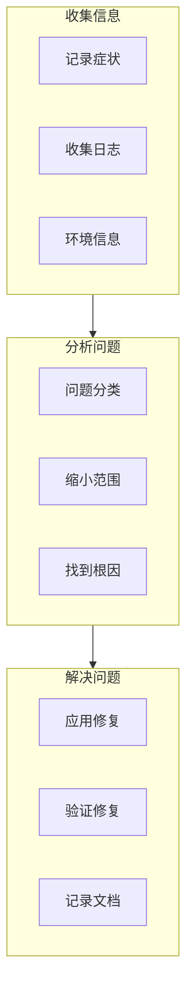
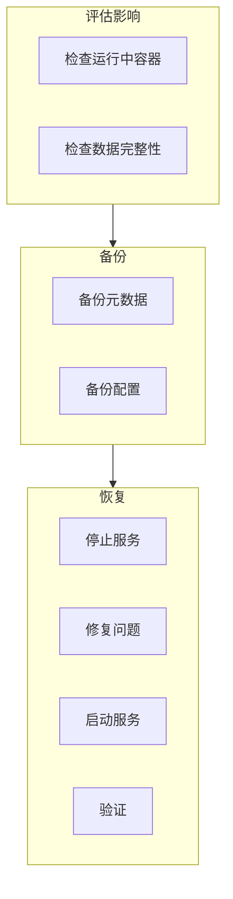

本章提供 containerd 常见问题的排查流程和解决方案。

## 问题排查流程

### 标准排查流程



### 信息收集清单

```bash
#!/bin/bash
# troubleshoot.sh - 问题信息收集脚本

echo "=== System Info ==="
uname -a
cat /etc/os-release

echo "=== containerd Version ==="
containerd --version
runc --version

echo "=== containerd Status ==="
systemctl status containerd

echo "=== containerd Config ==="
containerd config dump

echo "=== Recent Logs ==="
journalctl -u containerd -n 200 --no-pager

echo "=== Images ==="
ctr images ls

echo "=== Containers ==="
ctr containers ls

echo "=== Tasks ==="
ctr tasks ls

echo "=== Snapshots ==="
ctr snapshots ls

echo "=== Disk Usage ==="
df -h /var/lib/containerd

echo "=== Memory Usage ==="
free -m

echo "=== Process Info ==="
ps aux | grep -E "containerd|shim"
```

## 常见错误及解决方案

### "failed to create shim task"

**症状**：
```
Error: failed to create shim task: OCI runtime create failed: unable to start container process: error during container init: ...
```

**排查步骤**：
```bash
# 1. 检查 runc
runc --version
which runc

# 2. 检查 OCI spec
cat /run/containerd/io.containerd.runtime.v2.task/default/<container_id>/config.json | jq .

# 3. 手动运行 runc 测试
cd /run/containerd/io.containerd.runtime.v2.task/default/<container_id>
runc create --bundle . test

# 4. 检查 rootfs
ls -la rootfs/

# 5. 检查挂载
mount | grep overlay
```

**常见原因和解决**：
```bash
# 原因 1: runc 版本不兼容
# 解决: 更新 runc
wget https://github.com/opencontainers/runc/releases/download/v1.1.12/runc.amd64
install -m 755 runc.amd64 /usr/local/bin/runc

# 原因 2: seccomp 问题
# 解决: 禁用 seccomp 测试
# 在 config.toml 中添加
[plugins."io.containerd.grpc.v1.cri".containerd.runtimes.runc.options]
  SystemdCgroup = true

# 原因 3: cgroup 问题
# 检查 cgroup 版本
cat /proc/filesystems | grep cgroup
stat -fc %T /sys/fs/cgroup/
```

### "snapshot not found"

**症状**：
```
Error: snapshot "xxx" does not exist: not found
```

**排查步骤**：
```bash
# 1. 列出所有 Snapshot
ctr snapshots ls

# 2. 检查 Snapshot 目录
ls -la /var/lib/containerd/io.containerd.snapshotter.v1.overlayfs/snapshots/

# 3. 检查元数据
# 需要使用 bbolt 工具查看 BoltDB
bbolt get /var/lib/containerd/io.containerd.metadata.v1.bolt/meta.db v1/default/snapshots/overlayfs/<key>
```

**解决方案**：
```bash
# 方案 1: 重新解压镜像
ctr images unpack docker.io/library/nginx:latest

# 方案 2: 删除并重新创建容器
ctr containers rm <container_id>
ctr run docker.io/library/nginx:latest <new_container>

# 方案 3: 清理并重建
ctr snapshots rm <snapshot_key>
ctr images unpack <image>
```

### "connection refused" / "dial unix: connect: no such file or directory"

**症状**：
```
Error: failed to connect: dial unix /run/containerd/containerd.sock: connect: connection refused
```

**排查步骤**：
```bash
# 1. 检查 containerd 是否运行
systemctl status containerd
ps aux | grep containerd

# 2. 检查 socket 文件
ls -la /run/containerd/containerd.sock

# 3. 检查日志
journalctl -u containerd -n 50

# 4. 检查配置
containerd config dump | grep -E "address|socket"
```

**解决方案**：
```bash
# 方案 1: 重启 containerd
systemctl restart containerd

# 方案 2: 检查配置文件语法
containerd config validate /etc/containerd/config.toml

# 方案 3: 使用默认配置
containerd config default > /etc/containerd/config.toml
systemctl restart containerd
```

### "failed to reserve sandbox name"

**症状**：
```
Error: failed to reserve sandbox name "xxx": name is reserved for "yyy"
```

**排查步骤**：
```bash
# 1. 列出现有 Sandbox
crictl pods

# 2. 检查 Sandbox 状态
crictl inspectp <pod_id>
```

**解决方案**：
```bash
# 方案 1: 清理旧 Sandbox
crictl stopp <pod_id>
crictl rmp <pod_id>

# 方案 2: 强制删除
crictl rmp -f <pod_id>

# 方案 3: 使用不同的名称
```

### "network not ready"

**症状**：
```
Error: network is not ready: runtime network not ready: NetworkReady=false
```

**排查步骤**：
```bash
# 1. 检查 CNI 配置
ls /etc/cni/net.d/
cat /etc/cni/net.d/*.conf

# 2. 检查 CNI 插件
ls /opt/cni/bin/

# 3. 检查 containerd 网络状态
crictl info | jq '.status.conditions'
```

**解决方案**：
```bash
# 方案 1: 安装 CNI 插件
mkdir -p /opt/cni/bin
wget https://github.com/containernetworking/plugins/releases/download/v1.4.0/cni-plugins-linux-amd64-v1.4.0.tgz
tar -xzf cni-plugins-linux-amd64-v1.4.0.tgz -C /opt/cni/bin

# 方案 2: 创建 CNI 配置
mkdir -p /etc/cni/net.d
cat > /etc/cni/net.d/10-containerd-net.conflist << EOF
{
  "cniVersion": "1.0.0",
  "name": "containerd-net",
  "plugins": [
    {
      "type": "bridge",
      "bridge": "cni0",
      "isGateway": true,
      "ipMasq": true,
      "promiscMode": true,
      "ipam": {
        "type": "host-local",
        "ranges": [[{"subnet": "10.88.0.0/16"}]],
        "routes": [{"dst": "0.0.0.0/0"}]
      }
    },
    {
      "type": "portmap",
      "capabilities": {"portMappings": true}
    }
  ]
}
EOF

systemctl restart containerd
```

### "failed to get container OOM status"

**症状**：
```
Error: failed to get container OOM status: cgroup path is invalid
```

**排查步骤**：
```bash
# 1. 检查 cgroup 版本
cat /proc/filesystems | grep cgroup
stat -fc %T /sys/fs/cgroup/

# 2. 检查 cgroup 配置
cat /etc/containerd/config.toml | grep -i cgroup

# 3. 检查容器的 cgroup 路径
cat /run/containerd/io.containerd.runtime.v2.task/default/<container_id>/config.json | jq '.linux.cgroupsPath'
```

**解决方案**：
```toml
# /etc/containerd/config.toml
# 对于 cgroup v2
[plugins."io.containerd.grpc.v1.cri".containerd.runtimes.runc.options]
  SystemdCgroup = true

# 对于 cgroup v1
[plugins."io.containerd.grpc.v1.cri".containerd.runtimes.runc.options]
  SystemdCgroup = false
```

## 日志分析技巧

### 关键日志模式

```bash
# 错误日志
journalctl -u containerd | grep -E "error|Error|ERROR|failed|Failed"

# 启动问题
journalctl -u containerd | grep -E "starting|started|init"

# Shim 问题
journalctl -u containerd | grep -E "shim|Shim"

# 网络问题
journalctl -u containerd | grep -E "cni|CNI|network"

# 镜像问题
journalctl -u containerd | grep -E "pull|Push|image|registry"
```

### 时间线分析

```bash
# 获取特定时间的日志
journalctl -u containerd --since "2024-01-15 10:00:00" --until "2024-01-15 10:10:00"

# 带微秒时间戳
journalctl -u containerd -o short-precise

# 实时跟踪
journalctl -u containerd -f
```

## 恢复操作

### 紧急恢复流程



### 恢复步骤

```bash
# 1. 备份当前状态
cp -r /var/lib/containerd /var/lib/containerd.bak
cp /etc/containerd/config.toml /etc/containerd/config.toml.bak

# 2. 停止 containerd
systemctl stop containerd

# 3. 根据问题类型执行修复
# 见下方具体场景

# 4. 启动 containerd
systemctl start containerd

# 5. 验证
ctr version
ctr plugins ls
```

### 元数据损坏恢复

```bash
# 如果 BoltDB 损坏
# 1. 移走损坏的数据库
mv /var/lib/containerd/io.containerd.metadata.v1.bolt /tmp/

# 2. 重启 containerd (会创建新数据库)
systemctl restart containerd

# 3. 重新拉取需要的镜像
ctr images pull docker.io/library/nginx:latest

# 4. 重建容器
```

### Content Store 恢复

```bash
# 如果内容损坏
# 1. 检查损坏的内容
ctr content ls
ctr content check

# 2. 删除损坏的内容
ctr content rm <digest>

# 3. 重新拉取镜像
ctr images pull <image>
```

## 获取帮助

### 提交 Issue 前的检查

```markdown
### 问题描述
简要描述遇到的问题

### 环境信息
- OS: Ubuntu 22.04
- containerd version: 1.7.0
- runc version: 1.1.12
- kernel version: 5.15.0

### 复现步骤
1.
2.
3.

### 期望行为


### 实际行为


### 日志
\`\`\`
# journalctl -u containerd -n 100
...
\`\`\`

### 配置文件
\`\`\`toml
# /etc/containerd/config.toml
...
\`\`\`
```

### 社区资源

- GitHub Issues: https://github.com/containerd/containerd/issues
- Slack: #containerd on CNCF Slack
- 邮件列表: containerd-dev@googlegroups.com

## 预防措施

### 监控告警

```yaml
# Prometheus 告警规则
groups:
- name: containerd-alerts
  rules:
  - alert: ContainerdDown
    expr: up{job="containerd"} == 0
    for: 1m
    labels:
      severity: critical
    annotations:
      summary: "containerd is down"

  - alert: ContainerdHighErrorRate
    expr: rate(grpc_server_handled_total{grpc_code!="OK",job="containerd"}[5m]) > 0.1
    for: 5m
    labels:
      severity: warning
```

### 定期维护

```bash
# 定期运行的维护脚本
#!/bin/bash

# 清理未使用的镜像
ctr images prune

# 运行 GC
ctr content gc

# 检查磁盘空间
df -h /var/lib/containerd
if [ $(df /var/lib/containerd | tail -1 | awk '{print $5}' | tr -d '%') -gt 80 ]; then
    echo "Warning: Disk usage is over 80%"
fi

# 检查 containerd 健康
ctr version > /dev/null 2>&1 || echo "Warning: containerd may not be healthy"
```

## 小结

问题排查的关键原则：

1. **系统性收集信息**：版本、日志、配置
2. **逐步缩小范围**：从症状到根因
3. **备份后再操作**：避免二次损坏
4. **验证修复效果**：确保问题解决
5. **记录文档**：为将来参考

常用排查命令汇总：
- `journalctl -u containerd` - 查看日志
- `ctr --debug` - 详细输出
- `crictl info` - CRI 状态
- `containerd config dump` - 配置检查

## 参考资料

- [containerd Troubleshooting](https://github.com/containerd/containerd/blob/main/docs/debugging.md)
- [Kubernetes Troubleshooting](https://kubernetes.io/docs/tasks/debug/)
- [runc Troubleshooting](https://github.com/opencontainers/runc/blob/main/docs/debugging.md)
