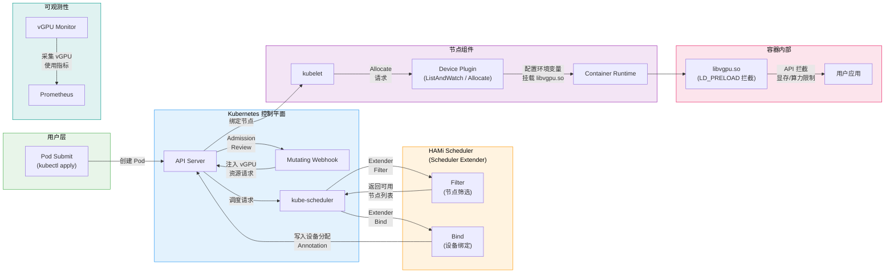
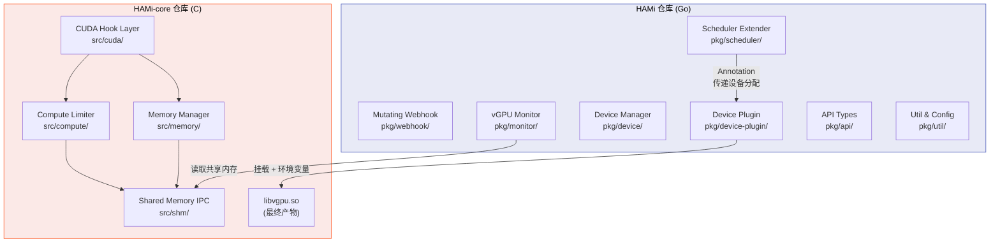

<p align="center">
  
  
  
  
</p>

---

## 项目简介

**HAMi（Heterogeneous AI Computing Virtualization Middleware）** 是 CNCF Sandbox 级别的开源项目，旨在为 Kubernetes 集群提供异构加速设备（GPU、NPU、MLU、DCU 等）的虚拟化与共享调度能力。HAMi 通过 Scheduler Extender、Mutating Webhook、Device Plugin 以及用户态拦截库（libvgpu.so）四大核心组件，实现了对 NVIDIA GPU 等硬件设备的细粒度显存与算力隔离，使多个容器能安全地共享同一块物理设备，从而大幅提升集群 GPU 利用率并降低基础设施成本。

---

## 整体架构

下图展示了一个 Pod 从提交到最终在容器内使用 vGPU 的完整数据流：



### 关键路径说明

| 阶段 | 组件 | 核心职责 |
|------|------|----------|
| 准入 | Mutating Webhook | 将用户声明的 `hami.io/vgpu` 等资源转换为 Device Plugin 可识别的扩展资源 |
| 调度 | Scheduler Extender (Filter) | 基于节点真实设备用量，筛选满足 vGPU 请求的节点 |
| 绑定 | Scheduler Extender (Bind) | 选定设备，将分配结果写入 Pod Annotation |
| 分配 | Device Plugin (Allocate) | 读取 Annotation，配置环境变量和挂载卷，注入 libvgpu.so |
| 拦截 | libvgpu.so | 在用户态通过 LD_PRELOAD 拦截 CUDA API，实施显存与算力配额 |
| 监控 | vGPU Monitor | 周期性采集容器 vGPU 使用量，暴露 Prometheus 指标 |

---

## 仓库组件结构

HAMi 项目由两个核心仓库组成：Go 语言实现的控制平面组件和 C 语言实现的设备拦截层。



---

## 核心数据类型

以下类图展示了 HAMi 中关键的数据结构及其关联关系：

```mermaid
classDiagram
    class Devices {
        <<interface>>
        +CommonWord() string
        +MutateAdmission(ctr *v1.Container, pod *v1.Pod) bool
        +CheckHealth(devType string, n *v1.Node) (bool, bool)
        +NodeCleanUp(nn string) error
        +GetNodeDevices(n v1.Node) ([]*api.DeviceInfo, error)
        +CheckType(annos map[string]string, d util.DeviceUsage, n util.ContainerDeviceRequest) (bool, bool, bool)
        +CheckUUID(annos map[string]string, d util.DeviceUsage) bool
        +LockNode(n *v1.Node, pod *v1.Pod) error
        +ReleaseNodeLock(n *v1.Node, pod *v1.Pod) error
        +Allocate(devs []*api.DeviceInfo, reqs util.ContainerDeviceRequest) ([]*api.DeviceInfo, error)
        +GenerateResourceRequests(ctr *v1.Container) util.ContainerDeviceRequest
    end

    class DeviceUsage {
        +ID string
        +Index uint
        +Used int32
        +Count int32
        +Usedmem int32
        +Totalmem int32
        +Totalcore int32
        +Usedcores int32
        +Numa int
        +Type string
        +Health bool
    }

    class DeviceInfo {
        +ID string
        +Index uint
        +Count int32
        +Devmem int32
        +Devcore int32
        +Type string
        +Numa int
        +Health bool
    }

    class ContainerDeviceRequest {
        +Nums int32
        +Type string
        +Memreq int32
        +MemPercentagereq int32
        +Coresreq int32
    }

    class ContainerDevice {
        +Idx int
        +UUID string
        +Type string
        +Usedmem int32
        +Usedcores int32
    }

    class PodDevices {
        +Name string
        +UID string
        +Devices map~string~ContainerDevice[][]
    }

    class NodeInfo {
        +ID string
        +Node *v1.Node
        +Devices DeviceUsageList
        +Score float32
    }

    class NodeScore {
        +NodeID string
        +Devices DeviceUsageList
        +Score float32
    }

    Devices ..> DeviceInfo : "返回设备信息"
    Devices ..> ContainerDeviceRequest : "生成资源请求"
    NodeInfo --> DeviceUsage : "包含多个设备"
    NodeScore --> DeviceUsage : "评分关联设备"
    PodDevices --> ContainerDevice : "容器设备映射"
    ContainerDeviceRequest ..> DeviceUsage : "匹配检查"
```

### 数据类型说明

| 类型 | 说明 |
|------|------|
| `Devices` | 设备插件接口，所有硬件类型（NVIDIA、Cambricon、Hygon 等）必须实现此接口 |
| `DeviceUsage` | 表示节点上单个设备的当前使用状态（已用/总量的显存和算力） |
| `DeviceInfo` | 设备的静态元信息（ID、类型、总显存、总算力、NUMA 节点） |
| `ContainerDeviceRequest` | 单个容器对设备的资源需求（数量、显存、算力比例） |
| `ContainerDevice` | 分配给容器的具体设备实例（UUID、已分配显存和算力） |
| `PodDevices` | Pod 级别的设备分配汇总，映射容器名到其设备列表 |
| `NodeInfo` | 调度器视角下的节点信息，包含所有设备使用状态和评分 |
| `NodeScore` | Filter 和 Score 阶段产出的节点评分结果 |

---

## 模块目录

本技术文档按以下模块组织，涵盖从入门到深入的完整知识体系：

| 编号 | 模块 | 内容概述 |
|:----:|------|----------|
| 01 | [项目总览](../01-overview/) | HAMi 项目背景、设计目标、整体架构与核心概念 |
| 02 | [入门教程](../02-tutorials/) | 面向初学者的安装部署、快速上手与代码调试指南 |
| 03 | [调度器深度解析](../03-scheduler/) | Scheduler Extender 的 Filter / Score / Bind 链路，Binpack 与 Spread 策略，拓扑感知调度 |
| 04 | [Webhook 准入控制](../04-webhook/) | Mutating Webhook 的资源注入逻辑、Pod 标注转换与默认值填充 |
| 05 | [Device Plugin 机制](../05-device-plugin/) | Kubernetes Device Plugin 接口实现、ListAndWatch 注册流程与 Allocate 分配链路 |
| 06 | [HAMi-core 拦截层](../06-hami-core/) | libvgpu.so 的 CUDA API Hook、显存管理、算力限制与共享内存通信 |
| 07 | [多设备支持](../07-multi-device/) | NVIDIA GPU、Cambricon MLU、Hygon DCU、Iluvatar GPU 等设备的适配实现 |
| 08 | [监控与可观测性](../08-monitoring/) | vGPU Monitor 指标采集、Prometheus 集成与 Grafana 面板配置 |
| 09 | [调试与排障](../09-debugging/) | 常见问题排查、日志分析、调度链路 Debug 与性能诊断 |
| 10 | [运维与生产实践](../10-operations/) | 高可用部署、升级策略、容量规划与最佳实践 |
| 11 | [开发者贡献指南](../11-contributing/) | 代码规范、开发环境搭建、测试框架与 PR 流程 |

---

## 术语表

| 术语 | 全称 / 英文 | 说明 |
|------|-------------|------|
| **vGPU** | Virtual GPU | HAMi 定义的虚拟 GPU 抽象。通过软件方式将一块物理 GPU 切分为多个逻辑设备，每个 vGPU 拥有独立的显存配额和算力上限，供不同容器隔离使用。 |
| **Scheduler Extender** | Kubernetes Scheduler Extender | Kubernetes 调度器扩展点。HAMi 通过实现 Filter 和 Bind 扩展，在原生调度流程中注入设备感知的节点筛选与设备绑定逻辑，确保 Pod 被调度到拥有足够可用 vGPU 资源的节点。 |
| **Device Plugin** | Kubernetes Device Plugin | Kubernetes 设备插件框架（kubelet gRPC 接口）。HAMi Device Plugin 负责向 kubelet 注册 vGPU 扩展资源，并在 Allocate 阶段读取调度器写入的 Annotation，配置容器环境变量和挂载 libvgpu.so。 |
| **LD_PRELOAD** | LD_PRELOAD Environment Variable | Linux 动态链接器的环境变量，指定在加载其他共享库之前优先加载的库。HAMi-core 利用 LD_PRELOAD 将 libvgpu.so 注入容器进程，拦截 CUDA API 调用以实施显存和算力限制。 |
| **Shared Memory Region** | POSIX Shared Memory (shm) | HAMi-core 使用的进程间通信机制。libvgpu.so 与 vGPU Monitor 通过共享内存区域交换设备使用量数据，Monitor 据此采集指标并检测是否超配。 |
| **NUMA** | Non-Uniform Memory Access | 非统一内存访问架构。在多路服务器中，GPU 通常连接到特定 NUMA 节点。HAMi 调度器支持 NUMA 感知，尽量将 Pod 调度到 GPU 与 CPU 处于同一 NUMA 域的节点，以减少跨域内存访问延迟。 |
| **MIG** | Multi-Instance GPU | NVIDIA Ampere 及更新架构支持的硬件级 GPU 分区技术。MIG 将一块物理 GPU 划分为多个独立的 GPU 实例，每个实例拥有独立的显存、缓存和计算单元。HAMi 可与 MIG 协同工作，在 MIG 实例上进一步进行软件级 vGPU 切分。 |
| **Topology-Aware Scheduling** | 拓扑感知调度 | 考虑 GPU 间互联拓扑（NVLink、PCIe Switch）的调度策略。当 Pod 请求多块 GPU 时，HAMi 调度器优先选择互联带宽最高的 GPU 组合，以优化多卡训练的通信性能。 |
| **Binpack** | Bin Packing Strategy | 装箱调度策略。优先将 Pod 调度到已有较多设备被使用的节点上，使设备尽量集中使用，以减少资源碎片化并为大规模任务预留完整节点。 |
| **Spread** | Spread Strategy | 分散调度策略。将 Pod 均匀分散到不同节点上，避免单节点过载，提高集群整体的容错能力和资源利用率均衡性。 |

---

## 推荐阅读顺序

对于不同角色的读者，建议按以下顺序阅读：

**集群管理员 / SRE**
> [01 项目总览](../01-overview/) → [02 入门教程](../02-tutorials/) → [08 监控与可观测性](../08-monitoring/) → [10 运维与生产实践](../10-operations/) → [09 调试与排障](../09-debugging/)

**平台开发者**
> [01 项目总览](../01-overview/) → [03 调度器深度解析](../03-scheduler/) → [04 Webhook 准入控制](../04-webhook/) → [05 Device Plugin 机制](../05-device-plugin/) → [06 HAMi-core 拦截层](../06-hami-core/)

**AI 应用开发者**
> [01 项目总览](../01-overview/) → [02 入门教程](../02-tutorials/) → [07 多设备支持](../07-multi-device/) → [09 调试与排障](../09-debugging/)

**开源贡献者**
> [01 项目总览](../01-overview/) → [11 开发者贡献指南](../11-contributing/) → 感兴趣的具体模块文档

---

<p align="center">
  <sub>HAMi Technical Documentation &mdash; CNCF Sandbox Project</sub>
</p>
