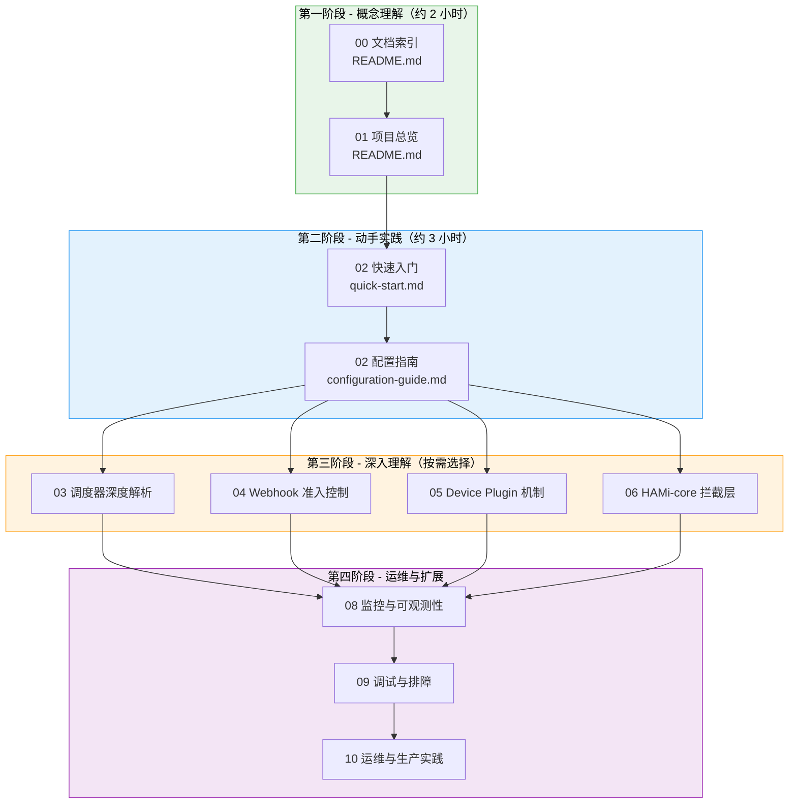
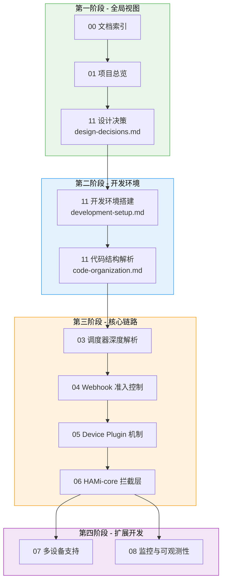

<p align="center">
  
  
  
</p>

> 本指南帮助不同技术背景和目标的读者，找到最适合自己的文档阅读路径。无论您是初次接触 HAMi 的新手，还是希望深入源码的贡献者，都能在这里找到系统的学习路线。

---

## 1. 初学者阅读路径

### 1.1 前置知识要求

在开始阅读 HAMi 技术文档之前，建议具备以下基础知识：

| 知识领域 | 最低要求 | 推荐程度 | 补充学习资源 |
|---------|---------|:--------:|-------------|
| Kubernetes 基础 | 理解 Pod、Deployment、DaemonSet、Service 等核心概念 | 必须 | [Kubernetes 官方教程](https://kubernetes.io/docs/tutorials/) |
| Helm 基础 | 能使用 `helm install`、`helm upgrade` 管理应用 | 必须 | [Helm 快速入门](https://helm.sh/docs/intro/quickstart/) |
| GPU 基础概念 | 了解 GPU 显存、算力、CUDA 编程模型的基本概念 | 推荐 | [NVIDIA CUDA 编程指南](https://docs.nvidia.com/cuda/cuda-c-programming-guide/) |
| Linux 基础 | 理解 Linux 进程、共享库、环境变量 | 推荐 | - |
| Go 语言基础 | 能阅读 Go 代码（仅贡献者需要） | 可选 | [Go 官方教程](https://go.dev/tour/) |
| C 语言基础 | 能阅读 C 代码（仅 HAMi-core 贡献者需要） | 可选 | - |

### 1.2 推荐阅读路线



| 阶段 | 目标 | 预计时间 | 阅读内容 |
|:----:|------|:--------:|---------|
| 第一阶段 | 理解 HAMi 的定位、架构和核心概念 | 约 2 小时 | [文档索引](./01-documentation-index/)、[项目总览](../01-overview/) |
| 第二阶段 | 完成安装部署，运行第一个 vGPU 工作负载 | 约 3 小时 | [快速入门](../02-tutorials/01-quick-start/)、[配置指南](../02-tutorials/02-configuration-guide/) |
| 第三阶段 | 深入理解某个具体模块的工作原理 | 每模块约 2-4 小时 | 03-06 模块文档（按兴趣选择） |
| 第四阶段 | 掌握生产环境运维和排障能力 | 每模块约 1-2 小时 | 08-10 模块文档 |

---

## 2. 进阶/贡献者阅读路径

### 2.1 前置知识要求

贡献者除了需要具备初学者的所有前置知识外，还需要额外的技术储备：

| 知识领域 | 要求程度 | 说明 |
|---------|:--------:|------|
| Go 语言 | 必须 | HAMi 控制平面代码使用 Go 编写 |
| Kubernetes API 编程 | 必须 | 理解 client-go、informer、controller 模式 |
| gRPC | 推荐 | Device Plugin 使用 gRPC 与 kubelet 通信 |
| C 语言 | 按需 | 仅 HAMi-core 拦截层需要 |
| CUDA 编程 | 按需 | 仅 HAMi-core 拦截层需要 |
| Linux 系统编程 | 按需 | 共享内存、信号量、动态链接（HAMi-core） |

### 2.2 推荐阅读路线



| 阶段 | 目标 | 预计时间 | 关键阅读 |
|:----:|------|:--------:|---------|
| 第一阶段 | 理解整体架构和设计哲学 | 约 3 小时 | 索引 + 总览 + 设计决策 |
| 第二阶段 | 搭建开发环境，熟悉代码结构 | 约 4 小时 | 开发环境 + 代码组织 |
| 第三阶段 | 深入理解完整的调度-分配-拦截链路 | 约 8-12 小时 | 03 到 06 四个核心模块 |
| 第四阶段 | 掌握扩展开发能力 | 按需 | 多设备支持 + 监控 |

---

## 3. 模块前置知识矩阵

以下矩阵展示了每个文档模块所需的前置知识，帮助您评估阅读某个模块前需要补充哪些知识：

| 模块 | K8s 基础 | Helm | Go 语言 | C 语言 | CUDA | Linux 系统编程 | gRPC | Prometheus |
|------|:--------:|:----:|:-------:|:------:|:----:|:-------------:|:----:|:----------:|
| 01 项目总览 | 需要 | - | - | - | - | - | - | - |
| 02 入门教程 | 需要 | 需要 | - | - | - | - | - | - |
| 03 调度器深度解析 | 需要 | - | 需要 | - | - | - | - | - |
| 04 Webhook 准入控制 | 需要 | - | 需要 | - | - | - | - | - |
| 05 Device Plugin | 需要 | - | 需要 | - | - | - | 需要 | - |
| 06 HAMi-core 拦截层 | - | - | - | 需要 | 需要 | 需要 | - | - |
| 07 多设备支持 | 需要 | 需要 | 推荐 | - | - | - | - | - |
| 08 监控与可观测性 | 需要 | - | - | - | - | - | - | 需要 |
| 09 调试与排障 | 需要 | - | 推荐 | 推荐 | - | 推荐 | - | - |
| 10 运维与生产实践 | 需要 | 需要 | - | - | - | - | - | 推荐 |
| 11 开发者贡献指南 | 需要 | - | 需要 | 推荐 | - | 推荐 | - | - |

**图例说明**:
- **需要**: 阅读该模块时必须具备的知识
- **推荐**: 有此知识可以更好地理解内容，但不具备也可以跟随文档学习
- **-**: 不需要

---

## 4. 按角色推荐阅读

### 4.1 集群管理员 / SRE

关注点：部署安装、配置调优、监控告警、故障排查

```
01 项目总览 → 02 入门教程 → 02 配置指南 → 08 监控与可观测性 → 10 运维与生产实践 → 09 调试与排障
```

### 4.2 平台开发者

关注点：调度机制、Device Plugin 协议、Webhook 逻辑、源码架构

```
01 项目总览 → 11 设计决策 → 11 代码结构 → 03 调度器 → 04 Webhook → 05 Device Plugin → 06 HAMi-core
```

### 4.3 AI 应用开发者

关注点：GPU 资源申请、多设备使用、性能调优

```
01 项目总览 → 02 快速入门 → 02 配置指南 → 07 多设备支持 → 09 调试与排障
```

### 4.4 开源贡献者

关注点：代码组织、开发环境、设计决策、测试框架

```
01 项目总览 → 11 设计决策 → 11 开发环境 → 11 代码结构 → [感兴趣的模块]
```

---

## 5. 文档模块速查

| 编号 | 模块名称 | 一句话概述 | 适合谁 |
|:----:|---------|-----------|--------|
| 00 | [文档索引](./01-documentation-index/) | 项目全貌与文档地图 | 所有读者 |
| 01 | [项目总览](../01-overview/) | HAMi 的"是什么"和"为什么" | 所有读者 |
| 02 | [入门教程](../02-tutorials/01-quick-start/) | 从零安装到运行第一个 vGPU 负载 | 初学者、管理员 |
| 03 | [调度器深度解析](../03-scheduler/) | Filter / Score / Bind 调度链路的源码级解读 | 平台开发者 |
| 04 | [Webhook 准入控制](../04-webhook/) | Mutating Webhook 资源注入的完整流程 | 平台开发者 |
| 05 | [Device Plugin 机制](../05-device-plugin/) | kubelet gRPC 接口实现与设备注册分配 | 平台开发者 |
| 06 | [HAMi-core 拦截层](../06-hami-core/) | C 语言 CUDA Hook、显存管理与算力限制 | 系统开发者 |
| 07 | [多设备支持](../07-multi-device/) | NVIDIA、MLU、DCU、NPU 等多硬件适配 | 应用开发者、管理员 |
| 08 | [监控与可观测性](../08-monitoring/) | Prometheus 指标、Grafana 面板配置 | SRE、管理员 |
| 09 | [调试与排障](../09-debugging/) | 日志分析、链路追踪与常见问题速查 | 所有读者 |
| 10 | [运维与生产实践](../10-operations/) | HA 部署、升级策略与容量规划 | SRE、管理员 |
| 11 | [开发者贡献指南](../11-contributing/01-development-setup/) | 开发环境、代码结构与设计决策 | 贡献者 |

---

## 6. 学习建议

1. **循序渐进**: 不要跳过基础模块直接阅读高级内容。每个模块都建立在前序模块的知识之上
2. **动手实践**: 阅读教程文档时，建议准备一个测试集群同步操作。实践远比纯阅读效果更好
3. **关注 Mermaid 图**: 文档中的架构图和流程图浓缩了大量信息，建议仔细研读每张图中的数据流和组件关系
4. **源码对照**: 阅读原理文档时，建议同时打开对应的源码文件进行对照，加深理解
5. **参与社区**: 遇到文档未覆盖的问题，欢迎在 [GitHub Issues](https://github.com/Project-HAMi/HAMi/issues) 中提问或贡献文档改进

---

<p align="center">
  <sub>HAMi Technical Documentation - Reading Guide</sub>
</p>
