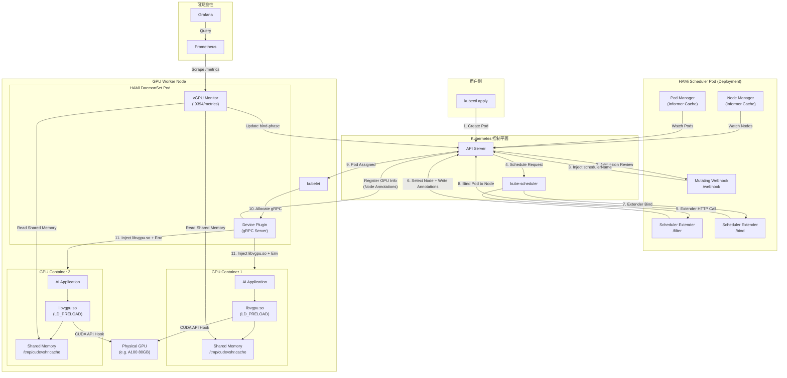
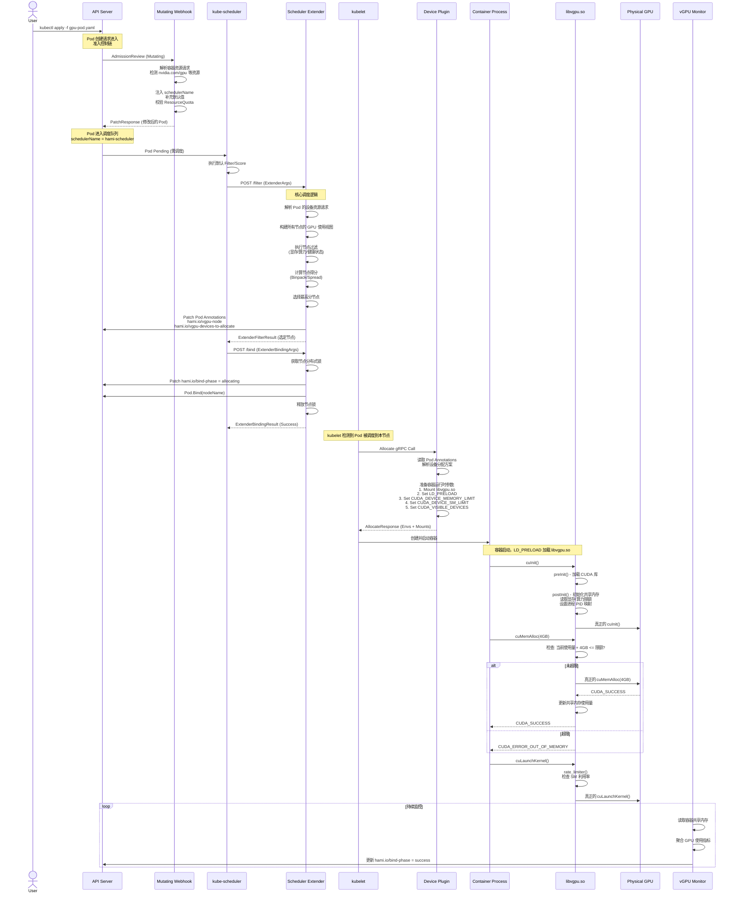
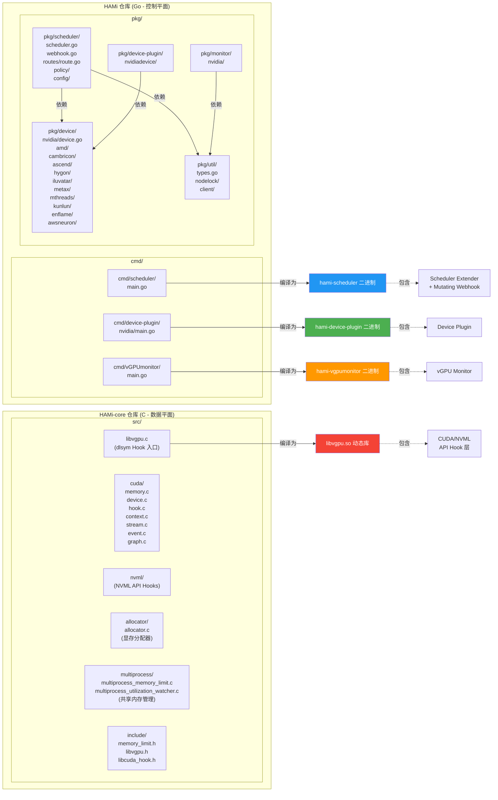

> HAMi (Heterogeneous AI Computing Virtualization Middleware) 是 CNCF Sandbox 项目，为 Kubernetes 集群提供异构 AI 计算设备的虚拟化与共享能力。本文档从架构视角全面解析 HAMi 的设计哲学、核心组件、交互流程与资源模型。

---

## 目录

- [1. 问题陈述 - 为什么需要 HAMi](#1-问题陈述---为什么需要-hami)
- [2. 业界方案对比](#2-业界方案对比)
- [3. 双仓库架构哲学](#3-双仓库架构哲学)
- [4. 五大核心组件](#4-五大核心组件)
  - [4.1 Scheduler Extender - 调度扩展器](#41-scheduler-extender---调度扩展器)
  - [4.2 Mutating Webhook - 准入变更钩子](#42-mutating-webhook---准入变更钩子)
  - [4.3 Device Plugin - 设备插件](#43-device-plugin---设备插件)
  - [4.4 vGPU Monitor - 监控采集器](#44-vgpu-monitor---监控采集器)
  - [4.5 libvgpu.so - CUDA/NVML 拦截库](#45-libvgpuso---cudanvml-拦截库)
- [5. 支持的加速器矩阵](#5-支持的加速器矩阵)
- [6. 资源模型与注解协议](#6-资源模型与注解协议)
  - [6.1 扩展资源定义](#61-扩展资源定义)
  - [6.2 注解协议](#62-注解协议)
  - [6.3 调度策略](#63-调度策略)
- [7. 架构图解](#7-架构图解)
  - [7.1 组件交互全景图](#71-组件交互全景图)
  - [7.2 Pod 完整生命周期时序图](#72-pod-完整生命周期时序图)
  - [7.3 仓库目录与组件映射图](#73-仓库目录与组件映射图)

---

## 1. 问题陈述 - 为什么需要 HAMi

在 Kubernetes 原生资源模型中，GPU 被视为**整数型扩展资源** (Extended Resource)。这意味着一块 GPU 只能以 `0` 或 `1` 的粒度分配给 Pod ------ 要么完全不分配，要么将整块 GPU 独占分配给一个容器。这一设计带来了以下严峻问题：

### 1.1 GPU 利用率低下

根据多项行业调研数据，企业级 Kubernetes 集群中 GPU 的平均利用率通常不足 30%。大量推理任务、开发调试、小模型训练等工作负载仅需少量 GPU 显存和算力，却不得不独占整块 GPU。一块价值数万美元的 A100 80GB GPU，可能仅被一个需要 2GB 显存的推理服务独占。

### 1.2 资源碎片化

当集群中的 GPU 被逐一独占分配后，剩余 GPU 数量可能无法满足新任务的最低需求，而已分配的 GPU 却大量闲置。这种资源碎片化问题在多租户场景下尤为严重。

### 1.3 缺乏隔离机制

即便通过非标准手段让多个容器共享同一 GPU（如手动设置 `CUDA_VISIBLE_DEVICES`），Kubernetes 原生也不提供以下隔离能力：

| 隔离维度 | 原生 K8s 能力 | 实际需求 |
|:---------|:-------------|:---------|
| 显存隔离 | 无 | 限制每个容器可使用的最大显存 |
| 算力隔离 | 无 | 限制每个容器可使用的 SM 核心百分比 |
| 故障隔离 | 无 | 一个容器 OOM 不影响共享同一 GPU 的其他容器 |
| 调度感知 | 无 | 调度器需感知 GPU 的细粒度分配状态 |

**HAMi 正是为解决上述问题而生** ------ 它在不修改 Kubernetes 核心代码、不依赖特殊硬件的前提下，通过软件定义的方式实现 GPU 及其他异构加速器的细粒度虚拟化与共享。

---

## 2. 业界方案对比

下表从多个维度对比了 HAMi 与业界主流 GPU 共享/虚拟化方案：

| 对比维度 | NVIDIA GPU Operator | NVIDIA vGPU (GRID) | NVIDIA MPS | NVIDIA MIG | HAMi |
|:---------|:-------------------|:-------------------|:-----------|:-----------|:-----|
| **核心功能** | 驱动管理、设备插件部署 | 硬件级 GPU 虚拟化 | 多进程时间片共享 | 硬件级 GPU 分区 | 软件定义 GPU 虚拟化 |
| **GPU 共享** | 不支持 | 支持 | 支持 | 支持 | 支持 |
| **显存隔离** | 无 | 硬件隔离 | 无隔离 | 硬件隔离 | 软件隔离 (API Hook) |
| **算力隔离** | 无 | 硬件隔离 | 有限 (时间片) | 硬件隔离 | 软件隔离 (SM 限制) |
| **硬件要求** | 无特殊要求 | SR-IOV 支持 | CUDA Compute 3.5+ | Ampere/Hopper (A100/H100) | 任意 NVIDIA GPU |
| **商业授权** | 开源免费 | 付费许可证 | 免费 | 免费 (硬件限制) | 开源免费 (Apache 2.0) |
| **分区灵活性** | N/A | 预定义 Profile | 动态 | 固定分区，重配需重启 | 动态，任意比例 |
| **多厂商支持** | 仅 NVIDIA | 仅 NVIDIA | 仅 NVIDIA | 仅 NVIDIA | NVIDIA/AMD/华为/寒武纪等 11+ |
| **K8s 原生集成** | 是 (Operator) | 需额外组件 | 需手动配置 | Device Plugin | Scheduler Extender + Webhook |
| **故障影响范围** | N/A | VM 级隔离 | 一个进程崩溃可能影响全部 | 硬件隔离 | 容器级隔离 |

**HAMi 的核心优势总结：**

1. **零硬件门槛** ------ 无需 SR-IOV、无需 A100/H100，任意型号 NVIDIA GPU 均可使用
2. **双维度隔离** ------ 同时提供显存隔离和算力 (SM Core) 隔离
3. **完全动态** ------ 无需预定义 Profile，无需重启，任意比例分配
4. **多厂商统一管理** ------ 通过统一的 `Devices` 接口抽象，一套系统管理 11 种以上异构加速器
5. **开源免费** ------ Apache 2.0 协议，CNCF Sandbox 项目

---

## 3. 双仓库架构哲学

HAMi 采用**控制平面/数据平面分离**的双仓库架构设计，这一设计决策源于对性能、安全性和可维护性的深思熟虑。

```
HAMi-project/
  ├── HAMi/          # 控制平面 (Control Plane) - Go 语言
  └── HAMi-core/     # 数据平面 (Data Plane)   - C 语言
```

### 3.1 控制平面 - HAMi (Go)

**职责边界：** 在 Kubernetes 集群层面完成设备的发现、注册、调度决策和监控。

| 特性 | 说明 |
|:-----|:-----|
| 语言选择 | Go ------ Kubernetes 生态原生语言，丰富的 client-go/informer 库支持 |
| 运行位置 | 集群级组件（Deployment）+ 节点级组件（DaemonSet） |
| 核心关注 | 全局视图 ------ 哪些节点有哪些 GPU、每块 GPU 分配了多少资源、应该把新 Pod 调度到哪里 |
| 通信方式 | K8s API Server (Informer/Watch)、HTTP (Scheduler Extender)、gRPC (Device Plugin) |

### 3.2 数据平面 - HAMi-core (C)

**职责边界：** 在容器内部拦截 CUDA/NVML API 调用，强制执行控制平面下发的资源限额。

| 特性 | 说明 |
|:-----|:-----|
| 语言选择 | C ------ 直接操作 CUDA Driver API，无 GC 延迟，极低性能开销 |
| 运行位置 | 以 `LD_PRELOAD` 方式注入到每个 GPU 容器的进程空间 |
| 核心关注 | 进程视图 ------ 当前进程已分配多少显存、是否超过限额、SM 利用率是否需要限流 |
| 通信方式 | 共享内存 (`/tmp/cudevshr.cache`)、环境变量 (`CUDA_DEVICE_MEMORY_LIMIT`、`CUDA_DEVICE_SM_LIMIT`) |

### 3.3 为什么要分离

```
控制平面与数据平面分离的核心收益：

1. 性能零损耗：C 语言编写的 Hook 库运行在 CUDA 调用的热路径上，
   任何额外开销都会被放大千万倍。Go 的 GC STW 和 CGO 开销在此不可接受。

2. 安全边界清晰：libvgpu.so 运行在容器进程空间内（用户态），
   即使被恶意篡改也无法突破容器边界。控制平面运行在宿主机命名空间，
   拥有 K8s API 权限但不直接接触用户进程。

3. 独立演进：CUDA API 版本频繁更新（CUDA 11.x → 12.x → 12.8+），
   HAMi-core 需要快速适配新 API。控制平面的 K8s 集成逻辑相对稳定。
   两者独立版本化、独立发布。

4. 故障隔离：libvgpu.so 崩溃只影响单个容器进程，
   不会导致 Scheduler Extender 或 Device Plugin 故障。
```

---

## 4. 五大核心组件

### 4.1 Scheduler Extender - 调度扩展器

**部署方式：** Deployment（集群级，通常 1 副本，支持 Leader Election 高可用）

**代码入口：** `HAMi/cmd/scheduler/main.go`

**核心逻辑：** `HAMi/pkg/scheduler/scheduler.go`、`HAMi/pkg/scheduler/routes/route.go`

Scheduler Extender 是 HAMi 的调度决策大脑。它作为 Kubernetes 默认调度器 (kube-scheduler) 的**扩展点** (Extender)，通过 HTTP 协议接收调度请求，基于 GPU 细粒度资源信息做出调度决策。

#### HTTP API 端点

| 端点 | 方法 | 协议 | 功能描述 |
|:-----|:-----|:-----|:---------|
| `/filter` | POST | `extenderv1.ExtenderArgs` / `ExtenderFilterResult` | 过滤不满足 GPU 资源请求的节点，选出最优节点 |
| `/bind` | POST | `extenderv1.ExtenderBindingArgs` / `ExtenderBindingResult` | 执行绑定操作，锁定节点 GPU 资源并绑定 Pod |
| `/webhook` | POST | Admission Review | Mutating Webhook 入口 |
| `/healthz` | GET | - | 健康检查 |
| `/readyz` | GET | - | 就绪检查 (含 Leader 状态) |

#### Filter 核心流程

`Filter` 方法是调度决策的核心，其逻辑链如下：

1. **解析资源请求** ------ 调用 `device.Resourcereqs(pod)` 遍历所有注册的设备类型，提取每个容器对各类设备的请求（数量、显存、算力百分比）
2. **构建节点使用视图** ------ `getNodesUsage()` 聚合所有已分配 Pod 的设备使用信息，构建每个节点上每块 GPU 的已用显存、已用算力、已分配任务数等完整视图
3. **计算节点得分** ------ `calcScore()` 基于配置的调度策略（Binpack/Spread/Topology-aware）为每个候选节点打分
4. **选择最优节点** ------ 按得分排序，选择得分最高的节点
5. **写入调度结果** ------ 将设备分配方案通过 Annotation 写入 Pod 元数据

#### Bind 核心流程

`Bind` 方法在 Filter 选定节点后执行实际绑定：

1. **获取节点锁** ------ 通过 `LockNode()` 对目标节点加分布式锁，防止并发调度冲突
2. **写入分配阶段** ------ 设置 `hami.io/bind-phase: allocating` 注解
3. **执行 K8s 绑定** ------ 调用 `pods.Bind()` API 将 Pod 绑定到目标节点
4. **释放或回滚** ------ 绑定成功则释放锁；失败则回滚所有状态并释放节点锁

#### 数据同步机制

Scheduler Extender 通过 Kubernetes Informer 机制持续同步集群状态：

- **Pod Informer** ------ 跟踪所有 Pod 的创建/更新/删除，维护设备分配缓存 (`PodManager`)
- **Node Informer** ------ 监听节点变化，触发设备注册更新
- **ResourceQuota Informer** ------ 跟踪命名空间配额变化 (`QuotaManager`)
- **Lease Informer** ------ Leader Election 相关（高可用模式下）

### 4.2 Mutating Webhook - 准入变更钩子

**部署方式：** 与 Scheduler Extender 同进程（共享 HTTP 路由 `/webhook`）

**核心逻辑：** `HAMi/pkg/scheduler/webhook.go`

Mutating Webhook 作为 Kubernetes 准入控制器 (Admission Controller) 的一部分，在 Pod 创建时拦截请求并进行变更 (Mutate)。

#### 核心功能

1. **注入调度器名称** ------ 当 Pod 请求了 HAMi 管理的设备资源时，将 `pod.spec.schedulerName` 设置为 HAMi Scheduler 的名称，确保 Pod 进入 HAMi 的调度流程

2. **设备请求验证与变更** ------ 遍历 Pod 中每个容器的资源请求，调用各设备类型的 `MutateAdmission()` 方法：
   - 验证资源请求的合法性（如显存值不能为负）
   - 补充默认值（如未指定 GPU 数量时填入默认值 `defaultGPUNum`）
   - 注入环境变量（如 `CUDA_DEVICE_MEMORY_LIMIT`、`CUDA_DEVICE_SM_LIMIT`）

3. **安全拦截** ------ 拒绝特权容器 (Privileged Container) 的 GPU 资源请求，防止容器绕过 HAMi 的资源隔离

4. **配额校验** ------ 通过 `fitResourceQuota()` 检查 Pod 的资源请求是否超过命名空间级别的 ResourceQuota 限制

#### 准入逻辑流

```
Pod 创建请求
  │
  ├─ 解码 Pod 对象
  │
  ├─ 检查是否已指定其他调度器 ──── 是 ──→ 放行 (Allowed)
  │
  ├─ 遍历容器：
  │   ├─ 跳过特权容器
  │   └─ 对每个设备类型调用 MutateAdmission()
  │       ├─ 检查资源请求
  │       ├─ 补充默认值
  │       └─ 注入环境变量
  │
  ├─ 如果发现设备请求，注入 schedulerName
  │
  ├─ 检查 ResourceQuota ──── 超限 ──→ 拒绝 (Denied)
  │
  └─ 返回 Patch 响应 (PatchResponseFromRaw)
```

### 4.3 Device Plugin - 设备插件

**部署方式：** DaemonSet（每个 GPU 节点一个 Pod）

**代码入口：** `HAMi/cmd/device-plugin/nvidia/main.go`

**核心逻辑：** `HAMi/pkg/device-plugin/nvidiadevice/`

Device Plugin 实现了 Kubernetes [Device Plugin Framework](https://kubernetes.io/docs/concepts/extend-kubernetes/compute-storage-net/device-plugins/) 定义的 gRPC 接口，负责在节点级别发现、注册和管理 GPU 设备。

#### 核心职责

| 职责 | 实现方式 |
|:-----|:---------|
| GPU 发现 | 调用 NVML 库枚举本节点所有 GPU 设备，获取 UUID、显存、型号等信息 |
| 资源注册 | 通过 kubelet gRPC 接口注册 `nvidia.com/gpu` 等扩展资源 |
| 设备分配 | 实现 `Allocate()` gRPC 方法，在容器启动前注入 GPU 设备文件和环境变量 |
| 健康检查 | 持续监控 GPU 健康状态，通过 `ListAndWatch()` 向 kubelet 报告 |
| 节点注解 | 将 GPU 详细信息（UUID、显存、型号、NUMA 拓扑等）写入 Node Annotations |

#### 虚拟化资源注册

HAMi Device Plugin 的关键创新在于**虚拟化资源数量**。例如，一块 A100 80GB GPU 被 `deviceSplitCount` 参数分割为 N 个虚拟 GPU 实例。kubelet 看到的是 N 个 `nvidia.com/gpu` 资源，而非原始的 1 个。这使得 Kubernetes 原生调度器能够感知到 GPU 可以被多个 Pod 共享。

```
物理 GPU: 1x A100 80GB
  │
  │ deviceSplitCount = 10
  │ deviceMemoryScaling = 1.0
  ▼
虚拟资源: 10x nvidia.com/gpu (每个代表 8GB 显存 + 10% 算力)
```

#### Allocate 流程

当 kubelet 调用 `Allocate()` 分配虚拟 GPU 时，Device Plugin 执行以下关键操作：

1. 挂载 `libvgpu.so` 到容器 (`/usr/local/vgpu/libvgpu.so`)
2. 设置 `LD_PRELOAD` 环境变量，使容器内所有进程加载 HAMi-core 拦截库
3. 设置 `CUDA_DEVICE_MEMORY_LIMIT` 环境变量（如 `8192m`），指定显存限额
4. 设置 `CUDA_DEVICE_SM_LIMIT` 环境变量（如 `30`），指定 SM 核心使用百分比
5. 设置 `CUDA_VISIBLE_DEVICES`，限制容器可见的 GPU 设备
6. 挂载共享内存文件 (`/tmp/cudevshr.cache`)，用于 vGPU Monitor 采集容器内 GPU 使用数据

### 4.4 vGPU Monitor - 监控采集器

**部署方式：** DaemonSet（与 Device Plugin 同 Pod 或独立 DaemonSet）

**代码入口：** `HAMi/cmd/vGPUmonitor/main.go`

**核心逻辑：** `HAMi/pkg/monitor/nvidia/`

vGPU Monitor 是 HAMi 的可观测性组件，负责采集每个容器的实际 GPU 资源使用数据，并以 Prometheus 指标格式暴露。

#### 监控数据采集机制

vGPU Monitor 的数据源是 HAMi-core（libvgpu.so）写入的**共享内存区域** (`shared_region_t`)。每个 GPU 容器内的 libvgpu.so 实例会将以下信息实时写入共享内存：

```c
typedef struct {
    int32_t pid;                                    // 容器内进程 PID
    int32_t hostpid;                                // 宿主机进程 PID
    device_memory_t used[CUDA_DEVICE_MAX_COUNT];    // 每个设备的显存使用详情
    uint64_t monitorused[CUDA_DEVICE_MAX_COUNT];    // 监控用显存统计
    device_util_t device_util[CUDA_DEVICE_MAX_COUNT]; // 设备利用率
    int32_t status;                                 // 进程状态
} shrreg_proc_slot_t;
```

vGPU Monitor 读取这些共享内存区域，将数据聚合后通过 Prometheus HTTP 端点 (`:9394/metrics`) 暴露。

#### 暴露的关键指标

| 指标名称 | 类型 | 说明 |
|:---------|:-----|:-----|
| `hami_vgpu_memory_used_bytes` | Gauge | 容器实际使用的 GPU 显存 (字节) |
| `hami_vgpu_memory_limit_bytes` | Gauge | 容器被分配的 GPU 显存限额 (字节) |
| `hami_vgpu_core_used_percent` | Gauge | 容器实际使用的 SM 核心百分比 |
| `hami_vgpu_core_limit_percent` | Gauge | 容器被分配的 SM 核心限额百分比 |

#### Feedback 机制

除了被动采集指标，vGPU Monitor 还实现了主动 **Feedback 机制**：

- 监测容器的 GPU 使用状态是否正常
- 当 Device Plugin 分配完成后，更新 Pod 的 `hami.io/bind-phase` 注解为 `success` 或 `failed`
- 检测进程异常退出并清理共享内存中的过期条目

### 4.5 libvgpu.so - CUDA/NVML 拦截库

**仓库：** HAMi-core

**核心代码：** `HAMi-core/src/libvgpu.c`、`HAMi-core/src/cuda/`、`HAMi-core/src/nvml/`

**产出物：** `libvgpu.so` 动态链接库

libvgpu.so 是 HAMi 数据平面的核心，它通过 Linux 的 `LD_PRELOAD` 机制注入到容器进程空间，在不修改任何应用代码的前提下拦截所有 CUDA Driver API 和 NVML API 调用。

#### 拦截原理

```
应用程序调用 cuMemAlloc()
        │
        ▼
LD_PRELOAD 机制重定向到 libvgpu.so
        │
        ▼
libvgpu.so 的 Hook 函数：
  1. 检查当前显存使用量 + 请求量 是否超过限额
  2. 如果超限 → 返回 CUDA_ERROR_OUT_OF_MEMORY
  3. 如果未超限 → 调用真正的 cuMemAlloc()
  4. 更新共享内存中的使用量记录
        │
        ▼
真正的 CUDA Driver (libcuda.so)
        │
        ▼
GPU 硬件
```

#### 技术实现细节

**1. dlsym Hook 链**

libvgpu.so 的第一层拦截发生在 `dlsym()` 函数本身。通过重写 `dlsym()`，当应用程序或 CUDA Runtime 尝试动态查找 CUDA 函数符号时，libvgpu.so 可以返回自己的 Hook 函数替代原始实现：

```c
// 来源: HAMi-core/src/libvgpu.c
FUNC_ATTR_VISIBLE void* dlsym(void* handle, const char* symbol) {
    // 所有以 "cu" 开头的符号 → CUDA API Hook
    if (symbol[0] == 'c' && symbol[1] == 'u') {
        void *f = real_dlsym(vgpulib, symbol);
        if (f != NULL) return f;
    }
    // 所有以 "nvml" 开头的符号 → NVML API Hook
    if (symbol[0] == 'n' && symbol[1] == 'v' && ...) {
        void* f = __dlsym_hook_section_nvml(handle, symbol);
        if (f != NULL) return f;
    }
    return real_dlsym(handle, symbol);
}
```

**2. 显存管控**

显存管控通过宏 `INC_MEMORY_OR_RETURN_ERROR` 和 `DECL_MEMORY_ON_SUCCESS` 实现，包裹在每个显存分配/释放的 Hook 函数中：

```c
// 分配前检查
#define INC_MEMORY_OR_RETURN_ERROR(bytes) {
    CUdevice dev;
    CHECK_DRV_API(cuCtxGetDevice(&dev));
    if (inc_current_device_memory_usage(dev, bytes) !=
        CUDA_DEVICE_MEMORY_UPDATE_SUCCESS) {
        return CUDA_ERROR_OUT_OF_MEMORY;  // 拒绝分配
    }
}
```

显存限额从环境变量 `CUDA_DEVICE_MEMORY_LIMIT` 读取（由 Device Plugin 在容器启动时设置）。

**3. 算力管控**

SM 核心利用率限制通过 `rate_limiter()` 函数实现。在每次 Kernel Launch 前，libvgpu.so 检查当前 SM 利用率是否超过 `CUDA_DEVICE_SM_LIMIT` 指定的百分比。如果超限，则通过短暂睡眠来降低 Kernel 发射频率，从而间接控制 SM 利用率。

**4. 共享内存通信**

libvgpu.so 维护一块共享内存区域 (`shared_region_t`)，用于：

- 多进程间的显存使用量聚合（一个容器内可能有多个进程使用 GPU）
- 向宿主机的 vGPU Monitor 暴露使用数据
- 跨进程的 GPU 设备信息同步（UUID 映射等）

共享内存结构体定义如下：

```c
typedef struct {
    int32_t initialized_flag;
    sem_t sem;                                       // 进程间同步信号量
    uint64_t device_num;                             // GPU 设备数
    uuid uuids[CUDA_DEVICE_MAX_COUNT];               // GPU UUID 列表
    uint64_t limit[CUDA_DEVICE_MAX_COUNT];           // 每个设备的显存限额
    uint64_t sm_limit[CUDA_DEVICE_MAX_COUNT];        // 每个设备的 SM 限额
    shrreg_proc_slot_t procs[MAX_PROCESS_NUM];       // 进程使用信息槽位
    int proc_num;                                    // 当前活跃进程数
    int utilization_switch;                          // 算力限制开关
    int priority;                                    // 任务优先级
} shared_region_t;
```

**5. 被 Hook 的 API 覆盖范围**

libvgpu.so 拦截了超过 300 个 CUDA Driver API 和 NVML API 函数，覆盖以下类别：

| API 类别 | 示例函数 | Hook 目的 |
|:---------|:---------|:---------|
| 显存分配 | `cuMemAlloc`, `cuMemAllocManaged`, `cuArrayCreate` | 显存使用量计量与限制 |
| 显存释放 | `cuMemFree`, `cuArrayDestroy`, `cuMipmappedArrayDestroy` | 显存使用量回退 |
| 设备查询 | `cuDeviceGetCount`, `cuDeviceTotalMem`, `cuMemGetInfo` | 返回虚拟化后的设备信息 |
| Kernel 执行 | `cuLaunchKernel`, `cuLaunchCooperativeKernel` | 算力限制 (rate_limiter) |
| 上下文管理 | `cuCtxCreate`, `cuCtxDestroy`, `cuDevicePrimaryCtxRetain` | 上下文显存计量 |
| Stream/Event | `cuStreamCreate`, `cuEventCreate` | 资源跟踪 |
| NVML 查询 | `nvmlDeviceGetMemoryInfo`, `nvmlDeviceGetCount` | 返回虚拟化后的显存/设备信息 |
| CUDA Graph | `cuGraphCreate`, `cuGraphLaunch` | 资源跟踪与限制 |

---

## 5. 支持的加速器矩阵

HAMi 通过统一的 `Devices` 接口抽象，支持以下异构加速器的虚拟化管理：

| 加速器厂商 | 设备类型 | HAMi 设备标识 | 显存隔离 | 算力隔离 | 代码目录 |
|:-----------|:---------|:-------------|:---------|:---------|:---------|
| NVIDIA | GPU (Tesla/GeForce/Quadro) | `NVIDIA` | 支持 | 支持 | `pkg/device/nvidia/` |
| AMD | GPU (Instinct/Radeon) | `AMD` | 支持 | 开发中 | `pkg/device/amd/` |
| 寒武纪 (Cambricon) | MLU (思元系列) | `Cambricon` | 支持 | 支持 | `pkg/device/cambricon/` |
| 华为 (Huawei) | Ascend NPU (昇腾) | `Ascend` | 支持 | 开发中 | `pkg/device/ascend/` |
| 海光 (HYGON) | DCU (深算系列) | `HYGON` | 支持 | 开发中 | `pkg/device/hygon/` |
| 天数智芯 (Iluvatar) | CoreX GPU (智铠系列) | `Iluvatar` | 支持 | 支持 | `pkg/device/iluvatar/` |
| 沐曦 (MetaX) | GPU (曦云系列) | `MetaX` | 支持 | 开发中 | `pkg/device/metax/` |
| 摩尔线程 (Moore Threads) | MUSA GPU (MTT 系列) | `MooreThreads` | 支持 | 开发中 | `pkg/device/mthreads/` |
| 昆仑芯 (Kunlun) | XPU (昆仑芯片) | `Kunlun` | 支持 | 开发中 | `pkg/device/kunlun/` |
| 燧原 (Enflame) | GCU (云燧系列) | `Enflame` | 支持 | 开发中 | `pkg/device/enflame/` |
| AWS | Neuron (Inferentia/Trainium) | `AWSNeuron` | 支持 | N/A | `pkg/device/awsneuron/` |

每个加速器的适配代码均实现了统一的 `Devices` 接口：

```go
type Devices interface {
    CommonWord() string
    MutateAdmission(ctr *corev1.Container, pod *corev1.Pod) (bool, error)
    CheckHealth(devType string, n *corev1.Node) (bool, bool)
    GetNodeDevices(n corev1.Node) ([]*DeviceInfo, error)
    LockNode(n *corev1.Node, p *corev1.Pod) error
    ReleaseNodeLock(n *corev1.Node, p *corev1.Pod) error
    GenerateResourceRequests(ctr *corev1.Container) ContainerDeviceRequest
    PatchAnnotations(...) map[string]string
    ScoreNode(...) float32
    Fit(...) (bool, map[string]ContainerDevices, string)
    // ...
}
```

---

## 6. 资源模型与注解协议

### 6.1 扩展资源定义

HAMi 以 NVIDIA GPU 为例，定义了以下三维资源模型（其他加速器类似）：

| 资源名称 | 单位 | 含义 | 示例值 |
|:---------|:-----|:-----|:-------|
| `nvidia.com/gpu` | 个 (整数) | 请求的虚拟 GPU 数量 | `1` |
| `nvidia.com/gpumem` | MB (整数) | 请求的 GPU 显存大小 | `4096` (即 4GB) |
| `nvidia.com/gpumem-percentage` | % (整数 0-100) | 请求的 GPU 显存百分比（与 gpumem 二选一） | `50` (即占物理显存的 50%) |
| `nvidia.com/gpucores` | % (整数 0-100) | 请求的 SM 核心百分比 | `30` (即使用 30% 的 SM 核心) |
| `nvidia.com/priority` | 整数 | 任务优先级 (越高越优先) | `1` |

#### 资源请求示例

```yaml
apiVersion: v1
kind: Pod
metadata:
  name: gpu-inference
spec:
  containers:
  - name: inference
    image: my-inference:latest
    resources:
      limits:
        nvidia.com/gpu: 1          # 请求 1 个虚拟 GPU
        nvidia.com/gpumem: 4096    # 限制 4GB 显存
        nvidia.com/gpucores: 30    # 限制 30% SM 算力
```

#### 资源名可配置性

以上资源名称均可通过 HAMi 配置自定义：

```yaml
# 默认配置
resourceCountName: "nvidia.com/gpu"
resourceMemoryName: "nvidia.com/gpumem"
resourceCoreName: "nvidia.com/gpucores"
resourceMemoryPercentageName: "nvidia.com/gpumem-percentage"
```

### 6.2 注解协议

HAMi 使用 Pod 和 Node 的 Annotations 作为组件间的通信协议。以下是核心注解定义：

#### Pod 注解

| 注解 Key | 写入方 | 读取方 | 值说明 |
|:---------|:-------|:-------|:-------|
| `hami.io/vgpu-node` | Scheduler Extender | Device Plugin, Monitor | 调度分配的目标节点名 |
| `hami.io/vgpu-time` | Scheduler Extender | Monitor | 调度时间戳 (Unix 时间) |
| `hami.io/bind-time` | Scheduler Extender | Monitor | 绑定时间戳 (Unix 时间) |
| `hami.io/bind-phase` | Scheduler Extender / Monitor | 所有组件 | 绑定阶段：`allocating` / `success` / `failed` |
| `hami.io/vgpu-devices-to-allocate` | Scheduler Extender | Device Plugin | 待分配的设备列表 (编码格式) |
| `hami.io/vgpu-devices-allocated` | Device Plugin | Scheduler Extender, Monitor | 已分配的设备列表 (编码格式) |

#### Node 注解

| 注解 Key | 写入方 | 读取方 | 值说明 |
|:---------|:-------|:-------|:-------|
| `hami.io/node-handshake` | Scheduler Extender / Device Plugin | 双方 | 设备注册握手状态 |
| `hami.io/node-nvidia-register` | Device Plugin | Scheduler Extender | GPU 详细信息 (UUID/显存/型号等编码字符串) |
| `hami.io/node-nvidia-score` | Device Plugin | Scheduler Extender | GPU 拓扑亲和度评分 (JSON) |
| `hami.io/mutex.lock` | Scheduler Extender | Scheduler Extender | 节点级分布式锁 |

#### 设备信息编码格式

Node 注解中的 GPU 信息采用特定编码格式存储，每个设备的信息以逗号分隔字段、冒号分隔设备：

```
GPU-UUID-1,count,memory_mb,cores,type,numa,health,index,mode:GPU-UUID-2,...
```

例如：
```
GPU-abc123,10,81920,100,A100,0,true,0,hami-core:GPU-def456,10,81920,100,A100,1,true,1,hami-core
```

### 6.3 调度策略

HAMi 支持在节点级别和 GPU 级别分别配置调度策略：

| 策略层级 | 策略名称 | 行为描述 | 注解覆盖 Key |
|:---------|:---------|:---------|:-------------|
| 节点级 | `binpack` | 优先将任务集中到已有 GPU 负载的节点 | `hami.io/node-scheduler-policy` |
| 节点级 | `spread` | 优先将任务分散到不同节点 | `hami.io/node-scheduler-policy` |
| GPU 级 | `binpack` | 优先将任务集中到同一块 GPU | `hami.io/gpu-scheduler-policy` |
| GPU 级 | `spread` | 优先将任务分散到不同 GPU | `hami.io/gpu-scheduler-policy` |
| GPU 级 | `topology-aware` | 基于 GPU 拓扑亲和度调度 | `hami.io/gpu-scheduler-policy` |

用户可通过 Pod 注解覆盖全局默认策略：

```yaml
metadata:
  annotations:
    hami.io/node-scheduler-policy: "spread"
    hami.io/gpu-scheduler-policy: "binpack"
```

---

## 7. 架构图解

### 7.1 组件交互全景图



### 7.2 Pod 完整生命周期时序图



### 7.3 仓库目录与组件映射图



---

## 附录 - 关键数据结构速查

### DeviceInfo - 设备信息

```go
// 来源: HAMi/pkg/device/devices.go
type DeviceInfo struct {
    ID           string     // GPU UUID
    Index        uint       // GPU 物理索引
    Count        int32      // 虚拟分片数
    Devmem       int32      // 设备总显存 (MB)
    Devcore      int32      // 设备总算力 (百分比)
    Type         string     // 型号 (如 "A100")
    Numa         int        // NUMA 节点
    Mode         string     // 运行模式 (hami-core/mig/mps)
    Health       bool       // 健康状态
    DeviceVendor string     // 厂商标识
}
```

### DeviceUsage - 设备使用状态

```go
// 来源: HAMi/pkg/device/devices.go
type DeviceUsage struct {
    ID        string    // GPU UUID
    Index     uint      // GPU 物理索引
    Used      int32     // 已分配的虚拟 GPU 数
    Count     int32     // 总虚拟 GPU 数
    Usedmem   int32     // 已分配显存 (MB)
    Totalmem  int32     // 总显存 (MB)
    Usedcores int32     // 已分配算力 (%)
    Totalcore int32     // 总算力 (%)
    Type      string    // 型号
    Health    bool      // 健康状态
    PodInfos  []*PodInfo // 使用此设备的 Pod 列表
}
```

### shared_region_t - 共享内存区域 (HAMi-core)

```c
// 来源: HAMi-core/src/multiprocess/multiprocess_memory_limit.h
typedef struct {
    int32_t initialized_flag;        // 初始化标志
    uint32_t major_version;          // 主版本号
    uint32_t minor_version;          // 次版本号
    sem_t sem;                       // 进程间信号量
    uint64_t device_num;             // GPU 设备数量
    uuid uuids[MAX_DEVICE_COUNT];    // GPU UUID 列表
    uint64_t limit[MAX_DEVICE_COUNT]; // 显存限额 (字节)
    uint64_t sm_limit[MAX_DEVICE_COUNT]; // SM 限额 (百分比)
    shrreg_proc_slot_t procs[MAX_PROCESS_NUM]; // 进程信息槽位
    int proc_num;                    // 活跃进程数
    int utilization_switch;          // 算力限制开关
    int priority;                    // 任务优先级
} shared_region_t;
```

---

> **文档版本：** v1.0
>
> **适用 HAMi 版本：** v2.x
>
> **最后更新：** 2025-05
