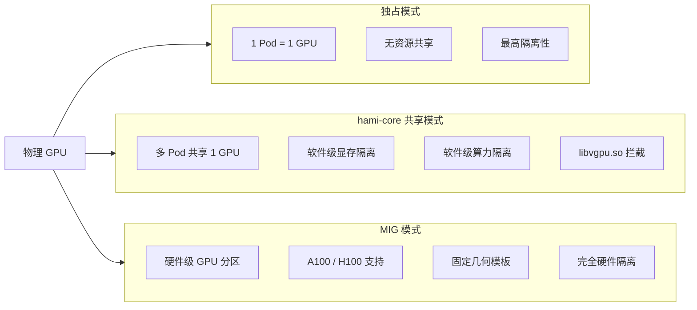
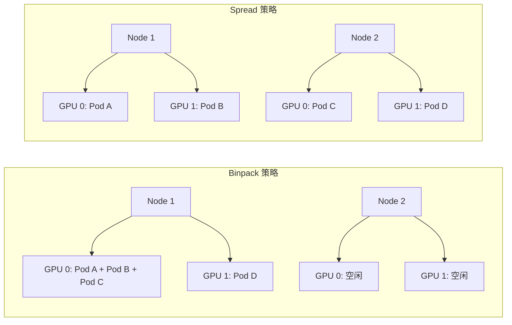
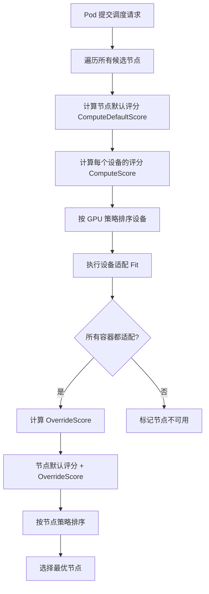

本文档系统介绍 HAMi（Heterogeneous AI Computing Virtualization Middleware）的核心概念与设计原理。理解这些概念是深入学习 HAMi 架构、调度策略、隔离机制的基础。

---

## 目录

- [1. 虚拟 GPU（vGPU）概念](#1-虚拟-gpuvgpu概念)
- [2. GPU 显存隔离](#2-gpu-显存隔离)
- [3. GPU 算力隔离](#3-gpu-算力隔离)
- [4. GPU 共享模式](#4-gpu-共享模式)
- [5. 调度策略](#5-调度策略)
- [6. 评分公式](#6-评分公式)
- [7. 设备模式](#7-设备模式)
- [8. 关键注解（Annotations）](#8-关键注解annotations)

---

## 1. 虚拟 GPU（vGPU）概念

### 1.1 物理 GPU 与虚拟 GPU

在传统的 Kubernetes GPU 调度中，一块物理 GPU 只能被一个 Pod 独占使用。这意味着即使一个任务只需要 2GB 显存和 20% 的算力，也必须独占一整块 GPU（例如 80GB 的 A100），导致资源利用率极低。

HAMi 通过**虚拟 GPU（vGPU）**技术解决了这一问题。它在物理 GPU 之上创建了一层虚拟化抽象，使得一块物理 GPU 可以被多个 Pod 共享，每个 Pod 看到的是一个具有**受限显存**和**受限算力**的"虚拟 GPU 设备"。

### 1.2 HAMi 如何创建虚拟 GPU 切片

HAMi 通过两个维度对物理 GPU 进行切分：

- **显存分区（Memory Partitioning）**：通过 `CUDA_DEVICE_MEMORY_LIMIT` 环境变量设置每个容器可使用的显存上限，`libvgpu.so` 拦截所有 CUDA 内存分配调用，在分配前进行 OOM 检查
- **算力时间片（Compute Time-Slicing）**：通过 `CUDA_DEVICE_SM_LIMIT` 环境变量设置每个容器可使用的 SM（Streaming Multiprocessor）利用率上限，使用令牌桶算法在每次 Kernel 启动前进行速率限制

### 1.3 Pod 视角的虚拟 GPU

从容器内部程序的视角来看，调用 `cuMemGetInfo` 返回的是**虚拟化后的显存总量和空闲量**，而非物理 GPU 的真实值。例如，一块 80GB 的 A100 被分配给某容器 8GB 显存限额时，容器内看到的 `total` 为 8GB，`free` 为 `8GB - 已使用量`。

```
+--------------------------------------------------+
|              物理 GPU（80GB, 100% SM）              |
|                                                    |
|  +------------+  +------------+  +------------+   |
|  | Pod A      |  | Pod B      |  | Pod C      |   |
|  | 8GB, 30%   |  | 16GB, 50%  |  | 4GB, 20%   |   |
|  | vGPU       |  | vGPU       |  | vGPU       |   |
|  +------------+  +------------+  +------------+   |
+--------------------------------------------------+
```

---

## 2. GPU 显存隔离

HAMi-core（`libvgpu.so`）通过对 CUDA Driver API 的拦截实现了软件层面的显存隔离。以下是其工作原理。

### 2.1 显存限额的硬性约束

每个容器的显存限额通过环境变量 `CUDA_DEVICE_MEMORY_LIMIT` 注入。`libvgpu.so` 在初始化时读取该值，并写入共享内存区域（`shared_region_t`）的 `limit` 数组中：

```c
// 源码位置: HAMi-core/src/multiprocess/multiprocess_memory_limit.c
#define CUDA_DEVICE_MEMORY_LIMIT "CUDA_DEVICE_MEMORY_LIMIT"

void do_init_device_memory_limits(uint64_t* arr, int len) {
    size_t fallback_limit = get_limit_from_env(CUDA_DEVICE_MEMORY_LIMIT);
    for (i = 0; i < len; ++i) {
        // 支持 CUDA_DEVICE_MEMORY_LIMIT_0, _1 等按设备索引设置
        size_t cur_limit = get_limit_from_env(env_name);
        arr[i] = (cur_limit > 0) ? cur_limit : fallback_limit;
    }
}
```

该环境变量支持 `G`、`M`、`K` 后缀，例如 `CUDA_DEVICE_MEMORY_LIMIT=8G` 表示限制为 8GB。

### 2.2 CUDA API 拦截机制

`libvgpu.so` 通过 `LD_PRELOAD` 机制注入到容器进程中，拦截关键的 CUDA Driver API 调用：

| 拦截的 API | 作用 |
|---|---|
| `cuMemAlloc_v2` | 分配设备内存前执行 OOM 检查 |
| `cuMemFree_v2` | 释放设备内存并更新使用量记录 |
| `cuMemAllocManaged` | 统一内存分配前执行 OOM 检查 |
| `cuMemAllocPitch_v2` | 带 Pitch 的内存分配前执行 OOM 检查 |
| `cuMemCreate` | 虚拟内存分配前执行 OOM 检查 |
| `cuMemRelease` | 释放虚拟内存句柄并更新记录 |
| `cuMemAllocAsync` | 异步分配前执行 OOM 检查 |
| `cuMemGetInfo_v2` | 返回虚拟化后的显存总量与空闲量 |

### 2.3 共享内存区域追踪

所有同一容器内的进程共享一块 mmap 映射的共享内存区域（`shared_region_t`），用于追踪每个进程的显存使用量：

```c
// 源码位置: HAMi-core/src/multiprocess/multiprocess_memory_limit.h
typedef struct {
    int32_t initialized_flag;
    uint64_t limit[CUDA_DEVICE_MAX_COUNT];     // 每个设备的显存限额
    uint64_t sm_limit[CUDA_DEVICE_MAX_COUNT];  // 每个设备的 SM 利用率限额
    shrreg_proc_slot_t procs[SHARED_REGION_MAX_PROCESS_NUM]; // 进程槽位
    int proc_num;                               // 当前进程数
    int utilization_switch;                     // 算力限制开关
    // ...
} shared_region_t;
```

每个进程槽位（`shrreg_proc_slot_t`）记录了该进程在每个设备上的显存使用详情：

```c
typedef struct {
    uint64_t context_size;  // CUDA Context 占用
    uint64_t module_size;   // CUDA Module 占用
    uint64_t data_size;     // 数据分配占用
    uint64_t total;         // 总占用
} device_memory_t;

typedef struct {
    int32_t pid;
    int32_t hostpid;
    device_memory_t used[CUDA_DEVICE_MAX_COUNT];
    uint64_t monitorused[CUDA_DEVICE_MAX_COUNT];
    device_util_t device_util[CUDA_DEVICE_MAX_COUNT];
} shrreg_proc_slot_t;
```

### 2.4 OOM 检查流程

每次内存分配之前，`libvgpu.so` 都会调用 `oom_check` 函数，检查分配后是否会超出限额：

```
+-------------------+      +------------------+      +----------------+
| cuMemAlloc_v2()   | ---> | oom_check(dev,    | ---> | 当前使用量      |
| 应用申请显存       |      |   bytesize)      |      | + 申请量        |
+-------------------+      +------------------+      | > 限额?        |
                                   |                  +-------+--------+
                                   |                          |
                              +----+----+                +----+----+
                              |  通过    |                |  拒绝    |
                              | 执行分配  |               | 返回 OOM  |
                              +---------+                +---------+
```

### 2.5 cuMemGetInfo 虚拟化

当应用调用 `cuMemGetInfo_v2` 查询显存信息时，`libvgpu.so` 返回的是虚拟化后的数值：

```c
// 源码位置: HAMi-core/src/cuda/memory.c
CUresult cuMemGetInfo_v2(size_t* free, size_t* total) {
    size_t usage = get_current_device_memory_usage(cuda_to_nvml_map(dev));
    size_t limit = get_current_device_memory_limit(cuda_to_nvml_map(dev));
    // 确保 total 不超过物理内存或设定限额
    size_t actual_limit = (limit > *total) ? *total : limit;
    *free = (actual_limit > usage) ? (actual_limit - usage) : 0;
    *total = actual_limit;
}
```

---

## 3. GPU 算力隔离

### 3.1 SM 利用率限制

GPU 的计算资源以 **SM（Streaming Multiprocessor）** 为单位。HAMi-core 通过环境变量 `CUDA_DEVICE_SM_LIMIT` 设置每个容器的 SM 利用率上限（取值 0-100，表示百分比）。例如 `CUDA_DEVICE_SM_LIMIT=30` 表示该容器最多使用 30% 的 GPU 算力。

### 3.2 令牌桶算法

HAMi-core 使用**令牌桶（Token Bucket）**算法实现算力限制。核心逻辑如下：

```c
// 源码位置: HAMi-core/src/multiprocess/multiprocess_utilization_watcher.c
void rate_limiter(int grids, int blocks) {
    long kernel_size = grids;
    // SM 限制为 100% 或 0 时不限制
    if ((get_current_device_sm_limit(0) >= 100) ||
        (get_current_device_sm_limit(0) == 0))
        return;
    // 算力限制开关关闭时不限制
    if (get_utilization_switch() == 0)
        return;
    do {
        before_cuda_cores = g_cur_cuda_cores;
        if (before_cuda_cores < 0) {
            nanosleep(&g_cycle, NULL);  // 令牌不足，等待补充
            goto CHECK;
        }
        after_cuda_cores = before_cuda_cores - kernel_size;
    } while (!CAS(&g_cur_cuda_cores, before_cuda_cores, after_cuda_cores));
}
```

该函数在每次 `cuLaunchKernel` / `cuLaunchKernelEx` 调用前被调用，实现了对 Kernel 启动频率的精确控制：

```c
// 源码位置: HAMi-core/src/cuda/memory.c
CUresult cuLaunchKernel(...) {
    ENSURE_RUNNING();
    pre_launch_kernel();
    if (pidfound == 1) {
        rate_limiter(gridDimX * gridDimY * gridDimZ,
                     blockDimX * blockDimY * blockDimZ);
    }
    return CUDA_OVERRIDE_CALL(cuda_library_entry, cuLaunchKernel, ...);
}
```

### 3.3 utilization_watcher 后台线程

HAMi-core 启动一个后台线程 `utilization_watcher`，持续监控实际 SM 利用率并动态调整令牌桶的补充速率：

```c
void* utilization_watcher() {
    int upper_limit = get_current_device_sm_limit(0);
    while (1) {
        nanosleep(&g_wait, NULL);
        get_used_gpu_utilization(userutil, &sysprocnum);
        // 根据实际利用率与上限的差值动态调整令牌
        share = delta(upper_limit, userutil[0], share);
        change_token(share);
    }
}
```

`delta` 函数根据当前利用率与上限的差值计算令牌增减量，差值越大调整幅度越大，实现了**自适应的算力控制**：

```c
long delta(int up_limit, int user_current, long share) {
    int utilization_diff = abs(up_limit - user_current);
    long increment = g_sm_num * g_sm_num * g_max_thread_per_sm
                     * utilization_diff / 2560;
    // 利用率偏差较大时加速调整
    if (utilization_diff > up_limit / 2) {
        increment = increment * utilization_diff * 2 / (up_limit + 1);
    }
    if (user_current <= up_limit) {
        share = min(share + increment, g_total_cuda_cores);
    } else {
        share = max(share - increment, 0);
    }
    return share;
}
```

### 3.4 三种算力限制策略

HAMi 支持三种 GPU 算力利用率限制策略，通过环境变量 `GPU_CORE_UTILIZATION_POLICY` 控制：

| 策略 | 值 | 行为 |
|---|---|---|
| **default** | `default` 或未设置 | 由共享内存区域的 `utilization_switch` 字段控制，默认开启 |
| **force** | `force` | 强制开启算力限制，忽略共享区域的开关状态 |
| **disable** | `disable` | 强制关闭算力限制，即使共享区域的开关为开启状态 |

```c
// 源码位置: HAMi-core/src/multiprocess/multiprocess_memory_limit.c
int get_utilization_switch() {
    if (env_utilization_switch == 1) return 1;  // force
    if (env_utilization_switch == 2) return 0;  // disable
    return region_info.shared_region->utilization_switch;  // default
}
```

对应的 Kubernetes 配置方式为在 HAMi Scheduler 的配置中设置 `gpuCorePolicy` 字段，Webhook 会自动将其注入为容器环境变量：

```go
// 源码位置: HAMi/pkg/device/nvidia/device.go
const (
    DefaultCorePolicy GPUCoreUtilizationPolicy = "default"
    ForceCorePolicy   GPUCoreUtilizationPolicy = "force"
    DisableCorePolicy GPUCoreUtilizationPolicy = "disable"
)
```

---

## 4. GPU 共享模式

HAMi 支持三种 GPU 共享模式，适用于不同的硬件和场景需求。



### 4.1 时间片共享（hami-core 模式）

这是 HAMi 的默认模式，通过 `libvgpu.so` 实现软件层面的虚拟化：

- **显存隔离**：拦截 CUDA 内存 API，实施硬性显存限额
- **算力隔离**：通过令牌桶算法控制 Kernel 启动频率
- **适用范围**：所有 NVIDIA GPU
- **优势**：灵活的资源切分粒度，无需特殊硬件支持
- **局限**：软件层面的隔离无法完全避免 GPU 内部的资源竞争

### 4.2 MIG（Multi-Instance GPU）

NVIDIA 的硬件级 GPU 分区技术，仅在 A100、H100 等高端 GPU 上支持：

- **硬件分区**：GPU 被物理切分为多个独立的 GPU 实例，每个实例拥有独立的显存、SM 和 L2 缓存
- **几何模板**：每种 GPU 型号有预定义的切分方案（Geometry），例如 A100 可以切分为 7 个 1g.5gb 实例或 2 个 3g.20gb 实例
- **完全隔离**：不同实例之间的资源在硬件层面完全隔离
- **局限**：切分方案固定，灵活性较低

HAMi 调度器通过 MIG 模板管理切分方案：

```go
// 源码位置: HAMi/pkg/device/devices.go
type MigTemplate struct {
    Name   string  // 模板名称，如 "1g.5gb"
    Core   int32   // 分配的算力
    Memory int32   // 分配的显存（MB）
    Count  int32   // 该规格的实例数
}
```

### 4.3 MPS（Multi-Process Service）

NVIDIA 的多进程服务，允许多个进程并发访问同一 GPU：

- **进程级共享**：多个 CUDA 进程通过 MPS Server 共享 GPU 上下文
- **降低上下文切换开销**：多个进程复用同一个 CUDA Context
- **有限的隔离**：MPS 提供的隔离级别低于 MIG，但高于纯时间片
- **适用场景**：多进程推理服务、需要高并发的场景

### 4.4 三种模式的对比

| 特性 | hami-core | MIG | MPS |
|---|---|---|---|
| 隔离级别 | 软件级 | 硬件级 | 进程级 |
| 显存隔离 | 软限制（API 拦截） | 硬隔离（独立显存通道） | 无显存隔离 |
| 算力隔离 | 令牌桶限速 | 硬隔离（独立 SM） | 有限的算力隔离 |
| 支持的 GPU | 所有 NVIDIA GPU | A100/H100 等 | 大多数 NVIDIA GPU |
| 切分灵活性 | 高（任意比例） | 低（固定模板） | 中等 |
| 性能开销 | 低 | 无 | 极低 |

---

## 5. 调度策略

HAMi 调度器支持多种调度策略，且**节点级策略**与 **GPU 级策略**可以独立配置。

### 5.1 Binpack（装箱）策略

Binpack 策略的目标是将 Pod **尽可能紧凑地**放置在少量 GPU 或节点上，从而提高资源利用率、降低基础设施成本。

**排序规则**：按评分升序排列，优先选择评分较低（即已有负载较高）的设备或节点。

```go
// 源码位置: HAMi/pkg/scheduler/policy/node_policy.go
func (l NodeScoreList) Less(i, j int) bool {
    if l.Policy == util.NodeSchedulerPolicySpread.String() {
        return l.NodeList[i].Score > l.NodeList[j].Score
    }
    // 默认策略是 Binpack - 按升序排列
    return l.NodeList[i].Score < l.NodeList[j].Score
}
```

**适用场景**：
- 开发/测试环境，追求成本效率
- 推理服务，同一 GPU 可服务多个小模型
- 资源紧张时，最大化利用率

### 5.2 Spread（分散）策略

Spread 策略的目标是将 Pod **尽可能均匀地**分布在更多的 GPU 和节点上，提供更好的故障隔离和性能隔离。

**排序规则**：按评分降序排列，优先选择评分较高（即已有负载较低）的设备或节点。

```go
// 源码位置: HAMi/pkg/scheduler/policy/gpu_policy.go
func (l DeviceUsageList) Less(i, j int) bool {
    if l.Policy == util.GPUSchedulerPolicyBinpack.String() {
        // Binpack: 升序排列（优先选评分低的，即更满的）
        return l.DeviceLists[i].Score < l.DeviceLists[j].Score
    }
    // Spread（默认）: 降序排列（优先选评分高的，即更空的）
    return l.DeviceLists[i].Score > l.DeviceLists[j].Score
}
```

**适用场景**：
- 生产环境，需要故障隔离
- 训练任务，需要独享更多带宽
- 对延迟敏感的推理服务



### 5.3 拓扑感知（Topology-Aware）策略

拓扑感知策略在分配多 GPU 资源时考虑 GPU 之间的互联质量（NVLink、PCIe 等），选择通信带宽最高的 GPU 组合。

**互联类型及评分**（分值越高带宽越大）：

| 互联类型 | 评分 |
|---|---|
| P2PLinkCrossCPU（跨 CPU） | 10 |
| P2PLinkSameCPU（同 CPU） | 20 |
| P2PLinkHostBridge（主桥） | 30 |
| P2PLinkMultiSwitch（多路交换） | 40 |
| P2PLinkSingleSwitch（单路交换） | 50 |
| P2PLinkSameBoard（同板） | 60 |
| SingleNVLINKLink（1x NVLink） | 100 |
| TwoNVLINKLinks（2x NVLink） | 200 |
| ... | ... |
| EighteenNVLINKLinks（18x NVLink） | 1800 |

**工作原理**：

- **单 GPU 请求**：选择与其他 GPU 连接最差的卡（保留高带宽卡给多 GPU 任务）
- **多 GPU 请求**：枚举所有满足条件的 GPU 组合，选择组合内 GPU 间总连接评分最高的方案

```go
// 源码位置: HAMi/pkg/device/nvidia/device.go
// 单卡请求 - 选择最差连接的卡
func computeWorstSingleCard(nodeInfo, request, tmpDevs) ContainerDevices {
    // 遍历所有设备，找到与其他设备总连接分数最低的
}

// 多卡请求 - 选择最佳组合
func computeBestCombination(nodeInfo, combinations) ContainerDevices {
    // 遍历所有组合，找到组合内设备间总连接分数最高的
}
```

### 5.4 节点级与 GPU 级策略的独立配置

HAMi 允许分别为**节点级调度**和 **GPU 级调度**设置不同的策略。例如，可以在节点级使用 Binpack（集中到少数节点），而在 GPU 级使用 Spread（在选定的节点内均匀分配到不同 GPU）。

- **节点级默认策略**：`binpack`（装箱）
- **GPU 级默认策略**：`spread`（分散）

### 5.5 通过 Pod 注解覆盖策略

用户可以通过 Pod 注解为特定任务指定调度策略，覆盖全局默认配置：

```yaml
apiVersion: v1
kind: Pod
metadata:
  annotations:
    hami.io/node-scheduler-policy: "spread"    # 节点级策略
    hami.io/gpu-scheduler-policy: "binpack"    # GPU 级策略
spec:
  containers:
    - name: gpu-task
      resources:
        limits:
          nvidia.com/gpu: 1
          nvidia.com/gpumem: 8192
          nvidia.com/gpucores: 30
```

---

## 6. 评分公式

HAMi 调度器通过多级评分机制选择最优的设备和节点。

### 6.1 设备级评分

对每个候选 GPU 设备，计算如下评分：

```
DeviceScore = Weight * (
    (request + used) / count +
    (coresReq + usedCores) / totalCores +
    (memReq + usedMem) / totalMem
)
```

其中：
- `Weight = 10`（固定常量）
- `request`：当前请求的设备数量
- `used` / `count`：已使用的设备槽位 / 总槽位
- `coresReq` / `usedCores` / `totalCores`：请求算力 / 已使用算力 / 总算力
- `memReq` / `usedMem` / `totalMem`：请求显存 / 已使用显存 / 总显存

```go
// 源码位置: HAMi/pkg/scheduler/policy/gpu_policy.go
func (ds *DeviceListsScore) ComputeScore(requests ContainerDeviceRequests) {
    usedScore := float32(request+ds.Device.Used) / float32(ds.Device.Count)
    coreScore := float32(core+ds.Device.Usedcores) / float32(ds.Device.Totalcore)
    memScore  := float32(mem+ds.Device.Usedmem) / float32(ds.Device.Totalmem)
    ds.Score  = float32(util.Weight) * (usedScore + coreScore + memScore)
}
```

### 6.2 节点级评分

对每个候选节点，汇总其所有设备的使用情况进行评分：

```
NodeScore = Weight * (
    totalUsed / totalCount +
    totalUsedCore / totalCore +
    totalUsedMem / totalMem
)
```

```go
// 源码位置: HAMi/pkg/scheduler/policy/node_policy.go
func (ns *NodeScore) ComputeDefaultScore(devices DeviceUsageList) {
    for _, deviceLists := range devices.DeviceLists {
        total += deviceLists.Device.Count
        totalCore += deviceLists.Device.Totalcore
        totalMem += deviceLists.Device.Totalmem
    }
    useScore  := float32(used) / float32(total)
    coreScore := float32(usedCore) / float32(totalCore)
    memScore  := float32(usedMem) / float32(totalMem)
    ns.Score   = float32(util.Weight) * (useScore + coreScore + memScore)
}
```

### 6.3 OverrideScore

在默认评分之后，每个设备类型可以通过 `ScoreNode` 方法添加额外的评分覆盖值。例如 NVIDIA 设备可以基于拓扑信息提供额外的评分加成：

```go
// 源码位置: HAMi/pkg/scheduler/policy/node_policy.go
func (ns *NodeScore) OverrideScore(previous []*DeviceUsage, policy string) {
    devScore := float32(0)
    for idx, val := range ns.Devices {
        devScore += device.GetDevices()[idx].ScoreNode(ns.Node, val, previous, policy)
    }
    ns.Score += devScore
}
```

### 6.4 完整的评分流水线



---

## 7. 设备模式

HAMi 为 NVIDIA GPU 定义了三种工作模式，通过节点配置或 Pod 注解选择。

### 7.1 模式定义

```go
// 源码位置: HAMi/pkg/device/nvidia/device.go
const (
    MigMode      = "mig"        // NVIDIA MIG 硬件分区
    HamiCoreMode = "hami-core"  // libvgpu.so 软件虚拟化
    MpsMode      = "mps"        // NVIDIA Multi-Process Service
)
```

### 7.2 各模式详解

#### hami-core 模式

- **实现方式**：通过 `libvgpu.so` 动态库拦截 CUDA API
- **显存管理**：共享内存区域追踪，API 拦截强制限额
- **算力管理**：令牌桶算法 + utilization_watcher 后台线程
- **适用硬件**：所有 NVIDIA GPU

#### mig 模式

- **实现方式**：利用 NVIDIA MIG 硬件特性进行物理分区
- **显存管理**：硬件级独立显存通道
- **算力管理**：硬件级独立 SM 分区
- **适用硬件**：NVIDIA A100、H100 等支持 MIG 的 GPU
- **模板管理**：通过 `knownMigGeometries` 配置项定义可用的切分方案

#### mps 模式

- **实现方式**：利用 NVIDIA MPS 服务实现多进程 GPU 共享
- **显存管理**：由 MPS 进程管理
- **算力管理**：由 MPS 服务按比例分配
- **适用硬件**：大多数支持 MPS 的 NVIDIA GPU

### 7.3 模式状态图

```mermaid
stateDiagram-v2
    [*] --> HamiCore : 默认模式

    state HamiCore {
        [*] --> SoftwareVirtualization
        SoftwareVirtualization : libvgpu.so 拦截 CUDA API
        SoftwareVirtualization : 显存限制 + 算力限制
    }

    state MIG {
        [*] --> HardwarePartition
        HardwarePartition : GPU 物理切分
        HardwarePartition : 独立显存 + 独立 SM
    }

    state MPS {
        [*] --> MultiProcess
        MultiProcess : MPS Server 管理
        MultiProcess : 多进程共享 Context
    }

    HamiCore --> MIG : 配置 operatingmode=mig
GPU 支持 MIG
    HamiCore --> MPS : 配置 operatingmode=mps
    MIG --> HamiCore : 禁用 MIG
恢复默认模式
    MPS --> HamiCore : 停止 MPS Server
恢复默认模式
    MIG --> MPS : 不支持直接切换
需先回到 hami-core
    MPS --> MIG : 不支持直接切换
需先回到 hami-core
```

### 7.4 通过 Pod 注解选择模式

用户可以通过 Pod 注解 `nvidia.com/vgpu-mode` 指定希望使用的设备模式：

```yaml
apiVersion: v1
kind: Pod
metadata:
  annotations:
    nvidia.com/vgpu-mode: "mig"   # 可选值: hami-core, mig, mps
spec:
  containers:
    - name: training
      resources:
        limits:
          nvidia.com/gpu: 1
          nvidia.com/gpumem: 20480
```

调度器在匹配设备时会检查 Pod 注解中指定的模式与设备的实际模式是否一致：

```go
// 源码位置: HAMi/pkg/device/nvidia/device.go
func (dev *NvidiaGPUDevices) checkType(annos map[string]string, d DeviceUsage, n ContainerDeviceRequest) (bool, bool) {
    mode, ok := annos[AllocateMode]
    if ok && !strings.Contains(mode, d.Mode) {
        typeCheck = false  // 模式不匹配，排除该设备
    }
    // ...
}
```

---

## 8. 关键注解（Annotations）

HAMi 通过 Kubernetes 注解实现调度器与设备插件之间的信息传递。以下是系统中使用的关键注解。

### 8.1 Pod 注解

| 注解键 | 用途 | 示例值 |
|---|---|---|
| `hami.io/vgpu-node` | 记录调度器为 Pod 选定的目标节点 | `node-gpu-01` |
| `hami.io/vgpu-time` | 记录调度器完成调度的时间戳 | `2024-01-15 10:30:00` |
| `hami.io/bind-phase` | 当前绑定阶段 | `allocating` / `success` / `failed` |
| `hami.io/bind-time` | 设备绑定的时间戳 | `2024-01-15 10:30:05` |
| `hami.io/node-scheduler-policy` | 覆盖节点级调度策略 | `binpack` / `spread` |
| `hami.io/gpu-scheduler-policy` | 覆盖 GPU 级调度策略 | `binpack` / `spread` / `topology-aware` |
| `nvidia.com/vgpu-mode` | 指定 GPU 设备工作模式 | `hami-core` / `mig` / `mps` |
| `nvidia.com/use-gputype` | 指定允许使用的 GPU 型号 | `A100,V100` |
| `nvidia.com/nouse-gputype` | 指定排除的 GPU 型号 | `T4` |
| `nvidia.com/use-gpuuuid` | 指定允许使用的 GPU UUID | `GPU-xxxxx` |
| `nvidia.com/nouse-gpuuuid` | 指定排除的 GPU UUID | `GPU-yyyyy` |
| `nvidia.com/numa-bind` | 是否启用 NUMA 绑定 | `true` / `false` |

### 8.2 Node 注解

| 注解键 | 用途 | 示例值 |
|---|---|---|
| `hami.io/node-handshake` | 节点与调度器的握手状态 | `Requesting_2024-01-15 10:00:00` |
| `hami.io/node-nvidia-register` | 节点上 NVIDIA GPU 设备的注册信息（JSON） | 设备信息 JSON 数组 |
| `hami.io/node-nvidia-score` | 节点上 GPU 之间的拓扑评分（JSON） | 拓扑评分 JSON |
| `hami.io/mutex.lock` | 节点级互斥锁，防止调度竞争 | `timestamp_namespace_podname` |

### 8.3 设备分配注解的编码格式

HAMi 使用紧凑的字符串格式编码设备分配信息，以存储在 Pod 注解中。

#### 单个设备编码

每个设备使用逗号分隔的字段表示：

```
UUID,Type,UsedMem,UsedCores
```

例如：`GPU-abc123,NVIDIA,8192,30`

#### 单容器多设备

一个容器使用多个设备时，设备之间用 `:` 分隔：

```
UUID1,Type1,UsedMem1,UsedCores1:UUID2,Type2,UsedMem2,UsedCores2
```

例如：`GPU-abc,NVIDIA,4096,50:GPU-def,NVIDIA,4096,50`

#### 多容器编码

一个 Pod 中有多个容器使用设备时，容器之间用 `;` 分隔：

```
<Container0设备列表>;<Container1设备列表>
```

例如：`GPU-abc,NVIDIA,8192,30:GPU-def,NVIDIA,4096,20;GPU-ghi,NVIDIA,16384,100`

以上示例表示：
- 容器 0 使用了两个设备：`GPU-abc`（8192MB 显存、30% 算力）和 `GPU-def`（4096MB 显存、20% 算力）
- 容器 1 使用了一个设备：`GPU-ghi`（16384MB 显存、100% 算力）

```go
// 源码位置: HAMi/pkg/device/devices.go
const (
    OneContainerMultiDeviceSplitSymbol = ":"  // 单容器多设备分隔符
    OnePodMultiContainerSplitSymbol    = ";"  // 多容器分隔符
)

func EncodeContainerDevices(cd ContainerDevices) string {
    for _, val := range cd {
        tmp += val.UUID + "," + val.Type + "," +
               strconv.Itoa(int(val.Usedmem)) + "," +
               strconv.Itoa(int(val.Usedcores)) +
               OneContainerMultiDeviceSplitSymbol
    }
    return tmp
}
```

#### 节点设备注册编码

节点上 GPU 设备的注册信息以 JSON 格式存储在 `hami.io/node-nvidia-register` 注解中：

```json
[
  {
    "id": "GPU-abc123",
    "index": 0,
    "count": 10,
    "devmem": 81920,
    "devcore": 100,
    "type": "NVIDIA A100-SXM4-80GB",
    "numa": 0,
    "mode": "hami-core",
    "health": true
  }
]
```

其中 `count` 表示该设备被虚拟切分为多少个槽位（由 `deviceSplitCount` 配置决定），`devmem` 为设备总显存（MB），`devcore` 为设备总算力百分比（通常为 100）。

---

## 总结

HAMi 的核心设计围绕以下几个关键理念：

1. **透明虚拟化**：通过 `libvgpu.so` 的 API 拦截机制，对应用层完全透明，无需修改用户代码
2. **多维度隔离**：在显存和算力两个维度同时实施隔离，确保多租户场景下的资源公平性
3. **灵活的调度**：支持 Binpack、Spread、Topology-Aware 三种策略，节点级与 GPU 级可独立配置
4. **多模式支持**：hami-core、MIG、MPS 三种模式覆盖不同硬件和场景需求
5. **标准化集成**：通过 Kubernetes 注解机制实现组件间的松耦合通信
