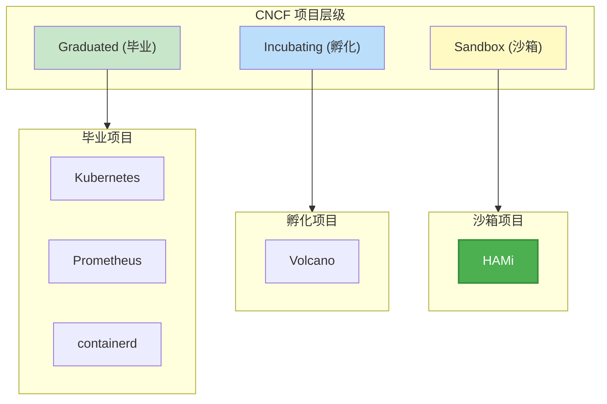
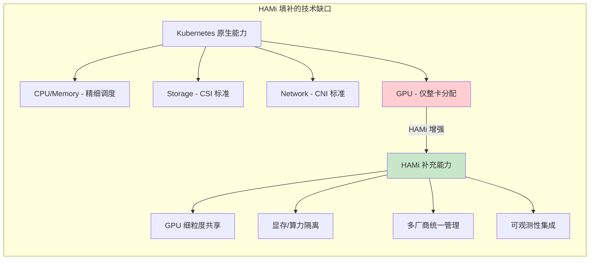
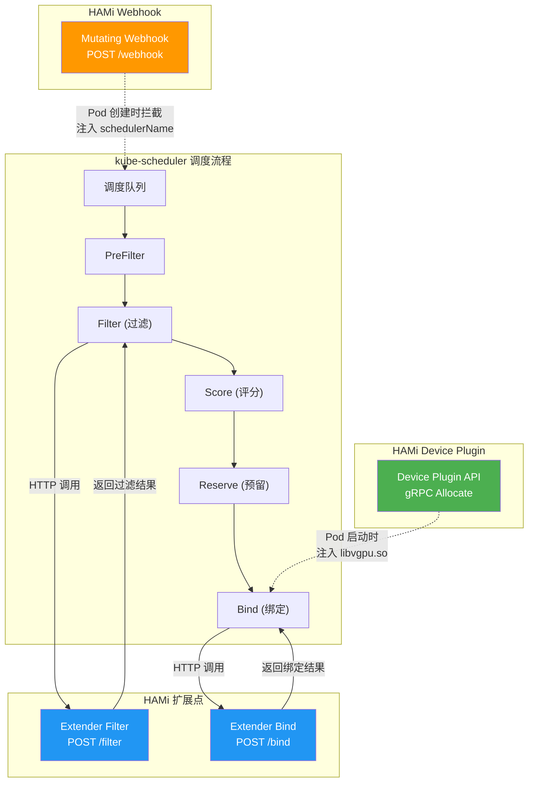
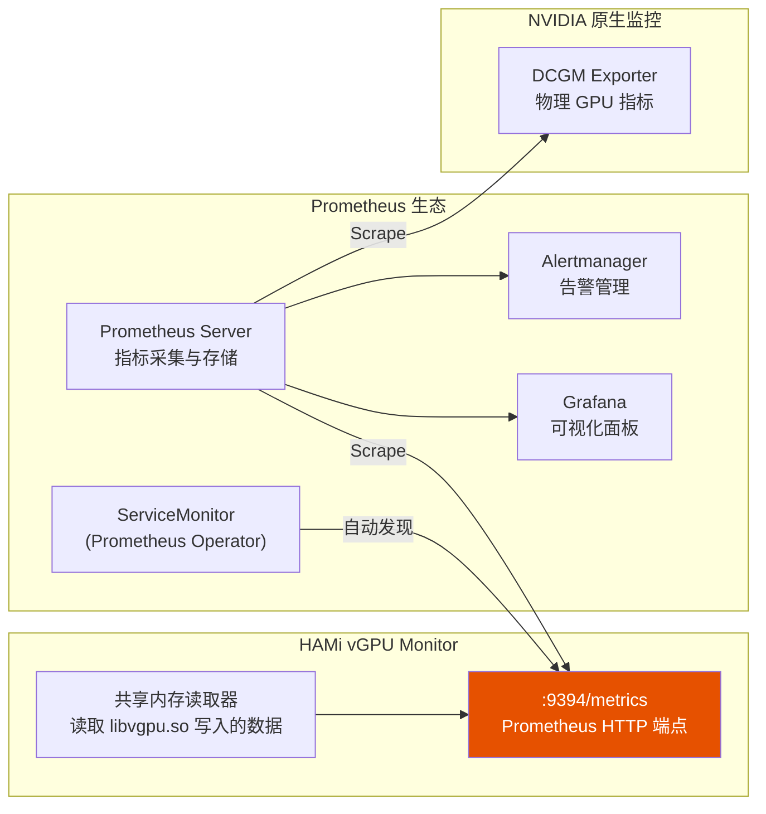
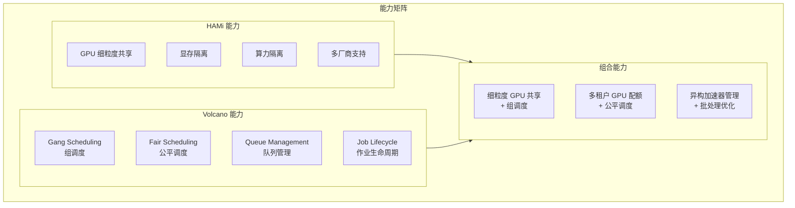
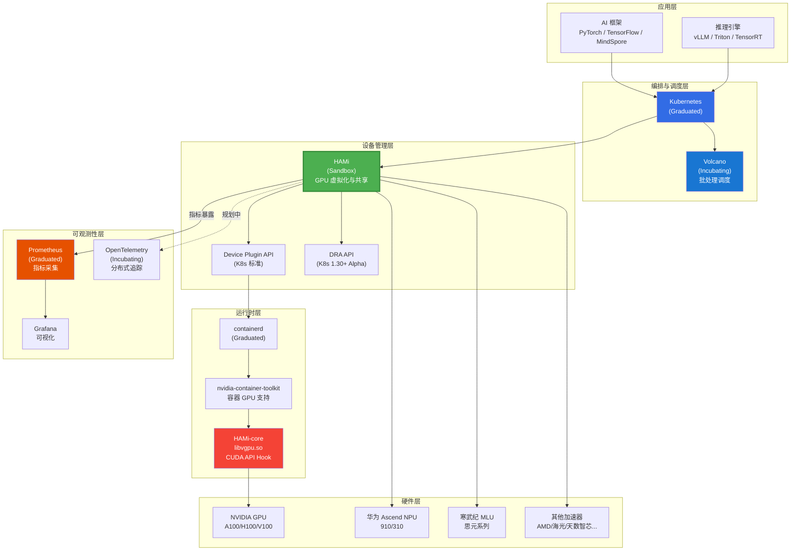
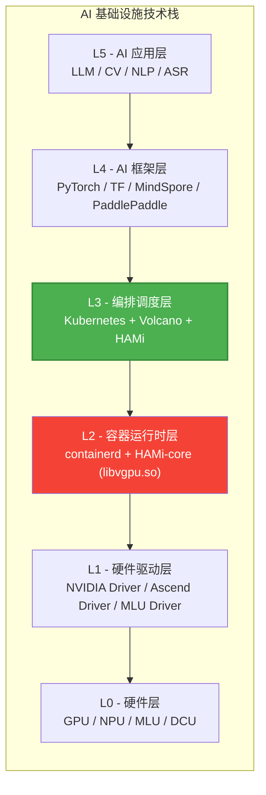

> 本文档阐述 HAMi 在 CNCF (Cloud Native Computing Foundation) 生态系统中的定位，分析其与 Kubernetes 调度框架的集成方式，以及与 Prometheus、Volcano 等其他 CNCF 项目的协作关系。

---

## 目录

- [1. HAMi 在 CNCF Landscape 中的位置](#1-hami-在-cncf-landscape-中的位置)
- [2. 与 Kubernetes 调度框架的集成](#2-与-kubernetes-调度框架的集成)
- [3. 与其他 CNCF 项目的协作](#3-与其他-cncf-项目的协作)
- [4. 生态系统全景图](#4-生态系统全景图)

---

## 1. HAMi 在 CNCF Landscape 中的位置

### 1.1 CNCF 项目层级

HAMi 于 2023 年被 CNCF 接纳为 **Sandbox** 级别项目，位于 CNCF Landscape 的 **Runtime** 领域下的 **Cloud Native Hardware/Device** 子类别。

### 1.2 CNCF Landscape 分类定位

在 CNCF Landscape 的技术分类中，HAMi 属于以下类别：

| 分类层级 | 定位 | 说明 |
|:---------|:-----|:-----|
| 大类 | Runtime | 运行时层，管理计算资源 |
| 子类 | Cloud Native Hardware/Device | 云原生硬件与设备管理 |
| 关键词 | GPU Virtualization, Device Sharing | GPU 虚拟化、设备共享 |

### 1.3 HAMi 解决的 CNCF 生态问题

在 CNCF 的云原生技术栈中，HAMi 填补了**异构加速器虚拟化与共享**这一关键缺口。

---

## 2. 与 Kubernetes 调度框架的集成

### 2.1 Kubernetes 调度扩展机制

HAMi 通过 Kubernetes 官方提供的 **Scheduler Extender** 机制与默认调度器集成，无需修改 Kubernetes 核心代码。

### 2.2 HAMi 使用的 Kubernetes 扩展点

| 扩展机制 | K8s 标准接口 | HAMi 实现 | 注入时机 |
|:---------|:-----------|:---------|:---------|
| Scheduler Extender | `v1beta1.Extender` (HTTP) | `scheduler-extender` | Pod 调度时 |
| Mutating Admission Webhook | `admissionregistration.k8s.io/v1` | `webhook.go` | Pod 创建时 |
| Device Plugin | `k8s.io/kubelet/pkg/apis/deviceplugin/v1beta1` (gRPC) | `device-plugin` | Pod 启动时 |
| Extended Resource | `node.status.capacity` | 虚拟化 GPU 资源 | 设备注册时 |
| Node Annotation | `node.metadata.annotations` | 设备信息编码 | 持续更新 |
| Lease | `coordination.k8s.io/v1` | Leader Election | 持续续约 |

### 2.3 与 Scheduling Framework 的对比

Kubernetes 1.19+ 提供了 Scheduling Framework (调度框架) 作为 Scheduler Extender 的替代方案。HAMi 目前使用 Extender 机制。

| 对比维度 | Scheduler Extender (HAMi 当前) | Scheduling Framework |
|:---------|:---------------------------|:--------------------|
| 部署方式 | 独立进程，HTTP 通信 | 编译到调度器二进制中 |
| 性能 | HTTP 序列化开销 | 内存调用，零序列化 |
| 扩展点 | Filter + Bind | PreFilter/Filter/Score/Reserve/Bind 等 20+ 扩展点 |
| 维护成本 | 独立部署，版本解耦 | 需与 kube-scheduler 版本绑定 |
| 多调度器 | 支持 | 支持 |
| 成熟度 | 稳定 | GA (Kubernetes 1.19+) |

> **设计选择**：HAMi 选择 Scheduler Extender 的主要原因是**版本解耦** -- HAMi 支持 Kubernetes 1.18+ 的广泛版本范围，而 Scheduling Framework 需要与特定 kube-scheduler 版本绑定编译。Extender 模式允许 HAMi 独立发布版本，降低用户升级成本。

---

## 3. 与其他 CNCF 项目的协作

### 3.1 Prometheus - 可观测性

HAMi 原生支持 Prometheus 指标格式，通过 vGPU Monitor 组件暴露 GPU 虚拟化层的监控数据。

**HAMi 暴露的核心指标：**

| 指标 | 类型 | 说明 |
|:-----|:-----|:-----|
| `hami_vgpu_memory_used_bytes` | Gauge | 容器实际 GPU 显存使用量 |
| `hami_vgpu_memory_limit_bytes` | Gauge | 容器 GPU 显存限额 |
| `hami_vgpu_core_used_percent` | Gauge | 容器 SM 使用率 |
| `hami_vgpu_core_limit_percent` | Gauge | 容器 SM 限额 |

**与 DCGM Exporter 的互补关系：**

| 监控层面 | DCGM Exporter | HAMi Monitor |
|:---------|:-------------|:-------------|
| 物理 GPU 温度 | 支持 | 不提供 |
| 物理 GPU 功耗 | 支持 | 不提供 |
| 物理 GPU 利用率 | 支持 | 不提供 |
| 容器级虚拟显存使用 | 不提供 | 支持 |
| 容器级虚拟算力使用 | 不提供 | 支持 |
| 容器级资源限额 | 不提供 | 支持 |

### 3.2 Volcano - 批处理调度

HAMi 与 Volcano 的集成提供了"GPU 虚拟化 + 批处理调度"的完整能力。

详细的集成配置请参考 [HAMi + Volcano 集成指南](../10-operations/02-volcano-integration/)。

### 3.3 containerd / CRI-O - 容器运行时

HAMi 的数据平面 (libvgpu.so) 通过 `LD_PRELOAD` 机制注入容器进程。该机制依赖容器运行时正确传递环境变量和 Volume 挂载。

| 容器运行时 | 兼容性 | 说明 |
|:----------|:-------|:-----|
| containerd | 完全兼容 | 推荐运行时 |
| CRI-O | 完全兼容 | |
| Docker (dockershim) | 兼容 (K8s < 1.24) | K8s 1.24+ 已移除 dockershim |

### 3.4 Helm - 包管理

HAMi 使用 Helm v3 Chart 作为标准部署方式，遵循 Helm Chart 最佳实践。

| Helm 特性 | HAMi 使用情况 |
|:----------|:-------------|
| Chart 版本管理 | Chart v2.8.0，与 appVersion 同步 |
| values.yaml 参数化 | 完整的参数化配置 |
| 子 Chart 依赖 | hami-dra (条件依赖) |
| Hooks | pre-install/post-install Job (证书生成) |
| RBAC 模板 | 完整的 ServiceAccount/Role/ClusterRole |

### 3.5 OpenTelemetry - 可观测性 (规划中)

HAMi 计划在未来版本中集成 OpenTelemetry，提供分布式追踪能力，覆盖从 Pod 调度到 GPU 分配的完整链路。

---

## 4. 生态系统全景图

### 4.1 CNCF 生态定位图

### 4.2 HAMi 在 AI 基础设施栈中的角色

### 4.3 与同类 CNCF 项目的差异化

| 项目 | CNCF 级别 | 核心领域 | 与 HAMi 关系 |
|:-----|:---------|:---------|:------------|
| Kubernetes | Graduated | 容器编排 | HAMi 的运行平台 |
| Volcano | Incubating | 批处理调度 | 互补集成 |
| Prometheus | Graduated | 监控告警 | HAMi 指标消费者 |
| containerd | Graduated | 容器运行时 | HAMi 容器底座 |
| KubeVirt | Incubating | VM 管理 | 无直接关系 |
| KubeEdge | Incubating | 边缘计算 | 潜在集成 (边缘 GPU) |
| Akri | Sandbox | 边缘设备发现 | 类似领域 (设备管理) |

---

> **文档版本：** v1.0
>
> **适用 HAMi 版本：** v2.x
>
> **最后更新：** 2025-05
