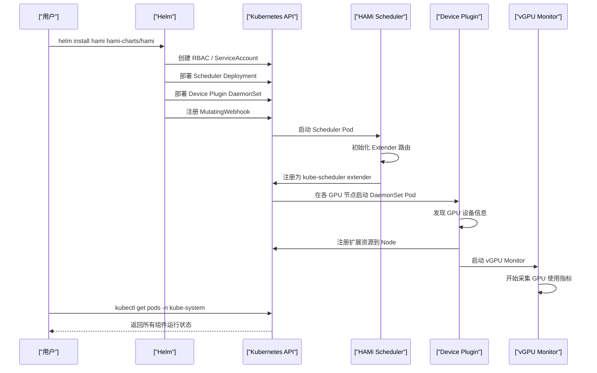
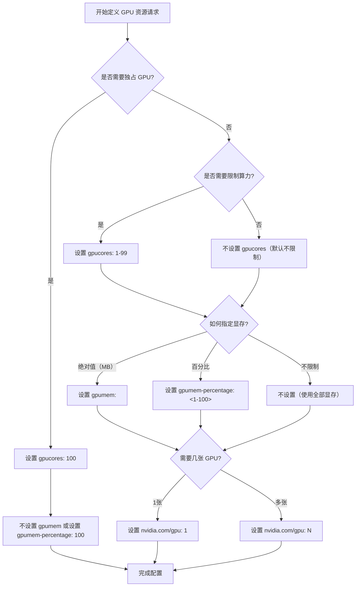

> 本教程将引导您从零开始安装 HAMi，并部署第一个 vGPU 工作负载，体验 GPU 共享的核心能力。

---

## 1. 前置条件

在开始安装 HAMi 之前，请确保您的环境满足以下要求：

| 组件 | 最低版本要求 | 说明 |
|------|-------------|------|
| Kubernetes 集群 | v1.18+ | 支持 v1.18 至 v1.30，推荐使用 v1.24+ |
| NVIDIA GPU 驱动 | >= 440 | 节点上必须已安装 NVIDIA 驱动程序 |
| nvidia-docker | > 2.0 | 用于在容器中访问 GPU 设备 |
| Helm | v3.x | 用于部署 HAMi 组件 |
| kubectl | 与集群版本匹配 | 用于管理集群资源 |

### 1.1 环境检查

在 GPU 节点上执行以下命令，验证驱动和容器运行时是否就绪：

```bash
# 检查 NVIDIA 驱动版本
nvidia-smi

# 检查 nvidia-docker 是否可用
docker run --rm --gpus all nvidia/cuda:11.0-base nvidia-smi

# 检查 Kubernetes 集群状态
kubectl get nodes -o wide

# 检查 Helm 版本
helm version
```

### 1.2 为 GPU 节点打标签

HAMi 的 device-plugin 默认通过节点标签来识别 GPU 节点，请确保所有 GPU 节点已正确打标签：

```bash
kubectl label node <gpu-node-name> gpu=on
```

---

## 2. 安装 HAMi

### 2.1 添加 Helm 仓库

```bash
helm repo add hami-charts https://project-hami.github.io/HAMi/
helm repo update
```

### 2.2 执行安装

```bash
helm install hami hami-charts/hami -n kube-system
```

如果需要自定义配置（例如修改调度策略或资源名称），可以先导出默认的 `values.yaml` 进行修改：

```bash
# 导出默认 values.yaml
helm show values hami-charts/hami > values.yaml

# 使用自定义配置安装
helm install hami hami-charts/hami -n kube-system -f values.yaml
```

### 2.3 安装流程序列图



---

## 3. 验证安装

### 3.1 检查 Scheduler Pod

```bash
kubectl get pods -n kube-system -l app.kubernetes.io/component=hami-scheduler
```

预期输出示例：

```
NAME                              READY   STATUS    RESTARTS   AGE
hami-scheduler-7b8c9d6f4-x2k9p   2/2     Running   0          2m
```

> Scheduler Pod 包含两个容器：`kube-scheduler` 和 `scheduler-extender`，因此 READY 列应显示 `2/2`。

### 3.2 检查 Device Plugin DaemonSet

```bash
kubectl get daemonset -n kube-system -l app.kubernetes.io/component=hami-device-plugin
```

预期输出示例：

```
NAME                 DESIRED   CURRENT   READY   UP-TO-DATE   AVAILABLE   AGE
hami-device-plugin   2         2         2       2            2           2m
```

> DESIRED 数量应等于集群中 GPU 节点的数量。

### 3.3 检查 vGPU Monitor

```bash
kubectl get pods -n kube-system -l app.kubernetes.io/component=hami-device-plugin
```

在每个 Device Plugin Pod 中，Monitor 作为 sidecar 容器运行：

```bash
# 查看 Pod 中的容器
kubectl describe pod -n kube-system <device-plugin-pod-name> | grep -A 5 "Containers:"
```

### 3.4 检查节点扩展资源

验证 GPU 节点是否已注册 HAMi 扩展资源：

```bash
kubectl describe node <gpu-node-name> | grep -A 10 "Allocatable:"
```

预期可以看到以下资源：

```
nvidia.com/gpu:                10
nvidia.com/gpucores:           100
nvidia.com/gpumem:             81920
nvidia.com/gpumem-percentage:  100
```

---

## 4. 部署第一个 vGPU 工作负载

### 4.1 创建测试 Pod

创建一个请求 2048MB GPU 显存和 30% 算力的 Pod：

```yaml
# vgpu-test.yaml
apiVersion: v1
kind: Pod
metadata:
  name: vgpu-test
spec:
  containers:
  - name: cuda-container
    image: nvidia/cuda:11.0.3-base-ubuntu20.04
    command: ["sleep", "infinity"]
    resources:
      limits:
        nvidia.com/gpu: 1
        nvidia.com/gpumem: 2048
        nvidia.com/gpucores: 30
```

部署该 Pod：

```bash
kubectl apply -f vgpu-test.yaml
```

### 4.2 资源规格决策树

在定义 GPU 资源请求时，可以参考以下决策流程：



### 4.3 验证资源分配

```bash
# 查看 Pod 状态
kubectl get pod vgpu-test

# 进入容器检查 GPU 信息
kubectl exec -it vgpu-test -- nvidia-smi
```

在容器内执行 `nvidia-smi` 后，您会看到 GPU 显存被限制在 2048MB。

---

## 5. 体验 GPU 共享

### 5.1 部署两个 Pod 共享同一张 GPU

创建两个分别请求一半 GPU 资源的 Pod：

```yaml
# vgpu-share-pod1.yaml
apiVersion: v1
kind: Pod
metadata:
  name: vgpu-share-pod1
spec:
  containers:
  - name: cuda-container
    image: nvidia/cuda:11.0.3-base-ubuntu20.04
    command: ["sleep", "infinity"]
    resources:
      limits:
        nvidia.com/gpu: 1
        nvidia.com/gpumem: 4096
        nvidia.com/gpucores: 50
---
# vgpu-share-pod2.yaml
apiVersion: v1
kind: Pod
metadata:
  name: vgpu-share-pod2
spec:
  containers:
  - name: cuda-container
    image: nvidia/cuda:11.0.3-base-ubuntu20.04
    command: ["sleep", "infinity"]
    resources:
      limits:
        nvidia.com/gpu: 1
        nvidia.com/gpumem: 4096
        nvidia.com/gpucores: 50
```

```bash
kubectl apply -f vgpu-share-pod1.yaml
kubectl apply -f vgpu-share-pod2.yaml
```

### 5.2 验证 GPU 共享

**方法一：查看 Pod 的设备分配注解**

```bash
# 查看两个 Pod 被分配到的 GPU UUID
kubectl get pod vgpu-share-pod1 -o jsonpath='{.metadata.annotations.hami\.io/vgpu-devices-allocated}'
kubectl get pod vgpu-share-pod2 -o jsonpath='{.metadata.annotations.hami\.io/vgpu-devices-allocated}'
```

如果两个 Pod 的 UUID 相同，说明它们共享了同一张物理 GPU。

**方法二：在容器中验证**

```bash
# 分别进入两个容器查看 GPU 信息
kubectl exec -it vgpu-share-pod1 -- nvidia-smi
kubectl exec -it vgpu-share-pod2 -- nvidia-smi
```

两个容器都能看到 GPU，但各自的显存被限制在 4096MB。

**方法三：在宿主机上验证**

```bash
# 在 GPU 节点上执行
nvidia-smi
```

在宿主机的 `nvidia-smi` 输出中，您会看到两个进程共享同一张 GPU。

---

## 6. 清理资源

### 6.1 删除测试 Pod

```bash
kubectl delete pod vgpu-test vgpu-share-pod1 vgpu-share-pod2
```

### 6.2 卸载 HAMi（如需要）

```bash
helm uninstall hami -n kube-system
```

### 6.3 清理节点标签（如需要）

```bash
kubectl label node <gpu-node-name> gpu-
```

---

## 7. 下一步

恭喜您完成了 HAMi 的快速入门！接下来建议您阅读以下文档以深入了解 HAMi 的能力：

- [配置指南](./02-configuration-guide/) -- 了解 HAMi 的各项配置参数及其调优方法
- [GPU 共享实战示例](./03-gpu-sharing-examples/) -- 学习 8 个典型的 GPU 共享使用场景
