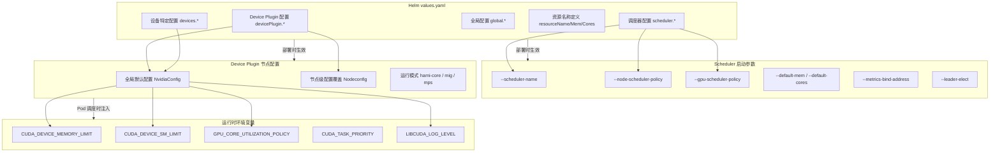

> 本文档详细介绍 HAMi 的各层级配置参数，包括 Helm values.yaml、调度器命令行参数、Device Plugin 配置、以及运行时环境变量，帮助您根据实际业务场景进行精细化调优。

---

## 1. 配置体系概览

HAMi 的配置分布在多个层级，从部署时的 Helm 参数到运行时的环境变量，构成了一套完整的配置体系。以下流程图展示了各层配置的关系和优先级。



---

## 2. Helm values.yaml 详解

### 2.1 全局配置

| 参数 | 默认值 | 说明 |
|------|--------|------|
| `global.imageRegistry` | `""` | 全局镜像仓库地址，设置后覆盖所有组件的镜像仓库 |
| `global.imagePullSecrets` | `[]` | 全局镜像拉取密钥列表 |
| `global.imageTag` | `v2.8.0` | 全局默认镜像标签 |
| `global.gpuHookPath` | `/usr/local` | GPU Hook 库的挂载路径 |
| `global.managedNodeSelectorEnable` | `false` | 是否启用受管节点选择器 |
| `global.managedNodeSelector` | `usage: "gpu"` | 受管节点选择器标签 |

### 2.2 GPU 资源名称定义

这些参数定义了 Kubernetes 中 GPU 扩展资源的名称，与 Pod spec 中的 `resources.limits` 对应：

| 参数 | 默认值 | 说明 |
|------|--------|------|
| `resourceName` | `nvidia.com/gpu` | GPU 数量资源名称 |
| `resourceMem` | `nvidia.com/gpumem` | GPU 显存资源名称（单位: MB） |
| `resourceMemPercentage` | `nvidia.com/gpumem-percentage` | GPU 显存百分比资源名称（1-100） |
| `resourceCores` | `nvidia.com/gpucores` | GPU 算力核心百分比资源名称（1-100） |
| `resourcePriority` | `nvidia.com/priority` | GPU 任务优先级资源名称 |
| `schedulerName` | `hami-scheduler` | HAMi 调度器名称，Pod 使用此名称指定调度器 |

### 2.3 Scheduler 配置

| 参数 | 默认值 | 说明 |
|------|--------|------|
| `scheduler.overwriteEnv` | `false` | 当 Pod 不请求 GPU 资源时，是否设置 `NVIDIA_VISIBLE_DEVICES=none` |
| `scheduler.defaultSchedulerPolicy.nodeSchedulerPolicy` | `binpack` | 节点级调度策略，可选 `binpack` / `spread` |
| `scheduler.defaultSchedulerPolicy.gpuSchedulerPolicy` | `spread` | GPU 级调度策略，可选 `binpack` / `spread` |
| `scheduler.metricsBindAddress` | `:9395` | Prometheus 指标监听地址 |
| `scheduler.forceOverwriteDefaultScheduler` | `true` | 当 Pod 使用默认调度器名称时，是否强制覆盖为 HAMi 调度器 |
| `scheduler.leaderElect` | `true` | 是否启用 Leader 选举（多副本部署时必须启用） |
| `scheduler.replicas` | `1` | Scheduler 副本数（需配合 `leaderElect: true`） |
| `scheduler.nodeLockExpire` | `5m` | 节点锁超时时间 |
| `scheduler.livenessProbe` | `false` | 是否启用存活探针 |
| `scheduler.admissionWebhook.enabled` | `true` | 是否启用 Admission Webhook |
| `scheduler.admissionWebhook.failurePolicy` | `Ignore` | Webhook 失败策略，可选 `Ignore` / `Fail` |

### 2.4 Device Plugin 配置

| 参数 | 默认值 | 说明 |
|------|--------|------|
| `devicePlugin.enabled` | `true` | 是否启用 Device Plugin |
| `devicePlugin.deviceSplitCount` | `10` | 每张物理 GPU 最大切分数量 |
| `devicePlugin.deviceMemoryScaling` | `1` | 显存超配比例，设置为 2 表示报告双倍显存 |
| `devicePlugin.deviceCoreScaling` | `1` | 算力超配比例 |
| `devicePlugin.preConfiguredDeviceMemory` | `0` | 预配置设备显存（MB），用于不支持显存查询的 GPU |
| `devicePlugin.runtimeClassName` | `""` | 指定 RuntimeClass 名称 |
| `devicePlugin.createRuntimeClass` | `false` | 是否自动创建 RuntimeClass |
| `devicePlugin.migStrategy` | `none` | MIG 策略，可选 `none` / `single` / `mixed` |
| `devicePlugin.disablecorelimit` | `false` | 是否禁用算力限制 |
| `devicePlugin.nvidiaNodeSelector` | `gpu: "on"` | GPU 节点选择器标签 |
| `devicePlugin.pluginPath` | `/var/lib/kubelet/device-plugins` | 设备插件 socket 路径 |
| `devicePlugin.libPath` | `/usr/local/vgpu` | vGPU 库路径 |

### 2.5 设备特定配置

```yaml
devices:
  nvidia:
    gpuCorePolicy: default    # GPU 算力隔离策略: default / force / disable
    libCudaLogLevel: 1        # CUDA 日志级别: 0(Error) / 1(Warn) / 3(Info) / 4(Debug)
```

---

## 3. Scheduler 命令行参数

Scheduler 组件通过命令行参数控制其运行行为。以下表格列出了所有可用参数，对应源码 `cmd/scheduler/main.go` 中的定义。

### 3.1 核心参数

| 参数 | 默认值 | 类型 | 说明 |
|------|--------|------|------|
| `--http_bind` | `127.0.0.1:8080` | string | HTTP 服务监听地址和端口 |
| `--scheduler-name` | `""` | string | 调度器名称，非空时会添加到 `pod.spec.schedulerName` |
| `--cert_file` | `""` | string | TLS 证书文件路径，启用 HTTPS |
| `--key_file` | `""` | string | TLS 密钥文件路径，启用 HTTPS |

### 3.2 资源默认值参数

| 参数 | 默认值 | 类型 | 说明 |
|------|--------|------|------|
| `--default-mem` | `0` | int32 | 默认分配的 GPU 显存（MB），`0` 表示使用百分比 100% |
| `--default-cores` | `0` | int32 | 默认分配的 GPU 算力百分比（0-100），`0` 表示不限制 |
| `--default-gpu` | `1` | int32 | 默认分配的 GPU 数量 |

> **注意**: 当 `--default-mem=0` 且 Pod 未指定 `gpumem` 和 `gpumem-percentage` 时，系统会默认分配该 GPU 100% 的显存。

### 3.3 调度策略参数

| 参数 | 默认值 | 类型 | 说明 |
|------|--------|------|------|
| `--node-scheduler-policy` | `binpack` | string | 节点级调度策略。`binpack` 将 Pod 集中调度到少量节点；`spread` 将 Pod 分散到不同节点 |
| `--gpu-scheduler-policy` | `spread` | string | GPU 级调度策略。`binpack` 将任务集中到少量 GPU；`spread` 将任务分散到不同 GPU |
| `--force-overwrite-default-scheduler` | `true` | bool | 当 Pod 的 `schedulerName` 为 Kubernetes 默认值时，是否强制覆盖为 HAMi 调度器 |

**调度策略组合说明**

| 节点策略 (Node) | GPU 策略 (GPU) | 效果 |
|----------------|----------------|------|
| binpack | spread | 优先填满少量节点，但在同一节点内将任务分散到不同 GPU |
| binpack | binpack | 优先填满少量节点，并尽可能将任务集中到同一张 GPU |
| spread | spread | 将任务分散到不同节点，且在同一节点内分散到不同 GPU |
| spread | binpack | 将任务分散到不同节点，但在同一节点内集中到少量 GPU |

### 3.4 监控与性能参数

| 参数 | 默认值 | 类型 | 说明 |
|------|--------|------|------|
| `--metrics-bind-address` | `:9395` | string | Prometheus 指标服务监听地址 |
| `--profiling` | `false` | bool | 启用 pprof 性能分析 HTTP 端点 |
| `--node-lock-timeout` | `5m` | duration | 节点锁超时时间，超过此时间后锁自动释放 |

### 3.5 节点筛选参数

| 参数 | 默认值 | 类型 | 说明 |
|------|--------|------|------|
| `--node-label-selector` | `nil` | map[string]string | 节点标签选择器，仅调度到匹配标签的节点。格式: `key1=value1,key2=value2` |

示例：

```bash
--node-label-selector="gpu=on,zone=east"
```

### 3.6 API Server 通信参数

| 参数 | 默认值 | 类型 | 说明 |
|------|--------|------|------|
| `--kube-qps` | `5` | float32 | 与 kube-apiserver 通信的 QPS（每秒查询数） |
| `--kube-burst` | `10` | int | 与 kube-apiserver 通信的突发请求数上限 |
| `--kube-timeout` | `15` | int | 与 kube-apiserver 通信的超时时间（秒） |

> **调优建议**: 在大规模集群（500+ 节点）中，建议将 `--kube-qps` 提升至 50，`--kube-burst` 提升至 100，以避免 API Server 限流导致调度延迟。

### 3.7 Leader 选举参数

| 参数 | 默认值 | 类型 | 说明 |
|------|--------|------|------|
| `--leader-elect` | `false` | bool | 是否启用 Leader 选举，多副本部署时必须启用 |
| `--leader-elect-resource-name` | `""` | string | Leader 选举使用的资源对象名称 |
| `--leader-elect-resource-namespace` | `""` | string | Leader 选举使用的资源对象命名空间 |

---

## 4. Device Plugin 配置（NvidiaConfig）

Device Plugin 的配置通过 ConfigMap 挂载到各 GPU 节点上的 DaemonSet Pod 中，支持全局默认值和节点级覆盖。

### 4.1 全局默认配置

在 Helm `values.yaml` 中定义：

```yaml
devicePlugin:
  deviceSplitCount: 10          # 每张 GPU 最大切分数
  deviceMemoryScaling: 1        # 显存超配比
  deviceCoreScaling: 1          # 算力超配比
  preConfiguredDeviceMemory: 0  # 预配置显存(MB)，用于不支持显存查询的 GPU
```

对应 `NvidiaConfig` 结构体字段：

| 字段 | 类型 | 说明 |
|------|------|------|
| `ResourceCountName` | string | GPU 数量资源名称 |
| `ResourceMemoryName` | string | GPU 显存资源名称 |
| `ResourceCoreName` | string | GPU 算力资源名称 |
| `ResourceMemoryPercentageName` | string | GPU 显存百分比资源名称 |
| `ResourcePriority` | string | GPU 任务优先级资源名称 |
| `OverwriteEnv` | bool | 非 GPU Pod 是否设置 `NVIDIA_VISIBLE_DEVICES=none` |
| `DefaultMemory` | int32 | 默认显存分配（MB） |
| `DefaultCores` | int32 | 默认算力分配百分比 |
| `DefaultGPUNum` | int32 | 默认 GPU 数量 |
| `MemoryFactor` | int32 | 显存倍数因子 |
| `DisableCoreLimit` | bool | 是否禁用算力隔离 |
| `GPUCorePolicy` | string | GPU 算力隔离策略 |
| `RuntimeClassName` | string | RuntimeClass 名称 |

### 4.2 节点级配置覆盖

通过 `nodeConfiguration.config` 为特定节点设置差异化配置。节点级配置优先级高于全局配置。

```yaml
devicePlugin:
  nodeConfiguration:
    config: |
      {
        "nodeconfig": [
          {
            "name": "gpu-node-01",
            "operatingmode": "hami-core",
            "devicememoryscaling": 1.5,
            "devicesplitcount": 20,
            "preconfigureddevicememory": 0,
            "migstrategy": "none",
            "filterdevices": {
              "uuid": [],
              "index": []
            }
          },
          {
            "name": "gpu-node-02",
            "operatingmode": "mig",
            "devicememoryscaling": 1,
            "devicesplitcount": 7,
            "migstrategy": "mixed"
          }
        ]
      }
```

**节点级可覆盖字段**

| 字段 | 类型 | 说明 |
|------|------|------|
| `name` | string | 节点名称，必须与 `kubectl get nodes` 中的名称一致 |
| `operatingmode` | string | 运行模式: `hami-core`(默认) / `mig` / `mps` |
| `devicesplitcount` | uint | 该节点每张 GPU 的最大切分数 |
| `devicememoryscaling` | float64 | 该节点的显存超配比 |
| `devicecorescaling` | float64 | 该节点的算力超配比 |
| `preconfigureddevicememory` | int64 | 预配置显存(MB) |
| `libcudaloglevel` | string | 该节点的 CUDA 日志级别 |
| `migstrategy` | string | MIG 策略: `none` / `single` / `mixed` |
| `filterdevices` | object | 需要过滤（排除）的设备 |

### 4.3 外部 ConfigMap 配置

如果需要使用已有的 ConfigMap，可以通过 `externalConfigName` 指定：

```yaml
devicePlugin:
  nodeConfiguration:
    externalConfigName: "my-hami-config"
```

此时 Helm Chart 不会创建 ConfigMap，而是直接引用名为 `my-hami-config` 的已有 ConfigMap。

---

## 5. 运行时环境变量

当 Pod 被调度到 GPU 节点并经过 HAMi Webhook 和 Device Plugin 处理后，容器中会被注入以下环境变量。这些变量由 HAMi 的 hami-core 库在运行时读取，用于控制 GPU 资源的隔离行为。

### 5.1 环境变量详解

| 环境变量 | 示例值 | 说明 |
|---------|--------|------|
| `CUDA_DEVICE_MEMORY_LIMIT_0` | `2048M` | 第 0 号 GPU 设备的显存上限。支持后缀: `G`(GB)、`M`(MB)、`K`(KB)。如有多张 GPU，使用 `_1`、`_2` 递增 |
| `CUDA_DEVICE_SM_LIMIT` | `30` | GPU SM（流多处理器）使用上限，取值范围 0-100，对应算力百分比。`0` 表示不限制 |
| `GPU_CORE_UTILIZATION_POLICY` | `default` | GPU 算力隔离策略。三种可选值见下表 |
| `CUDA_TASK_PRIORITY` | `0` | CUDA 任务优先级，数值越大优先级越高 |
| `LIBCUDA_LOG_LEVEL` | `1` | hami-core 库的日志级别 |

### 5.2 GPU_CORE_UTILIZATION_POLICY 策略详解

| 策略值 | 说明 | 使用场景 |
|--------|------|---------|
| `default` | 默认策略。当设置了 `gpucores` 时启用算力隔离，采用软限制方式。当 GPU 空闲时允许超额使用，但在竞争时会限制在分配的比例内 | 适合大多数场景，兼顾资源利用率和公平性 |
| `force` | 强制策略。严格限制 GPU 算力使用，即使 GPU 空闲也不允许超出分配比例 | 适合对算力隔离有严格要求的生产环境，如多租户场景 |
| `disable` | 禁用策略。完全不限制 GPU 算力，忽略 `gpucores` 的设置 | 适合调试场景或不需要算力隔离的环境 |

### 5.3 LIBCUDA_LOG_LEVEL 日志级别

| 级别值 | 含义 | 说明 |
|--------|------|------|
| `0` | Error | 仅输出错误信息 |
| `1` | Warning | 输出警告和错误信息（默认） |
| `3` | Info | 输出一般信息、警告和错误 |
| `4` | Debug | 输出所有调试信息，日志量最大 |

> **注意**: 生产环境建议使用级别 `0` 或 `1`，避免过多日志输出影响性能。调试时可临时设置为 `4`。

### 5.4 环境变量注入示例

以下 YAML 展示了一个 Pod 经过 HAMi 处理后，容器中实际被注入的环境变量：

```yaml
# 用户提交的原始 spec
resources:
  limits:
    nvidia.com/gpu: 1
    nvidia.com/gpumem: 4096
    nvidia.com/gpucores: 50

# HAMi 实际注入容器的环境变量（无需手动设置）
# CUDA_DEVICE_MEMORY_LIMIT_0=4096M
# CUDA_DEVICE_SM_LIMIT=50
# GPU_CORE_UTILIZATION_POLICY=default
# LIBCUDA_LOG_LEVEL=1
```

---

## 6. 配置最佳实践

### 6.1 开发测试环境

```yaml
# values-dev.yaml
devicePlugin:
  deviceSplitCount: 20          # 允许更多切分，提高 GPU 利用率
  deviceMemoryScaling: 2        # 启用 2 倍显存超配
scheduler:
  defaultSchedulerPolicy:
    nodeSchedulerPolicy: binpack  # 集中调度，减少节点使用
    gpuSchedulerPolicy: binpack   # 集中 GPU，最大化共享
devices:
  nvidia:
    gpuCorePolicy: default        # 软限制，提高利用率
    libCudaLogLevel: 3            # 输出 Info 级别日志便于调试
```

### 6.2 生产环境

```yaml
# values-prod.yaml
devicePlugin:
  deviceSplitCount: 10            # 合理切分数
  deviceMemoryScaling: 1          # 不超配，保证稳定性
scheduler:
  defaultSchedulerPolicy:
    nodeSchedulerPolicy: spread    # 分散调度，提高容错性
    gpuSchedulerPolicy: spread     # 分散 GPU，减少互相影响
  leaderElect: true                # 启用 HA
  replicas: 2                      # 双副本
devices:
  nvidia:
    gpuCorePolicy: force            # 严格算力隔离
    libCudaLogLevel: 0              # 仅 Error 日志
```

### 6.3 多租户环境

```yaml
# values-multitenant.yaml
devicePlugin:
  deviceSplitCount: 10
  deviceMemoryScaling: 1          # 不超配
scheduler:
  defaultSchedulerPolicy:
    nodeSchedulerPolicy: spread
    gpuSchedulerPolicy: spread
  admissionWebhook:
    failurePolicy: Fail            # Webhook 失败时拒绝 Pod，确保安全
devices:
  nvidia:
    gpuCorePolicy: force            # 强制算力隔离
```

---

## 7. 下一步

- [快速入门教程](./01-quick-start/) -- 如果您还没有安装 HAMi，从这里开始
- [GPU 共享实战示例](./03-gpu-sharing-examples/) -- 学习各种 GPU 共享使用场景的具体配置
