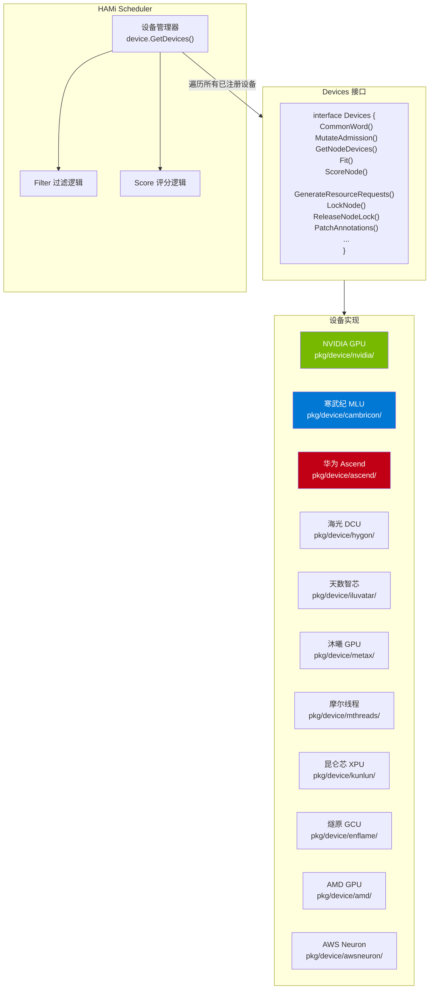
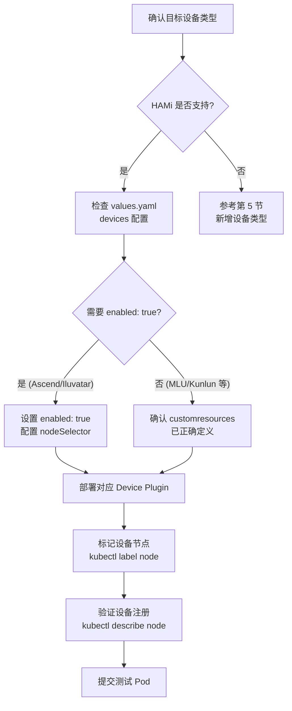
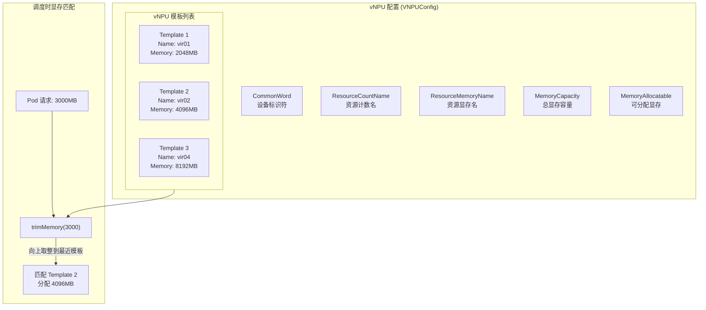
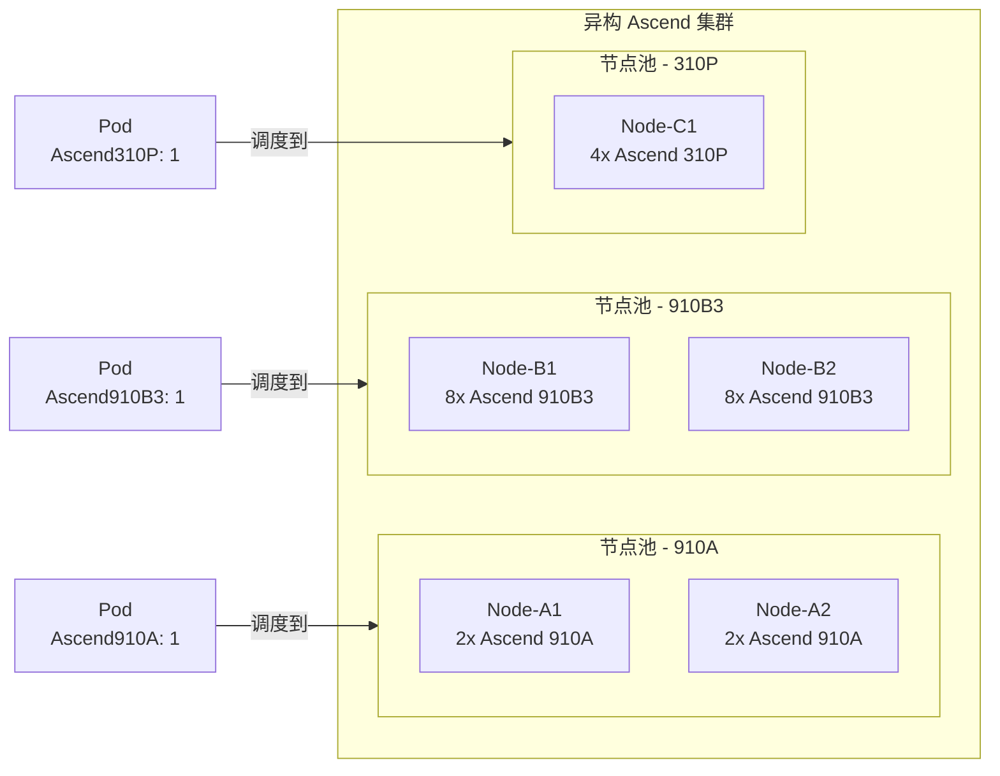
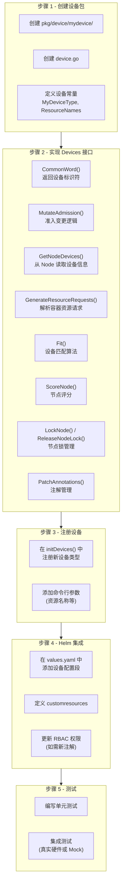
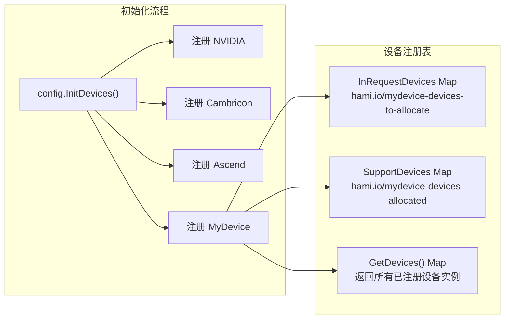
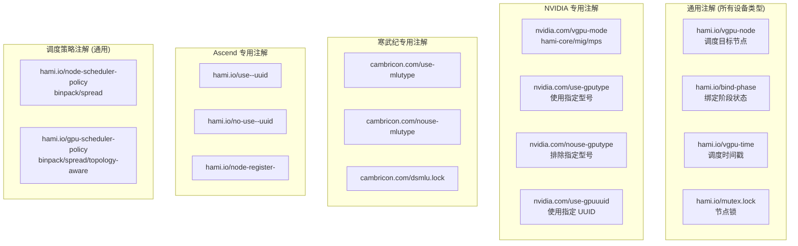

> 本文档详细介绍如何在 HAMi 中启用和使用非 NVIDIA 设备，包括寒武纪 MLU、华为 Ascend NPU 等异构加速器的配置方法、资源名称定义，以及新增设备类型的概念流程。

---

## 目录

- [1. 启用非 NVIDIA 设备](#1-启用非-nvidia-设备)
- [2. 寒武纪 MLU 配置与使用](#2-寒武纪-mlu-配置与使用)
- [3. 华为 Ascend NPU 配置与使用](#3-华为-ascend-npu-配置与使用)
- [4. 其他设备类型速查](#4-其他设备类型速查)
- [5. 新增设备类型的概念流程](#5-新增设备类型的概念流程)
- [6. 设备注解与资源名称总览](#6-设备注解与资源名称总览)

---

## 1. 启用非 NVIDIA 设备

### 1.1 HAMi 多设备架构

HAMi 通过统一的 `Devices` 接口抽象支持 11 种以上异构加速器。每种设备类型实现相同的接口，由 Scheduler 统一调度管理。



### 1.2 Helm values.yaml 中的设备开关

非 NVIDIA 设备在 `values.yaml` 的 `devices` 段落中配置。部分设备需要显式启用。

```yaml
# values.yaml
devices:
  # NVIDIA GPU - 默认启用
  nvidia:
    gpuCorePolicy: default
    libCudaLogLevel: 1

  # 寒武纪 MLU - 通过 customresources 自动启用
  # (只要 Scheduler 能发现节点上的 MLU 资源即可)

  # 华为 Ascend - 需要单独启用和部署
  ascend:
    enabled: false              # 设为 true 启用
    image: ""                   # Ascend Device Plugin 镜像
    imagePullPolicy: IfNotPresent
    extraArgs: []
    nodeSelector:
      ascend: "on"              # Ascend 节点标签
    tolerations: []
    customresources:
      - huawei.com/Ascend910A
      - huawei.com/Ascend910A-memory
      - huawei.com/Ascend910B2
      - huawei.com/Ascend910B2-memory
      # ...

  # 天数智芯 - 需要显式启用
  iluvatar:
    enabled: false
    customresources:
      - iluvatar.ai/BI-V100-vgpu
      - iluvatar.ai/BI-V100.vCore
      - iluvatar.ai/BI-V100.vMem
      # ...

  # 其他默认启用的设备
  kunlun:
    enabled: true
  enflame:
    enabled: true
  mthreads:
    enabled: true
```

### 1.3 设备启用流程



---

## 2. 寒武纪 MLU 配置与使用

### 2.1 概述

寒武纪 MLU (Machine Learning Unit) 是国产 AI 加速芯片，HAMi 通过 `CambriconDevices` 实现了 MLU 的虚拟化共享管理，支持显存和算力的细粒度分配。

### 2.2 资源名称

| 资源名称 | Helm 参数 | 默认值 | 说明 |
|:---------|:---------|:------|:-----|
| MLU 数量 | `mluResourceName` | `cambricon.com/vmlu` | 请求的虚拟 MLU 数量 |
| MLU 显存 | `mluResourceMem` | `cambricon.com/mlu.smlu.vmemory` | 请求的显存 (单位: 256MB) |
| MLU 算力 | `mluResourceCores` | `cambricon.com/mlu.smlu.vcore` | 请求的算力百分比 (0-100) |

> **注意**：寒武纪 MLU 的显存单位是 **256MB 为一个单位**，不同于 NVIDIA 的 MB 单位。例如，请求 4GB 显存需要设置 `vmemory: 16` (16 x 256MB = 4096MB)。

### 2.3 前置条件

| 组件 | 要求 |
|:-----|:-----|
| 寒武纪 MLU 驱动 | 已安装在所有 MLU 节点 |
| 寒武纪容器运行时 | 已配置 cambricon-container-runtime |
| 寒武纪 Device Plugin | 需要单独安装 (smlu-container-toolkit) |

### 2.4 Helm 配置

```yaml
# values.yaml
mluResourceName: "cambricon.com/vmlu"
mluResourceMem: "cambricon.com/mlu.smlu.vmemory"
mluResourceCores: "cambricon.com/mlu.smlu.vcore"
```

### 2.5 设备注解

寒武纪 MLU 使用以下注解进行设备管理：

| 注解 Key | 说明 |
|:---------|:-----|
| `cambricon.com/use-mlutype` | 指定使用的 MLU 型号 |
| `cambricon.com/nouse-mlutype` | 排除的 MLU 型号 |
| `cambricon.com/use-gpuuuid` | 指定使用的 MLU UUID |
| `cambricon.com/nouse-gpuuuid` | 排除的 MLU UUID |
| `cambricon.com/dsmlu.lock` | 节点级 MLU 分配锁 |

### 2.6 Pod 提交示例

```yaml
apiVersion: v1
kind: Pod
metadata:
  name: mlu-inference
  annotations:
    cambricon.com/use-mlutype: "MLU370"    # 可选: 指定 MLU 型号
spec:
  containers:
  - name: mlu-app
    image: my-mlu-inference:latest
    resources:
      limits:
        cambricon.com/vmlu: 1                    # 1 个虚拟 MLU
        cambricon.com/mlu.smlu.vmemory: 16       # 4GB 显存 (16 x 256MB)
        cambricon.com/mlu.smlu.vcore: 50         # 50% 算力
```

### 2.7 MLU 调度流程

```mermaid
sequenceDiagram
    participant User as 用户
    participant WH as HAMi Webhook
    participant SE as Scheduler Extender
    participant MLU as CambriconDevices
    participant DP as MLU Device Plugin

    User->>WH: 创建 Pod (cambricon.com/vmlu)
    WH->>WH: MutateAdmission
检测 MLU 资源请求
    WH->>WH: 注入 schedulerName

    SE->>MLU: GenerateResourceRequests
解析 vmemory/vcore
    Note over MLU: vmemory 单位转换
16 x 256MB = 4096MB

    SE->>MLU: GetNodeDevices
从节点读取 MLU 信息
    SE->>MLU: Fit
匹配设备

    alt 设备匹配成功
        MLU-->>SE: 返回设备分配方案
        SE->>MLU: PatchAnnotations
设置 DSMLU Profile
        SE->>SE: Bind Pod
    else 设备不足
        MLU-->>SE: 返回失败原因
        SE-->>User: Pod Pending
    end
```

---

## 3. 华为 Ascend NPU 配置与使用

### 3.1 概述

华为 Ascend (昇腾) NPU 是面向 AI 场景的神经网络处理器。HAMi 通过 `ascend.Devices` 实现了 Ascend NPU 的虚拟化管理，支持 vNPU (虚拟 NPU) 的细粒度分配。

### 3.2 支持的芯片型号

| 芯片系列 | 型号 | 资源名称 (数量) | 资源名称 (显存) |
|:---------|:-----|:---------------|:---------------|
| Ascend 910 | 910A | `huawei.com/Ascend910A` | `huawei.com/Ascend910A-memory` |
| Ascend 910 | 910B2 | `huawei.com/Ascend910B2` | `huawei.com/Ascend910B2-memory` |
| Ascend 910 | 910B3 | `huawei.com/Ascend910B3` | `huawei.com/Ascend910B3-memory` |
| Ascend 910 | 910B4 | `huawei.com/Ascend910B4` | `huawei.com/Ascend910B4-memory` |
| Ascend 910 | 910B4-1 | `huawei.com/Ascend910B4-1` | `huawei.com/Ascend910B4-1-memory` |
| Ascend 310 | 310P | `huawei.com/Ascend310P` | `huawei.com/Ascend310P-memory` |

### 3.3 Helm 配置

```yaml
# values.yaml
devices:
  ascend:
    enabled: true                     # 启用 Ascend 支持
    image: "projecthami/ascend-device-plugin:latest"
    imagePullPolicy: IfNotPresent
    nodeSelector:
      ascend: "on"                    # Ascend 节点标签
    tolerations: []
    customresources:
      - huawei.com/Ascend910A
      - huawei.com/Ascend910A-memory
      - huawei.com/Ascend910B2
      - huawei.com/Ascend910B2-memory
      - huawei.com/Ascend910B3
      - huawei.com/Ascend910B3-memory
      - huawei.com/Ascend910B4
      - huawei.com/Ascend910B4-memory
      - huawei.com/Ascend910B4-1
      - huawei.com/Ascend910B4-1-memory
      - huawei.com/Ascend310P
      - huawei.com/Ascend310P-memory
```

### 3.4 节点标记

```bash
# 标记 Ascend 节点
kubectl label node <ascend-node-name> ascend=on
```

### 3.5 vNPU 模板机制

Ascend 设备使用 **vNPU 模板 (Template)** 定义虚拟化切分方案。每种芯片型号有预定义的切分模板，指定可用的显存和算力配置。



### 3.6 Ascend 特有注解

| 注解 Key | 说明 |
|:---------|:-----|
| `hami.io/use-<commonWord>-uuid` | 指定使用的 NPU UUID |
| `hami.io/no-use-<commonWord>-uuid` | 排除的 NPU UUID |
| `hami.io/node-register-<commonWord>` | 节点 NPU 设备注册信息 |
| `hami.io/node-handshake-<commonWord>` | 节点握手状态 |

### 3.7 Pod 提交示例

```yaml
# Ascend 910B3 推理任务
apiVersion: v1
kind: Pod
metadata:
  name: ascend-inference
spec:
  containers:
  - name: mindspore-app
    image: ascendhub/ascend-mindspore:latest
    command: ["python", "inference.py"]
    resources:
      limits:
        huawei.com/Ascend910B3: "1"            # 1 个 Ascend 910B3
        huawei.com/Ascend910B3-memory: "16384"  # 16GB 显存

# Ascend 310P 边缘推理
apiVersion: v1
kind: Pod
metadata:
  name: ascend-edge-inference
spec:
  containers:
  - name: edge-app
    image: ascend-edge-inference:latest
    resources:
      limits:
        huawei.com/Ascend310P: "1"
        huawei.com/Ascend310P-memory: "4096"
```

### 3.8 Ascend 异构集群

HAMi 支持在同一集群中管理多种 Ascend 芯片型号。Scheduler 会根据 Pod 请求的资源名称自动匹配对应的芯片类型。



---

## 4. 其他设备类型速查

### 4.1 海光 DCU

| 配置项 | 值 |
|:------|:---|
| 设备标识 | `HYGON` |
| 资源名称 - 数量 | `hygon.com/dcunum` |
| 资源名称 - 显存 | `hygon.com/dcumem` |
| 资源名称 - 算力 | `hygon.com/dcucores` |
| 代码路径 | `pkg/device/hygon/` |

```yaml
resources:
  limits:
    hygon.com/dcunum: 1
    hygon.com/dcumem: 4096
    hygon.com/dcucores: 50
```

### 4.2 天数智芯 Iluvatar CoreX

| 配置项 | 值 |
|:------|:---|
| 设备标识 | `Iluvatar` |
| 启用方式 | `devices.iluvatar.enabled: true` |
| 支持型号 | BI-V100, BI-V150, MR-V100, MR-V50 |
| 代码路径 | `pkg/device/iluvatar/` |

```yaml
resources:
  limits:
    iluvatar.ai/BI-V100-vgpu: 1
    iluvatar.ai/BI-V100.vCore: 50
    iluvatar.ai/BI-V100.vMem: 4096
```

### 4.3 沐曦 MetaX sGPU

| 配置项 | 值 |
|:------|:---|
| 设备标识 | `MetaX` |
| 资源名称 - 数量 | `metax-tech.com/sgpu` |
| 资源名称 - 算力 | `metax-tech.com/vcore` |
| 资源名称 - 显存 | `metax-tech.com/vmemory` |
| 代码路径 | `pkg/device/metax/` |

```yaml
resources:
  limits:
    metax-tech.com/sgpu: 1
    metax-tech.com/vcore: 50
    metax-tech.com/vmemory: 4096
```

### 4.4 摩尔线程 MUSA GPU

| 配置项 | 值 |
|:------|:---|
| 设备标识 | `MooreThreads` |
| 资源名称 | `mthreads.com/vgpu` |
| 代码路径 | `pkg/device/mthreads/` |

```yaml
resources:
  limits:
    mthreads.com/vgpu: 1
```

### 4.5 昆仑芯 XPU

| 配置项 | 值 |
|:------|:---|
| 设备标识 | `Kunlun` |
| 资源名称 - 物理 | `kunlunxin.com/xpu` |
| 资源名称 - 虚拟 | `kunlunxin.com/vxpu` |
| 资源名称 - 显存 | `kunlunxin.com/vxpu-memory` |
| 代码路径 | `pkg/device/kunlun/` |

```yaml
resources:
  limits:
    kunlunxin.com/vxpu: 1
    kunlunxin.com/vxpu-memory: 4096
```

### 4.6 燧原 GCU

| 配置项 | 值 |
|:------|:---|
| 设备标识 | `Enflame` |
| 资源名称 - VGCU | `enflame.com/vgcu` |
| 资源名称 - VGCU 百分比 | `enflame.com/vgcu-percentage` |
| 代码路径 | `pkg/device/enflame/` |

```yaml
resources:
  limits:
    enflame.com/vgcu: 1
    enflame.com/vgcu-percentage: 50
```

### 4.7 AMD GPU

| 配置项 | 值 |
|:------|:---|
| 设备标识 | `AMD` |
| 资源名称 - 数量 | `amd.com/gpu` |
| 资源名称 - 显存 | `amd.com/gpu-memory` |
| 代码路径 | `pkg/device/amd/` |

```yaml
resources:
  limits:
    amd.com/gpu: 1
    amd.com/gpu-memory: 8192
```

### 4.8 AWS Neuron

| 配置项 | 值 |
|:------|:---|
| 设备标识 | `AWSNeuron` |
| 资源名称 - Neuron | `aws.amazon.com/neuron` |
| 资源名称 - NeuronCore | `aws.amazon.com/neuroncore` |
| 代码路径 | `pkg/device/awsneuron/` |

```yaml
resources:
  limits:
    aws.amazon.com/neuroncore: 2
```

---

## 5. 新增设备类型的概念流程

### 5.1 Devices 接口定义

要在 HAMi 中添加新的设备类型支持，需要实现 `Devices` 接口中的所有方法。

```go
type Devices interface {
    // 设备标识
    CommonWord() string

    // Webhook 阶段 - 准入变更
    MutateAdmission(ctr *corev1.Container, pod *corev1.Pod) (bool, error)

    // 健康检查
    CheckHealth(devType string, n *corev1.Node) (bool, bool)

    // 节点设备发现
    GetNodeDevices(n corev1.Node) ([]*DeviceInfo, error)

    // 节点锁管理
    LockNode(n *corev1.Node, p *corev1.Pod) error
    ReleaseNodeLock(n *corev1.Node, p *corev1.Pod) error

    // 资源请求解析
    GenerateResourceRequests(ctr *corev1.Container) ContainerDeviceRequest

    // 注解管理
    PatchAnnotations(pod *corev1.Pod, annoinput *map[string]string, pd PodDevices) map[string]string

    // 评分
    ScoreNode(node *corev1.Node, podDevices PodSingleDevice,
              previous []*DeviceUsage, policy string) float32

    // 设备适配
    Fit(devices []*DeviceUsage, request ContainerDeviceRequest,
        pod *corev1.Pod, nodeInfo *NodeInfo, allocated *PodDevices) (bool, map[string]ContainerDevices, string)

    // NUMA 支持
    AssertNuma(annos map[string]string) bool

    // 节点清理
    NodeCleanUp(nn string) error

    // 资源使用量更新
    AddResourceUsage(pod *corev1.Pod, n *DeviceUsage, ctr *ContainerDevice) error

    // 资源名称获取
    GetResourceNames() ResourceNames
}
```

### 5.2 新增设备的实现步骤



### 5.3 关键方法实现要点

#### GetNodeDevices - 设备发现

此方法从 Node 对象的 `status.capacity` 或 `annotations` 中读取设备信息。

```go
func (dev *MyDevices) GetNodeDevices(n corev1.Node) ([]*device.DeviceInfo, error) {
    // 1. 从 Node Capacity 中读取设备数量
    cards, ok := n.Status.Capacity.Name(
        corev1.ResourceName(MyResourceCores),
        resource.DecimalSI,
    ).AsInt64()

    // 2. 读取显存总量
    memoryTotal, _ := n.Status.Capacity.Name(
        corev1.ResourceName(MyResourceMemory),
        resource.DecimalSI,
    ).AsInt64()

    // 3. 构建 DeviceInfo 列表
    devices := []*device.DeviceInfo{}
    for i := 0; i < numDevices; i++ {
        devices = append(devices, &device.DeviceInfo{
            Index:        uint(i),
            ID:           fmt.Sprintf("%s-mydevice-%d", n.Name, i),
            Count:        100,
            Devmem:       int32(memoryPerDevice),
            Devcore:      100,
            Type:         MyDeviceType,
            Health:       true,
            DeviceVendor: MyCommonWord,
        })
    }
    return devices, nil
}
```

#### Fit - 设备匹配

此方法是调度决策的核心，判断候选设备是否满足 Pod 的资源请求。

```go
func (dev *MyDevices) Fit(
    devices []*device.DeviceUsage,
    request device.ContainerDeviceRequest,
    pod *corev1.Pod,
    nodeInfo *device.NodeInfo,
    allocated *device.PodDevices,
) (bool, map[string]device.ContainerDevices, string) {
    // 1. 遍历候选设备
    // 2. 检查设备类型匹配
    // 3. 检查显存余量
    // 4. 检查算力余量
    // 5. 检查 UUID 白名单/黑名单
    // 6. 返回分配方案
}
```

### 5.4 设备注册机制



---

## 6. 设备注解与资源名称总览

### 6.1 完整资源名称对照表

| 设备厂商 | 设备类型 | 数量资源 | 显存资源 | 算力资源 |
|:---------|:---------|:--------|:--------|:--------|
| NVIDIA | GPU | `nvidia.com/gpu` | `nvidia.com/gpumem` | `nvidia.com/gpucores` |
| 寒武纪 | MLU | `cambricon.com/vmlu` | `cambricon.com/mlu.smlu.vmemory` | `cambricon.com/mlu.smlu.vcore` |
| 华为 | Ascend 910A | `huawei.com/Ascend910A` | `huawei.com/Ascend910A-memory` | - |
| 华为 | Ascend 910B3 | `huawei.com/Ascend910B3` | `huawei.com/Ascend910B3-memory` | - |
| 华为 | Ascend 310P | `huawei.com/Ascend310P` | `huawei.com/Ascend310P-memory` | - |
| 海光 | DCU | `hygon.com/dcunum` | `hygon.com/dcumem` | `hygon.com/dcucores` |
| 天数智芯 | BI-V100 | `iluvatar.ai/BI-V100-vgpu` | `iluvatar.ai/BI-V100.vMem` | `iluvatar.ai/BI-V100.vCore` |
| 沐曦 | sGPU | `metax-tech.com/sgpu` | `metax-tech.com/vmemory` | `metax-tech.com/vcore` |
| 摩尔线程 | MUSA GPU | `mthreads.com/vgpu` | - | - |
| 昆仑芯 | XPU | `kunlunxin.com/vxpu` | `kunlunxin.com/vxpu-memory` | - |
| 燧原 | GCU | `enflame.com/vgcu` | - | `enflame.com/vgcu-percentage` |
| AMD | GPU | `amd.com/gpu` | `amd.com/gpu-memory` | - |
| AWS | Neuron | `aws.amazon.com/neuroncore` | - | - |

### 6.2 注解协议总览



### 6.3 设备能力矩阵

| 设备类型 | 显存隔离 | 算力隔离 | UUID 过滤 | 型号过滤 | NUMA 感知 | 拓扑调度 |
|:---------|:--------|:--------|:---------|:---------|:---------|:---------|
| NVIDIA GPU | 支持 | 支持 | 支持 | 支持 | 支持 | 支持 |
| 寒武纪 MLU | 支持 | 支持 | 支持 | 支持 | 不支持 | 不支持 |
| 华为 Ascend | 支持 | - | 支持 | - | 支持 | 支持 (910) |
| 海光 DCU | 支持 | 开发中 | - | - | 不支持 | 不支持 |
| 天数智芯 | 支持 | 支持 | - | - | 不支持 | 不支持 |
| 沐曦 | 支持 | 开发中 | - | - | 不支持 | 不支持 |
| AMD | 支持 | 开发中 | - | - | 不支持 | 不支持 |

---

> **文档版本：** v1.0
>
> **适用 HAMi 版本：** v2.x
>
> **最后更新：** 2025-05
