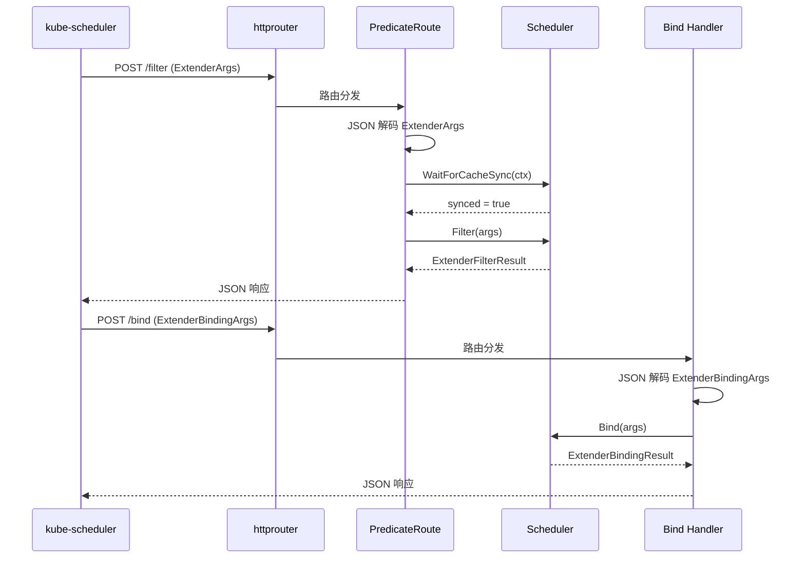
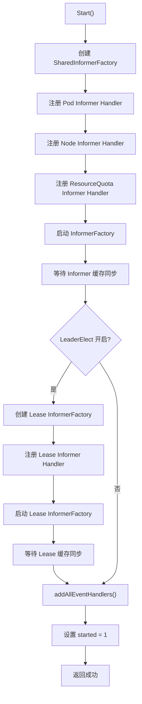
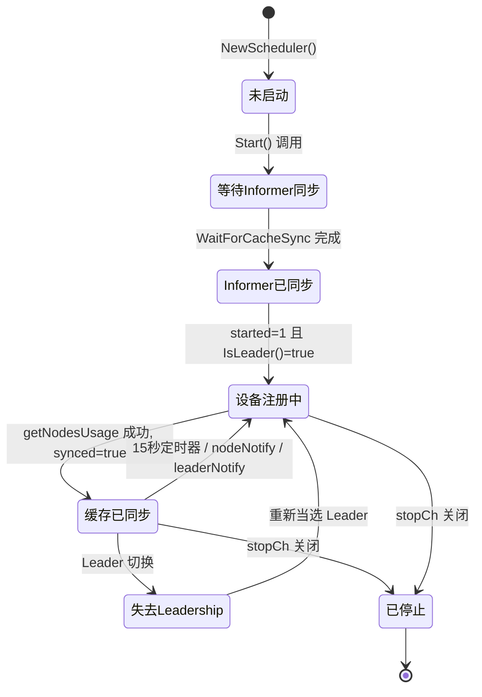
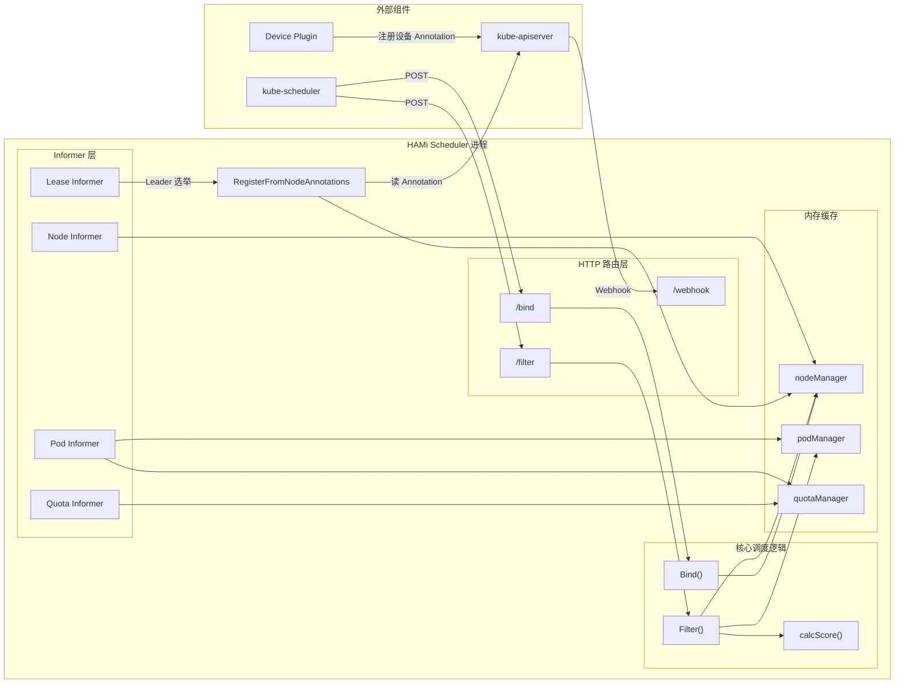

## 1. Kubernetes Scheduler Extender 机制

HAMi 调度器基于 Kubernetes **Scheduler Extender** 机制实现。Scheduler Extender 是 kube-scheduler 原生提供的扩展点，允许外部服务通过 HTTP 接口参与调度决策，而无需修改 kube-scheduler 源码。

### 1.1 Extender 工作原理

kube-scheduler 在执行调度流程时，会在 Filter（过滤）和 Bind（绑定）阶段向配置的 Extender 发送 HTTP POST 请求。Extender 返回过滤结果或执行绑定操作后，kube-scheduler 据此做出最终决策。

```
┌─────────────────┐       HTTP POST /filter       ┌─────────────────┐
│                 │  ──────────────────────────►  │                 │
│  kube-scheduler │                               │  HAMi Scheduler │
│                 │  ◄──────────────────────────  │   (Extender)    │
│                 │     ExtenderFilterResult       │                 │
│                 │                               │                 │
│                 │       HTTP POST /bind          │                 │
│                 │  ──────────────────────────►  │                 │
│                 │  ◄──────────────────────────  │                 │
│                 │    ExtenderBindingResult       │                 │
└─────────────────┘                               └─────────────────┘
```

### 1.2 HAMi Scheduler 的定位

HAMi Scheduler 是一个**单一二进制**程序，同时承担三种角色：

| 角色 | 端点 | 说明 |
|------|------|------|
| Scheduler Extender | `/filter`, `/bind` | 参与 kube-scheduler 的过滤和绑定决策 |
| Admission Webhook | `/webhook` | 拦截 Pod 创建请求，注入调度器名称和资源变换 |
| 健康检查服务 | `/healthz`, `/readyz` | 提供存活和就绪探针 |

---

## 2. 入口点与 HTTP 路由

### 2.1 入口点

调度器的入口点位于 `cmd/scheduler/main.go`。程序使用 cobra 框架构建 CLI，通过 `start()` 函数完成全部初始化和 HTTP 服务启动。

核心启动序列如下：

```go
// cmd/scheduler/main.go - start() 函数
func start() error {
    nodelock.NodeLockTimeout = config.NodeLockTimeout  // 设置节点锁超时
    client.InitGlobalClient(...)                        // 初始化 K8s 客户端
    config.InitDevices()                                // 注册设备插件
    sher = scheduler.NewScheduler()                     // 创建调度器实例
    go sher.RegisterFromNodeAnnotations()               // 启动设备注册循环（goroutine）
    sher.Start()                                        // 启动 Informer 缓存同步
    go initMetrics(config.MetricsBindAddress)            // 启动 Prometheus 指标服务
    // 注册 HTTP 路由并启动 HTTP 服务
    router.POST("/filter", routes.PredicateRoute(sher))
    router.POST("/bind", routes.Bind(sher))
    router.POST("/webhook", routes.WebHookRoute())
    router.GET("/healthz", routes.HealthzRoute())
    router.GET("/readyz", routes.ReadyzRoute(sher))
    http.ListenAndServe(config.HTTPBind, router)
}
```

### 2.2 HTTP 路由表

路由定义位于 `pkg/scheduler/routes/route.go`，使用 `julienschmidt/httprouter` 库：

| 方法 | 路径 | 处理函数 | 说明 |
|------|------|----------|------|
| POST | `/filter` | `PredicateRoute(s)` | 接收 kube-scheduler 的 Filter 请求，执行设备过滤和评分 |
| POST | `/bind` | `Bind(s)` | 接收 kube-scheduler 的 Bind 请求，执行节点锁定和 Pod 绑定 |
| POST | `/webhook` | `WebHookRoute()` | Admission Webhook，拦截 Pod 创建并注入调度器名称 |
| GET | `/healthz` | `HealthzRoute()` | 存活探针，直接返回 200 |
| GET | `/readyz` | `ReadyzRoute(s)` | 就绪探针，检查当前实例是否为 Leader |

### 2.3 请求处理流程



> **关键细节**：`PredicateRoute` 在调用 `Filter()` 之前，会先调用 `WaitForCacheSync(ctx)` 阻塞等待缓存同步完成。如果 context 被取消（例如 kube-scheduler 超时），则直接返回 500 错误。这保证了调度决策基于最新的集群状态。

---

## 3. Scheduler 结构体详解

`Scheduler` 结构体定义于 `pkg/scheduler/scheduler.go`，是整个调度器的核心数据结构：

```go
type Scheduler struct {
    *nodeManager                           // 嵌入节点管理器，维护节点及其设备信息
    podManager    *device.PodManager       // Pod 管理器，追踪已分配设备的 Pod
    quotaManager  *device.QuotaManager     // 配额管理器，管理 ResourceQuota 中的设备配额
    leaderManager leaderelection.LeaderManager // Leader 选举管理器

    stopCh       chan struct{}             // 停止信号通道
    nodeNotify   chan struct{}             // 节点变更通知通道（带缓冲，容量 1）
    leaderNotify chan struct{}             // Leader 选举通知通道（带缓冲，容量 1）

    kubeClient  kubernetes.Interface       // Kubernetes API 客户端
    podLister   listerscorev1.PodLister    // Pod Informer Lister
    nodeLister  listerscorev1.NodeLister   // Node Informer Lister
    quotaLister listerscorev1.ResourceQuotaLister // ResourceQuota Informer Lister
    leaseLister coordinationv1.LeaseLister // Lease Informer Lister（Leader 选举用）

    cachedstatus   map[string]*NodeUsage   // Filter 请求中返回的节点状态缓存
    overviewstatus map[string]*NodeUsage   // 全局节点状态概览（用于指标监控）
    eventRecorder  record.EventRecorder    // Kubernetes Event 记录器
    started        uint32                  // 原子标志位，0=未启动，1=已启动

    lock   sync.RWMutex                   // 读写锁，保护 synced 状态
    synced bool                           // 缓存是否已同步完成
}
```

各字段功能说明：

| 字段 | 类型 | 功能 |
|------|------|------|
| `nodeManager` | 嵌入 | 维护节点到设备信息的映射表 (`map[string]*NodeInfo`)，提供 `addNode`、`rmNode`、`GetNode`、`ListNodes` 等方法 |
| `podManager` | `*device.PodManager` | 追踪哪些 Pod 在哪些节点上使用了哪些设备，用于计算设备使用量 |
| `quotaManager` | `*device.QuotaManager` | 管理 ResourceQuota 对设备资源的配额限制 |
| `leaderManager` | `LeaderManager` | 基于 Lease 对象的 Leader 选举，确保高可用部署时只有一个活跃调度实例 |
| `cachedstatus` | `map[string]*NodeUsage` | 记录 Filter 阶段筛选的候选节点及其设备使用状态 |
| `overviewstatus` | `map[string]*NodeUsage` | 记录所有节点的设备使用状态全景视图，供 Prometheus 指标读取 |
| `synced` | `bool` | 标识设备注册和节点使用量计算是否已完成。`WaitForCacheSync` 会轮询此值 |

---

## 4. Informer 缓存体系

### 4.1 Informer 注册

调度器使用 Kubernetes `SharedInformerFactory` 监听集群资源变化，在 `Start()` 方法中注册了三组 Informer：

```go
func (s *Scheduler) Start() error {
    informerFactory := informers.NewSharedInformerFactoryWithOptions(s.kubeClient, defaultResync)

    // Pod Informer - 追踪 Pod 的设备分配状态
    informerFactory.Core().V1().Pods().Informer().AddEventHandler(cache.ResourceEventHandlerFuncs{
        AddFunc:    s.onAddPod,
        UpdateFunc: s.onUpdatePod,
        DeleteFunc: s.onDelPod,
    })

    // Node Informer - 感知节点增删
    informerFactory.Core().V1().Nodes().Informer().AddEventHandler(cache.ResourceEventHandlerFuncs{
        AddFunc:    func(_ any) { s.doNodeNotify() },
        DeleteFunc: s.onDelNode,
    })

    // ResourceQuota Informer - 追踪配额变化
    informerFactory.Core().V1().ResourceQuotas().Informer().AddEventHandler(cache.ResourceEventHandlerFuncs{
        AddFunc:    s.onAddQuota,
        UpdateFunc: s.onUpdateQuota,
        DeleteFunc: s.onDelQuota,
    })

    informerFactory.Start(s.stopCh)
    informerFactory.WaitForCacheSync(s.stopCh)
    // ...
}
```

### 4.2 事件处理逻辑

**Pod 事件处理 (`onAddPod` / `onUpdatePod` / `onDelPod`)**：

当检测到带有 `hami.io/assigned-node` 注解的 Pod 时，调度器将其设备分配信息解码并记录到 `podManager` 中。如果 Pod 进入终止状态（Succeeded/Failed），则从 `podManager` 和 `quotaManager` 中移除对应记录。

**Node 事件处理**：

- **添加节点**：发送通知到 `nodeNotify` 通道，触发 `RegisterFromNodeAnnotations` 重新扫描。
- **删除节点**：调用 `nodelockutil.CleanupNodeLock(nodeName)` 清理内存中的节点锁，调用 `rmNode` 移除设备信息，调用 `cleanupNodeUsage` 清理指标数据。

**ResourceQuota 事件处理**：

直接代理到 `quotaManager`，维护命名空间级别的设备配额限制。

---

## 5. Start() 初始化序列



> **注意**：`started` 标志位使用 `atomic.StoreUint32` 原子操作设置，确保在 `RegisterFromNodeAnnotations` goroutine 中的可见性。只有 `started == 1` 时，设备注册循环才会执行实际的注册逻辑。

---

## 6. RegisterFromNodeAnnotations - 设备注册循环

`RegisterFromNodeAnnotations()` 是一个独立的 goroutine，负责周期性地从节点的 Annotation 中读取设备信息并注册到调度器的内存缓存中。

### 6.1 触发机制

该方法通过三种信号源触发执行：

```go
func (s *Scheduler) RegisterFromNodeAnnotations() {
    ticker := time.NewTicker(time.Second * 15)
    for {
        select {
        case <-s.nodeNotify:    // 节点增删事件触发
        case <-s.leaderNotify:  // Leader 选举变更触发
        case <-ticker.C:        // 每 15 秒定时触发
        case <-s.stopCh:        // 停止信号
            return
        }
        if atomic.LoadUint32(&s.started) == 0 {
            continue  // Informer 未就绪，跳过
        }
        s.register(labelSelector, printedLog)
    }
}
```

### 6.2 注册流程

`register()` 方法执行以下步骤：

1. **Leader 检查**：只有 Leader 实例才执行注册（`s.leaderManager.IsLeader()`）
2. **节点遍历**：使用 `nodeLister.List(labelSelector)` 获取匹配的节点列表
3. **设备发现**：对每个节点，遍历所有已注册的设备类型（NVIDIA、Ascend 等），调用 `devInstance.GetNodeDevices(*val)` 从节点 Annotation 中解码设备信息
4. **健康检查**：调用 `devInstance.CheckHealth(devhandsk, val)` 检查设备健康状态。如果设备不健康，执行 `NodeCleanUp` 清理
5. **更新缓存**：调用 `s.addNode(val.Name, nodeInfo)` 更新内存中的节点设备映射
6. **使用量计算**：调用 `s.getNodesUsage(&nodeNames, nil)` 计算全局设备使用量
7. **标记同步完成**：设置 `s.synced = true`，此时 `WaitForCacheSync` 的轮询将返回

### 6.3 注册状态机



---

## 7. Leader 选举机制

### 7.1 设计目标

在多副本部署场景下，HAMi 调度器需要确保只有一个实例执行设备注册和调度决策，避免竞态条件导致的设备分配冲突。

### 7.2 实现方式

Leader 选举基于 Kubernetes **Lease 对象**实现，代码位于 `pkg/util/leaderelection/leaderelection.go`。

核心逻辑：

1. **Lease 监听**：通过 `LeaseInformer` 监听指定命名空间和名称的 Lease 对象变更
2. **身份判断**：检查 Lease 的 `HolderIdentity` 是否以当前 hostname 为前缀
3. **有效性校验**：检查 `observedTime + LeaseDurationSeconds` 是否大于当前时间
4. **回调通知**：
   - `OnStartedLeading`：当选 Leader 时，向 `leaderNotify` 通道发送信号，触发设备注册
   - `OnStoppedLeading`：失去 Leadership 时，设置 `synced = false`，阻塞后续 Filter 请求

```go
func (m *leaderManager) IsLeader() bool {
    m.leaseLock.RLock()
    defer m.leaseLock.RUnlock()
    return m.isHolderOf(m.observedLease) && m.isLeaseValid(time.Now())
}
```

### 7.3 就绪探针集成

`/readyz` 端点通过 `s.GetLeaderManager().IsLeader()` 判断当前实例是否为 Leader。Kubernetes 的 Service 只会将流量路由到就绪的 Pod，这确保了 kube-scheduler 的 Extender 请求只会发送到 Leader 实例：

```go
func ReadyzRoute(s *scheduler.Scheduler) httprouter.Handle {
    return func(w http.ResponseWriter, r *http.Request, p httprouter.Params) {
        if !s.GetLeaderManager().IsLeader() {
            w.WriteHeader(http.StatusServiceUnavailable) // 503
            return
        }
        w.WriteHeader(http.StatusOK) // 200
    }
}
```

### 7.4 DummyLeaderManager

当 `--leader-elect=false`（默认）时，使用 `DummyLeaderManager`，其 `IsLeader()` 始终返回 `true`，不会阻塞任何操作。这确保了单副本部署的向后兼容性。

---

## 8. Webhook 子系统

Admission Webhook 处理位于 `pkg/scheduler/webhook.go`，在 Pod 创建时拦截请求并执行以下操作：

1. **解码 Pod**：从 AdmissionReview 中解码 Pod 对象
2. **调度器名称检查**：如果 Pod 已指定非默认的调度器名称，且与 HAMi 配置不匹配，则直接放行
3. **设备资源变换**：遍历 Pod 的每个容器，调用各设备类型的 `MutateAdmission(c, pod)` 方法，将用户定义的设备资源请求转换为内部格式
4. **注入调度器名称**：如果检测到设备资源请求，将 `pod.spec.schedulerName` 设置为配置的调度器名称
5. **配额检查**：调用 `fitResourceQuota(pod)` 检查设备配额是否充足
6. **返回 Patch**：将修改后的 Pod 对象序列化，返回 JSON Patch 响应

---

## 9. 配置参数一览

以下是调度器启动时支持的核心命令行参数（定义于 `cmd/scheduler/main.go`）：

| 参数 | 默认值 | 说明 |
|------|--------|------|
| `--http_bind` | `127.0.0.1:8080` | HTTP 服务监听地址 |
| `--scheduler-name` | `""` | 注入到 Pod 的调度器名称 |
| `--default-mem` | `0` | 默认 GPU 显存分配量（MB） |
| `--default-cores` | `0` | 默认 GPU 算力百分比 |
| `--default-gpu` | `1` | 默认 GPU 数量 |
| `--node-scheduler-policy` | `binpack` | 节点级调度策略（binpack/spread） |
| `--gpu-scheduler-policy` | `spread` | GPU 级调度策略（binpack/spread/topology） |
| `--node-lock-timeout` | `5m` | 节点锁超时时间 |
| `--leader-elect` | `false` | 是否启用 Leader 选举 |
| `--metrics-bind-address` | `:9395` | Prometheus 指标服务地址 |

---

## 10. 数据流全景



---

## 参考源码文件

| 文件路径 | 说明 |
|----------|------|
| `cmd/scheduler/main.go` | 程序入口，CLI 定义，HTTP 路由注册 |
| `pkg/scheduler/scheduler.go` | Scheduler 结构体，Start()，Filter()，Bind()，RegisterFromNodeAnnotations() |
| `pkg/scheduler/routes/route.go` | HTTP 路由处理函数 |
| `pkg/scheduler/webhook.go` | Admission Webhook 处理逻辑 |
| `pkg/util/leaderelection/leaderelection.go` | Leader 选举实现 |
