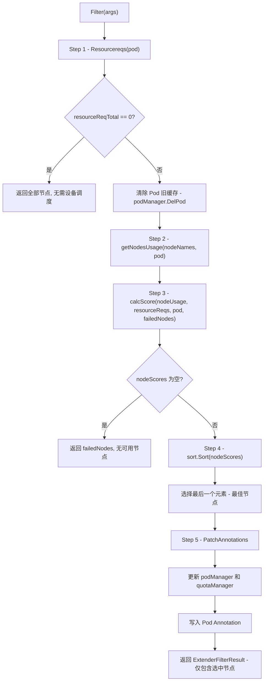
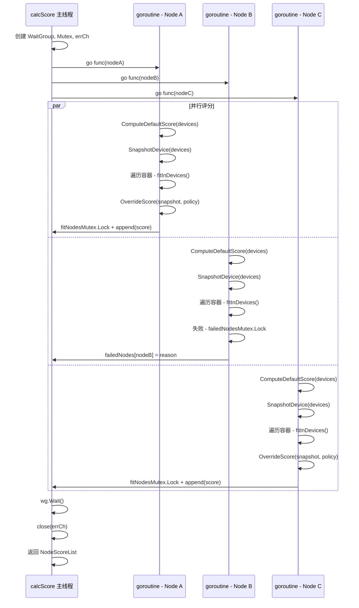

## 1. 概述

`Filter()` 方法是 HAMi 调度器的核心调度入口，位于 `pkg/scheduler/scheduler.go` 第 644-716 行。当 kube-scheduler 需要为一个请求了设备资源的 Pod 选择节点时，会通过 HTTP POST 请求调用此方法。

`Filter()` 方法不仅执行节点过滤（判断哪些节点能满足 Pod 的设备需求），还同时完成评分（选出最佳节点）和设备分配（将具体设备写入 Pod Annotation）。这种设计将传统 Kubernetes 调度框架的 Filter、Score、Reserve 三个阶段合并为一次调用，避免了 Extender 架构下多次 HTTP 往返的开销。

---

## 2. Filter 算法全流程



---

## 3. 分步详解

### Step 1 - Resourcereqs() - 解析设备请求

```go
// pkg/scheduler/scheduler.go:646
resourceReqs := device.Resourcereqs(args.Pod)
```

`Resourcereqs()` 遍历 Pod 的每个容器，调用各设备类型（NVIDIA、Ascend 等）的 `GenerateResourceRequests(ctr)` 方法，将容器的 Resource Requests/Limits 转换为内部的 `ContainerDeviceRequest` 结构体。

返回值类型为 `PodDeviceRequests`，即 `[]ContainerDeviceRequests`，按容器索引组织：

```
PodDeviceRequests = [
    ContainerDeviceRequests[           // 容器 0 的设备请求
        {Type: "NVIDIA", Nums: 2, Memreq: 4096, Coresreq: 50},
    ],
    ContainerDeviceRequests[           // 容器 1 的设备请求
        {Type: "NVIDIA", Nums: 1, Memreq: 2048, Coresreq: 30},
    ],
]
```

以 NVIDIA 设备为例，`GenerateResourceRequests` 的转换规则（`pkg/device/nvidia/device.go`）：

| Pod Resource | 内部字段 | 说明 |
|-------------|----------|------|
| `nvidia.com/gpu` | `Nums` | GPU 数量 |
| `nvidia.com/gpumem` | `Memreq` | 显存需求（MB），支持 MemoryFactor 倍数 |
| `nvidia.com/gpumem-percentage` | `MemPercentagereq` | 显存百分比需求，101 表示未设置 |
| `nvidia.com/gpucores` | `Coresreq` | 算力核心百分比 |

**特殊逻辑**：如果 `MemPercentagereq == 101`（未设置百分比）且 `Memreq == 0`（未设置绝对值），则：
- 如果 `config.DefaultMemory != 0`，使用默认显存值
- 否则设置 `MemPercentagereq = 100`（使用整卡显存）

**空请求快速返回**：如果所有容器的设备请求数量总和为 0，直接返回所有候选节点，不执行后续过滤逻辑。

### Step 2 - getNodesUsage() - 构建节点使用量视图

```go
// pkg/scheduler/scheduler.go:664
nodeUsage, failedNodes, err := s.getNodesUsage(args.NodeNames, args.Pod)
```

`getNodesUsage()` 是一个关键的数据准备方法（第 448-551 行），它构建所有节点的设备使用量快照：

#### 2.1 初始化设备使用量

```go
for _, node := range allNodes {
    nodeInfo := &NodeUsage{}
    nodeInfo.Devices = policy.DeviceUsageList{
        Policy:      userGPUPolicy,   // 用户或全局 GPU 调度策略
        DeviceLists: make([]*policy.DeviceListsScore, 0),
    }
    for _, d := range node.Devices {
        nodeInfo.Devices.DeviceLists = append(..., &policy.DeviceListsScore{
            Score: 0,
            Device: &device.DeviceUsage{
                ID: d.ID, Index: d.Index,
                Used: 0, Count: d.Count,           // 时间片：已用/总计
                Usedmem: 0, Totalmem: d.Devmem,     // 显存：已用/总计
                Usedcores: 0, Totalcore: d.Devcore,  // 算力：已用/总计
                // ... 其他字段
            },
        })
    }
    overallnodeMap[node.ID] = nodeInfo
}
```

所有设备的 `Used`、`Usedmem`、`Usedcores` 初始化为 0。

#### 2.2 累加 Pod 使用量

遍历 `podManager` 中记录的所有已分配设备的 Pod，将其使用量累加到对应设备上：

```go
podsInfo := s.podManager.ListPodsInfo()
for _, p := range podsInfo {
    node := overallnodeMap[p.NodeID]
    for _, udevice := range ctrdevs {
        for _, d := range node.Devices.DeviceLists {
            if d.Device.ID == deviceID {
                d.Device.Used++
                d.Device.Usedmem += udevice.Usedmem
                d.Device.Usedcores += udevice.Usedcores
            }
        }
    }
}
```

#### 2.3 筛选候选节点

将 kube-scheduler 传入的候选节点名称（`args.NodeNames`）与内存中已注册的节点取交集：

```go
for _, nodeID := range *nodes {
    node, err := s.GetNode(nodeID)
    if err != nil {
        failedNodes[nodeID] = "node unregistered" // 节点未注册设备
        continue
    }
    cachenodeMap[node.ID] = overallnodeMap[node.ID]
}
```

未在 HAMi 中注册设备的节点被标记为 `failedNodes`。

#### 2.4 副作用

`getNodesUsage` 会更新两个全局状态：
- `s.overviewstatus = overallnodeMap`：全量节点使用状态，供 Prometheus 指标使用
- `s.cachedstatus = cachenodeMap`：本次 Filter 的候选节点使用状态

### Step 3 - calcScore() - 并行评分

```go
// pkg/scheduler/scheduler.go:673
nodeScores, err := s.calcScore(nodeUsage, resourceReqs, args.Pod, failedNodes)
```

`calcScore()` 位于 `pkg/scheduler/score.go` 第 105-206 行，为每个候选节点启动一个 goroutine 并行执行评分和设备适配：



每个 goroutine 内部的执行步骤：

1. **ComputeDefaultScore**：基于节点当前设备使用量计算节点基准分数
2. **SnapshotDevice**：保存设备状态快照，用于后续 OverrideScore 对比
3. **遍历容器请求**：对 Pod 的每个容器调用 `fitInDevices()`，尝试在节点上为该容器分配设备
4. **OverrideScore**：调用各设备类型的 `ScoreNode()` 方法，允许设备插件覆盖或调整节点分数
5. **结果收集**：通过 mutex 保护的切片收集所有通过适配的节点及其分数

**线程安全设计**：
- `fitNodesMutex`：保护 `res.NodeList` 的并发追加
- `failedNodesMutex`：保护 `failedNodes` 和 `failureReason` 的并发写入
- `errCh`：带缓冲的 error channel，容量等于节点数，用于收集错误

### Step 4 - 排序与选择最佳节点

```go
// pkg/scheduler/scheduler.go:688-689
sort.Sort(nodeScores)
m := (*nodeScores).NodeList[len((*nodeScores).NodeList)-1]
```

`NodeScoreList` 实现了 `sort.Interface`，排序规则取决于 `NodeSchedulerPolicy`：

| 策略 | Less(i, j) 返回 | 排序结果 | 取最后一个元素 |
|------|-----------------|----------|---------------|
| **Binpack**（默认） | `Score[i] < Score[j]` | 升序排列 | **分数最高（最满）的节点** |
| **Spread** | `Score[i] > Score[j]` | 降序排列 | **分数最低（最空）的节点** |

> **设计意图**：始终取数组的最后一个元素。Binpack 策略下，升序排列后最后一个是分数最高（使用率最高）的节点，实现"装箱"效果；Spread 策略下，降序排列后最后一个是分数最低（使用率最低）的节点，实现"均衡"效果。

### Step 5 - PatchAnnotations - 写入分配结果

```go
// pkg/scheduler/scheduler.go:695-711
annotations := make(map[string]string)
annotations[util.AssignedNodeAnnotations] = m.NodeID           // "hami.io/assigned-node"
annotations[util.AssignedTimeAnnotations] = strconv.FormatInt(time.Now().Unix(), 10)

for _, val := range device.GetDevices() {
    val.PatchAnnotations(args.Pod, &annotations, m.Devices)    // 各设备类型写入分配详情
}

s.podManager.AddPod(args.Pod, m.NodeID, m.Devices)            // 更新内存缓存
s.quotaManager.AddUsage(args.Pod, m.Devices)                   // 更新配额使用量
err = util.PatchPodAnnotations(args.Pod, annotations)          // 通过 API 写入 Pod Annotation
```

以 NVIDIA 设备为例，`PatchAnnotations` 会将设备分配编码后写入两个 Annotation：
- `hami.io/vgpu-devices-to-allocate`：待分配的设备列表
- `hami.io/vgpu-devices-allocated`：已分配的设备列表

---

## 4. Annotation 协议详解

HAMi 调度器通过 Pod Annotation 在 Filter、Bind、Device Plugin 之间传递设备分配信息。这是一个精心设计的通信协议。

### 4.1 核心 Annotation 列表

| Annotation Key | 写入阶段 | 说明 |
|---------------|----------|------|
| `hami.io/assigned-node` | Filter | 被选中的目标节点名称 |
| `hami.io/assigned-time` | Filter | 分配时间戳（Unix 秒） |
| `hami.io/vgpu-devices-to-allocate` | Filter | NVIDIA 设备分配详情（编码字符串） |
| `hami.io/vgpu-devices-allocated` | Filter | NVIDIA 设备分配详情（同上） |
| `hami.io/bind-phase` | Bind | 绑定阶段状态："allocating" / "bindingSuccess" / "bindingFailed" |
| `hami.io/bindtime` | Bind | 绑定时间戳 |
| `hami.io/mutex.lock` | Bind | 节点级分布式锁 |

### 4.2 设备分配编码格式

设备分配信息以编码字符串的形式存储在 Annotation 中，格式如下：

```
GPU-UUID-1,DeviceIndex,Usedmem,Usedcores,DeviceType:GPU-UUID-2,...
```

多个容器的分配以 `:` 分隔，同一容器内多个设备以特定分隔符分隔。

---

## 5. 错误处理与事件记录

Filter 方法在关键路径上记录 Kubernetes Event，便于用户通过 `kubectl describe pod` 排查调度问题：

| 场景 | Event Reason | 说明 |
|------|-------------|------|
| Pod 无设备请求 | `FilteringFailed` | "does not request any resource" |
| getNodesUsage 失败 | `FilteringFailed` | 内部错误 |
| calcScore 失败 | `FilteringFailed` | 评分阶段异常 |
| 无可用节点 | `FilteringFailed` | "no available node, N nodes do not meet" |
| PatchAnnotations 失败 | `FilteringFailed` | API 调用失败 |
| 调度成功 | `FilteringSucceed` | "find fit node(nodeX), N nodes not fit, M nodes fit(scores)" |

**失败原因聚合**：当所有节点都不满足条件时，`calcScore` 会按失败原因类型聚合节点列表，并为每种原因类型记录一个 Event。例如：

```
3 nodes CardInsufficientMemory(node-a,node-b,node-c)
2 nodes CardTimeSlicingExhausted(node-d,node-e)
```

---

## 6. 调度缓存一致性

### 6.1 Pod 缓存清除

```go
// pkg/scheduler/scheduler.go:663
s.podManager.DelPod(args.Pod)
```

在 Filter 开始时，调度器会先从 `podManager` 中删除当前 Pod 的旧记录。这是因为同一个 Pod 可能由于之前的调度失败（如 Bind 阶段失败）而残留旧的分配记录。删除后重新计算，确保 `getNodesUsage` 的使用量不包含此 Pod 的历史分配。

### 6.2 分配后立即更新缓存

```go
// pkg/scheduler/scheduler.go:703-704
if s.podManager.AddPod(args.Pod, m.NodeID, m.Devices) {
    s.quotaManager.AddUsage(args.Pod, m.Devices)
}
```

设备分配决策确定后，立即更新 `podManager` 和 `quotaManager`，这样后续 Pod 的 Filter 请求能看到最新的使用量。即使 Bind 阶段尚未完成，此 Pod 的设备已被"预留"，避免并发调度时的资源超分。

### 6.3 失败回滚

```go
// pkg/scheduler/scheduler.go:708-709
if err != nil {
    s.podManager.DelPod(args.Pod) // 写 Annotation 失败，回滚缓存
    return nil, err
}
```

如果 `PatchPodAnnotations` 失败，立即从缓存中删除此 Pod 的分配记录，释放预留的设备资源。

---

## 参考源码文件

| 文件路径 | 关键行号 | 说明 |
|----------|----------|------|
| `pkg/scheduler/scheduler.go` | 644-716 | `Filter()` 方法 |
| `pkg/scheduler/scheduler.go` | 448-551 | `getNodesUsage()` 方法 |
| `pkg/scheduler/score.go` | 105-206 | `calcScore()` 方法 |
| `pkg/scheduler/score.go` | 52-103 | `fitInDevices()` 函数 |
| `pkg/device/nvidia/device.go` | 517-583 | `GenerateResourceRequests()` |
| `pkg/device/nvidia/device.go` | 505-515 | `PatchAnnotations()` |
