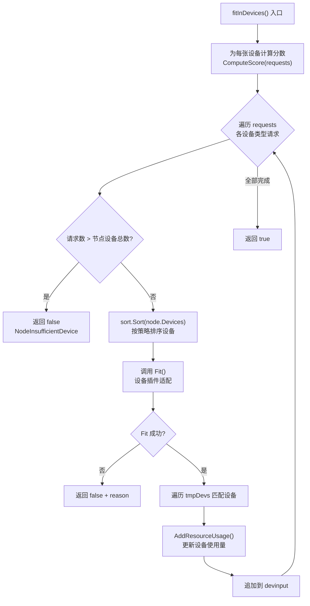
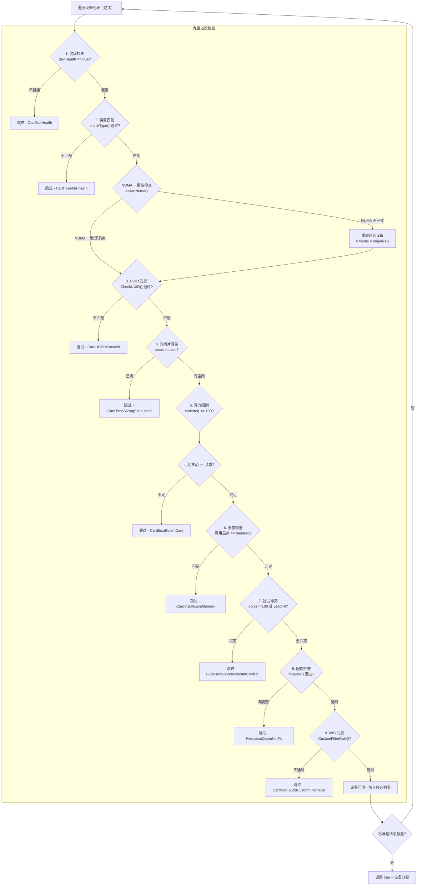
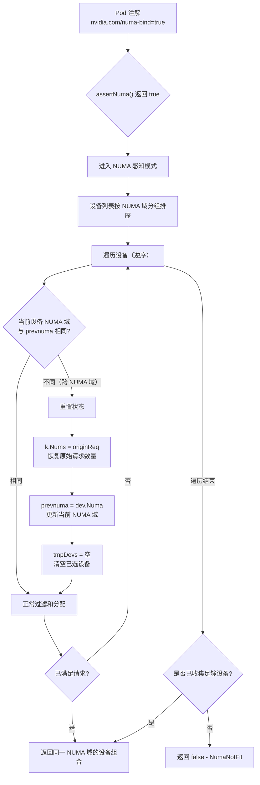
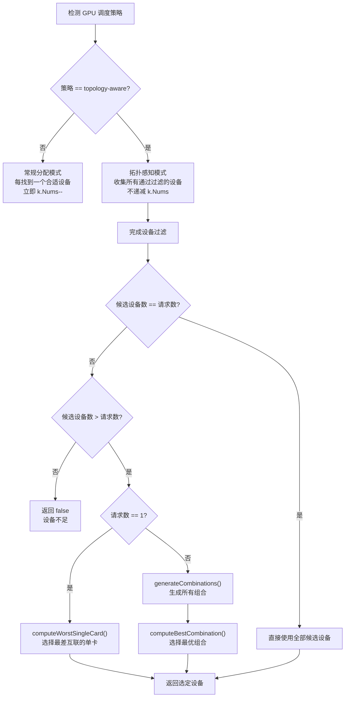
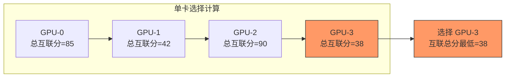
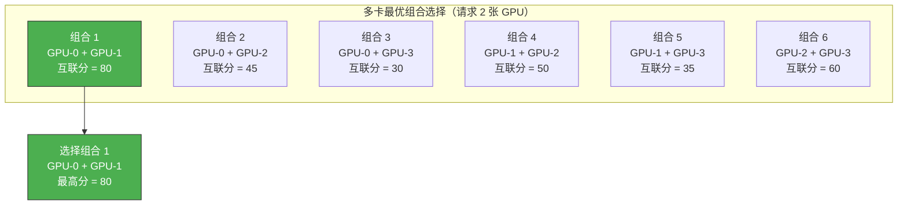
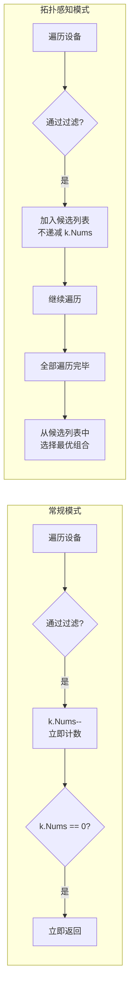
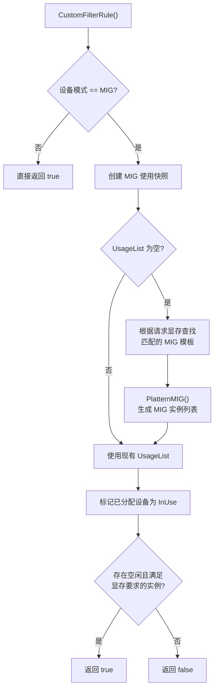
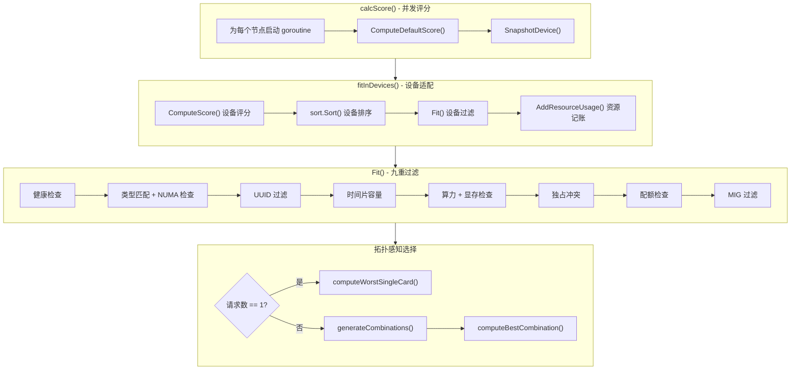

## 1. 概述

在 HAMi 调度器的 Filter 阶段，当评分完成后，核心任务是：**为 Pod 中每个容器的设备请求找到合适的 GPU 卡**。这一过程由 `fitInDevices()` 函数协调，它调用各设备插件的 `Fit()` 方法来执行具体的适配逻辑。

本文将深入分析以下内容：
- `fitInDevices()` 函数的协调流程
- NVIDIA `Fit()` 方法的九重过滤检查
- NUMA 感知分配策略
- 拓扑感知分配策略

---

## 2. fitInDevices() 函数解析

### 2.1 函数签名与职责

代码位于 `pkg/scheduler/score.go` 第 52-103 行：

```go
func fitInDevices(
    node *NodeUsage,
    requests device.ContainerDeviceRequests,
    pod *corev1.Pod,
    nodeInfo *device.NodeInfo,
    devinput *device.PodDevices,
) (bool, string)
```

**核心职责**：在一个节点上，为单个容器的所有设备请求寻找可用的设备组合。

### 2.2 执行流程



### 2.3 关键步骤详解

#### 步骤一 - 设备评分

```go
for index := range node.Devices.DeviceLists {
    node.Devices.DeviceLists[index].ComputeScore(requests)
}
```

在进入分配循环之前，先为节点上的**每张设备**计算一个综合分数。该分数基于三个维度加权：
- **使用率得分** = `(request + used) / count`
- **核心得分** = `(coresreq + usedcores) / totalcore`
- **显存得分** = `(memreq + usedmem) / totalmem`

最终分数 = `Weight * (usedScore + coreScore + memScore)`，其中 `Weight = 10`。

#### 步骤二 - 设备排序

```go
sort.Sort(node.Devices)
```

排序策略取决于 GPU 调度策略：

| 策略 | 排序行为 | 效果 |
|------|---------|------|
| `binpack` | 分数低的在前（升序） | 优先填满已用设备 |
| `spread` | 分数高的在前（降序） | 优先使用空闲设备 |

排序时同时考虑 NUMA 域，确保同一 NUMA 域的设备相邻。

#### 步骤三 - 调用设备插件 Fit()

```go
fit, tmpDevs, reason := device.GetDevices()[k.Type].Fit(
    getNodeResources(*node, k.Type), k, pod, nodeInfo, devinput,
)
```

`getNodeResources()` 从节点设备列表中按类型筛选出对应设备，然后交由设备插件的 `Fit()` 方法执行具体过滤。

#### 步骤四 - 资源记账

适配成功后，遍历 `tmpDevs` 中的每个设备，调用 `AddResourceUsage()` 更新设备的使用量，并将结果追加到 `devinput`。

---

## 3. NVIDIA Fit() 实现 - 九重过滤

### 3.1 函数签名

代码位于 `pkg/device/nvidia/device.go` 第 730-866 行：

```go
func (nv *NvidiaGPUDevices) Fit(
    devices []*device.DeviceUsage,
    request device.ContainerDeviceRequest,
    pod *corev1.Pod,
    nodeInfo *device.NodeInfo,
    allocated *device.PodDevices,
) (bool, map[string]device.ContainerDevices, string)
```

### 3.2 九重过滤决策树

`Fit()` 方法从排序后的设备列表**逆序**遍历（`for i := len(devices) - 1; i >= 0; i--`），每张设备必须通过九重检查，任何一重失败都会跳过该设备。



### 3.3 各检查层详解

#### 第一层 - 健康检查

```go
if !dev.Health {
    reason[common.CardNotHealth]++
    continue
}
```

最基础的检查。设备的健康状态由 `CheckHealth()` 方法在节点注册阶段周期性更新，通过比较 Node 上报告的 `Allocatable` GPU 数量与之前记录的数量来判断。

#### 第二层 - 类型匹配

```go
found, numa := nv.checkType(pod.GetAnnotations(), *dev, k)
```

`checkType()` 执行以下检查：
1. **GPU 型号匹配** - 通过 `nvidia.com/use-gputype` 和 `nvidia.com/nouse-gputype` 注解控制
2. **分配模式匹配** - 通过 `nvidia.com/vgpu-mode` 注解指定（支持 `mig`、`hami-core`、`mps`）
3. **设备类型匹配** - 请求类型必须为 `NVIDIA`

#### 第三层 - UUID 过滤

```go
if !device.CheckUUID(pod.GetAnnotations(), dev.ID, GPUUseUUID, GPUNoUseUUID, nv.CommonWord()) {
    continue
}
```

通过 Pod 注解精确控制使用哪些 GPU 卡：
- `nvidia.com/use-gpuuuid` - 指定允许使用的 GPU UUID 列表
- `nvidia.com/nouse-gpuuuid` - 指定排除的 GPU UUID 列表

#### 第四层 - 时间片容量

```go
if dev.Count <= dev.Used {
    continue
}
```

每张 GPU 支持的最大并发任务数（`Count`，由 `DeviceSplitCount` 配置）。当已使用数达到上限时拒绝分配。

#### 第五层 - 算力限制

```go
if k.Coresreq > 100 {
    k.Coresreq = 100 // 自动修正
}
if dev.Totalcore - dev.Usedcores < k.Coresreq {
    continue
}
```

算力以百分比表示（0-100），检查剩余可用算力是否满足请求。

#### 第六层 - 显存容量

```go
if dev.Totalmem - dev.Usedmem < memreq {
    continue
}
```

显存请求支持两种形式：绝对值（MB）或百分比。百分比按 `dev.Totalmem * percentage / 100` 换算。

#### 第七层 - 独占冲突

```go
if dev.Totalcore == 100 && k.Coresreq == 100 && dev.Used > 0 {
    continue
}
```

当请求 `coresreq=100`（即申请整卡）时，如果该卡已有其他任务使用，则产生独占冲突。同时也检查反向情况：不允许将 `cores=0` 的任务分配到核心已满的 GPU 上。

#### 第八层 - 配额检查

```go
if !fitQuota(tmpDevs, allocated, pod.Namespace, int64(memreq), int64(k.Coresreq)) {
    continue
}
```

基于命名空间的资源配额检查，确保当前分配不会超出命名空间的 GPU 资源配额限制。

#### 第九层 - MIG 过滤

```go
if !nv.CustomFilterRule(allocated, request, tmpDevs[k.Type], dev) {
    continue
}
```

当设备处于 MIG 模式时，检查 MIG 分区模板中是否有满足请求显存大小的可用实例。非 MIG 模式下始终返回 `true`。

---

## 4. NUMA 感知分配

### 4.1 assertNuma() 函数

代码位于 `pkg/device/nvidia/device.go` 第 482-491 行：

```go
func assertNuma(annos map[string]string) bool {
    numabind, ok := annos[NumaBind] // "nvidia.com/numa-bind"
    if ok {
        enforce, err := strconv.ParseBool(numabind)
        if err == nil && enforce {
            return true
        }
    }
    return false
}
```

当 Pod 设置 `nvidia.com/numa-bind: "true"` 注解时，启用 NUMA 绑定约束。

### 4.2 NUMA 分配流程



### 4.3 核心逻辑

NUMA 感知的核心设计思想是：**当跨越 NUMA 域边界时，丢弃之前收集的所有设备，从新的 NUMA 域重新开始**。

```go
if numa && prevnuma != dev.Numa {
    if k.Nums != originReq {
        reason[common.NumaNotFit] += len(tmpDevs)
    }
    k.Nums = originReq       // 恢复原始请求数量
    prevnuma = dev.Numa       // 切换到新 NUMA 域
    tmpDevs = make(map[string]device.ContainerDevices{}) // 清空候选设备
}
```

由于设备列表在排序时已经按 NUMA 域分组（排序策略中 `Numa` 字段参与比较），逆序遍历保证了同一 NUMA 域的设备被连续处理。如果某个 NUMA 域内的设备不足以满足请求，算法会自动尝试下一个 NUMA 域。

### 4.4 排序策略与 NUMA 的关系

在 `gpu_policy.go` 的 `Less()` 方法中，NUMA 域是排序的首要维度：

| 策略 | NUMA 排序 | 同 NUMA 内排序 |
|------|----------|---------------|
| `binpack` | NUMA ID 降序 | 分数升序（优先填满） |
| `spread` | NUMA ID 升序 | 分数降序（优先分散） |

---

## 5. 拓扑感知分配

### 5.1 概述

拓扑感知调度策略通过 Pod 注解 `hami.io/gpu-scheduler-policy: "topology-aware"` 激活，旨在为多 GPU 请求选择**物理互联质量最优**的设备组合。

### 5.2 DevicePairScore 数据结构

```go
type DevicePairScore struct {
    ID     string         `json:"uuid,omitempty"`
    Scores map[string]int `json:"score,omitempty"` // key: 对端设备UUID, value: 互联分数
}
```

每个设备都持有与其他所有设备的成对互联分数。该分数由设备插件在节点注册时通过 `hami.io/node-nvidia-score` 注解上报，反映了 GPU 之间的物理拓扑关系（如 NVLink、PCIe Switch、跨 Socket 等）。

### 5.3 拓扑感知分配流程



### 5.4 单卡请求 - computeWorstSingleCard()

当只请求 1 张 GPU 时，策略是**选择与其他卡互联关系最差的卡**。这样做的目的是将互联良好的卡留给后续的多卡任务。

```go
func computeWorstSingleCard(
    nodeInfo *device.NodeInfo,
    request device.ContainerDeviceRequest,
    tmpDevs map[string]device.ContainerDevices,
) device.ContainerDevices
```

**算法步骤**：
1. 构建设备对分数映射表 `getDevicePairScoreMap()`
2. 对每张候选设备，累加它与所有其他候选设备的互联分数作为总分
3. 选择**总分最低**的设备



### 5.5 多卡请求 - generateCombinations() + computeBestCombination()

当请求多张 GPU 时，策略是**选择互联质量最优的设备组合**。

#### generateCombinations() - 组合生成

对 N 张候选设备请求 K 张的场景，使用递归回溯算法生成 C(N,K) 个不重复子集。

**示例**：4 张候选 GPU 请求 2 张，生成 C(4,2) = 6 个组合：

```
[GPU-0, GPU-1], [GPU-0, GPU-2], [GPU-0, GPU-3],
[GPU-1, GPU-2], [GPU-1, GPU-3], [GPU-2, GPU-3]
```

#### computeBestCombination() - 最优组合选择

```go
func computeBestCombination(
    nodeInfo *device.NodeInfo,
    combinations []device.ContainerDevices,
) device.ContainerDevices
```

**算法步骤**：
1. 遍历所有组合
2. 对每个组合，计算其中所有设备对的互联分数之和
3. 选择**总分最高**的组合



### 5.6 拓扑感知与常规模式的关键差异



---

## 6. MIG 模式适配

### 6.1 CustomFilterRule 在 MIG 模式下的行为

当设备处于 MIG 模式时，`CustomFilterRule()` 执行以下逻辑：



### 6.2 MIG 模式下的资源记账

`AddResourceUsage()` 在 MIG 模式下有特殊处理：
- 首次分配时，根据请求显存大小选择合适的 MIG 模板并初始化实例列表
- 后续分配时，在现有实例列表中查找空闲的匹配实例
- UUID 会附加 MIG 实例索引信息，格式为 `UUID[templateIdx-instanceIdx]`

---

## 7. 完整流程总览



---

## 8. 关键配置参考

| 注解/配置 | 作用 | 影响阶段 |
|-----------|------|---------|
| `nvidia.com/use-gputype` | 指定允许使用的 GPU 型号 | 类型匹配 |
| `nvidia.com/nouse-gputype` | 排除的 GPU 型号 | 类型匹配 |
| `nvidia.com/use-gpuuuid` | 指定允许使用的 GPU UUID | UUID 过滤 |
| `nvidia.com/nouse-gpuuuid` | 排除的 GPU UUID | UUID 过滤 |
| `nvidia.com/numa-bind` | 启用 NUMA 绑定约束 | NUMA 感知分配 |
| `nvidia.com/vgpu-mode` | 设备模式（mig/hami-core/mps） | 类型匹配 |
| `hami.io/gpu-scheduler-policy` | GPU 调度策略（binpack/spread/topology-aware） | 排序与拓扑选择 |
| `DeviceSplitCount` | 每张 GPU 最大并发任务数 | 时间片容量 |

---

## 9. 源码索引

| 函数/方法 | 文件位置 | 行号 |
|-----------|---------|------|
| `fitInDevices()` | `pkg/scheduler/score.go` | 52-103 |
| `calcScore()` | `pkg/scheduler/score.go` | 105-206 |
| `Fit()` | `pkg/device/nvidia/device.go` | 730-866 |
| `checkType()` | `pkg/device/nvidia/device.go` | 493-503 |
| `assertNuma()` | `pkg/device/nvidia/device.go` | 482-491 |
| `checkGPUtype()` | `pkg/device/nvidia/device.go` | 461-480 |
| `fitQuota()` | `pkg/device/nvidia/device.go` | 709-728 |
| `CustomFilterRule()` | `pkg/device/nvidia/device.go` | 585-639 |
| `computeWorstSingleCard()` | `pkg/device/nvidia/device.go` | 916-938 |
| `computeBestCombination()` | `pkg/device/nvidia/device.go` | 940-963 |
| `generateCombinations()` | `pkg/device/nvidia/device.go` | 876-904 |
| `ComputeScore()` | `pkg/scheduler/policy/gpu_policy.go` | 59-78 |
| `Less()` | `pkg/scheduler/policy/gpu_policy.go` | 45-57 |
