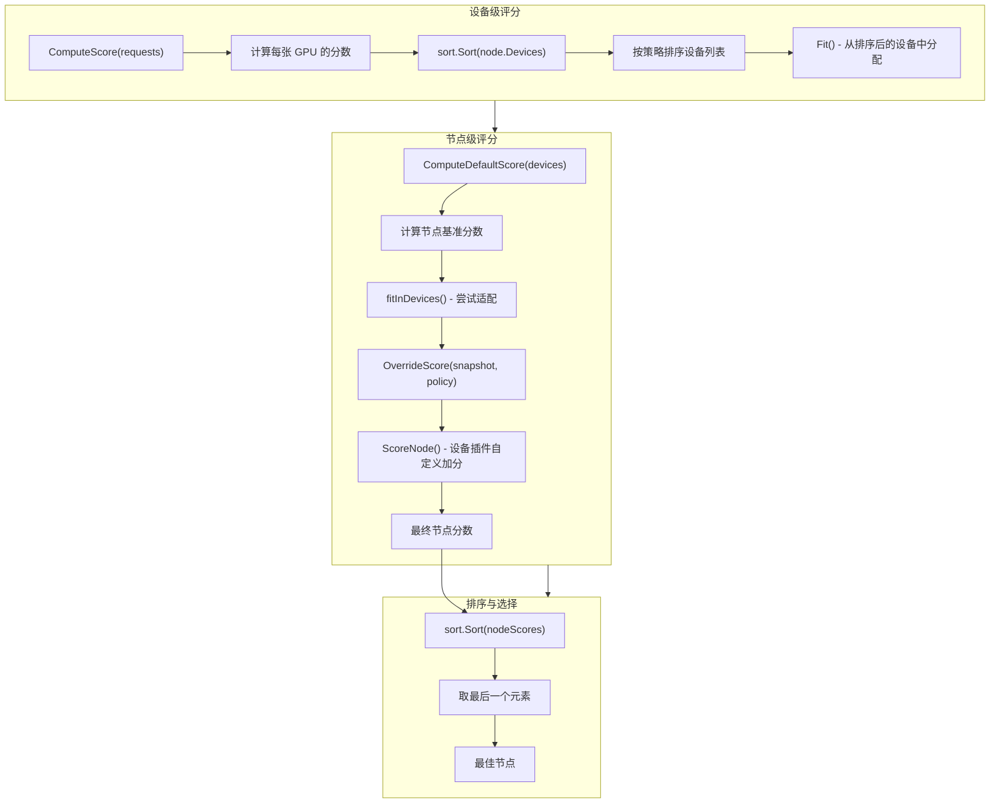
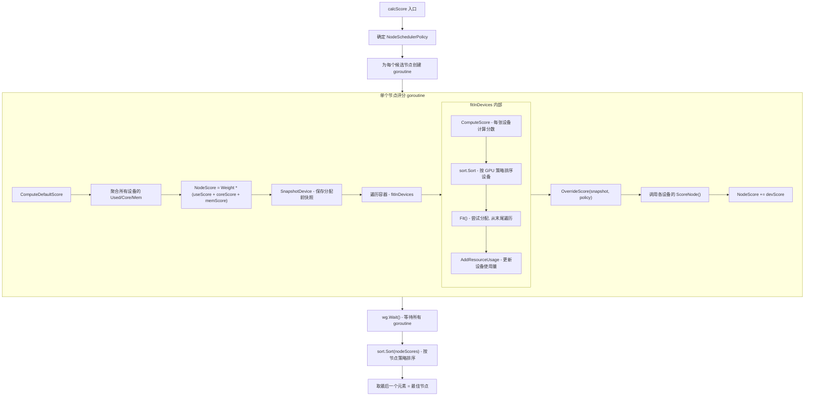

## 1. 概述

HAMi 调度器采用**两级评分体系**：设备级评分（Device-Level Scoring）和节点级评分（Node-Level Scoring）。两级评分共同决定了 Pod 最终被调度到哪个节点的哪些设备上。

评分体系的设计目标：
- **设备级评分**：决定节点内部的设备排序，影响优先使用哪些 GPU 卡
- **节点级评分**：决定节点之间的排序，影响优先调度到哪个节点

---

## 2. 评分流水线



---

## 3. 设备级评分

### 3.1 ComputeScore - 设备分数计算

代码位于 `pkg/scheduler/policy/gpu_policy.go` 第 59-78 行：

```go
func (ds *DeviceListsScore) ComputeScore(requests device.ContainerDeviceRequests) {
    request, core, mem := int32(0), int32(0), int32(0)
    for _, container := range requests {
        request += container.Nums
        core += container.Coresreq
        if container.MemPercentagereq != 0 && container.MemPercentagereq != 101 {
            mem += ds.Device.Totalmem * (container.MemPercentagereq / 100.0)
            continue
        }
        mem += container.Memreq
    }

    usedScore := float32(request+ds.Device.Used) / float32(ds.Device.Count)
    coreScore := float32(core+ds.Device.Usedcores) / float32(ds.Device.Totalcore)
    memScore  := float32(mem+ds.Device.Usedmem) / float32(ds.Device.Totalmem)
    ds.Score  = float32(util.Weight) * (usedScore + coreScore + memScore)
}
```

### 3.2 设备分数公式

设备分数由三个维度组成，每个维度计算"如果将当前请求分配到此设备后"的使用率：

```
DeviceScore = Weight * (UsedScore + CoreScore + MemScore)
```

其中：

| 维度 | 公式 | 说明 |
|------|------|------|
| **UsedScore** | `(request + Device.Used) / Device.Count` | 时间片使用率，即设备上运行的任务数占最大切分数的比例 |
| **CoreScore** | `(coresreq + Device.Usedcores) / Device.Totalcore` | 算力核心使用率 |
| **MemScore** | `(memreq + Device.Usedmem) / Device.Totalmem` | 显存使用率 |
| **Weight** | `util.Weight = 10`（固定值） | 权重因子，用于放大分数差异 |

> **关键细节**：分数计算的是"假设分配后"的使用率，而非当前使用率。这意味着分数反映了分配完成后的预期状态，使得排序更准确。

### 3.3 数值示例

假设一张 GPU 的规格和当前状态如下：

| 参数 | 值 |
|------|-----|
| Device.Count（最大切分数） | 10 |
| Device.Used（已使用切分） | 3 |
| Device.Totalcore（总算力） | 100 |
| Device.Usedcores（已用算力） | 40 |
| Device.Totalmem（总显存 MB） | 16384 |
| Device.Usedmem（已用显存 MB） | 6144 |

Pod 请求：`Nums=1, Coresreq=20, Memreq=4096`

```
UsedScore = (1 + 3) / 10     = 0.4
CoreScore = (20 + 40) / 100  = 0.6
MemScore  = (4096 + 6144) / 16384 = 0.625

DeviceScore = 10 * (0.4 + 0.6 + 0.625) = 16.25
```

---

## 4. 设备排序策略

设备排序决定了 `Fit()` 函数遍历设备的顺序，直接影响分配结果。排序逻辑位于 `pkg/scheduler/policy/gpu_policy.go` 第 45-57 行。

### 4.1 排序规则

`DeviceUsageList` 实现了 `sort.Interface`，`Less(i, j)` 的返回值决定排序方向：

```go
func (l DeviceUsageList) Less(i, j int) bool {
    if l.Policy == "binpack" {
        if l.DeviceLists[i].Device.Numa == l.DeviceLists[j].Device.Numa {
            return l.DeviceLists[i].Score < l.DeviceLists[j].Score  // 同 NUMA: 升序
        }
        return l.DeviceLists[i].Device.Numa > l.DeviceLists[j].Device.Numa  // 跨 NUMA: 降序
    }
    // spread (默认)
    if l.DeviceLists[i].Device.Numa == l.DeviceLists[j].Device.Numa {
        return l.DeviceLists[i].Score > l.DeviceLists[j].Score  // 同 NUMA: 降序
    }
    return l.DeviceLists[i].Device.Numa < l.DeviceLists[j].Device.Numa  // 跨 NUMA: 升序
}
```

### 4.2 Binpack 策略排序

目标：**将任务集中到已有负载的设备上**，使得空闲设备可以整合用于大任务。

| 条件 | 排序规则 | 效果 |
|------|---------|------|
| 同 NUMA 域 | 分数升序（低分在前） | 高分设备排在数组末尾 |
| 跨 NUMA 域 | NUMA 编号降序 | 高编号 NUMA 排在前面 |

由于 `Fit()` 从数组末尾（`len(devices)-1`）向前遍历，Binpack 下优先尝试的是**同 NUMA 域内分数最高（最满）的设备**。

### 4.3 Spread 策略排序

目标：**将任务分散到不同设备上**，实现负载均衡，降低单卡故障影响。

| 条件 | 排序规则 | 效果 |
|------|---------|------|
| 同 NUMA 域 | 分数降序（高分在前） | 低分设备排在数组末尾 |
| 跨 NUMA 域 | NUMA 编号升序 | 低编号 NUMA 排在前面 |

Spread 下，`Fit()` 从末尾遍历时优先尝试的是**同 NUMA 域内分数最低（最空）的设备**。

### 4.4 NUMA 感知排序图示

以一台有两个 NUMA 节点（0 和 1）、4 张 GPU 的服务器为例：

```
GPU-A (NUMA=0, Score=5)
GPU-B (NUMA=0, Score=15)
GPU-C (NUMA=1, Score=8)
GPU-D (NUMA=1, Score=20)
```

**Binpack 排序结果**（先按 NUMA 降序，同 NUMA 内分数升序）：
```
排序后: [GPU-C(1,8), GPU-D(1,20), GPU-A(0,5), GPU-B(0,15)]
                                                    ↑
                                        Fit() 从这里开始 (index=3)
遍历顺序: GPU-B → GPU-A → GPU-D → GPU-C
优先分配: NUMA=0 的高分设备
```

**Spread 排序结果**（先按 NUMA 升序，同 NUMA 内分数降序）：
```
排序后: [GPU-B(0,15), GPU-A(0,5), GPU-D(1,20), GPU-C(1,8)]
                                                    ↑
                                        Fit() 从这里开始 (index=3)
遍历顺序: GPU-C → GPU-D → GPU-A → GPU-B
优先分配: NUMA=1 的低分设备
```

---

## 5. 节点级评分

### 5.1 ComputeDefaultScore - 节点基准分数

代码位于 `pkg/scheduler/policy/node_policy.go` 第 75-95 行：

```go
func (ns *NodeScore) ComputeDefaultScore(devices DeviceUsageList) {
    used, usedCore, usedMem := int32(0), int32(0), int32(0)
    for _, device := range devices.DeviceLists {
        used += device.Device.Used
        usedCore += device.Device.Usedcores
        usedMem += device.Device.Usedmem
    }

    total, totalCore, totalMem := int32(0), int32(0), int32(0)
    for _, deviceLists := range devices.DeviceLists {
        total += deviceLists.Device.Count
        totalCore += deviceLists.Device.Totalcore
        totalMem += deviceLists.Device.Totalmem
    }

    useScore := float32(used) / float32(total)
    coreScore := float32(usedCore) / float32(totalCore)
    memScore := float32(usedMem) / float32(totalMem)
    ns.Score = float32(util.Weight) * (useScore + coreScore + memScore)
}
```

### 5.2 节点分数公式

```
NodeScore = Weight * (UseScore + CoreScore + MemScore)
```

| 维度 | 公式 | 说明 |
|------|------|------|
| **UseScore** | `sum(Device.Used) / sum(Device.Count)` | 节点所有设备的时间片使用率 |
| **CoreScore** | `sum(Device.Usedcores) / sum(Device.Totalcore)` | 节点所有设备的算力使用率 |
| **MemScore** | `sum(Device.Usedmem) / sum(Device.Totalmem)` | 节点所有设备的显存使用率 |

> **与设备级评分的区别**：
> - 设备级评分计算的是**单张设备**分配后的预期使用率
> - 节点级评分计算的是**整个节点所有设备**的当前使用率（在分配前计算）

### 5.3 OverrideScore - 设备插件自定义评分

代码位于 `pkg/scheduler/policy/node_policy.go` 第 56-64 行：

```go
func (ns *NodeScore) OverrideScore(previous []*device.DeviceUsage, policy string) {
    devScore := float32(0)
    for idx, val := range ns.Devices {
        devScore += device.GetDevices()[idx].ScoreNode(ns.Node, val, previous, policy)
    }
    ns.Score += devScore
}
```

`OverrideScore` 在 `fitInDevices()` 成功后调用，它传入设备分配前的快照（`previous`）和分配后的设备状态（`ns.Devices`），允许各设备插件根据分配结果调整节点分数。

例如，设备插件可以：
- 根据 NUMA 亲和性加分或减分
- 根据拓扑关系调整分数
- 根据设备健康状态调整权重

> **当前 NVIDIA 实现**：`ScoreNode()` 返回 0，不做额外调整。但此接口为未来的自定义评分策略保留了扩展能力。

---

## 6. 节点排序策略

节点排序逻辑位于 `pkg/scheduler/policy/node_policy.go` 第 48-54 行：

```go
func (l NodeScoreList) Less(i, j int) bool {
    if l.Policy == "spread" {
        return l.NodeList[i].Score > l.NodeList[j].Score  // 降序
    }
    // 默认 binpack
    return l.NodeList[i].Score < l.NodeList[j].Score      // 升序
}
```

由于 Filter 方法始终**取排序后数组的最后一个元素**（`nodeScores.NodeList[len-1]`）：

| 策略 | 排序方向 | 最后一个元素 | 调度效果 |
|------|---------|-------------|---------|
| **Binpack**（默认） | 升序 | 分数最高的节点 | 选择使用率最高的节点，集中负载 |
| **Spread** | 降序 | 分数最低的节点 | 选择使用率最低的节点，分散负载 |

### 6.1 Binpack 与 Spread 对比示例

假设集群有 3 个节点，每个节点有 4 张 GPU：

| 节点 | GPU 使用量 | 算力使用率 | 显存使用率 | NodeScore |
|------|-----------|-----------|-----------|-----------|
| Node-A | 1/4 | 25% | 20% | 10*(0.25+0.25+0.20) = 7.0 |
| Node-B | 3/4 | 70% | 65% | 10*(0.75+0.70+0.65) = 21.0 |
| Node-C | 0/4 | 0% | 0% | 10*(0.00+0.00+0.00) = 0.0 |

**Binpack 排序**（升序）：
```
[Node-C(0.0), Node-A(7.0), Node-B(21.0)]
                                    ↑
                                取最后一个 → Node-B（最满的节点）
```

**Spread 排序**（降序）：
```
[Node-B(21.0), Node-A(7.0), Node-C(0.0)]
                                    ↑
                                取最后一个 → Node-C（最空的节点）
```

---

## 7. 评分策略覆盖

### 7.1 节点级策略覆盖

节点调度策略可以通过 Pod Annotation 覆盖全局配置：

```go
// pkg/scheduler/score.go:106-111
userNodePolicy := config.NodeSchedulerPolicy
if task.GetAnnotations() != nil {
    if value, ok := task.GetAnnotations()[util.NodeSchedulerPolicyAnnotationKey]; ok {
        userNodePolicy = value
    }
}
```

用户可以在 Pod 上设置注解来指定特定的节点调度策略，而不影响其他 Pod。

### 7.2 GPU 级策略覆盖

GPU 调度策略同样支持 Pod 级别覆盖，通过 `util.GetGPUSchedulerPolicyByPod()` 函数实现。该函数检查 Pod Annotation 中是否指定了 GPU 调度策略，优先使用 Pod 级别的策略。

---

## 8. 完整评分计算链路

以下是一次完整调度中评分计算的执行链路：



---

## 9. Weight 常量的作用

`util.Weight` 是一个固定值 `10`，用于放大分数差异。

当使用率差异较小时（例如两个设备的显存使用率分别为 0.31 和 0.32），原始分数差异仅为 0.01，乘以 Weight=10 后变为 0.1，使得排序结果更加稳定，减少浮点数精度导致的排序不确定性。

设备级和节点级评分使用相同的 Weight 值，保证了两级评分的数值量级一致。

---

## 10. 评分与分配的耦合关系

HAMi 的评分系统有一个重要的设计特点：**评分和分配是紧密耦合的**。

在 `fitInDevices()` 中：

1. 先计算所有设备的分数（`ComputeScore`）
2. 按分数排序设备
3. 从排序后的设备列表中尝试分配（`Fit`）
4. 分配成功后，调用 `AddResourceUsage` 更新设备的使用量

步骤 4 意味着一个容器的分配会改变设备的使用量，影响同一 Pod 中后续容器的分配决策。但由于 `ComputeScore` 只在 `fitInDevices` 开头调用一次，后续容器看到的是基于初始使用量计算的分数排序。

这个设计在大多数场景下工作良好，因为同一 Pod 内通常请求相同类型的设备，排序顺序的微小变化不会显著影响分配结果。

---

## 参考源码文件

| 文件路径 | 关键行号 | 说明 |
|----------|----------|------|
| `pkg/scheduler/policy/gpu_policy.go` | 59-78 | `ComputeScore()` - 设备级评分 |
| `pkg/scheduler/policy/gpu_policy.go` | 45-57 | `Less()` - 设备排序规则 |
| `pkg/scheduler/policy/node_policy.go` | 75-95 | `ComputeDefaultScore()` - 节点级评分 |
| `pkg/scheduler/policy/node_policy.go` | 48-54 | `Less()` - 节点排序规则 |
| `pkg/scheduler/policy/node_policy.go` | 56-64 | `OverrideScore()` - 自定义评分覆盖 |
| `pkg/scheduler/score.go` | 52-103 | `fitInDevices()` - 评分与分配协调 |
| `pkg/scheduler/score.go` | 105-206 | `calcScore()` - 并行评分入口 |
