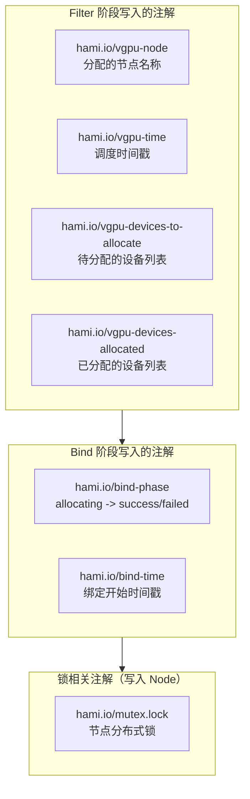
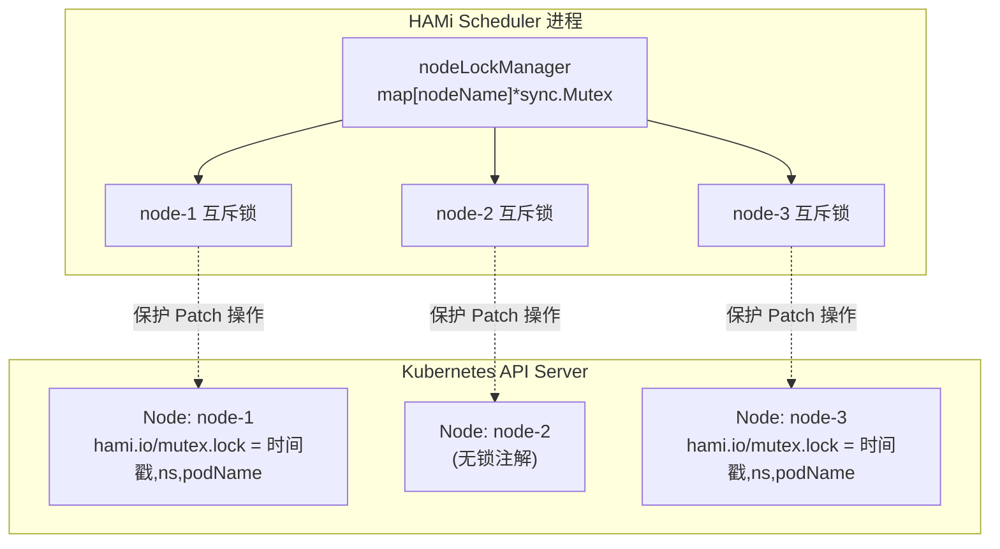
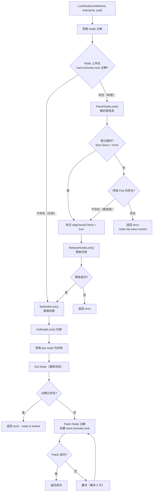
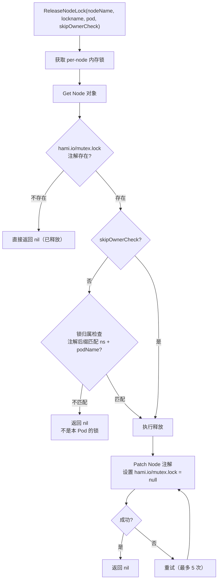
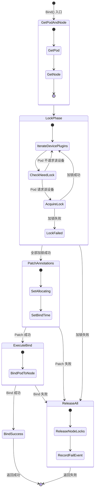
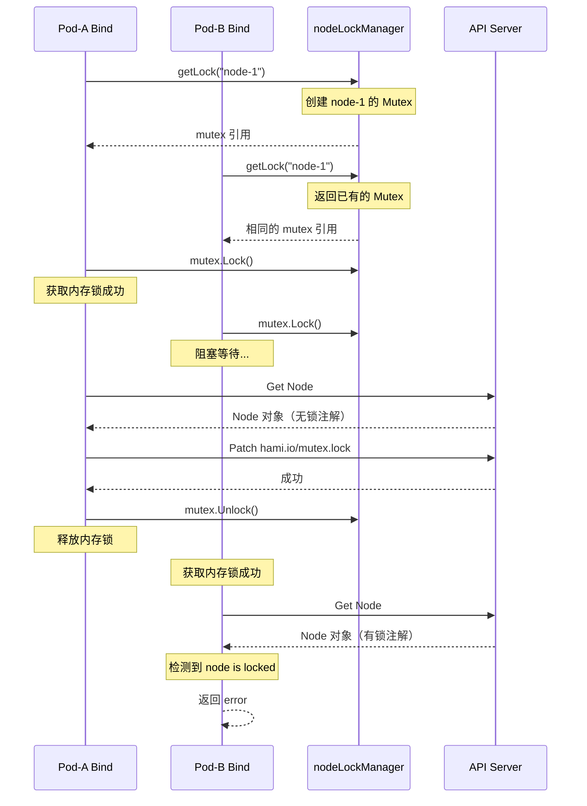

## 1. 概述

在 HAMi 调度器完成 Filter 阶段（节点评分、设备适配）后，Kubernetes 会将选中的节点交由调度器的 **Bind** 阶段完成最终绑定。Bind 阶段是整个调度流程中**唯一涉及状态变更**的阶段，需要处理以下关键问题：

- **并发安全** - 多个 Pod 可能同时绑定到同一节点，必须防止设备分配冲突
- **状态追踪** - 通过注解记录绑定阶段（allocating / success / failed）
- **故障恢复** - 绑定失败时必须释放已获取的锁

HAMi 通过基于 **Kubernetes Node 注解的分布式锁**（`hami.io/mutex.lock`）来解决并发问题，这是整个系统设计中的关键防护机制。

---

## 2. Bind() 方法完整解析

### 2.1 函数签名

代码位于 `pkg/scheduler/scheduler.go` 第 584-642 行：

```go
func (s *Scheduler) Bind(args extenderv1.ExtenderBindingArgs) (*extenderv1.ExtenderBindingResult, error)
```

### 2.2 Bind 流程序列图

```mermaid
sequenceDiagram
    participant KS as Kubernetes Scheduler
    participant SB as Scheduler.Bind()
    participant K8S as Kubernetes API Server
    participant NL as NodeLock
    participant DP as Device Plugins

    KS->>SB: Bind(args)
    SB->>K8S: Get Pod
    K8S-->>SB: Pod 对象

    SB->>K8S: Get Node
    K8S-->>SB: Node 对象

    rect rgb(255, 245, 230)
        Note over SB, DP: 锁定阶段 - 对每种设备类型加锁
        loop 遍历所有设备插件
            SB->>DP: LockNode(node, pod)
            DP->>NL: LockNode(nodeName, lockName, pod)
            NL->>K8S: Patch Node 注解
hami.io/mutex.lock
            K8S-->>NL: 成功/失败
            NL-->>DP: 返回结果
            DP-->>SB: 返回结果
        end
    end

    rect rgb(230, 255, 230)
        Note over SB, K8S: 绑定阶段
        SB->>K8S: PatchPodAnnotations
hami.io/bind-phase=allocating
        K8S-->>SB: 成功
        SB->>K8S: Pod.Bind(node)
        K8S-->>SB: 成功
    end

    SB-->>KS: BindingResult (成功)

    rect rgb(255, 230, 230)
        Note over SB, DP: 异常路径 - 任何步骤失败
        SB->>SB: goto ReleaseNodeLocks
        loop 遍历所有设备插件
            SB->>DP: ReleaseNodeLock(node, pod)
            DP->>NL: ReleaseNodeLock()
            NL->>K8S: 删除 hami.io/mutex.lock 注解
        end
        SB-->>KS: BindingResult (失败 + Error)
    end
```

### 2.3 关键步骤详解

#### 步骤一 - 获取 Pod 和 Node

```go
current, err := s.kubeClient.CoreV1().Pods(args.PodNamespace).Get(
    context.Background(), args.PodName, metav1.GetOptions{})
node, err := s.kubeClient.CoreV1().Nodes().Get(
    context.Background(), args.Node, metav1.GetOptions{})
```

从 API Server 获取最新的 Pod 和 Node 对象，确保操作基于最新状态。

#### 步骤二 - 逐设备类型加锁

```go
for _, val := range device.GetDevices() {
    err = val.LockNode(node, current)
    if err != nil {
        goto ReleaseNodeLocks
    }
}
```

遍历所有已注册的设备插件，为每种设备类型获取节点锁。任何一种设备加锁失败，立即跳转到释放锁的流程。

#### 步骤三 - 标记 Bind 阶段

```go
tmppatch := map[string]string{
    util.DeviceBindPhase:     "allocating",    // hami.io/bind-phase
    util.BindTimeAnnotations: strconv.FormatInt(time.Now().Unix(), 10), // hami.io/bind-time
}
err = util.PatchPodAnnotations(current, tmppatch)
```

在 Pod 注解上标记当前正处于 `allocating` 阶段，同时记录绑定开始时间。

#### 步骤四 - 执行绑定

```go
binding := &corev1.Binding{
    ObjectMeta: metav1.ObjectMeta{Name: args.PodName, UID: args.PodUID},
    Target:     corev1.ObjectReference{Kind: "Node", Name: args.Node},
}
err = s.kubeClient.CoreV1().Pods(args.PodNamespace).Bind(
    context.Background(), binding, metav1.CreateOptions{})
```

调用 Kubernetes API 将 Pod 绑定到目标节点。

#### 步骤五 - 异常释放

```go
ReleaseNodeLocks:
    for _, val := range device.GetDevices() {
        val.ReleaseNodeLock(node, current)
    }
```

使用 Go 的 `goto` 语句实现统一的错误释放路径。无论在加锁、Patch 注解还是 Bind 操作中的哪一步失败，都会跳转到这里释放所有已获取的锁。

---

## 3. Bind 阶段状态机

### 3.1 状态定义

HAMi 使用 `hami.io/bind-phase` 注解追踪绑定阶段的状态：

| 状态 | 常量 | 含义 |
|------|------|------|
| `allocating` | `DeviceBindAllocating` | 正在执行绑定操作 |
| `success` | `DeviceBindSuccess` | 绑定成功完成 |
| `failed` | `DeviceBindFailed` | 绑定失败 |

### 3.2 状态转换图

```mermaid
stateDiagram-v2
    [*] --> allocating : Bind() 设置
hami.io/bind-phase=allocating
    allocating --> success : Pod.Bind() 成功
设备插件确认
    allocating --> failed : 加锁失败 / Patch 失败 / Bind 失败
    failed --> [*] : 释放所有节点锁
记录失败事件
    success --> [*] : Pod 正常运行
```

### 3.3 相关注解

在整个 Filter + Bind 流程中，涉及以下 Pod 注解的变化：



---

## 4. 节点锁机制 - nodelock 包

### 4.1 包结构

代码位于 `pkg/util/nodelock/nodelock.go`：

```
pkg/util/nodelock/
    nodelock.go          # 核心锁实现
    nodelock_test.go     # 单元测试
    test_helpers.go      # 测试辅助函数
```

### 4.2 核心设计

HAMi 的节点锁采用**两级锁**设计：

| 层级 | 类型 | 存储位置 | 作用 |
|------|------|---------|------|
| 内存锁 | `sync.Mutex` | 进程内存 | 保护同一进程内的并发访问 |
| 注解锁 | `hami.io/mutex.lock` | Kubernetes Node 注解 | 跨进程/跨实例的分布式互斥 |



### 4.3 nodeLockManager - 内存级锁管理

```go
type nodeLockManager struct {
    mu    sync.Mutex           // 保护 locks map 的并发访问
    locks map[string]*sync.Mutex // 每个节点一把锁
}
```

**设计要点**：
- 每个节点拥有独立的 `sync.Mutex`，不同节点的加锁操作互不阻塞
- `getLock()` 方法按需创建锁，首次访问某节点时自动初始化
- `deleteLock()` 在节点被删除时清理内存，防止 map 无限增长

### 4.4 锁的值格式

`hami.io/mutex.lock` 注解的值格式为：

```
<RFC3339时间戳>,<Pod命名空间>,<Pod名称>
```

例如：
```
2024-01-15T10:30:00Z,default,my-gpu-pod
```

通过 `GenerateNodeLockKeyByPod()` 生成：

```go
func GenerateNodeLockKeyByPod(pod *corev1.Pod) string {
    return fmt.Sprintf("%s%s%s",
        time.Now().Format(time.RFC3339),
        NodeLockSep,                           // ","
        GeneratePodNamespaceName(pod, NodeLockSep))
}
```

通过 `ParseNodeLock()` 解析：

```go
func ParseNodeLock(value string) (lockTime time.Time, ns, name string, err error)
```

---

## 5. LockNode() 加锁流程

### 5.1 流程图



### 5.2 超时与悬挂锁处理

节点锁有两个安全机制防止**死锁**：

#### 超时机制

```go
var NodeLockTimeout time.Duration = time.Minute * 5
```

默认超时时间为 5 分钟，可通过环境变量 `HAMI_NODELOCK_EXPIRE` 覆盖。当检测到锁已超过超时时间，直接释放旧锁并获取新锁。

#### 悬挂锁检测

```go
if ns != "" && previousPodName != "" && (ns != pods.Namespace || previousPodName != pods.Name) {
    if _, err := client.GetClient().CoreV1().Pods(ns).Get(ctx, previousPodName, metav1.GetOptions{}); err != nil {
        if apierrors.IsNotFound(err) {
            // 持锁 Pod 已不存在，释放悬挂锁
            skipOwnerCheck = true
        }
    }
}
```

当持有锁的 Pod 已被删除（NotFound），说明这是一把悬挂锁，需要强制释放。

### 5.3 重试策略

```go
var DefaultStrategy = wait.Backoff{
    Steps:    5,                    // 最多重试 5 次
    Duration: 100 * time.Millisecond, // 初始间隔 100ms
    Factor:   1.0,                  // 无指数退避
    Jitter:   0.1,                  // 10% 抖动
}
```

Patch 操作使用固定间隔 + 小抖动的重试策略，适用于短暂的 API Server 冲突。

---

## 6. ReleaseNodeLock() 释放流程

### 6.1 流程图



### 6.2 所有权检查

释放锁时默认会检查锁的所有权：

```go
if !skipOwnerCheck && !strings.HasSuffix(lockStr,
    fmt.Sprintf("%s%s", NodeLockSep, GeneratePodNamespaceName(pod, NodeLockSep))) {
    // 锁不属于当前 Pod，跳过释放
    return nil
}
```

只有以下两种情况才跳过所有权检查（`skipOwnerCheck = true`）：
1. 锁已超时
2. 持锁 Pod 已不存在（悬挂锁）

---

## 7. NVIDIA 设备的锁集成

### 7.1 LockNode 实现

```go
func (dev *NvidiaGPUDevices) LockNode(n *corev1.Node, p *corev1.Pod) error {
    found := false
    for _, val := range p.Spec.Containers {
        if (dev.GenerateResourceRequests(&val).Nums) > 0 {
            found = true
            break
        }
    }
    if !found {
        return nil // Pod 不请求 NVIDIA GPU，无需加锁
    }
    return nodelock.LockNode(n.Name, NodeLockNvidia, p)
}
```

**设计要点**：只有当 Pod 实际请求了 NVIDIA GPU 资源时才执行加锁，避免不必要的锁竞争。`NodeLockNvidia` 的值为 `hami.io/mutex.lock`。

### 7.2 ReleaseNodeLock 实现

```go
func (dev *NvidiaGPUDevices) ReleaseNodeLock(n *corev1.Node, p *corev1.Pod) error {
    found := false
    for _, val := range p.Spec.Containers {
        if (dev.GenerateResourceRequests(&val).Nums) > 0 {
            found = true
            break
        }
    }
    if !found {
        return nil
    }
    return nodelock.ReleaseNodeLock(n.Name, NodeLockNvidia, p, false)
}
```

释放时传入 `skipNodeLockOwnerCheck = false`，确保只释放自己持有的锁。

---

## 8. Bind 完整流程状态图



---

## 9. 节点删除时的锁清理

当节点从集群中移除时（例如节点自动缩容），调度器通过 Node delete 事件处理函数清理内存中的锁状态：

```go
func (s *Scheduler) onDelNode(obj any) {
    defer s.doNodeNotify()
    // ... 解析节点名称 ...
    nodelockutil.CleanupNodeLock(nodeName)
    s.rmNode(nodeName)
    s.cleanupNodeUsage(nodeName)
}
```

`CleanupNodeLock()` 调用 `nodeLockManager.deleteLock()`，从内存 map 中移除该节点的锁条目，防止 map 无限增长。

---

## 10. 并发安全分析

### 10.1 场景 - 两个 Pod 同时绑定到同一节点



### 10.2 安全保证

| 场景 | 保护机制 | 结果 |
|------|---------|------|
| 同一进程内并发 | `nodeLockManager` 内存锁 | 串行化访问 |
| 跨调度器实例并发 | `hami.io/mutex.lock` 注解 + `resourceVersion` | API Server 乐观锁冲突 |
| 调度器崩溃导致悬挂锁 | 超时机制（5分钟）+ Pod 存在性检查 | 自动释放 |
| 节点下线 | `onDelNode()` + `CleanupNodeLock()` | 清理内存 |

---

## 11. 源码索引

| 函数/方法 | 文件位置 | 行号 |
|-----------|---------|------|
| `Scheduler.Bind()` | `pkg/scheduler/scheduler.go` | 584-642 |
| `LockNode()` | `pkg/util/nodelock/nodelock.go` | 208-249 |
| `SetNodeLock()` | `pkg/util/nodelock/nodelock.go` | 120-157 |
| `ReleaseNodeLock()` | `pkg/util/nodelock/nodelock.go` | 159-206 |
| `ParseNodeLock()` | `pkg/util/nodelock/nodelock.go` | 251-262 |
| `GenerateNodeLockKeyByPod()` | `pkg/util/nodelock/nodelock.go` | 264-269 |
| `CleanupNodeLock()` | `pkg/util/nodelock/nodelock.go` | 98-100 |
| `NvidiaGPUDevices.LockNode()` | `pkg/device/nvidia/device.go` | 250-262 |
| `NvidiaGPUDevices.ReleaseNodeLock()` | `pkg/device/nvidia/device.go` | 264-276 |
| `onDelNode()` | `pkg/scheduler/scheduler.go` | 197-222 |

---

## 12. 关键配置参考

| 配置项 | 默认值 | 说明 |
|--------|-------|------|
| `HAMI_NODELOCK_EXPIRE` 环境变量 | `5m` | 节点锁超时时间 |
| 重试次数 | 5 | Patch 操作最大重试次数 |
| 重试间隔 | 100ms | 每次重试的基础间隔 |
| 重试抖动 | 10% | 防止重试风暴的随机抖动 |
| `hami.io/mutex.lock` | - | Node 注解上的分布式锁 key |
| `hami.io/bind-phase` | - | Pod 注解上的绑定阶段标记 |
| `hami.io/bind-time` | - | Pod 注解上的绑定时间戳 |
