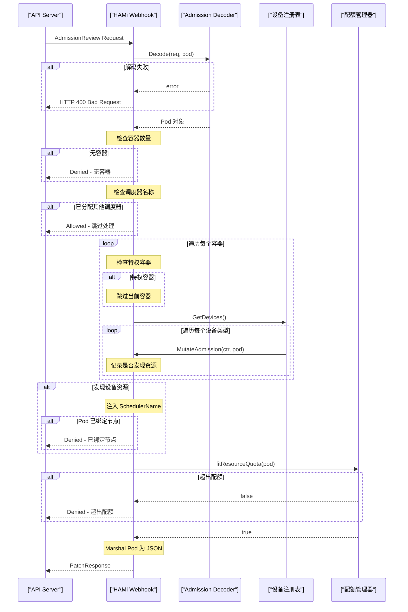
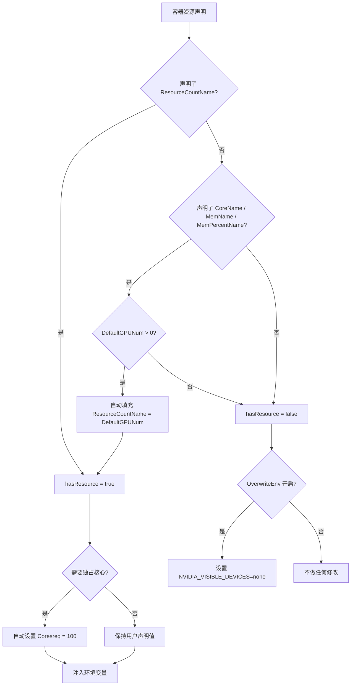
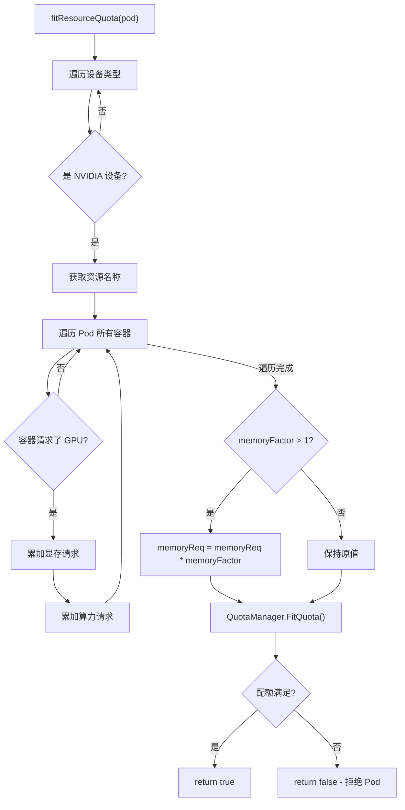

## 概述

HAMi 的 Webhook 准入控制器是整个虚拟化调度链路的入口。它以 Kubernetes MutatingAdmissionWebhook 的形式运行，在 Pod 创建时拦截请求，对包含 GPU/异构设备资源声明的容器进行资源变异（Mutation），注入 HAMi 自定义调度器名称，并执行命名空间级别的资源配额校验。

**源码位置**: `pkg/scheduler/webhook.go`

---

## 1. MutatingWebhookConfiguration 注册

HAMi 通过 Helm Chart 在集群中注册 MutatingWebhookConfiguration。这一配置告诉 Kubernetes API Server，当有 Pod 创建请求时，需要将请求转发至 HAMi Webhook 服务进行处理。

### 1.1 注册机制

Helm Chart 中定义的 MutatingWebhookConfiguration 资源包含以下关键字段：

| 字段 | 说明 |
|------|------|
| `webhooks[].rules` | 匹配 CREATE 操作的 Pod 资源 |
| `webhooks[].clientConfig.service` | 指向 HAMi Scheduler 服务的 HTTPS 端点 |
| `webhooks[].failurePolicy` | 设置为 `Ignore`，避免 Webhook 故障阻塞集群 |
| `webhooks[].sideEffects` | 设置为 `None` |
| `webhooks[].namespaceSelector` | 可配置的命名空间选择器 |

### 1.2 Webhook 初始化

在 `NewWebHook()` 函数中，HAMi 创建了一个基于 `controller-runtime` 的 Webhook 实例：

```go
func NewWebHook() (*admission.Webhook, error) {
    schema := runtime.NewScheme()
    clientgoscheme.AddToScheme(schema)
    decoder := admission.NewDecoder(schema)
    wh := &admission.Webhook{Handler: &webhook{decoder: decoder}}
    return wh, nil
}
```

`webhook` 结构体仅包含一个 `admission.Decoder` 字段，用于将原始 AdmissionReview 请求解码为 Pod 对象。

---

## 2. Handle() 核心处理流程

`Handle()` 方法是整个准入控制的核心入口，它接收 Kubernetes API Server 转发的 AdmissionReview 请求，执行一系列校验和变异操作后，返回 Patch 响应。

### 2.1 完整流程序列图



### 2.2 代码逐行走读

#### 步骤一 - 请求解码

```go
pod := &corev1.Pod{}
err := h.decoder.Decode(req, pod)
if err != nil {
    return admission.Errored(http.StatusBadRequest, err)
}
```

将 AdmissionReview 中的原始对象解码为 `corev1.Pod` 结构。如果解码失败（例如请求体损坏），直接返回 HTTP 400 错误。

#### 步骤二 - 容器存在性检查

```go
if len(pod.Spec.Containers) == 0 {
    return admission.Denied("pod has no containers")
}
```

没有容器的 Pod 被直接拒绝，这是一个基础的安全防护。

#### 步骤三 - 调度器名称检查

```go
if pod.Spec.SchedulerName != "" &&
    (pod.Spec.SchedulerName != corev1.DefaultSchedulerName || !config.ForceOverwriteDefaultScheduler) &&
    (len(config.SchedulerName) == 0 || pod.Spec.SchedulerName != config.SchedulerName) {
    return admission.Allowed("pod already has different scheduler assigned")
}
```

这段逻辑判断 Pod 是否已经被分配了非 HAMi 的调度器：

1. 如果 Pod 没有设置 `schedulerName`，继续处理
2. 如果设置了默认调度器且 `ForceOverwriteDefaultScheduler` 为 true，继续处理
3. 如果设置的调度器名称与 HAMi 调度器一致，继续处理
4. 否则，跳过该 Pod（允许通过但不做任何变异）

#### 步骤四 - 容器迭代与设备变异

```go
hasResource := false
for idx, ctr := range pod.Spec.Containers {
    c := &pod.Spec.Containers[idx]
    // 特权容器检查
    if ctr.SecurityContext != nil {
        if ctr.SecurityContext.Privileged != nil && *ctr.SecurityContext.Privileged {
            continue
        }
    }
    // 遍历所有设备类型
    for _, val := range device.GetDevices() {
        found, err := val.MutateAdmission(c, pod)
        if err != nil {
            return admission.Errored(http.StatusInternalServerError, err)
        }
        hasResource = hasResource || found
    }
}
```

#### 步骤五 - 调度器名称注入

```go
if hasResource {
    if len(config.SchedulerName) > 0 {
        pod.Spec.SchedulerName = config.SchedulerName
    }
    if pod.Spec.NodeName != "" {
        return admission.Denied("pod has node assigned")
    }
}
```

#### 步骤六 - 配额检查与 Patch 返回

```go
if !fitResourceQuota(pod) {
    return admission.Denied("exceeding resource quota")
}
marshaledPod, _ := json.Marshal(pod)
return admission.PatchResponseFromRaw(req.Object.Raw, marshaledPod)
```

---

## 3. 特权容器检查

HAMi 会跳过特权容器（Privileged Container）的设备变异处理。原因如下：

1. **安全隔离**: 特权容器已经可以访问宿主机全部设备，不需要 vGPU 级别的资源控制
2. **兼容性**: 特权容器中的 CUDA 调用不经过 libvgpu.so 拦截层，强制注入资源限制会导致运行异常
3. **系统级工具**: 通常特权容器用于系统管理任务（如设备驱动安装），不应被 HAMi 干预

检查逻辑：

```go
if ctr.SecurityContext != nil {
    if ctr.SecurityContext.Privileged != nil && *ctr.SecurityContext.Privileged {
        continue  // 跳过当前容器，处理下一个
    }
}
```

> 注意：即使 Pod 中有多个容器，特权容器只会被跳过，非特权容器仍然会正常处理。

---

## 4. MutateAdmission 调用机制

`device.GetDevices()` 返回当前注册的所有设备类型（如 NVIDIA、AMD、寒武纪等），每种设备类型都实现了 `Devices` 接口的 `MutateAdmission()` 方法。

以 NVIDIA 为例，`MutateAdmission()` 会执行以下操作：

1. **注入优先级环境变量**: 如果容器声明了 `resourcePriorityName` 资源，将其转换为 `TASK_PRIORITY` 环境变量
2. **注入 GPU Core 策略**: 根据配置注入 `CORE_LIMIT_SWITCH` 环境变量
3. **资源检查与默认值填充**: 通过 `mutateContainerResource()` 检查容器是否声明了 GPU 资源
4. **独占核心默认设置**: 通过 `defaultExclusiveCoreIfNeeded()` 为全卡请求自动设置 `coresreq=100`
5. **RuntimeClassName 设置**: 如果有配置则设置 Pod 的 RuntimeClassName
6. **覆盖环境变量**: 当 `OverwriteEnv` 为 true 时，为未请求 GPU 的容器设置 `NVIDIA_VISIBLE_DEVICES=none`

---

## 5. 资源变异决策树



---

## 6. fitResourceQuota() 深度解析

`fitResourceQuota()` 函数在 Webhook 层面提供了命名空间级别的设备资源配额前置检查。这一检查在 Pod 进入调度队列之前进行，可以提前拒绝超出配额的请求，避免无谓的调度尝试。

### 6.1 实现逻辑

```go
func fitResourceQuota(pod *corev1.Pod) bool {
    for deviceName, dev := range device.GetDevices() {
        // 当前仅支持 NVIDIA 设备
        if deviceName != nvidia.NvidiaGPUDevice {
            continue
        }
        memoryFactor := nvidia.MemoryFactor
        resourceNames := dev.GetResourceNames()
        // ... 累计 Pod 中所有容器的显存和算力请求
        // ... 应用 memoryFactor 校正
        if !device.GetLocalCache().FitQuota(pod.Namespace, memoryReq, memoryFactor, coresReq, deviceName) {
            return false
        }
    }
    return true
}
```

### 6.2 MemoryFactor 机制

`MemoryFactor` 是一个显存单位换算因子，默认值为 1。当设置大于 1 时，Webhook 中的配额检查会将用户声明的显存值乘以该因子后再进行配额比较。

**用途**: 当用户以较小的粒度单位（如 MB）声明显存，但配额以较大的粒度单位（如 GB）定义时，需要通过此因子进行换算。

```go
if memoryFactor > 1 {
    memoryReq = memoryReq * int64(memoryFactor)
}
```

### 6.3 配额检查条件

`fitResourceQuota()` 仅对满足以下条件的容器进行配额累加：

- 容器声明了 `ResourceCountName`（即 GPU 数量）资源
- 且 GPU 数量请求值为 1

这意味着每个容器最多消耗一个 GPU 虚拟设备的配额额度（显存和算力分别累加）。

### 6.4 配额拒绝流程



---

## 7. 关键设计决策总结

| 设计决策 | 理由 |
|----------|------|
| 在 Webhook 而非 Scheduler 中注入调度器名称 | 确保所有包含设备资源的 Pod 都能进入 HAMi 调度队列 |
| 跳过特权容器 | 特权容器直接访问宿主机设备，不需要虚拟化控制 |
| Webhook 层面配额前置检查 | 减少无效调度尝试，提升集群调度效率 |
| 使用 PatchResponseFromRaw | 生成 JSONPatch 而非完整替换，最小化变异范围 |
| 遍历所有设备类型的 MutateAdmission | 统一的多设备支持架构，各设备类型独立处理自己的资源声明 |
