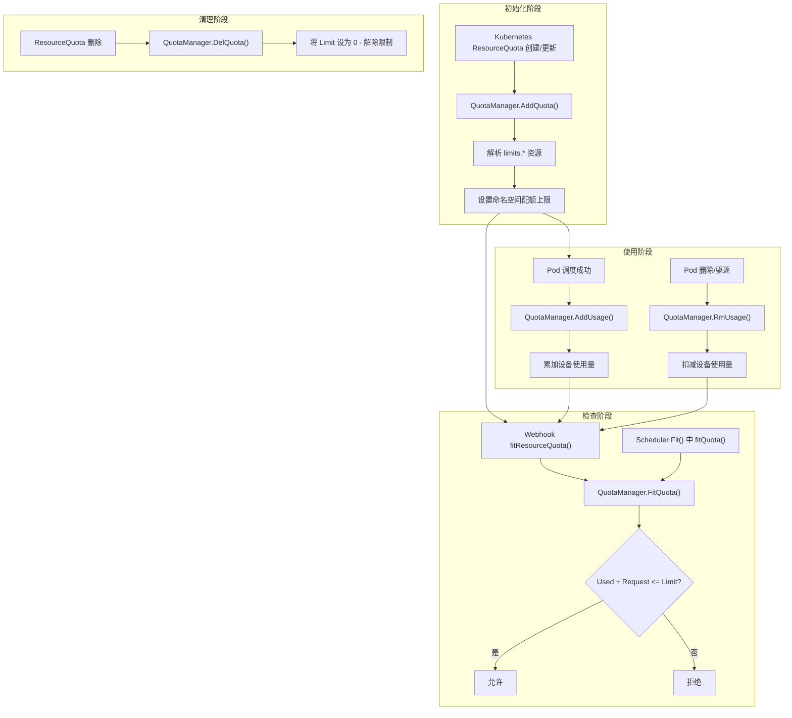

## 概述

HAMi 实现了一套轻量级的设备资源配额管理系统，作为 Kubernetes 原生 ResourceQuota 的补充。该系统跟踪命名空间级别的 GPU 显存和算力使用量，在 Webhook 准入阶段和调度器分配阶段进行配额校验，防止命名空间的设备资源使用超出管理员设定的上限。

**源码位置**: `pkg/device/quota.go`

---

## 1. 核心数据结构

### 1.1 Quota 结构

```go
type Quota struct {
    Used  int64  // 当前已使用量
    Limit int64  // 配额上限（0 表示无限制）
}
```

`Quota` 是最基本的配额单元，跟踪单个资源维度（如显存或算力核心）的使用量和上限。

### 1.2 DeviceQuota 类型

```go
type DeviceQuota map[string]*Quota
```

`DeviceQuota` 是一个映射表，键为资源名称（如 `nvidia.com/gpumem`、`nvidia.com/gpucores`），值为对应的 `Quota` 对象。一个 `DeviceQuota` 实例代表某个命名空间下的全部设备资源配额。

### 1.3 QuotaManager 结构

```go
type QuotaManager struct {
    Quotas map[string]*DeviceQuota  // key: namespace
    mutex  sync.RWMutex
}
```

`QuotaManager` 是配额管理的核心单例，维护所有命名空间的配额状态。其特点：

- **线程安全**: 使用 `sync.RWMutex` 保护并发读写
- **全局单例**: 通过 `sync.Once` 保证只初始化一次
- **读写分离**: `FitQuota` 使用读锁（`RLock`），`AddUsage`/`RmUsage`/`AddQuota`/`DelQuota` 使用写锁（`Lock`）

```go
var localCache QuotaManager

func GetLocalCache() *QuotaManager {
    return &localCache
}

func NewQuotaManager() *QuotaManager {
    once.Do(func() {
        localCache = QuotaManager{
            Quotas: make(map[string]*DeviceQuota),
        }
    })
    return &localCache
}
```

---

## 2. 配额生命周期

配额管理涉及四个核心操作，构成完整的生命周期。

### 2.1 生命周期流程图



### 2.2 AddQuota - 配额注册

当 Kubernetes ResourceQuota 资源被创建或更新时，`AddQuota()` 被触发：

```go
func (q *QuotaManager) AddQuota(quota *corev1.ResourceQuota) {
    q.mutex.Lock()
    defer q.mutex.Unlock()
    for idx, val := range quota.Spec.Hard {
        value, ok := val.AsInt64()
        if ok {
            // 只处理 limits. 前缀的资源
            if !strings.HasPrefix(idx.String(), "limits.") {
                continue
            }
            dn := strings.TrimPrefix(idx.String(), "limits.")
            // 只处理 HAMi 管理的设备资源
            if !IsManagedQuota(dn) {
                continue
            }
            // 初始化命名空间配额
            if q.Quotas[quota.Namespace] == nil {
                q.Quotas[quota.Namespace] = &DeviceQuota{}
            }
            dp := q.Quotas[quota.Namespace]
            if _, ok := (*dp)[dn]; !ok {
                (*dp)[dn] = &Quota{Used: 0, Limit: value}
            }
            (*dp)[dn].Limit = value
        }
    }
}
```

**关键细节**:
- 仅处理 `limits.` 前缀的资源（如 `limits.nvidia.com/gpumem`）
- 通过 `IsManagedQuota()` 过滤，只管理已注册设备的资源
- 如果配额已存在，仅更新 `Limit`，保留当前 `Used` 值

### 2.3 DelQuota - 配额删除

```go
func (q *QuotaManager) DelQuota(quota *corev1.ResourceQuota) {
    q.mutex.Lock()
    defer q.mutex.Unlock()
    for idx, val := range quota.Spec.Hard {
        // ... 解析资源名称
        if dq, ok := q.Quotas[quota.Namespace]; ok {
            if quotaInfo, ok := (*dq)[dn]; ok {
                quotaInfo.Limit = 0  // 将 Limit 设为 0 表示无限制
            }
        }
    }
}
```

> 注意：`DelQuota` 并不删除 `DeviceQuota` 条目，而是将 `Limit` 设置为 0。在 `FitQuota` 中，`Limit == 0` 被视为"无限制"。

### 2.4 AddUsage - 使用量增加

当 Pod 成功调度后，调度器调用 `AddUsage()` 更新使用量：

```go
func (q *QuotaManager) AddUsage(pod *corev1.Pod, podDev PodDevices) {
    usage := countPodDevices(podDev)
    if len(usage) == 0 {
        return
    }
    q.mutex.Lock()
    defer q.mutex.Unlock()
    // 初始化命名空间并累加使用量
    for idx, val := range usage {
        (*dp)[idx].Used += val
    }
}
```

`countPodDevices()` 辅助函数负责从 `PodDevices` 中提取每种设备资源的使用总量：

```go
func countPodDevices(podDev PodDevices) map[string]int64 {
    res := make(map[string]int64)
    for deviceName, podSingle := range podDev {
        devs, ok := GetDevices()[deviceName]
        resourceNames := devs.GetResourceNames()
        for _, ctrdevices := range podSingle {
            for _, ctrdevice := range ctrdevices {
                res[resourceNames.ResourceMemoryName] += int64(ctrdevice.Usedmem)
                res[resourceNames.ResourceCoreName] += int64(ctrdevice.Usedcores)
            }
        }
    }
    return res
}
```

### 2.5 RmUsage - 使用量扣减

当 Pod 被删除或驱逐时，调用 `RmUsage()` 释放配额：

```go
func (q *QuotaManager) RmUsage(pod *corev1.Pod, podDev PodDevices) {
    usage := countPodDevices(podDev)
    q.mutex.Lock()
    defer q.mutex.Unlock()
    for idx, val := range usage {
        (*dp)[idx].Used -= val
    }
}
```

---

## 3. FitQuota 配额校验

`FitQuota()` 是配额系统的核心校验方法，在两个阶段被调用：

1. **Webhook 阶段**: 通过 `fitResourceQuota()` 在 Pod 创建时进行前置检查
2. **调度器阶段**: 在 NVIDIA `Fit()` 方法中通过 `fitQuota()` 进行分配时检查

```go
func (q *QuotaManager) FitQuota(ns string, memreq int64, memoryFactor int32, coresreq int64, deviceName string) bool {
    q.mutex.RLock()
    defer q.mutex.RUnlock()

    dq := q.Quotas[ns]
    if dq == nil {
        return true  // 无配额限制
    }

    // 显存配额检查
    memQuota, ok := (*dq)[memResourceName]
    if ok {
        limit := memQuota.Limit
        if memoryFactor > 1 {
            limit = limit * int64(memoryFactor)
        }
        if limit != 0 && memQuota.Used + memreq > limit {
            return false
        }
    }

    // 算力配额检查
    coreQuota, ok := (*dq)[coreResourceName]
    if ok && coreQuota.Limit != 0 && coreQuota.Used + coresreq > coreQuota.Limit {
        return false
    }

    return true
}
```

### 3.1 校验逻辑说明

| 场景 | 结果 |
|------|------|
| 命名空间无配额记录 | 通过（无限制） |
| 资源无配额条目 | 通过（该资源无限制） |
| `Limit == 0` | 通过（Limit 为 0 视为无限制） |
| `Used + Request <= Limit` | 通过 |
| `Used + Request > Limit` | 拒绝 |

---

## 4. MemoryFactor 效果详解

`MemoryFactor` 在配额检查中有两处作用：

### 4.1 Webhook 阶段

在 `fitResourceQuota()` 中，用户请求的显存值会被乘以 `MemoryFactor`：

```go
if memoryFactor > 1 {
    memoryReq = memoryReq * int64(memoryFactor)
}
```

### 4.2 FitQuota 阶段

在 `FitQuota()` 中，配额上限会被乘以 `MemoryFactor`：

```go
if memoryFactor > 1 {
    limit = limit * int64(memoryFactor)
}
```

这样设计的目的是保持请求与配额上限的比例一致。当 MemoryFactor=2 时：
- 用户请求 1000MB 会被视为 2000MB
- 配额上限 10000MB 会被视为 20000MB
- 净效果是配额检查的比例不变

---

## 5. IsManagedQuota 资源识别

```go
func IsManagedQuota(quotaName string) bool {
    for _, val := range GetDevices() {
        names := val.GetResourceNames()
        if names.ResourceMemoryName == quotaName {
            return true
        }
        if names.ResourceCoreName == quotaName {
            return true
        }
    }
    return false
}
```

此函数通过遍历所有已注册设备的资源名称来判断一个 ResourceQuota 条目是否属于 HAMi 管理范围。例如：
- `nvidia.com/gpumem` - 是 HAMi 管理的资源
- `cpu` - 不是 HAMi 管理的资源
- `hygon.com/dcumem` - 如果 Hygon DCU 设备已注册，则是 HAMi 管理的资源

---

## 6. 并发安全与一致性

### 6.1 锁策略

| 操作 | 锁类型 | 理由 |
|------|--------|------|
| `FitQuota` | `RLock` (读锁) | 只读操作，允许多个并发检查 |
| `AddUsage` | `Lock` (写锁) | 修改 Used 值 |
| `RmUsage` | `Lock` (写锁) | 修改 Used 值 |
| `AddQuota` | `Lock` (写锁) | 修改 Limit 值 |
| `DelQuota` | `Lock` (写锁) | 修改 Limit 值 |
| `GetResourceQuota` | `RLock` (读锁) | 只读快照 |

### 6.2 一致性保证

配额系统存在一个固有的竞态窗口：在 Webhook `FitQuota` 返回 true 到调度器 `AddUsage` 之间，可能有其他 Pod 的 `AddUsage` 执行，导致实际使用量超出预期。

HAMi 通过以下方式缓解此问题：

1. **调度器侧二次检查**: NVIDIA `Fit()` 方法中也调用 `fitQuota()` 进行实时检查
2. **单节点串行化**: 通过 NodeLock 机制保证同一节点的分配串行执行
3. **最终一致性**: 即使出现短暂超额，Pod 删除后会通过 `RmUsage` 恢复正确状态

---

## 7. 配置示例

### 7.1 Kubernetes ResourceQuota 定义

```yaml
apiVersion: v1
kind: ResourceQuota
metadata:
  name: gpu-quota
  namespace: ml-team
spec:
  hard:
    limits.nvidia.com/gpumem: "32768"    # 32GB 显存上限
    limits.nvidia.com/gpucores: "400"     # 400% 算力上限（4 个完整 GPU）
```

### 7.2 配额效果

当 `ml-team` 命名空间中的 Pod 申请 GPU 资源时：
- 所有 Pod 的 GPU 显存请求总和不能超过 32768 MB
- 所有 Pod 的 GPU 算力请求总和不能超过 400（即 4 个 GPU 的等效算力）
- 超出配额的 Pod 在 Webhook 阶段即被拒绝，不会进入调度队列
