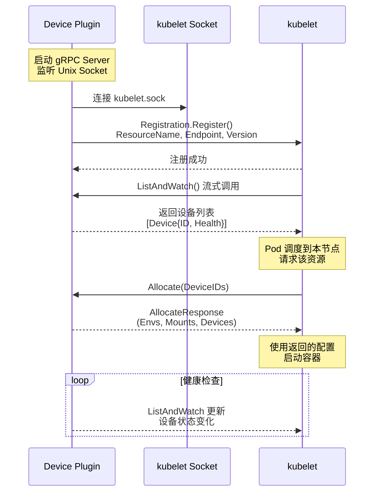
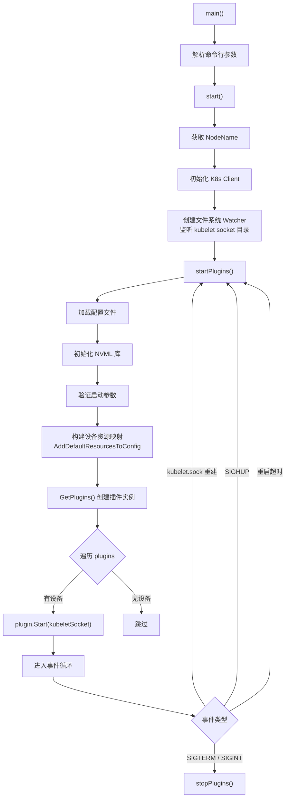
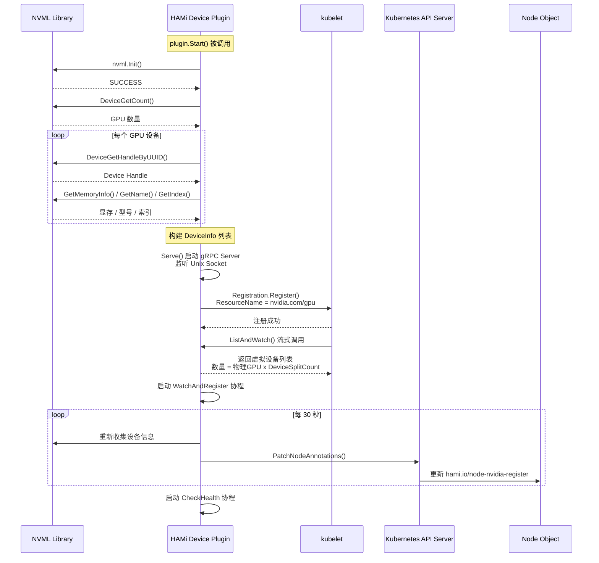
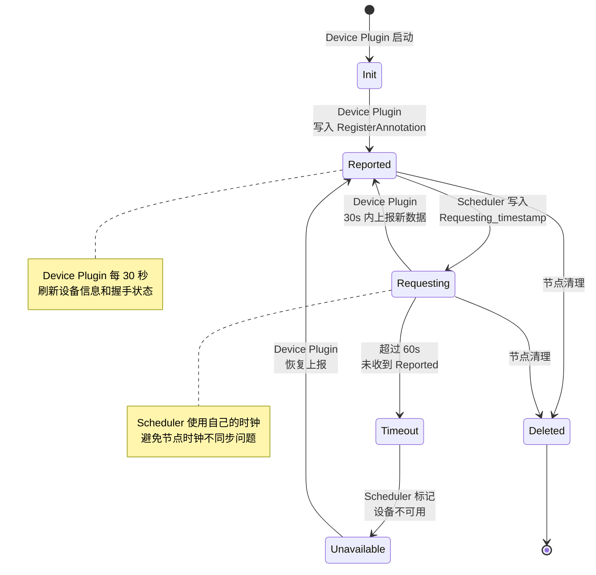
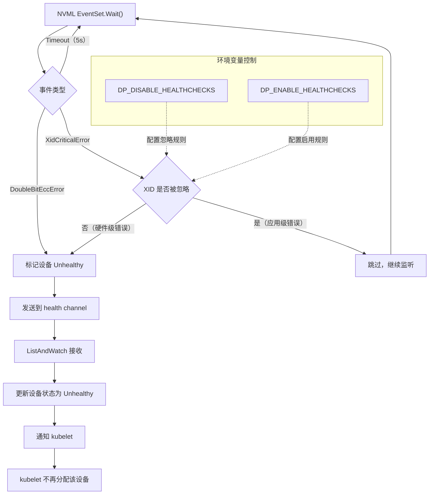

## 1. Kubernetes Device Plugin 框架概述

Kubernetes Device Plugin 是 kubelet 提供的一套 gRPC 扩展机制，允许第三方设备厂商在不修改 Kubernetes 核心代码的前提下，将硬件加速器（GPU、FPGA、NIC 等）暴露给集群中的 Pod 使用。Device Plugin 通过 Unix Domain Socket 与 kubelet 建立通信，并通过 `Registration`、`ListAndWatch`、`Allocate` 三个核心 gRPC 接口完成设备的注册、状态上报和分配。

### 1.1 Device Plugin gRPC 协议

Device Plugin 框架定义在 `k8s.io/kubelet/pkg/apis/deviceplugin/v1beta1` 中，核心接口如下：

| gRPC 接口 | 方向 | 功能 |
|---|---|---|
| `Registration.Register()` | Plugin --> kubelet | 向 kubelet 注册自身，声明管理的资源名称（如 `nvidia.com/gpu`） |
| `DevicePlugin.ListAndWatch()` | kubelet --> Plugin（流式） | 持续上报设备列表及健康状态变化 |
| `DevicePlugin.Allocate()` | kubelet --> Plugin | Pod 被调度后，kubelet 回调请求设备分配，返回环境变量、挂载、设备文件 |
| `DevicePlugin.GetDevicePluginOptions()` | kubelet --> Plugin | 查询插件能力选项 |
| `DevicePlugin.PreStartContainer()` | kubelet --> Plugin | 容器启动前的钩子（可选） |
| `DevicePlugin.GetPreferredAllocation()` | kubelet --> Plugin | 获取偏好的设备分配方案（可选） |

### 1.2 协议交互流程



## 2. HAMi Device Plugin 入口分析

HAMi 的 NVIDIA Device Plugin 入口位于：

```
cmd/device-plugin/nvidia/main.go
```

### 2.1 启动流程

`main()` 函数使用 `urfave/cli` 框架构建命令行应用，核心启动逻辑在 `start()` 函数中：

```go
// cmd/device-plugin/nvidia/main.go
func start(c *cli.Context, o *options) error {
    util.NodeName = os.Getenv(util.NodeNameEnvName)
    client.InitGlobalClient()
    // 监听 kubelet socket 目录变化
    watcher, err := watch.Files(kubeletSocketDir)
    // 启动插件
    plugins, restartPlugins, err := startPlugins(c, o)
    // 事件循环：监控 kubelet 重启、信号处理
    for {
        select {
        case <-restartTimeout:
            goto restart
        case event := <-watcher.Events:
            // kubelet socket 重建 -> 重启插件
        case s := <-sigs:
            // SIGHUP -> 重启，其他信号 -> 退出
        }
    }
}
```

### 2.2 启动流程图



## 3. 设备发现 - 节点注册 - kubelet 注册

HAMi 的设备注册涉及两个层面：一是向 kubelet 注册 Device Plugin 本身（gRPC 协议），二是向 Kubernetes Node Annotations 注册设备详细信息（HAMi 自定义协议）。

### 3.1 设备发现

设备发现通过 NVML（NVIDIA Management Library）完成，核心调用链：

```
NVML Init -> DeviceGetCount -> DeviceGetHandleByIndex -> 获取 UUID / Memory / Model / NUMA
```

代码位于 `pkg/device-plugin/nvidiadevice/nvinternal/plugin/register.go` 的 `getAPIDevices()` 方法：

```go
func (plugin *NvidiaDevicePlugin) getAPIDevices() *[]*device.DeviceInfo {
    devs := plugin.Devices()
    nvml.Init()
    for UUID := range devs {
        ndev, _ := nvml.DeviceGetHandleByUUID(UUID)
        idx, _ := ndev.GetIndex()
        memory, _ := ndev.GetMemoryInfo()
        Model, _ := ndev.GetName()
        numa, _ := GetNumaNode(ndev)
        // 应用 DeviceMemoryScaling / DeviceCoreScaling / DeviceSplitCount
        res = append(res, &device.DeviceInfo{
            ID: UUID, Index: idx, Count: splitCount,
            Devmem: scaledMemory, Devcore: scaledCore,
            Type: Model, Numa: numa, Health: health,
        })
    }
}
```

### 3.2 Node Annotation 注册

设备信息以 JSON 格式写入 Node Annotations，关键 Annotation Key：

| Annotation Key | 内容 | 示例 |
|---|---|---|
| `hami.io/node-nvidia-register` | 设备列表（JSON 数组） | `[{"id":"GPU-xxx","count":10,"devmem":32768,...}]` |
| `hami.io/node-handshake` | 心跳握手时间戳 | `Requesting_2024-01-23 04:30:04` |
| `hami.io/node-nvidia-score` | GPU 拓扑评分（可选） | `{"GPU-xxx":{"GPU-yyy":80}}` |

注册流程代码位于 `RegisterInAnnotation()` 方法：

```go
func (plugin *NvidiaDevicePlugin) RegisterInAnnotation() error {
    devices := plugin.getAPIDevices()
    encodeddevices := device.MarshalNodeDevices(*devices)
    if encodeddevices == plugin.deviceCache {
        return nil  // 设备信息无变化，跳过
    }
    plugin.deviceCache = encodeddevices
    annos[nvidia.RegisterAnnos] = encodeddevices
    return util.PatchNodeAnnotations(node, annos)
}
```

### 3.3 kubelet gRPC 注册

kubelet 注册通过标准 Device Plugin Registration API 完成：

```go
// pkg/device-plugin/nvidiadevice/nvinternal/plugin/server.go
func (plugin *NvidiaDevicePlugin) Register(kubeletSocket string) error {
    conn, _ := plugin.dial(kubeletSocket, 5*time.Second)
    client := kubeletdevicepluginv1beta1.NewRegistrationClient(conn)
    reqt := &kubeletdevicepluginv1beta1.RegisterRequest{
        Version:      kubeletdevicepluginv1beta1.Version,
        Endpoint:     path.Base(plugin.socket),
        ResourceName: string(plugin.rm.Resource()),
    }
    client.Register(context.Background(), reqt)
}
```

### 3.4 完整注册时序



## 4. 握手协议

HAMi 设计了一套基于 Node Annotation 的握手协议（Handshake Protocol），用于 Scheduler 与 Device Plugin 之间判断节点设备的可用性。这套机制解决了分布式环境中节点时钟可能不同步的问题。

### 4.1 握手流程

1. **Device Plugin 上报**：Device Plugin 每 30 秒调用 `RegisterInAnnotation()`，将设备信息写入 `hami.io/node-nvidia-register`
2. **Scheduler 发起握手**：Scheduler 每 30 秒将 `hami.io/node-handshake` 设置为 `Requesting_{scheduler_timestamp}`
3. **Device Plugin 响应**：Device Plugin 在下次注册时，将 `hami.io/node-handshake` 更新为 `Reported_{device_node_timestamp}`
4. **Scheduler 判断健康**：若 Annotation 仍为 `Requesting_` 状态且超过设定阈值（60 秒），则认为设备节点不可用

### 4.2 关键 Annotation

| Annotation | 设置方 | 值格式 | 含义 |
|---|---|---|---|
| `hami.io/node-handshake` | Scheduler | `Requesting_2024-01-23 04:30:04` | Scheduler 发起健康探测 |
| `hami.io/node-handshake` | Device Plugin | `Reported_2024-01-23 04:30:05` | Device Plugin 确认存活 |
| `hami.io/node-handshake` | System | `Deleted` | 节点清理标记 |

### 4.3 健康判断逻辑

```go
// pkg/device/devices.go
func CheckHealth(devType string, node *corev1.Node) (bool, bool) {
    handshake := node.Annotations[util.HandshakeAnnos[devType]]
    if strings.Contains(handshake, "Requesting") {
        formertime, _ := time.Parse(time.DateTime,
            strings.Split(handshake, "_")[1])
        // 如果 Requesting 超过 60 秒未更新，则认为不健康
        return time.Now().Before(formertime.Add(time.Second * 60)), false
    } else if strings.Contains(handshake, "Deleted") {
        return true, false
    } else {
        // 初次握手或已 Reported，发起新的 Requesting
        return true, true
    }
}
```

### 4.4 握手状态机



## 5. 健康检查机制

HAMi Device Plugin 的健康检查分为两个层面：NVML 事件驱动的硬件级健康检查和 Annotation 驱动的应用级握手检查。

### 5.1 NVML 事件驱动健康检查

核心代码位于 `pkg/device-plugin/nvidiadevice/nvinternal/rm/health.go`。

健康检查通过 NVML Event Set 机制监听 GPU 的 XID 错误事件：

```go
func (r *nvmlResourceManager) checkHealth(stop <-chan interface{},
    devices Devices, unhealthy chan<- *Device, ...) error {

    // 获取要关注的 XID 错误列表
    xids := getHealthCheckXids()

    // 为每个设备注册事件监听
    eventMask := uint64(nvml.EventTypeXidCriticalError |
                        nvml.EventTypeDoubleBitEccError |
                        nvml.EventTypeSingleBitEccError)
    for _, d := range devices {
        gpu.RegisterEvents(eventMask & supportedEvents, eventSet)
    }

    // 事件循环
    for {
        e, ret := eventSet.Wait(5000)  // 5 秒超时轮询
        if e.EventType == nvml.EventTypeXidCriticalError {
            if !xids.IsDisabled(e.EventData) {
                unhealthy <- d  // 将设备标记为不健康
            }
        }
    }
}
```

### 5.2 XID 错误过滤

并非所有 XID 错误都代表 GPU 硬件故障。HAMi 内置了一组默认忽略的应用级 XID 错误：

| XID | 描述 | 处理策略 |
|---|---|---|
| 13 | Graphics Engine Exception | 忽略（应用错误） |
| 31 | GPU memory page fault | 忽略（应用错误） |
| 43 | GPU stopped processing | 忽略（应用错误） |
| 45 | Preemptive cleanup | 忽略（清理操作） |
| 68 | Video processor exception | 忽略（应用错误） |
| 109 | Context Switch Timeout | 忽略（应用错误） |

可以通过环境变量 `DP_DISABLE_HEALTHCHECKS` 和 `DP_ENABLE_HEALTHCHECKS` 自定义 XID 过滤规则。

### 5.3 健康状态传播



### 5.4 健康检查与 MIG 的协调

当 Device Plugin 需要执行 MIG（Multi-Instance GPU）配置变更时，需要临时禁用 NVML 操作以避免冲突：

```go
func (nv *NvidiaDevicePlugin) DisableOtherNVMLOperation() {
    CreateMigApplyLock()
    nv.disableHealthChecks <- true       // 暂停健康检查
    nv.disableWatchAndRegister <- true   // 暂停设备注册
    // 等待两个协程确认已暂停
}

func (nv *NvidiaDevicePlugin) EnableOtherNVMLOperation() {
    RemoveMigApplyLock()
    nv.disableHealthChecks <- false      // 恢复健康检查
    nv.disableWatchAndRegister <- false  // 恢复设备注册
}
```

这保证了 MIG 配置变更期间不会因为并发 NVML 调用导致异常。

## 6. 源码文件索引

| 文件路径 | 功能 |
|---|---|
| `cmd/device-plugin/nvidia/main.go` | 程序入口，命令行解析与启动逻辑 |
| `pkg/device-plugin/nvidiadevice/nvinternal/plugin/server.go` | gRPC Server 实现，ListAndWatch / Allocate 等接口 |
| `pkg/device-plugin/nvidiadevice/nvinternal/plugin/register.go` | 设备发现与 Node Annotation 注册 |
| `pkg/device-plugin/nvidiadevice/nvinternal/plugin/util.go` | 工具函数，MIG 模板处理，设备锁管理 |
| `pkg/device-plugin/nvidiadevice/nvinternal/rm/health.go` | NVML 事件驱动健康检查 |
| `pkg/device-plugin/nvidiadevice/nvinternal/rm/nvml_manager.go` | NVML 资源管理器 |
| `pkg/device-plugin/nvidiadevice/nvinternal/rm/allocate.go` | 设备分配算法（分布式均衡） |
| `pkg/device/nvidia/device.go` | NVIDIA 设备类型定义与 Annotation 常量 |
| `pkg/device/devices.go` | 通用设备健康检查（CheckHealth 握手逻辑） |
| `pkg/util/types.go` | 全局常量定义（DeviceBindPhase 等） |
