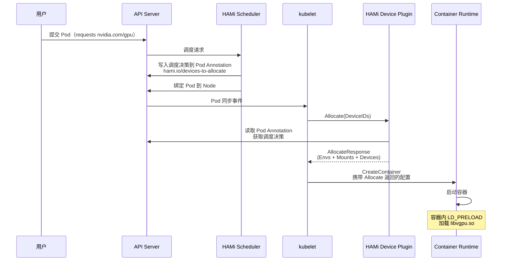
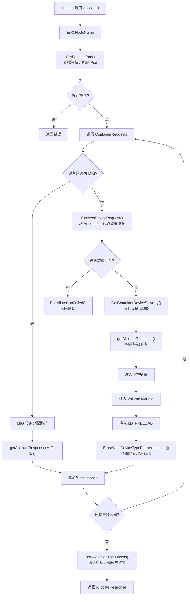
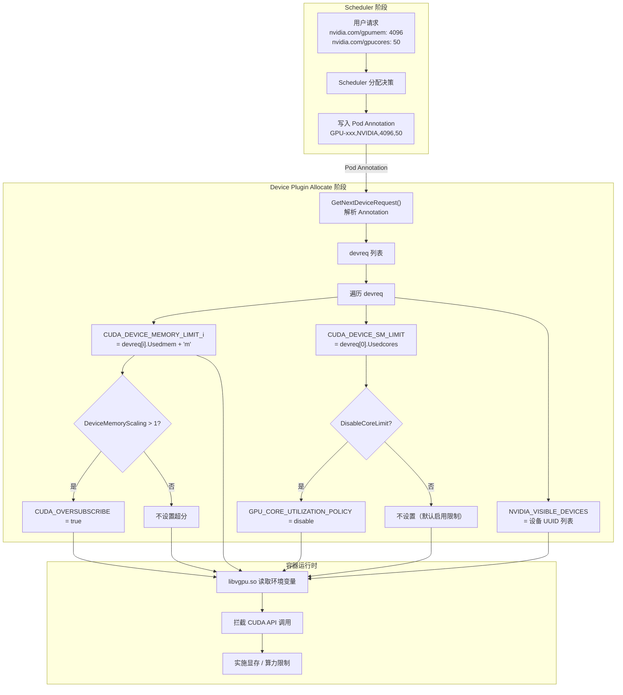
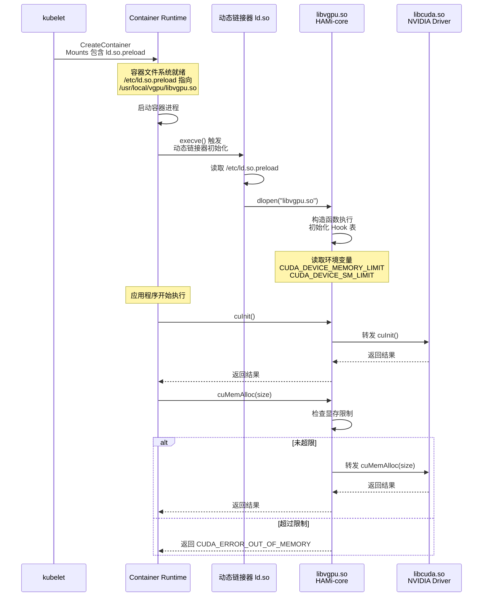
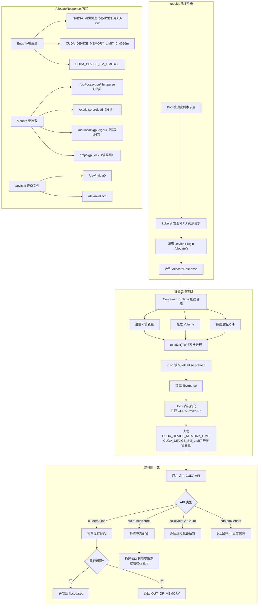
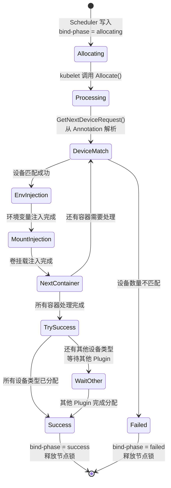
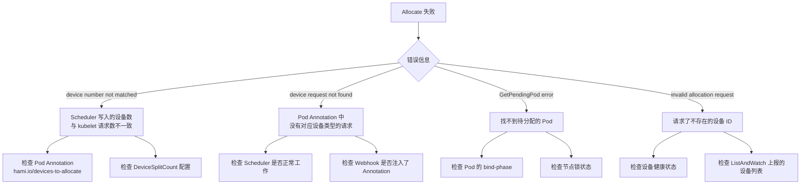

## 1. Allocate 回调概述

当 kubelet 发现某个 Pod 请求了 `nvidia.com/gpu` 资源，且该 Pod 已被调度到当前节点后，kubelet 会通过 gRPC 调用 Device Plugin 的 `Allocate()` 方法。HAMi 的 `Allocate()` 实现不仅仅是返回设备 ID，还需要注入一系列环境变量、Volume Mount 和设备文件，使得容器内部的 CUDA 应用能够被 HAMi-core 拦截和管控。

### 1.1 Allocate 在整体流程中的位置



## 2. Allocate 实现详解

### 2.1 核心入口

`Allocate()` 方法位于 `pkg/device-plugin/nvidiadevice/nvinternal/plugin/server.go`：

```go
func (plugin *NvidiaDevicePlugin) Allocate(ctx context.Context,
    reqs *kubeletdevicepluginv1beta1.AllocateRequest) (
    *kubeletdevicepluginv1beta1.AllocateResponse, error) {

    nodename := os.Getenv(util.NodeNameEnvName)
    // 1. 获取正在等待分配的 Pod
    current, err := util.GetPendingPod(ctx, nodename)

    for idx, req := range reqs.ContainerRequests {
        // 2. 判断是 MIG 设备还是普通 GPU
        if strings.Contains(req.DevicesIDs[0], "MIG") {
            // MIG 设备分配路径
            response, _ := plugin.getAllocateResponse(req.DevicesIDs)
        } else {
            // 3. 从 Pod Annotation 读取调度决策
            currentCtr, devreq, _ := GetNextDeviceRequest(
                nvidia.NvidiaGPUDevice, *current)

            // 4. 构建基础 AllocateResponse
            response, _ := plugin.getAllocateResponse(
                plugin.GetContainerDeviceStrArray(devreq))

            // 5. 注入 HAMi 特有的环境变量
            for i, dev := range devreq {
                limitKey := fmt.Sprintf("CUDA_DEVICE_MEMORY_LIMIT_%v", i)
                response.Envs[limitKey] = fmt.Sprintf("%vm", dev.Usedmem)
            }
            response.Envs["CUDA_DEVICE_SM_LIMIT"] = fmt.Sprint(devreq[0].Usedcores)

            // 6. 注入 Volume Mounts
            response.Mounts = append(response.Mounts, ...)

            // 7. 清除已处理的 Annotation
            EraseNextDeviceTypeFromAnnotation(nvidia.NvidiaGPUDevice, *current)
        }
    }

    // 8. 标记分配成功，释放节点锁
    PodAllocationTrySuccess(nodename, nvidia.NvidiaGPUDevice,
        NodeLockNvidia, current)
    return &responses, nil
}
```

### 2.2 从 Annotation 读取调度决策

HAMi 的核心设计是 Scheduler 和 Device Plugin 之间通过 Pod Annotation 传递调度决策。在 `Allocate()` 中，Device Plugin 并不自行决定分配哪些设备，而是读取 Scheduler 预先写入的分配方案。

```go
// pkg/device-plugin/nvidiadevice/nvinternal/plugin/util.go
func GetNextDeviceRequest(dtype string, p corev1.Pod) (
    corev1.Container, device.ContainerDevices, error) {

    // 从 Pod Annotation 解码设备请求
    pdevices, _ := device.DecodePodDevices(
        device.InRequestDevices, p.Annotations)

    // 找到第一个尚未处理的容器设备请求
    pd := pdevices[dtype]
    for ctridx, ctrDevice := range pd {
        if len(ctrDevice) > 0 {
            return p.Spec.Containers[ctridx], ctrDevice, nil
        }
    }
}
```

### 2.3 Allocate 处理流程图



## 3. 环境变量注入

HAMi 通过 `AllocateResponse.Envs` 向容器注入一系列环境变量，这些变量由容器内的 `libvgpu.so`（HAMi-core）在运行时读取，用于实现 GPU 资源隔离。

### 3.1 核心环境变量

| 环境变量 | 设置位置 | 示例值 | 功能 |
|---|---|---|---|
| `NVIDIA_VISIBLE_DEVICES` | `getAllocateResponse()` | `GPU-xxx,GPU-yyy` | 控制容器可见的 GPU 设备 |
| `CUDA_DEVICE_MEMORY_LIMIT_0` | `Allocate()` | `4096m` | 第 0 个设备的显存上限（MB） |
| `CUDA_DEVICE_MEMORY_LIMIT_1` | `Allocate()` | `2048m` | 第 1 个设备的显存上限（MB） |
| `CUDA_DEVICE_SM_LIMIT` | `Allocate()` | `50` | SM（Streaming Multiprocessor）核心利用率上限（百分比） |
| `CUDA_DEVICE_MEMORY_SHARED_CACHE` | `Allocate()` | `/usr/local/vgpu/vgpu/xxx.cache` | 共享内存缓存文件路径 |
| `CUDA_OVERSUBSCRIBE` | `Allocate()` | `true` | 是否启用显存超分（DeviceMemoryScaling > 1 时） |
| `LIBCUDA_LOG_LEVEL` | `Allocate()` | `0` / `1` / `3` / `4` | HAMi-core 日志级别 |
| `GPU_CORE_UTILIZATION_POLICY` | `Allocate()` | `disable` | 核心利用率限制开关 |

### 3.2 环境变量计算流程



### 3.3 多设备场景

当一个容器请求多个 GPU 时，每个设备有独立的显存限制环境变量：

```bash
# 容器请求 2 个 GPU，每个分配 4GB 显存
NVIDIA_VISIBLE_DEVICES=GPU-aaa,GPU-bbb
CUDA_DEVICE_MEMORY_LIMIT_0=4096m
CUDA_DEVICE_MEMORY_LIMIT_1=4096m
CUDA_DEVICE_SM_LIMIT=50
```

## 4. Volume Mount 注入

HAMi 通过 Volume Mount 将宿主机上的 Hook 库和配置文件挂载到容器内，是实现 GPU 虚拟化的关键一步。

### 4.1 挂载列表

| 容器路径 | 宿主机路径 | 只读 | 功能 |
|---|---|---|---|
| `{HOOK_PATH}/vgpu/libvgpu.so` | `GetLibPath()` 版本化路径 | 是 | HAMi-core 拦截库 |
| `{HOOK_PATH}/vgpu` | `{HOOK_PATH}/vgpu/containers/{PodUID}_{CtrName}` | 否 | 容器级缓存目录 |
| `/tmp/vgpulock` | `/tmp/vgpulock` | 否 | vGPU 进程间锁目录 |
| `/etc/ld.so.preload` | `{HOOK_PATH}/vgpu/ld.so.preload` | 是 | 动态链接器 preload 配置 |
| `/tmp/license`（可选） | `{HOOK_PATH}/vgpu/license` | 是 | 许可证文件 |

其中 `HOOK_PATH` 环境变量默认指向 `/usr/local/vgpu`（通过 DaemonSet 配置）。

### 4.2 挂载源码

```go
// pkg/device-plugin/nvidiadevice/nvinternal/plugin/server.go - Allocate()
response.Mounts = append(response.Mounts,
    // 1. libvgpu.so - HAMi-core 拦截库
    &kubeletdevicepluginv1beta1.Mount{
        ContainerPath: fmt.Sprintf("%s/vgpu/libvgpu.so", hostHookPath),
        HostPath:      GetLibPath(),
        ReadOnly:      true,
    },
    // 2. 容器级缓存目录
    &kubeletdevicepluginv1beta1.Mount{
        ContainerPath: fmt.Sprintf("%s/vgpu", hostHookPath),
        HostPath:      cacheFileHostDirectory,
        ReadOnly:      false,
    },
    // 3. vGPU 进程间锁
    &kubeletdevicepluginv1beta1.Mount{
        ContainerPath: "/tmp/vgpulock",
        HostPath:      "/tmp/vgpulock",
        ReadOnly:      false,
    },
)

// 4. ld.so.preload（条件挂载 - 检查 CUDA_DISABLE_CONTROL）
if !found {
    response.Mounts = append(response.Mounts,
        &kubeletdevicepluginv1beta1.Mount{
            ContainerPath: "/etc/ld.so.preload",
            HostPath:      hostHookPath + "/vgpu/ld.so.preload",
            ReadOnly:      true,
        },
    )
}
```

### 4.3 GetLibPath 版本化逻辑

```go
// pkg/device-plugin/nvidiadevice/nvinternal/plugin/util.go
func GetLibPath() string {
    // 优先使用带版本号的库文件
    libPath := hostHookPath + "/vgpu/libvgpu.so." + info.GetVersion()
    if _, err := os.Stat(libPath); os.IsNotExist(err) {
        // 回退到不带版本号的文件
        libPath = hostHookPath + "/vgpu/libvgpu.so"
    }
    return libPath
}
```

### 4.4 CUDA_DISABLE_CONTROL 旁路机制

如果容器的环境变量中设置了 `CUDA_DISABLE_CONTROL=true`，则不挂载 `/etc/ld.so.preload`，这意味着 HAMi-core 不会被加载，容器将直接访问原生 CUDA，跳过所有资源限制：

```go
for _, val := range currentCtr.Env {
    if strings.Compare(val.Name, "CUDA_DISABLE_CONTROL") == 0 {
        t, _ := strconv.ParseBool(val.Value)
        if t {
            found = true  // 跳过 ld.so.preload 挂载
            break
        }
    }
}
```

## 5. LD_PRELOAD 机制 - HAMi-core 加载原理

`LD_PRELOAD` 是 Linux 动态链接器（`ld.so`）提供的一种机制，允许在进程启动时优先加载指定的共享库。HAMi 利用这一机制将 `libvgpu.so`（HAMi-core）注入到所有容器进程中，从而拦截 CUDA API 调用。

### 5.1 加载链路



### 5.2 ld.so.preload 文件内容

HAMi 在宿主机上的 `ld.so.preload` 文件内容非常简单，仅包含一行：

```
/usr/local/vgpu/libvgpu.so
```

这个文件被挂载到容器的 `/etc/ld.so.preload` 路径。当容器内的任何进程启动时，Linux 动态链接器会首先读取此文件，并在加载其他任何共享库之前加载 `libvgpu.so`。

### 5.3 HAMi-core 的 dlsym Hook 机制

`libvgpu.so` 被加载后，通过覆写 `dlsym` 函数拦截所有 CUDA API 符号查找：

```c
// HAMi-core/src/libvgpu.c
fp_dlsym real_dlsym = NULL;

void init_dlsym() {
    pthread_mutex_init(&dlsym_lock, NULL);
    dlmap_count = 0;
}
```

HAMi-core 维护了一张完整的 CUDA API Hook 表（位于 `HAMi-core/src/cuda/hook.c`），涵盖了所有需要拦截的 CUDA Driver API：

```c
// HAMi-core/src/cuda/hook.c
cuda_entry_t cuda_library_entry[] = {
    {.name = "cuInit"},
    {.name = "cuDeviceGetCount"},
    {.name = "cuMemAlloc_v2"},
    {.name = "cuMemFree_v2"},
    {.name = "cuMemGetInfo_v2"},
    {.name = "cuLaunchKernel"},
    // ... 数十个 CUDA API
};
```

### 5.4 完整的容器创建与 GPU 注入流程



## 6. 分配成功与失败处理

### 6.1 成功路径

当所有容器的设备都分配完成后，Device Plugin 执行：

```go
func PodAllocationTrySuccess(nodeName, devName, lockName string,
    pod *corev1.Pod) {
    // 检查是否所有设备类型都已分配完成
    refreshed, _ := client.GetClient().CoreV1().Pods(
        pod.Namespace).Get(ctx, pod.Name, metav1.GetOptions{})
    annos := refreshed.Annotations[device.InRequestDevices[devName]]
    for _, val := range device.DevicesToHandle {
        if strings.Contains(annos, val) {
            return  // 还有设备未分配，等待
        }
    }
    // 所有设备分配完成
    PodAllocationSuccess(nodeName, pod, lockName)
}

func PodAllocationSuccess(nodeName string, pod *corev1.Pod,
    lockName string) {
    // 1. 更新 Pod Annotation: hami.io/bind-phase = "success"
    // 2. 释放节点互斥锁
    updatePodAnnotationsAndReleaseLock(nodeName, pod, lockName,
        util.DeviceBindSuccess)
}
```

### 6.2 失败路径

如果分配过程中发生错误：

```go
func PodAllocationFailed(nodeName string, pod *corev1.Pod,
    lockName string) {
    // 1. 更新 Pod Annotation: hami.io/bind-phase = "failed"
    // 2. 释放节点互斥锁
    updatePodAnnotationsAndReleaseLock(nodeName, pod, lockName,
        util.DeviceBindFailed)
}
```

### 6.3 分配生命周期状态图



## 7. 端到端调试要点

### 7.1 关键日志

在排查 Allocate 问题时，关注以下日志关键字：

| 日志内容 | 阶段 | 含义 |
|---|---|---|
| `Allocate request=...` | 入口 | kubelet 发来的原始设备 ID 列表 |
| `Allocate pod name is...` | 入口 | 找到的待分配 Pod 及其 Annotation |
| `deviceAllocateFromAnnotation=...` | 解析 | 从 Annotation 中解析出的设备分配方案 |
| `After erase res=...` | 清理 | 已处理的 Annotation 被清除后的状态 |
| `Allocate Response...` | 出口 | 最终返回给 kubelet 的响应内容 |
| `All devices allocate success` | 完成 | 所有设备分配成功，准备释放锁 |

### 7.2 常见问题诊断



## 8. 源码文件索引

| 文件路径 | 功能 |
|---|---|
| `pkg/device-plugin/nvidiadevice/nvinternal/plugin/server.go` | Allocate() 核心实现，环境变量和 Mount 注入 |
| `pkg/device-plugin/nvidiadevice/nvinternal/plugin/util.go` | GetNextDeviceRequest()、GetLibPath()、设备 UUID 解析 |
| `pkg/device-plugin/nvidiadevice/nvinternal/plugin/register.go` | RegisterInAnnotation()、WatchAndRegister() |
| `pkg/device/nvidia/device.go` | NVIDIA 设备常量定义、Annotation Key |
| `pkg/util/types.go` | DeviceBindPhase、CoreLimitSwitch 等常量 |
| `lib/nvidia/ld.so.preload` | 宿主机 ld.so.preload 模板文件 |
| `HAMi-core/src/libvgpu.c` | HAMi-core 入口，dlsym Hook 初始化 |
| `HAMi-core/src/cuda/hook.c` | CUDA Driver API Hook 表定义 |
