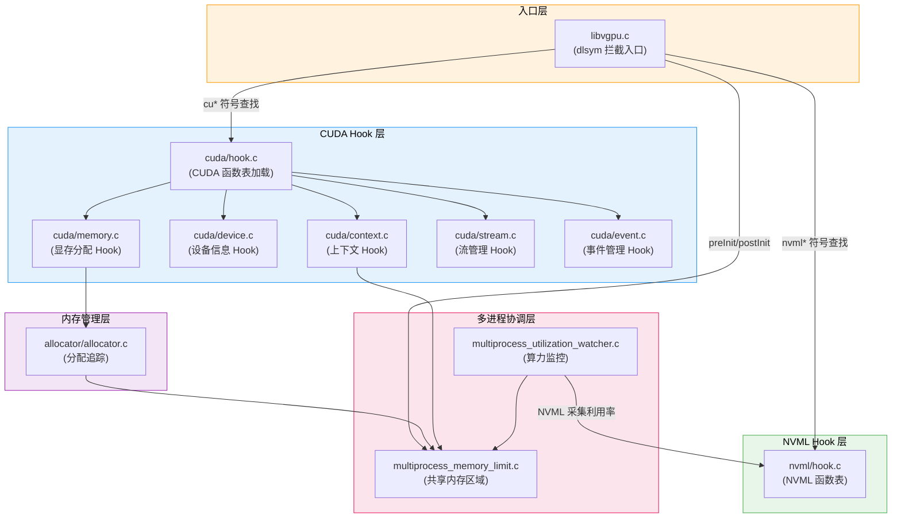
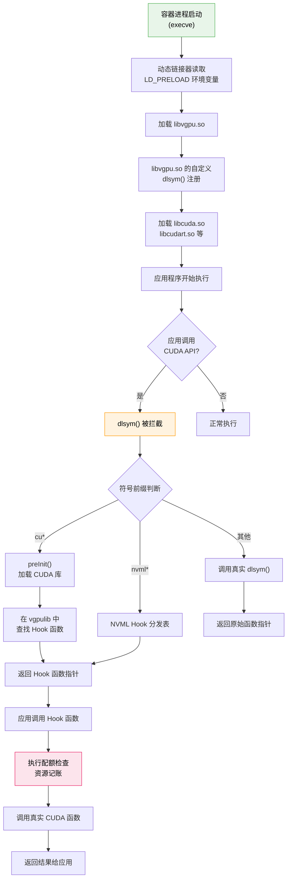
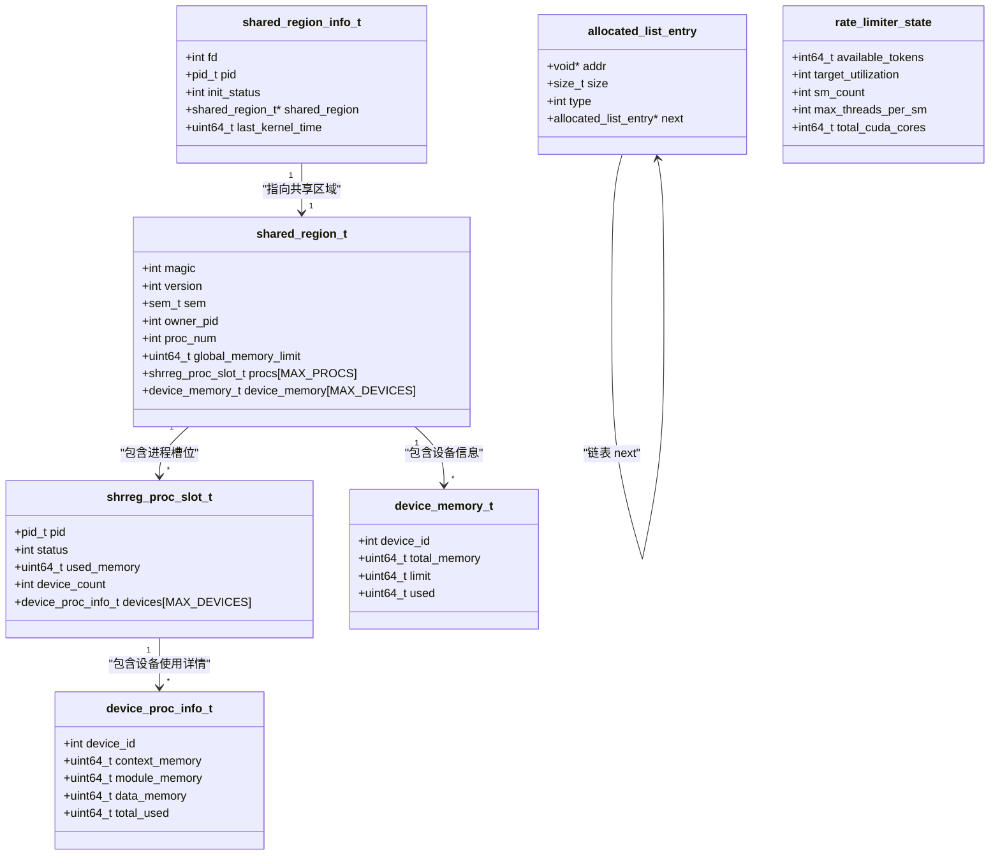
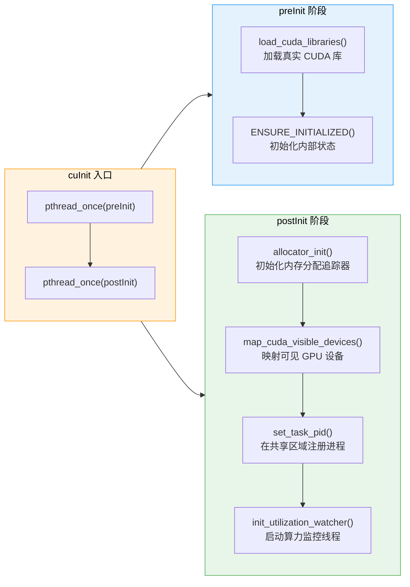

<p align="center">
  
  
  
  
  
</p>

---

## 1. 什么是 libvgpu.so

**libvgpu.so** 是 HAMi 项目的核心用户态组件，它是一个通过 `LD_PRELOAD` 机制注入容器进程的共享库，负责在运行时拦截所有 CUDA Driver API 和 NVML API 调用，从而实现对 GPU 显存和算力的细粒度隔离与限制。

从本质上讲，libvgpu.so 是一个 **CUDA API 代理层**。当容器内的应用程序（如 PyTorch、TensorFlow）调用 CUDA API 时，libvgpu.so 会在真正的 CUDA 驱动函数执行之前进行拦截，检查资源配额，记录使用量，并在必要时拒绝超额请求或限制计算吞吐量。

### 1.1 核心能力

| 能力 | 实现机制 | 说明 |
|------|----------|------|
| **显存隔离** | 拦截 `cuMemAlloc` / `cuMemFree` 等内存 API | 按配额限制每个容器可使用的 GPU 显存总量 |
| **算力限制** | 拦截 `cuLaunchKernel`，配合令牌桶算法 | 通过控制 Kernel 启动频率限制 SM 利用率 |
| **设备隐藏** | 拦截 `cuDeviceGetCount` / `cuDeviceTotalMem` | 仅暴露分配给当前容器的 GPU 设备 |
| **多进程协同** | POSIX 共享内存区域 | 同一 GPU 上多个容器的资源使用量协调 |
| **监控数据上报** | 共享内存 + 外部 Monitor 读取 | 为 Prometheus 指标采集提供实时使用量数据 |

### 1.2 在 HAMi 架构中的位置

libvgpu.so 位于 HAMi 数据链路的最末端 -- 直接在容器内部运行，是真正执行显存和算力隔离的组件：

```
Scheduler Extender → Device Plugin (Allocate) → 挂载 libvgpu.so + 设置环境变量 → 容器启动 → LD_PRELOAD 加载 libvgpu.so → CUDA API 拦截生效
```

---

## 2. LD_PRELOAD 工作原理

`LD_PRELOAD` 是 Linux 动态链接器（`ld-linux.so`）提供的一种机制，允许在进程启动时优先加载指定的共享库，使其中的符号定义覆盖后续加载的库中的同名符号。

### 2.1 加载时序

```mermaid
sequenceDiagram
    participant Kernel as ["Linux Kernel"]
    participant Linker as ["ld-linux.so
(动态链接器)"]
    participant Vgpu as ["libvgpu.so
(HAMi-core)"]
    participant Cuda as ["libcuda.so
(NVIDIA Driver)"]
    participant App as ["用户应用
(PyTorch等)"]

    Kernel->>Linker: execve() 启动容器进程
    Note over Linker: 读取 LD_PRELOAD 环境变量
    Linker->>Vgpu: 优先加载 libvgpu.so
    Note over Vgpu: 注册自定义 dlsym()
    Linker->>Cuda: 加载 libcuda.so
    Note over Linker: libvgpu.so 的 dlsym 已优先注册
    Linker->>App: 加载应用程序
    App->>Vgpu: cuMemAlloc() (被拦截)
    Vgpu->>Vgpu: 检查配额
    Vgpu->>Cuda: 调用真实 cuMemAlloc()
    Cuda-->>Vgpu: 返回结果
    Vgpu-->>App: 返回结果
```

### 2.2 关键机制

LD_PRELOAD 的核心在于 **符号查找优先级**。Linux 动态链接器在解析共享库符号时，遵循以下优先级顺序：

1. **LD_PRELOAD 指定的库** -- libvgpu.so 中的 `dlsym()` 覆盖 glibc 的 `dlsym()`
2. **应用程序自身** -- 可执行文件中的符号定义
3. **按依赖顺序加载的共享库** -- libcuda.so、libc.so 等

HAMi-core 利用这一机制，通过 `FUNC_ATTR_VISIBLE` 属性导出自定义的 `dlsym()` 函数，使得所有通过 `dlsym()` 动态查找的 CUDA 函数符号都被重定向到 libvgpu.so 内部的 Hook 函数。

---

## 3. 构建系统

HAMi-core 使用 **CMake** 作为构建系统，最终产物为 `libvgpu.so` 共享库。

### 3.1 构建依赖

| 依赖项 | 说明 |
|--------|------|
| GCC / Clang | C 编译器，支持 C11 标准 |
| CMake >= 3.10 | 构建系统 |
| CUDA Toolkit | 提供 CUDA Driver API 头文件（`cuda.h`、`cuda_runtime.h`） |
| NVML 头文件 | 提供 NVML API 头文件（`nvml.h`），通常随 CUDA Toolkit 一同安装 |
| POSIX 线程库 | `pthread`，用于多线程和进程间同步 |
| 动态链接库 | `dl`，提供 `dlsym`、`dlvsym`、`dlopen` 等符号 |

### 3.2 编译产物

编译完成后生成的 `libvgpu.so` 包含以下关键导出符号：

- `dlsym` -- 覆盖 glibc 的 `dlsym`，作为所有 CUDA Hook 的入口
- CUDA Hook 函数表 -- 150+ 个 CUDA Driver API 的 Hook 实现
- NVML Hook 函数表 -- 200+ 个 NVML API 的 Hook 实现

---

## 4. 源代码文件结构

### 4.1 文件总览

以下是 HAMi-core 核心源代码文件及其职责说明：

| 文件路径 | 核心职责 | 关键函数 |
|----------|----------|----------|
| `libvgpu.c` | 入口点，dlsym Hook 分发 | `dlsym()`、`preInit()`、`postInit()`、`cuInit()` |
| `cuda/memory.c` | 显存分配/释放 Hook | `cuMemAlloc_v2()`、`cuMemFree_v2()`、`cuMemGetInfo_v2()` |
| `cuda/device.c` | 设备信息 Hook | `cuDeviceGetCount()`、`cuDeviceTotalMem()` |
| `cuda/context.c` | 上下文管理 Hook | `cuCtxCreate()`、`cuCtxDestroy()` |
| `cuda/stream.c` | 流管理 Hook | `cuStreamCreate()`、`cuStreamSynchronize()` |
| `cuda/event.c` | 事件管理 Hook | `cuEventCreate()`、`cuEventRecord()` |
| `cuda/hook.c` | CUDA 函数表加载 | `load_cuda_libraries()`、函数指针初始化 |
| `nvml/hook.c` | NVML 函数表 | `__dlsym_hook_section_nvml()`、NVML API 分发 |
| `multiprocess/multiprocess_memory_limit.c` | 共享内存区域管理 | `try_create_shrreg()`、`lock_shrreg()`、`oom_check()` |
| `multiprocess/multiprocess_utilization_watcher.c` | 算力限制器 | `rate_limiter()`、`utilization_watcher()`、`delta()` |
| `allocator/allocator.c` | 内存分配追踪 | `allocate_raw()`、`free_raw()`、`oom_check()` |

### 4.2 源文件依赖关系



---

## 5. 库加载全流程

从容器启动到 CUDA API 拦截生效的完整流程如下：



---

## 6. 核心数据结构

以下类图展示了 HAMi-core 中最关键的 C 结构体及其关联关系：



### 6.1 结构体说明

| 结构体 | 所在文件 | 说明 |
|--------|----------|------|
| `shared_region_t` | `multiprocess_memory_limit.c` | 共享内存区域的顶层结构，包含全局配额、进程槽位和设备内存信息 |
| `shrreg_proc_slot_t` | `multiprocess_memory_limit.c` | 单个进程在共享区域中的槽位，记录该进程的 PID、状态和内存使用量 |
| `device_proc_info_t` | `multiprocess_memory_limit.c` | 单个进程对单个设备的内存使用详情，按类型（context / module / data）分类统计 |
| `device_memory_t` | `multiprocess_memory_limit.c` | 单个 GPU 设备的内存全局视图 -- 总量、限额和已用量 |
| `shared_region_info_t` | `multiprocess_memory_limit.c` | 进程本地持有的共享区域句柄，包含文件描述符和初始化状态 |
| `allocated_list_entry` | `allocator.c` | 内存分配追踪链表节点，记录每次分配的地址、大小和类型 |
| `rate_limiter_state` | `multiprocess_utilization_watcher.c` | 令牌桶算法状态，包含可用令牌数、目标利用率和 GPU SM 信息 |

---

## 7. 环境变量配置

libvgpu.so 通过环境变量接收 Device Plugin 传递的配额配置：

| 环境变量 | 示例值 | 说明 |
|----------|--------|------|
| `CUDA_DEVICE_MEMORY_LIMIT` | `4096M` / `2G` | 全局显存限制，支持 G/M/K 后缀 |
| `CUDA_DEVICE_MEMORY_LIMIT_0` | `2048M` | 第 0 号设备的独立显存限制 |
| `CUDA_DEVICE_MEMORY_LIMIT_1` | `4096M` | 第 1 号设备的独立显存限制 |
| `CUDA_DEVICE_SM_LIMIT` | `50` | SM 利用率限制百分比 (0-100) |
| `GPU_CORE_UTILIZATION_POLICY` | `0` / `1` / `2` | 算力限制策略：0=默认, 1=强制, 2=禁用 |
| `CUDA_VISIBLE_DEVICES` | `0,1` | 对容器可见的 GPU 设备列表 |
| `CUDA_DEVICE_COUNT` | `2` | 容器可见的设备数量 |

---

## 8. 初始化生命周期

libvgpu.so 的初始化分为两个阶段 -- `preInit` 和 `postInit`，通过 `pthread_once` 保证线程安全且仅执行一次：



---

## 9. 本章小结

libvgpu.so 是 HAMi 实现 GPU 虚拟化的核心组件，其技术设计体现了以下工程理念：

- **零侵入性** -- 通过 `LD_PRELOAD` 注入，无需修改应用程序代码或 CUDA 驱动
- **完全透明** -- 应用程序无感知，所有 CUDA API 行为保持兼容
- **多进程安全** -- 通过 POSIX 共享内存和信号量实现跨容器的资源协调
- **精细化控制** -- 支持按设备、按进程的显存和算力独立配额
- **可观测性** -- 共享内存区域同时作为监控数据源，供 vGPU Monitor 采集

后续章节将深入分析各个子系统的实现细节：

- [dlsym Hook 机制详解](./02-dlsym-hooking/) -- 深入剖析符号拦截的实现原理
- [显存隔离机制](./03-memory-isolation/) -- 共享内存区域与内存配额管理
- [算力隔离机制](./04-compute-isolation/) -- 令牌桶算法与利用率反馈控制
- [内存分配器内部实现](./05-allocator-internals/) -- 分配追踪链表与 OOM 检查

---

<p align="center">
  <sub>HAMi-core Technical Documentation &mdash; GPU Virtualization Interception Layer</sub>
</p>
