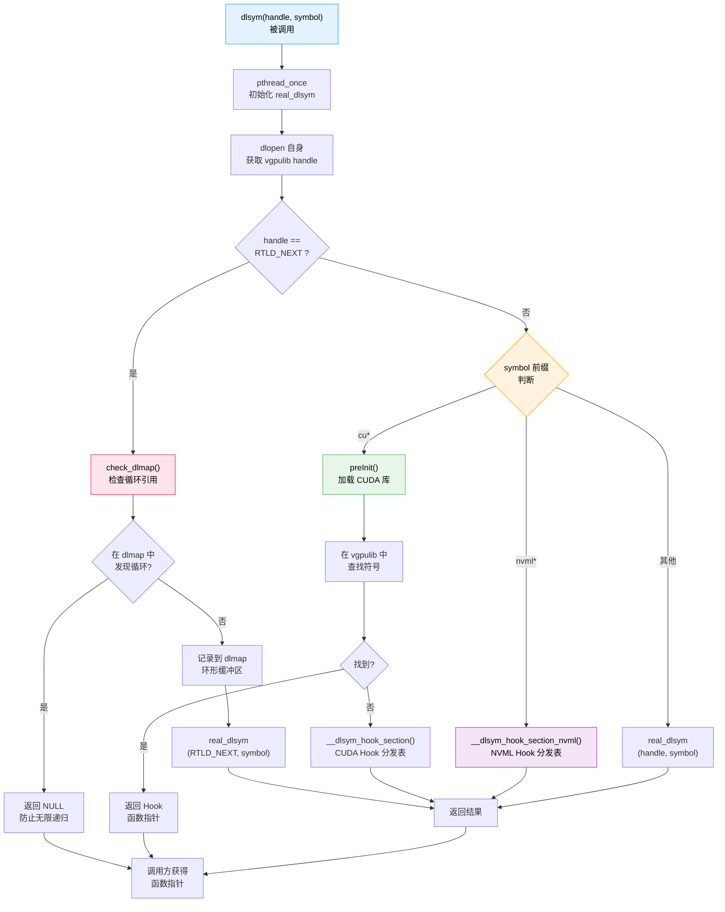

<p align="center">
  
  
  
</p>

---

## 1. 概述

`dlsym` 拦截是 HAMi-core 实现 CUDA API Hook 的核心基础设施。libvgpu.so 通过覆盖 glibc 的 `dlsym()` 函数，在运行时将所有 CUDA 和 NVML 符号查找请求重定向到自定义的 Hook 函数，从而实现对 150+ 个 CUDA Driver API 和 200+ 个 NVML API 的透明拦截。

### 1.1 为什么选择 dlsym 拦截

在 Linux 用户态实现函数 Hook 有多种方案，HAMi-core 选择 dlsym 拦截的核心原因：

| 方案 | 优点 | 缺点 | HAMi-core 适用性 |
|------|------|------|------------------|
| **dlsym 拦截** | 无需修改目标库；对应用完全透明 | 实现复杂度较高 | 最佳方案 |
| GOT/PLT Hook | 针对单一函数效率高 | 需按函数逐一修改 GOT 表 | 不适合 150+ 函数 |
| LD_PRELOAD 直接覆盖 | 实现简单 | 仅覆盖编译时链接的符号，无法拦截 dlsym 动态查找 | 不够全面 |
| ptrace 注入 | 可拦截系统调用 | 性能开销大；不适用于用户态 API | 不适合 |

CUDA 运行时库（libcudart.so）在内部通过 `dlsym()` 动态查找 CUDA Driver API 函数指针。因此，仅覆盖导出符号不够 -- 必须拦截 `dlsym()` 本身，才能控制函数指针的解析结果。

---

## 2. 获取真实 dlsym

要覆盖 `dlsym()` 却又需要使用 `dlsym()` 本身来查找真实的函数指针，这构成了一个经典的"鸡生蛋"问题。HAMi-core 的解决方案是使用 GNU 扩展函数 `dlvsym()` -- 一个带版本参数的 `dlsym` 变体。

### 2.1 dlvsym 与 GLIBC 版本

```c
// libvgpu.c 中的核心逻辑
static void find_real_dlsym() {
    // 通过 dlvsym 获取真实的 dlsym，绕过自身的覆盖
    real_dlsym = dlvsym(RTLD_NEXT, "dlsym", "GLIBC_2.2.5");
}
```

`dlvsym(RTLD_NEXT, "dlsym", "GLIBC_2.2.5")` 的含义：

- `RTLD_NEXT` -- 从当前库之后的下一个库中查找
- `"dlsym"` -- 要查找的符号名
- `"GLIBC_2.2.5"` -- 指定 glibc 版本化符号的版本标签

由于 libvgpu.so 的自定义 `dlsym()` 没有版本标签，而 glibc 的原始 `dlsym()` 带有 `GLIBC_2.2.5` 版本标签，因此 `dlvsym` 能够跳过 libvgpu.so 的覆盖，直接找到 glibc 的原始实现。

### 2.2 多平台适配

不同 CPU 架构和 glibc 版本的版本标签不同，HAMi-core 通过版本数组和降级机制处理：

```c
// 版本号数组，按优先级排列
static const char *glibc_versions[] = {
    "GLIBC_2.2.5",   // x86_64 标准版本
    "GLIBC_2.17",    // arm64 (aarch64) 版本
    "GLIBC_2.0",     // 古老的 32 位系统
    NULL
};

static void find_real_dlsym() {
    for (int i = 0; glibc_versions[i] != NULL; i++) {
        real_dlsym = dlvsym(RTLD_NEXT, "dlsym", glibc_versions[i]);
        if (real_dlsym != NULL) break;
    }
}
```

| 架构 | GLIBC 版本标签 | 说明 |
|------|---------------|------|
| x86_64 | `GLIBC_2.2.5` | 最常见，2001 年引入 |
| aarch64 (ARM64) | `GLIBC_2.17` | ARM64 基线版本 |
| i386 | `GLIBC_2.0` | 32 位兼容 |

---

## 3. 自定义 dlsym 函数

libvgpu.so 通过 `FUNC_ATTR_VISIBLE`（即 `__attribute__((visibility("default")))`）导出自定义的 `dlsym()` 函数，使其在符号解析时优先于 glibc 的原始实现。

### 3.1 完整调用流程

```mermaid
sequenceDiagram
    participant App as ["应用程序"]
    participant VgpuDlsym as ["libvgpu.so
dlsym()"]
    participant Init as ["初始化模块
(pthread_once)"]
    participant VgpuLib as ["vgpulib
(dlopen self)"]
    participant HookCUDA as ["__dlsym_hook_section()"]
    participant HookNVML as ["__dlsym_hook_section_nvml()"]
    participant RealDlsym as ["glibc
real_dlsym()"]

    App->>VgpuDlsym: dlsym(handle, "cuMemAlloc_v2")
    VgpuDlsym->>Init: pthread_once(find_real_dlsym)
    Init-->>VgpuDlsym: real_dlsym 已就绪

    Note over VgpuDlsym: 判断 handle 类型

    alt handle == RTLD_NEXT
        VgpuDlsym->>VgpuDlsym: check_dlmap() 检查递归
        alt 非递归调用
            VgpuDlsym->>RealDlsym: real_dlsym(RTLD_NEXT, symbol)
            RealDlsym-->>VgpuDlsym: 原始函数指针
        else 递归调用
            VgpuDlsym-->>App: 返回 NULL 防止死循环
        end
    else 符号以 "cu" 开头
        VgpuDlsym->>Init: preInit()
        VgpuDlsym->>VgpuLib: dlsym(vgpulib_handle, symbol)
        alt vgpulib 中找到 Hook
            VgpuLib-->>VgpuDlsym: Hook 函数指针
        else 未找到
            VgpuDlsym->>HookCUDA: __dlsym_hook_section(symbol)
            HookCUDA-->>VgpuDlsym: Hook 或 real 函数指针
        end
    else 符号以 "nvml" 开头
        VgpuDlsym->>HookNVML: __dlsym_hook_section_nvml(symbol)
        HookNVML-->>VgpuDlsym: Hook 或 real 函数指针
    else 其他符号
        VgpuDlsym->>RealDlsym: real_dlsym(handle, symbol)
        RealDlsym-->>VgpuDlsym: 原始函数指针
    end

    VgpuDlsym-->>App: 返回函数指针
```

### 3.2 路由逻辑流程图



---

## 4. RTLD_NEXT 处理与递归检测

### 4.1 为什么需要递归检测

当 `handle == RTLD_NEXT` 时，调用方期望获取"下一个"库中的符号。由于 libvgpu.so 的 `dlsym()` 覆盖了 glibc 的 `dlsym()`，如果 libvgpu.so 内部也调用 `dlsym(RTLD_NEXT, ...)`，就会再次进入自身的 `dlsym()` 实现，形成无限递归。

### 4.2 dlmap 环形缓冲区

HAMi-core 使用一个固定大小的环形缓冲区（`dlmap`）来检测递归调用：

```c
#define DLMAP_SIZE 128

static struct {
    void* caller_addr[DLMAP_SIZE];
    int index;
} dlmap;

static int check_dlmap(void* addr) {
    // 检查当前调用地址是否已在 dlmap 中（说明是递归）
    for (int i = 0; i < DLMAP_SIZE; i++) {
        if (dlmap.caller_addr[i] == addr)
            return 1;  // 发现递归
    }
    // 记录当前调用地址
    dlmap.caller_addr[dlmap.index % DLMAP_SIZE] = addr;
    dlmap.index++;
    return 0;  // 非递归
}
```

工作流程：

1. 每次 `dlsym(RTLD_NEXT, ...)` 被调用时，记录调用方地址
2. 如果同一地址再次出现在缓冲区中，判定为递归调用
3. 递归调用直接返回 `NULL`，打断无限循环

---

## 5. CUDA Hook 分发表

### 5.1 DLSYM_HOOK_FUNC 宏

`__dlsym_hook_section()` 函数使用 `DLSYM_HOOK_FUNC` 宏批量定义 Hook 映射表，将 CUDA 符号名映射到对应的 Hook 函数：

```c
// 宏定义
#define DLSYM_HOOK_FUNC(name) \
    if (strcmp(symbol, #name) == 0) { \
        return (void*)hook_##name; \
    }

// 在 __dlsym_hook_section 中展开
void* __dlsym_hook_section(const char* symbol) {
    DLSYM_HOOK_FUNC(cuMemAlloc_v2)       // cuMemAlloc_v2 → hook_cuMemAlloc_v2
    DLSYM_HOOK_FUNC(cuMemFree_v2)        // cuMemFree_v2 → hook_cuMemFree_v2
    DLSYM_HOOK_FUNC(cuMemGetInfo_v2)     // cuMemGetInfo_v2 → hook_cuMemGetInfo_v2
    DLSYM_HOOK_FUNC(cuLaunchKernel)      // cuLaunchKernel → hook_cuLaunchKernel
    DLSYM_HOOK_FUNC(cuDeviceGetCount)    // cuDeviceGetCount → hook_cuDeviceGetCount
    DLSYM_HOOK_FUNC(cuDeviceTotalMem_v2) // cuDeviceTotalMem_v2 → hook_cuDeviceTotalMem_v2
    // ... 150+ 个 Hook 函数

    // 未匹配的符号，回退到真实 dlsym
    return real_dlsym(cuda_handle, symbol);
}
```

### 5.2 关键 Hook 函数分类

| 类别 | 典型 Hook 函数 | 核心作用 |
|------|---------------|----------|
| **显存分配** | `cuMemAlloc_v2`、`cuMemAllocPitch_v2`、`cuMemAllocManaged` | 拦截内存分配，检查配额 |
| **显存释放** | `cuMemFree_v2` | 拦截内存释放，更新使用量 |
| **显存查询** | `cuMemGetInfo_v2`、`cuDeviceTotalMem_v2` | 返回虚拟化后的显存信息 |
| **设备管理** | `cuDeviceGetCount`、`cuDeviceGet` | 隐藏未分配的 GPU 设备 |
| **上下文管理** | `cuCtxCreate_v2`、`cuCtxDestroy_v2` | 追踪上下文生命周期 |
| **Kernel 启动** | `cuLaunchKernel`、`cuLaunchCooperativeKernel` | 插入算力限制（令牌桶） |
| **异步操作** | `cuMemAllocAsync`、`cuMemFreeAsync` | 异步内存操作的配额检查 |
| **虚拟内存** | `cuMemCreate`、`cuMemMap` | CUDA 虚拟内存管理 API Hook |

---

## 6. NVML Hook 分发表

### 6.1 __dlsym_hook_section_nvml

NVML（NVIDIA Management Library）的 Hook 机制与 CUDA 类似，但独立维护一张分发表：

```c
void* __dlsym_hook_section_nvml(const char* symbol) {
    DLSYM_HOOK_FUNC(nvmlDeviceGetMemoryInfo)
    DLSYM_HOOK_FUNC(nvmlDeviceGetMemoryInfo_v2)
    DLSYM_HOOK_FUNC(nvmlDeviceGetCount_v2)
    DLSYM_HOOK_FUNC(nvmlDeviceGetHandleByIndex_v2)
    DLSYM_HOOK_FUNC(nvmlDeviceGetProcessUtilization)
    // ... 200+ 个 NVML Hook

    return real_dlsym(nvml_handle, symbol);
}
```

NVML Hook 的主要目的：

- **nvmlDeviceGetMemoryInfo** -- 返回虚拟化后的显存总量和可用量
- **nvmlDeviceGetCount** -- 返回分配给容器的 GPU 数量
- **nvmlDeviceGetProcessUtilization** -- 用于利用率监控反馈

---

## 7. cuGetProcAddress Hook（CUDA 12+ 适配）

从 CUDA 12 开始，NVIDIA 引入了 `cuGetProcAddress()` 作为新的函数指针获取接口，绕过了传统的 `dlsym()` 查找路径。HAMi-core 需要同时 Hook 这个新接口：

```c
CUresult hook_cuGetProcAddress(const char *symbol,
                                void **pfn,
                                int cudaVersion,
                                cuuint64_t flags) {
    // 首先调用真实的 cuGetProcAddress 获取原始函数指针
    CUresult result = real_cuGetProcAddress(symbol, pfn, cudaVersion, flags);
    if (result != CUDA_SUCCESS) return result;

    // 检查是否有对应的 Hook
    void *hook = __dlsym_hook_section(symbol);
    if (hook != NULL) {
        *pfn = hook;  // 替换为 Hook 函数指针
    }

    return CUDA_SUCCESS;
}
```

这确保了无论应用程序使用 `dlsym()` 还是 `cuGetProcAddress()` 来获取 CUDA 函数指针，HAMi-core 都能进行拦截。

---

## 8. 线程安全

### 8.1 dlsym_lock 互斥锁

由于多个线程可能同时调用 `dlsym()`，HAMi-core 使用 `pthread_mutex_t` 保护关键路径：

```c
static pthread_mutex_t dlsym_lock = PTHREAD_MUTEX_INITIALIZER;

void* dlsym(void* handle, const char* symbol) {
    pthread_mutex_lock(&dlsym_lock);

    // ... 路由逻辑 ...

    pthread_mutex_unlock(&dlsym_lock);
    return result;
}
```

### 8.2 初始化的线程安全

`real_dlsym` 的初始化和 `preInit` / `postInit` 均通过 `pthread_once` 保证只执行一次：

```c
static pthread_once_t dlsym_init_once = PTHREAD_ONCE_INIT;
static pthread_once_t pre_init_once = PTHREAD_ONCE_INIT;
static pthread_once_t post_init_once = PTHREAD_ONCE_INIT;

void* dlsym(void* handle, const char* symbol) {
    pthread_once(&dlsym_init_once, find_real_dlsym);
    // ...
}

CUresult hook_cuInit(unsigned int flags) {
    pthread_once(&pre_init_once, preInit);
    CUresult result = real_cuInit(flags);
    pthread_once(&post_init_once, postInit);
    return result;
}
```

---

## 9. preInit 与 postInit 生命周期

### 9.1 preInit 阶段

`preInit` 在第一个 CUDA 符号被查找时触发，负责准备 Hook 基础设施：

```
preInit()
  ├── load_cuda_libraries()
  │     ├── dlopen("libcuda.so")     → 获取 cuda_handle
  │     ├── dlopen("libnvidia-ml.so") → 获取 nvml_handle
  │     └── 通过 real_dlsym 填充原始函数指针表
  └── ENSURE_INITIALIZED()
        └── 设置内部状态标志
```

### 9.2 postInit 阶段

`postInit` 在 `cuInit()` 执行后触发，完成运行时配置：

```
postInit()
  ├── allocator_init()
  │     └── 初始化内存分配追踪链表
  ├── map_cuda_visible_devices()
  │     └── 解析 CUDA_VISIBLE_DEVICES，建立设备映射表
  ├── set_task_pid()
  │     ├── try_create_shrreg()  → 创建/加入共享内存区域
  │     └── init_proc_slot_withlock() → 注册进程槽位
  └── init_utilization_watcher()
        └── pthread_create(utilization_watcher) → 启动后台监控线程
```

---

## 10. 调试与排障

### 10.1 常见问题

| 问题现象 | 可能原因 | 排查方法 |
|----------|----------|----------|
| CUDA 程序正常运行，未被限制 | libvgpu.so 未成功加载 | 检查 `LD_PRELOAD` 环境变量和文件路径 |
| 程序启动时 segfault | real_dlsym 获取失败 | 检查 glibc 版本是否匹配 |
| 部分 CUDA API 未被拦截 | cuGetProcAddress 绕过 | 确认 CUDA 12+ 的 Hook 已启用 |
| 多线程程序死锁 | dlsym_lock 竞争 | 检查是否有嵌套的 dlsym 调用 |

### 10.2 调试环境变量

| 环境变量 | 说明 |
|----------|------|
| `LD_DEBUG=bindings` | 查看动态链接器的符号绑定过程 |
| `LD_DEBUG=libs` | 查看共享库的加载顺序 |

---

## 11. 本章小结

HAMi-core 的 dlsym Hook 机制是整个 GPU 虚拟化拦截层的基石。它通过以下关键技术实现了对 CUDA 生态的全面覆盖：

1. **dlvsym 版本化查找** -- 解决"用 dlsym 覆盖 dlsym"的鸡蛋问题
2. **前缀路由分发** -- "cu" 前缀走 CUDA Hook 表，"nvml" 前缀走 NVML Hook 表
3. **环形缓冲区递归检测** -- 防止 RTLD_NEXT 场景下的无限递归
4. **cuGetProcAddress 双重拦截** -- 适配 CUDA 12+ 的新符号查找接口
5. **pthread_once 一次性初始化** -- 保证多线程环境下的正确性

理解了 dlsym Hook 机制后，后续章节中所有 CUDA API 拦截（显存分配、Kernel 启动、设备查询等）的实现原理都建立在此基础之上。

---

<p align="center">
  <sub>HAMi-core Technical Documentation &mdash; dlsym Hooking Deep Dive</sub>
</p>
