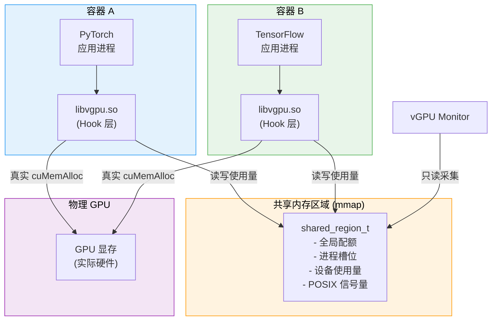
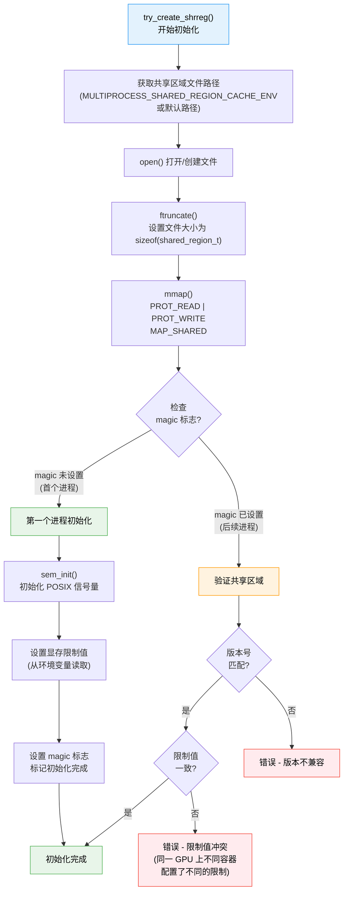
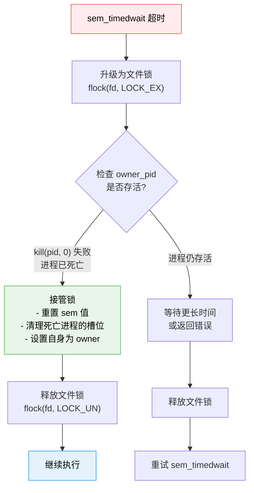
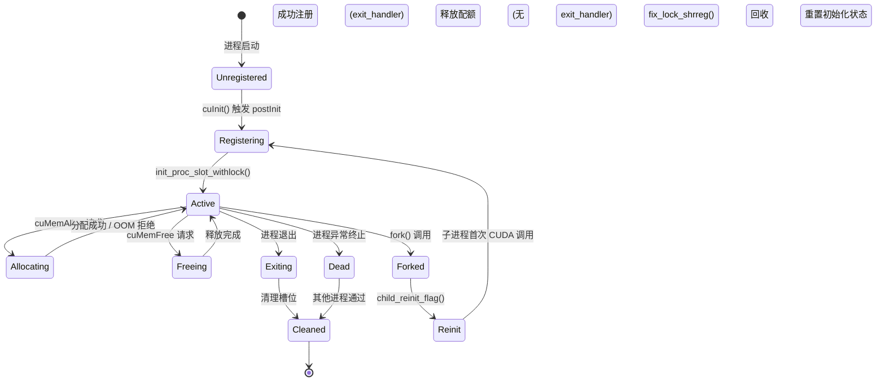
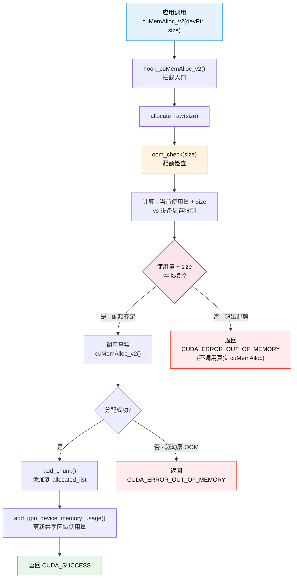
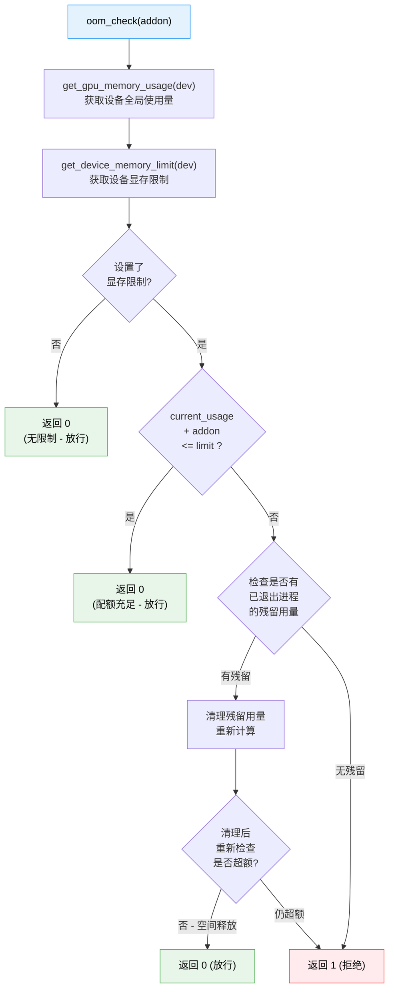

<p align="center">
  
  
  
</p>

---

## 1. 概述

显存隔离是 HAMi-core 最核心的能力之一。在多个容器共享同一块物理 GPU 的场景下，每个容器只能使用被分配的显存配额，超出配额的分配请求将被拒绝，从而避免单个容器耗尽整块 GPU 的显存。

### 1.1 设计目标

- **硬隔离** -- 严格执行显存配额，拒绝超额分配
- **多进程感知** -- 同一 GPU 上所有使用 libvgpu.so 的进程共享同一份使用量账本
- **透明性** -- 应用程序通过 `cuMemGetInfo` 查询到的显存总量和可用量与配额一致
- **容错性** -- 进程异常退出时自动回收其占用的配额

### 1.2 核心组件关系



---

## 2. 环境变量配置

### 2.1 显存限制配置

| 环境变量 | 格式 | 示例 | 说明 |
|----------|------|------|------|
| `CUDA_DEVICE_MEMORY_LIMIT` | `<数值><单位>` | `4G`、`2048M`、`512000K` | 全局显存限制，应用到所有设备 |
| `CUDA_DEVICE_MEMORY_LIMIT_0` | `<数值><单位>` | `2G` | 第 0 号设备的独立限制 |
| `CUDA_DEVICE_MEMORY_LIMIT_1` | `<数值><单位>` | `4096M` | 第 1 号设备的独立限制 |
| `CUDA_DEVICE_MEMORY_LIMIT_N` | `<数值><单位>` | `1G` | 第 N 号设备的独立限制 |

### 2.2 解析逻辑

`get_limit_from_env()` 函数负责解析显存限制值：

```c
uint64_t get_limit_from_env(const char *env_str) {
    // 支持的单位后缀
    // G / g → × 1024 × 1024 × 1024
    // M / m → × 1024 × 1024
    // K / k → × 1024
    // 无后缀 → 字节

    char *endptr;
    uint64_t value = strtoull(env_str, &endptr, 10);

    switch (*endptr) {
        case 'G': case 'g': value *= 1024 * 1024 * 1024; break;
        case 'M': case 'm': value *= 1024 * 1024; break;
        case 'K': case 'k': value *= 1024; break;
    }
    return value;
}
```

### 2.3 多设备限制初始化

`do_init_device_memory_limits()` 按以下优先级设置每个设备的显存限制：

1. 优先使用设备专属环境变量 `CUDA_DEVICE_MEMORY_LIMIT_N`
2. 如未设置，回退到全局 `CUDA_DEVICE_MEMORY_LIMIT`
3. 如全局也未设置，不施加限制（使用物理显存总量）

---

## 3. 共享内存区域

### 3.1 设计动机

同一块 GPU 可能被多个容器的多个进程同时使用。为了实现跨进程的全局显存记账，HAMi-core 使用文件支撑的 `mmap` 共享内存区域作为进程间通信（IPC）机制。

### 3.2 初始化流程

`try_create_shrreg()` 负责创建或加入共享内存区域：



### 3.3 共享区域数据布局

```
+─────────────────────────────────────────────────────────+
│                  shared_region_t                         │
├─────────────────────────────────────────────────────────┤
│  magic          : int          (初始化标志)              │
│  version        : int          (协议版本号)              │
│  sem            : sem_t        (POSIX 信号量)           │
│  owner_pid      : pid_t        (当前锁持有者)            │
│  proc_num       : int          (已注册进程数)            │
│  global_limit   : uint64_t     (全局显存限制)            │
├─────────────────────────────────────────────────────────┤
│  procs[0]       : shrreg_proc_slot_t  (进程槽位 0)      │
│    ├── pid      : pid_t                                  │
│    ├── status   : int                                    │
│    ├── used_mem : uint64_t                               │
│    └── devices[0..N] : device_proc_info_t               │
│         ├── context_memory : uint64_t                    │
│         ├── module_memory  : uint64_t                    │
│         └── data_memory    : uint64_t                    │
├─────────────────────────────────────────────────────────┤
│  procs[1]       : shrreg_proc_slot_t  (进程槽位 1)      │
│  ...                                                     │
│  procs[MAX-1]   : shrreg_proc_slot_t                    │
├─────────────────────────────────────────────────────────┤
│  device_memory[0] : device_memory_t   (设备 0 全局视图)  │
│    ├── total_memory : uint64_t                           │
│    ├── limit        : uint64_t                           │
│    └── used         : uint64_t                           │
│  device_memory[1] : device_memory_t                      │
│  ...                                                     │
+─────────────────────────────────────────────────────────+
```

---

## 4. 锁机制

### 4.1 POSIX 信号量

共享内存区域使用 POSIX 信号量（`sem_t`）进行互斥保护。所有读写共享区域的操作都必须先获取信号量锁：

```c
void lock_shrreg() {
    struct timespec timeout;
    clock_gettime(CLOCK_REALTIME, &timeout);
    timeout.tv_sec += LOCK_TIMEOUT_SECONDS;  // 通常 5 秒超时

    int ret = sem_timedwait(&shared_region->sem, &timeout);
    if (ret == -1 && errno == ETIMEDOUT) {
        // 超时 - 尝试修复死锁
        fix_lock_shrreg();
    }
    shared_region->owner_pid = getpid();
}

void unlock_shrreg() {
    shared_region->owner_pid = 0;
    sem_post(&shared_region->sem);
}
```

### 4.2 死锁检测与恢复

`fix_lock_shrreg()` 处理锁持有者异常退出导致的死锁：



### 4.3 双层锁机制设计

| 锁层级 | 类型 | 作用 |
|--------|------|------|
| **第一层** | POSIX 信号量 (`sem_t`) | 常规互斥，快速路径 |
| **第二层** | 文件锁 (`flock`) | 死锁恢复时的升级锁，确保恢复操作的原子性 |

这种双层设计的好处是：正常情况下使用轻量级的信号量，只有在检测到潜在死锁时才升级到文件锁进行恢复。

---

## 5. 进程槽位管理

### 5.1 注册流程

`init_proc_slot_withlock()` 在进程首次使用 CUDA 时将其注册到共享区域：

```c
void init_proc_slot_withlock() {
    lock_shrreg();

    pid_t my_pid = getpid();

    // 查找空闲槽位
    for (int i = 0; i < MAX_PROCS; i++) {
        if (shared_region->procs[i].pid == 0) {
            // 找到空闲槽位
            shared_region->procs[i].pid = my_pid;
            shared_region->procs[i].status = ACTIVE;
            shared_region->procs[i].used_memory = 0;
            shared_region->proc_num++;
            break;
        }
    }

    unlock_shrreg();
}
```

### 5.2 进程生命周期状态图



### 5.3 内存使用类型

每个进程在每个设备上的显存使用量按三种类型分别统计：

| 类型 | 说明 | 典型来源 |
|------|------|----------|
| **context** | CUDA 上下文占用的显存 | `cuCtxCreate()` 创建上下文时自动分配的内存 |
| **module** | 加载 CUDA 模块占用的显存 | `cuModuleLoad()` 加载 PTX/CUBIN 代码 |
| **data** | 用户数据占用的显存 | `cuMemAlloc()`、`cuMemAllocManaged()` 等 |

```c
void add_gpu_device_memory_usage(pid_t pid, int dev, uint64_t usage, int type) {
    lock_shrreg();

    shrreg_proc_slot_t *slot = find_proc_slot(pid);
    switch (type) {
        case MEMORY_TYPE_CONTEXT:
            slot->devices[dev].context_memory += usage;
            break;
        case MEMORY_TYPE_MODULE:
            slot->devices[dev].module_memory += usage;
            break;
        case MEMORY_TYPE_DATA:
            slot->devices[dev].data_memory += usage;
            break;
    }
    slot->devices[dev].total_used =
        slot->devices[dev].context_memory +
        slot->devices[dev].module_memory +
        slot->devices[dev].data_memory;

    unlock_shrreg();
}
```

---

## 6. 显存分配拦截链路

### 6.1 cuMemAlloc_v2 完整链路



### 6.2 OOM 检查详解

`oom_check()` 是显存隔离的核心判断函数：

```c
int oom_check(uint64_t addon) {
    // 获取当前设备的全局使用量（所有进程之和）
    uint64_t current_usage = get_gpu_memory_usage(current_device);

    // 获取当前设备的显存限制
    uint64_t limit = get_device_memory_limit(current_device);

    // 判断是否超额
    if (current_usage + addon > limit) {
        return 1;  // OOM - 拒绝分配
    }
    return 0;  // OK - 允许分配
}
```

OOM 检查决策树：



---

## 7. 显存释放拦截链路

### 7.1 cuMemFree_v2 链路

```c
CUresult hook_cuMemFree_v2(CUdeviceptr dptr) {
    // 1. 在 allocated_list 中查找该地址
    allocated_list_entry *entry = find_chunk(dptr);

    if (entry != NULL) {
        uint64_t size = entry->size;
        int type = entry->type;

        // 2. 调用真实的 cuMemFree
        CUresult result = real_cuMemFree_v2(dptr);

        if (result == CUDA_SUCCESS) {
            // 3. 从 allocated_list 中移除
            remove_chunk(dptr);

            // 4. 更新共享区域使用量
            rm_gpu_device_memory_usage(getpid(), current_device, size, type);
        }

        return result;
    }

    // 未在追踪列表中 - 直接调用真实函数
    return real_cuMemFree_v2(dptr);
}
```

---

## 8. cuMemGetInfo_v2 虚拟化

`cuMemGetInfo_v2` 是应用程序查询 GPU 显存信息的主要接口。HAMi-core 对其进行 Hook，返回虚拟化后的显存数据：

```c
CUresult hook_cuMemGetInfo_v2(size_t *free, size_t *total) {
    // 获取配额限制
    uint64_t limit = get_device_memory_limit(current_device);

    // 获取当前使用量
    uint64_t used = get_gpu_memory_usage(current_device);

    // 返回虚拟化后的数据
    *total = limit;                                     // 总量 = 配额
    *free  = (limit > used) ? (limit - used) : 0;     // 可用 = 配额 - 已用

    return CUDA_SUCCESS;
}
```

效果示例：

| 场景 | 物理显存 | 配额限制 | 已用量 | cuMemGetInfo 返回的 total | cuMemGetInfo 返回的 free |
|------|----------|----------|--------|--------------------------|--------------------------|
| 容器 A | 24GB | 4GB | 1GB | **4GB** | **3GB** |
| 容器 B | 24GB | 8GB | 6GB | **8GB** | **2GB** |
| 无限制容器 | 24GB | 未设置 | 10GB | 24GB | 14GB |

这确保了应用程序（如 PyTorch）在查询可用显存时获得与配额一致的信息，从而做出正确的内存分配决策。

---

## 9. 异步分配处理

### 9.1 cuMemAllocAsync

CUDA 11.2+ 引入了异步内存分配接口 `cuMemAllocAsync`，使用内存池（Memory Pool）机制。HAMi-core 需要特殊处理：

```c
CUresult hook_cuMemAllocAsync(CUdeviceptr *dptr, size_t bytesize,
                               CUstream hStream) {
    // OOM 检查（与同步路径相同）
    if (oom_check(bytesize)) {
        return CUDA_ERROR_OUT_OF_MEMORY;
    }

    // 调用真实的异步分配
    CUresult result = real_cuMemAllocAsync(dptr, bytesize, hStream);

    if (result == CUDA_SUCCESS) {
        // 记录分配（注意：异步分配的实际时机可能延迟）
        add_chunk(*dptr, bytesize, MEMORY_TYPE_DATA);
        add_gpu_device_memory_usage(getpid(), current_device,
                                     bytesize, MEMORY_TYPE_DATA);
    }

    return result;
}
```

### 9.2 异步与同步分配的差异

| 特性 | 同步分配 (`cuMemAlloc`) | 异步分配 (`cuMemAllocAsync`) |
|------|------------------------|----------------------------|
| 内存来源 | 直接从驱动分配 | 从 Memory Pool 分配 |
| 分配时机 | 立即 | 可能延迟到 Stream 执行时 |
| OOM 检查 | 请求时立即检查 | 请求时立即检查（保守策略） |
| 内存池复用 | 不涉及 | Pool 中的空闲块可复用 |

---

## 10. Fork 处理

### 10.1 问题场景

当容器进程调用 `fork()` 创建子进程时，子进程继承了父进程的内存映射，但 CUDA 上下文和共享区域的状态不能简单继承 -- 子进程需要重新初始化。

### 10.2 pthread_atfork 机制

```c
// 在初始化时注册 fork 处理器
pthread_atfork(NULL, NULL, child_reinit_flag);

void child_reinit_flag() {
    // 在子进程中：重置初始化状态
    // 这样子进程的第一次 CUDA 调用会触发完整的初始化流程
    init_status = UNINITIALIZED;

    // 注意：不清理父进程的共享区域槽位
    // 父进程的槽位由父进程自身管理
}
```

---

## 11. 退出处理

### 11.1 exit_handler

当进程正常退出时，`exit_handler()` 负责清理共享区域中该进程的槽位：

```c
void exit_handler() {
    struct timespec timeout;
    clock_gettime(CLOCK_REALTIME, &timeout);
    timeout.tv_sec += EXIT_LOCK_TIMEOUT;  // 退出时的锁超时

    int ret = sem_timedwait(&shared_region->sem, &timeout);
    if (ret == 0) {
        // 成功获取锁
        pid_t my_pid = getpid();

        // 查找并清理自己的槽位
        for (int i = 0; i < MAX_PROCS; i++) {
            if (shared_region->procs[i].pid == my_pid) {
                // 释放该进程在所有设备上的使用量
                memset(&shared_region->procs[i], 0,
                       sizeof(shrreg_proc_slot_t));
                shared_region->proc_num--;
                break;
            }
        }

        sem_post(&shared_region->sem);
    }
    // 如果获取锁超时，放弃清理
    // 后续其他进程会通过 fix_lock_shrreg 回收
}
```

### 11.2 信号处理

HAMi-core 注册了两个信号处理器，用于外部控制：

| 信号 | 处理函数 | 作用 |
|------|----------|------|
| `SIGUSR1` | `sig_restore_stub` | 设置 status=1，恢复正常运行 |
| `SIGUSR2` | `sig_swap_stub` | 设置 status=2，触发特定行为 |

这些信号由 vGPU Monitor 或管理工具发送，用于动态调整容器的运行状态。

---

## 12. 全局显存使用量查询

`get_gpu_memory_usage()` 汇总指定设备上所有进程的显存使用量：

```c
uint64_t get_gpu_memory_usage(int device_id) {
    uint64_t total_used = 0;

    lock_shrreg();

    for (int i = 0; i < MAX_PROCS; i++) {
        if (shared_region->procs[i].pid != 0 &&
            shared_region->procs[i].status == ACTIVE) {
            total_used += shared_region->procs[i]
                          .devices[device_id].total_used;
        }
    }

    unlock_shrreg();
    return total_used;
}
```

这个函数被以下场景调用：

- `oom_check()` -- 判断新的分配请求是否超额
- `hook_cuMemGetInfo_v2()` -- 计算虚拟化后的可用显存
- vGPU Monitor -- 采集监控指标

---

## 13. 本章小结

HAMi-core 的显存隔离机制通过以下关键设计实现了多容器环境下的 GPU 显存硬隔离：

| 设计要素 | 实现方案 | 设计理由 |
|----------|----------|----------|
| **跨进程记账** | 文件支撑的 mmap 共享内存 | 支持多容器、多进程共享同一份数据 |
| **互斥保护** | POSIX 信号量 + 文件锁降级 | 轻量级快速路径 + 死锁恢复能力 |
| **配额执行** | cuMemAlloc 前置 OOM 检查 | 在真实分配之前拒绝超额请求 |
| **透明虚拟化** | cuMemGetInfo 返回虚拟值 | 应用程序感知的显存与配额一致 |
| **容错恢复** | exit_handler + 死锁进程检测 | 异常退出不会导致配额永久泄漏 |
| **分类记账** | context / module / data 三类 | 精细化追踪不同来源的显存消耗 |

---

<p align="center">
  <sub>HAMi-core Technical Documentation &mdash; Memory Isolation Deep Dive</sub>
</p>
