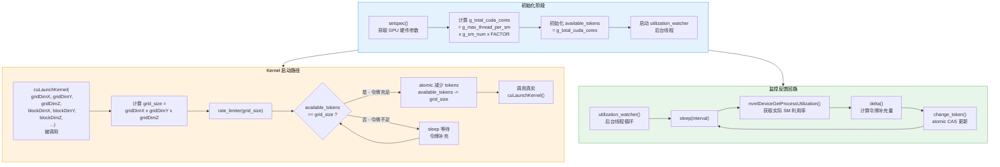
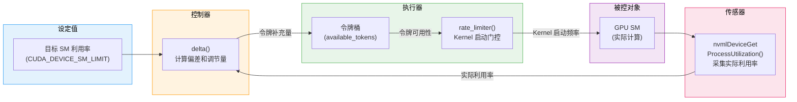
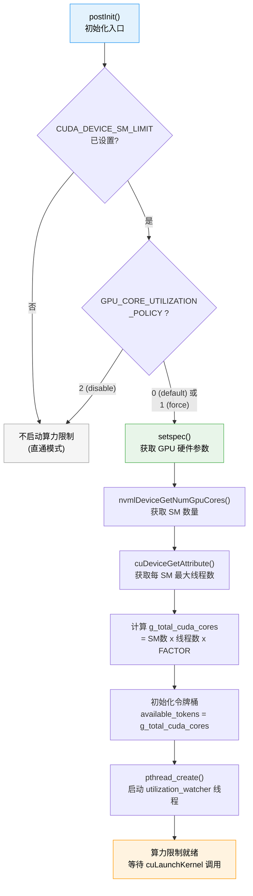

<p align="center">
  
  
  
</p>

---

## 1. 概述

算力隔离（也称"算力限制"或"SM 利用率限制"）是 HAMi-core 除显存隔离之外的另一核心能力。它通过 **令牌桶算法（Token Bucket Algorithm）** 控制每个容器可以启动的 CUDA Kernel 数量，配合 **NVML 反馈回路** 动态调整令牌补充速率，从而将容器对 GPU SM（Streaming Multiprocessor）的利用率限制在目标百分比之内。

### 1.1 设计挑战

GPU 算力限制与 CPU 限制有本质区别：

| 维度 | CPU 限制 (cgroup) | GPU 算力限制 (HAMi-core) |
|------|-------------------|--------------------------|
| 执行位置 | 内核态调度器 | 用户态 Hook |
| 控制粒度 | 时间片 (CFS 周期) | Kernel 启动频率 |
| 硬件支持 | cgroup v2 原生支持 | 无硬件级支持（MIG 除外） |
| 精确度 | 高（内核态强制） | 中（基于采样的反馈调节） |
| 延迟影响 | 低 | 可能引入 Kernel 启动延迟 |

HAMi-core 选择在 `cuLaunchKernel` 调用前插入限流逻辑 -- 当可用令牌不足时，暂停当前线程直到令牌被补充，从而降低 Kernel 实际启动频率，间接降低 SM 利用率。

---

## 2. 环境变量配置

### 2.1 算力限制相关环境变量

| 环境变量 | 取值范围 | 默认值 | 说明 |
|----------|----------|--------|------|
| `CUDA_DEVICE_SM_LIMIT` | 0 - 100 | 0（不限制） | SM 利用率上限百分比 |
| `GPU_CORE_UTILIZATION_POLICY` | 0, 1, 2 | 0 | 算力限制策略 |

### 2.2 GPU_CORE_UTILIZATION_POLICY 详解

`set_env_utilization_switch()` 函数解析此环境变量：

| 值 | 策略名称 | 行为描述 |
|----|----------|----------|
| **0** | default（默认） | 正常模式 - 当 `CUDA_DEVICE_SM_LIMIT > 0` 时启用算力限制 |
| **1** | force（强制） | 强制启用算力限制，即使利用率未达上限也保持限速 |
| **2** | disable（禁用） | 完全禁用算力限制，忽略 `CUDA_DEVICE_SM_LIMIT` 设置 |

---

## 3. 令牌桶算法

### 3.1 核心思想

令牌桶算法是网络流量整形中的经典算法。HAMi-core 将其应用于 GPU Kernel 启动控制：

- **令牌** = 可以启动的 CUDA Core 工作量（按 grid_size 计）
- **令牌桶** = 当前可用的令牌总量
- **令牌消耗** = 每次 `cuLaunchKernel` 消耗的令牌数 = Kernel 的 gridDimX * gridDimY * gridDimZ
- **令牌补充** = 后台线程根据实际利用率定期向桶中添加令牌

### 3.2 初始化 - setspec()

`setspec()` 函数在初始化阶段获取 GPU 硬件参数，计算令牌桶的容量基准：

```c
void setspec() {
    // 通过 NVML 获取 GPU 的 SM 数量
    nvmlDeviceGetNumGpuCores(&g_sm_num);

    // 通过 CUDA API 获取每个 SM 的最大线程数
    cuDeviceGetAttribute(&g_max_thread_per_sm,
                         CU_DEVICE_ATTRIBUTE_MAX_THREADS_PER_MULTIPROCESSOR,
                         device);

    // 计算总 CUDA Core 数量（令牌桶容量基准）
    g_total_cuda_cores = g_max_thread_per_sm * g_sm_num * FACTOR;

    // 初始化令牌桶
    available_tokens = g_total_cuda_cores;
}
```

其中 `FACTOR` 是一个调节因子，控制令牌桶的灵敏度。

### 3.3 完整算法流程



---

## 4. rate_limiter() - 限流器

`rate_limiter()` 是算力限制的核心执行函数，在每次 `cuLaunchKernel` 调用之前被调用：

### 4.1 实现逻辑

```c
void rate_limiter(int grid_size) {
    // 如果未设置 SM 限制，直接返回
    if (target_sm_utilization == 0) return;

    // 如果策略为 disable，直接返回
    if (utilization_policy == POLICY_DISABLE) return;

    while (1) {
        int64_t current = atomic_load(&available_tokens);

        if (current >= grid_size) {
            // 尝试原子减少令牌
            if (atomic_compare_exchange_strong(&available_tokens,
                                               &current,
                                               current - grid_size)) {
                return;  // 成功获取令牌，允许 Kernel 启动
            }
            // CAS 失败，重试
            continue;
        }

        // 令牌不足，等待补充
        usleep(RATE_LIMITER_SLEEP_US);  // 短暂休眠
    }
}
```

### 4.2 令牌消耗计算

每次 `cuLaunchKernel` 消耗的令牌数取决于 Kernel 的 Grid 大小：

```
grid_size = gridDimX * gridDimY * gridDimZ
```

| Kernel 规模 | gridDim 示例 | 消耗令牌 | 说明 |
|-------------|-------------|----------|------|
| 小型 Kernel | (32, 1, 1) | 32 | 轻量级操作（如 elementwise） |
| 中型 Kernel | (256, 1, 1) | 256 | 常见计算（如矩阵运算） |
| 大型 Kernel | (1024, 64, 1) | 65536 | 大规模并行（如卷积） |

Grid 越大的 Kernel 消耗越多令牌，因此自然地会被更频繁地限流，这符合"大 Kernel 占用更多 SM"的直觉。

---

## 5. utilization_watcher() - 利用率监控线程

### 5.1 工作原理

`utilization_watcher()` 是一个后台 pthread 线程，负责定期采集 GPU 实际利用率，并据此调整令牌补充速率：

```mermaid
sequenceDiagram
    participant Watcher as ["utilization_watcher
(后台线程)"]
    participant NVML as ["NVML API"]
    participant TokenBucket as ["令牌桶
(available_tokens)"]
    participant SharedRegion as ["共享内存区域"]

    loop 每个监控周期
        Watcher->>Watcher: sleep(monitoring_interval)
        Watcher->>NVML: nvmlDeviceGetProcessUtilization()
        NVML-->>Watcher: actual_sm_utilization (%)
        Watcher->>Watcher: delta(actual, target)
计算令牌补充量
        Watcher->>TokenBucket: change_token(replenishment)
atomic CAS 更新
        Watcher->>SharedRegion: 更新利用率记录
(供 Monitor 采集)
    end
```

### 5.2 delta() - 令牌补充计算

`delta()` 函数是反馈控制的核心，它根据目标利用率和实际利用率的差值来决定令牌补充量：

```c
int64_t delta(int actual_utilization, int target_utilization) {
    int diff = target_utilization - actual_utilization;

    // 基础补充量 = 总核心数的一个比例
    int64_t base = g_total_cuda_cores / REPLENISH_DIVISOR;

    if (diff > 0) {
        // 实际利用率 < 目标 → 增加令牌（加速）
        return base * (1 + diff / SCALE_FACTOR);
    } else if (diff < 0) {
        // 实际利用率 > 目标 → 减少令牌甚至不补充（减速）
        return base * diff / SCALE_FACTOR;  // 可能为负数
    } else {
        // 恰好达标 → 正常补充
        return base;
    }
}
```

反馈控制的效果：

| 场景 | actual vs target | delta 输出 | 效果 |
|------|-----------------|------------|------|
| 实际利用率远低于目标 | 10% vs 50% | 大正数 | 大量补充令牌，加速 Kernel 启动 |
| 实际利用率略低于目标 | 45% vs 50% | 小正数 | 少量补充，微调 |
| 实际利用率等于目标 | 50% vs 50% | 基准值 | 稳态维持 |
| 实际利用率略高于目标 | 55% vs 50% | 小负数或零 | 减少补充，轻微抑制 |
| 实际利用率远高于目标 | 80% vs 50% | 大负数 | 停止补充甚至减少令牌，强力抑制 |

### 5.3 change_token() - 原子更新

令牌更新使用 CAS（Compare-And-Swap）原子操作，保证多线程安全：

```c
void change_token(int64_t adjustment) {
    while (1) {
        int64_t current = atomic_load(&available_tokens);
        int64_t new_value = current + adjustment;

        // 限制令牌上限，防止累积过多
        if (new_value > g_total_cuda_cores) {
            new_value = g_total_cuda_cores;
        }
        // 限制令牌下限
        if (new_value < 0) {
            new_value = 0;
        }

        if (atomic_compare_exchange_strong(&available_tokens,
                                           &current, new_value)) {
            return;  // CAS 成功
        }
        // CAS 失败，重试
    }
}
```

---

## 6. cuLaunchKernel Hook

### 6.1 拦截入口

`cuLaunchKernel` 是 CUDA 启动计算 Kernel 的主要接口。HAMi-core 的 Hook 在调用真实函数之前插入限流逻辑：

```c
CUresult hook_cuLaunchKernel(
    CUfunction f,
    unsigned int gridDimX, unsigned int gridDimY, unsigned int gridDimZ,
    unsigned int blockDimX, unsigned int blockDimY, unsigned int blockDimZ,
    unsigned int sharedMemBytes,
    CUstream hStream,
    void **kernelParams,
    void **extra)
{
    // 1. 计算 grid 大小
    int grid_size = gridDimX * gridDimY * gridDimZ;

    // 2. 调用限流器（可能会阻塞等待令牌）
    rate_limiter(grid_size);

    // 3. 记录 Kernel 启动时间（用于利用率计算）
    record_kernel_launch_time();

    // 4. 调用真实的 cuLaunchKernel
    return real_cuLaunchKernel(f,
        gridDimX, gridDimY, gridDimZ,
        blockDimX, blockDimY, blockDimZ,
        sharedMemBytes, hStream,
        kernelParams, extra);
}
```

### 6.2 同类 Hook

除 `cuLaunchKernel` 外，以下 Kernel 启动接口也被 Hook 并插入限流逻辑：

| Hook 函数 | 说明 |
|-----------|------|
| `cuLaunchKernel` | 标准 Kernel 启动 |
| `cuLaunchCooperativeKernel` | 协作 Kernel 启动 |
| `cuLaunchKernelEx` | 扩展 Kernel 启动（CUDA 11.7+） |

---

## 7. NVML 反馈回路

### 7.1 利用率采集

`utilization_watcher` 通过 NVML API 采集 GPU 的实际 SM 利用率：

```c
// 获取进程级别的利用率信息
nvmlReturn_t nvmlDeviceGetProcessUtilization(
    nvmlDevice_t device,
    nvmlProcessUtilizationSample_t *utilization,
    unsigned int *processSamplesCount,
    unsigned long long lastSeenTimeStamp
);

// 返回结构体
typedef struct {
    unsigned int pid;           // 进程 PID
    unsigned long long timeStamp;
    unsigned int smUtil;        // SM 利用率百分比 (0-100)
    unsigned int memUtil;       // 显存带宽利用率
    unsigned int encUtil;       // 编码器利用率
    unsigned int decUtil;       // 解码器利用率
} nvmlProcessUtilizationSample_t;
```

### 7.2 反馈控制闭环

整个算力隔离形成一个经典的**闭环控制系统**：



---

## 8. 算力隔离初始化流程



---

## 9. 共享内存中的利用率追踪

### 9.1 进程级利用率数据

利用率监控数据存储在共享内存区域中，供 vGPU Monitor 采集：

```c
// 在共享区域的进程槽位中记录利用率
typedef struct {
    pid_t pid;
    int target_sm_util;      // 目标利用率（配置值）
    int actual_sm_util;       // 实际利用率（NVML 采集）
    int64_t available_tokens; // 当前可用令牌
    uint64_t kernel_count;    // 累计 Kernel 启动次数
    uint64_t throttle_count;  // 累计被限流次数
} utilization_info_t;
```

### 9.2 监控指标

vGPU Monitor 从共享区域读取以下算力相关指标：

| 指标 | 类型 | 说明 |
|------|------|------|
| `target_sm_utilization` | Gauge | 目标 SM 利用率 |
| `actual_sm_utilization` | Gauge | 实际 SM 利用率 |
| `kernel_launch_total` | Counter | Kernel 启动总次数 |
| `kernel_throttle_total` | Counter | 被限流的 Kernel 次数 |
| `available_tokens` | Gauge | 当前令牌桶中的可用令牌 |

---

## 10. 算力隔离的局限性与权衡

### 10.1 与硬件级方案的对比

| 特性 | HAMi-core 软件限制 | NVIDIA MIG |
|------|-------------------|------------|
| 粒度 | 1% - 100% | 固定分区（如 1/7, 2/7, 3/7） |
| 灵活性 | 高（任意百分比） | 低（预定义分区） |
| 隔离强度 | 中（尽力限制） | 高（硬件级隔离） |
| 适用 GPU | 所有 NVIDIA GPU | Ampere 及更新架构 |
| 动态调整 | 支持运行时调整 | 需要重新配置分区 |
| 显存隔离 | 独立实现 | MIG 硬件保证 |
| 故障域隔离 | 无 | 完全隔离 |

### 10.2 精度考量

令牌桶算法的精度受以下因素影响：

1. **采样间隔** -- NVML 利用率采集存在延迟，导致反馈控制存在滞后
2. **Kernel 粒度** -- 单个 Kernel 的执行时间可能超过控制周期
3. **突发负载** -- 短时间内大量 Kernel 启动可能突破瞬时限制
4. **多进程竞争** -- 多个进程共享令牌桶时可能出现不均匀分配

### 10.3 最佳实践

| 场景 | 推荐配置 | 理由 |
|------|----------|------|
| 推理服务（延迟敏感） | `CUDA_DEVICE_SM_LIMIT=50-70` | 预留 headroom 避免限流引入延迟 |
| 训练任务（吞吐优先） | `CUDA_DEVICE_SM_LIMIT=80-100` | 最大化利用率 |
| 开发调试 | `CUDA_DEVICE_SM_LIMIT=20-30` | 低配额节省资源 |
| 不需要算力限制 | `GPU_CORE_UTILIZATION_POLICY=2` | 禁用限制，零额外开销 |

---

## 11. 本章小结

HAMi-core 的算力隔离机制通过以下三个核心组件协同工作，实现了用户态的 GPU 算力限制：

| 组件 | 角色 | 关键技术 |
|------|------|----------|
| **rate_limiter()** | 执行器 | 令牌桶 + 原子操作（CAS） |
| **utilization_watcher()** | 传感器 + 控制器 | NVML 采集 + PID 反馈控制 |
| **cuLaunchKernel Hook** | 入口点 | dlsym 拦截 + grid_size 计算 |

整个设计形成了一个闭环控制系统：

1. **设定目标** -- 通过环境变量设定目标 SM 利用率
2. **Gate 控制** -- `rate_limiter()` 在 Kernel 启动前检查令牌
3. **实际执行** -- 令牌充足时允许 Kernel 启动
4. **反馈采集** -- `utilization_watcher()` 通过 NVML 采集实际利用率
5. **动态调节** -- `delta()` 根据偏差调整令牌补充量
6. **回到第 2 步** -- 持续循环

这种设计在无硬件支持的情况下，以较低的额外开销实现了可接受精度的 GPU 算力隔离，是对 NVIDIA MIG 等硬件方案的有效软件补充。

---

<p align="center">
  <sub>HAMi-core Technical Documentation &mdash; Compute Isolation Deep Dive</sub>
</p>
