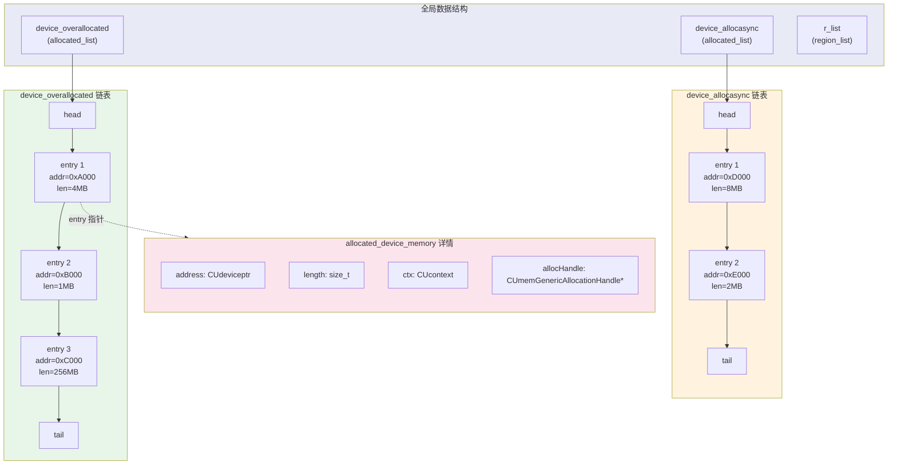
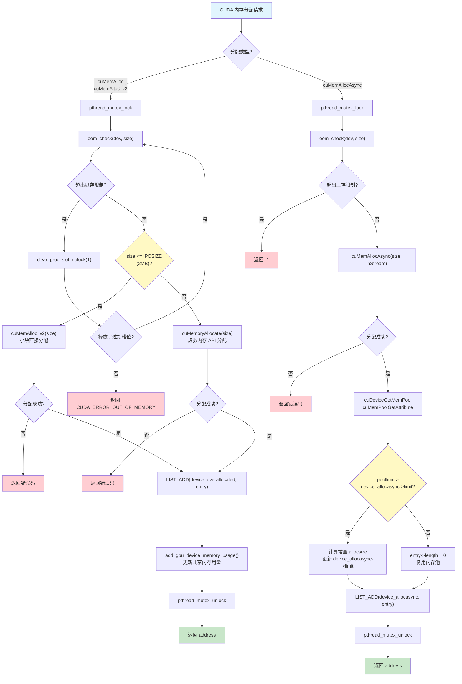
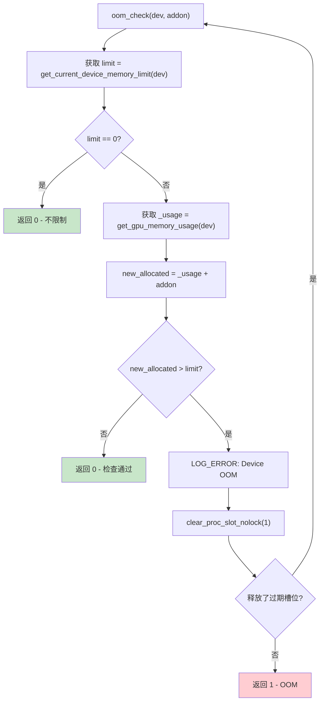
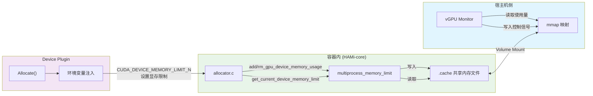

## 概述

`allocator.c` 是 HAMi-core 中负责 GPU 显存分配管理的核心模块。它通过拦截 CUDA 驱动 API 中的内存分配调用（如 `cuMemAlloc`、`cuMemAllocAsync`），在用户态维护一套独立的显存分配追踪链表，实现对容器 GPU 显存使用量的精确统计和限制。

**源码路径**: `HAMi-core/src/allocator/allocator.c`

---

## 1. 核心数据结构

allocator 的设计围绕两层数据结构展开: 单次分配记录和分配链表。

### 1.1 allocated_device_memory - 单次分配记录

每一次 `cuMemAlloc` 调用都会产生一个 `allocated_device_memory` 结构:

```c
struct allocated_device_memory_struct {
    CUdeviceptr address;                    // 分配的显存地址
    size_t length;                          // 分配的字节数
    CUcontext ctx;                          // 所属的 CUDA 上下文
    CUmemGenericAllocationHandle *allocHandle; // 虚拟内存分配句柄（用于大块内存）
};
```

### 1.2 allocated_list_entry - 链表节点

分配记录通过双向链表组织:

```c
struct allocated_list_entry_struct {
    allocated_device_memory *entry;           // 指向分配记录
    struct allocated_list_entry_struct *next;  // 后继节点
    struct allocated_list_entry_struct *prev;  // 前驱节点
};
```

### 1.3 allocated_list - 分配链表

每类分配维护一个独立的链表:

```c
struct allocated_list_struct {
    allocated_list_entry *head;   // 链表头
    allocated_list_entry *tail;   // 链表尾
    size_t length;                // 节点数量
    size_t limit;                 // 内存池上限（仅 async 使用）
};
```

### 1.4 region 结构 - 区域管理

用于大块内存的细粒度子分配:

```c
struct region_struct {
    size_t start;               // 区域起始地址
    size_t freemark;            // 空闲标记位置
    size_t freed_map;           // 已释放的 chunk 数量
    size_t length;              // 已使用的长度
    CUcontext ctx;              // CUDA 上下文
    allocated_list *region_allocs; // 区域内的子分配列表
    char *bitmap;               // 分配位图
    CUmemGenericAllocationHandle *allocHandle; // 分配句柄
};
```

### 1.5 全局链表实例

```c
region_list *r_list;                      // 区域链表（大内存管理）
allocated_list *device_overallocated;     // 同步分配链表
allocated_list *device_allocasync;        // 异步分配链表
```



---

## 2. 关键阈值常量

allocator 定义了三个关键的内存大小阈值，决定了不同的分配策略:

| 常量 | 值 | 含义 |
|------|-----|------|
| `BITSIZE` | 512 | 位图中单个 bit 管理的最小分配粒度 |
| `IPCSIZE` | 2,097,152 (2MB) | IPC 大小阈值 - 小于此值使用 `cuMemAlloc_v2`，大于等于此值使用虚拟内存 API |
| `OVERSIZE` | 134,217,728 (128MB) | 大块分配阈值 - 区域管理的上限 |
| `ALIGN` | 2,097,152 (2MB) | 内存对齐单位 |
| `CHUNK_SIZE` | OVERSIZE/BITSIZE (256KB) | 单个 chunk 的大小 |

```c
size_t BITSIZE = 512;
size_t IPCSIZE = 2097152;       // 2MB
size_t OVERSIZE = 134217728;    // 128MB
#define ALIGN 2097152            // 2MB
#define CHUNK_SIZE (OVERSIZE/BITSIZE)
```

---

## 3. 同步分配与异步分配

### 3.1 同步分配 - allocate_raw()

同步分配是最常见的路径，对应 CUDA 的 `cuMemAlloc` 系列 API。

**调用链路**: `allocate_raw()` -> `add_chunk()` -> (底层 CUDA 调用)

```c
int allocate_raw(CUdeviceptr *dptr, size_t size) {
    pthread_mutex_lock(&mutex);
    tmp = add_chunk(dptr, size);
    pthread_mutex_unlock(&mutex);
    return tmp;
}
```

`add_chunk()` 的核心逻辑:

1. **OOM 检查**: 调用 `oom_check()` 验证是否超出显存限制
2. **分配策略选择**:
   - `size <= IPCSIZE (2MB)`: 使用 `cuMemAlloc_v2` 直接分配
   - `size > IPCSIZE (2MB)`: 使用 `cuMemoryAllocate` 虚拟内存 API 分配
3. **记录追踪**: 将分配记录添加到 `device_overallocated` 链表
4. **用量更新**: 调用 `add_gpu_device_memory_usage()` 更新共享内存中的使用量

### 3.2 异步分配 - allocate_async_raw()

异步分配对应 CUDA 的 `cuMemAllocAsync` API，使用流式内存池。

**调用链路**: `allocate_async_raw()` -> `add_chunk_async()` -> `cuMemAllocAsync`

与同步分配的主要区别:

1. 始终使用 `cuMemAllocAsync` 进行流式分配
2. 通过 `cuDeviceGetMemPool` 和 `cuMemPoolGetAttribute` 查询内存池的实际保留量
3. 仅按增量记录内存使用量（因为内存池可能复用已有的保留内存）
4. 分配记录存储在独立的 `device_allocasync` 链表中

```c
// 异步分配中的增量计算逻辑
if (poollimit > device_allocasync->limit) {
    allocsize = (poollimit - device_allocasync->limit < size)
              ? poollimit - device_allocasync->limit
              : size;
    add_gpu_device_memory_usage(getpid(), dev, allocsize, 2);
    device_allocasync->limit += allocsize;
    e->entry->length = allocsize;
} else {
    e->entry->length = 0;  // 复用内存池，无增量
}
```

---

## 4. 分配器决策树



---

## 5. 内存释放流程

### 5.1 同步释放 - free_raw()

```c
int free_raw(CUdeviceptr dptr) {
    pthread_mutex_lock(&mutex);
    tmp = remove_chunk(device_overallocated, dptr);
    pthread_mutex_unlock(&mutex);
    return tmp;
}
```

`remove_chunk()` 遍历 `device_overallocated` 链表，根据地址匹配找到对应的分配记录:

1. 调用 `cuMemoryFree(dptr)` 释放底层显存
2. 使用 `LIST_REMOVE` 宏从链表中摘除节点
3. 调用 `rm_gpu_device_memory_usage()` 更新共享内存中的使用量
4. 释放 `allocHandle`、`entry` 和链表节点的内存

### 5.2 异步释放 - free_raw_async()

异步释放操作 `device_allocasync` 链表:

1. 调用 `cuMemFreeAsync(dptr, hStream)` 在指定流上异步释放
2. 从链表中摘除节点
3. 更新 `device_allocasync->limit` 值
4. 更新共享内存用量

### 5.3 仅记录的添加/移除

allocator 还提供了 `add_chunk_only` / `remove_chunk_only` 接口，仅更新追踪链表而不执行实际的 CUDA 分配/释放操作。这用于处理通过其他路径（如 `cuMemCreate + cuMemMap`）进行的内存管理。

---

## 6. OOM 检查与保护机制

`oom_check()` 是所有分配操作的守门函数:

```c
int oom_check(const int dev, size_t addon) {
    uint64_t limit = get_current_device_memory_limit(d);  // 从共享内存读取限制
    size_t _usage = get_gpu_memory_usage(d);              // 当前使用量

    if (limit == 0) return 0;  // limit=0 表示不限制

    size_t new_allocated = _usage + addon;
    if (new_allocated > limit) {
        // 尝试清理过期的进程槽位
        if (clear_proc_slot_nolock(1) > 0)
            return oom_check(dev, addon);  // 清理成功后重试
        return 1;  // OOM
    }
    return 0;  // 通过
}
```

关键流程:
1. 从共享内存区域读取当前设备的显存限制值
2. 获取当前进程的显存使用量
3. 判断 `当前使用 + 新请求` 是否超出限制
4. 如果超出限制，尝试 `clear_proc_slot_nolock()` 清理已退出进程遗留的显存记录
5. 清理后重试检查；若仍超限，返回 OOM 错误



---

## 7. 线程安全与互斥

allocator 使用一把全局互斥锁 `pthread_mutex_t mutex` 保护所有分配和释放操作:

```c
pthread_mutex_t mutex = PTHREAD_MUTEX_INITIALIZER;
```

锁的使用策略:

| 函数 | 是否加锁 | 说明 |
|------|----------|------|
| `allocate_raw()` | 是 | 包裹 `add_chunk()` |
| `free_raw()` | 是 | 包裹 `remove_chunk()` |
| `allocate_async_raw()` | 是 | 包裹 `add_chunk_async()` |
| `free_raw_async()` | 是 | 包裹 `remove_chunk_async()` |
| `add_chunk_only()` | 自行加锁 | 内部手动 lock/unlock |
| `remove_chunk_only()` | 否 | 调用方负责加锁 |
| `add_chunk()` | 否 | 由 `allocate_raw()` 外层加锁 |
| `remove_chunk()` | 否 | 由 `free_raw()` 外层加锁 |

初始化通过 `pthread_once_t` 保证单次执行:

```c
pthread_once_t allocator_allocate_flag = PTHREAD_ONCE_INIT;
```

---

## 8. 链表操作宏

allocator 的链表操作通过宏实现，以下为核心宏的语义:

### LIST_INIT - 初始化链表

```c
#define LIST_INIT(list) {
    list->head = NULL;
    list->tail = NULL;
    list->length = 0;
    list->limit = 0;
}
```

### LIST_ADD - 尾部追加

```c
#define LIST_ADD(list, __entry) {
    if (list->head == NULL) {
        list->head = __entry;
        list->tail = __entry;
        list->length = 1;
    } else {
        __entry->prev = list->tail;
        list->tail->next = __entry;
        list->tail = __entry;
        list->length++;
    }
}
```

### LIST_REMOVE - 移除节点

```c
#define LIST_REMOVE(list, val) {
    // 更新前驱后继指针
    if (val->prev != NULL) val->prev->next = val->next;
    if (val->next != NULL) val->next->prev = val->prev;
    if (val == list->tail) list->tail = val->prev;
    if (val == list->head) list->head = val->next;
    // 释放内存
    free(val->entry->allocHandle);
    free(val->entry);
    free(val);
    list->length--;
}
```

---

## 9. 辅助功能

### 9.1 check_memory_type()

判断给定地址是设备内存还是宿主机内存:

```c
int check_memory_type(CUdeviceptr address) {
    // 遍历 device_overallocated 链表
    // 如果 address 落在某个分配区间内，返回 CU_MEMORYTYPE_DEVICE
    // 否则返回 CU_MEMORYTYPE_HOST
}
```

### 9.2 view_vgpu_allocator()

调试用函数，打印 `device_overallocated` 链表中所有分配记录的地址和大小。

### 9.3 get_listsize()

统计指定链表中所有分配的总字节数:

```c
CUresult get_listsize(allocated_list *al, size_t *size) {
    size_t count = 0;
    for (val = al->head; val != NULL; val = val->next) {
        count += val->entry->length;
    }
    *size = count;
    return CUDA_SUCCESS;
}
```

### 9.4 round_up()

将大小向上对齐到指定单位:

```c
size_t round_up(size_t size, size_t unit) {
    if (size & (unit-1))
        return ((size / unit) + 1) * unit;
    return size;
}
```

---

## 10. 与共享内存的交互

allocator 通过 `multiprocess_memory_limit.h` 提供的接口与共享内存区域交互:

- `get_current_device_memory_limit(dev)`: 读取 Device Plugin 设置的显存限制
- `get_gpu_memory_usage(dev)`: 读取当前进程的显存使用量
- `add_gpu_device_memory_usage(pid, dev, size, type)`: 增加显存使用量记录
- `rm_gpu_device_memory_usage(pid, dev, size, type)`: 减少显存使用量记录

这些函数操作的共享内存区域就是 vGPU Monitor 通过 `mmap` 映射并读取的 `.cache` 文件。


