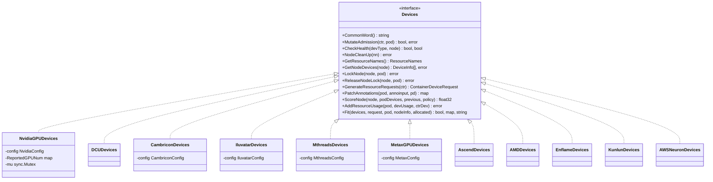
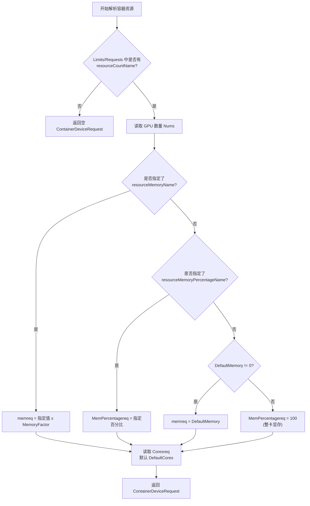
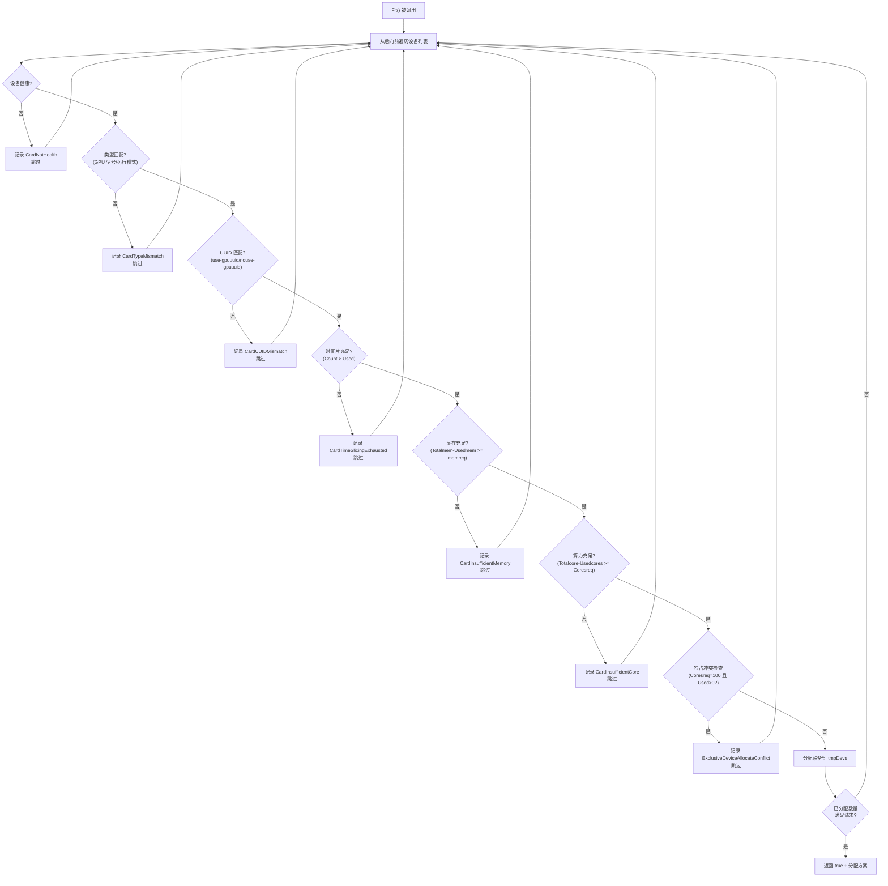
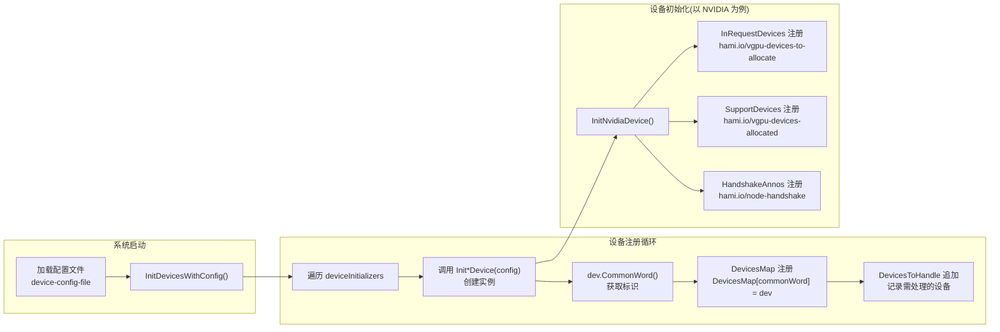
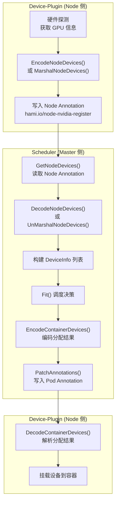
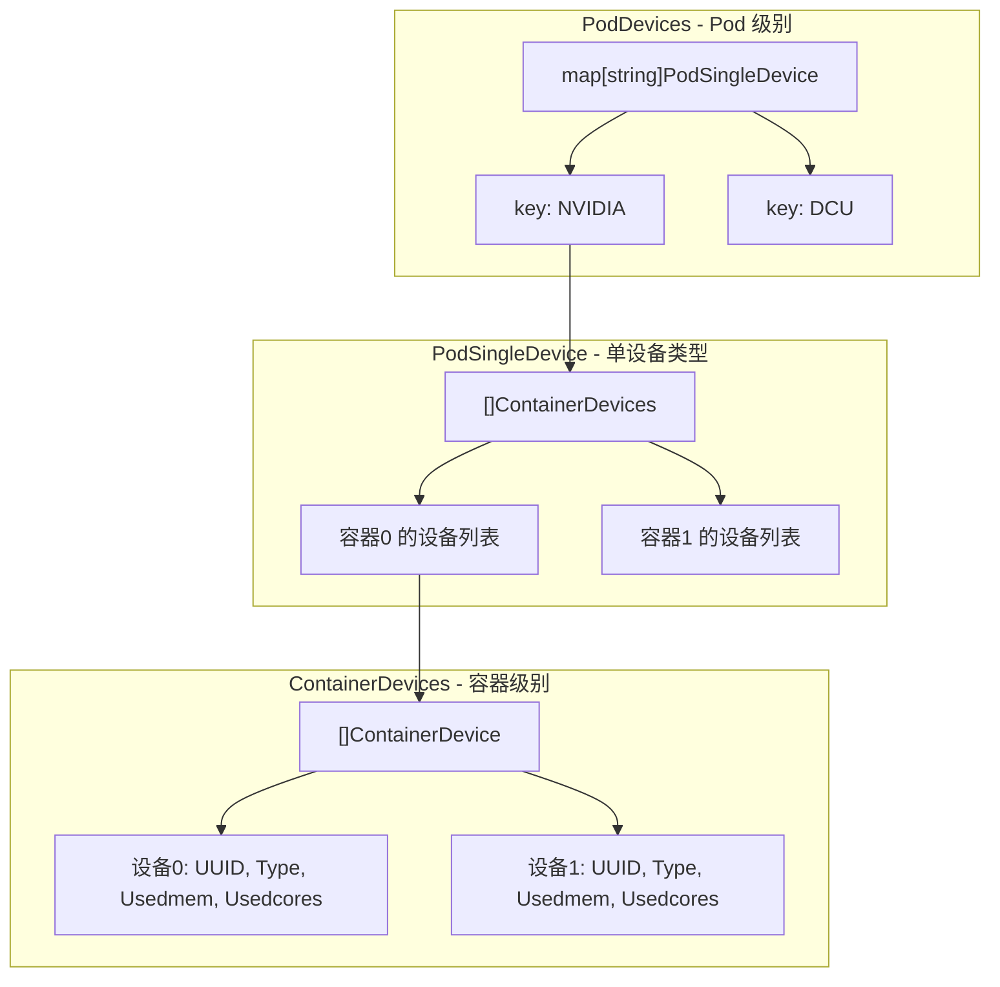
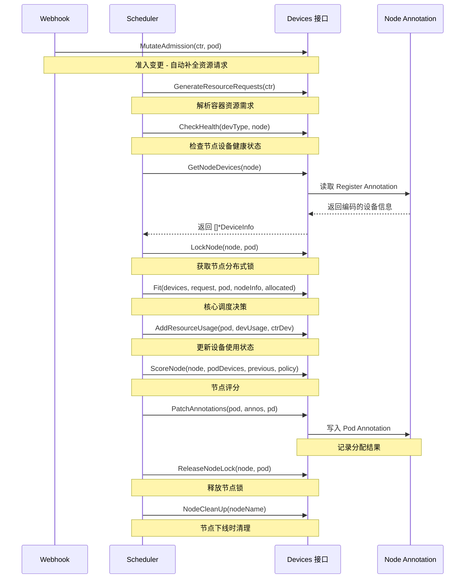

## 概述

`Devices` 接口是 HAMi 多设备架构的核心抽象层，定义在 `pkg/device/devices.go` 中。该接口规范了所有异构加速设备（NVIDIA GPU、Hygon DCU、Cambricon MLU、Iluvatar GPU 等）必须实现的统一行为契约，使得调度器能够以设备无关的方式完成资源发现、准入控制、调度评分、资源分配等全生命周期管理。

当前接口包含 **13 个核心方法**，覆盖从设备标识、健康检查到调度适配的完整链路。

---

## 一、Devices 接口定义

```go
// 源码位置: pkg/device/devices.go
type Devices interface {
    CommonWord() string
    MutateAdmission(ctr *corev1.Container, pod *corev1.Pod) (bool, error)
    CheckHealth(devType string, n *corev1.Node) (bool, bool)
    NodeCleanUp(nn string) error
    GetResourceNames() ResourceNames
    GetNodeDevices(n corev1.Node) ([]*DeviceInfo, error)
    LockNode(n *corev1.Node, p *corev1.Pod) error
    ReleaseNodeLock(n *corev1.Node, p *corev1.Pod) error
    GenerateResourceRequests(ctr *corev1.Container) ContainerDeviceRequest
    PatchAnnotations(pod *corev1.Pod, annoinput *map[string]string, pd PodDevices) map[string]string
    ScoreNode(node *corev1.Node, podDevices PodSingleDevice, previous []*DeviceUsage, policy string) float32
    AddResourceUsage(pod *corev1.Pod, n *DeviceUsage, ctr *ContainerDevice) error
    Fit(devices []*DeviceUsage, request ContainerDeviceRequest, pod *corev1.Pod, nodeInfo *NodeInfo, allocated *PodDevices) (bool, map[string]ContainerDevices, string)
}
```

### 接口类图



---

## 二、13 个接口方法逐一解析

### 2.1 CommonWord() - 设备标识符

```go
CommonWord() string
```

**用途**：返回该设备类型的全局唯一标识字符串，作为设备在全局注册表 `DevicesMap` 中的键。

**各设备实现示例**：

| 设备厂商 | CommonWord 返回值 | 常量名 |
|---------|------------------|--------|
| NVIDIA | `"NVIDIA"` | `NvidiaGPUDevice` |
| Hygon | `"DCU"` | `HygonDCUCommonWord` |
| Cambricon | `"MLU"` | `CambriconMLUCommonWord` |
| Iluvatar | `"MR-V100"` / `"BI-V150"` 等 | 按芯片型号动态配置 |
| Metax | `"METAX-GPU"` | `MetaxGPUCommonWord` |

**调用链路**：`InitDevicesWithConfig()` 中使用 `dev.CommonWord()` 作为 key 注册到 `DevicesMap`。

---

### 2.2 MutateAdmission() - Webhook 准入变更

```go
MutateAdmission(ctr *corev1.Container, pod *corev1.Pod) (bool, error)
```

**用途**：在 Webhook MutatingAdmission 阶段被调用，对 Pod/Container 的资源请求进行合规性检查和自动补全。

**返回值**：
- `bool`：该容器是否包含此类设备的资源请求
- `error`：变更过程中的错误

**NVIDIA 实现的关键行为**：
1. 注入 `TaskPriority` 环境变量（如设置了 `ResourcePriority`）
2. 注入 `GPUCorePolicy` 环境变量（`force` 或 `disable` 模式）
3. 自动补全资源请求 - 若只请求了 memory/cores 但未指定 GPU 数量，自动填充 `DefaultGPUNum`
4. 独占模式下自动设置 `cores=100`
5. 若容器不使用 GPU 且开启了 `OverwriteEnv`，注入 `NVIDIA_VISIBLE_DEVICES=none`
6. 设置 `RuntimeClassName`（如配置了且用户未手动指定）

**Hygon DCU 的简化实现**：仅检查容器 Limits 中是否包含 `hygon.com/dcunum`。

---

### 2.3 CheckHealth() - 设备健康检查

```go
CheckHealth(devType string, n *corev1.Node) (bool, bool)
```

**用途**：检查指定节点上设备的健康状态，用于调度器周期性探活。

**返回值**：
- 第一个 `bool`：设备是否可用（`true` 表示节点仍可调度）
- 第二个 `bool`：设备信息是否发生变化（`true` 表示需要重新同步设备信息）

**NVIDIA 实现的特殊逻辑**：
通过比较 Node 的 `Allocatable` 资源中 `resourceCountName` 的当前值与历史上报值（`ReportedGPUNum`），判断 GPU 数量是否发生变化。数量变化意味着可能有 GPU 掉卡或恢复，需要触发设备信息重新获取。

**通用默认实现**（大多数设备使用 `device.CheckHealth` 通用函数）：
基于 Node Annotation 中的 Handshake 信息判断，包含三种状态：
- `Requesting_<timestamp>`：设备上报中，60 秒内有效
- `Deleted`：设备已标记删除
- 其他/空：触发新的握手请求

---

### 2.4 NodeCleanUp() - 节点清理

```go
NodeCleanUp(nn string) error
```

**用途**：当节点下线或设备异常时，清理该节点上与此设备类型相关的 Annotation 标记。

**通用实现**：调用 `util.MarkAnnotationsToDelete(HandshakeAnnos, nodeName)` 将对应的 Handshake Annotation 标记为 `Deleted`。

---

### 2.5 GetResourceNames() - 获取资源名称映射

```go
GetResourceNames() ResourceNames
```

**用途**：返回该设备类型对应的 Kubernetes 扩展资源名称，包含数量、内存、核心三个维度。

**返回值结构**：

```go
type ResourceNames struct {
    ResourceCountName  string  // 如 "nvidia.com/gpu"
    ResourceMemoryName string  // 如 "nvidia.com/gpumem"
    ResourceCoreName   string  // 如 "nvidia.com/gpucores"
}
```

该方法的返回值被 `QuotaManager` 用于资源配额管理，以及被调度器用于识别 Pod 的设备资源需求。

---

### 2.6 GetNodeDevices() - 获取节点设备列表

```go
GetNodeDevices(n corev1.Node) ([]*DeviceInfo, error)
```

**用途**：从节点 Annotation 中解析出该类设备的完整信息列表。这些信息由 device-plugin 在节点上探测并编码写入 Annotation。

**NVIDIA 实现的额外逻辑**：
1. 从 `hami.io/node-nvidia-register` Annotation 读取 JSON 编码的设备列表
2. 为每个设备设置 `DeviceVendor = "NVIDIA"`
3. 对 MIG 模式设备，根据配置中的 `MigGeometriesList` 匹配 GPU 型号，注入对应的 MIG Geometry 模板
4. 解析 `hami.io/node-nvidia-score` Annotation 获取 GPU 间拓扑评分（P2P/NVLink 带宽），填充到 `DevicePairScore` 字段

**DeviceInfo 结构**：

```go
type DeviceInfo struct {
    ID              string          // 设备 UUID
    Index           uint            // 设备序号
    Count           int32           // 可共享的时间片数量
    Devmem          int32           // 设备总显存 (MB)
    Devcore         int32           // 设备总算力 (百分比)
    Type            string          // 设备型号 (如 "Tesla V100")
    Numa            int             // NUMA 节点 ID
    Mode            string          // 运行模式 ("hami-core"/"mig"/"mps")
    MIGTemplate     []Geometry      // MIG 几何模板
    Health          bool            // 健康状态
    DeviceVendor    string          // 设备厂商标识
    DevicePairScore DevicePairScore // GPU 间拓扑评分
}
```

---

### 2.7 LockNode() / ReleaseNodeLock() - 节点锁

```go
LockNode(n *corev1.Node, p *corev1.Pod) error
ReleaseNodeLock(n *corev1.Node, p *corev1.Pod) error
```

**用途**：在调度器为 Pod 分配设备前，对目标节点加分布式锁，防止并发调度导致设备超分。分配完成后释放锁。

**实现要点**：
- 通过 Node Annotation（如 `hami.io/mutex.lock`）实现分布式互斥
- 调用前先检查 Pod 是否确实请求了该类设备，无需求则直接跳过
- 底层调用 `nodelock.LockNode()` / `nodelock.ReleaseNodeLock()`

---

### 2.8 GenerateResourceRequests() - 生成设备请求

```go
GenerateResourceRequests(ctr *corev1.Container) ContainerDeviceRequest
```

**用途**：从容器的 Resources.Limits/Requests 中解析出该设备类型的资源需求，转换为标准化的 `ContainerDeviceRequest` 结构。

**返回值结构**：

```go
type ContainerDeviceRequest struct {
    Nums             int32   // 请求设备数量
    Type             string  // 设备类型标识（如 "NVIDIA"）
    Memreq           int32   // 请求显存 (MB)
    MemPercentagereq int32   // 请求显存百分比
    Coresreq         int32   // 请求算力百分比
}
```

**NVIDIA 实现中的默认值补全逻辑**：



---

### 2.9 PatchAnnotations() - 写入调度结果

```go
PatchAnnotations(pod *corev1.Pod, annoinput *map[string]string, pd PodDevices) map[string]string
```

**用途**：将调度器的设备分配结果编码为 Annotation，写入 Pod 的元数据。device-plugin 在节点上读取这些 Annotation 完成实际的设备挂载。

**编码格式**：

每种设备类型对应两个 Annotation key：
- `InRequestDevices[type]`：待分配设备信息（如 `hami.io/vgpu-devices-to-allocate`）
- `SupportDevices[type]`：已分配设备信息（如 `hami.io/vgpu-devices-allocated`）

**编码格式示例**：
```
UUID1,Type1,Usedmem1,Usedcores1:UUID2,Type2,Usedmem2,Usedcores2;  <-- 容器1的设备
UUID3,Type3,Usedmem3,Usedcores3;                                    <-- 容器2的设备
```

其中 `:` 分隔同一容器的多个设备，`;` 分隔不同容器。

---

### 2.10 ScoreNode() - 节点评分

```go
ScoreNode(node *corev1.Node, podDevices PodSingleDevice, previous []*DeviceUsage, policy string) float32
```

**用途**：在调度器的 Score 阶段被调用，为候选节点打分。返回值越高，该节点越优先被选择。

**当前状态**：大多数设备实现（包括 NVIDIA 和 Hygon）直接返回 `0`，评分逻辑主要在调度器核心中按 `binpack`/`spread` 策略处理。该方法预留了设备级自定义评分扩展点。

---

### 2.11 AddResourceUsage() - 记录资源使用

```go
AddResourceUsage(pod *corev1.Pod, n *DeviceUsage, ctr *ContainerDevice) error
```

**用途**：当调度器确认将某设备分配给某容器后，更新该设备的使用状态（已用数量、已用显存、已用算力等）。

**NVIDIA 的 MIG 模式特殊处理**：
1. 若 MIG 使用列表为空（首次分配），遍历 MIG 模板找到满足显存需求的最小模板，调用 `PlatternMIG()` 初始化 MIG 分区
2. 若已有 MIG 分区，在现有分区中找到空闲且满足显存需求的 MIG 实例进行分配
3. 修改 `ctr.UUID` 追加 `[templateIdx-pos]` 后缀，标识具体的 MIG 分区位置

---

### 2.12 Fit() - 核心调度适配

```go
Fit(devices []*DeviceUsage, request ContainerDeviceRequest, pod *corev1.Pod, nodeInfo *NodeInfo, allocated *PodDevices) (bool, map[string]ContainerDevices, string)
```

**用途**：这是调度器的核心决策方法。判断给定节点的设备列表是否能满足容器的资源请求，如能满足则返回具体的分配方案。

**返回值**：
- `bool`：是否适配成功
- `map[string]ContainerDevices`：分配方案（key 为设备类型，value 为分配的设备列表）
- `string`：失败原因描述（成功时为空字符串）

**调度决策流程**（详见 NVIDIA 实现分析文档）：



---

## 三、设备注册机制

### 3.1 全局注册表

```go
// pkg/device/devices.go
var (
    InRequestDevices map[string]string   // key: CommonWord, value: "待分配"Annotation key
    SupportDevices   map[string]string   // key: CommonWord, value: "已分配"Annotation key
    DevicesMap       map[string]Devices  // key: CommonWord, value: Devices 接口实例
    DevicesToHandle  []string            // 需要处理的设备类型列表
)
```

### 3.2 注册流程



### 3.3 InRequestDevices 与 SupportDevices

这两个 map 构建了调度器与 device-plugin 之间的"通信协议"：

| 设备类型 | InRequestDevices (待分配) | SupportDevices (已分配) |
|---------|--------------------------|------------------------|
| NVIDIA | `hami.io/vgpu-devices-to-allocate` | `hami.io/vgpu-devices-allocated` |
| Hygon DCU | `hami.io/dcu-devices-to-allocate` | `hami.io/dcu-devices-allocated` |

调度器完成分配后通过 `PatchAnnotations()` 将分配信息写入 `InRequestDevices` 对应的 Annotation；device-plugin 读取后执行实际挂载，完成后更新 `SupportDevices` 对应的 Annotation 确认。

---

## 四、Annotation 编解码

### 4.1 节点设备编码 - EncodeNodeDevices()

将 `[]*DeviceInfo` 编码为字符串，写入 Node Annotation：

```
GPU-UUID-1,10,32768,100,Tesla-V100,0,true,0,hami-core:GPU-UUID-2,10,16384,100,Tesla-T4,1,true,1,hami-core:
```

**字段顺序**：`ID, Count, Devmem, Devcore, Type, Numa, Health, Index, Mode`

各字段含义：

| 序号 | 字段 | 示例值 | 说明 |
|-----|------|-------|------|
| 0 | ID | `GPU-UUID-1` | 设备唯一标识 |
| 1 | Count | `10` | 可共享的时间片数量 |
| 2 | Devmem | `32768` | 总显存 (MB) |
| 3 | Devcore | `100` | 总算力 (百分比) |
| 4 | Type | `Tesla-V100` | 设备型号 |
| 5 | Numa | `0` | NUMA 节点编号 |
| 6 | Health | `true` | 健康状态 |
| 7 | Index | `0` | 设备序号 |
| 8 | Mode | `hami-core` | 运行模式 |

### 4.2 节点设备解码 - DecodeNodeDevices()

反向解析上述字符串格式。支持两种长度的字段列表：
- **7 字段**（旧版兼容）：不含 Index 和 Mode
- **9 字段**（当前版本）：完整字段

### 4.3 JSON 编解码 - MarshalNodeDevices() / UnMarshalNodeDevices()

新版本同时支持 JSON 格式的序列化，`UnMarshalNodeDevices()` 用于 NVIDIA 等新实现中直接从 JSON 解析。JSON 编码只包含通用字段，不包含 `CustomInfo`。

### 4.4 编解码数据流



---

## 五、核心数据结构关系

### 5.1 设备使用状态 - DeviceUsage

```go
type DeviceUsage struct {
    ID          string            // 设备 UUID
    Index       uint              // 设备序号
    Used        int32             // 已分配时间片数
    Count       int32             // 总时间片数
    Usedmem     int32             // 已用显存
    Totalmem    int32             // 总显存
    Totalcore   int32             // 总算力
    Usedcores   int32             // 已用算力
    Mode        string            // 运行模式
    MigTemplate []Geometry        // MIG 模板
    MigUsage    MigInUse          // MIG 使用情况
    Numa        int               // NUMA 节点
    Type        string            // 设备型号
    Health      bool              // 健康状态
    PodInfos    []*PodInfo        // 使用该设备的 Pod 列表
    CustomInfo  map[string]any    // 设备厂商自定义扩展信息
}
```

### 5.2 Pod 设备编排层次



**层次关系**：
- `PodDevices` = `map[deviceType]PodSingleDevice` -- Pod 中所有设备类型
- `PodSingleDevice` = `[]ContainerDevices` -- 每个容器的分配
- `ContainerDevices` = `[]ContainerDevice` -- 单个容器使用的多个设备实例

---

## 六、分隔符规范

HAMi 在 Annotation 编码中使用特定分隔符来组织层次化的设备信息：

| 常量名 | 字符 | 用途 |
|--------|------|------|
| `OneContainerMultiDeviceSplitSymbol` | `:` | 同一容器内多个设备之间的分隔 |
| `OnePodMultiContainerSplitSymbol` | `;` | 同一 Pod 内多个容器之间的分隔 |
| `,` | `,` | 单个设备的各属性字段之间的分隔 |

---

## 七、CheckUUID 通用函数

```go
func CheckUUID(annos map[string]string, id, useKey, noUseKey, deviceType string) bool
```

该函数实现了设备 UUID 白名单/黑名单过滤：

1. **白名单模式**（`useKey` 存在）：仅允许 Annotation 中列出的 UUID
2. **黑名单模式**（`noUseKey` 存在）：排除 Annotation 中列出的 UUID
3. **无约束**：两者都不存在时，所有 UUID 均通过

各设备通过不同的 Annotation key 复用此逻辑：
- NVIDIA: `nvidia.com/use-gpuuuid` / `nvidia.com/nouse-gpuuuid`
- Hygon: `hygon.com/use-gpuuuid` / `hygon.com/nouse-gpuuuid`

---

## 八、完整调度链路中的方法调用序列



---

## 九、总结

`Devices` 接口是 HAMi 项目可扩展性的核心保障。通过统一的 13 个方法契约，新的硬件厂商只需实现这套接口即可无缝接入 HAMi 的调度和管理体系。接口设计遵循了以下原则：

1. **关注点分离**：每个方法职责单一，从标识到调度到清理各司其职
2. **渐进增强**：`ScoreNode` 等方法允许简单实现（直接返回0），让设备厂商按需增强
3. **协议驱动**：通过 Annotation 编解码实现调度器与 device-plugin 的松耦合通信
4. **容错设计**：`Fit()` 方法返回详细的失败原因字符串，便于调试和问题定位
