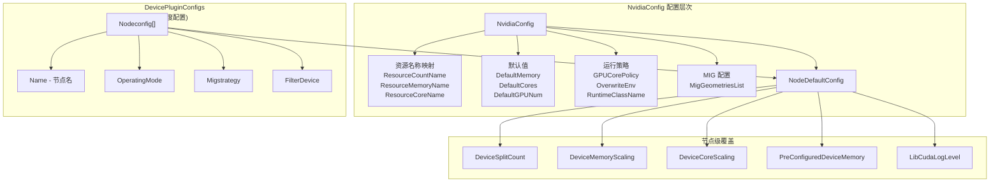
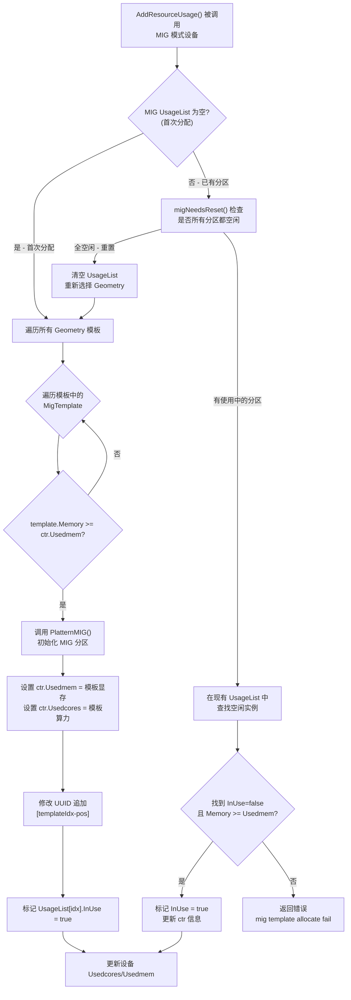
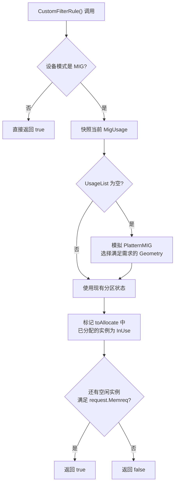
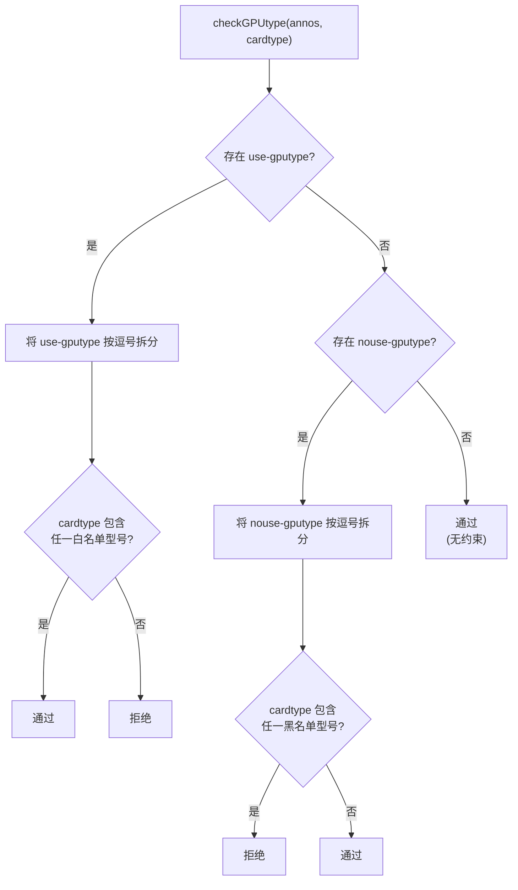
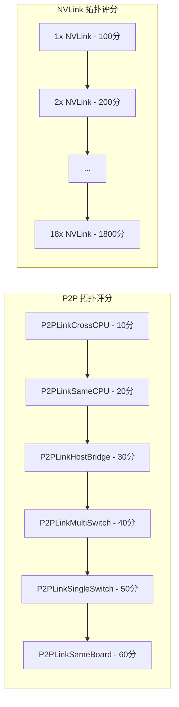
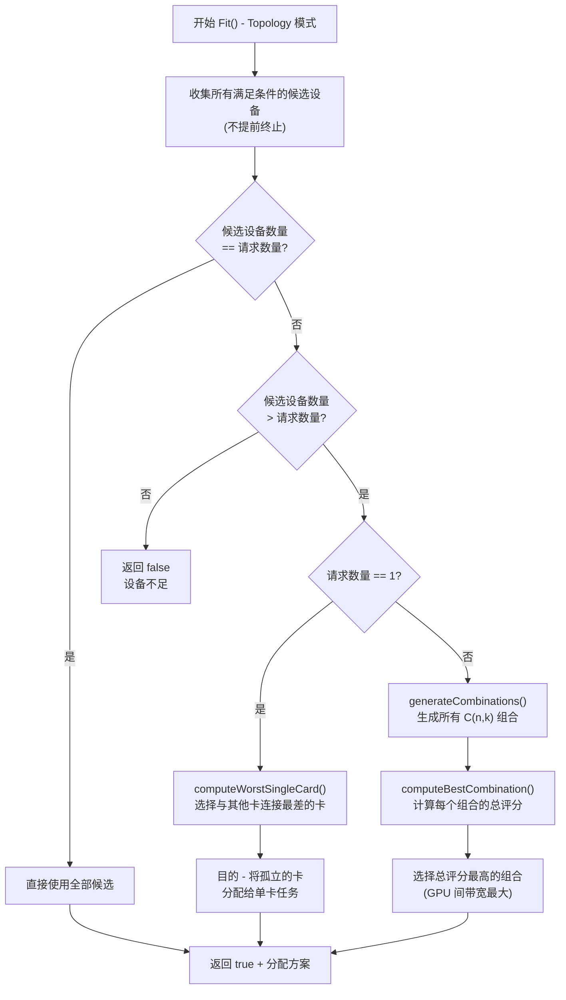
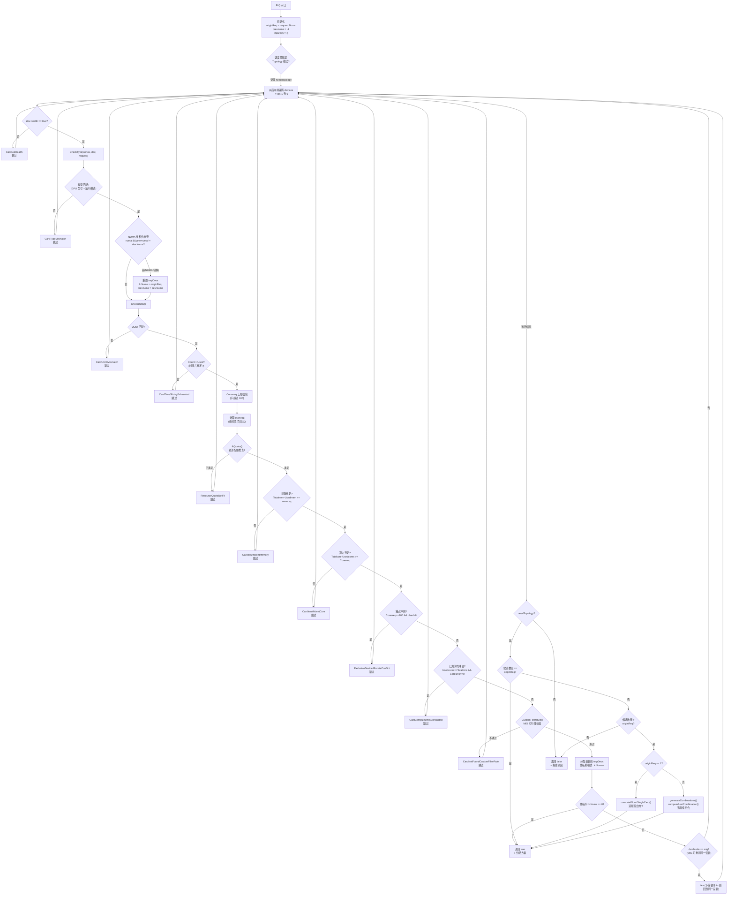
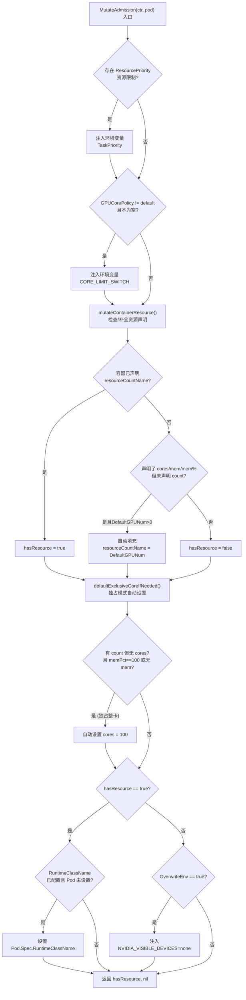
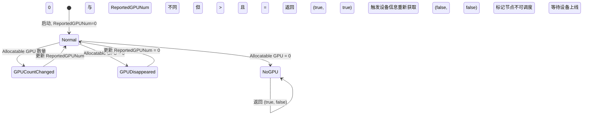

## 概述

`NvidiaGPUDevices` 是 HAMi 中实现最完整、功能最丰富的 `Devices` 接口实现，定义在 `pkg/device/nvidia/device.go`。作为参考实现，它展示了如何在 HAMi 框架中集成复杂的 GPU 虚拟化能力，包括：

- 显存/算力的细粒度分割与隔离
- MIG (Multi-Instance GPU) 模式的完整调度支持
- GPU 型号/UUID 过滤
- NUMA 亲和性断言
- 基于 NVLink/P2P 拓扑的智能调度评分
- 资源配额管理
- 独占/共享模式切换

---

## 一、核心结构体

### 1.1 NvidiaGPUDevices

```go
// pkg/device/nvidia/device.go
type NvidiaGPUDevices struct {
    config         NvidiaConfig
    ReportedGPUNum map[string]int64  // key: nodeName, value: 已上报 GPU 数量
    mu             sync.Mutex        // 保护 ReportedGPUNum 的并发访问
}
```

**设计要点**：
- `config` 存储从配置文件解析的 NVIDIA 特有配置
- `ReportedGPUNum` 是健康检查的关键状态，记录每个节点上次汇报的 GPU 数量，用于检测 GPU 掉卡
- `mu` 保护并发读写安全（调度器为多 goroutine 并发调度）

### 1.2 NvidiaConfig

```go
type NvidiaConfig struct {
    NodeDefaultConfig            `yaml:",inline"`
    ResourceCountName            string   // "nvidia.com/gpu"
    ResourceMemoryName           string   // "nvidia.com/gpumem"
    ResourceCoreName             string   // "nvidia.com/gpucores"
    ResourceMemoryPercentageName string   // "nvidia.com/gpumem-percentage"
    ResourcePriority             string   // "nvidia.com/priority"
    OverwriteEnv                 bool     // 是否覆盖 NVIDIA_VISIBLE_DEVICES
    DefaultMemory                int32    // 默认显存值 (MB)
    DefaultCores                 int32    // 默认算力百分比
    DefaultGPUNum                int32    // 默认 GPU 数量
    MemoryFactor                 int32    // 显存乘数因子
    DisableCoreLimit             bool     // 禁用算力限制
    MigGeometriesList            []AllowedMigGeometries  // MIG 几何模板
    GPUCorePolicy                GPUCoreUtilizationPolicy // 算力隔离策略
    RuntimeClassName             string   // Pod 运行时类名
}
```

**配置关系图**：



### 1.3 GPU 算力隔离策略

```go
type GPUCoreUtilizationPolicy string

const (
    DefaultCorePolicy GPUCoreUtilizationPolicy = "default"   // 默认行为
    ForceCorePolicy   GPUCoreUtilizationPolicy = "force"     // 强制算力隔离
    DisableCorePolicy GPUCoreUtilizationPolicy = "disable"   // 禁用算力隔离
)
```

这三种策略通过 Webhook 注入环境变量 `CORE_LIMIT_SWITCH` 传递给 hami-core 运行时：
- `default`：不注入环境变量，由 hami-core 的默认行为决定
- `force`：无论用户是否请求 cores，都强制执行算力隔离
- `disable`：完全禁用算力限制

---

## 二、MIG (Multi-Instance GPU) 支持

### 2.1 MIG 模式概述

NVIDIA MIG 技术允许将一块物理 GPU 分割为多个独立的 GPU 实例，每个实例拥有独立的显存、缓存和计算核心。HAMi 通过 MIG Geometry 模板机制实现对 MIG 模式 GPU 的调度支持。

### 2.2 MIG 数据结构

```go
// MIG 模板定义
type MigTemplate struct {
    Name   string  // 模板名称，如 "1g.5gb"
    Core   int32   // 算力份额
    Memory int32   // 显存大小 (MB)
    Count  int32   // 该模板在 Geometry 中的数量
}

// 一种 Geometry 是 MigTemplate 的组合
type Geometry []MigTemplate

// MIG 实例的运行时使用状态
type MigTemplateUsage struct {
    Name   string  // 模板名称
    Core   int32   // 算力份额
    Memory int32   // 显存大小
    InUse  bool    // 是否已被分配
}

// 设备的 MIG 使用状态
type MigInUse struct {
    Index     int32  // 当前使用的 Geometry 索引
    UsageList MIGS   // MIG 实例使用列表
}
```

### 2.3 MIG Geometry 配置示例

```yaml
knownMigGeometries:
  - models: ["A100", "A800"]
    allowedGeometries:
      - # Geometry 0: 7 个 1g.5gb 实例
        - name: "1g.5gb"
          core: 14
          memory: 5120
          count: 7
      - # Geometry 1: 3 个 2g.10gb + 1 个 1g.5gb
        - name: "2g.10gb"
          core: 28
          memory: 10240
          count: 3
        - name: "1g.5gb"
          core: 14
          memory: 5120
          count: 1
      - # Geometry 2: 2 个 3g.20gb + 1 个 1g.5gb
        - name: "3g.20gb"
          core: 42
          memory: 20480
          count: 2
        - name: "1g.5gb"
          core: 14
          memory: 5120
          count: 1
```

### 2.4 MIG 模式检测

设备上报时，device-plugin 通过检测 `/proc/driver/nvidia/capabilities` 路径判断 GPU 是否启用 MIG 模式。对于 MIG 模式的 GPU，在 `DeviceInfo.Mode` 字段设置为 `"mig"`。

`GetNodeDevices()` 方法中，对 MIG 模式设备进行模板匹配：

```go
for _, val := range nodedevices {
    if val.Mode == MigMode {
        val.MIGTemplate = make([]device.Geometry, 0)
        for _, migTemplates := range dev.config.MigGeometriesList {
            found := false
            for _, migDevices := range migTemplates.Models {
                if strings.Contains(val.Type, migDevices) {
                    found = true
                    break
                }
            }
            if found {
                val.MIGTemplate = append(val.MIGTemplate, migTemplates.Geometries...)
                break
            }
        }
    }
}
```

### 2.5 MIG 分配流程



### 2.6 MIG UUID 编码格式

MIG 模式下，分配后的 UUID 格式为：

```
GPU-UUID[geometryIdx-slotPosition]
```

例如 `GPU-abc123[0-2]` 表示使用 Geometry 0 的第 2 个 MIG 实例。

`ExtractMigTemplatesFromUUID()` 函数负责从 UUID 中解析出模板索引和位置：

```go
func ExtractMigTemplatesFromUUID(uuid string) (templateIdx int, pos int, error)
```

### 2.7 MIG CustomFilterRule

`CustomFilterRule()` 方法在 `Fit()` 中被调用，对 MIG 模式设备进行额外的可行性校验。它模拟当前 MIG 分区的使用状态，检查是否还有空闲的 MIG 实例能满足请求：



---

## 三、GPU 类型与 UUID 过滤

### 3.1 GPU 类型过滤

通过 Pod Annotation 控制 GPU 型号选择：

| Annotation Key | 用途 | 示例值 |
|---------------|------|--------|
| `nvidia.com/use-gputype` | 白名单 - 只使用指定型号 | `"Tesla V100,A100"` |
| `nvidia.com/nouse-gputype` | 黑名单 - 排除指定型号 | `"Tesla T4"` |
| `nvidia.com/vgpu-mode` | 限定运行模式 | `"mig"` / `"hami-core"` |

**checkGPUtype() 决策逻辑**：



### 3.2 GPU UUID 过滤

通过 Pod Annotation 精确控制使用哪些 GPU：

| Annotation Key | 用途 |
|---------------|------|
| `nvidia.com/use-gpuuuid` | 白名单 - 只使用列出的 UUID |
| `nvidia.com/nouse-gpuuuid` | 黑名单 - 排除列出的 UUID |

多个 UUID 用逗号分隔。底层复用 `device.CheckUUID()` 通用函数。

### 3.3 Device-Plugin 级设备过滤

`FilterDevice` 结构允许在 device-plugin 层面排除特定设备，使其不被注册：

```go
type FilterDevice struct {
    UUID  []string  // 按 UUID 过滤
    Index []uint    // 按设备索引过滤
}
```

---

## 四、NUMA 亲和性

### 4.1 NUMA 断言

当 Pod 设置了 `nvidia.com/numa-bind: "true"` Annotation 时，调度器要求同一容器的所有 GPU 必须位于同一 NUMA 节点。

```go
func assertNuma(annos map[string]string) bool {
    numabind, ok := annos[NumaBind]
    if ok {
        enforce, err := strconv.ParseBool(numabind)
        if err == nil && enforce {
            return true
        }
    }
    return false
}
```

### 4.2 Fit() 中的 NUMA 处理

在 `Fit()` 方法中，当 NUMA 亲和性启用时，遇到不同 NUMA 节点的设备会重置已选设备列表：

```go
if numa && prevnuma != dev.Numa {
    if k.Nums != originReq {
        // 记录 NUMA 不匹配原因
    }
    k.Nums = originReq       // 重置请求数量
    prevnuma = dev.Numa       // 更新当前 NUMA 节点
    tmpDevs = make(map[string]device.ContainerDevices)  // 清空已选设备
}
```

这确保了最终分配的所有 GPU 都来自同一 NUMA 域。

---

## 五、拓扑感知调度

### 5.1 GPU 拓扑评分体系

HAMi 通过 NVML 库获取 GPU 间的互连拓扑信息，计算 P2P 和 NVLink 带宽评分：



**评分含义**：分值越高，两个 GPU 间的通信带宽越大。device-plugin 在节点启动时计算所有 GPU 对之间的评分，编码为 JSON 写入 `hami.io/node-nvidia-score` Annotation。

### 5.2 拓扑评分计算

```go
// pkg/device/nvidia/calculate_score.go
func calculateGPUPairScore(gpu0 *Device, gpu1 *Device) int {
    score := 0
    for _, link := range gpu0.Links[gpu1.Index] {
        switch link.Type {
        case P2PLinkCrossCPU:      score += 10
        case P2PLinkSameCPU:       score += 20
        case P2PLinkHostBridge:    score += 30
        case P2PLinkMultiSwitch:   score += 40
        case P2PLinkSingleSwitch:  score += 50
        case P2PLinkSameBoard:     score += 60
        case SingleNVLINKLink:     score += 100
        case TwoNVLINKLinks:       score += 200
        // ... 最高到 EighteenNVLINKLinks: 1800
        }
    }
    return score
}
```

### 5.3 拓扑感知的 Fit() 策略

当调度策略为 `Topology`（通过 `GPUSchedulerPolicy` 配置或 Pod Annotation 设置）时，`Fit()` 方法的行为发生变化：



**单卡场景 - computeWorstSingleCard()**：

遍历所有候选 GPU，计算每个 GPU 与其他 GPU 的总拓扑评分。选择总评分最低的 GPU（与其他卡连接最差的那个），将它分配给单卡任务。这样做的目的是保留高带宽互联的 GPU 给多卡任务使用。

**多卡场景 - computeBestCombination()**：

使用组合数学 C(n,k) 枚举所有 k 张卡的组合，计算每个组合中所有 GPU 对之间的拓扑评分总和。选择评分总和最高的组合，确保多卡任务获得最佳的 GPU 间通信带宽。

---

## 六、Fit() 完整决策流程



---

## 七、资源配额集成

### 7.1 fitQuota() 函数

在 `Fit()` 的每次设备分配前，调用 `fitQuota()` 检查 namespace 级别的资源配额：

```go
func fitQuota(tmpDevs map[string]device.ContainerDevices, allocated *device.PodDevices,
              ns string, memreq int64, coresreq int64) bool {
    // 1. 累加当前分配方案中已使用的显存和算力
    // 2. 累加之前已分配的容器使用量
    // 3. 调用 QuotaManager.FitQuota() 检查是否超限
}
```

这确保了在 Kubernetes ResourceQuota 框架下，设备的显存和算力资源也受到配额管理。

---

## 八、MutateAdmission() 详细行为



---

## 九、健康检查机制



| 场景 | Allocatable | Reported | 返回值 | 含义 |
|------|-------------|----------|--------|------|
| 首次无GPU | 0 | 0 | (true, false) | 节点可用但无设备变化 |
| GPU 全部消失 | 0 | >0 | (false, false) | 节点不健康 |
| GPU 数量变化 | >0 | != current | (true, true) | 需重新获取设备信息 |
| GPU 数量稳定 | >0 | == current | (true, false) | 一切正常 |

---

## 十、关键 Annotation 总结

| Annotation Key | 写入方 | 用途 |
|---------------|--------|------|
| `hami.io/node-handshake` | scheduler/device-plugin | 健康握手 |
| `hami.io/node-nvidia-register` | device-plugin | 节点 GPU 设备信息 (JSON) |
| `hami.io/node-nvidia-score` | device-plugin | GPU 拓扑评分 (JSON) |
| `hami.io/vgpu-devices-to-allocate` | scheduler | Pod 待分配设备 |
| `hami.io/vgpu-devices-allocated` | scheduler | Pod 已分配设备 |
| `hami.io/mutex.lock` | scheduler | 节点分布式锁 |
| `nvidia.com/use-gputype` | 用户 | GPU 型号白名单 |
| `nvidia.com/nouse-gputype` | 用户 | GPU 型号黑名单 |
| `nvidia.com/use-gpuuuid` | 用户 | GPU UUID 白名单 |
| `nvidia.com/nouse-gpuuuid` | 用户 | GPU UUID 黑名单 |
| `nvidia.com/numa-bind` | 用户 | NUMA 亲和性开关 |
| `nvidia.com/vgpu-mode` | 用户 | 运行模式限制 (mig/hami-core/mps) |

---

## 十一、总结

NVIDIA GPU 设备实现是 HAMi 最复杂也最完整的参考实现，它展示了：

1. **灵活的资源模型**：通过 MemoryFactor、MemPercentage、DefaultValues 等机制适配各种资源声明方式
2. **MIG 的完整生命周期管理**：从 Geometry 模板匹配、分区初始化、实例分配到资源回收的全链路
3. **多维度过滤**：GPU 型号、UUID、NUMA 节点、运行模式四重过滤
4. **拓扑感知**：基于 NVLink/P2P 带宽的智能 GPU 组合选择
5. **配额集成**：与 Kubernetes ResourceQuota 的无缝协作
6. **生产级健壮性**：详细的失败原因追踪、独占/共享冲突检测、并发安全保护
