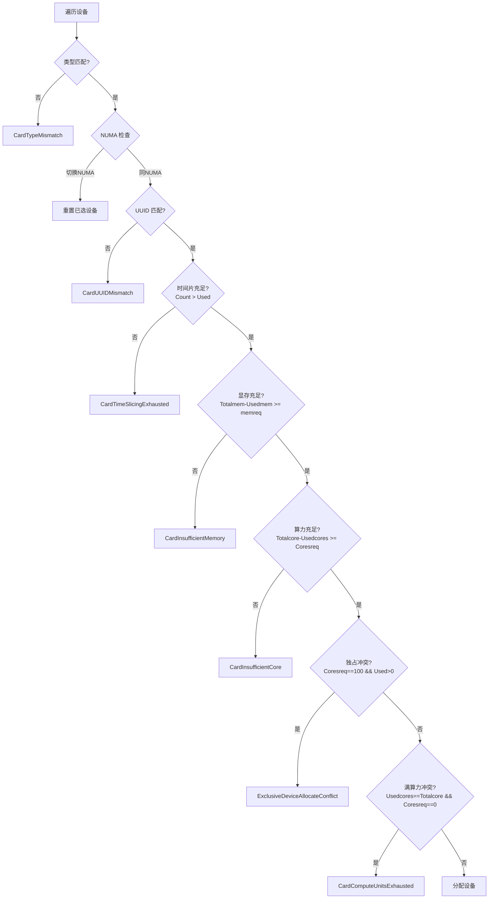
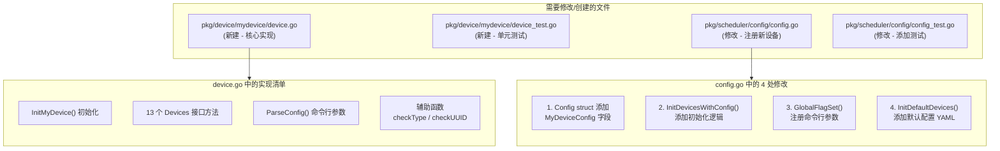
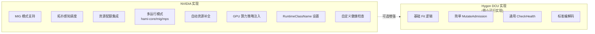
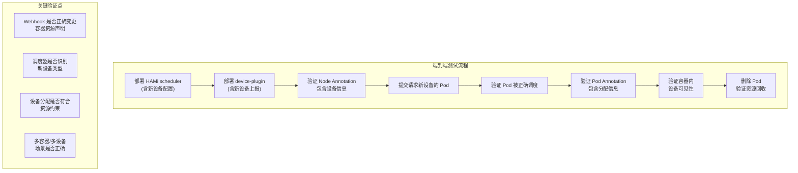

## 概述

本文档为硬件厂商或社区开发者提供在 HAMi 中接入新设备类型的完整指南。通过实现 `Devices` 接口并注册到 HAMi 框架，新设备即可获得 Kubernetes 级别的资源虚拟化、调度和管理能力。

本指南以 **Hygon DCU** (`pkg/device/hygon/device.go`) 作为参考实现，因为它是所有设备实现中最简洁清晰的，适合作为入门模板。

---

## 一、实现总览

### 1.1 新设备接入检查清单流程

```mermaid
flowchart TB
    subgraph phase1["阶段一 - 基础框架"]
        A["创建设备包目录
pkg/device/mydevice/"] --> B["定义设备结构体
MyDevices struct"]
        B --> C["定义配置结构体
MyDeviceConfig struct"]
        C --> D["实现 Init 初始化函数
InitMyDevice(config)"]
        D --> E["注册 Annotation keys
InRequestDevices / SupportDevices
HandshakeAnnos"]
    end

    subgraph phase2["阶段二 - 接口实现"]
        E --> F["实现 CommonWord()"]
        F --> G["实现 GetResourceNames()"]
        G --> H["实现 GenerateResourceRequests()"]
        H --> I["实现 MutateAdmission()"]
        I --> J["实现 GetNodeDevices()"]
        J --> K["实现 CheckHealth()"]
        K --> L["实现 NodeCleanUp()"]
        L --> M["实现 LockNode()
ReleaseNodeLock()"]
    end

    subgraph phase3["阶段三 - 调度逻辑"]
        M --> N["实现 Fit()"]
        N --> O["实现 AddResourceUsage()"]
        O --> P["实现 ScoreNode()"]
        P --> Q["实现 PatchAnnotations()"]
    end

    subgraph phase4["阶段四 - 集成注册"]
        Q --> R["在 config.go 中
添加配置结构体字段"]
        R --> S["在 InitDevicesWithConfig()
中添加初始化逻辑"]
        S --> T["在 GlobalFlagSet()
中注册命令行参数"]
        T --> U["在 InitDefaultDevices()
中添加默认配置"]
    end

    subgraph phase5["阶段五 - 测试验证"]
        U --> V["编写单元测试"]
        V --> W["端到端集成测试"]
        W --> X["提交 PR"]
    end
```



---

## 二、详细实现步骤

### 步骤 1 - 创建设备包

在 `pkg/device/` 下创建新的设备包目录：

```
pkg/device/mydevice/
    device.go       # 核心实现
    device_test.go  # 单元测试
```

### 步骤 2 - 定义常量和变量

参考 Hygon DCU 实现，定义设备所需的常量：

```go
package mydevice

const (
    // 健康握手 Annotation key
    HandshakeAnnos     = "hami.io/node-handshake-mydevice"
    // 设备注册 Annotation key (device-plugin 写入节点设备信息)
    RegisterAnnos      = "hami.io/node-mydevice-register"
    // 设备类型唯一标识
    MyDeviceType       = "MYDEVICE"
    MyDeviceCommonWord = "MYDEVICE"
    // 设备型号过滤 Annotation
    DeviceInUse        = "myvendor.com/use-devicetype"
    DeviceNoUse        = "myvendor.com/nouse-devicetype"
    // UUID 过滤 Annotation
    DeviceUseUUID      = "myvendor.com/use-uuid"
    DeviceNoUseUUID    = "myvendor.com/nouse-uuid"
    // 节点锁 Annotation key
    NodeLockMyDevice   = "hami.io/mutex.lock"
)

var (
    MyDeviceResourceCount  string
    MyDeviceResourceMemory string
    MyDeviceResourceCores  string
)
```

### 步骤 3 - 定义配置结构体

```go
type MyDeviceConfig struct {
    ResourceCountName  string `yaml:"resourceCountName"`
    ResourceMemoryName string `yaml:"resourceMemoryName"`
    ResourceCoreName   string `yaml:"resourceCoreName"`
}
```

### 步骤 4 - 定义设备结构体并实现初始化

```go
type MyDevices struct {
    // 按需添加字段（如需保存配置、统计数据等）
}

func InitMyDevice(config MyDeviceConfig) *MyDevices {
    MyDeviceResourceCount = config.ResourceCountName
    MyDeviceResourceMemory = config.ResourceMemoryName
    MyDeviceResourceCores = config.ResourceCoreName

    // 注册到全局 Annotation 映射
    _, ok := device.InRequestDevices[MyDeviceType]
    if !ok {
        device.InRequestDevices[MyDeviceType] = "hami.io/mydevice-devices-to-allocate"
        device.SupportDevices[MyDeviceType] = "hami.io/mydevice-devices-allocated"
        util.HandshakeAnnos[MyDeviceType] = HandshakeAnnos
    }
    return &MyDevices{}
}
```

> **关键点**：`InRequestDevices`、`SupportDevices`、`HandshakeAnnos` 三个 map 必须在初始化时注册，否则调度器无法识别该设备类型。

---

## 三、接口方法语义详解与实现模板

### 3.1 CommonWord() - 设备标识

```go
func (dev *MyDevices) CommonWord() string {
    return MyDeviceCommonWord
}
```

**语义**：返回全局唯一标识，作为 `DevicesMap` 的 key。必须与 `InitMyDevice` 中注册的 key 一致。

---

### 3.2 GetResourceNames() - 资源名称

```go
func (dev *MyDevices) GetResourceNames() device.ResourceNames {
    return device.ResourceNames{
        ResourceCountName:  MyDeviceResourceCount,
        ResourceMemoryName: MyDeviceResourceMemory,
        ResourceCoreName:   MyDeviceResourceCores,
    }
}
```

**语义**：返回该设备在 Kubernetes 扩展资源中的名称映射。这些名称用于：
1. Webhook 识别容器是否请求了该类设备
2. QuotaManager 进行资源配额管理
3. 调度器解析资源需求

---

### 3.3 MutateAdmission() - 准入变更

```go
func (dev *MyDevices) MutateAdmission(ctr *corev1.Container, p *corev1.Pod) (bool, error) {
    _, ok := ctr.Resources.Limits[corev1.ResourceName(MyDeviceResourceCount)]
    return ok, nil
}
```

**语义**：Webhook 阶段对容器资源声明进行检查和变更。

**最简实现**（如 Hygon）：仅检查容器是否请求了该设备资源。

**增强实现参考**（如 NVIDIA）：
- 自动补全资源字段（如仅声明 memory 但未声明 count 时，自动填充默认 count）
- 注入环境变量（优先级、算力策略等）
- 设置运行时类名
- 独占模式自动检测

---

### 3.4 CheckHealth() - 健康检查

```go
func (dev *MyDevices) CheckHealth(devType string, n *corev1.Node) (bool, bool) {
    return device.CheckHealth(devType, n)
}
```

**语义**：返回 `(节点可用, 设备信息变化)`。

**通用实现**：直接委托给 `device.CheckHealth()` 函数，基于 Handshake Annotation 判断。适用于大多数设备类型。

**自定义实现参考**（如 NVIDIA）：通过比较节点 Allocatable 中的设备数量变化来判断健康状态，提供更精确的掉卡检测。

---

### 3.5 NodeCleanUp() - 节点清理

```go
func (dev *MyDevices) NodeCleanUp(nn string) error {
    return util.MarkAnnotationsToDelete(HandshakeAnnos, nn)
}
```

**语义**：节点下线或设备异常时清理对应 Annotation。所有设备的实现基本一致。

---

### 3.6 GetNodeDevices() - 获取节点设备

```go
func (dev *MyDevices) GetNodeDevices(n corev1.Node) ([]*device.DeviceInfo, error) {
    devEncoded, ok := n.Annotations[RegisterAnnos]
    if !ok {
        return []*device.DeviceInfo{}, errors.New("annos not found " + RegisterAnnos)
    }
    nodedevices, err := device.DecodeNodeDevices(devEncoded)
    if err != nil {
        return []*device.DeviceInfo{}, err
    }
    if len(nodedevices) == 0 {
        return []*device.DeviceInfo{}, errors.New("no device found on node")
    }
    for idx := range nodedevices {
        nodedevices[idx].DeviceVendor = MyDeviceCommonWord
    }
    return nodedevices, nil
}
```

**语义**：从 Node Annotation 解析设备信息列表。

**关键步骤**：
1. 从 `RegisterAnnos` 读取编码的设备信息
2. 调用 `device.DecodeNodeDevices()` 或 `device.UnMarshalNodeDevices()` 解码
3. 设置 `DeviceVendor` 字段

**增强实现参考**（如 NVIDIA）：
- 读取额外的 Annotation（如拓扑评分）
- 为 MIG 模式设备注入模板信息

---

### 3.7 LockNode() / ReleaseNodeLock() - 节点锁

```go
func (dev *MyDevices) LockNode(n *corev1.Node, p *corev1.Pod) error {
    found := false
    for _, val := range p.Spec.Containers {
        if (dev.GenerateResourceRequests(&val).Nums) > 0 {
            found = true
            break
        }
    }
    if !found {
        return nil
    }
    return nodelock.LockNode(n.Name, NodeLockMyDevice, p)
}

func (dev *MyDevices) ReleaseNodeLock(n *corev1.Node, p *corev1.Pod) error {
    found := false
    for _, val := range p.Spec.Containers {
        if (dev.GenerateResourceRequests(&val).Nums) > 0 {
            found = true
            break
        }
    }
    if !found {
        return nil
    }
    return nodelock.ReleaseNodeLock(n.Name, NodeLockMyDevice, p, false)
}
```

**语义**：在调度分配前获取节点锁，分配后释放。必须先检查 Pod 是否真的需要该设备，不需要则跳过加锁。

---

### 3.8 GenerateResourceRequests() - 生成资源请求

```go
func (dev *MyDevices) GenerateResourceRequests(ctr *corev1.Container) device.ContainerDeviceRequest {
    resourceCount := corev1.ResourceName(MyDeviceResourceCount)
    resourceMem := corev1.ResourceName(MyDeviceResourceMemory)
    resourceCores := corev1.ResourceName(MyDeviceResourceCores)

    v, ok := ctr.Resources.Limits[resourceCount]
    if !ok {
        v, ok = ctr.Resources.Requests[resourceCount]
    }
    if ok {
        if n, ok := v.AsInt64(); ok {
            memnum := int32(0)
            mem, ok := ctr.Resources.Limits[resourceMem]
            if !ok {
                mem, ok = ctr.Resources.Requests[resourceMem]
            }
            if ok {
                memnums, ok := mem.AsInt64()
                if ok {
                    memnum = int32(memnums)
                }
            }

            corenum := int32(100)
            core, ok := ctr.Resources.Limits[resourceCores]
            if !ok {
                core, ok = ctr.Resources.Requests[resourceCores]
            }
            if ok {
                corenums, ok := core.AsInt64()
                if ok {
                    corenum = int32(corenums)
                }
            }

            mempnum := int32(0)
            if memnum == 0 {
                mempnum = 100 // 未指定显存时默认使用整卡
            }

            return device.ContainerDeviceRequest{
                Nums:             int32(n),
                Type:             MyDeviceType,
                Memreq:           memnum,
                MemPercentagereq: mempnum,
                Coresreq:         corenum,
            }
        }
    }
    return device.ContainerDeviceRequest{}
}
```

**语义**：从容器 Limits/Requests 解析资源需求，转换为标准化结构。

**解析优先级**：Limits 优先于 Requests。

**默认值策略**：
- 未指定显存：`MemPercentagereq = 100`（使用整卡显存）
- 未指定算力：`Coresreq = 100`（使用整卡算力）

---

### 3.9 Fit() - 核心调度

```go
func (dev *MyDevices) Fit(
    devices []*device.DeviceUsage,
    request device.ContainerDeviceRequest,
    pod *corev1.Pod,
    nodeInfo *device.NodeInfo,
    allocated *device.PodDevices,
) (bool, map[string]device.ContainerDevices, string) {
    // 参考 Hygon DCU 的标准 Fit 实现
    k := request
    originReq := k.Nums
    prevnuma := -1
    tmpDevs := make(map[string]device.ContainerDevices)
    reason := make(map[string]int)

    for i := len(devices) - 1; i >= 0; i-- {
        dev := devices[i]

        // 1. 类型检查
        // 2. NUMA 亲和性检查
        // 3. UUID 过滤
        // 4. 时间片检查 (Count > Used)
        // 5. 算力上限校验
        // 6. 显存计算（绝对值/百分比）
        // 7. 显存充足性检查
        // 8. 算力充足性检查
        // 9. 独占冲突检查
        // 10. 分配设备到 tmpDevs, k.Nums--

        if k.Nums == 0 {
            return true, tmpDevs, ""
        }
    }

    return false, tmpDevs, common.GenReason(reason, len(devices))
}
```

**语义**：判断节点设备能否满足请求，返回分配方案或失败原因。

**标准检查项**（以下为 Hygon DCU 使用的检查链，也是推荐的最小实现）：



---

### 3.10 AddResourceUsage() - 记录使用

```go
func (dev *MyDevices) AddResourceUsage(
    pod *corev1.Pod,
    n *device.DeviceUsage,
    ctr *device.ContainerDevice,
) error {
    n.Used++
    n.Usedcores += ctr.Usedcores
    n.Usedmem += ctr.Usedmem
    return nil
}
```

**语义**：更新设备的使用状态。最简实现只需递增计数器和累加资源。

**增强实现参考**：NVIDIA 在此处处理 MIG 分区的分配和 UUID 修改。

---

### 3.11 ScoreNode() - 节点评分

```go
func (dev *MyDevices) ScoreNode(
    node *corev1.Node,
    podDevices device.PodSingleDevice,
    previous []*device.DeviceUsage,
    policy string,
) float32 {
    return 0
}
```

**语义**：为节点打分，返回值越高优先级越高。大多数设备直接返回 0，由调度器核心的 binpack/spread 策略处理。

---

### 3.12 PatchAnnotations() - 写入分配结果

```go
func (dev *MyDevices) PatchAnnotations(
    pod *corev1.Pod,
    annoinput *map[string]string,
    pd device.PodDevices,
) map[string]string {
    devlist, ok := pd[MyDeviceType]
    if ok && len(devlist) > 0 {
        deviceStr := device.EncodePodSingleDevice(devlist)
        (*annoinput)[device.InRequestDevices[MyDeviceType]] = deviceStr
        (*annoinput)[device.SupportDevices[MyDeviceType]] = deviceStr
    }
    return *annoinput
}
```

**语义**：将分配结果编码为 Annotation 写入 Pod。所有设备的实现模式一致。

---

## 四、集成到 HAMi 框架

### 4.1 修改 config.go

需要修改 `pkg/scheduler/config/config.go` 中的三处：

**4.1.1 在 Config 结构体中添加配置字段**

```go
// pkg/scheduler/config/config.go
type Config struct {
    // ... 已有配置 ...
    MyDeviceConfig mydevice.MyDeviceConfig `yaml:"mydevice"`
}
```

**4.1.2 在 InitDevicesWithConfig() 中添加初始化**

```go
// 在 deviceInitializers 切片中添加
{mydevice.MyDeviceType, mydevice.MyDeviceCommonWord, func(cfg any) (device.Devices, error) {
    myConfig, ok := cfg.(mydevice.MyDeviceConfig)
    if !ok {
        return nil, fmt.Errorf("invalid configuration for %s", mydevice.MyDeviceCommonWord)
    }
    return mydevice.InitMyDevice(myConfig), nil
}, config.MyDeviceConfig},
```

**4.1.3 在 GlobalFlagSet() 中注册命令行参数**

```go
func GlobalFlagSet() *flag.FlagSet {
    fs := flag.NewFlagSet(os.Args[0], flag.ExitOnError)
    // ... 已有注册 ...
    mydevice.ParseConfig(fs)
    // ...
}
```

**4.1.4 在 InitDefaultDevices() 中添加默认配置**

```yaml
mydevice:
  resourceCountName: "myvendor.com/device"
  resourceMemoryName: "myvendor.com/devmem"
  resourceCoreName: "myvendor.com/devcores"
```

**4.1.5 在 validateConfig() 中添加校验**

```go
func validateConfig(config *Config) error {
    if !reflect.DeepEqual(config.NvidiaConfig, nvidia.NvidiaConfig{}) ||
        // ... 已有条件 ...
        !reflect.DeepEqual(config.MyDeviceConfig, mydevice.MyDeviceConfig{}) {
        return nil
    }
    return fmt.Errorf("all configurations are empty")
}
```

### 4.2 完整注册流程图



---

## 五、参考实现 - Hygon DCU 完整分析

以下展示 Hygon DCU 如何实现完整的 `Devices` 接口，作为新设备接入的模板。

### 5.1 核心特征

| 特征 | Hygon DCU | 说明 |
|------|-----------|------|
| 结构体 | `DCUDevices struct{}` | 空结构体，无状态 |
| MIG 支持 | 无 | 最简实现 |
| NUMA 亲和 | 支持 | `checkType` 返回第三个值 |
| 拓扑评分 | 无 | ScoreNode 返回 0 |
| 健康检查 | 通用 | 委托给 `device.CheckHealth()` |
| 配额管理 | 无 | Fit 中不调用 fitQuota |
| 型号过滤 | 支持 | `hygon.com/use-dcutype` |
| UUID 过滤 | 支持 | `hygon.com/use-gpuuuid` |

### 5.2 对比 NVIDIA 实现的简化点



---

## 六、测试检查清单

### 6.1 单元测试

| 测试项 | 描述 | 优先级 |
|--------|------|--------|
| CommonWord | 返回值与常量一致 | P0 |
| GenerateResourceRequests | 正确解析各种资源组合 | P0 |
| GenerateResourceRequests | 无设备请求返回空 | P0 |
| MutateAdmission | 有设备请求返回 true | P0 |
| MutateAdmission | 无设备请求返回 false | P0 |
| Fit - 成功 | 资源充足时返回正确分配方案 | P0 |
| Fit - 显存不足 | 显存不够时正确拒绝 | P0 |
| Fit - 算力不足 | 算力不够时正确拒绝 | P0 |
| Fit - 时间片耗尽 | Count 用完时正确拒绝 | P0 |
| Fit - 独占冲突 | 独占请求与共享冲突 | P1 |
| Fit - 类型过滤 | GPU 型号白名单/黑名单 | P1 |
| Fit - UUID 过滤 | UUID 白名单/黑名单 | P1 |
| Fit - NUMA | NUMA 亲和性逻辑 | P1 |
| AddResourceUsage | 资源计数正确更新 | P0 |
| PatchAnnotations | Annotation 编码正确 | P0 |
| GetNodeDevices | 正确解析 Annotation | P0 |
| GetResourceNames | 返回值与配置一致 | P0 |

### 6.2 集成测试



---

## 七、常见问题与注意事项

### 7.1 Annotation Key 命名规范

| 类型 | 格式 | 示例 |
|------|------|------|
| 健康握手 | `hami.io/node-handshake-<device>` | `hami.io/node-handshake-dcu` |
| 设备注册 | `hami.io/node-<device>-register` | `hami.io/node-dcu-register` |
| 待分配 | `hami.io/<device>-devices-to-allocate` | `hami.io/dcu-devices-to-allocate` |
| 已分配 | `hami.io/<device>-devices-allocated` | `hami.io/dcu-devices-allocated` |

### 7.2 节点锁的注意事项

当前 HAMi 的 nodelock 包中锁的 key 硬编码为 `hami.io/mutex.lock`，这意味着所有设备共享同一把锁。在设计 `LockNode()` 时需要注意：

1. 必须在加锁前检查 Pod 是否请求了该设备
2. 不需要该设备的 Pod 不应参与加锁竞争

### 7.3 Fit() 的遍历方向

设备列表 **从后向前** 遍历（`i = len-1 到 0`），这与调度器中设备排序策略有关。在 binpack 模式下，已使用的设备排在后面，从后向前遍历优先选择已部分使用的设备，实现紧凑分配。

### 7.4 显存单位

HAMi 中显存统一使用 **MB (兆字节)** 为单位。如果硬件厂商的显存单位不同（如 KB 或 GB），需要在 `GenerateResourceRequests()` 和 device-plugin 上报时进行换算。

### 7.5 MemoryFactor 的使用

如果需要支持显存乘数因子（允许用户以更粗粒度声明显存），在 `GenerateResourceRequests()` 中应用乘数：

```go
if MemoryFactor > 1 {
    memnums = memnums * int64(MemoryFactor)
}
```

---

## 八、完整的新设备接入检查清单

```mermaid
flowchart TB
    subgraph checklist["接入检查清单"]
        A["1. 创建 pkg/device/mydevice/ 目录"] --> B["2. 定义常量 - CommonWord, Annotations"]
        B --> C["3. 定义 Config 和 Devices 结构体"]
        C --> D["4. 实现 InitMyDevice() - 注册 Annotation"]
        D --> E["5. 实现 13 个 Devices 接口方法"]
        E --> F["6. 实现 ParseConfig() - 命令行参数"]
        F --> G["7. 修改 config.go - 4 处集成"]
        G --> H["8. 编写单元测试 (>80% 覆盖率)"]
        H --> I["9. 更新默认配置 YAML"]
        I --> J["10. 端到端验证"]
        J --> K["11. 更新文档"]
        K --> L["12. 提交 PR"]
    end

    style A fill:#e1f5fe
    style E fill:#fff3e0
    style G fill:#fff3e0
    style J fill:#e8f5e9
    style L fill:#e8f5e9
```



| 序号 | 检查项 | 状态 |
|------|--------|------|
| 1 | 包目录创建，遵循命名规范 | |
| 2 | 常量定义完整，Annotation key 唯一 | |
| 3 | Config 结构体支持 YAML 反序列化 | |
| 4 | Init 函数正确注册三个全局 map | |
| 5 | 13 个接口方法全部实现 | |
| 6 | ParseConfig 注册命令行参数 | |
| 7 | config.go 四处修改完成 | |
| 8 | 单元测试覆盖核心逻辑 | |
| 9 | 默认配置包含新设备 | |
| 10 | 端到端测试通过 | |
| 11 | 文档更新完成 | |
| 12 | PR 提交，CI 通过 | |

---

## 九、总结

接入新设备到 HAMi 的核心工作量集中在以下三个方面：

1. **实现 Devices 接口**：以 Hygon DCU 为模板，最小实现约 300 行代码。核心难点在 `Fit()` 方法的调度逻辑。
2. **注册到框架**：修改 `config.go` 中的 4 个位置，约 20 行代码。
3. **测试验证**：单元测试覆盖各分支条件，集成测试验证端到端流程。

整个过程遵循 HAMi 的"约定优于配置"原则 -- 遵循 Annotation 命名规范、使用标准编解码函数、复用通用的 CheckHealth/CheckUUID 等工具函数，可以大幅降低接入成本。
