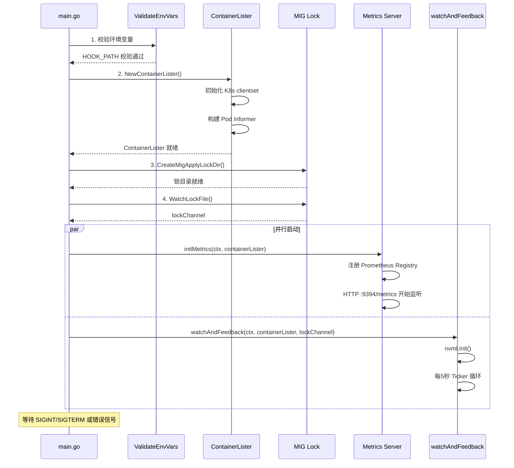
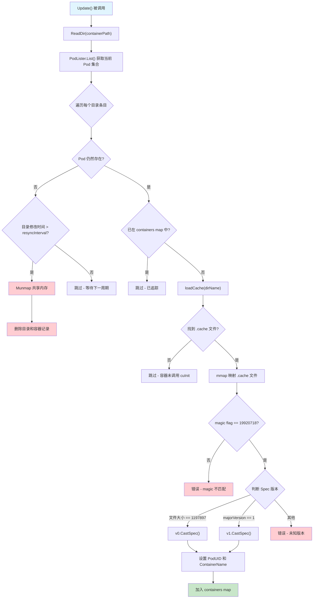
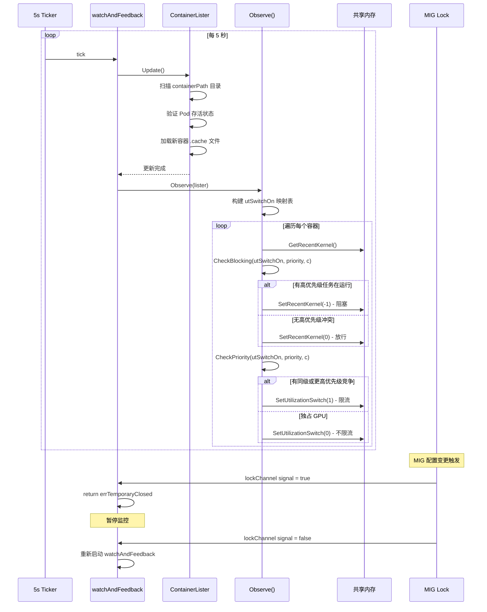
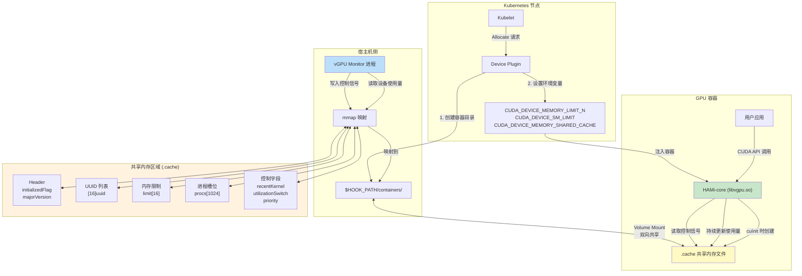

## 概述

vGPU Monitor 是 HAMi 系统的核心监控组件，以 DaemonSet 形式运行在每个 GPU 节点上。它通过读取宿主机上的共享内存文件来获取容器内 GPU 的实际使用情况，并将利用率、优先级等信息反馈回共享内存区域，实现对容器 GPU 资源的闭环控制。

**源码入口**: `cmd/vGPUmonitor/main.go`

```
cmd/vGPUmonitor/
  |- main.go          # 程序入口，启动 HTTP metrics 服务与监控反馈循环
  |- feedback.go      # watchAndFeedback() 核心反馈逻辑
  |- metrics.go       # Prometheus 指标采集器实现
  |- validation.go    # 环境变量校验
```

---

## 1. 启动流程

vGPUmonitor 的启动由 `cobra.Command` 驱动，核心函数为 `start()`。启动过程依次执行以下关键步骤:

1. **环境变量校验** - 验证 `HOOK_PATH` 等必要环境变量
2. **ContainerLister 初始化** - 创建容器发现器，连接 Kubernetes API 和共享内存目录
3. **MIG Lock 目录准备** - 创建 MIG 配置锁目录，防止 MIG 应用期间的竞态条件
4. **并行服务启动** - 同时启动 Metrics HTTP 服务和监控反馈循环

```go
// start() 核心逻辑概览
func start() error {
    ValidateEnvVars()                    // 环境变量校验
    containerLister := nvidia.NewContainerLister()  // 容器发现
    plugin.CreateMigApplyLockDir()       // MIG 锁准备
    lockChannel := plugin.WatchLockFile()

    // 并行启动两大服务
    go initMetrics(ctx, containerLister)        // Prometheus 指标服务
    go watchAndFeedback(ctx, containerLister, lockChannel)  // 监控反馈循环
}
```



---

## 2. 容器发现机制

### 2.1 ContainerLister 的工作原理

`ContainerLister`（定义在 `pkg/monitor/nvidia/cudevshr.go`）是容器发现的核心组件。它不直接通过 CRI 接口枚举容器，而是基于 **共享文件系统** 的方式发现 GPU 容器:

1. 扫描 `$HOOK_PATH/containers/` 目录
2. 目录名格式为 `{PodUID}_{ContainerName}`
3. 在每个容器目录下查找 `.cache` 文件
4. 通过 `mmap` 映射 `.cache` 文件到内存，解析共享内存区域

```go
// ContainerLister 核心结构
type ContainerLister struct {
    containerPath string                    // $HOOK_PATH/containers/
    containers    map[string]*ContainerUsage // containerID -> 使用情况
    mutex         sync.Mutex
    clientset     *kubernetes.Clientset
    nodeName      string
    podLister     corelisters.PodLister     // 基于 Informer 的 Pod 缓存
}
```

### 2.2 容器目录的创建时机

当 Device Plugin 执行 `Allocate()` 响应 kubelet 的设备分配请求时，会创建容器对应的缓存目录:

```go
// server.go 中的 Allocate() 调用
cacheFileHostDirectory := fmt.Sprintf("%s/vgpu/containers/%s_%s",
    hostHookPath, current.UID, currentCtr.Name)
os.MkdirAll(cacheFileHostDirectory, 0777)
```

容器内的 HAMi-core（`libvgpu.so`）在初始化时（`cuInit` 调用）会在该目录下创建 `.cache` 共享内存文件。

### 2.3 Update() 更新逻辑

`Update()` 方法每个 Ticker 周期调用一次，负责:

1. 列出 `containerPath` 下的所有目录
2. 通过 Pod Informer 验证 Pod 是否仍然存在
3. 对已不存在的 Pod，清理其共享内存映射和目录
4. 对新发现的容器，加载并映射其 `.cache` 文件



---

## 3. 宿主机侧共享内存读取

### 3.1 共享内存文件结构

HAMi-core 在容器内部通过 `libvgpu.so` 创建一块共享内存区域（`.cache` 文件），该文件通过 volume mount 暴露到宿主机的 `$HOOK_PATH/containers/{PodUID}_{ContainerName}/` 目录下。

共享内存头部的前 12 字节用于版本标识:

```go
type headerT struct {
    initializedFlag int32  // 魔数 19920718，标识有效的共享区域
    majorVersion    int32  // 主版本号
    minorVersion    int32  // 次版本号
}
```

### 3.2 Spec 版本对比 - v0 vs v1

HAMi 支持两种共享内存格式，通过文件大小和版本号区分:

| 特性 | v0 | v1 |
|------|----|----|
| **识别方式** | 文件大小 == 1197897 字节 | `majorVersion == 1` |
| **版本字段** | 无显式版本号 | 有 `majorVersion`/`minorVersion` |
| **deviceMemory 结构** | 5 个 uint64 字段 (40 字节) | 5 + 3 个 unused uint64 (64 字节) |
| **deviceUtilization 结构** | 3 个 uint64 字段 (24 字节) | 3 + 3 个 unused uint64 (48 字节) |
| **shrregProcSlotT** | 无 unused 字段 | 有 3 个 unused uint64 |
| **lastKernelTime** | 不支持（返回 0） | 支持 int64 时间戳 |
| **sharedRegionT 尾部** | 无扩展字段 | 有 `lastKernelTime` + 4 个 unused uint64 |
| **procnum 遍历** | 遍历全部 1024 个 proc slot | 仅遍历前 `procnum` 个 slot |

```mermaid
flowchart LR
    subgraph v0region["v0 sharedRegionT"]
        direction TB
        V0A["initializedFlag (int32)"]
        V0B["smInitFlag (int32)"]
        V0C["ownerPid (uint32)"]
        V0D["sem (32 bytes)"]
        V0E["num (uint64) - 设备数量"]
        V0F["uuids [16]uuid"]
        V0G["limit [16]uint64"]
        V0H["smLimit [16]uint64"]
        V0I["procs [1024]shrregProcSlotT"]
        V0J["procnum / utilizationSwitch"]
        V0K["recentKernel / priority"]
    end

    subgraph v1region["v1 sharedRegionT"]
        direction TB
        V1A["initializedFlag (int32)"]
        V1A2["majorVersion (int32)"]
        V1A3["minorVersion (int32)"]
        V1B["smInitFlag (int32)"]
        V1C["ownerPid (uint32)"]
        V1D["sem (32 bytes)"]
        V1E["num (uint64) - 设备数量"]
        V1F["uuids [16]uuid"]
        V1G["limit [16]uint64"]
        V1H["smLimit [16]uint64"]
        V1I["procs [1024]shrregProcSlotT"]
        V1J["procnum / utilizationSwitch"]
        V1K["recentKernel / priority"]
        V1L["lastKernelTime (int64)"]
        V1M["unused [4]uint64"]
    end

    style V1A2 fill:#fff9c4
    style V1A3 fill:#fff9c4
    style V1L fill:#fff9c4
    style V1M fill:#fff9c4
```



### 3.3 UsageInfo 接口

两种 Spec 版本都实现了统一的 `UsageInfo` 接口，Monitor 侧通过该接口读写共享内存:

```go
type UsageInfo interface {
    DeviceMax() int                       // 最大设备数 (16)
    DeviceNum() int                       // 实际使用的设备数
    DeviceMemoryTotal(idx int) uint64     // 设备总内存用量
    DeviceMemoryLimit(idx int) uint64     // 设备内存限制
    DeviceSmUtil(idx int) uint64          // SM 利用率
    IsValidUUID(idx int) bool             // UUID 是否有效
    DeviceUUID(idx int) string            // 设备 UUID
    GetPriority() int                     // 容器优先级
    GetRecentKernel() int32               // 最近 kernel 活跃度
    SetRecentKernel(v int32)              // 设置 kernel 活跃度 (写回)
    GetUtilizationSwitch() int32          // 利用率开关
    SetUtilizationSwitch(v int32)         // 设置利用率开关 (写回)
    LastKernelTime() int64                // 最后一次 kernel 执行时间 (仅 v1)
    // ...
}
```

---

## 4. 反馈循环 - watchAndFeedback()

`watchAndFeedback()` 是 vGPU Monitor 的核心控制循环。它以 **每 5 秒** 一个周期运行，执行以下流程:

1. 调用 `lister.Update()` 刷新容器列表
2. 调用 `Observe()` 分析优先级和利用率，写回控制信号

### 4.1 优先级与阻塞控制

`Observe()` 函数实现了基于优先级的 GPU 时间片调度:

- **utSwitchOn**: 记录每个 GPU UUID 上各优先级级别的活跃容器数
- **CheckBlocking()**: 检查是否有更高优先级任务正在使用 GPU，如果有则阻塞当前容器
- **CheckPriority()**: 检查是否有同优先级或更高优先级任务共享 GPU

反馈机制通过直接写入共享内存的方式实现:

- `SetRecentKernel(-1)`: 通知 HAMi-core 阻塞当前容器的 GPU kernel 提交
- `SetRecentKernel(0)`: 解除阻塞
- `SetUtilizationSwitch(1)`: 通知 HAMi-core 启用利用率限制
- `SetUtilizationSwitch(0)`: 关闭利用率限制

### 4.2 MIG Lock 机制

当节点需要重新配置 MIG（Multi-Instance GPU）时，会创建一个锁文件。`watchAndFeedback()` 检测到锁信号后，返回 `errTemporaryClosed` 错误并暂停监控，等待锁文件被删除后自动恢复。



---

## 5. 宿主机-容器共享内存交互全景图

下图展示了 vGPU Monitor 在宿主机侧与容器内 HAMi-core 通过共享内存进行双向通信的完整架构:



---

## 6. 关键配置参数

| 参数 | 默认值 | 说明 |
|------|--------|------|
| `--metrics-bind-address` | `:9394` | Prometheus 指标 HTTP 端口 |
| `HOOK_PATH` 环境变量 | 必须设置 | HAMi-core 挂载路径 |
| `NODE_NAME` 环境变量 | 必须设置 | 当前节点名称 |
| `HAMI_RESYNC_INTERVAL` 环境变量 | `5m` | Pod Informer 重同步间隔 |
| Ticker 周期 | `5s` | watchAndFeedback 循环间隔 |
| SharedRegionMagicFlag | `19920718` | 共享内存文件魔数 |
| 最大设备数 | `16` | 单容器最大 GPU 设备数 |
| 进程槽位数 | `1024` | 单容器最大进程数 |

---

## 7. 故障排查要点

1. **Monitor 启动失败** - 检查 `HOOK_PATH` 环境变量是否正确设置，对应目录是否存在
2. **容器 GPU 使用量始终为 0** - 检查容器是否成功加载 `libvgpu.so`（查看 `/etc/ld.so.preload`），确认 `.cache` 文件是否已创建
3. **共享内存 magic 不匹配** - HAMi-core 版本与 Monitor 版本不一致，需统一升级
4. **Pod 删除后目录残留** - 正常现象，Monitor 会在 `resyncInterval` 后自动清理
5. **MIG 模式切换时监控中断** - 正常行为，Monitor 会在 MIG 锁释放后自动恢复
