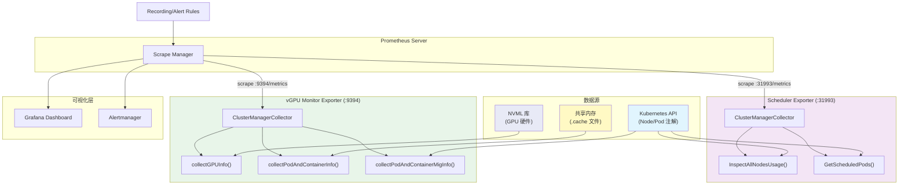
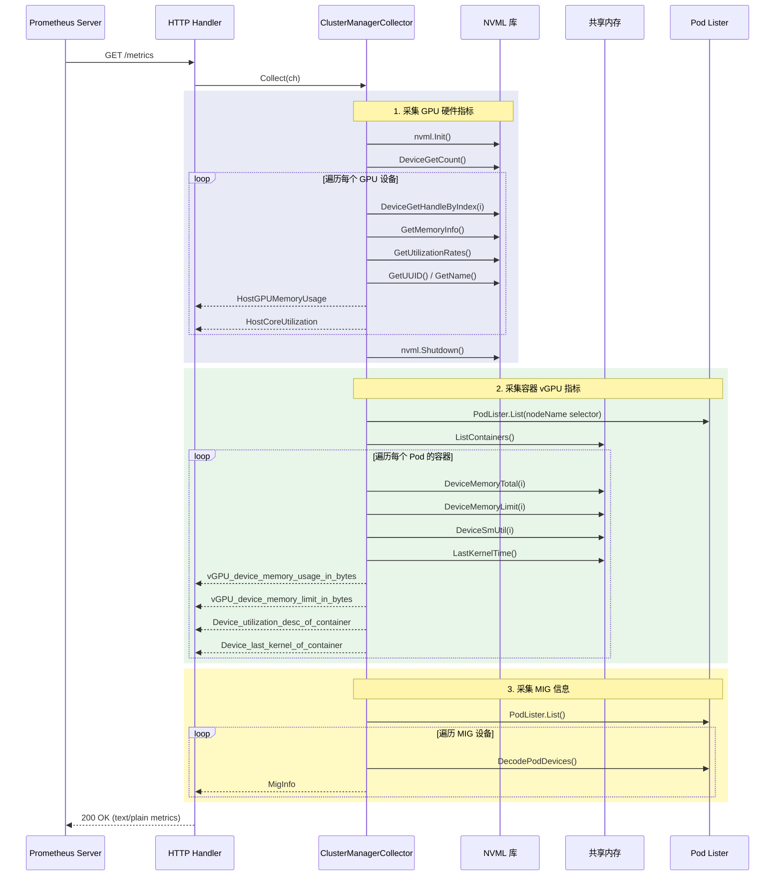

## 概述

HAMi 提供了完整的 Prometheus 指标体系，覆盖从调度层到运行时层的 GPU 资源视图。指标数据由两个独立的 Exporter 生成:

- **Scheduler Metrics** (`cmd/scheduler/metrics.go`) - 调度器视角的集群级 GPU 分配指标
- **Monitor Metrics** (`cmd/vGPUmonitor/metrics.go`) - 节点级别的容器 GPU 实际使用指标

两个 Exporter 均基于 Prometheus Go client library 的自定义 `Collector` 接口实现，每次 `/metrics` 请求触发实时数据采集。

---

## 1. 指标采集管道架构



---

## 2. Scheduler 指标详解

Scheduler Exporter 运行在 HAMi Scheduler Pod 中，默认端口 `:31993`。它从调度器内部的设备缓存中提取集群全局的 GPU 分配视图。

### 2.1 设备级指标

| 指标名 | 类型 | 标签 | 说明 |
|--------|------|------|------|
| `GPUDeviceMemoryLimit` | Gauge | `nodeid`, `deviceuuid`, `deviceidx`, `devicetype` | GPU 设备总显存（字节） |
| `GPUDeviceCoreLimit` | Gauge | `nodeid`, `deviceuuid`, `deviceidx`, `devicetype` | GPU 设备总核心数 |
| `GPUDeviceMemoryAllocated` | Gauge | `nodeid`, `deviceuuid`, `deviceidx`, `devicecores`, `devicetype` | 已分配的显存（字节） |
| `GPUDeviceCoreAllocated` | Gauge | `nodeid`, `deviceuuid`, `deviceidx`, `devicetype` | 已分配的核心百分比 |
| `GPUDeviceSharedNum` | Gauge | `nodeid`, `deviceuuid`, `deviceidx`, `devicetype` | 共享该 GPU 的容器数量 |
| `nodeGPUOverview` | Gauge | `nodeid`, `deviceuuid`, `deviceidx`, `devicecores`, `sharedcontainers`, `devicememorylimit`, `devicetype` | GPU 综合概览 |
| `nodeGPUMemoryPercentage` | Gauge | `nodeid`, `deviceuuid`, `deviceidx` | 显存已分配百分比 |
| `nodeGPUMigInstance` | Gauge | `nodeid`, `deviceuuid`, `deviceidx`, `migname` | MIG 实例使用状态（0/1） |

### 2.2 容器级指标

| 指标名 | 类型 | 标签 | 说明 |
|--------|------|------|------|
| `vGPUMemoryAllocated` | Gauge | `podnamespace`, `nodename`, `podname`, `containeridx`, `deviceuuid` | 容器分配的 vGPU 显存（字节） |
| `vGPUCoreAllocated` | Gauge | `podnamespace`, `nodename`, `podname`, `containeridx`, `deviceuuid` | 容器分配的 vGPU 核心 |

### 2.3 资源配额指标

| 指标名 | 类型 | 标签 | 说明 |
|--------|------|------|------|
| `QuotaUsed` | Gauge | `quotanamespace`, `quotaName`, `limit` | 设备资源配额使用量 |

---

## 3. Monitor 指标详解

Monitor Exporter 以 DaemonSet 形式运行在每个 GPU 节点上，默认端口 `:9394`。它通过 NVML 和共享内存采集 GPU 和容器的实时使用数据。

### 3.1 宿主机 GPU 指标

这些指标通过 NVML（NVIDIA Management Library）直接从 GPU 硬件获取:

| 指标名 | 类型 | 标签 | 说明 |
|--------|------|------|------|
| `HostGPUMemoryUsage` | Gauge | `deviceidx`, `deviceuuid`, `devicetype` | 宿主机 GPU 物理显存已使用量（字节） |
| `HostCoreUtilization` | Gauge | `deviceidx`, `deviceuuid`, `devicetype` | 宿主机 GPU 核心利用率（百分比） |

### 3.2 容器 vGPU 指标

这些指标通过读取共享内存文件（`.cache`）获取，反映容器内 GPU 的实际使用情况:

| 指标名 | 类型 | 标签 | 说明 |
|--------|------|------|------|
| `vGPU_device_memory_usage_in_bytes` | Gauge | `podnamespace`, `podname`, `ctrname`, `vdeviceid`, `deviceuuid` | 容器 vGPU 实际显存用量 |
| `vGPU_device_memory_limit_in_bytes` | Gauge | `podnamespace`, `podname`, `ctrname`, `vdeviceid`, `deviceuuid` | 容器 vGPU 显存限制 |
| `Device_memory_desc_of_container` | Gauge | `podnamespace`, `podname`, `ctrname`, `vdeviceid`, `deviceuuid`, `context`, `module`, `data`, `offset` | 容器设备内存详细描述（即将废弃） |
| `Device_utilization_desc_of_container` | Gauge | `podnamespace`, `podname`, `ctrname`, `vdeviceid`, `deviceuuid` | 容器设备 SM 利用率 |
| `Device_last_kernel_of_container` | Gauge | `podnamespace`, `podname`, `ctrname`, `vdeviceid`, `deviceuuid` | 距最后一次 kernel 执行的秒数 |
| `vGPU_device_memory_context_size_bytes` | Gauge | `podnamespace`, `podname`, `ctrname`, `vdeviceid`, `deviceuuid` | Context 内存大小 |
| `vGPU_device_memory_module_size_bytes` | Gauge | `podnamespace`, `podname`, `ctrname`, `vdeviceid`, `deviceuuid` | Module 内存大小 |
| `vGPU_device_memory_buffer_size_bytes` | Gauge | `podnamespace`, `podname`, `ctrname`, `vdeviceid`, `deviceuuid` | Buffer 内存大小 |
| `MigInfo` | Gauge | `podnamespace`, `podname`, `ctrname`, `vdeviceid`, `deviceuuid`, `instanceid` | MIG 实例信息 |

### 3.3 构建信息指标

| 指标名 | 类型 | 标签 | 说明 |
|--------|------|------|------|
| `hami_build_info` | Gauge | `version`, `revision`, `build_date`, `go_version`, `compiler`, `platform` | HAMi 构建版本信息，常量值 1 |

---

## 4. Grafana Dashboard 配置指南

### 4.1 前置条件

1. Prometheus 已配置 HAMi 的 scrape targets
2. Grafana 已添加 Prometheus 数据源

### 4.2 Prometheus Scrape 配置

```yaml
# prometheus.yml
scrape_configs:
  # HAMi Scheduler 指标
  - job_name: 'hami-scheduler'
    kubernetes_sd_configs:
      - role: pod
    relabel_configs:
      - source_labels: [__meta_kubernetes_pod_label_app]
        regex: hami-scheduler
        action: keep
      - source_labels: [__meta_kubernetes_pod_ip]
        target_label: __address__
        replacement: '$1:31993'

  # HAMi vGPU Monitor 指标
  - job_name: 'hami-vgpu-monitor'
    kubernetes_sd_configs:
      - role: pod
    relabel_configs:
      - source_labels: [__meta_kubernetes_pod_label_app]
        regex: hami-device-plugin
        action: keep
      - source_labels: [__meta_kubernetes_pod_ip]
        target_label: __address__
        replacement: '$1:9394'
```

### 4.3 关键 Dashboard 面板推荐

**面板 1: 集群 GPU 概览**

```promql
# 集群总显存
sum(GPUDeviceMemoryLimit)

# 集群已分配显存
sum(GPUDeviceMemoryAllocated)

# 集群 GPU 分配率
sum(GPUDeviceMemoryAllocated) / sum(GPUDeviceMemoryLimit) * 100
```

**面板 2: 节点级 GPU 使用率**

```promql
# 各节点物理显存使用率
HostGPUMemoryUsage / on(deviceuuid) group_left GPUDeviceMemoryLimit * 100

# 各节点 GPU 核心利用率
HostCoreUtilization
```

**面板 3: 容器级 vGPU 监控**

```promql
# 容器 vGPU 显存使用率
vGPU_device_memory_usage_in_bytes / vGPU_device_memory_limit_in_bytes * 100

# 容器设备利用率
Device_utilization_desc_of_container

# 容器空闲检测（距最后 kernel 执行超过 5 分钟的容器）
Device_last_kernel_of_container > 300
```

**面板 4: GPU 共享与碎片化**

```promql
# 每个 GPU 上的容器数
GPUDeviceSharedNum

# GPU 显存碎片率（分配但未实际使用的比例）
(vGPU_device_memory_limit_in_bytes - vGPU_device_memory_usage_in_bytes)
  / vGPU_device_memory_limit_in_bytes * 100
```

### 4.4 Grafana Dashboard JSON 导入

HAMi 官方提供了预配置的 Grafana Dashboard，可以通过以下方式导入:

```bash
# 获取官方 Dashboard JSON
kubectl get configmap hami-grafana-dashboard -n hami-system -o jsonpath='{.data.dashboard\.json}' > dashboard.json

# 或从 Grafana Dashboard ID 导入
# Grafana.com Dashboard ID: 根据实际项目发布的ID导入
```

---

## 5. 告警规则示例

### 5.1 GPU 显存告警

```yaml
# gpu-alerts.yaml
groups:
  - name: hami-gpu-alerts
    rules:
      # GPU 物理显存使用率超过 90%
      - alert: GPUMemoryUsageHigh
        expr: |
          HostGPUMemoryUsage / on(deviceuuid)
          group_left(devicetype) GPUDeviceMemoryLimit > 0.9
        for: 5m
        labels:
          severity: warning
        annotations:
          summary: "GPU 显存使用率过高"
          description: |
            节点 {{ $labels.nodeid }} 上的 GPU {{ $labels.deviceuuid }}
            ({{ $labels.devicetype }}) 显存使用率超过 90%，
            当前值: {{ $value | humanizePercentage }}

      # GPU 核心利用率持续 100%
      - alert: GPUCoreUtilizationSaturated
        expr: HostCoreUtilization == 100
        for: 15m
        labels:
          severity: warning
        annotations:
          summary: "GPU 核心利用率饱和"
          description: |
            GPU {{ $labels.deviceuuid }} 核心利用率持续 15 分钟保持 100%
```

### 5.2 vGPU 容器告警

```yaml
      # 容器 vGPU 显存超过限制的 95%
      - alert: ContainerVGPUMemoryNearLimit
        expr: |
          vGPU_device_memory_usage_in_bytes
          / vGPU_device_memory_limit_in_bytes > 0.95
        for: 2m
        labels:
          severity: warning
        annotations:
          summary: "容器 vGPU 显存接近限制"
          description: |
            Pod {{ $labels.podnamespace }}/{{ $labels.podname }}
            容器 {{ $labels.ctrname }} 的 vGPU 显存使用率超过 95%
```

### 5.3 GPU 空闲检测告警

```yaml
      # 容器长时间没有 GPU kernel 执行
      - alert: ContainerGPUIdle
        expr: Device_last_kernel_of_container > 1800
        for: 5m
        labels:
          severity: info
        annotations:
          summary: "容器 GPU 长时间空闲"
          description: |
            Pod {{ $labels.podnamespace }}/{{ $labels.podname }}
            容器 {{ $labels.ctrname }} 已超过 30 分钟无 GPU kernel 执行，
            可能存在资源浪费
```

### 5.4 集群级告警

```yaml
      # 集群 GPU 显存分配率过高
      - alert: ClusterGPUMemoryAllocationHigh
        expr: |
          sum(GPUDeviceMemoryAllocated)
          / sum(GPUDeviceMemoryLimit) > 0.85
        for: 10m
        labels:
          severity: warning
        annotations:
          summary: "集群 GPU 显存分配率过高"
          description: |
            集群 GPU 显存分配率超过 85%，
            当前值: {{ $value | humanizePercentage }}

      # 单 GPU 上共享容器数过多
      - alert: GPUOversharing
        expr: GPUDeviceSharedNum > 10
        for: 5m
        labels:
          severity: warning
        annotations:
          summary: "GPU 共享容器数过多"
          description: |
            节点 {{ $labels.nodeid }} GPU {{ $labels.deviceuuid }}
            上运行了 {{ $value }} 个容器，可能导致性能下降

      # vGPU Monitor 指标端点不可达
      - alert: VGPUMonitorDown
        expr: up{job="hami-vgpu-monitor"} == 0
        for: 2m
        labels:
          severity: critical
        annotations:
          summary: "vGPU Monitor 不可达"
          description: |
            节点上的 vGPU Monitor 指标采集端点已不可达超过 2 分钟
```

---

## 6. 指标采集流程内部时序



---

## 7. 常见问题

### 7.1 指标不可见

- 检查 Exporter Pod 是否正常运行
- 检查 Prometheus scrape target 是否正确配置
- 确认端口（`:9394` 或 `:31993`）是否可访问

### 7.2 容器指标为空

- 确认容器已成功加载 `libvgpu.so`
- 检查共享内存文件（`.cache`）是否已创建
- 验证 Pod 注解中的设备信息是否完整

### 7.3 显存数据不一致

- **Scheduler 指标** 反映的是 **分配量**（调度器视角）
- **Monitor 指标** 反映的是 **实际使用量**（运行时视角）
- 两者差异是正常的，分配量通常大于等于实际使用量
