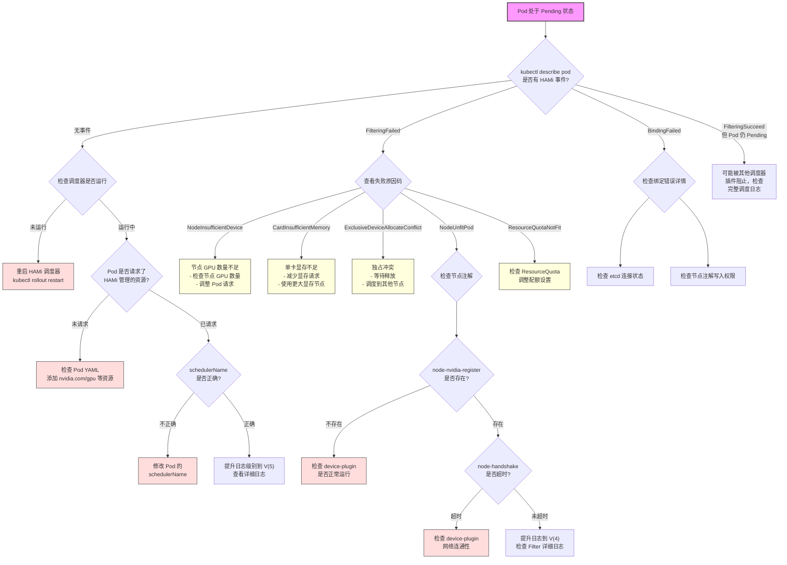

## 目录

- [概述](#概述)
- [日志级别配置](#日志级别配置)
- [Pod 调度失败排查流程](#pod-调度失败排查流程)
- [常见失败模式速查表](#常见失败模式速查表)
- [节点注解检查](#节点注解检查)
- [pprof 性能分析](#pprof-性能分析)
- [调试决策树](#调试决策树)

---

## 概述

HAMi 调度器基于 Kubernetes Scheduler Framework 构建，在 Filter 和 Score 阶段执行 GPU 设备的筛选与评分逻辑。当 Pod 无法正常调度时，需要从调度器日志、Pod 事件、节点注解三个维度进行排查。本文档提供系统化的调试方法论。

---

## 日志级别配置

HAMi 调度器使用 `klog` 作为日志框架，通过 `-v` 参数控制日志详细程度。

### klog 日志级别说明

| 级别 | 参数 | 输出内容 | 适用场景 |
|------|------|----------|----------|
| 0 | `-v=0` | 仅错误和关键信息 | 生产环境默认 |
| 2 | `-v=2` | 评分（Scoring）阶段详情 | 排查节点评分异常 |
| 4 | `-v=4` | 过滤（Filtering）阶段详情 | 排查节点被过滤原因 |
| 5 | `-v=5` | 完整的调度链路追踪 | 深度调试，开发环境使用 |

### 配置方式

**方式一 - Helm values.yaml 配置：**

```yaml
scheduler:
  extraArgs:
    - "-v=4"
```

**方式二 - 直接修改 Deployment：**

```bash
kubectl edit deployment hami-scheduler -n kube-system
```

在容器的 `args` 中添加：

```yaml
args:
  - "--v=4"
```

**方式三 - 临时调试（不推荐生产使用）：**

```bash
# 通过 patch 临时提升日志级别
kubectl patch deployment hami-scheduler -n kube-system \
  --type='json' \
  -p='[{"op": "add", "path": "/spec/template/spec/containers/0/args/-", "value": "--v=5"}]'
```

> **注意：** 级别 4 及以上会产生大量日志，建议仅在排查问题时临时启用，排查完成后恢复到级别 0 或 2。

---

## Pod 调度失败排查流程

当 Pod 处于 `Pending` 状态且疑似 GPU 调度问题时，按以下步骤逐层排查。

### 第一步 - 查看 Pod 事件

```bash
kubectl describe pod <pod-name> -n <namespace>
```

关注 `Events` 部分，HAMi 调度器会写入以下事件类型：

| 事件类型 | 含义 |
|----------|------|
| `EventReasonFilteringFailed` | 过滤阶段失败，所有节点均不满足条件 |
| `EventReasonFilteringSucceed` | 过滤阶段成功，存在可用节点 |
| `EventReasonBindingFailed` | 绑定阶段失败，设备分配写入失败 |
| `EventReasonBindingSucceed` | 绑定阶段成功，Pod 成功调度 |

**示例输出：**

```
Events:
  Type     Reason             Age   From              Message
  ----     ------             ----  ----              -------
  Warning  FilteringFailed    10s   hami-scheduler    Bindingfailed: CardInsufficientMemory on node gpu-node-01
```

### 第二步 - 查看调度器日志

```bash
# 获取调度器 Pod 名称
SCHEDULER_POD=$(kubectl get pods -n kube-system -l app=hami-scheduler -o jsonpath='{.items[0].metadata.name}')

# 查看最近日志
kubectl logs $SCHEDULER_POD -n kube-system --tail=200

# 按 Pod 名称过滤日志
kubectl logs $SCHEDULER_POD -n kube-system | grep "<target-pod-name>"

# 过滤 Filtering 相关日志
kubectl logs $SCHEDULER_POD -n kube-system | grep "FilteringFailed"
```

当日志级别为 V(4) 时，可以看到每个节点的过滤详情：

```
I0211 10:30:15.123456  1  filter.go:125] Filtering node gpu-node-01 for pod test-pod
I0211 10:30:15.123789  1  filter.go:150] Node gpu-node-01 filtered out: CardInsufficientMemory, requested 8192Mi but available 4096Mi
```

### 第三步 - 识别失败原因码

从日志或事件中提取失败原因码（定义于 `common/common.go`），对照下方速查表定位根因。

### 第四步 - 检查节点设备注册

```bash
# 查看节点上的 GPU 注册注解
kubectl get node <node-name> -o jsonpath='{.metadata.annotations}' | python3 -m json.tool | grep hami

# 关键注解
kubectl get node <node-name> -o jsonpath='{.metadata.annotations.hami\.io/node-nvidia-register}'
```

如果 `hami.io/node-nvidia-register` 注解不存在或为空，说明该节点的 device-plugin 未成功注册 GPU 设备。

### 第五步 - 验证握手注解

```bash
# 检查握手时间戳
kubectl get node <node-name> -o jsonpath='{.metadata.annotations.hami\.io/node-handshake}'
```

握手注解 `hami.io/node-handshake` 记录了 device-plugin 最近一次向调度器上报心跳的时间戳。如果该时间戳距当前时间超过阈值（默认 300 秒），调度器会认为该节点的设备信息不可信，拒绝调度。

```bash
# 对比当前时间，检查是否超时
HANDSHAKE=$(kubectl get node <node-name> -o jsonpath='{.metadata.annotations.hami\.io/node-handshake}')
echo "Handshake timestamp: $HANDSHAKE"
echo "Current timestamp: $(date +%s)"
```

---

## 常见失败模式速查表

| 原因码 | 含义 | 可能原因 | 解决方案 |
|--------|------|----------|----------|
| `NodeInsufficientDevice` | 节点设备数量不足 | 节点上的 GPU 数量少于 Pod 请求数量 | 检查节点 GPU 数量，调整 Pod 资源请求 |
| `CardInsufficientMemory` | 单卡显存不足 | 请求的显存超过单卡可分配显存 | 减少显存请求量，或使用更大显存的 GPU 节点 |
| `ExclusiveDeviceAllocateConflict` | 独占设备分配冲突 | Pod 请求独占模式的 GPU，但该 GPU 已被其他 Pod 共享使用 | 等待占用 Pod 释放，或调度到其他节点 |
| `NodeUnfitPod` | 节点不适合该 Pod | 节点设备信息过期或不匹配 Pod 的设备类型要求 | 检查 device-plugin 状态，确认设备注解正确 |
| `ResourceQuotaNotFit` | 资源配额不满足 | 命名空间的 ResourceQuota 限制了 GPU 资源使用 | 检查并调整 ResourceQuota 配置 |

### 扩展排查 - 无事件输出的情况

如果 `kubectl describe pod` 完全没有 HAMi 相关事件：

1. **确认调度器是否运行：**
   ```bash
   kubectl get pods -n kube-system -l app=hami-scheduler
   ```

2. **确认 Pod 是否请求了 HAMi 资源：**
   ```bash
   kubectl get pod <pod-name> -o jsonpath='{.spec.containers[*].resources}'
   ```
   必须包含 `nvidia.com/gpu` 等 HAMi 管理的资源类型。

3. **确认 schedulerName 是否正确：**
   ```bash
   kubectl get pod <pod-name> -o jsonpath='{.spec.schedulerName}'
   ```
   如果使用了自定义调度器名称，需与 HAMi 调度器配置一致。

---

## 节点注解检查

### 关键注解清单

| 注解 Key | 写入方 | 含义 |
|----------|--------|------|
| `hami.io/node-handshake` | device-plugin | 节点心跳时间戳 |
| `hami.io/node-nvidia-register` | device-plugin | NVIDIA GPU 注册信息（JSON 格式） |
| `hami.io/node-nvidia-assume` | scheduler | 调度器假定的设备分配状态 |

### 批量检查脚本

```bash
#!/bin/bash
# check-node-annotations.sh
# 批量检查所有节点的 HAMi 注解状态

echo "=== HAMi 节点注解检查 ==="
echo ""

CURRENT_TS=$(date +%s)

for node in $(kubectl get nodes -o jsonpath='{.items[*].metadata.name}'); do
    echo "--- 节点: $node ---"

    # 检查设备注册
    REGISTER=$(kubectl get node $node -o jsonpath='{.metadata.annotations.hami\.io/node-nvidia-register}' 2>/dev/null)
    if [ -z "$REGISTER" ]; then
        echo "  [WARNING] GPU 未注册 (hami.io/node-nvidia-register 为空)"
    else
        echo "  [OK] GPU 已注册"
    fi

    # 检查握手时间
    HANDSHAKE=$(kubectl get node $node -o jsonpath='{.metadata.annotations.hami\.io/node-handshake}' 2>/dev/null)
    if [ -z "$HANDSHAKE" ]; then
        echo "  [WARNING] 无握手记录 (hami.io/node-handshake 为空)"
    else
        DIFF=$((CURRENT_TS - HANDSHAKE))
        if [ $DIFF -gt 300 ]; then
            echo "  [ERROR] 握手超时 (${DIFF}s ago, 阈值 300s)"
        else
            echo "  [OK] 握手正常 (${DIFF}s ago)"
        fi
    fi

    echo ""
done
```

---

## pprof 性能分析

HAMi 调度器支持通过 `--profiling` 标志开启 pprof 性能分析端点，用于诊断调度器本身的性能瓶颈。

### 启用 pprof

在调度器启动参数中添加：

```yaml
args:
  - "--profiling=true"
```

或通过 Helm values：

```yaml
scheduler:
  extraArgs:
    - "--profiling=true"
```

### 访问 pprof 端点

```bash
# 端口转发到本地
kubectl port-forward -n kube-system deployment/hami-scheduler 10251:10251

# CPU 分析（采样 30 秒）
go tool pprof http://localhost:10251/debug/pprof/profile?seconds=30

# 内存分析
go tool pprof http://localhost:10251/debug/pprof/heap

# Goroutine 分析
go tool pprof http://localhost:10251/debug/pprof/goroutine

# 查看所有可用端点
curl http://localhost:10251/debug/pprof/
```

### 常见性能问题分析

| 症状 | pprof 分析方向 | 可能原因 |
|------|----------------|----------|
| 调度延迟高 | CPU profile | Filter/Score 逻辑计算复杂，节点数量过多 |
| 内存持续增长 | Heap profile | 设备信息缓存未释放 |
| Goroutine 泄漏 | Goroutine profile | 节点锁未正确释放 |

### 生成火焰图

```bash
# 安装 pprof 可视化工具
go install github.com/google/pprof@latest

# 生成 CPU 火焰图
go tool pprof -http=:8080 http://localhost:10251/debug/pprof/profile?seconds=30
```

浏览器打开 `http://localhost:8080`，切换到 Flame Graph 视图，可直观定位 CPU 热点函数。

---

## 调试决策树

以下流程图展示了 Pod 调度失败时的系统化排查路径。



---

## 附录 - 快速排查命令清单

```bash
# 1. 查看调度器状态
kubectl get pods -n kube-system -l app=hami-scheduler

# 2. 查看调度器日志（最近 100 行）
kubectl logs -n kube-system -l app=hami-scheduler --tail=100

# 3. 查看 Pending Pod 及其事件
kubectl get pods --all-namespaces --field-selector=status.phase=Pending
kubectl describe pod <pod-name> -n <namespace>

# 4. 检查所有节点的 GPU 注册
kubectl get nodes -o custom-columns='NAME:.metadata.name,GPU_REGISTERED:.metadata.annotations.hami\.io/node-nvidia-register'

# 5. 检查节点握手状态
kubectl get nodes -o custom-columns='NAME:.metadata.name,HANDSHAKE:.metadata.annotations.hami\.io/node-handshake'

# 6. 查看调度器配置
kubectl get configmap -n kube-system hami-scheduler-config -o yaml
```
