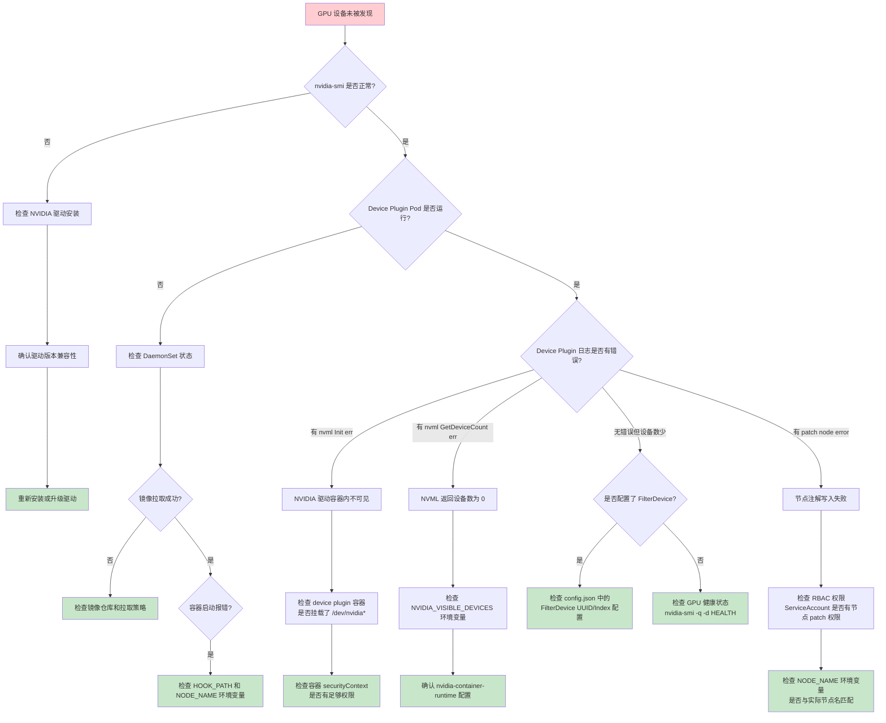
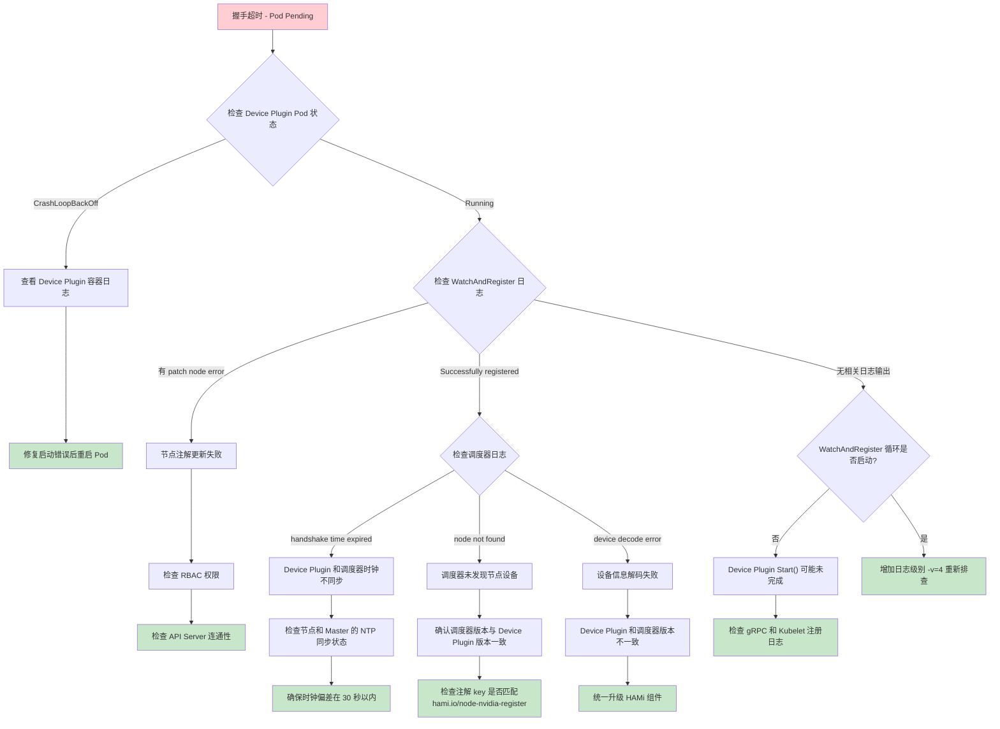
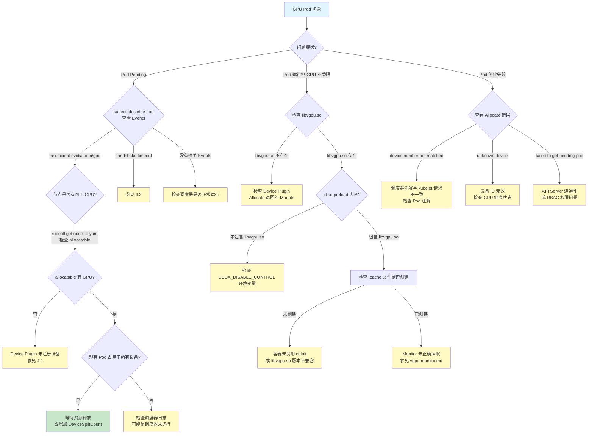

## 概述

HAMi Device Plugin 是运行在每个 GPU 节点上的 DaemonSet 组件，负责向 Kubelet 注册 GPU 设备、处理 Allocate 请求并维护节点注解。本文档系统性地介绍 Device Plugin 相关问题的调试方法和常见故障排查流程。

**核心源码路径**:
- `pkg/device-plugin/nvidiadevice/nvinternal/plugin/server.go` - gRPC 服务与 Allocate 逻辑
- `pkg/device-plugin/nvidiadevice/nvinternal/plugin/register.go` - 设备注册与节点注解
- `pkg/device/nvidia/device.go` - 设备定义与常量

---

## 1. Device Plugin 日志分析

### 1.1 关键日志级别

HAMi Device Plugin 使用 `klog` 日志库，日志级别通过 `-v` 参数控制:

| 级别 | 含义 | 典型内容 |
|------|------|----------|
| `-v=0` | Error/Fatal | 致命错误、panic |
| `-v=1` | Info | 启动、注册、分配的关键事件 |
| `-v=3` | Warning | 非致命警告（如 MIG 降级） |
| `-v=4` | Debug 基础 | 指标采集细节、注解详情 |
| `-v=5` | Debug 详细 | 逐设备信息、UUID 匹配等 |

### 1.2 正常启动日志序列

一个健康的 Device Plugin 启动应包含以下关键日志（按时间顺序）:

```
# 1. 配置加载
I Initializing metrics for scheduler
I reading config= ... resourceName ... configfile=

# 2. gRPC 服务启动
I Starting GRPC server for 'nvidia.com/gpu'
I Starting to serve 'nvidia.com/gpu' on /var/lib/kubelet/device-plugins/nvidia-gpu.sock

# 3. Kubelet 注册
I Registered device plugin for 'nvidia.com/gpu' with Kubelet

# 4. 设备注册到节点注解
I start working on the devices
I nvml registered device id=0, memory=81920, type=NVIDIA-A100, numa=0
I patch node with the following annos ...
I Successfully registered annotation. Next check in 30s seconds...

# 5. 健康检查启动
I Starting WatchAndRegister
```

### 1.3 异常日志模式

**NVML 初始化失败**:
```
E nvml Init err: ...
```
- 原因: NVIDIA 驱动未安装或版本不兼容
- 排查: 检查 `nvidia-smi` 是否可用

**设备注册失败**:
```
E get node error ...
E patch node error ...
```
- 原因: RBAC 权限不足或节点名不匹配
- 排查: 检查 ServiceAccount 权限和 `NODE_NAME` 环境变量

**Allocate 失败**:
```
E device number not matched
E invalid allocation request for 'nvidia.com/gpu': unknown device: ...
```
- 原因: 调度器分配的设备数与实际请求不一致
- 排查: 检查 Pod 注解和调度器日志

---

## 2. 节点注解检查

### 2.1 注解格式

Device Plugin 通过 `WatchAndRegister()` 每 30 秒更新一次节点注解。关键注解包括:

| 注解 Key | 说明 |
|----------|------|
| `hami.io/node-nvidia-register` | 设备注册信息（编码格式） |
| `hami.io/node-handshake` | 节点握手时间戳 |
| `hami.io/node-nvidia-score` | GPU 拓扑评分（可选） |
| `hami.io/mutex.lock` | 节点分配互斥锁 |

### 2.2 检查注解的方法

```bash
# 查看所有 HAMi 相关注解
kubectl get node <node-name> -o json | jq '.metadata.annotations | to_entries[] | select(.key | startswith("hami"))'

# 查看设备注册信息
kubectl get node <node-name> -o jsonpath='{.metadata.annotations.hami\.io/node-nvidia-register}'

# 查看握手状态
kubectl get node <node-name> -o jsonpath='{.metadata.annotations.hami\.io/node-handshake}'

# 查看节点锁状态
kubectl get node <node-name> -o jsonpath='{.metadata.annotations.hami\.io/mutex\.lock}'
```

### 2.3 注解内容解析

`hami.io/node-nvidia-register` 包含编码后的设备列表，解码后每个设备包含:

- **ID**: GPU UUID
- **Index**: GPU 索引号
- **Count**: 设备分片数量（`DeviceSplitCount`）
- **Devmem**: 注册显存（MB），可能经过 `DeviceMemoryScaling` 调整
- **Devcore**: 设备核心百分比（默认 100，可经过 `DeviceCoreScaling` 调整）
- **Type**: 设备型号（如 `NVIDIA-A100-SXM4-80GB`）
- **Numa**: NUMA 节点号
- **Mode**: 运行模式（`hami-core` / `mig` / `mps`）
- **Health**: 健康状态

---

## 3. 设备健康检查流程

Device Plugin 通过 `rm.CheckHealth()` 持续监控 GPU 设备的健康状态。

### 3.1 健康检查机制

```go
// ListAndWatch 接收健康状态变化
func (plugin *NvidiaDevicePlugin) ListAndWatch(...) error {
    s.Send(&kubeletdevicepluginv1beta1.ListAndWatchResponse{
        Devices: plugin.apiDevices(),
    })
    for {
        select {
        case <-plugin.stop:
            return nil
        case d := <-plugin.health:
            d.Health = kubeletdevicepluginv1beta1.Unhealthy
            s.Send(&kubeletdevicepluginv1beta1.ListAndWatchResponse{
                Devices: plugin.apiDevices(),
            })
        }
    }
}
```

### 3.2 健康检查触发条件

当 GPU 出现以下问题时，健康检查会报告 Unhealthy:

- NVML 检测到 GPU 硬件错误（ECC 错误、温度过高等）
- GPU 驱动异常
- 设备从系统中消失

### 3.3 健康状态排查

```bash
# 检查 GPU 硬件状态
nvidia-smi -q -d HEALTH

# 检查 ECC 错误计数
nvidia-smi -q -d ECC

# 查看 kubelet 日志中的设备插件事件
journalctl -u kubelet | grep -i "device.*plugin\|nvidia"

# 检查 device plugin socket 是否存在
ls -la /var/lib/kubelet/device-plugins/nvidia-gpu.sock
```

---

## 4. 常见问题排查

### 4.1 GPU 设备未被发现

**症状**: 节点注解中不包含 GPU 设备，或设备数量不正确。



### 4.2 注解格式错误

**症状**: 调度器无法正确读取节点设备信息，Pod 调度失败。

**排查步骤**:

1. **检查注解内容完整性**:
```bash
kubectl get node <node-name> -o jsonpath='{.metadata.annotations.hami\.io/node-nvidia-register}' | python3 -m json.tool
```

2. **验证设备信息字段**:
- `ID` 必须是完整的 GPU UUID（如 `GPU-xxxxxxxx-xxxx-xxxx-xxxx-xxxxxxxxxxxx`）
- `Count` 必须大于 0
- `Devmem` 必须大于 0（单位 MB）
- `Type` 必须以 `NVIDIA` 或 `NVIDIA-` 开头

3. **检查 DeviceMemoryScaling 配置**:
```bash
# 如果 DeviceMemoryScaling > 1，registeredmem 会被放大
# 这在 MIG 模式下不会生效
kubectl get configmap hami-scheduler-device -n kube-system -o yaml
```

4. **检查模型名称格式**:
```
# 正确: NVIDIA-A100-SXM4-80GB
# 正确: NVIDIA A100-SXM4-80GB (会自动加前缀 NVIDIA-)
# 错误: A100 (缺少 NVIDIA 前缀 - 代码会自动修正)
```

### 4.3 握手超时

**症状**: Pod 长时间处于 Pending 状态，调度器日志显示 "handshake timeout"。

**背景**: HAMi 使用基于节点注解的握手机制来确保设备信息的一致性。调度器在分配设备前会检查节点的握手时间戳是否在有效期内。

**排查决策树**:



### 4.4 Allocate 失败

**症状**: Pod 调度成功但容器创建失败，事件中显示 Allocate 错误。

**常见原因与解决方案**:

| 错误信息 | 原因 | 解决方案 |
|----------|------|----------|
| `device number not matched` | 调度器分配的设备数与 kubelet 请求数不一致 | 检查 Pod 注解中的设备分配信息 |
| `invalid allocation request ... unknown device` | 请求了不存在的设备 ID | 检查节点上的 GPU 是否健康 |
| `request ... too large` | MIG 模式下请求超过 1 个共享设备 | 调整 Pod 资源请求 |
| `failed to get pending pod` | 无法从 API Server 获取 Pending Pod | 检查 API Server 连通性和 RBAC |
| `failed to decode pod devices` | Pod 注解中设备信息格式错误 | 检查调度器版本兼容性 |

### 4.5 libvgpu.so 加载失败

**症状**: 容器内 GPU 使用不受限制，共享内存文件未创建。

**排查步骤**:

```bash
# 1. 检查容器内是否有 ld.so.preload
kubectl exec -it <pod-name> -- cat /etc/ld.so.preload

# 2. 检查 libvgpu.so 是否挂载成功
kubectl exec -it <pod-name> -- ls -la /usr/local/vgpu/libvgpu.so

# 3. 检查 CUDA 相关环境变量
kubectl exec -it <pod-name> -- env | grep CUDA

# 4. 检查 CUDA_DISABLE_CONTROL 是否被设置
kubectl exec -it <pod-name> -- env | grep CUDA_DISABLE_CONTROL

# 5. 检查共享内存缓存目录
kubectl exec -it <pod-name> -- ls -la /usr/local/vgpu/vgpu/
```

---

## 5. 关键调试命令汇总

### 5.1 Device Plugin 状态

```bash
# 查看 Device Plugin DaemonSet 状态
kubectl get ds -n kube-system | grep hami

# 查看 Device Plugin Pod 日志
kubectl logs -n kube-system -l app=hami-device-plugin --tail=100

# 查看详细日志（增加日志级别）
kubectl logs -n kube-system <pod-name> -c device-plugin -- -v=5

# 查看 device plugin socket
kubectl exec -n kube-system <pod-name> -- ls -la /var/lib/kubelet/device-plugins/
```

### 5.2 Kubelet 侧调试

```bash
# 查看 kubelet 日志中的设备插件事件
journalctl -u kubelet | grep -i "device\|plugin\|nvidia\|allocat"

# 查看 kubelet 设备插件注册目录
ls -la /var/lib/kubelet/device-plugins/

# 检查 kubelet 资源分配状态
kubectl get node <node-name> -o json | jq '.status.allocatable'
```

### 5.3 GPU 硬件调试

```bash
# GPU 完整状态
nvidia-smi -q

# GPU 进程信息
nvidia-smi pmon -s u -d 1

# GPU ECC 错误
nvidia-smi -q -d ECC

# GPU 温度和功耗
nvidia-smi -q -d POWER,TEMPERATURE

# MIG 实例状态
nvidia-smi mig -lgi
nvidia-smi mig -lci
```

### 5.4 节点注解操作

```bash
# 清除节点锁（紧急情况）
kubectl annotate node <node-name> hami.io/mutex.lock-

# 手动触发设备重新注册（删除 Device Plugin Pod）
kubectl delete pod -n kube-system -l app=hami-device-plugin --field-selector spec.nodeName=<node-name>

# 查看所有 HAMi 相关注解
kubectl get node <node-name> -o json | jq '[.metadata.annotations | to_entries[] | select(.key | contains("hami") or contains("nvidia"))]'
```

---

## 6. 完整调试决策树



---

## 7. 日志分析速查表

| 日志关键词 | 严重程度 | 含义 | 处理建议 |
|-----------|----------|------|----------|
| `nvml Init err` | Fatal | NVIDIA 驱动不可用 | 检查驱动安装和设备挂载 |
| `nvml GetDeviceCount err` | Fatal | 无法枚举 GPU 设备 | 检查 NVIDIA_VISIBLE_DEVICES |
| `nvml get memory error` | Fatal | 获取显存信息失败 | 检查 GPU 硬件状态 |
| `GetMemoryInfo not supported` | Warning | 统一内存架构 GPU | 配置 `preConfiguredDeviceMemory` |
| `patch node error` | Error | 节点注解写入失败 | 检查 RBAC 和网络 |
| `device number not matched` | Error | 设备数不一致 | 检查 Pod 注解和调度器 |
| `Successfully registered annotation` | Info | 正常注册成功 | 无需处理 |
| `Retrying in 5s seconds` | Warning | 注册失败后重试 | 观察是否恢复 |
| `GRPC server has repeatedly crashed` | Fatal | gRPC 服务反复崩溃 | 检查 socket 权限和系统资源 |
| `MIG apply lock file detected` | Info | MIG 配置变更进行中 | 等待完成 |
