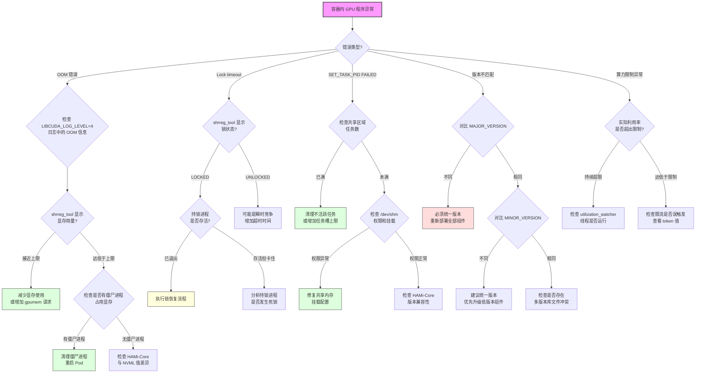
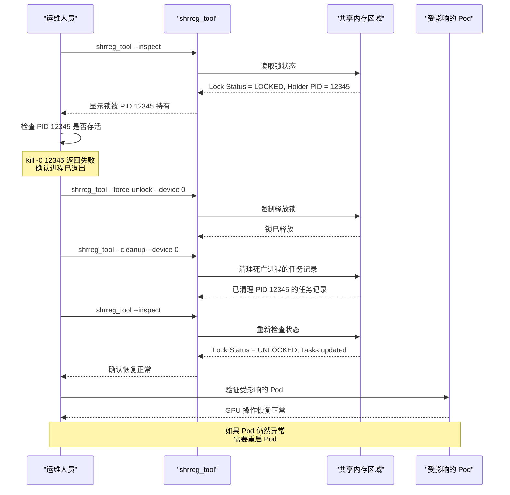

## 目录

- [概述](#概述)
- [日志级别配置](#日志级别配置)
- [共享区域检查工具](#共享区域检查工具)
- [常见问题速查表](#常见问题速查表)
- [显存泄漏排查](#显存泄漏排查)
- [算力限制调试](#算力限制调试)
- [错误诊断决策树](#错误诊断决策树)
- [共享区域锁恢复流程](#共享区域锁恢复流程)

---

## 概述

HAMi-Core 是运行在容器内部的 GPU 虚拟化核心库，通过拦截 CUDA API 调用实现显存隔离和算力限制。由于它以 `LD_PRELOAD` 方式注入到用户进程中，调试时需要关注进程级别的日志输出和共享内存区域的状态。

HAMi-Core 的调试主要围绕三个维度展开：
1. **日志分析** - 通过环境变量控制日志级别
2. **共享区域检查** - 使用 `shrreg_tool` 查看设备分配状态
3. **指标对比** - 对比内部跟踪值与 NVML 实际值

---

## 日志级别配置

HAMi-Core 通过 `LIBCUDA_LOG_LEVEL` 环境变量控制日志输出级别。

### 日志级别说明

| 级别值 | 名称 | 输出内容 | 适用场景 |
|--------|------|----------|----------|
| 0 | Error | 仅错误信息 | 生产环境默认 |
| 1 | Warning | 错误 + 警告信息 | 生产环境排查 |
| 3 | Info | 错误 + 警告 + 运行信息 | 开发测试环境 |
| 4 | Debug | 全量调试信息，含 API 调用跟踪 | 深度调试 |

### 配置方式

**方式一 - Pod YAML 中设置环境变量：**

```yaml
apiVersion: v1
kind: Pod
metadata:
  name: gpu-debug-pod
spec:
  containers:
  - name: gpu-container
    image: nvidia/cuda:11.8-runtime
    env:
    - name: LIBCUDA_LOG_LEVEL
      value: "4"
    resources:
      limits:
        nvidia.com/gpu: 1
        nvidia.com/gpumem: 4096
```

**方式二 - 在运行中的容器内临时设置：**

```bash
# 进入容器
kubectl exec -it <pod-name> -- bash

# 设置环境变量后运行程序
export LIBCUDA_LOG_LEVEL=4
python3 your_training_script.py
```

### 日志输出位置

HAMi-Core 日志默认输出到 `stderr`。在 Kubernetes 环境中，可通过以下方式查看：

```bash
# 查看容器日志（包含 HAMi-Core 输出）
kubectl logs <pod-name> -c <container-name>

# 实时跟踪日志
kubectl logs -f <pod-name> -c <container-name>
```

### 各级别日志示例

**Level 0 (Error) - 仅在出错时输出：**
```
[HAMI-core Error(128)] Device 0 OOM: requested 2048MB but only 512MB available
```

**Level 1 (Warning) - 包含潜在问题警告：**
```
[HAMI-core Warn(128)] Utilization approaching limit: current 95%, limit 100%
[HAMI-core Warn(128)] Lock shrreg timeout after 5000ms, retrying...
```

**Level 3 (Info) - 包含运行状态信息：**
```
[HAMI-core Info(128)] Initializing virtual device 0, memory limit: 4096MB
[HAMI-core Info(128)] cuMemAlloc: size=1073741824, total_used=1073741824/4294967296
```

**Level 4 (Debug) - 包含 API 调用跟踪：**
```
[HAMI-core Debug(128)] cuInit(0) called
[HAMI-core Debug(128)] cuDeviceGet(&device, 0) -> device=0
[HAMI-core Debug(128)] cuMemGetInfo: free=3221225472, total=4294967296
[HAMI-core Debug(128)] cuCtxCreate: flags=0, device=0
```

---

## 共享区域检查工具

`shrreg_tool` 是 HAMi-Core 提供的共享内存区域检查工具，用于查看当前节点上所有 GPU 虚拟设备的分配状态。

### 工具位置

`shrreg_tool` 通常随 HAMi device-plugin DaemonSet 部署，位于 device-plugin 容器内：

```bash
# 找到 device-plugin Pod
PLUGIN_POD=$(kubectl get pods -n kube-system -l app=hami-device-plugin -o jsonpath='{.items[0].metadata.name}' --field-selector spec.nodeName=<node-name>)

# 在容器内执行
kubectl exec -it $PLUGIN_POD -n kube-system -- /usr/local/bin/shrreg_tool
```

### 基本用法

```bash
# 查看所有 GPU 的共享区域状态
shrreg_tool --inspect

# 查看指定 GPU 的详细信息
shrreg_tool --inspect --device 0

# 查看共享区域版本信息
shrreg_tool --version
```

### 输出解读

```
=== Shared Region Info ===
Device 0:
  Total Memory:    16384 MB
  Used Memory:     8192 MB
  Task Count:      3
  Tasks:
    PID: 12345  Memory: 4096 MB  Util Limit: 50%  Status: ACTIVE
    PID: 12346  Memory: 2048 MB  Util Limit: 30%  Status: ACTIVE
    PID: 12347  Memory: 2048 MB  Util Limit: 20%  Status: ACTIVE
  Lock Status:     UNLOCKED
  Version:         MAJOR=1, MINOR=3
```

**关键字段说明：**

| 字段 | 含义 | 异常判断 |
|------|------|----------|
| `Used Memory` | 已分配的虚拟显存总量 | 超过 `Total Memory` 时出现过量分配 |
| `Task Count` | 当前共享该 GPU 的任务数 | 过多可能导致性能问题 |
| `PID` | 使用该 GPU 的进程 ID | 如果进程已退出但仍记录则为泄漏 |
| `Status` | 任务状态 | 非 `ACTIVE` 状态需要排查 |
| `Lock Status` | 共享区域锁状态 | `LOCKED` 且持续不释放说明发生死锁 |
| `Version` | 共享区域协议版本 | 版本不匹配会导致兼容性问题 |

---

## 常见问题速查表

| 错误信息 | 根因分析 | 解决方案 |
|----------|----------|----------|
| `Device N OOM` | 容器请求的显存超过虚拟设备分配的上限，或其他进程占用了共享显存 | 1. 增加 Pod 的 `nvidia.com/gpumem` 请求值<br>2. 检查是否有僵尸进程未释放显存<br>3. 使用 `shrreg_tool` 检查显存占用 |
| `Lock shrreg timeout` | 共享区域锁被其他进程长时间持有，可能因进程崩溃导致锁未释放 | 1. 使用 `shrreg_tool` 检查锁状态<br>2. 找到持锁进程是否已退出<br>3. 如果确认死锁，参见锁恢复流程 |
| `SET_TASK_PID FAILED` | HAMi-Core 无法将当前进程注册到共享区域，可能因任务槽已满或权限不足 | 1. 检查共享区域的任务数是否达上限<br>2. 确认容器的共享内存挂载正确<br>3. 检查 `/dev/shm` 权限 |
| 版本不匹配（Version mismatch） | HAMi-Core 库版本与 device-plugin 创建的共享区域版本不一致 | 1. 确认 HAMi-Core 和 device-plugin 版本一致<br>2. 重新部署 device-plugin 更新共享区域<br>3. 检查 `MAJOR_VERSION` 和 `MINOR_VERSION` |
| `cuInit failed` | CUDA 驱动未正确加载或 GPU 设备不可访问 | 1. 检查 `nvidia-smi` 是否正常<br>2. 确认 NVIDIA 驱动已安装<br>3. 检查容器的设备挂载 |

### 版本兼容性判断

共享区域使用 `MAJOR_VERSION` 和 `MINOR_VERSION` 标识版本：

- **MAJOR_VERSION 不同：** 完全不兼容，必须统一版本后重新部署
- **MINOR_VERSION 不同：** 向下兼容，但建议统一版本

```bash
# 检查 HAMi-Core 库版本
kubectl exec -it <pod-name> -- env | grep HAMI_VERSION

# 检查共享区域版本
kubectl exec -it $PLUGIN_POD -n kube-system -- shrreg_tool --version
```

---

## 显存泄漏排查

当怀疑存在显存泄漏时，需要对比 HAMi-Core 内部跟踪值和 NVML 报告的实际值。

### 排查方法

HAMi-Core 内部通过 `get_gpu_memory_usage()` 函数跟踪每个虚拟设备的显存使用量。同时可以通过 NVML 接口 `nvml_get_device_memory_usage()` 获取物理 GPU 的实际显存使用量。

**第一步 - 获取 HAMi-Core 内部跟踪值：**

```bash
# 在容器内启用 Debug 日志
export LIBCUDA_LOG_LEVEL=4

# 运行程序，关注以下日志
# [HAMI-core Debug] get_gpu_memory_usage: device=0, used=2048MB
```

**第二步 - 获取 NVML 实际值：**

```bash
# 在容器内通过 nvidia-smi 查看
nvidia-smi --query-gpu=memory.used --format=csv,noheader

# 或者在宿主机上查看指定 GPU
nvidia-smi -i 0 --query-gpu=memory.used --format=csv,noheader
```

**第三步 - 对比分析：**

| 场景 | HAMi-Core 跟踪值 | NVML 实际值 | 判断 |
|------|-------------------|-------------|------|
| 正常 | 2048 MB | 2100 MB | 误差在合理范围内（CUDA Context 开销） |
| 内部泄漏 | 2048 MB | 2048 MB | HAMi-Core 跟踪值未减少但用户已释放 |
| 外部泄漏 | 1024 MB | 4096 MB | NVML 显示远超 HAMi-Core 跟踪值，可能有未被拦截的分配 |
| 跟踪不一致 | 4096 MB | 1024 MB | HAMi-Core 跟踪有误，可能存在 Bug |

**第四步 - 检查僵尸进程：**

```bash
# 使用 shrreg_tool 查看注册的任务
shrreg_tool --inspect --device 0

# 检查这些 PID 是否仍然存活
for pid in $(shrreg_tool --inspect --device 0 | grep PID | awk '{print $2}'); do
    if kill -0 $pid 2>/dev/null; then
        echo "PID $pid: ALIVE"
    else
        echo "PID $pid: DEAD (zombie entry)"
    fi
done
```

---

## 算力限制调试

HAMi-Core 通过 `utilization_watcher` 组件实现算力限制（基于时间片的 GPU 利用率控制）。

### 算力限制工作原理

1. `utilization_watcher` 线程周期性采样 GPU 利用率
2. 与配置的 `userutil` 上限值对比
3. 超过阈值时，通过延迟 CUDA Kernel 提交实现限流

### 调试步骤

**第一步 - 确认算力限制配置：**

```bash
# 查看 Pod 的算力限制配置
kubectl get pod <pod-name> -o jsonpath='{.metadata.annotations}' | grep gpucores

# 在容器内查看环境变量
kubectl exec <pod-name> -- env | grep -i "CUDA_DEVICE_SM_LIMIT\|GPU_CORE"
```

**第二步 - 启用 Debug 日志观察限流行为：**

```bash
export LIBCUDA_LOG_LEVEL=4
# 运行程序后关注以下日志
# [HAMI-core Debug] utilization_watcher: current_util=85%, limit=50%, throttling...
# [HAMI-core Debug] utilization_watcher: token_bucket: tokens=0, refill_rate=50
```

**第三步 - 检查 userutil 值：**

```bash
# 通过 shrreg_tool 查看
shrreg_tool --inspect --device 0
# 关注 Util Limit 字段
```

**第四步 - 对比实际利用率：**

```bash
# 宿主机上查看 GPU 实际利用率
nvidia-smi --query-gpu=utilization.gpu --format=csv,noheader -l 1

# 容器内 HAMi-Core 报告的利用率（Debug 日志）
# [HAMI-core Debug] utilization_watcher: sampled_util=48%
```

### 算力限制不生效的排查

| 检查项 | 命令 | 预期结果 |
|--------|------|----------|
| 环境变量是否设置 | `env \| grep GPU_CORE` | 应有算力限制值 |
| HAMi-Core 是否加载 | `cat /proc/<pid>/maps \| grep libvgpu` | 应能看到库文件映射 |
| utilization_watcher 线程是否运行 | `ls /proc/<pid>/task/ \| wc -l` | 应比预期多一个线程 |
| 共享区域 Util Limit | `shrreg_tool --inspect` | 应显示非零的限制值 |

---

## 错误诊断决策树



---

## 共享区域锁恢复流程

当共享区域发生死锁（通常因持锁进程异常退出导致），需要按以下流程进行恢复。



### 锁恢复操作步骤

```bash
# 第一步 - 确认死锁状态
shrreg_tool --inspect --device 0
# 确认 Lock Status = LOCKED

# 第二步 - 检查持锁进程
HOLDER_PID=$(shrreg_tool --inspect --device 0 | grep "Lock Holder" | awk '{print $NF}')
if kill -0 $HOLDER_PID 2>/dev/null; then
    echo "进程 $HOLDER_PID 仍在运行，不要强制解锁"
    echo "请先分析该进程为何长时间持锁"
else
    echo "进程 $HOLDER_PID 已退出，可以安全解锁"
fi

# 第三步 - 强制解锁（仅在确认进程已退出时执行）
shrreg_tool --force-unlock --device 0

# 第四步 - 清理僵尸任务记录
shrreg_tool --cleanup --device 0

# 第五步 - 验证恢复
shrreg_tool --inspect --device 0
```

> **警告：** 强制解锁操作存在风险。如果持锁进程仍在运行，强制解锁可能导致数据竞争和不可预期的行为。务必在执行前确认持锁进程已退出。

---

## 附录 - 环境变量速查

| 环境变量 | 默认值 | 说明 |
|----------|--------|------|
| `LIBCUDA_LOG_LEVEL` | 0 | 日志级别 (0-4) |
| `CUDA_DEVICE_MEMORY_LIMIT` | 无 | 虚拟设备显存上限 |
| `CUDA_DEVICE_SM_LIMIT` | 无 | SM 算力百分比上限 |
| `GPU_CORE_UTILIZATION_POLICY` | 无 | 算力限制策略 |
| `CUDA_DEVICE_MEMORY_SHARED_CACHE` | 无 | 共享缓存路径 |
