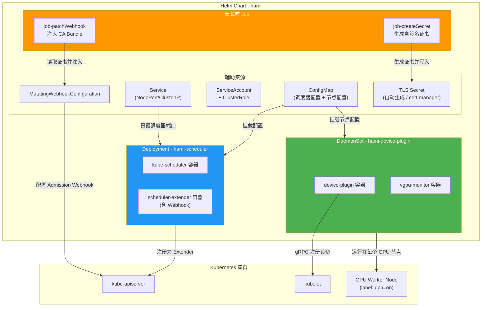
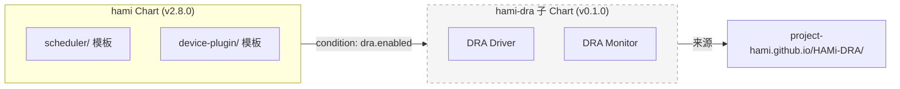
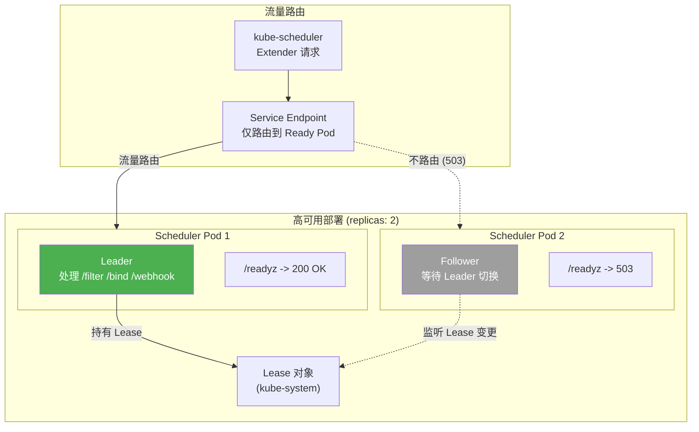
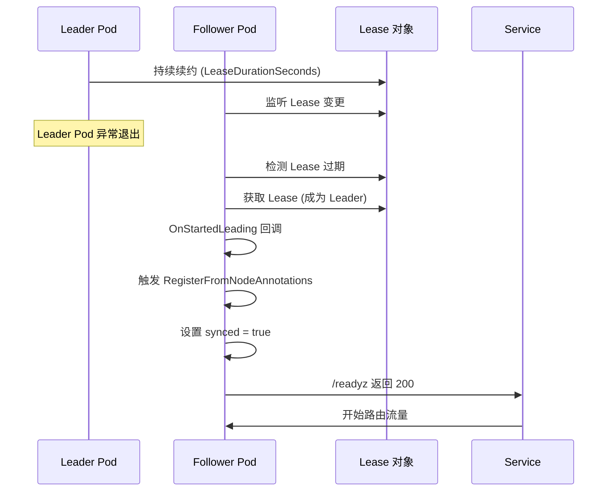
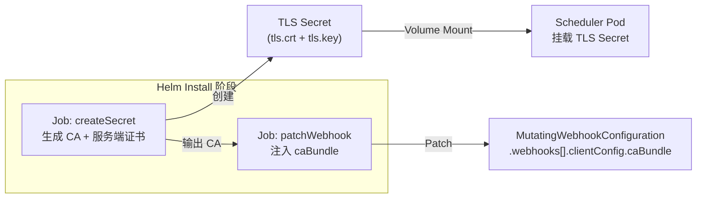
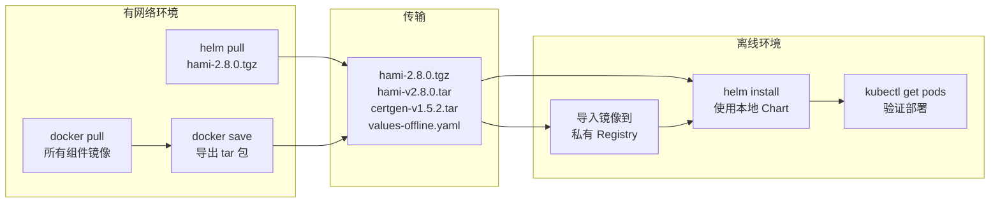

> 本文档详细介绍如何通过 Helm Chart 部署 HAMi，包括 Chart 结构解析、关键参数说明、高可用配置、TLS 证书管理以及离线安装方案。

---

## 目录

- [1. 部署架构概览](#1-部署架构概览)
- [2. Helm Chart 结构解析](#2-helm-chart-结构解析)
- [3. Values 参数速查表](#3-values-参数速查表)
- [4. 高可用部署 - Leader Election](#4-高可用部署---leader-election)
- [5. TLS 证书配置](#5-tls-证书配置)
- [6. 离线安装](#6-离线安装)
- [7. 部署验证](#7-部署验证)

---

## 1. 部署架构概览

HAMi 在 Kubernetes 集群中以两种工作负载形态部署：**Deployment**（集群级调度组件）和 **DaemonSet**（节点级设备管理组件）。以下架构图展示了完整的部署拓扑。



### 1.1 组件部署形态总结

| 组件 | 工作负载类型 | 副本数 | 运行位置 | 核心功能 |
|:-----|:-----------|:------|:---------|:---------|
| hami-scheduler | Deployment | 1 (可扩展为多副本 HA) | 控制平面节点 | 调度扩展 + Webhook |
| kube-scheduler | Deployment (同 Pod) | 与 scheduler 相同 | 控制平面节点 | 原生调度器 Sidecar |
| device-plugin | DaemonSet | 每 GPU 节点 1 个 | GPU Worker 节点 | 设备发现与注册 |
| vgpu-monitor | DaemonSet (同 Pod) | 与 device-plugin 相同 | GPU Worker 节点 | 监控采集 |

---

## 2. Helm Chart 结构解析

HAMi 的 Helm Chart 位于 `HAMi/charts/hami/`，采用标准 Helm v3 Chart 结构。

### 2.1 目录结构

```
charts/hami/
  Chart.yaml                         # Chart 元数据 (v2.8.0)
  values.yaml                        # 默认配置参数
  templates/
    scheduler/
      deployment.yaml                # Scheduler Deployment
      configmap.yaml                 # KubeSchedulerConfiguration (旧版)
      configmapnew.yaml              # KubeSchedulerConfiguration (新版)
      device-configmap.yaml          # 设备配置 ConfigMap
      service.yaml                   # Scheduler Service (NodePort)
      webhook.yaml                   # MutatingWebhookConfiguration
      clusterrole.yaml               # RBAC ClusterRole
      clusterrolebinding.yaml        # RBAC ClusterRoleBinding
      role.yaml                      # RBAC Role (Lease 操作)
      rolebinding.yaml               # RBAC RoleBinding
      serviceaccount.yaml            # ServiceAccount
      certmanager.yaml               # cert-manager Certificate (可选)
      servicemonitor.yaml            # Prometheus ServiceMonitor (可选)
      job-patch/
        job-createSecret.yaml        # 生成自签名 TLS 证书
        job-patchWebhook.yaml        # 注入 CA Bundle 到 Webhook
        serviceaccount.yaml          # Job 专用 ServiceAccount
        clusterrole.yaml             # Job 专用 ClusterRole
        clusterrolebinding.yaml      # Job 专用 ClusterRoleBinding
        role.yaml                    # Job 专用 Role
        rolebinding.yaml             # Job 专用 RoleBinding
        psp.yaml                     # PodSecurityPolicy (可选)
    device-plugin/
      daemonsetnvidia.yaml           # NVIDIA Device Plugin DaemonSet
      daemonsetmock.yaml             # Mock Device Plugin (测试用)
      configmap.yaml                 # 节点级 Device Plugin 配置
      monitorrole.yaml               # Monitor RBAC Role
      monitorrolebinding.yaml        # Monitor RBAC RoleBinding
      monitorservice.yaml            # Monitor Service
      monitorserviceaccount.yaml     # Monitor ServiceAccount
      servicemonitor.yaml            # Monitor Prometheus ServiceMonitor
      runtime-class.yaml             # RuntimeClass (可选)
```

### 2.2 Chart 依赖关系



> **注意**：`hami-dra` 子 Chart 默认禁用 (`dra.enabled: false`)，仅在需要 Kubernetes DRA (Dynamic Resource Allocation) 特性时启用。

---

## 3. Values 参数速查表

### 3.1 全局配置

| 参数 | 类型 | 默认值 | 说明 |
|:-----|:-----|:------|:-----|
| `global.imageRegistry` | string | `""` | 全局镜像仓库地址，设置后覆盖所有组件 |
| `global.imagePullSecrets` | list | `[]` | 全局镜像拉取密钥 |
| `global.imageTag` | string | `v2.8.0` | 全局默认镜像标签 |
| `global.gpuHookPath` | string | `/usr/local` | libvgpu.so 挂载基础路径 |
| `global.managedNodeSelectorEnable` | bool | `false` | 是否限制调度器仅管理特定标签节点 |
| `schedulerName` | string | `hami-scheduler` | 调度器名称 |

### 3.2 Scheduler 配置

| 参数 | 类型 | 默认值 | 说明 |
|:-----|:-----|:------|:-----|
| `scheduler.leaderElect` | bool | `true` | 是否启用 Leader 选举 |
| `scheduler.replicas` | int | `1` | Scheduler 副本数 (需配合 leaderElect) |
| `scheduler.nodeLockExpire` | string | `5m` | 节点锁超时时间 |
| `scheduler.overwriteEnv` | string | `false` | 非 GPU Pod 是否设置 NVIDIA_VISIBLE_DEVICES=none |
| `scheduler.forceOverwriteDefaultScheduler` | bool | `true` | 是否强制覆盖默认调度器名称 |
| `scheduler.metricsBindAddress` | string | `:9395` | Prometheus 指标端口 |
| `scheduler.defaultSchedulerPolicy.nodeSchedulerPolicy` | string | `binpack` | 节点级调度策略 |
| `scheduler.defaultSchedulerPolicy.gpuSchedulerPolicy` | string | `spread` | GPU 级调度策略 |

### 3.3 Webhook 配置

| 参数 | 类型 | 默认值 | 说明 |
|:-----|:-----|:------|:-----|
| `scheduler.admissionWebhook.enabled` | bool | `true` | 是否启用 Webhook |
| `scheduler.admissionWebhook.failurePolicy` | string | `Ignore` | Webhook 失败策略 |
| `scheduler.admissionWebhook.reinvocationPolicy` | string | `Never` | 是否重新调用 |
| `scheduler.certManager.enabled` | bool | `false` | 使用 cert-manager 管理证书 |
| `scheduler.patch.enabled` | bool | `true` | 使用 Job 自动生成自签名证书 |

### 3.4 Device Plugin 配置

| 参数 | 类型 | 默认值 | 说明 |
|:-----|:-----|:------|:-----|
| `devicePlugin.enabled` | bool | `true` | 是否部署 Device Plugin |
| `devicePlugin.deviceSplitCount` | int | `10` | 每块物理 GPU 的虚拟切分数 |
| `devicePlugin.deviceMemoryScaling` | float | `1` | 显存超配比例 |
| `devicePlugin.deviceCoreScaling` | float | `1` | 算力超配比例 |
| `devicePlugin.preConfiguredDeviceMemory` | int | `0` | 预配置显存 (MB)，用于不支持显存查询的 GPU |
| `devicePlugin.migStrategy` | string | `none` | MIG 策略 (none/single/mixed) |
| `devicePlugin.disablecorelimit` | string | `false` | 是否禁用算力限制 |
| `devicePlugin.nvidiaNodeSelector` | map | `gpu: "on"` | GPU 节点选择器标签 |
| `devicePlugin.pluginPath` | string | `/var/lib/kubelet/device-plugins` | 设备插件 socket 路径 |
| `devicePlugin.libPath` | string | `/usr/local/vgpu` | vGPU 库路径 |

### 3.5 资源名称定义

| 参数 | 类型 | 默认值 | 说明 |
|:-----|:-----|:------|:-----|
| `resourceName` | string | `nvidia.com/gpu` | GPU 数量资源名 |
| `resourceMem` | string | `nvidia.com/gpumem` | GPU 显存资源名 (MB) |
| `resourceMemPercentage` | string | `nvidia.com/gpumem-percentage` | GPU 显存百分比资源名 |
| `resourceCores` | string | `nvidia.com/gpucores` | GPU 算力百分比资源名 |
| `resourcePriority` | string | `nvidia.com/priority` | 任务优先级资源名 |

### 3.6 非 NVIDIA 设备资源名称

| 设备类型 | 资源名称参数 | 默认值 |
|:---------|:-----------|:------|
| 寒武纪 MLU | `mluResourceName` | `cambricon.com/vmlu` |
| 寒武纪 MLU 显存 | `mluResourceMem` | `cambricon.com/mlu.smlu.vmemory` |
| 寒武纪 MLU 算力 | `mluResourceCores` | `cambricon.com/mlu.smlu.vcore` |
| 海光 DCU | `dcuResourceName` | `hygon.com/dcunum` |
| 海光 DCU 显存 | `dcuResourceMem` | `hygon.com/dcumem` |
| MetaX sGPU | `metaxResourceName` | `metax-tech.com/sgpu` |
| 燧原 VGCU | `enflameResourceNameVGCU` | `enflame.com/vgcu` |
| 昆仑芯 XPU | `kunlunResourceName` | `kunlunxin.com/xpu` |

### 3.7 Service 配置

| 参数 | 类型 | 默认值 | 说明 |
|:-----|:-----|:------|:-----|
| `scheduler.service.type` | string | `NodePort` | Service 类型 |
| `scheduler.service.httpPort` | int | `443` | HTTPS 端口 |
| `scheduler.service.schedulerPort` | int | `31998` | NodePort 端口 |
| `scheduler.service.monitorPort` | int | `31993` | 监控端口 |

---

## 4. 高可用部署 - Leader Election

### 4.1 工作原理

HAMi Scheduler 通过 Kubernetes **Lease 对象**实现 Leader Election。多副本部署时，只有获得 Lease 的实例（Leader）处理调度请求，其余副本作为热备待命。



### 4.2 配置方式

```yaml
# values.yaml
scheduler:
  leaderElect: true
  replicas: 2      # 推荐 2 副本
```

### 4.3 Leader 切换流程



### 4.4 注意事项

- Leader 切换期间（通常 10-30 秒），新的 GPU Pod 调度请求会暂时阻塞
- Lease 续约间隔由 kube-scheduler 的 `--leader-elect-renew-deadline` 控制
- 建议在生产环境中始终启用 Leader Election，即使只部署 1 个副本

---

## 5. TLS 证书配置

Kubernetes Admission Webhook 要求使用 HTTPS 通信。HAMi 提供两种证书管理方案。

### 5.1 方案一 - 自动生成自签名证书（默认）

通过 Helm 安装时的 Job 自动生成自签名证书，无需额外依赖。

```yaml
# values.yaml (默认配置)
scheduler:
  certManager:
    enabled: false       # 不使用 cert-manager
  patch:
    enabled: true        # 使用 Job 自动生成
    image:
      repository: "jettech/kube-webhook-certgen"
      tag: "v1.5.2"
```

**工作流程：**



### 5.2 方案二 - cert-manager 管理证书

如果集群已部署 cert-manager，推荐使用此方案实现证书自动轮转。

```yaml
# values.yaml
scheduler:
  certManager:
    enabled: true        # 使用 cert-manager
  patch:
    enabled: false       # 禁用 Job 方式
```

启用后，Chart 会创建以下 cert-manager 资源：

- `Issuer` - 自签名 CA 颁发者
- `Certificate` - 服务端证书，引用 Issuer

### 5.3 方案三 - 自定义 Webhook URL

如果需要使用外部反向代理或 NodePort 直接访问，可配置自定义 URL。

```yaml
scheduler:
  admissionWebhook:
    customURL:
      enabled: true
      host: 10.0.0.100    # 节点 IP
      port: 31998          # NodePort
      path: /webhook
```

---

## 6. 离线安装

### 6.1 准备工作

在有网络的环境中提前准备以下资源。

#### 6.1.1 下载 Helm Chart

```bash
# 添加 HAMi Chart 仓库
helm repo add hami https://project-hami.github.io/HAMi/

# 下载 Chart 包
helm pull hami/hami --version 2.8.0
# 产出: hami-2.8.0.tgz
```

#### 6.1.2 准备镜像列表

```bash
# 核心组件镜像
docker.io/projecthami/hami:v2.8.0

# kube-scheduler sidecar (需匹配集群版本)
registry.cn-hangzhou.aliyuncs.com/google_containers/kube-scheduler:v1.28.0

# 证书生成 Job 镜像
docker.io/jettech/kube-webhook-certgen:v1.5.2
docker.io/liangjw/kube-webhook-certgen:v1.1.1
```

#### 6.1.3 导出镜像

```bash
# 拉取并保存镜像为 tar 包
docker pull projecthami/hami:v2.8.0
docker save projecthami/hami:v2.8.0 -o hami-v2.8.0.tar

docker pull jettech/kube-webhook-certgen:v1.5.2
docker save jettech/kube-webhook-certgen:v1.5.2 -o certgen-v1.5.2.tar
```

### 6.2 离线环境部署

#### 6.2.1 导入镜像到私有仓库

```bash
# 方案 A: 导入到私有 Registry
docker load -i hami-v2.8.0.tar
docker tag projecthami/hami:v2.8.0 registry.internal.com/hami/hami:v2.8.0
docker push registry.internal.com/hami/hami:v2.8.0

# 方案 B: 直接导入到集群节点
# 在每个节点上执行
ctr -n k8s.io images import hami-v2.8.0.tar
```

#### 6.2.2 配置 values-offline.yaml

```yaml
# values-offline.yaml
global:
  imageRegistry: "registry.internal.com"
  imagePullSecrets:
    - name: internal-registry-secret

scheduler:
  kubeScheduler:
    image:
      registry: "registry.internal.com"
      repository: "google_containers/kube-scheduler"
  extender:
    image:
      registry: "registry.internal.com"
      repository: "hami/hami"
  patch:
    image:
      registry: "registry.internal.com"
      repository: "hami/kube-webhook-certgen"
    imageNew:
      registry: "registry.internal.com"
      repository: "hami/kube-webhook-certgen"

devicePlugin:
  image:
    registry: "registry.internal.com"
    repository: "hami/hami"
  monitor:
    image:
      registry: "registry.internal.com"
      repository: "hami/hami"
```

#### 6.2.3 执行安装

```bash
# 使用本地 Chart 包 + 离线 values
helm install hami ./hami-2.8.0.tgz \
  -f values-offline.yaml \
  -n kube-system \
  --create-namespace
```

### 6.3 离线安装流程图



---

## 7. 部署验证

### 7.1 检查 Pod 状态

```bash
# 查看所有 HAMi 组件 Pod
kubectl get pods -n kube-system -l app.kubernetes.io/name=hami

# 预期输出
# NAME                              READY   STATUS    RESTARTS   AGE
# hami-scheduler-xxx                2/2     Running   0          5m
# hami-device-plugin-xxx            2/2     Running   0          5m  (每个 GPU 节点一个)
```

### 7.2 验证 Webhook 注册

```bash
# 检查 MutatingWebhookConfiguration
kubectl get mutatingwebhookconfigurations | grep hami

# 检查 Webhook 详情
kubectl get mutatingwebhookconfigurations hami-webhook -o yaml
```

### 7.3 验证设备注册

```bash
# 检查 GPU 节点的扩展资源
kubectl describe node <gpu-node-name> | grep -A 10 "Allocatable"

# 预期看到 nvidia.com/gpu 等资源
# nvidia.com/gpu:     10   (deviceSplitCount * 物理 GPU 数)
# nvidia.com/gpumem:  81920
# nvidia.com/gpucores: 100
```

### 7.4 提交测试 Pod

```bash
cat <<EOF | kubectl apply -f -
apiVersion: v1
kind: Pod
metadata:
  name: hami-test
spec:
  containers:
  - name: cuda-test
    image: nvidia/cuda:12.0-base
    command: ["sleep", "30"]
    resources:
      limits:
        nvidia.com/gpu: 1
        nvidia.com/gpumem: 1024
        nvidia.com/gpucores: 10
EOF

# 检查 Pod 调度结果
kubectl get pod hami-test -o wide
kubectl describe pod hami-test | grep -A 5 "Annotations"
```

---

> **文档版本：** v1.0
>
> **适用 HAMi 版本：** v2.8.0
>
> **最后更新：** 2025-05
