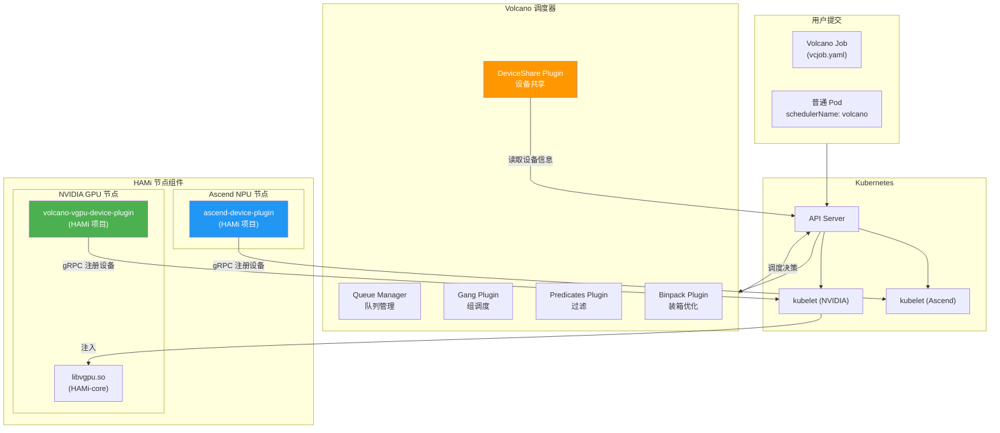
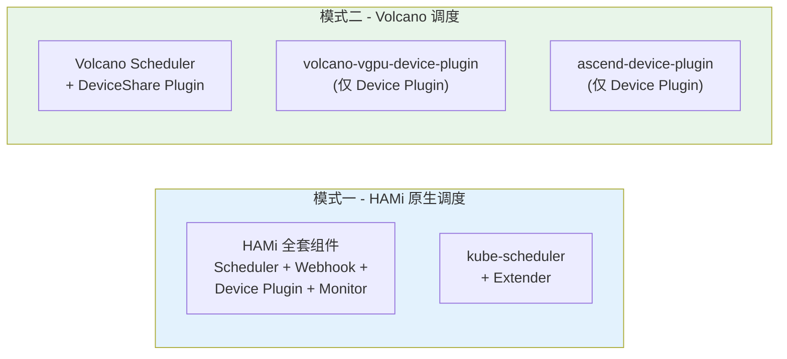
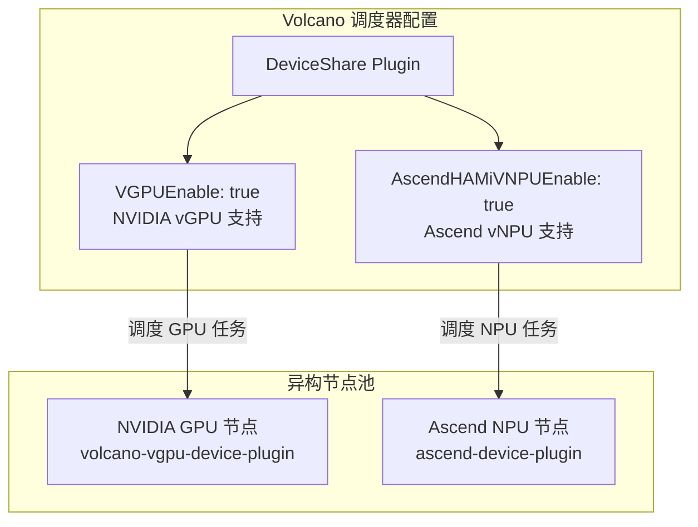
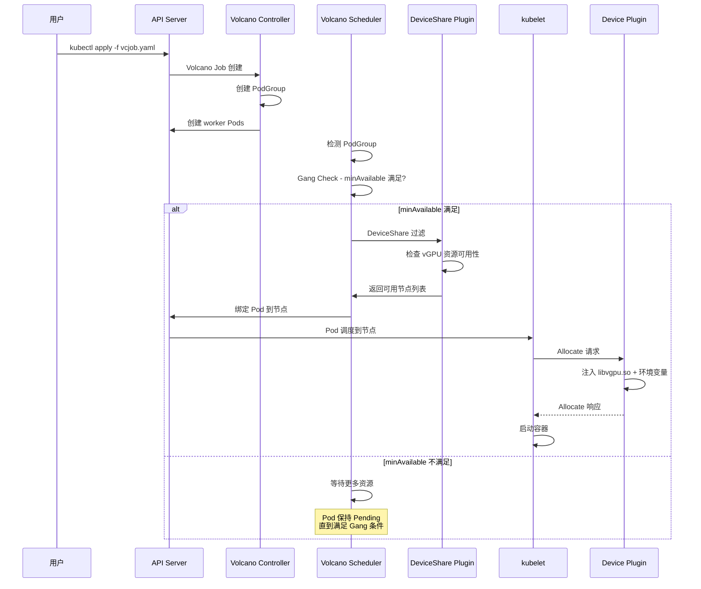

> 本文档详细介绍 HAMi 与 Volcano 批处理调度器的集成方案，包括 NVIDIA GPU + Volcano 配置、华为 Ascend + Volcano 配置，以及典型的任务提交示例。

---

## 目录

- [1. 集成概览](#1-集成概览)
- [2. NVIDIA GPU + Volcano 配置](#2-nvidia-gpu--volcano-配置)
- [3. 华为 Ascend + Volcano 配置](#3-华为-ascend--volcano-配置)
- [4. 任务提交示例](#4-任务提交示例)
- [5. 常见问题](#5-常见问题)

---

## 1. 集成概览

### 1.1 为什么需要 HAMi + Volcano

HAMi 和 Volcano 是两个互补的 CNCF 项目，各自解决 Kubernetes GPU 管理的不同层面问题。

| 项目 | 核心能力 | 解决的问题 |
|:-----|:---------|:----------|
| **HAMi** | GPU 虚拟化与隔离 | 一块 GPU 被多个 Pod 共享、显存/算力隔离 |
| **Volcano** | 批处理调度 | Gang Scheduling、公平调度、队列管理 |

两者结合后，可以实现"细粒度 GPU 共享 + 批处理调度"的完整能力。

### 1.2 集成架构



### 1.3 集成方式说明

> **重要区别**：在 Volcano 模式下，**不需要安装完整的 HAMi**（Scheduler Extender + Webhook）。Volcano 有自己的调度器和 DeviceShare 插件。只需要安装对应的 **Device Plugin** 组件。

| 场景 | 需要安装的组件 | 说明 |
|:-----|:-------------|:-----|
| NVIDIA GPU + Volcano | `volcano-vgpu-device-plugin` | HAMi 子项目，专为 Volcano 设计 |
| Ascend NPU + Volcano | `ascend-device-plugin` | HAMi 子项目，支持 vNPU |
| NVIDIA GPU + HAMi 原生 | 完整 HAMi (helm install hami) | 使用 HAMi Scheduler Extender |



---

## 2. NVIDIA GPU + Volcano 配置

### 2.1 前置要求

| 组件 | 版本要求 | 说明 |
|:-----|:---------|:-----|
| Kubernetes | >= 1.18 | |
| Volcano | >= 1.9 | DeviceShare 插件从 1.9 版本开始支持 vGPU |
| NVIDIA 驱动 | >= 440 | 已安装在所有 GPU 节点 |
| nvidia-container-toolkit | 最新版 | 容器运行时支持 |

### 2.2 安装 Volcano

```bash
# 添加 Helm 仓库
helm repo add volcano-sh https://volcano-sh.github.io/helm-charts

# 安装 Volcano
helm install volcano volcano-sh/volcano \
  -n volcano-system \
  --create-namespace
```

### 2.3 配置 Volcano 调度器

更新 Volcano 调度器配置，启用 DeviceShare 插件的 vGPU 支持。

```bash
kubectl edit cm -n volcano-system volcano-scheduler-configmap
```

```yaml
kind: ConfigMap
apiVersion: v1
metadata:
  name: volcano-scheduler-configmap
  namespace: volcano-system
data:
  volcano-scheduler.conf: |
    actions: "enqueue, allocate, backfill"
    tiers:
    - plugins:
      - name: priority
      - name: gang
      - name: conformance
    - plugins:
      - name: drf
      - name: deviceshare
        arguments:
          deviceshare.VGPUEnable: true    # 启用 vGPU 支持
      - name: predicates
      - name: proportion
      - name: nodeorder
      - name: binpack
```

### 2.4 部署 volcano-vgpu-device-plugin

```bash
kubectl create -f https://raw.githubusercontent.com/Project-HAMi/volcano-vgpu-device-plugin/main/volcano-vgpu-device-plugin.yml
```

### 2.5 验证设备注册

```bash
kubectl get node <gpu-node> -o yaml | grep -A 5 "allocatable"
```

预期输出应包含以下资源：

```yaml
allocatable:
  volcano.sh/gpu-number: "10"    # vGPU 数量
  volcano.sh/gpu-memory: "81920" # GPU 显存 (MB)
```

### 2.6 Volcano vGPU 资源名称

| 资源名称 | 单位 | 说明 |
|:---------|:-----|:-----|
| `volcano.sh/vgpu-number` | 个 | 请求的 vGPU 数量 |
| `volcano.sh/vgpu-memory` | MB | 每个 vGPU 的显存限制 |
| `volcano.sh/vgpu-cores` | % (0-100) | 每个 vGPU 的算力限制 |

---

## 3. 华为 Ascend + Volcano 配置

### 3.1 前置要求

| 组件 | 版本要求 | 说明 |
|:-----|:---------|:-----|
| Kubernetes | >= 1.18 | |
| Volcano | >= 1.14 | Ascend vNPU 从 1.14 版本开始支持 |
| ascend-docker-runtime | 最新版 | 华为 Ascend 容器运行时 |
| NPU 驱动 | 与硬件匹配 | 已安装在所有 Ascend 节点 |

### 3.2 安装步骤

#### 步骤一 - 标记 Ascend 节点

```bash
kubectl label node <ascend-node> ascend=on
```

#### 步骤二 - 部署设备配置 ConfigMap

```bash
kubectl apply -f https://raw.githubusercontent.com/Project-HAMi/ascend-device-plugin/refs/heads/main/ascend-device-configmap.yaml
```

#### 步骤三 - 部署 ascend-device-plugin

```bash
kubectl apply -f https://raw.githubusercontent.com/Project-HAMi/ascend-device-plugin/refs/heads/main/ascend-device-plugin.yaml
```

#### 步骤四 - 配置 Volcano 调度器

```bash
kubectl edit cm -n volcano-system volcano-scheduler-configmap
```

```yaml
kind: ConfigMap
apiVersion: v1
metadata:
  name: volcano-scheduler-configmap
  namespace: volcano-system
data:
  volcano-scheduler.conf: |
    actions: "enqueue, allocate, backfill"
    tiers:
    - plugins:
      - name: predicates
      - name: deviceshare
        arguments:
          deviceshare.AscendHAMiVNPUEnable: true       # 启用 Ascend vNPU
          deviceshare.SchedulePolicy: binpack            # 调度策略
          deviceshare.KnownGeometriesCMNamespace: kube-system
          deviceshare.KnownGeometriesCMName: hami-scheduler-device
```

### 3.3 Ascend 资源名称对照表

| 芯片型号 | 资源名称 (数量) | 资源名称 (显存) |
|:---------|:---------------|:---------------|
| Ascend 910A | `huawei.com/Ascend910A` | `huawei.com/Ascend910A-memory` |
| Ascend 910B2 | `huawei.com/Ascend910B2` | `huawei.com/Ascend910B2-memory` |
| Ascend 910B3 | `huawei.com/Ascend910B3` | `huawei.com/Ascend910B3-memory` |
| Ascend 910B4 | `huawei.com/Ascend910B4` | `huawei.com/Ascend910B4-memory` |
| Ascend 910B4-1 | `huawei.com/Ascend910B4-1` | `huawei.com/Ascend910B4-1-memory` |
| Ascend 310P3 | `huawei.com/Ascend310P` | `huawei.com/Ascend310P-memory` |

### 3.4 混合设备集群配置

当集群中同时包含 NVIDIA GPU 和 Ascend NPU 时，需要在 Volcano 调度器中同时启用两种设备支持。



> **注意**：如果同时使用 vGPU 和 vNPU，两个 Device Plugin 各有自己的 GeometriesCMName，需要合并两个 ConfigMap 的内容到同一个 ConfigMap 中。

---

## 4. 任务提交示例

### 4.1 NVIDIA GPU - 单 Pod 任务

```yaml
apiVersion: v1
kind: Pod
metadata:
  name: gpu-inference
spec:
  schedulerName: volcano      # 指定 Volcano 调度器
  containers:
    - name: cuda-container
      image: nvidia/cuda:12.0-base
      command: ["sleep", "100000"]
      resources:
        limits:
          volcano.sh/vgpu-number: 1      # 请求 1 个 vGPU
          volcano.sh/vgpu-memory: 4096   # 限制 4GB 显存
          volcano.sh/vgpu-cores: 30      # 限制 30% 算力
```

### 4.2 NVIDIA GPU - Volcano Job (Gang Scheduling)

```yaml
apiVersion: batch.volcano.sh/v1alpha1
kind: Job
metadata:
  name: distributed-training
spec:
  minAvailable: 2    # Gang Scheduling - 至少 2 个 Pod 同时启动
  schedulerName: volcano
  queue: default
  tasks:
    - replicas: 2
      name: worker
      template:
        spec:
          containers:
            - name: pytorch-worker
              image: pytorch/pytorch:2.0-cuda12.0
              command:
                - python
                - -m
                - torch.distributed.run
                - --nproc_per_node=1
                - train.py
              resources:
                limits:
                  volcano.sh/vgpu-number: 2      # 每个 worker 2 个 vGPU
                  volcano.sh/vgpu-memory: 8192   # 每个 vGPU 8GB 显存
                  volcano.sh/vgpu-cores: 50      # 每个 vGPU 50% 算力
          restartPolicy: OnFailure
```

### 4.3 Ascend NPU - 单 Pod 任务

```yaml
apiVersion: v1
kind: Pod
metadata:
  name: ascend-inference
spec:
  schedulerName: volcano
  containers:
    - name: ascend-container
      image: swr.cn-south-1.myhuaweicloud.com/ascendhub/ascend-pytorch:24.0.RC1-A2-1.11.0-ubuntu20.04
      command: ["sleep", "100000"]
      resources:
        limits:
          huawei.com/Ascend310P: "1"           # 请求 1 个 Ascend 310P
          huawei.com/Ascend310P-memory: "4096" # 限制 4GB 显存
```

### 4.4 Ascend NPU - Volcano Job

```yaml
apiVersion: batch.volcano.sh/v1alpha1
kind: Job
metadata:
  name: ascend-training
spec:
  minAvailable: 4
  schedulerName: volcano
  queue: default
  tasks:
    - replicas: 4
      name: worker
      template:
        spec:
          containers:
            - name: mindspore-worker
              image: ascendhub/ascend-mindspore:latest
              command: ["python", "train.py"]
              resources:
                limits:
                  huawei.com/Ascend910B3: "1"
                  huawei.com/Ascend910B3-memory: "32768"
          restartPolicy: OnFailure
```

### 4.5 任务提交流程



---

## 5. 常见问题

### 5.1 HAMi 原生模式与 Volcano 模式可以共存吗？

不建议在同一集群中同时使用 HAMi Scheduler Extender 和 Volcano DeviceShare。两者会争夺 GPU 设备的注册和分配权。

| 模式 | 使用场景 | 安装组件 |
|:-----|:---------|:---------|
| HAMi 原生 | 通用 GPU 共享，不需要批处理调度 | 完整 HAMi Helm Chart |
| Volcano 集成 | 需要 Gang Scheduling、队列管理等批处理能力 | Volcano + 对应 Device Plugin |

### 5.2 Volcano 模式下 libvgpu.so 如何工作？

`volcano-vgpu-device-plugin` 内置了 HAMi-core (libvgpu.so) 的分发机制。当 Pod 通过 Volcano 调度到 GPU 节点后，Device Plugin 的 Allocate 阶段会自动注入 libvgpu.so 和相关环境变量，实现与 HAMi 原生模式相同的显存/算力隔离。

### 5.3 如何监控 Volcano 模式下的 GPU 使用情况？

`volcano-vgpu-device-plugin` 项目包含独立的监控组件。详细信息请参考 [volcano-vgpu-device-plugin 监控文档](https://github.com/Project-HAMi/volcano-vgpu-device-plugin#monitor)。

### 5.4 版本兼容性

| Volcano 版本 | 支持的功能 |
|:------------|:----------|
| >= 1.9 | NVIDIA vGPU (DeviceShare) |
| >= 1.14 | Ascend vNPU (DeviceShare) |
| < 1.9 | 不支持 HAMi 集成 |

---

> **文档版本：** v1.0
>
> **适用 HAMi 版本：** v2.x
>
> **最后更新：** 2025-05
