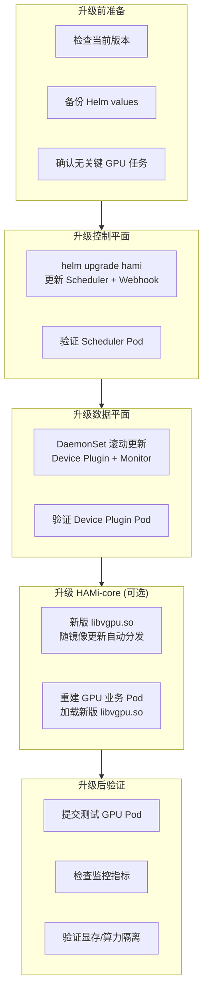
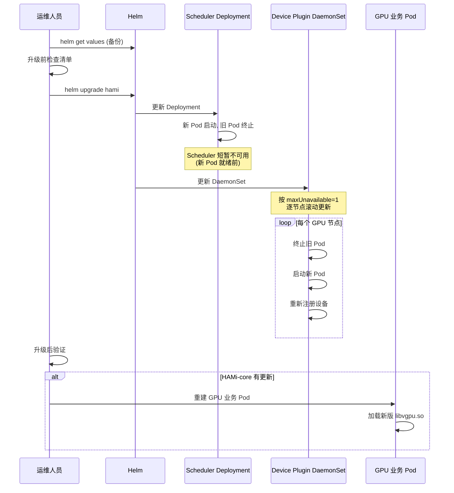
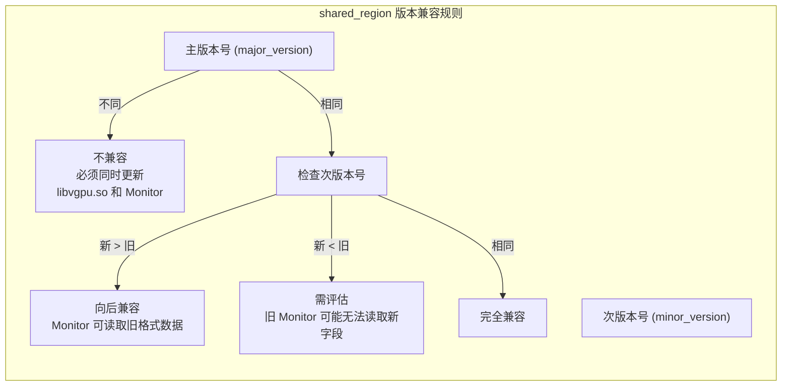
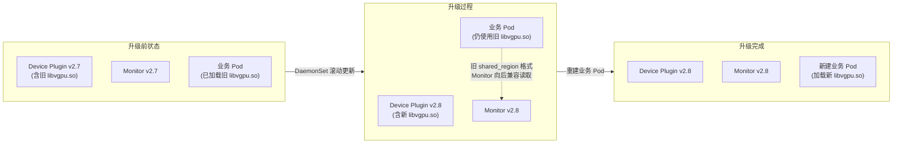
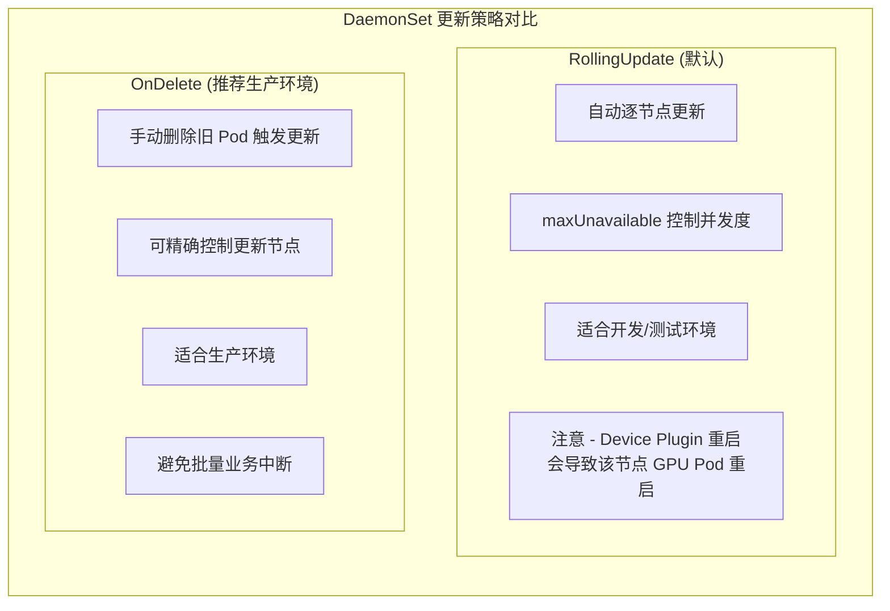
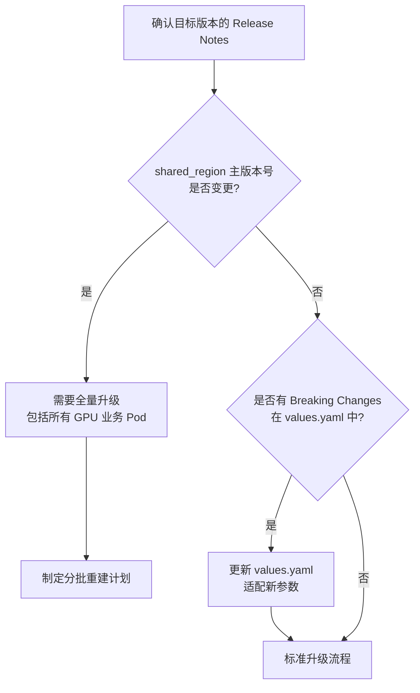
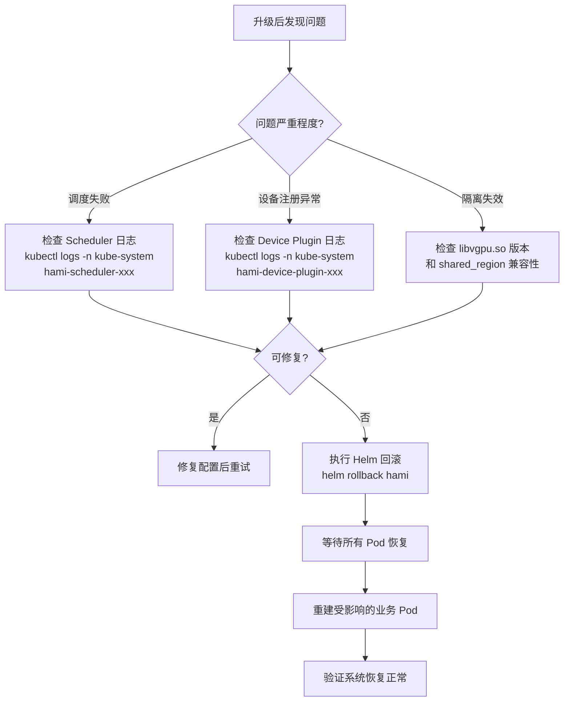

> 本文档详细介绍 HAMi 的版本升级流程、shared_region 版本兼容性、滚动更新策略、以及升级前后的检查清单，确保升级过程安全可控。

---

## 目录

- [1. 版本升级流程](#1-版本升级流程)
- [2. shared_region 版本兼容性](#2-shared_region-版本兼容性)
- [3. 滚动更新策略](#3-滚动更新策略)
- [4. 升级前检查清单](#4-升级前检查清单)
- [5. 升级后验证](#5-升级后验证)
- [6. 回滚方案](#6-回滚方案)

---

## 1. 版本升级流程

### 1.1 升级概览

HAMi 的升级涉及两个独立的仓库组件，需要按照正确的顺序执行。



### 1.2 标准升级步骤

#### 步骤一 - 获取当前版本信息

```bash
# 查看当前部署的 HAMi 版本
helm list -n kube-system | grep hami

# 查看当前镜像版本
kubectl get deployment -n kube-system -l app=hami-scheduler \
  -o jsonpath='{.items[*].spec.template.spec.containers[*].image}'

kubectl get daemonset -n kube-system -l app=hami-device-plugin \
  -o jsonpath='{.items[*].spec.template.spec.containers[*].image}'
```

#### 步骤二 - 备份当前配置

```bash
# 导出当前 Helm values
helm get values hami -n kube-system > values-backup-$(date +%Y%m%d).yaml

# 备份关键资源
kubectl get mutatingwebhookconfigurations hami-webhook -o yaml > webhook-backup.yaml
```

#### 步骤三 - 执行 Helm 升级

```bash
# 更新 Chart 仓库
helm repo update

# 执行升级 (使用现有 values)
helm upgrade hami hami/hami \
  -n kube-system \
  -f values-backup-$(date +%Y%m%d).yaml \
  --version <target-version>

# 如果需要修改参数
helm upgrade hami hami/hami \
  -n kube-system \
  -f values-backup-$(date +%Y%m%d).yaml \
  -f values-override.yaml \
  --version <target-version>
```

#### 步骤四 - 等待升级完成

```bash
# 监控 Scheduler Deployment 升级进度
kubectl rollout status deployment/hami-scheduler -n kube-system --timeout=300s

# 监控 DaemonSet 升级进度
kubectl rollout status daemonset/hami-device-plugin -n kube-system --timeout=600s
```

#### 步骤五 - 重建业务 Pod（如需更新 HAMi-core）

```bash
# 当 HAMi-core (libvgpu.so) 有重大更新时，
# 需要重建 GPU 业务 Pod 以加载新版拦截库
kubectl delete pod -l gpu=required --grace-period=60
```

### 1.3 升级顺序图



---

## 2. shared_region 版本兼容性

### 2.1 什么是 shared_region

`shared_region_t` 是 HAMi-core (libvgpu.so) 中定义的共享内存数据结构，用于容器内多进程间的显存使用量追踪和向宿主机 vGPU Monitor 暴露监控数据。该结构体包含版本号字段用于兼容性校验。

```c
typedef struct {
    int32_t initialized_flag;    // 初始化标志
    uint32_t major_version;      // 主版本号
    uint32_t minor_version;      // 次版本号
    sem_t sem;                   // 进程间信号量
    // ... 其他字段
} shared_region_t;
```

### 2.2 版本兼容规则



### 2.3 版本兼容矩阵

| libvgpu.so 版本 | vGPU Monitor 版本 | 兼容性 | 说明 |
|:---------------|:-----------------|:-------|:-----|
| v2.x | v2.x (同主版本) | 兼容 | 推荐保持一致 |
| v2.x (新) | v2.x (旧) | 部分兼容 | Monitor 可能缺少新增指标 |
| v2.x (旧) | v2.x (新) | 兼容 | Monitor 向后兼容 |
| v1.x | v2.x | 不兼容 | 主版本不同，必须全量升级 |

### 2.4 升级时的兼容性处理



> **关键提示**：DaemonSet 升级后，已运行的 GPU 业务 Pod 内的 libvgpu.so 不会自动更新。新版 libvgpu.so 只有在业务 Pod 重建后才会生效。升级期间，新版 Monitor 需要能够读取旧版 libvgpu.so 写入的 shared_region 数据。

---

## 3. 滚动更新策略

### 3.1 Scheduler Deployment 更新策略

Scheduler 使用 Kubernetes Deployment 的默认滚动更新策略：

```yaml
spec:
  strategy:
    type: RollingUpdate
    rollingUpdate:
      maxSurge: 25%
      maxUnavailable: 25%
```

当启用 Leader Election 时，即使多副本部署，也只有一个实例处理请求。更新过程中的 Leader 切换会导致短暂的调度不可用。

### 3.2 Device Plugin DaemonSet 更新策略

```yaml
# values.yaml
devicePlugin:
  updateStrategy:
    type: RollingUpdate       # 可选: RollingUpdate / OnDelete
    rollingUpdate:
      maxUnavailable: 1       # 每次最多 1 个节点不可用
```



### 3.3 生产环境推荐策略

```yaml
# values-prod.yaml
devicePlugin:
  updateStrategy:
    type: OnDelete    # 手动控制更新节点
```

使用 `OnDelete` 策略时的操作流程：

```bash
# 1. 执行 Helm 升级 (DaemonSet 配置更新但 Pod 不重启)
helm upgrade hami hami/hami -n kube-system -f values-prod.yaml

# 2. 逐节点手动更新
# 先驱逐节点上的 GPU 业务 Pod
kubectl drain <node-name> --ignore-daemonsets --delete-emptydir-data

# 删除该节点上的旧 DaemonSet Pod
kubectl delete pod -n kube-system <hami-device-plugin-xxx> --grace-period=30

# 等待新 Pod 启动
kubectl wait pod -n kube-system -l app=hami-device-plugin \
  --field-selector spec.nodeName=<node-name> \
  --for=condition=Ready --timeout=120s

# 恢复节点调度
kubectl uncordon <node-name>

# 3. 重复上述步骤处理下一个节点
```

---

## 4. 升级前检查清单

### 4.1 环境检查

| 检查项 | 命令 | 预期结果 |
|:------|:-----|:---------|
| Kubernetes 版本兼容性 | `kubectl version --short` | >= 1.18 |
| Helm 版本 | `helm version --short` | >= v3.x |
| 当前 HAMi 版本 | `helm list -n kube-system` | 记录当前版本号 |
| GPU 节点状态 | `kubectl get nodes -l gpu=on` | 所有 GPU 节点 Ready |
| 当前 Pod 状态 | `kubectl get pods -n kube-system -l app.kubernetes.io/name=hami` | 全部 Running |

### 4.2 业务影响评估

| 检查项 | 说明 |
|:------|:-----|
| GPU 业务 Pod 梳理 | 统计当前正在运行的 GPU 业务 Pod，评估升级窗口 |
| 关键训练任务确认 | 确认无长时间运行的关键训练任务，或已做好 checkpoint |
| 多租户通知 | 提前通知 GPU 资源使用方升级计划 |

### 4.3 版本兼容性检查



### 4.4 完整检查清单

```bash
#!/bin/bash
# pre-upgrade-check.sh

echo "=== HAMi 升级前检查 ==="

# 1. 集群版本
echo "[1/6] Kubernetes 版本:"
kubectl version --short 2>/dev/null || kubectl version

# 2. 当前 HAMi 版本
echo "[2/6] 当前 HAMi Helm Release:"
helm list -n kube-system | grep hami

# 3. Pod 状态
echo "[3/6] HAMi Pod 状态:"
kubectl get pods -n kube-system -l app.kubernetes.io/name=hami

# 4. GPU 节点状态
echo "[4/6] GPU 节点状态:"
kubectl get nodes -l gpu=on -o custom-columns=NAME:.metadata.name,STATUS:.status.conditions[-1].type,VERSION:.status.nodeInfo.kubeletVersion

# 5. GPU 业务 Pod 数量
echo "[5/6] 当前 GPU 业务 Pod:"
kubectl get pods --all-namespaces -o json | \
  jq -r '.items[] | select(.spec.containers[].resources.limits["nvidia.com/gpu"] != null) | .metadata.namespace + "/" + .metadata.name'

# 6. Webhook 状态
echo "[6/6] Webhook 配置:"
kubectl get mutatingwebhookconfigurations | grep hami
```

---

## 5. 升级后验证

### 5.1 组件版本确认

```bash
# 确认镜像版本已更新
kubectl get pods -n kube-system -l app.kubernetes.io/name=hami \
  -o jsonpath='{range .items[*]}{.metadata.name}{"	"}{range .spec.containers[*]}{.image}{"	"}{end}{"
"}{end}'
```

### 5.2 功能验证

| 验证项 | 方法 | 预期结果 |
|:------|:-----|:---------|
| Scheduler 就绪 | `kubectl get pods -n kube-system -l app=hami-scheduler` | STATUS=Running, READY=2/2 |
| Device Plugin 就绪 | `kubectl get pods -n kube-system -l app=hami-device-plugin` | 每个 GPU 节点一个 Running Pod |
| Webhook 可用 | 创建带 GPU 请求的测试 Pod | Pod 被注入 schedulerName |
| 设备注册 | `kubectl describe node <gpu-node> | grep nvidia.com` | 扩展资源正确注册 |
| 调度功能 | 提交 GPU 测试 Pod | Pod 被成功调度和启动 |
| 显存隔离 | 在容器内运行 `nvidia-smi` | 显示虚拟化后的显存 |
| 监控指标 | `curl <monitor-endpoint>:9394/metrics` | 返回 hami_vgpu_* 指标 |

### 5.3 验证测试 Pod

```yaml
apiVersion: v1
kind: Pod
metadata:
  name: hami-upgrade-test
spec:
  containers:
  - name: cuda-test
    image: nvidia/cuda:12.0-base
    command: ["nvidia-smi"]
    resources:
      limits:
        nvidia.com/gpu: 1
        nvidia.com/gpumem: 1024
        nvidia.com/gpucores: 10
  restartPolicy: Never
```

```bash
# 提交测试 Pod
kubectl apply -f upgrade-test.yaml

# 检查结果
kubectl logs hami-upgrade-test

# 清理
kubectl delete pod hami-upgrade-test
```

---

## 6. 回滚方案

### 6.1 Helm 回滚

```bash
# 查看 Helm 发布历史
helm history hami -n kube-system

# 回滚到上一个版本
helm rollback hami -n kube-system

# 回滚到指定版本
helm rollback hami <revision-number> -n kube-system
```

### 6.2 回滚流程图



### 6.3 回滚注意事项

| 注意项 | 说明 |
|:------|:-----|
| 已运行 GPU Pod 不受影响 | 回滚 DaemonSet 不会自动重启业务 Pod |
| Webhook 证书 | 回滚可能导致 TLS 证书不匹配，需检查 Secret 是否一致 |
| shared_region 兼容 | 如果升级时 major_version 变更，回滚后需要重建已加载新版 libvgpu.so 的业务 Pod |
| ConfigMap 变更 | 回滚会恢复旧版 ConfigMap，但已缓存的配置需要 Pod 重启后生效 |

---

> **文档版本：** v1.0
>
> **适用 HAMi 版本：** v2.x
>
> **最后更新：** 2025-05
