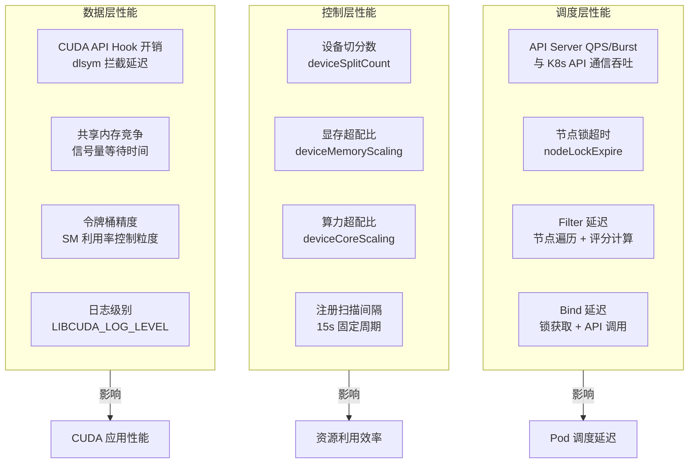
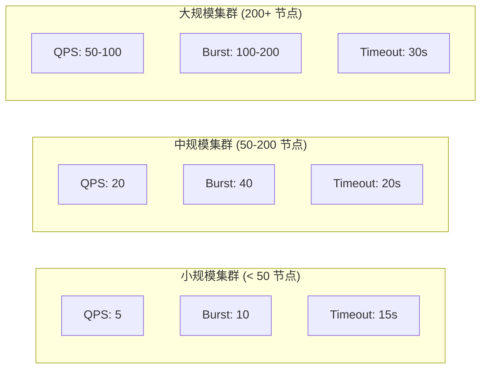
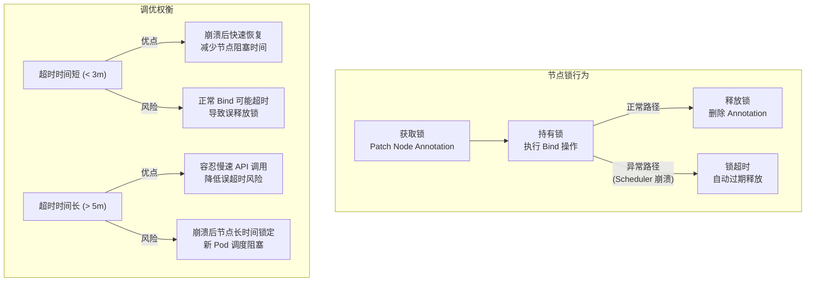
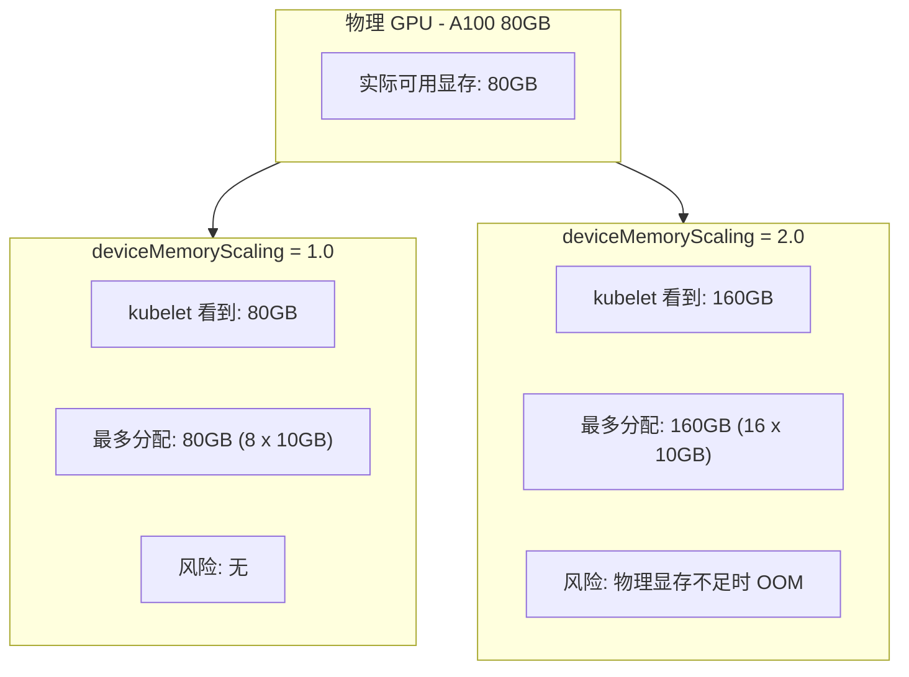
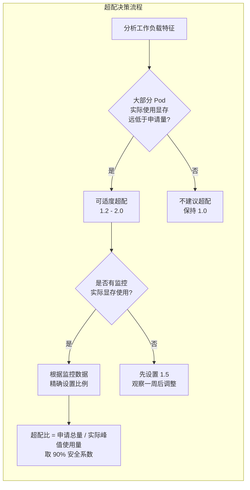
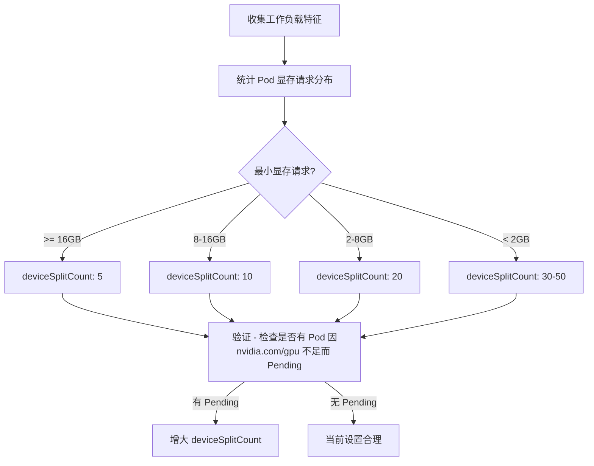
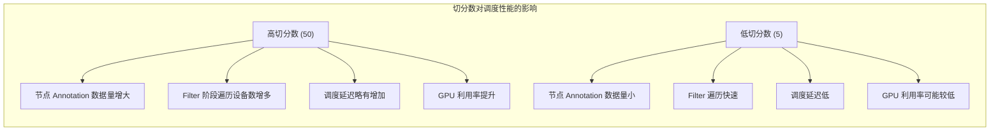
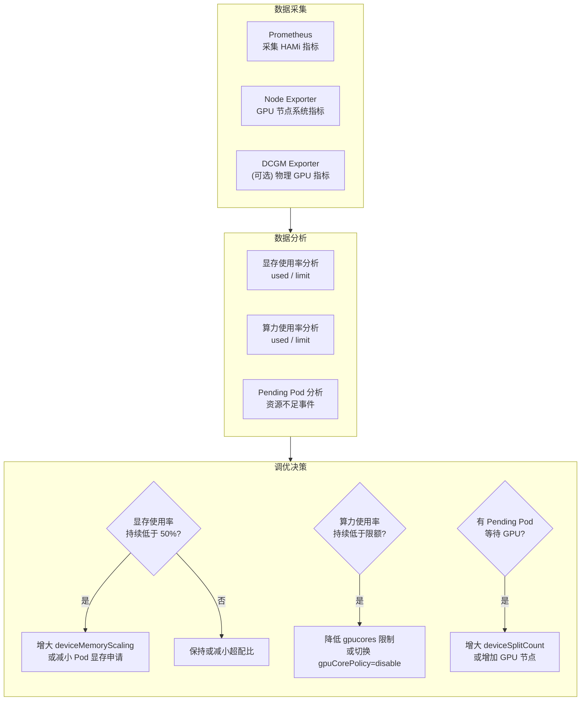
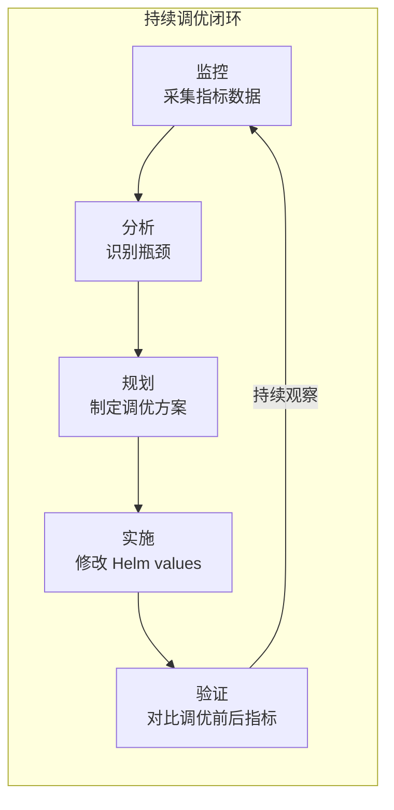

> 本文档系统介绍 HAMi 各组件的性能调优方法，包括调度器吞吐量优化、显存超配因子调优、设备切分数选择，以及基于监控数据的动态调优方法论。

---

## 目录

- [1. 性能调优总览](#1-性能调优总览)
- [2. 调度器性能调优](#2-调度器性能调优)
- [3. 显存因子调优](#3-显存因子调优)
- [4. 设备切分数优化](#4-设备切分数优化)
- [5. 基于监控的调优方法](#5-基于监控的调优方法)
- [6. 调优场景速查表](#6-调优场景速查表)

---

## 1. 性能调优总览

HAMi 的性能瓶颈可能出现在三个层面：**调度层**（Scheduler Extender 的请求处理吞吐量）、**控制层**（Device Plugin 的设备注册与 Allocate 延迟）、**数据层**（libvgpu.so 的 CUDA API Hook 开销）。以下图表展示了完整的性能指标体系。



---

## 2. 调度器性能调优

### 2.1 QPS/Burst 设置

Scheduler Extender 通过 Kubernetes client-go 与 API Server 通信。在大规模集群中，默认的 QPS/Burst 设置可能成为瓶颈。

| 参数 | 默认值 | 推荐值 (大规模集群) | 说明 |
|:-----|:------|:-------------------|:-----|
| `--kube-qps` | `5` | `50-100` | 每秒最大请求数 |
| `--kube-burst` | `10` | `100-200` | 突发请求数上限 |
| `--kube-timeout` | `15` | `30` | API 调用超时时间 (秒) |



**配置方式：**

```yaml
# values.yaml
scheduler:
  extender:
    extraArgs:
      - --debug
      - -v=4
      - --kube-qps=50
      - --kube-burst=100
      - --kube-timeout=30
```

**调优依据：**

- 如果 Scheduler 日志中频繁出现 `rate limiter Wait returned error` 或 `client rate limiter: context deadline exceeded`，说明 QPS 不足
- 可通过 Scheduler 的 Prometheus 指标 `rest_client_requests_total` 观察实际 API 调用量
- API Server 端可通过 `apiserver_request_total` 观察是否触发限流 (429)

### 2.2 节点锁超时

Scheduler 在 Bind 阶段使用分布式节点锁防止并发调度冲突。锁超时时间影响调度的并发度和容错能力。

| 参数 | 默认值 | 范围建议 | 说明 |
|:-----|:------|:--------|:-----|
| `scheduler.nodeLockExpire` | `5m` | `2m - 10m` | 节点锁超时时间 |



**调优建议：**

- 网络延迟高的环境（如跨 AZ 部署）：适当增大超时时间至 `8m-10m`
- 高并发调度场景：保持默认 `5m` 或适当减小
- 如果日志中出现 `node lock expired, releasing` 告警，说明超时时间过短

### 2.3 调度器资源配额

```yaml
# values.yaml
scheduler:
  extender:
    resources:
      requests:
        cpu: 200m
        memory: 256Mi
      limits:
        cpu: 2000m
        memory: 2Gi
  kubeScheduler:
    resources:
      requests:
        cpu: 100m
        memory: 128Mi
      limits:
        cpu: 1000m
        memory: 1Gi
```

| 集群规模 | CPU Request | CPU Limit | Memory Request | Memory Limit |
|:---------|:-----------|:----------|:--------------|:-------------|
| < 50 节点 | 100m | 500m | 128Mi | 512Mi |
| 50-200 节点 | 200m | 1000m | 256Mi | 1Gi |
| 200+ 节点 | 500m | 2000m | 512Mi | 2Gi |

---

## 3. 显存因子调优

### 3.1 deviceMemoryScaling 参数

`deviceMemoryScaling` 控制 Device Plugin 向 kubelet 报告的显存总量与物理显存的比例。

```
报告显存 = 物理显存 x deviceMemoryScaling
```

| 设置值 | 效果 | 适用场景 |
|:------|:-----|:---------|
| `0.5` | 报告 50% 物理显存 | 预留显存给系统/驱动 |
| `1.0` (默认) | 报告 100% 物理显存 | 标准场景 |
| `1.5` | 报告 150% 物理显存 | 轻度超配 |
| `2.0` | 报告 200% 物理显存 | 激进超配 |

### 3.2 超配原理与风险



### 3.3 超配调优策略



**超配公式：**

```
安全超配比 = (所有 Pod 申请显存总和 / 所有 Pod 实际显存峰值) x 0.9
```

**示例：**

```
10 个 Pod 各申请 8GB 显存 = 80GB
实际峰值使用: 各 Pod 约 4GB = 40GB
安全超配比 = (80 / 40) x 0.9 = 1.8
```

**配置方式：**

```yaml
# 全局设置
devicePlugin:
  deviceMemoryScaling: 1.5

# 或按节点差异化设置
devicePlugin:
  nodeConfiguration:
    config: |
      {
        "nodeconfig": [
          {
            "name": "inference-node-01",
            "devicememoryscaling": 2.0
          },
          {
            "name": "training-node-01",
            "devicememoryscaling": 1.0
          }
        ]
      }
```

---

## 4. 设备切分数优化

### 4.1 deviceSplitCount 参数

`deviceSplitCount` 定义每块物理 GPU 最大可被切分为多少个虚拟 GPU 实例。这个值直接影响 kubelet 看到的 `nvidia.com/gpu` 资源数量。

```
虚拟 GPU 资源数 = 物理 GPU 数量 x deviceSplitCount
```

### 4.2 切分数与资源粒度

| deviceSplitCount | 最小可分配显存 (A100 80GB) | 最大共享 Pod 数 | 适用场景 |
|:-----------------|:-------------------------|:---------------|:---------|
| 5 | 16GB | 5 | 大模型训练，需要较多显存 |
| 10 (默认) | 8GB | 10 | 通用场景 |
| 20 | 4GB | 20 | 推理服务，小模型 |
| 50 | 1.6GB | 50 | 开发调试，显存需求极小 |

### 4.3 切分数优化流程



### 4.4 切分数设置建议

```yaml
# 推理集群 - 大量小模型推理服务
devicePlugin:
  deviceSplitCount: 20
  deviceMemoryScaling: 1.5

# 训练集群 - 少量大模型训练
devicePlugin:
  deviceSplitCount: 5
  deviceMemoryScaling: 1.0

# 混合集群 - 按节点差异化
devicePlugin:
  deviceSplitCount: 10
  nodeConfiguration:
    config: |
      {
        "nodeconfig": [
          {
            "name": "inference-pool-*",
            "devicesplitcount": 20
          },
          {
            "name": "training-pool-*",
            "devicesplitcount": 5
          }
        ]
      }
```

### 4.5 切分数与调度性能的关系



> **经验值**：在 200+ 节点的大规模集群中，`deviceSplitCount` 超过 50 可能会导致 Node Annotation 过大，影响 API Server 性能。建议控制在 30 以内。

---

## 5. 基于监控的调优方法

### 5.1 关键监控指标

HAMi 通过 vGPU Monitor 暴露 Prometheus 指标，以下是调优时需要重点关注的指标。

| 指标名称 | 类型 | 说明 | 调优参考 |
|:---------|:-----|:-----|:---------|
| `hami_vgpu_memory_used_bytes` | Gauge | 容器实际 GPU 显存使用量 | 与 limit 对比评估超配空间 |
| `hami_vgpu_memory_limit_bytes` | Gauge | 容器 GPU 显存限额 | 资源分配量 |
| `hami_vgpu_core_used_percent` | Gauge | 容器实际 SM 使用率 | 算力隔离效果 |
| `hami_vgpu_core_limit_percent` | Gauge | 容器 SM 限额 | 算力分配量 |

### 5.2 监控驱动的调优流水线



### 5.3 常用 PromQL 查询

#### 显存使用率分析

```promql
# 所有容器的显存使用率 (用于评估超配空间)
hami_vgpu_memory_used_bytes / hami_vgpu_memory_limit_bytes * 100

# 显存使用率低于 30% 的容器 (超配候选)
(hami_vgpu_memory_used_bytes / hami_vgpu_memory_limit_bytes * 100) < 30

# 显存使用率超过 90% 的容器 (OOM 风险)
(hami_vgpu_memory_used_bytes / hami_vgpu_memory_limit_bytes * 100) > 90
```

#### 算力使用率分析

```promql
# 算力使用率分布
histogram_quantile(0.95, hami_vgpu_core_used_percent)

# 算力限制效果评估
hami_vgpu_core_used_percent / hami_vgpu_core_limit_percent * 100
```

#### GPU 节点资源余量

```promql
# 节点可分配 GPU 数量
kube_node_status_allocatable{resource="nvidia_com_gpu"}

# 节点已使用 GPU 数量
sum by (node) (kube_pod_container_resource_requests{resource="nvidia_com_gpu"})
```

### 5.4 Grafana 告警规则示例

```yaml
# 告警: GPU 显存使用率超过 90%
- alert: HAMiGPUMemoryHigh
  expr: |
    (hami_vgpu_memory_used_bytes / hami_vgpu_memory_limit_bytes) > 0.9
  for: 5m
  labels:
    severity: warning
  annotations:
    summary: "GPU 容器显存使用率超过 90%"
    description: "Pod {{ $labels.pod }} 的 GPU 显存使用率为 {{ $value | humanizePercentage }}"

# 告警: GPU Pod Pending 超过 10 分钟
- alert: HAMiGPUPodPending
  expr: |
    kube_pod_status_phase{phase="Pending"} == 1
    and on(pod)
    kube_pod_container_resource_requests{resource="nvidia_com_gpu"} > 0
  for: 10m
  labels:
    severity: warning
  annotations:
    summary: "GPU Pod 长时间 Pending"
```

### 5.5 调优反馈闭环



---

## 6. 调优场景速查表

### 6.1 常见问题与调优方案

| 问题现象 | 可能原因 | 调优参数 | 建议值 |
|:---------|:---------|:--------|:------|
| GPU Pod 调度延迟高 | API Server QPS 不足 | `--kube-qps`, `--kube-burst` | 50, 100 |
| 节点被长时间锁定 | 锁超时过长 / Scheduler 异常 | `scheduler.nodeLockExpire` | `3m` |
| GPU 利用率低 | 切分数太小 | `devicePlugin.deviceSplitCount` | 增大至 20 |
| 显存 OOM 频繁 | 超配比过高 | `devicePlugin.deviceMemoryScaling` | 减小至 1.0 |
| 调度器 OOM Kill | 内存限制太小 | `scheduler.extender.resources.limits.memory` | 增大至 2Gi |
| Monitor 数据缺失 | Monitor 日志级别过低 | `devicePlugin.monitor.extraArgs` | `-v=4` |
| CUDA 应用性能下降 | 日志级别过高 | `devices.nvidia.libCudaLogLevel` | `0` 或 `1` |
| 算力隔离不精确 | 默认策略过于宽松 | `devices.nvidia.gpuCorePolicy` | `force` |

### 6.2 环境分级配置模板

```yaml
# === 开发环境 ===
devicePlugin:
  deviceSplitCount: 20
  deviceMemoryScaling: 2.0
scheduler:
  defaultSchedulerPolicy:
    nodeSchedulerPolicy: binpack
    gpuSchedulerPolicy: binpack
devices:
  nvidia:
    gpuCorePolicy: disable
    libCudaLogLevel: 3

# === 生产环境 ===
devicePlugin:
  deviceSplitCount: 10
  deviceMemoryScaling: 1.0
scheduler:
  leaderElect: true
  replicas: 2
  defaultSchedulerPolicy:
    nodeSchedulerPolicy: spread
    gpuSchedulerPolicy: spread
  extender:
    extraArgs:
      - --kube-qps=50
      - --kube-burst=100
devices:
  nvidia:
    gpuCorePolicy: force
    libCudaLogLevel: 0
```

---

> **文档版本：** v1.0
>
> **适用 HAMi 版本：** v2.x
>
> **最后更新：** 2025-05
