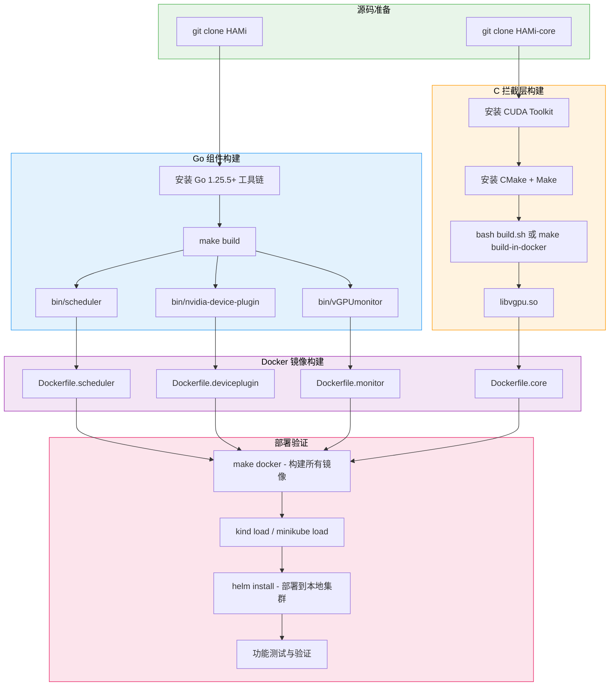

<p align="center">
  
  
  
  
  
</p>

> 本文档面向希望参与 HAMi 开发的贡献者，详细介绍如何从零搭建完整的开发环境，涵盖 Go 组件编译、C 拦截层构建、Docker 镜像打包、测试执行以及本地集群调试的全流程。

---

## 1. 开发环境总览

HAMi 项目由两个核心代码仓库组成，分别使用不同的编程语言和构建工具链：

| 仓库 | 语言 | 构建工具 | 核心产物 |
|------|------|----------|----------|
| **HAMi** | Go | Go 1.25.5+ / Makefile | `bin/scheduler`、`bin/vGPUmonitor`、`bin/nvidia-device-plugin` |
| **HAMi-core** | C | CMake + Make / CUDA Toolkit | `libvgpu.so` |

### 1.1 完整构建流水线

以下流程图展示了从源码到可部署镜像的完整构建过程：



---

## 2. 构建 HAMi（Go 组件）

### 2.1 前置依赖

| 依赖项 | 最低版本 | 安装方式 | 验证命令 |
|--------|----------|----------|----------|
| Go | 1.25.5+ | [官方安装页面](https://go.dev/dl/) | `go version` |
| Make | GNU Make 3.81+ | 系统包管理器 | `make --version` |
| Git | 2.0+ | 系统包管理器 | `git --version` |

### 2.2 获取源码

```bash
# 克隆 HAMi 主仓库
git clone https://github.com/Project-HAMi/HAMi.git
cd HAMi

# 确认 Go 模块依赖可正常下载
go mod download
```

### 2.3 Makefile 核心目标

HAMi 项目使用 Makefile 管理所有构建任务。以下是开发中最常用的目标：

| 目标 | 命令 | 说明 |
|------|------|------|
| 编译所有二进制 | `make build` | 编译 scheduler、device-plugin、monitor 到 `bin/` 目录 |
| 构建 Docker 镜像 | `make docker` | 构建所有组件的 Docker 镜像 |
| 运行测试 | `make test` | 执行全部 Go 单元测试 |
| 代码检查 | `make lint` | 运行 golangci-lint 静态检查 |
| 清理产物 | `make clean` | 删除 `bin/` 目录和中间文件 |

### 2.4 编译二进制

```bash
# 编译全部组件
make build

# 编译后产物路径
ls -la bin/
# bin/scheduler              - HAMi 调度器扩展
# bin/vGPUmonitor            - vGPU 监控组件
# bin/nvidia-device-plugin   - NVIDIA Device Plugin
```

### 2.5 版本信息注入

HAMi 使用 Go 的 `ldflags` 机制在编译时注入版本信息。构建时会自动设置以下变量：

```bash
# Makefile 中的版本注入逻辑
GO_LDFLAGS := -X 'pkg/version.BuildVersion=$(VERSION)' \
              -X 'pkg/version.BuildDate=$(BUILD_DATE)' \
              -X 'pkg/version.GitCommit=$(GIT_COMMIT)' \
              -X 'pkg/version.GoVersion=$(GO_VERSION)'

# 手动编译时可以指定版本
go build -ldflags "$(GO_LDFLAGS)" -o bin/scheduler cmd/scheduler/main.go
```

版本信息对应的源码位于 `pkg/version/version.go`，在运行时可通过日志或 API 查询当前版本：

```go
// pkg/version/version.go
var (
    BuildVersion string  // 构建版本号（如 v2.8.0）
    BuildDate    string  // 构建日期
    GitCommit    string  // Git commit hash
    GoVersion    string  // Go 编译器版本
)
```

### 2.6 交叉编译

HAMi 支持为不同平台交叉编译二进制文件：

```bash
# 为 Linux amd64 交叉编译（macOS 开发环境常用）
GOOS=linux GOARCH=amd64 make build

# 为 Linux arm64 交叉编译
GOOS=linux GOARCH=arm64 make build
```

---

## 3. 构建 HAMi-core（C 拦截层）

HAMi-core 是 HAMi 的用户态拦截层，使用 C 语言编写，依赖 CUDA Toolkit 进行编译。

### 3.1 前置依赖

| 依赖项 | 最低版本 | 安装路径 | 验证命令 |
|--------|----------|----------|----------|
| CUDA Toolkit | 11.0+ | `/usr/local/cuda` | `nvcc --version` |
| CMake | 3.10+ | 系统包管理器 | `cmake --version` |
| GCC / G++ | 7.0+ | 系统包管理器 | `gcc --version` |
| Make | GNU Make 3.81+ | 系统包管理器 | `make --version` |

> **注意**: CUDA Toolkit 必须安装在 `/usr/local/cuda` 路径，或通过 `CUDA_HOME` 环境变量指定安装路径。CMake 会使用此路径查找 CUDA 编译器和运行时库。

### 3.2 获取源码

```bash
# 克隆 HAMi-core 仓库
git clone https://github.com/Project-HAMi/HAMi-core.git
cd HAMi-core
```

### 3.3 构建方式一 - 本地编译

```bash
# 确保 CUDA Toolkit 路径正确
export CUDA_HOME=/usr/local/cuda
export PATH=$CUDA_HOME/bin:$PATH

# 使用 build.sh 脚本编译
bash build.sh

# 编译产物
ls -la build/
# build/libvgpu.so   - 最终的 CUDA 拦截共享库
```

`build.sh` 脚本内部会执行以下步骤：

```bash
# build.sh 内部逻辑概要
mkdir -p build && cd build
cmake .. -DCMAKE_BUILD_TYPE=Release
make -j$(nproc)
```

### 3.4 构建方式二 - Docker 容器内编译（推荐）

如果本地没有安装 CUDA Toolkit，可以使用 Docker 容器进行编译，这是更推荐的方式：

```bash
# 使用预配置的 Docker 环境编译
make build-in-docker

# 编译产物同样位于 build/ 目录
ls -la build/libvgpu.so
```

该方式使用包含 CUDA Toolkit 的 Docker 镜像，无需在宿主机安装 CUDA 环境，特别适合 macOS 或无 GPU 的 Linux 开发机。

### 3.5 CMake 构建参数

| 参数 | 默认值 | 说明 |
|------|--------|------|
| `CMAKE_BUILD_TYPE` | `Release` | 构建类型：`Release`（优化）/ `Debug`（调试符号） |
| `CUDA_HOME` | `/usr/local/cuda` | CUDA Toolkit 安装路径 |
| `CMAKE_INSTALL_PREFIX` | `/usr/local` | 安装目标路径 |

```bash
# Debug 模式编译（包含调试符号，便于 gdb 调试）
mkdir -p build && cd build
cmake .. -DCMAKE_BUILD_TYPE=Debug
make -j$(nproc)
```

---

## 4. Docker 镜像构建

HAMi 项目包含多个 Dockerfile，用于构建不同组件的容器镜像。

### 4.1 Dockerfile 结构

| Dockerfile | 构建产物 | 基础镜像 | 说明 |
|------------|----------|----------|------|
| `Dockerfile.scheduler` | `hami-scheduler` | `golang` + `alpine` | Scheduler Extender 服务镜像 |
| `Dockerfile.deviceplugin` | `hami-device-plugin` | `golang` + `nvidia/cuda` | Device Plugin + libvgpu.so |
| `Dockerfile.monitor` | `hami-vgpumonitor` | `golang` + `alpine` | vGPU 监控组件镜像 |
| `Dockerfile.core` | `hami-core` | `nvidia/cuda` | 仅包含 libvgpu.so 的基础镜像 |

### 4.2 构建流程


### 4.3 构建所有镜像

```bash
# 一键构建所有 Docker 镜像
make docker

# 构建时指定镜像 tag
make docker IMAGE_TAG=dev-$(git rev-parse --short HEAD)

# 仅构建某个组件的镜像
docker build -f Dockerfile.scheduler -t hami-scheduler:dev .
docker build -f Dockerfile.deviceplugin -t hami-device-plugin:dev .
```

### 4.4 推送镜像到本地 Registry

```bash
# 启动本地 Registry（开发用）
docker run -d -p 5000:5000 --name registry registry:2

# 标记并推送镜像
docker tag hami-scheduler:dev localhost:5000/hami-scheduler:dev
docker push localhost:5000/hami-scheduler:dev
```

---

## 5. 测试

### 5.1 Go 单元测试

```bash
# 运行全部 Go 单元测试
make test

# 或直接使用 go test
go test ./pkg/... -v

# 运行特定包的测试
go test ./pkg/scheduler/... -v -run TestFilter

# 测试覆盖率报告
go test ./pkg/... -coverprofile=coverage.out
go tool cover -html=coverage.out -o coverage.html
```

### 5.2 C 测试（HAMi-core）

```bash
cd HAMi-core

# 编译并运行测试
cd build
cmake .. -DCMAKE_BUILD_TYPE=Debug -DBUILD_TESTS=ON
make -j$(nproc)
ctest --output-on-failure
```

### 5.3 集成测试

```bash
# 使用 kind 集群运行集成测试
make e2e-test

# 或手动执行
kind create cluster --name hami-test
# 加载镜像到 kind 集群
kind load docker-image hami-scheduler:dev --name hami-test
kind load docker-image hami-device-plugin:dev --name hami-test
# 部署并测试
helm install hami charts/hami -n kube-system --set global.imageTag=dev
```

---

## 6. 本地开发集群

### 6.1 使用 kind 搭建本地集群

[kind](https://kind.sigs.k8s.io/) 是推荐的本地开发集群工具，支持快速创建和销毁集群：

```bash
# 安装 kind
go install sigs.k8s.io/kind@latest

# 创建集群（使用自定义配置）
cat <<EOF | kind create cluster --name hami-dev --config=-
kind: Cluster
apiVersion: kind.x-k8s.io/v1alpha4
nodes:
- role: control-plane
- role: worker
  extraMounts:
  - hostPath: /dev/null
    containerPath: /dev/nvidia0
EOF
```

> **注意**: kind 集群没有真实 GPU 设备，适合调试调度逻辑和 Webhook 等控制平面组件。如需测试 GPU 拦截功能，请使用 minikube + GPU passthrough 或直接在有 GPU 的开发机上部署。

### 6.2 使用 minikube 搭建本地集群

minikube 支持 GPU passthrough，适合端到端测试：

```bash
# 安装 minikube
curl -LO https://storage.googleapis.com/minikube/releases/latest/minikube-linux-amd64
sudo install minikube-linux-amd64 /usr/local/bin/minikube

# 创建带 GPU 支持的集群
minikube start --driver=docker --gpus=all

# 验证 GPU 可用
minikube ssh -- nvidia-smi
```

### 6.3 本地开发工作流


### 6.4 调试技巧

**调度器远程调试（使用 Delve）**

```bash
# 编译时加入调试信息
go build -gcflags="all=-N -l" -o bin/scheduler cmd/scheduler/main.go

# 使用 dlv 启动调试
dlv exec bin/scheduler -- --http_bind=0.0.0.0:8080

# 或者连接到正在运行的进程
dlv attach <pid>
```

**HAMi-core 调试（使用 GDB）**

```bash
# Debug 模式编译
cd HAMi-core/build
cmake .. -DCMAKE_BUILD_TYPE=Debug
make -j$(nproc)

# 在容器内使用 GDB 调试
gdb -p <cuda-process-pid>
```

**日志级别调整**

```bash
# 调整 Scheduler 日志级别
kubectl set env deployment/hami-scheduler -n kube-system KLOG_V=5

# 调整 HAMi-core 日志级别（需要重建 Pod）
# 在 Pod spec 中设置
# env:
#   - name: LIBCUDA_LOG_LEVEL
#     value: "4"
```

---

## 7. IDE 配置建议

### 7.1 Go 开发（VSCode / GoLand）

推荐的 VSCode 配置（`.vscode/settings.json`）：

```json
{
    "go.toolsManagement.autoUpdate": true,
    "go.useLanguageServer": true,
    "go.buildTags": "",
    "go.testFlags": ["-v"],
    "go.lintTool": "golangci-lint",
    "go.lintFlags": ["--fast"]
}
```

### 7.2 C 开发（VSCode + clangd）

推荐安装 clangd 扩展并配置 `compile_commands.json`：

```bash
# 在 HAMi-core/build 目录生成 compile_commands.json
cd HAMi-core/build
cmake .. -DCMAKE_EXPORT_COMPILE_COMMANDS=ON

# 创建符号链接到项目根目录
ln -s build/compile_commands.json ../compile_commands.json
```

---

## 8. 常见构建问题排查

| 问题 | 原因 | 解决方案 |
|------|------|----------|
| `go: module not found` | Go 模块代理不可达 | 设置 `GOPROXY=https://goproxy.cn,direct`（国内环境） |
| `nvcc not found` | CUDA Toolkit 未安装或路径未配置 | 确保 `/usr/local/cuda/bin` 在 `PATH` 中 |
| `cannot find -lcuda` | CUDA 驱动库缺失 | 安装 NVIDIA 驱动或使用 `make build-in-docker` |
| `permission denied` on Docker | Docker 权限不足 | 将当前用户加入 docker 组：`sudo usermod -aG docker $USER` |
| `kind load` 超时 | 镜像过大 | 使用多阶段构建减小镜像体积，或增大 Docker 资源配额 |
| `helm install` CRD 冲突 | 已有旧版本残留 | `helm uninstall hami -n kube-system` 后重新安装 |

---

## 9. 下一步

- [代码结构解析](./02-code-organization/) -- 深入了解 HAMi 和 HAMi-core 的代码组织与模块划分
- [设计决策解读](./03-design-decisions/) -- 理解 HAMi 架构中关键设计选择的背景与权衡

---

<p align="center">
  <sub>HAMi Technical Documentation - Contributing Guide - Development Setup</sub>
</p>
