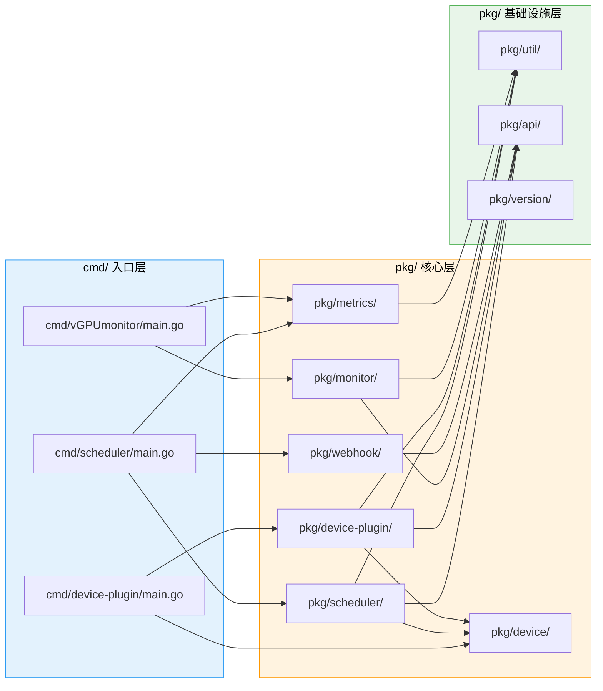
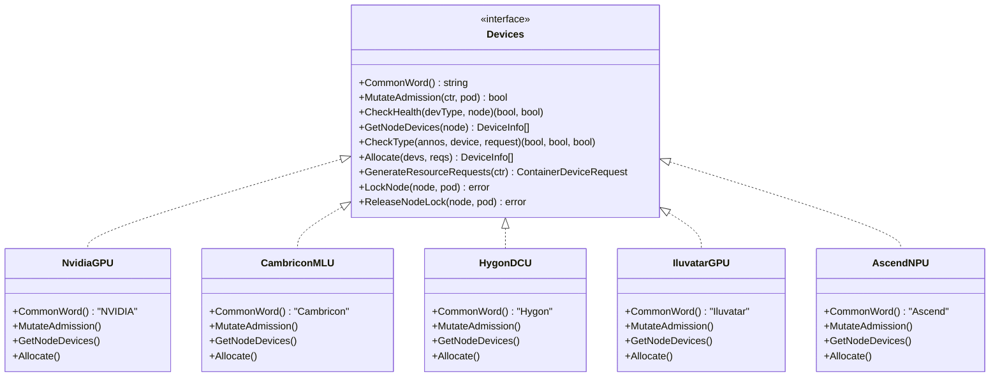
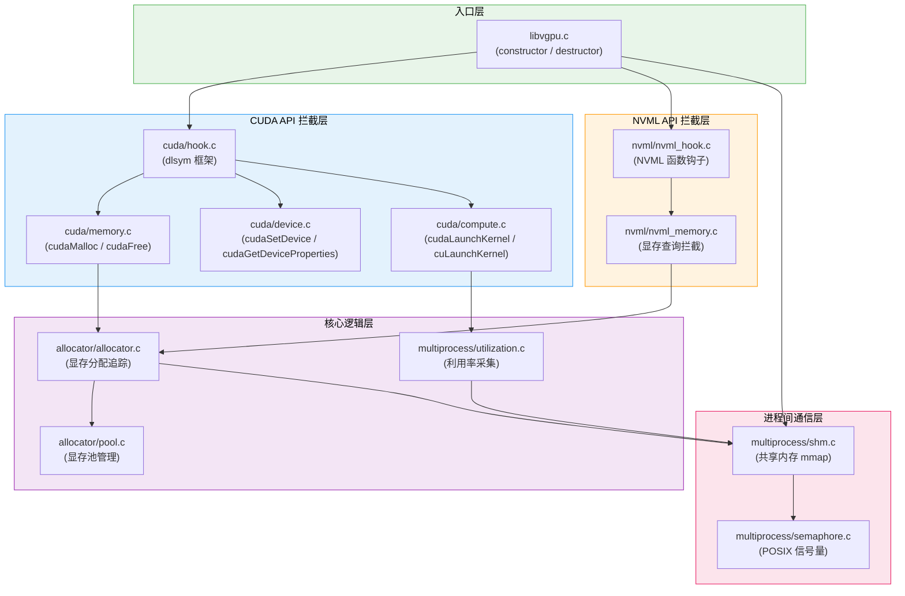
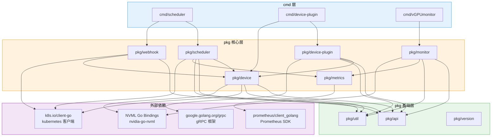
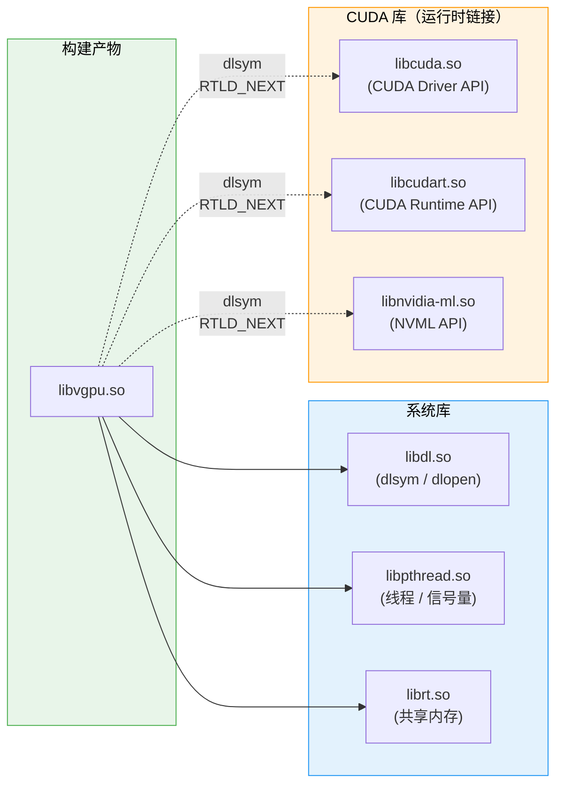

<p align="center">
  
  
  
</p>

> 本文档深入解析 HAMi 和 HAMi-core 两个仓库的代码组织结构，帮助开发者快速定位功能模块、理解包依赖关系，并找到合适的扩展点进行开发。

---

## 1. HAMi 仓库结构（Go）

HAMi 主仓库使用 Go 语言编写，采用标准的 Go 项目布局。以下是完整的目录结构及功能说明：

### 1.1 顶层目录树

```
HAMi/
├── cmd/                          # 可执行程序入口
│   ├── scheduler/                # 调度器扩展入口
│   │   └── main.go
│   ├── device-plugin/            # Device Plugin 入口
│   │   └── main.go
│   └── vGPUmonitor/              # vGPU 监控入口
│       └── main.go
├── pkg/                          # 核心库代码
│   ├── api/                      # API 类型定义
│   ├── scheduler/                # 调度器核心逻辑
│   ├── device/                   # 设备抽象与多设备实现
│   ├── device-plugin/            # kubelet Device Plugin 实现
│   ├── monitor/                  # GPU 监控采集
│   ├── metrics/                  # Prometheus 指标定义
│   ├── util/                     # 通用工具库
│   ├── version/                  # 版本信息
│   └── webhook/                  # Mutating Webhook
├── charts/                       # Helm Charts
│   └── hami/
│       ├── Chart.yaml
│       ├── values.yaml
│       └── templates/
├── Dockerfile.*                  # 各组件 Dockerfile
├── Makefile                      # 构建入口
├── go.mod                        # Go 模块定义
└── go.sum                        # 依赖校验和
```

### 1.2 cmd/ - 程序入口

`cmd/` 目录包含三个可执行程序的入口文件，每个入口负责初始化对应组件并启动主循环：

| 入口 | 路径 | 组件 | 核心职责 |
|------|------|------|----------|
| scheduler | `cmd/scheduler/main.go` | Scheduler Extender | 初始化 HTTP 路由（Filter/Bind），启动调度服务 |
| device-plugin | `cmd/device-plugin/main.go` | Device Plugin | 注册 gRPC 服务，上报设备资源到 kubelet |
| vGPUmonitor | `cmd/vGPUmonitor/main.go` | vGPU Monitor | 启动指标采集循环，暴露 Prometheus 端点 |



### 1.3 pkg/scheduler/ - 调度器核心逻辑

调度器是 HAMi 的核心组件，负责设备感知的节点筛选和设备绑定：

```
pkg/scheduler/
├── scheduler.go            # Scheduler 结构体与初始化
├── filter.go               # Filter 扩展 - 节点筛选逻辑
├── bind.go                 # Bind 扩展 - 设备绑定逻辑
├── score.go                # Score 扩展 - 节点评分逻辑
├── routes.go               # HTTP 路由注册
├── config.go               # 调度器配置
├── node_manager.go         # 节点设备信息缓存管理
├── policy/
│   ├── binpack.go          # Binpack 策略实现
│   └── spread.go           # Spread 策略实现
└── topology/
    └── topology.go         # NUMA 拓扑感知调度
```

**关键函数调用链**

| HTTP 端点 | 入口函数 | 核心逻辑 |
|-----------|----------|----------|
| `POST /filter` | `Filter()` | 遍历节点设备列表，检查是否满足 Pod 的 vGPU 请求 |
| `POST /bind` | `Bind()` | 选择最优设备组合，将分配结果写入 Pod Annotation |
| `POST /score` | `Score()` | 根据 Binpack/Spread 策略计算节点得分 |

### 1.4 pkg/device/ - 设备抽象与多设备实现

`pkg/device/` 定义了设备接口抽象层，支持多种异构设备的统一管理：

```
pkg/device/
├── devices.go              # Devices 接口定义（核心抽象）
├── register.go             # 设备注册表（全局注册机制）
├── nvidia/
│   ├── nvidia.go           # NVIDIA GPU 实现
│   ├── allocate.go         # NVIDIA 设备分配逻辑
│   └── config.go           # NVIDIA 特定配置
├── cambricon/
│   └── cambricon.go        # 寒武纪 MLU 实现
├── hygon/
│   └── hygon.go            # 海光 DCU 实现
├── iluvatar/
│   └── iluvatar.go         # 天数智芯 GPU 实现
└── ascend/
    └── ascend.go           # 华为昇腾 NPU 实现
```

所有设备类型都实现了统一的 `Devices` 接口：



### 1.5 pkg/device-plugin/ - kubelet Device Plugin

```
pkg/device-plugin/
├── plugin.go               # Device Plugin gRPC 服务主体
├── server.go               # gRPC Server 初始化与注册
├── allocate.go             # Allocate 实现 - 读取 Annotation 配置容器
├── listwatch.go            # ListAndWatch - 设备发现与上报
└── health.go               # 设备健康检查
```

### 1.6 pkg/monitor/ - GPU 监控

```
pkg/monitor/
├── monitor.go              # Monitor 主循环
├── collector.go            # 指标采集器 - 读取共享内存/NVML
├── podresource.go          # 关联 Pod 与 GPU 设备使用量
└── display.go              # 指标展示格式化
```

### 1.7 pkg/metrics/ - Prometheus 指标

```
pkg/metrics/
├── metrics.go              # 指标定义（Gauge、Counter、Histogram）
└── register.go             # 指标注册到 Prometheus
```

已定义的核心指标：

| 指标名称 | 类型 | 说明 |
|---------|------|------|
| `hami_vgpu_memory_used_bytes` | Gauge | 容器已使用的 vGPU 显存 |
| `hami_vgpu_memory_limit_bytes` | Gauge | 容器的 vGPU 显存上限 |
| `hami_vgpu_core_used_percent` | Gauge | 容器已使用的算力百分比 |
| `hami_device_count` | Gauge | 节点设备总数 |
| `hami_schedule_duration_seconds` | Histogram | 调度请求处理耗时 |

### 1.8 pkg/util/ - 通用工具库

```
pkg/util/
├── client/
│   └── client.go           # Kubernetes 客户端初始化
├── nodelock/
│   └── nodelock.go         # 节点锁（基于 Annotation 实现）
├── leaderelection/
│   └── leaderelection.go   # Leader 选举封装
├── types.go                # 公共类型定义
├── annotation.go           # Annotation 编解码工具
├── container.go            # 容器资源请求解析
└── util.go                 # 其他通用工具函数
```

### 1.9 charts/ - Helm Charts

```
charts/hami/
├── Chart.yaml              # Chart 元信息（版本、描述）
├── values.yaml             # 默认配置参数
├── templates/
│   ├── scheduler/
│   │   ├── deployment.yaml
│   │   └── service.yaml
│   ├── device-plugin/
│   │   ├── daemonset.yaml
│   │   └── configmap.yaml
│   ├── webhook/
│   │   └── mutatingwebhook.yaml
│   ├── rbac/
│   │   ├── clusterrole.yaml
│   │   └── clusterrolebinding.yaml
│   └── _helpers.tpl        # 模板辅助函数
└── crds/                   # CRD 定义（如有）
```

---

## 2. HAMi-core 仓库结构（C）

HAMi-core 是用户态的 CUDA 拦截层，使用 C 语言编写，通过 LD_PRELOAD 机制注入容器进程。

### 2.1 顶层目录树

```
HAMi-core/
├── src/
│   ├── libvgpu.c           # 库入口 - constructor/destructor
│   ├── cuda/               # CUDA Runtime/Driver API 拦截
│   │   ├── hook.c          # dlsym hook 框架
│   │   ├── memory.c        # 显存分配 API 拦截 (cudaMalloc 等)
│   │   ├── device.c        # 设备管理 API 拦截 (cudaSetDevice 等)
│   │   └── compute.c       # 算力控制 API 拦截 (cudaLaunchKernel 等)
│   ├── nvml/               # NVML API 拦截
│   │   ├── nvml_hook.c     # NVML 函数钩子
│   │   └── nvml_memory.c   # NVML 显存查询拦截
│   ├── multiprocess/       # 多进程协调
│   │   ├── shm.c           # 共享内存管理（mmap + 文件后备）
│   │   ├── semaphore.c     # POSIX 信号量封装
│   │   └── utilization.c   # 利用率采集与汇报
│   ├── allocator/          # 内存追踪
│   │   ├── allocator.c     # 显存分配追踪器
│   │   └── pool.c          # 显存池管理
│   └── include/            # 头文件
│       ├── libvgpu.h       # 公共头文件
│       ├── cuda_hook.h     # CUDA hook 声明
│       ├── nvml_hook.h     # NVML hook 声明
│       ├── shm.h           # 共享内存数据结构
│       ├── allocator.h     # 内存追踪接口
│       └── log.h           # 日志宏定义
├── build.sh                # 本地构建脚本
├── CMakeLists.txt          # CMake 构建配置
├── Makefile                # Make 构建入口
└── tests/                  # 测试
    ├── test_memory.c       # 显存管理测试
    ├── test_shm.c          # 共享内存测试
    └── test_hook.c         # Hook 功能测试
```

### 2.2 源码文件依赖关系

以下依赖图展示了 HAMi-core 各源文件之间的调用关系：



### 2.3 关键源文件详解

#### `src/libvgpu.c` - 库入口

这是 `libvgpu.so` 的入口文件，使用 GCC 的 `__attribute__((constructor))` 特性在库加载时自动执行初始化：

```c
// 伪代码示意
__attribute__((constructor))
void libvgpu_init(void) {
    // 1. 读取环境变量（CUDA_DEVICE_MEMORY_LIMIT 等）
    // 2. 初始化共享内存区域
    // 3. 注册 CUDA/NVML hook
    // 4. 初始化内存追踪器
}

__attribute__((destructor))
void libvgpu_cleanup(void) {
    // 清理共享内存和信号量
}
```

#### `src/cuda/hook.c` - dlsym Hook 框架

通过 `dlsym(RTLD_NEXT, ...)` 获取原始 CUDA 函数指针，在拦截函数中先执行 HAMi 的控制逻辑，再转发给原始函数：

```c
// Hook 机制示意
typedef cudaError_t (*cudaMalloc_fn)(void**, size_t);

cudaError_t cudaMalloc(void **devPtr, size_t size) {
    static cudaMalloc_fn real_cudaMalloc = NULL;
    if (!real_cudaMalloc) {
        real_cudaMalloc = dlsym(RTLD_NEXT, "cudaMalloc");
    }

    // HAMi 显存配额检查
    if (!check_memory_limit(size)) {
        return cudaErrorMemoryAllocation;
    }

    // 调用原始函数
    cudaError_t ret = real_cudaMalloc(devPtr, size);

    // 记录分配
    if (ret == cudaSuccess) {
        track_allocation(*devPtr, size);
    }

    return ret;
}
```

#### `src/multiprocess/shm.c` - 共享内存管理

使用 POSIX 共享内存实现容器内多进程和 Monitor 组件之间的数据共享：

```c
// 共享内存数据结构（简化）
typedef struct {
    uint32_t pid;                    // 进程 ID
    uint64_t memory_used;            // 已使用显存（字节）
    uint64_t memory_limit;           // 显存上限（字节）
    uint32_t sm_utilization;         // SM 使用率百分比
    uint32_t sm_limit;               // SM 使用上限
    uint64_t last_update_timestamp;  // 最后更新时间戳
} process_info_t;

typedef struct {
    uint32_t version;                // 数据结构版本
    uint32_t num_processes;          // 活跃进程数
    sem_t    lock;                   // POSIX 信号量
    process_info_t processes[MAX_PROCESSES];
} shm_region_t;
```

---

## 3. 包依赖关系图

### 3.1 Go 包依赖全景图



### 3.2 C 库链接依赖图



> **注意**: libvgpu.so 与 CUDA 库之间是运行时动态链接关系（虚线），而非编译时链接。这使得 libvgpu.so 可以在没有 CUDA 库的环境中编译，仅在运行时需要 CUDA 环境。

---

## 4. 关键接口与扩展点

### 4.1 添加新设备类型

HAMi 的设备抽象层通过 `Devices` 接口支持扩展新的设备类型。添加新设备的核心步骤：

1. **实现接口**: 在 `pkg/device/<vendor>/` 目录下创建新包，实现 `Devices` 接口的所有方法
2. **注册设备**: 在 `init()` 函数中调用 `device.Register()` 将新设备注册到全局注册表
3. **配置 Helm**: 在 `values.yaml` 中添加新设备的配置区块
4. **添加 Webhook 规则**: 确保 Mutating Webhook 能识别新设备的资源请求

```go
// 扩展新设备的模板代码
package mydevice

import "github.com/Project-HAMi/HAMi/pkg/device"

type MyDevice struct {
    // 设备特定字段
}

func init() {
    device.Register("mydevice", &MyDevice{})
}

// 实现 Devices 接口的所有方法
func (d *MyDevice) CommonWord() string { return "MyDevice" }
// ... 其余方法实现
```

### 4.2 添加新调度策略

调度策略位于 `pkg/scheduler/policy/`，新增策略需要：

1. 在 `pkg/scheduler/policy/` 目录下创建新文件
2. 实现节点评分函数，返回 `float32` 类型的评分值
3. 在 `config.go` 中注册新策略名称
4. 在 `values.yaml` 中暴露配置项

### 4.3 添加新 Prometheus 指标

在 `pkg/metrics/metrics.go` 中定义新指标，并在对应的采集代码中更新：

```go
// 定义新指标
var MyCustomMetric = prometheus.NewGaugeVec(
    prometheus.GaugeOpts{
        Name: "hami_custom_metric",
        Help: "Description of the metric",
    },
    []string{"node", "device_id"},
)

// 在 init() 中注册
func init() {
    prometheus.MustRegister(MyCustomMetric)
}
```

---

## 5. 测试结构

### 5.1 Go 测试布局

HAMi 采用 Go 标准的测试组织方式，测试文件与源码文件位于同一目录：

```
pkg/scheduler/
├── filter.go
├── filter_test.go          # filter.go 的单元测试
├── bind.go
├── bind_test.go            # bind.go 的单元测试
├── score.go
└── score_test.go           # score.go 的单元测试
```

| 测试类型 | 位置 | 运行方式 | 说明 |
|---------|------|----------|------|
| 单元测试 | `pkg/**/*_test.go` | `go test ./pkg/...` | 覆盖核心业务逻辑 |
| 集成测试 | `test/e2e/` | `make e2e-test` | 端到端集群测试 |
| Mock 测试 | `pkg/**/mock_*.go` | 随单元测试运行 | 模拟 K8s API 和设备接口 |

### 5.2 C 测试布局

```
HAMi-core/tests/
├── test_memory.c           # 显存管理单元测试
├── test_shm.c              # 共享内存读写测试
├── test_hook.c             # Hook 函数功能测试
└── CMakeLists.txt          # 测试构建配置
```

运行 C 测试：

```bash
cd HAMi-core/build
cmake .. -DBUILD_TESTS=ON
make -j$(nproc)
ctest --output-on-failure
```

---

## 6. 代码导航速查表

开发中遇到特定问题时，可以使用以下速查表快速定位代码：

| 如果你想 | 查看这里 |
|---------|---------|
| 理解调度器如何筛选节点 | `pkg/scheduler/filter.go` |
| 理解设备如何绑定到 Pod | `pkg/scheduler/bind.go` |
| 理解 Webhook 如何修改 Pod | `pkg/webhook/` |
| 理解 Device Plugin 如何注册资源 | `pkg/device-plugin/listwatch.go` |
| 理解 Allocate 如何配置容器 | `pkg/device-plugin/allocate.go` |
| 添加新的硬件设备支持 | `pkg/device/` + 实现 `Devices` 接口 |
| 理解 CUDA API 如何被拦截 | `HAMi-core/src/cuda/hook.c` |
| 理解显存限制如何生效 | `HAMi-core/src/cuda/memory.c` |
| 理解算力限制如何生效 | `HAMi-core/src/cuda/compute.c` |
| 理解多进程如何共享数据 | `HAMi-core/src/multiprocess/shm.c` |
| 理解 Monitor 如何采集指标 | `pkg/monitor/collector.go` |
| 修改 Helm 部署配置 | `charts/hami/values.yaml` |
| 修改 Prometheus 指标定义 | `pkg/metrics/metrics.go` |

---

## 7. 下一步

- [开发环境搭建](./01-development-setup/) -- 了解如何构建和测试 HAMi
- [设计决策解读](./03-design-decisions/) -- 理解这些代码组织和架构选择背后的原因

---

<p align="center">
  <sub>HAMi Technical Documentation - Contributing Guide - Code Organization</sub>
</p>
